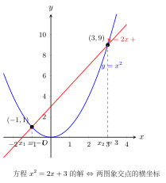

# 数形结合

## 一例速记

$$x^2 - 4 = |x| \xrightarrow{\text{画图}} y = x^2 - 4 \text{（抛物线）与} \; y = |x| \text{（V形）交点个数} = \text{方程实数解个数}$$

纯代数分类讨论需要解两个二次方程筛四个候选根；数形结合画图一眼看出交点是 **2 个**，省去三分之二的计算。**数形结合的本质：把难算的"数"翻译成直观的"形"，再把形给出的答案翻译回"数"。**

---

## 一、数形结合——代数最高境界

代数里的"数"指的是代数式、方程、不等式——这些都是符号语言，抽象而精确。代数里的"形"指的是函数图象、数轴、坐标系——这些是图形语言，直观但需要构造。

**数形结合**就是在这两种语言之间来回翻译：

- **数 → 形**：把抽象的方程 / 不等式 / 代数式转化为图上可见的点、线、区域，让眼睛帮大脑做判断。
- **形 → 数**：把图象上读出的坐标、交点、趋势转化为代数式和方程，让"形"的直觉给出"数"的结论。

为什么说它是最高境界？因为它不是一种具体的计算技巧，而是一种思维模式的切换。会数形结合的人，面对同一道题能看到两个版本——符号版和图象版——并且在两个版本之间自由切换，选用更容易的那个。

---

## 二、数 → 形 的 4 类常用

### 类型 1：方程 → 图象交点

**原理**：方程 $f(x) = g(x)$ 的实数解 $x_0$ 在几何上就是函数 $y = f(x)$ 与 $y = g(x)$ 两条曲线的交点的横坐标。

**解方程个数、根的存在性、根的大致范围**，都可以用两条曲线的交点来分析。

**例**：方程 $x^2 - x - 2 = 0$ 有几个实数根？

画 $y = x^2 - x$（开口向上抛物线，顶点 $\left(\dfrac{1}{2}, -\dfrac{1}{4}\right)$）和 $y = 2$（水平直线），交点有 2 个，所以方程有 2 个实数根。

**延伸**：含参方程 $x^2 = kx + 2$ 有两个不相等实数根等价于直线 $y = kx + 2$ 与抛物线 $y = x^2$ 有两个交点，从图象斜率范围反推 $k$ 的范围。

---

### 类型 2：不等式 → 图象比较

**原理**：不等式 $f(x) > g(x)$ 的解集是图象 $y = f(x)$ 在 $y = g(x)$ 上方时，对应的 $x$ 的区间。

**例**：解不等式 $x^2 - 2x - 3 < 0$

改写为 $x^2 - 2x < 3$，即 $y = x^2 - 2x$ 在 $y = 3$ 下方的 $x$ 范围。

先解 $x^2 - 2x = 3$，得 $x = -1$ 或 $x = 3$。抛物线开口向上，在 $-1 < x < 3$ 时图象低于水平线 $y = 3$，故解集为 $(-1, 3)$。

---

### 类型 3：绝对值 → 数轴距离

**原理**：$|x - a|$ 在数轴上表示点 $x$ 到点 $a$ 的距离。这是绝对值最本质的几何意义。

**常用变形**：

- $|x - a| < r$ 的解集是以 $a$ 为中心、半径为 $r$ 的开区间 $(a-r, a+r)$
- $|x - a| + |x - b|$ 表示数轴上 $x$ 到 $a$ 和到 $b$ 两点的距离之和
  - 最小值 = $|a - b|$（当 $x$ 在 $a, b$ 之间时取到）

**例**：$|x - 1| + |x + 3|$ 的最小值是多少？

数形结合：$|x-1|$ = $x$ 到 1 的距离，$|x+3| = |x - (-3)|$ = $x$ 到 $-3$ 的距离，两距离之和的最小值 = 两点间距离 = $|1 - (-3)| = 4$，当 $x \in [-3, 1]$ 时取到。

---

### 类型 4：二次三项式正负 → 抛物线与 $x$ 轴关系

**原理**：二次三项式 $ax^2 + bx + c$ 的正负由抛物线 $y = ax^2 + bx + c$ 与 $x$ 轴的位置关系决定：

| 情形 | 图象特征 | $ax^2 + bx + c$ 的符号 |
|---|---|---|
| $\Delta > 0$ | 抛物线与 $x$ 轴有两个交点 $x_1 < x_2$ | $a > 0$ 时，$x_1 < x < x_2$ 时式为负，其余为正 |
| $\Delta = 0$ | 抛物线与 $x$ 轴相切于一点 | $a > 0$ 时，式 $\geq 0$，仅切点处为零 |
| $\Delta < 0$ | 抛物线与 $x$ 轴无交点 | $a > 0$ 时，式恒正；$a < 0$ 时，式恒负 |

**例**：$x^2 - 5x + 6 = (x-2)(x-3)$，$a = 1 > 0$，$x_1 = 2, x_2 = 3$，所以 $x^2 - 5x + 6 < 0$ 的解集为 $(2, 3)$。

---

## 三、形 → 数 的 4 类常用

### 类型 1：图象题求未知 → 待定系数法

**原理**：函数图象包含了解析式的全部信息。图上每一个点 $(a, b)$ 都满足 $b = f(a)$，把已知点代入"含参的解析式"，就得到关于参数的方程。

**例**：一次函数 $y = kx + b$ 的图象过 $(1, 3)$ 和 $(2, 5)$，求 $k$ 和 $b$。

$$\begin{cases} k + b = 3 \\ 2k + b = 5 \end{cases} \implies k = 2, b = 1$$

形（两个已知点）→ 数（两个方程）→ 数（解出参数）。

---

### 类型 2：几何题求长度 → 设坐标 + 距离公式

**原理**：把几何图形放进坐标系，用代数工具（两点距离公式、中点公式、斜率公式）代替纯几何论证，把"形"的问题转化为"数"的计算。

**例**：等腰直角三角形，直角顶点在原点，两直角边在坐标轴上，斜边长为 $\sqrt{2}$，求斜边中点到原点的距离。

设直角边长为 $a$，则斜边顶点为 $(a, 0)$ 和 $(0, a)$，斜边长 $= a\sqrt{2} = \sqrt{2}$，故 $a = 1$。

斜边中点为 $\left(\dfrac{1}{2}, \dfrac{1}{2}\right)$，到原点距离 $= \sqrt{\dfrac{1}{4} + \dfrac{1}{4}} = \dfrac{\sqrt{2}}{2}$。

这比纯几何论证简洁得多。

---

### 类型 3：动态几何 → 函数关系

**原理**：几何中的"动点问题"——点在图形上移动时，某量（面积、长度、比值）随之变化——可以用"动点坐标"为自变量建立函数，把"形"的变化规律转化为"数"的函数关系。

**例**：点 $P$ 在线段 $AB$（$A(0,0), B(4,0)$）上移动，设 $AP = x$（$0 \leq x \leq 4$）。以 $AP$ 为边长的正方形面积 $S_1 = x^2$，以 $PB = 4 - x$ 为边长的正方形面积 $S_2 = (4-x)^2$。

面积之和 $S = x^2 + (4-x)^2 = 2x^2 - 8x + 16 = 2(x-2)^2 + 8$，当 $x = 2$ 时最小，$S_{\min} = 8$。

动点问题通过建立函数，转化为求函数最值，是数形结合的典型应用。

---

### 类型 4：图象交点存在性 → 联立方程判别式

**原理**：两个函数图象有交点，等价于它们对应的方程组有实数解；交点个数等于方程组实数解的个数，由判别式决定。

**例**：直线 $y = kx + 1$ 与抛物线 $y = x^2$ 有两个交点，求 $k$ 的范围。

联立：$kx + 1 = x^2 \Rightarrow x^2 - kx - 1 = 0$

$\Delta = k^2 + 4 > 0$，恒成立，所以对任意实数 $k$，直线与抛物线恒有两个交点。

**延伸**：若是"直线 $y = kx$ 与抛物线 $y = x^2 - x + 1$ 相切"，即只有一个交点，则 $\Delta = 0$，由此求 $k$。

---

## 四、演示：数 → 形——$x^2 - 4 = |x|$ 的解的个数

**题目**：方程 $x^2 - 4 = |x|$ 有几个实数解？

> "这道题纯代数做法：分 $x \geq 0$ 和 $x < 0$ 两类，各解一个二次方程，加上检验，步骤繁琐。
>
> **换一种眼光**：把等式两边看成两个函数：$f(x) = x^2 - 4$（抛物线）和 $g(x) = |x|$（V 形折线）。
>
> 方程的实数解 = 两者图象的交点横坐标，交点数 = 实数解的个数。
>
> **描述 $y = x^2 - 4$ 的图象**：开口向上的抛物线，顶点在 $(0, -4)$，与 $x$ 轴交于 $(-2, 0)$ 和 $(2, 0)$，与 $y$ 轴交于 $(0, -4)$。
>
> **描述 $y = |x|$ 的图象**：V 形折线，顶点在原点 $(0, 0)$，两支斜率分别为 $+1$ 和 $-1$。
>
> **分析两者位置关系**：
>
> 在 $x = 0$ 处：$f(0) = -4 < 0 = g(0)$，V 形在抛物线上方。
>
> 在 $x = 2$ 处：$f(2) = 0 = g(2) = 2$？不对，$f(2) = 0$，$g(2) = 2$，仍是 V 形在上方。
>
> 在 $x = 3$ 处：$f(3) = 5 > g(3) = 3$，此时抛物线在 V 形上方。
>
> 所以在 $x \in (2, 3)$ 之间某处，两者相交。由对称性，$x < 0$ 一侧也有一个交点。
>
> **结论**：恰好 2 个交点，方程有 **2 个实数解**。"

**验证**（可选）：令 $x > 0$，$x^2 - x - 4 = 0$，$x = \dfrac{1 + \sqrt{17}}{2} \approx 2.56$（正数，有效）；令 $x < 0$，$x^2 + x - 4 = 0$，$x = \dfrac{-1 - \sqrt{17}}{2} \approx -2.56$（负数，有效）。确实 2 个解，与图形分析一致。

---

## 五、演示：形 → 数——由抛物线图象求参数

**题目**：抛物线 $y = x^2 + bx + c$ 经过 $(1, 0)$ 和 $(3, 0)$，求 $b, c$ 的值。

> "图象告诉我：抛物线与 $x$ 轴在 $(1, 0)$ 和 $(3, 0)$ 处相交。
>
> 这意味着 $x = 1$ 和 $x = 3$ 是方程 $x^2 + bx + c = 0$ 的两个根。
>
> **形 → 数**：两个交点横坐标就是方程的两根 $x_1 = 1$，$x_2 = 3$。
>
> 立刻用韦达定理：
>
> $$x_1 + x_2 = -b \implies 1 + 3 = -b \implies b = -4$$
>
> $$x_1 x_2 = c \implies 1 \times 3 = c \implies c = 3$$
>
> 答：$b = -4$，$c = 3$。"

**验证**：$y = x^2 - 4x + 3 = (x-1)(x-3)$，确实过 $(1, 0)$ 和 $(3, 0)$。

这道题若用代入法：将 $(1, 0)$ 和 $(3, 0)$ 代入方程组，解含两个未知数的线性方程组，运算量相当；韦达法更快，但它建立在"形 → 数：交点 = 根"这个翻译上。

---

## 六、思考路标

**路标 1**：见"解方程/不等式"但代数困难 → 考虑**把左右两边各看成一个函数画图**，用图象交点/相对位置给出答案。

**路标 2**：见"含绝对值的方程/不等式" → 翻译成**数轴上的距离语言**，$|x - a| < r$ 就是以 $a$ 为中心半径 $r$ 的区间，直接写解集，无需分类讨论。

**路标 3**：见"函数/抛物线过某点" → 坐标代入函数解析式，形给出了数（坐标），数给出了方程（待定系数）。

**路标 4**：见"动点问题" → 设动点位置为参数 $t$（或 $x$），把几何量（面积、长度）写成 $t$ 的函数，再用函数最值方法求解。

**路标 5**：见"方程有解 / 无解 / 解的个数" + "方程含参" → 翻译为图象有交点/无交点，用**判别式 $\Delta$ 的正负**判断，比纯代数分析更直观。

**路标 6**：见"两根都在某区间" → 画出抛物线草图，用轴的位置（$-\dfrac{b}{2a}$ 在区间内）+ 端点函数值的符号 + $\Delta$ 三个条件联立，这是"形"的几何直觉转化成"数"的代数条件。

**路标 7**：见"证明不等式/恒成立" → 考虑等价地问"某函数值恒大于某值吗"，用**顶点（最小值）的位置**判断，配方或判别式两种路径。

---

## 七、典型应用例题

### 例 1：用数形结合判断解的个数

**题目**：方程 $2x - 1 = x^2 - 2$ 有几个实数解？

**思路**：

> "左边 $y = 2x - 1$ 是斜率为 2 的直线，右边 $y = x^2 - 2$ 是顶点为 $(0, -2)$ 的开口向上抛物线。
>
> 直线与抛物线的交点个数 = 解的个数。
>
> 联立：$x^2 - 2x - 1 = 0$，$\Delta = 4 + 4 = 8 > 0$，两个不同实数交点，方程有 **2 个实数解**。
>
> 解为 $x = 1 \pm \sqrt{2}$。"

---

### 例 2：形 → 数——由图象信息求二次函数表达式

**题目**：二次函数的图象开口向上，顶点为 $(-1, -3)$，且过点 $(0, -2)$，求函数解析式。

**思路**：

形已知顶点，用顶点式：$y = a(x + 1)^2 - 3$

代入 $(0, -2)$（形 → 数）：$-2 = a(0+1)^2 - 3 = a - 3$，所以 $a = 1$。

解析式：$y = (x+1)^2 - 3 = x^2 + 2x - 2$

**验证**：$a = 1 > 0$，开口向上；顶点 $(-1, -3)$ 正确；代入 $(0, -2)$：$y = 0 + 0 - 2 = -2$，正确。

---

### 例 3：数形结合解含绝对值不等式

**题目**：解不等式 $|2x - 1| + |x + 1| \leq 5$。

**数轴距离思路**：

$|2x - 1| = 2\left|x - \dfrac{1}{2}\right|$ = 2 倍的 $x$ 到 $\dfrac{1}{2}$ 的距离；$|x + 1| = |x - (-1)|$ = $x$ 到 $-1$ 的距离。

直接代数分三段讨论（$x < -1$，$-1 \leq x < \dfrac{1}{2}$，$x \geq \dfrac{1}{2}$）：

- $x < -1$：$(1 - 2x) + (-x - 1) = -3x \leq 5 \Rightarrow x \geq -\dfrac{5}{3}$，故 $-\dfrac{5}{3} \leq x < -1$。
- $-1 \leq x < \dfrac{1}{2}$：$(1 - 2x) + (x + 1) = -x + 2 \leq 5 \Rightarrow x \geq -3$，区间内所有 $x$ 满足。
- $x \geq \dfrac{1}{2}$：$(2x - 1) + (x + 1) = 3x \leq 5 \Rightarrow x \leq \dfrac{5}{3}$，故 $\dfrac{1}{2} \leq x \leq \dfrac{5}{3}$。

合并：$x \in \left[-\dfrac{5}{3}, \dfrac{5}{3}\right]$。

---

## 八、自测题

**第 1 题**：用数形结合（画图分析）判断方程 $x^2 + x + 1 = 0$ 的实数解个数，并说明理由。

💡 提示：计算判别式 $\Delta = 1 - 4 = -3 < 0$，同时画 $y = x^2 + x + 1$（配方得顶点），思考图象与 $x$ 轴的关系，并验证两种方法结论一致。

**第 2 题**：利用绝对值的数轴距离意义，直接写出 $|x - 3| \leq 2$ 的解集，不得分类讨论。

💡 提示：$|x - 3| \leq 2$ 意为 $x$ 到 3 的距离不超过 2，画数轴找出满足条件的 $x$ 的范围。

**第 3 题**：二次函数 $y = x^2 + bx + c$ 的图象与 $x$ 轴交于 $(-1, 0)$ 和 $(4, 0)$，求 $b, c$ 的值，并写出顶点坐标。

💡 提示：由形（两个 $x$ 轴交点）得数（两根 $x_1 = -1, x_2 = 4$），用韦达定理求 $b, c$；顶点横坐标为两根的平均数。

**第 4 题**：直线 $y = kx - 1$ 与抛物线 $y = x^2 - 2x + 3$ 有两个不同交点，求 $k$ 的范围。

💡 提示：联立两式得关于 $x$ 的二次方程，用 $\Delta > 0$ 的条件求 $k$ 的范围（注意最高次系数为 1，不需讨论是否退化为一次）。
