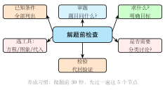

# 开题前的自检清单

## 一、为什么需要"开题清单"

大多数同学在代数题前卡住，真正的原因并不是"不会"，而是**开始算得太早**。题目还没读清楚，结构还没辨认，设元还没想好，笔尖就已经急着展开乘法、移项通分。结果是：写了满页草稿，回头一看方向就错了；或者绕了一大圈，发现题目里明明给的已知条件根本没被用上。

经验告诉我们一个反直觉的结论：**在草稿纸上花 5 分钟做有结构的思考，远远胜过 30 分钟的盲目乱算**。盲目尝试不仅浪费时间，还会让思路越来越乱，把原本能看出的结构反而被繁杂的算式遮住。

这一篇给出一份**代数题开题 7 问**——在动笔之前必须过一遍的自检清单。它不替你解任何具体的题，但它能保证你**不在错误的方向上浪费时间**，并且以最短路径找到突破口。

---

## 二、开题 7 问

### Q1. 这是什么类型的题？

**为什么问**：题型决定大方向。一元二次方程的解法和不等式解法完全不同；化简题不需要设元；函数题可能要用图象；应用题需要先建立等量关系。认错题型，所有后续步骤都会跑偏。

**怎么问**：对照以下五大类，先框定一个：

| 类型 | 关键词 / 标志 |
|---|---|
| 方程（组）题 | 含"$=$"，求 $x$、解方程 |
| 不等式题 | 含"$<, >, \leq, \geq$"，求解集或范围 |
| 函数题 | 含"$f(x) =, y =$"，求最值、图象交点、解析式 |
| 应用题 | 文字叙述实际问题，需设元列方程 |
| 化简求值题 | 化简代数式，或给条件求代数式的值 |

**典型例子**：拿到"解不等式 $x^2 - 3x + 2 \leq 0$"，立刻认定：**不等式题**，目标是写出解集，结果形式是区间或不等式，不是一个数。

---

### Q2. 题目里的代数式是什么结构？

**为什么问**：结构决定方法。同一道题，识别出"二次三项式"就用配方 / 十字 / 求根公式；识别出"平方差"就直接因式分解；识别出"分式"就想到去分母 + 检验增根。不识结构，就像拿着螺丝刀对着钉子。

**怎么问**：对照 [思维工具箱 07 篇（结构识别）](07-structure-recognition.md) 的 8 种结构扫描一遍——

- 二次三项式 $ax^2 + bx + c$？
- 完全平方 $a^2 \pm 2ab + b^2$？
- 平方差 $a^2 - b^2$？
- 倒数和 $x + \dfrac{1}{x}$？
- 分式方程（分母含未知）？
- 含绝对值 $|f(x)|$？
- 含参字母（参数影响次数 / 系数符号）？

**典型例子**：看到 $x^2 - 4x + 4$，识别为完全平方 $(x-2)^2$，立刻知道可以直接开方。看到 $\dfrac{2}{x-1} + 1 = \dfrac{x}{x+1}$，识别为分式方程，知道第一步是找公分母去分母、第二步是检验增根。

---

### Q3. 题目里有几个未知量？有几个等量关系？

**为什么问**：这是判断"能不能列方程"、"需要几个方程"的基本盘。等量关系数 ≥ 未知量数，才能组成足够的方程组求解；如果等量关系不够，说明题目还有隐含条件没挖出来。

**怎么问**：把所有"未知的量"列出来（不一定都要设元，但要心里有数）；把所有"已知的等量关系"列出来——题目明说的 + 由题意隐含的（如"总价 = 单价 × 数量"、"行程 = 速度 × 时间"、"甲工作量 + 乙工作量 = 总工作量"等）。

**典型例子**：一道工程题，"甲独做 10 天，乙独做 15 天，两人合做几天完成"——只有 1 个未知量（合做天数 $t$），2 个等量关系可用（甲的效率 + 乙的效率 = 合做效率，或者甲完成量 + 乙完成量 = 1）。用任一等量关系列出 1 个方程，能解。

---

### Q4. 设元应该设谁？直接设还是间接设？

**为什么问**：设元是应用题最关键的一步，设得好方程简单，设得差方程复杂甚至列不出来。

**怎么问**：参考 [思维工具箱 04 篇（设元的艺术）](04-setting-up-equations.md) 的三类策略——

- **直接设**：题目问什么就设什么（"求速度"→ 设速度为 $v$）
- **间接设**：直接设导致方程难列时，设一个更基础的中间量（如"两人速度比为 3:5"→ 设两人速度分别为 $3k, 5k$ 千米/时）
- **多设少减**：先多设，再通过等量关系减掉多余的元

**典型例子**：求"某数的两倍加 5 等于 17"，直接设"某数为 $x$"，列方程 $2x + 5 = 17$，一步。不要设"两倍后的数为 $y$"再转换，那是绕弯子。

---

### Q5. 是否需要先化简代数式，再处理？

**为什么问**：很多题看起来很复杂，其实做一步预处理（通分、因式分解、有理化、展开）之后，真正的核心方程或不等式就露出来了。先化简后解题，事半功倍。

**怎么问**：观察题目中的代数式，问自己：

- 分式能通分化简吗？
- 有公因式可以提取吗？
- 有可以展开的乘积式吗？
- 有嵌套的根号或绝对值能先处理吗？
- 有"整体"能用整体思想代入吗（参见 [05 篇整体思想](05-integral-thinking.md)）？

**典型例子**：题目给出"已知 $x^2 + y^2 - 4x - 6y + 13 = 0$，求 $x + y$ 的值"——先配方化简：$(x-2)^2 + (y-3)^2 = 0$，由非负性得 $x = 2, y = 3$，$x + y = 5$。若一上来就尝试其他方法，反而走弯路。

---

### Q6. 用哪种方法解？有几种备选？选哪个最快？

**为什么问**：很多题有多种解法，但难易差很多。提前想清楚备选方法并选最快的，不仅省时间，还能减少出错。

**怎么问**：按题型列出备选解法，根据题目特点（如系数大小、是否含参、结构识别结果）选择——

**一元二次方程的四种方法对比**：

| 方法 | 适用情形 | 例子 |
|---|---|---|
| 直接开平方 | $ax^2 = c$ 型，无一次项 | $x^2 = 9 \Rightarrow x = \pm 3$ |
| 因式分解 | 能快速分解（十字相乘或公式） | $x^2 - 5x + 6 = 0 \Rightarrow (x-2)(x-3) = 0$ |
| 配方法 | 一次项系数为偶数，或需要顶点式 | $x^2 + 4x - 5 = 0$ 配方 |
| 求根公式 | 其他情形，兜底方案 | $2x^2 - 3x + 1 = 0$ |

**不等式的选法**：一次不等式直接解；含绝对值先考虑数轴距离法；含参数先分类讨论。

**典型例子**：解 $x^2 - 25 = 0$，识别为"无一次项"→ 直接开平方：$x^2 = 25 \Rightarrow x = \pm 5$，不需要求根公式。

---

### Q7. 答案需要什么形式？是否需要分类讨论或验证？

**为什么问**：写出来的"解"不一定都是最终答案。分式方程要验增根；含参问题要按情形分类写；应用题要验证实际意义（正数、整数、在合理范围内）；不等式的解要写成集合或区间，不能只写一个数。

**怎么问**：在写完解之前，过一遍以下清单——

- 这是分式方程吗？→ **必须检验增根**（把解代回原分式方程，检查分母是否为零）
- 这是含参问题吗？→ **分类写结论**，每种情形对应的答案独立写出
- 这是应用题吗？→ **验证实际意义**（速度 $> 0$？天数为正整数？人数为正整数？）
- 这是不等式吗？→ 写**解集**（区间或不等式形式），不是写一个点
- 题目有"取整数解"的要求吗？→ 从连续的解集里筛出整数

**典型例子**：解分式方程 $\dfrac{2}{x-1} + \dfrac{1}{x+1} = 1$，求得 $x = 3$ 和 $x = -1$——代入检验：$x = -1$ 使分母 $x + 1 = 0$，是增根，舍去；最终答案只有 $x = 3$。

---

## 三、清单使用示范

用一道中档题，按 Q1 → Q7 完整走一遍：

**题目**：解分式方程 $\dfrac{2}{x-1} + \dfrac{1}{x+1} = 1$

---

**Q1. 这是什么类型的题？**

> 含有等号，且分母含有未知数 $x$，这是**分式方程题**。目标是求 $x$ 的值。

---

**Q2. 代数式是什么结构？**

> 左边两个分式，分母分别是 $x-1$ 和 $x+1$——这是**分式方程的标准结构**。
>
> 对照结构识别口诀：见分式方程 → 去分母 + 检验增根。方法已经确定。

---

**Q3. 有几个未知量？几个等量关系？**

> 只有 1 个未知量 $x$。
>
> 等量关系就是题目给出的等式本身：1 个等式对 1 个未知量，可以解。

---

**Q4. 设元？**

> 本题是方程题而非应用题，不需要设元——直接解方程。

---

**Q5. 是否需要先化简？**

> 先通分去分母。最简公分母（LCD）= $(x-1)(x+1)$。
>
> 两边同乘 $(x-1)(x+1)$（注意：前提是 $x \neq 1$ 且 $x \neq -1$）：
>
> $$2(x+1) + (x-1) = (x-1)(x+1)$$
>
> $$2x + 2 + x - 1 = x^2 - 1$$
>
> $$3x + 1 = x^2 - 1$$
>
> $$x^2 - 3x - 2 = 0$$
>
> 化简完成，变成一元二次方程。

---

**Q6. 用哪种方法解 $x^2 - 3x - 2 = 0$？**

> 尝试因式分解：需找两数乘积为 $-2$、和为 $-3$，无整数解。
>
> 退而用求根公式（兜底方案）：
>
> $$\Delta = 9 + 8 = 17 > 0$$
>
> $$x = \frac{3 \pm \sqrt{17}}{2}$$

---

**Q7. 答案形式？需要验证吗？**

> 这是分式方程，**必须检验增根**。
>
> 令分母为零的值：$x = 1$ 和 $x = -1$。
>
> 两个解 $x = \dfrac{3 + \sqrt{17}}{2} \approx 3.56$ 和 $x = \dfrac{3 - \sqrt{17}}{2} \approx -0.44$，均不等于 $1$ 或 $-1$，所以两个解均有效。
>
> **最终答案**：$x = \dfrac{3 \pm \sqrt{17}}{2}$

---

**总结**：全程 7 问走下来，没有一步是乱的——Q1 确定题型，Q2 确定结构（分式方程），Q2 自动给出方法（去分母），Q5 完成预处理（化为二次方程），Q6 选最适合的解法（求根公式），Q7 完成检验。这就是开题清单的价值：**把隐含的思维流程显式化，不遗漏任何关键步骤**。

---

## 四、把清单内化

**第一阶段（前 1～2 周）**：在草稿纸右上角郑重写下"Q1～Q7"七个标题，每道题都逐项填写答案，哪怕只是一两个字。目的是把流程刻进肌肉记忆。这个阶段会感觉慢，没关系——慢中建立结构，比快中乱算强得多。

**第二阶段（2～3 周后）**：不再需要写出标题，但在落笔之前，脑子里快速默过一遍。这默想的 30 秒看起来短，却能救回大约 **80% 的"卡题"情形**——大多数卡，不是因为题难，而是因为遗漏了一条等量关系、设元方向搞反、或者忘了检验增根。

**第三阶段（一两个月后）**：7 问内化为本能。拿到题，眼睛会自动扫题型、扫结构、扫未知量和等量关系，脑子里的"设元方案"和"备选解法"几乎同步涌现。此时开题清单已经不再是"清单"，而是一种看题的方式。

---

### 与其他工具箱的连接

开题清单并不是孤立的——它是整个思维工具箱的**指挥中枢**：

- Q2（结构识别）调用 → [07 篇结构识别](07-structure-recognition.md)
- Q4（设元策略）调用 → [04 篇设元的艺术](04-setting-up-equations.md)
- Q5（整体思想）调用 → [05 篇整体思想](05-integral-thinking.md)
- Q6（方法选择）调用 → [01 篇换元](01-when-to-substitute.md)、[02 篇配方](02-when-to-complete-square.md)、[03 篇判别式与韦达](03-discriminant-and-vieta.md)
- Q7（含参分类）调用 → [08 篇含参策略](08-parameter-strategy.md)
- Q7（数形结合验证）调用 → [09 篇数形结合](09-number-shape-combination.md)

学会这份清单，也就学会了如何在解题现场**精准调用**工具箱里的所有工具。

---

呼应序言里说过的那句话：**代数不是死记，是看清结构、选对变形。** 把"开题 7 问"养成习惯，你就已经把大多数只会硬算的同学甩在了身后。
