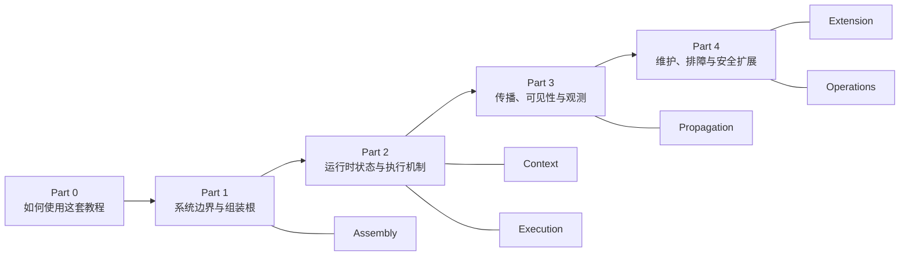

# Deep Agents / LangGraph / LangChain Internal 教程

## 项目简介

这份教程把 `deepagents` 放回它真实依赖的三层栈里来解释：

- `LangChain / langchain-core` 提供 model、tool、callback、`RunnableConfig` 以及 middleware hook surface
- `LangGraph` 提供 graph runtime、subgraph、checkpoint、streaming、`Runtime` / `ToolRuntime`
- `Deep Agents` 在前两层之上完成本地装配，组织 filesystem、todo、skills、subagent、permissions、profiles 等 maintainer 关心的默认策略

因此，这不是单仓库的功能导览，而是一份系统教程：它回答责任边界在哪里、行为沿哪条线传播、问题应该修在哪一层。

## 三层图例

后续章节会反复使用这三个 ownership 标签：

| 标签 | 这层负责什么 | 典型源码位置 |
| --- | --- | --- |
| `LangChain` | 模型调用、tool 执行、callback manager、`RunnableConfig`、agent middleware 抽象 | `langchain/libs/core/langchain_core/`、`langchain/libs/langchain_v1/langchain/agents/` |
| `LangGraph` | state graph、Pregel runtime、subgraph、checkpoint、stream mode、`Runtime` / `ToolRuntime` | `langgraph/libs/langgraph/langgraph/`、`langgraph/libs/prebuilt/` |
| `Deep Agents` | `create_deep_agent()` 装配、默认 middleware 栈、backend/profile 策略、subagent policy、permissions | `deepagents/libs/deepagents/deepagents/` |

如果某个行为解释不清，先判断它首先属于哪一层，再看另外两层是扩展、传播还是装配。

## 如何使用这套教程

这套教程提供两套入口：

- 纵向入口：按 Part 顺序建立系统地图，从边界、运行时到维护动作逐层展开
- 横向入口：按 Assembly、Context、Execution、Propagation、Extension、Operations 六个主题定位问题

### 路径 A：顺着学

适合第一次系统阅读，目标是先建立稳定术语，再进入具体 case：

1. 从 [前言：如何使用本教程](./00-preface.md) 读起，先接受全书的阅读契约
2. 进入 Part 1，先厘清三层 ownership、仓库边界和 `create_deep_agent()` 这条装配根
3. 进入 Part 2，理解 state、subagent、context、execution 这些运行时机制如何工作
4. 进入 Part 3，专门处理 config、callback、stream、visibility、observation 这类最容易混淆的传播问题
5. 进入 Part 4，用维护任务视角收束：扩展能力、补测试、排故障、控制安全边界
6. 最后结合附录，把 examples、测试矩阵和排障清单当成日常工作入口

### 路径 B：按问题查

适合已经在维护代码、只想快速定位入口：

- 想确认某个能力落在哪层：先看 Part 1
- 想判断 state、subagent、tool runtime 怎么执行：先看 Part 2
- 想排 callback、config、stream、visibility 问题：先看 Part 3
- 想做能力扩展、升级适配、测试补强或排障：先看 Part 4
- 想快速查具体文件、验证清单或 examples：直接跳附录

## 六个横向主题

| 主题 | 核心问题 | 推荐入口 |
| --- | --- | --- |
| `Assembly` | Deep Agents 只是装配根，还是引入了新的本地 contract | [第1章](./part1-foundations/01-what-deepagents-builds.md)、[第2章](./part1-foundations/02-repo-map-and-package-boundaries.md)、[第3章](./part1-foundations/03-create-deep-agent-as-assembly-root.md) |
| `Context` | state、memory、prompt、profile、permissions 分别由谁拥有 | [第4章](./part2-core-runtime/04-filesystem-and-state-model.md)、[第6章](./part2-core-runtime/06-memory-skills-and-system-prompt-layering.md) |
| `Execution` | tool、subagent、graph runtime、checkpoint、interrupt 是怎么跑起来的 | [第4章](./part2-core-runtime/04-filesystem-and-state-model.md)、[第7章](./part2-core-runtime/07-subagents-and-context-isolation.md)、[第8章](./part2-core-runtime/08-summarization-permissions-and-safety-boundaries.md) |
| `Propagation` | callbacks、config、messages、stream events 究竟沿哪条线传播 | [第7章](./part2-core-runtime/07-subagents-and-context-isolation.md)、[第6章](./part2-core-runtime/06-memory-skills-and-system-prompt-layering.md)、[附录 D](./appendix/propagation-and-visibility-cheatsheet.md) |
| `Extension` | backend、provider profile、middleware、新 capability 应该怎么安全扩展 | [第13章](./part4-maintenance-and-extension/13-backend-protocol-and-storage-strategy.md)、[第14章](./part4-maintenance-and-extension/14-provider-profiles-and-model-routing.md)、[第17章](./part4-maintenance-and-extension/17-how-to-add-a-new-capability-safely.md) |
| `Operations` | 维护者如何测试、升级、排障，并从 examples 反推系统行为 | [第15章](./part4-maintenance-and-extension/15-testing-the-harness.md)、[第16章](./part4-maintenance-and-extension/16-reading-the-examples-like-a-maintainer.md)、[附录 B](./appendix/test-matrix.md)、[附录 E](./appendix/troubleshooting-playbook.md) |

## 章节导航

### Part 0：如何使用这套教程

- [前言：如何使用本教程](./00-preface.md)

### Part 1：系统边界与组装根

- [第1章：这一栈到底在构建什么](./part1-foundations/01-what-deepagents-builds.md)
- [第2章：仓库地图与包边界](./part1-foundations/02-repo-map-and-package-boundaries.md)
- [第3章：create_deep_agent 作为装配根](./part1-foundations/03-create-deep-agent-as-assembly-root.md)

### Part 2：运行时状态与执行机制

- [第4章：Filesystem 与状态模型](./part2-core-runtime/04-filesystem-and-state-model.md)
- [第7章：Subagents、拦截边界与上下文隔离](./part2-core-runtime/07-subagents-and-context-isolation.md)

### Part 3：传播、可见性与观测

- [第6章：Memory、Skills、Prompt Layering 与 Config 传播](./part2-core-runtime/06-memory-skills-and-system-prompt-layering.md)
- [第8章：Summarization、Streaming、Permissions 与安全边界](./part2-core-runtime/08-summarization-permissions-and-safety-boundaries.md)

### Part 4：维护、排障与安全扩展

- [第13章：Backend 协议与存储策略](./part4-maintenance-and-extension/13-backend-protocol-and-storage-strategy.md)
- [第14章：Provider Profiles、模型路由与 Middleware Surface](./part4-maintenance-and-extension/14-provider-profiles-and-model-routing.md)
- [第15章：如何测试一个 Harness](./part4-maintenance-and-extension/15-testing-the-harness.md)
- [第16章：像维护者一样阅读 examples](./part4-maintenance-and-extension/16-reading-the-examples-like-a-maintainer.md)
- [第17章：如何安全地新增一种能力](./part4-maintenance-and-extension/17-how-to-add-a-new-capability-safely.md)

### 附录

- [附录 A：代码阅读检查表](./appendix/code-reading-checklist.md)
- [附录 B：测试矩阵](./appendix/test-matrix.md)
- [附录 C：Examples 索引与阅读顺序](./appendix/examples-index.md)
- [附录 D：传播与可见性速查表](./appendix/propagation-and-visibility-cheatsheet.md)
- [附录 E：Troubleshooting Playbook](./appendix/troubleshooting-playbook.md)

## 统一分析框架

全书默认使用同一套 maintainer 问法：

1. 这个行为首先属于 `LangChain`、`LangGraph` 还是 `Deep Agents`
2. 它通过哪条线传播：state、messages、callbacks/config、stream events，还是 prompt / policy 注入
3. 外部能否观测到它；如果能，是通过 trace、stream、state 还是测试断言
4. 它是上游稳定 contract、本地装配策略，还是当前实现细节
5. 出问题时应该修在哪层，并且最小验证闭环是什么

如果一章不能帮助你回答这五个问题，它就没有完成维护者教程的职责。

## 维护者任务入口

按工作任务进入时，建议直接跳到这里：

| 任务 | 先看哪里 | 目的 |
| --- | --- | --- |
| 判断 bug 应修上游还是修本地 harness | [第2章](./part1-foundations/02-repo-map-and-package-boundaries.md)、[第3章](./part1-foundations/03-create-deep-agent-as-assembly-root.md) | 先划清 ownership 和 assembly 边界 |
| 排 callback / config / stream 可见性问题 | [第7章](./part2-core-runtime/07-subagents-and-context-isolation.md)、[第6章](./part2-core-runtime/06-memory-skills-and-system-prompt-layering.md)、[第8章](./part2-core-runtime/08-summarization-permissions-and-safety-boundaries.md)、[附录 D](./appendix/propagation-and-visibility-cheatsheet.md) | 明确传播链和观测点 |
| 新增 backend、profile、middleware 或 capability | [第13章](./part4-maintenance-and-extension/13-backend-protocol-and-storage-strategy.md)、[第14章](./part4-maintenance-and-extension/14-provider-profiles-and-model-routing.md)、[第17章](./part4-maintenance-and-extension/17-how-to-add-a-new-capability-safely.md) | 判断落层、边界和安全扩展方式 |
| 补测试或做升级回归 | [第15章](./part4-maintenance-and-extension/15-testing-the-harness.md)、[附录 B](./appendix/test-matrix.md) | 明确最小验证矩阵 |
| 从 examples 反推系统行为 | [第16章](./part4-maintenance-and-extension/16-reading-the-examples-like-a-maintainer.md)、[附录 C](./appendix/examples-index.md) | 把样例转换为源码入口 |
| 做故障定位或维护值班 | [附录 E](./appendix/troubleshooting-playbook.md) | 快速获得排障入口和观察点 |

## 高频问题索引

- `create_deep_agent()` 是新 runtime 吗：不是。它是把 LangChain 与 LangGraph 的现成能力装配成默认 harness 的 assembly root；详见 [第3章](./part1-foundations/03-create-deep-agent-as-assembly-root.md)。
- subagent 的事件为什么外层能看到，但父级 middleware 不一定能拦截：可见性和拦截边界不是同一个问题；先读 [第7章](./part2-core-runtime/07-subagents-and-context-isolation.md) 与 [第8章](./part2-core-runtime/08-summarization-permissions-and-safety-boundaries.md)。
- callback / config 传播异常该先查哪层：先确认入口点在 `langchain_core` 还是 `langgraph`，再回看 Deep Agents 是否只是在透传或加策略；详见 [第6章](./part2-core-runtime/06-memory-skills-and-system-prompt-layering.md)。
- 新能力应该做成上游 primitive 还是本地 policy：先判断是否需要跨 harness 复用。如果只是 Deep Agents 的默认策略，用本地扩展；如果需要 runtime contract，优先看上游；详见 [第13章](./part4-maintenance-and-extension/13-backend-protocol-and-storage-strategy.md)、[第14章](./part4-maintenance-and-extension/14-provider-profiles-and-model-routing.md)、[第17章](./part4-maintenance-and-extension/17-how-to-add-a-new-capability-safely.md)。
- 维护时应该最少打开哪些文件：先从 [附录 A](./appendix/code-reading-checklist.md) 的最短源码路径开始。

## 与三个仓库的关系

- `deepagents/` 是本教程的本地装配层主角
- `langgraph/` 是本教程的 runtime 与 streaming 主角
- `langchain/` 是本教程的 primitive、middleware、callback、config 主角

建议至少同时打开这些文件，再配合本教程阅读：

- `deepagents/libs/deepagents/deepagents/graph.py`
- `deepagents/libs/deepagents/deepagents/middleware/subagents.py`
- `langgraph/libs/langgraph/langgraph/pregel/main.py`
- `langgraph/libs/langgraph/langgraph/pregel/_messages.py`
- `langchain/libs/core/langchain_core/runnables/config.py`
- `langchain/libs/core/langchain_core/tools/base.py`
- `langchain/libs/core/langchain_core/language_models/chat_models.py`
- `langchain/libs/langchain_v1/langchain/agents/middleware/types.py`
