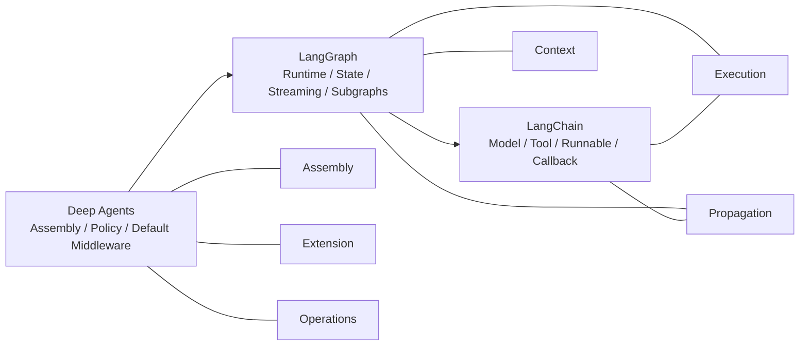

# 第2章：仓库地图与包边界

## 本章回答什么

- `deepagents`、`langgraph`、`langchain` 三个仓库各自的 ownership、主入口和模块边界是什么
- callback / config、streaming、tool runtime、subagent 可见性这些跨仓问题，真实会沿哪条链路传播
- 当行为漂移或扩展需求出现时，修复应该留在 Deep Agents，还是应该修到 LangGraph / LangChain 上游

## 在整套系统中的位置

- 横向主题：`Assembly`, `Propagation`
- 前置章节：[README](../README.md)、[前言：如何使用本教程](../00-preface.md)、[第1章：这一栈到底在构建什么](./01-what-deepagents-builds.md)
- 后续章节：[第3章：create_deep_agent 作为装配根](./03-create-deep-agent-as-assembly-root.md)、[第6章：Memory、Skills、Prompt Layering 与 Config 传播](../part2-core-runtime/06-memory-skills-and-system-prompt-layering.md)、[第7章：Subagents、任务交接与上下文隔离](../part2-core-runtime/07-subagents-and-context-isolation.md)、[第8章：Summarization、Permissions 与安全边界](../part2-core-runtime/08-summarization-permissions-and-safety-boundaries.md)

## 静态结构

只读 `deepagents/` 最大的问题不是“上下文不够”，而是会系统性误判 ownership：

- 工具执行时 callback / config 怎么拼出来的，不在 Deep Agents
- `stream_mode="messages"` 为什么能看到 token，也不在 Deep Agents
- `CompiledSubAgent` 为什么是 use-as-is，但内部 token 又可能冒到外层 consumer，仍然不能只看 Deep Agents

所以维护者需要的不是单仓目录树，而是三层真实调用栈：

- `LangChain` 提供 primitive、callback manager、config 传播、agent middleware hook surface
- `LangGraph` 提供 `StateGraph`、Pregel runtime、checkpoint、subgraph、streaming、`ToolRuntime`
- `Deep Agents` 在前两层之上装配默认 harness，把 filesystem、todo、skills、memory、permissions、subagent policy 组织成一个可复用 agent 内核

### 这一章为什么是架构图谱型特例

这一章故意比普通章节更像一份跨仓地图，因为它要先把三层 ownership、主交互链和扩展面一次性摆平。
读到具体装配问题时回跳 [第3章](./03-create-deep-agent-as-assembly-root.md)；读到 runtime / 可见性问题时回跳 [第6章](../part2-core-runtime/06-memory-skills-and-system-prompt-layering.md)、[第7章](../part2-core-runtime/07-subagents-and-context-isolation.md)、[第8章](../part2-core-runtime/08-summarization-permissions-and-safety-boundaries.md)；读到扩展与验证问题时回跳 [第13章](../part4-maintenance-and-extension/13-backend-protocol-and-storage-strategy.md)、[第15章](../part4-maintenance-and-extension/15-testing-the-harness.md)、[第17章](../part4-maintenance-and-extension/17-how-to-add-a-new-capability-safely.md)。

### 代码在哪里

#### `deepagents`

- `deepagents/libs/deepagents/deepagents/graph.py`
- `deepagents/libs/deepagents/deepagents/_models.py`
- `deepagents/libs/deepagents/deepagents/profiles/_harness_profiles.py`
- `deepagents/libs/deepagents/deepagents/middleware/`
- `deepagents/libs/deepagents/deepagents/backends/`

#### `langgraph`

- `langgraph/libs/langgraph/langgraph/graph/state.py`
- `langgraph/libs/langgraph/langgraph/pregel/main.py`
- `langgraph/libs/langgraph/langgraph/pregel/_loop.py`
- `langgraph/libs/langgraph/langgraph/pregel/_messages.py`
- `langgraph/libs/langgraph/langgraph/runtime.py`
- `langgraph/libs/prebuilt/langgraph/prebuilt/tool_node.py`

#### `langchain`

- `langchain/libs/core/langchain_core/runnables/config.py`
- `langchain/libs/core/langchain_core/callbacks/manager.py`
- `langchain/libs/core/langchain_core/tools/base.py`
- `langchain/libs/core/langchain_core/language_models/chat_models.py`
- `langchain/libs/langchain_v1/langchain/agents/middleware/types.py`
- `langchain/libs/langchain_v1/langchain/agents/factory.py`

### 三库的静态定位

#### `deepagents/`

回答的问题是：

- 默认 harness 怎么装
- subagent policy 怎么定
- backend / profile / permissions / memory / skills 怎么接进 agent

#### `langgraph/`

回答的问题是：

- graph 是怎么 compile 成可执行 runtime 的
- state / reducer / checkpoint / subgraph / stream / runtime 注入是怎么工作的

#### `langchain/`

回答的问题是：

- 模型与工具 primitive 怎么执行
- callback manager 与 `RunnableConfig` 怎么传播
- agent middleware 的标准 hook surface 是什么

## 跨仓模块交互关系图

### 怎么读这张图

- `Deep Agents` 负责把默认策略和 middleware 栈装起来，所以它直接关联 `Assembly`、`Extension`、`Operations`
- `LangGraph` 负责 runtime、state、streaming、subgraph，所以它横跨 `Context`、`Execution`、`Propagation`
- `LangChain` 提供 model / tool / runnable / callback primitive，因此它主要解释 `Execution` 与 `Propagation`

这张图不试图列完所有目录，而是给维护者一个最快的 taxonomy：后续遇到问题时，先判断它落在哪个主题，再判断首先属于哪一层。

## 运行时链路

### 一、`deepagents`：装配层架构与交互链

#### 架构定位

`deepagents` 不是新的 runtime。它做的核心工作是：

- 解析模型与 provider profile
- 生成默认 general-purpose subagent
- 把 filesystem / todo / skills / subagent / summarization / memory / permissions 等策略按固定顺序装进 middleware 栈
- 最后把一切交给上游 `create_agent()`

所以它最像 assembly layer，而不是 execution engine。

#### 核心交互链

1. `create_deep_agent()` 先经由 `resolve_model()` 和 `_harness_profile_for_model()` 归一化模型与 profile。
2. 先单独拼出 general-purpose subagent 的默认 middleware 栈，这说明“通用子代理”是设计期能力，不是事后补丁。
3. 遍历用户传入的 `subagents`：
   - declarative `SubAgent`：补全 model / tools / middleware / permissions / `interrupt_on`
   - `CompiledSubAgent`：直接 use-as-is
   - `AsyncSubAgent`：改走 `AsyncSubAgentMiddleware`
4. 构造主 agent middleware 栈。顺序是本地 contract，不是美观问题。
5. 最后调用上游 `create_agent()` 产出 compiled graph。
6. 再通过 `.with_config(...)` 提高 `recursion_limit` 并附加 `ls_integration=deepagents` 等 metadata。

### 二、`langgraph`：运行时架构与交互链

#### 架构定位

LangGraph 负责把 declarative graph 变成可执行 runtime：

- `StateGraph` 负责 authoring / compile
- `Pregel` 负责 step 执行与 streaming
- checkpoint / store / cache 负责持久化与长期记忆 substrate
- `Runtime` / `ToolRuntime` 负责把运行期上下文注进 node / tool

`StateGraph.compile()` 只是把图降成 `CompiledStateGraph`；真正执行的是 Pregel。

#### 核心交互链

1. `StateGraph.compile()` 降到 `CompiledStateGraph` / `Pregel`，同时固化 channel、output keys、interrupt 配置。
2. `Pregel.stream()` / `astream()` 进入后，会先做 `_defaults()`、checkpointer / store / cache 解析。
3. 如果开启 `stream_mode="messages"`，会在 callback tree 上挂 `StreamMessagesHandler`。
4. 如果开启 `stream_mode="custom"`，则设置 `stream_writer`，供 node / tool 主动推 side-channel 数据。
5. 运行时构造 `Runtime` 并塞回 config，再进入 `SyncPregelLoop` / `AsyncPregelLoop`。
6. tool step 通过 `ToolNode` 执行，工具收到的是 `ToolRuntime`，而不是裸参数。
7. checkpoint 记录的是 channel snapshot / pending writes，不是 callback 流。

### 三、`langchain`：primitive / callback / middleware 层交互链

#### 架构定位

Deep Agents 真正依赖的 LangChain 代码可以拆成两层：

- `langchain_core`
  提供 `RunnableConfig`、callback manager、`BaseTool`、`BaseChatModel`
- `langchain_v1/agents`
  提供 `AgentMiddleware` hook surface 与 `create_agent()` 这层 agent factory

所以 LangChain 在这套栈里的职责不是“又一个 runtime”，而是 primitive 与 hook layer。

#### 核心交互链

1. `create_agent()` 先规范 model、tools、response format，并把 middleware 的 hook surface 组合起来。
2. `wrap_model_call`、`before_model`、`after_model`、`wrap_tool_call` 等 hook 被编进 agent graph。
3. 工具执行时，`BaseTool.run()` 会：
   - `CallbackManager.configure(...)`
   - `on_tool_start(...)`
   - `patch_config(config, callbacks=run_manager.get_child())`
   - `set_config_context(child_config)`
   - 再真正调用 `_run`
4. 模型执行时，`BaseChatModel.stream()` / `astream()` 会：
   - `ensure_config(config)`
   - `CallbackManager.configure(...)`
   - `on_chat_model_start(...)`
   - 在每个 chunk 上 `on_llm_new_token(...)`
   - 结束时 `on_llm_end(...)`
5. 这条 callback tree 后续会被 LangGraph 的 `StreamMessagesHandler` 观察到。

## 传播 / 可见性 / 拦截点

### LangGraph 的 streaming 与可见性边界

这里最容易说错的点有四个：

- `stream_mode="messages"` 是观测机制，不是执行控制机制。`StreamMessagesHandler` 只是观察 callback events，把它们转成流事件，不参与 step scheduling。
- `subgraphs=True` 只是扩大可见性，不会把父图和子图拍平成一个状态机。你看到的是更深层的事件，不是 graph 边界被消灭了。
- `TAG_NOSTREAM` 是 `langgraph.constants` 里的公开常量，不是 Deep Agents 自己定义的 tag。`StreamMessagesHandler.on_chat_model_start()` 会检查这个 tag 决定是否注册当前模型 run。
- `Runtime` / `ToolRuntime` 不是持久化 state。它们是本次运行的上下文载体；真正会进 checkpoint 的仍然是 graph state / channel values。

### LangChain 的 callbacks / config 传播机制为什么关键

这部分要从“树”来理解，而不是“单个 handler 列表”：

- `CallbackManager.configure()` 负责把显式传入 callbacks、本对象自带 callbacks、tags、metadata 合并成当前 run 的根 manager
- 一次模型调用或工具调用都会先得到自己的 `run_manager`
- `run_manager.get_child()` 再给下游子调用创建 child callback manager
- child manager 会带着 `parent_run_id`、继承的 handler、tags、metadata 继续往下传

这意味着 callback manager 主要承担四种职责：

- LangSmith tracing / run tree 记录
- token / tool / chain 事件转发
- 日志、监控、埋点、调试面板
- runtime 观测扩展，例如被 LangGraph `StreamMessagesHandler` 拿来做 token streaming

`RunnableConfig` 也不是普通 kwargs，它有两条传播路径：

- 显式 config 参数
- `set_config_context(...)` 写入的 ambient context

`ensure_config()` 会先把 ambient child config 合并进来，再叠显式 config。于是很多“我明明没传 config，为什么下游还能继承 callbacks / tags / metadata”的问题，答案都在这里。

再加上一点很关键：

- `patch_config(..., callbacks=run_manager.get_child())` 会替换 callbacks，并清空 `run_name` / `run_id`

所以 callback tree 的传播不是“原样透传”，而是“沿 child run 树重建”。

### 典型跨层诊断案例：为什么 `CompiledSubAgent` 内部的 LLM token 可能出现在外层 stream consumer

这是一个典型的“三层都要看”的问题。

#### 先说结论

- 它通常不是“被主 agent 直接拦截”
- 更准确地说，是：`Deep Agents task tool -> LangChain callback / config 传播 -> LangGraph stream observer`

#### 具体链路

1. 在 Deep Agents 里，`SubAgentMiddleware` 生成 `task` 工具。对 `CompiledSubAgent`，`task` 工具内部直接调用 `subagent.invoke(subagent_state)` / `ainvoke(...)`。
2. 这个 `task` 工具本身是通过 LangChain `BaseTool.run()` / `arun()` 执行的。在真正执行 `_run` 之前，LangChain 会：
   - `patch_config(config, callbacks=run_manager.get_child())`
   - `set_config_context(child_config)`
3. 因此，哪怕 `task(...)` 代码本身没有显式把 config 传给 `CompiledSubAgent`，内层 runnable 仍可能通过 `ensure_config()` 吃到 ambient child config。
4. 如果这个 compiled subagent 内部又调用了 LangChain chat model，那么模型 run 会触发：
   - `on_chat_model_start`
   - `on_llm_new_token`
   - `on_llm_end`
5. 如果外层 graph 此时启用了 `stream_mode="messages"`，LangGraph 在 `Pregel.stream()` 里挂上的 `StreamMessagesHandler` 就会观察到这些 callback 事件，并把 token 推给外层 stream consumer。

#### 这意味着什么

- `CompiledSubAgent` 虽然不自动继承主 agent 的 middleware 栈
- 但它仍可能继承主 run 的 callback / tags / metadata 传播链
- 所以“compiled subagent 是 use-as-is”和“compiled subagent 对外完全不可见”不是同一句话

#### 如果你想阻止外层看到这些 token

优先从 LangChain / LangGraph 这两层下手，而不是期待 Deep Agents 顶层 middleware 自动拦住：

- 在 compiled subagent 内部显式覆写调用 config，替换 callbacks，而不是继续沿 ambient child config 往下传
- 给你不希望外显的内部模型 run 打上 `nostream` tag
- 外层如果根本不需要 token 级观测，就不要使用 `stream_mode="messages"`
- 如果你只想让消费者看到最终结果，就保留最终 state update / `ToolMessage`，把中间 token streaming 关掉

## 扩展接口

### `deepagents` 的主要扩展面

- `middleware=`：在主栈中间插入本地策略
- `subagents=`：可选 declarative / compiled / async 三种形态
- `backend=`：替换 filesystem / execute / state 的底层实现
- `permissions=`：统一给主 agent 与 declarative subagent 收口 tool 权限
- `skills=` / `memory=`：扩 system prompt，不碰 runtime 语义
- profile：通过 `extra_middleware`、`excluded_tools`、`tool_description_overrides`、`base_system_prompt` 调整 provider-specific 策略

### `langgraph` 的主要扩展面

- `StateGraph` state schema / reducer 注解
- `interrupt_before` / `interrupt_after`
- checkpoint / store / cache 接口
- `Runtime` / `ToolRuntime`
- `InjectedState` / `InjectedStore`
- `wrap_tool_call` / `awrap_tool_call`
- `get_stream_writer()` / `stream_mode="custom"`

### `langchain` 的主要扩展面

- 继承 `BaseTool` / `BaseChatModel`
- `AgentMiddleware` 六类 hook：`before_agent`、`before_model`、`wrap_model_call`、`wrap_tool_call`、`after_model`、`after_agent`
- `ModelRequest.override(...)` 作为不可变修改入口
- structured output strategy：`ToolStrategy`、`ProviderStrategy`、`AutoStrategy`

### 如果你要改 X，优先落在哪层

| 你要改的东西 | 优先落层 |
|--------------|----------|
| 默认 middleware 顺序、general-purpose subagent 注入、permissions 继承 | `deepagents` |
| provider-specific prompt / tool exclusion / profile 策略 | `deepagents` |
| `task` tool 的 state 过滤与结果回传 | `deepagents` |
| graph checkpoint / stream mode / subgraph 事件可见性 | `langgraph` |
| `ToolRuntime`、`InjectedState`、`InjectedStore` 注入语义 | `langgraph` |
| `nostream` tag 如何生效 | `langgraph` |
| callback tree、`get_child()`、config 合并与上下文传播 | `langchain_core` |
| `BaseTool.run()` / `BaseChatModel.stream()` 的事件触发与参数传递 | `langchain_core` |
| agent middleware hook 语义、动态工具、structured output agent loop | `langchain_v1/agents` |

### 什么时候该优先修上游

如果问题落在 `ToolRuntime`、`stream_mode`、`nostream`、callback tree、`RunnableConfig` merge 这些语义层，优先回看 `langgraph` 或 `langchain_core`。
如果问题只涉及默认 middleware 顺序、profile、permissions、subagent policy 这类 harness 装配策略，就不要先动上游。

## 常见问题与排障入口

- 坑 1：把仓库边界理解成 import 边界。维护者真正需要的是语义边界，而不是 Python 包边界。
- 坑 2：把“stream 可见”误解成“主 agent 拦截成功”。很多时候那只是 callback tree 被上层 stream observer 观测到了。
- 坑 3：看到 `CompiledSubAgent` 是 use-as-is，就推断它内部一定完全脱离主 run。middleware 栈和 callback / config 传播是两套边界，不能混为一谈。
- 坑 4：把 `nostream` 说成 Deep Agents 约定。它来自 `langgraph.constants.TAG_NOSTREAM`。

排障入口建议按问题类型选：

- 默认 middleware、profile、permissions、subagent wiring：先查 `deepagents/libs/deepagents/deepagents/`
- graph runtime、streaming、checkpoint、subgraph forwarding：先查 `langgraph/libs/langgraph/langgraph/`
- callback tree、`RunnableConfig`、tool / model primitive：先查 `langchain/libs/core/langchain_core/`
- 不确定归属时，回看本章图谱，再用 [附录 D：传播与可见性速查表](../appendix/propagation-and-visibility-cheatsheet.md) 做二次定位

## 本章结论

- 谁提供：`deepagents` 负责装配与本地策略，`langgraph` 负责 graph runtime / streaming / checkpoint / tool runtime，`langchain` 负责 primitive、callback / config 传播与 agent middleware hook surface。
- 如何传播：一次行为通常沿 `create_deep_agent()` 装配进入 `create_agent()`，再落到 `CompiledStateGraph` / Pregel 执行，并通过 `BaseTool`、`BaseChatModel`、callback tree 与 `StreamMessagesHandler` 向外传播。
- 修在哪层：先按 contract 落层；默认 middleware、profile、permissions 与 `task` tool 修 `deepagents`，runtime / stream / `ToolRuntime` 修 `langgraph`，callback / config / middleware hook 修 `langchain`。
