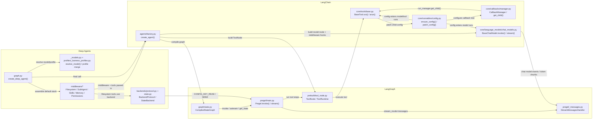

# 第2章：仓库地图与包边界

## 学习目标

学完本章，你应该能回答：

1. `deepagents`、`langgraph`、`langchain` 三个仓库各自的架构定位是什么
2. 三个仓库的模块组织、主交互链、内部 hook surface 分别落在哪里
3. callback、streaming、tool runtime、subagent 边界问题该先看哪一层
4. 哪些改动应该留在 Deep Agents，哪些应该修到 LangGraph / LangChain 上游

---

## 问题是什么

只读 `deepagents/` 最大的问题不是“上下文不够”，而是会系统性误判 ownership：

- 工具执行时 callback / config 怎么拼出来的，不在 Deep Agents
- `stream_mode="messages"` 为什么能看到 token，也不在 Deep Agents
- `CompiledSubAgent` 为什么是 use-as-is，但内部 token 又可能冒到外层 consumer，仍然不能只看 Deep Agents

所以维护者需要的不是单仓目录树，而是三层真实调用栈：

- `LangChain` 提供 primitive、callback manager、config 传播、agent middleware hook surface
- `LangGraph` 提供 `StateGraph`、Pregel runtime、checkpoint、subgraph、streaming、`ToolRuntime`
- `Deep Agents` 在前两层之上装配默认 harness，把 filesystem、todo、skills、memory、permissions、subagent policy 组织成一个可复用 agent 内核

---

## 哪一层负责什么

### `deepagents/`

回答的问题是：

- 默认 harness 怎么装
- subagent policy 怎么定
- backend / profile / permissions / memory / skills 怎么接进 agent

### `langgraph/`

回答的问题是：

- graph 是怎么 compile 成可执行 runtime 的
- state / reducer / checkpoint / subgraph / stream / runtime 注入是怎么工作的

### `langchain/`

回答的问题是：

- 模型与工具 primitive 怎么执行
- callback manager 与 `RunnableConfig` 怎么传播
- agent middleware 的标准 hook surface 是什么

---

## 代码在哪里

### `deepagents`

- `deepagents/libs/deepagents/deepagents/graph.py`
- `deepagents/libs/deepagents/deepagents/_models.py`
- `deepagents/libs/deepagents/deepagents/profiles/_harness_profiles.py`
- `deepagents/libs/deepagents/deepagents/middleware/`
- `deepagents/libs/deepagents/deepagents/backends/`

### `langgraph`

- `langgraph/libs/langgraph/langgraph/graph/state.py`
- `langgraph/libs/langgraph/langgraph/pregel/main.py`
- `langgraph/libs/langgraph/langgraph/pregel/_loop.py`
- `langgraph/libs/langgraph/langgraph/pregel/_messages.py`
- `langgraph/libs/langgraph/langgraph/runtime.py`
- `langgraph/libs/prebuilt/langgraph/prebuilt/tool_node.py`

### `langchain`

- `langchain/libs/core/langchain_core/runnables/config.py`
- `langchain/libs/core/langchain_core/callbacks/manager.py`
- `langchain/libs/core/langchain_core/tools/base.py`
- `langchain/libs/core/langchain_core/language_models/chat_models.py`
- `langchain/libs/langchain_v1/langchain/agents/middleware/types.py`
- `langchain/libs/langchain_v1/langchain/agents/factory.py`

---

## 这一章为什么是架构图谱型特例

这一章故意比普通章节更像一份跨仓地图，因为它要先把三层 ownership、主交互链和扩展面一次性摆平。
读到具体装配问题时回跳第 3 章；读到 runtime / 可见性问题时回跳第 4 到第 7 章；读到扩展与验证问题时回跳第 8 到第 10 章。

---

## 跨仓模块交互关系图

这张图只画主调用链，故意省略 provider-specific 叶子模块，例如
`langchain_anthropic`、`langchain_openai`。它的目标不是列全目录，而是回答：

> 一次 `create_deep_agent()` 产生的 agent，在装配、执行、tool runtime、callback/config 传播、streaming 观测这五条线上，分别会碰到哪些核心模块。



### 怎么读这张图

- 装配线：
  `deepagents/graph.py` 先做 model/profile 归一化，再拼 middleware / backend / subagent 默认栈，最后把结果交给 `langchain.agents.create_agent()`。

- 执行线：
  `langchain/agents/factory.py` 产出的是 `CompiledStateGraph`，真正的 step 执行、`invoke()/stream()`、checkpoint、subgraph 调度都落在 `langgraph/pregel/main.py`。

- tool 线：
  `ToolNode` 在图运行时构造 `ToolRuntime`，再调用 `BaseTool.run()/arun()`；Deep Agents 的 filesystem/subagent 等能力之所以能工作，是因为它们先被装成了普通 tool / middleware surface。

- callback/config 传播线：
  `RunnableConfig.ensure_config()`、`patch_config()` 和 `CallbackManager.get_child()` 决定 tags / metadata / callbacks / run tree 如何继续向下传；这条线主要属于 LangChain，不属于 Deep Agents 私有机制。

- streaming 观测线：
  `Pregel.stream()` 在 `stream_mode="messages"` 时挂上 `StreamMessagesHandler`，后续模型的 token chunk 才会进入外层流消费者；因此“能被外部看到”是 LangGraph runtime 观测能力，不等于“主 agent middleware 正在包裹所有内部节点”。

---

## 三库架构档案

### 一、`deepagents`：装配层架构与扩展面

#### 架构定位

`deepagents` 不是新的 runtime。它做的核心工作是：

- 解析模型与 provider profile
- 生成默认 general-purpose subagent
- 把 filesystem / todo / skills / subagent / summarization / memory / permissions 等策略按固定顺序装进 middleware 栈
- 最后把一切交给上游 `create_agent()`

所以它最像 assembly layer，而不是 execution engine。

#### 模块组织

| 模块 | 责任 |
|------|------|
| `graph.py` | `create_deep_agent()` 装配根，定义默认 middleware 顺序和 subagent 注入规则 |
| `_models.py` | `resolve_model()`、provider / model 标识归一化 |
| `profiles/_harness_profiles.py` | provider / model 级 profile，负责 base prompt、extra middleware、tool exclusion、描述改写 |
| `middleware/filesystem.py` | 注入 `ls`、`read_file`、`write_file`、`edit_file`、`glob`、`grep`、`execute` 等工具，并把 `files` channel 接到 backend |
| `middleware/subagents.py` | `SubAgent` / `CompiledSubAgent` 规格、`task` tool、state 过滤与结果回传 |
| `middleware/permissions.py` | `_PermissionMiddleware` 通过 `wrap_tool_call` 收口权限，规则 first-match-wins |
| `middleware/skills.py` / `memory.py` / `summarization.py` | prompt layering、记忆加载、长上下文压缩 |
| `backends/` | `BackendProtocol`、`StateBackend` 等 adapter，把文件与执行能力接到 tool surface 上 |

#### 核心交互链

1. `create_deep_agent()` 先经由 `resolve_model()` 和 `_harness_profile_for_model()` 归一化模型与 profile。
2. 先单独拼出 general-purpose subagent 的默认 middleware 栈，这说明“通用子代理”是设计期能力，不是事后补丁。
3. 遍历用户传入的 `subagents`：
   - declarative `SubAgent`：补全 model / tools / middleware / permissions / `interrupt_on`
   - `CompiledSubAgent`：直接 use-as-is
   - `AsyncSubAgent`：改走 `AsyncSubAgentMiddleware`
4. 构造主 agent middleware 栈。顺序是本地 contract，不是美观问题。
5. 最后调用上游 `create_agent()` 产出 compiled graph。
6. 再通过 `.with_config(...)` 提高 `recursion_limit` 并附加 `ls_integration=deepagents` 等 metadata。

#### 默认 middleware 顺序为什么重要

主 agent 的默认顺序大致是：

1. `TodoListMiddleware`
2. `SkillsMiddleware`（如果启用）
3. `FilesystemMiddleware`
4. `SubAgentMiddleware`
5. summarization middleware
6. `PatchToolCallsMiddleware`
7. `AsyncSubAgentMiddleware`（如果存在）
8. 用户自定义 middleware
9. profile `extra_middleware`
10. `_ToolExclusionMiddleware`
11. `AnthropicPromptCachingMiddleware`
12. `MemoryMiddleware`
13. `HumanInTheLoopMiddleware`
14. `_PermissionMiddleware`

这里最关键的三个点是：

- `_PermissionMiddleware` 必须最后，否则它看不到前面 middleware 动态加进来的工具
- provider-specific middleware 必须在 memory 之前，否则 prompt cache prefix 容易失效
- `CompiledSubAgent` 不会自动被这整套默认顺序再次包裹

#### 内部 hook / 扩展接口

对维护者真正重要的扩展面是：

- `middleware=`：在主栈中间插入本地策略
- `subagents=`：可选 declarative / compiled / async 三种形态
- `backend=`：替换 filesystem / execute / state 的底层实现
- `permissions=`：统一给主 agent 与 declarative subagent 收口 tool 权限
- `skills=` / `memory=`：扩 system prompt，不碰 runtime 语义
- profile：通过 `extra_middleware`、`excluded_tools`、`tool_description_overrides`、`base_system_prompt` 调整 provider-specific 策略，但它更像内部维护面，不应被误写成稳定公共 API

#### 最容易误判的边界

- `CompiledSubAgent` 是 use-as-is。
  它不会自动继承主 agent 默认 middleware 栈，也不会自动继承顶层 `interrupt_on`。

- 顶层 `middleware=` 只插主 agent。
  general-purpose subagent 与 declarative subagent 都会重建自己的默认栈，不会把主 agent 的用户 middleware 原样透传下去。

- “看得见 compiled subagent 内部 token”不等于“被主 agent 拦截”。
  Deep Agents 只是通过 `task` tool 调用了这个 runnable；真正把 token 往外送的是 LangChain callback tree 和 LangGraph `StreamMessagesHandler`。

- `StateBackend` 不是另起炉灶的 runtime。
  它只是借 backend adapter 把文件状态接到上层工具与 state channel 上。

- permissions 是本地策略层，不是 LangGraph / LangChain 帮你保证的。
  如果你把权限口子开大了，上游不会替你自动兜底。

### 二、`langgraph`：运行时架构与扩展面

#### 架构定位

LangGraph 负责把 declarative graph 变成可执行 runtime：

- `StateGraph` 负责 authoring / compile
- `Pregel` 负责 step 执行与 streaming
- checkpoint / store / cache 负责持久化与长期记忆 substrate
- `Runtime` / `ToolRuntime` 负责把运行期上下文注进 node / tool

`StateGraph.compile()` 只是把图降成 `CompiledStateGraph`；真正执行的是 Pregel。

#### 模块组织

| 模块 | 责任 |
|------|------|
| `graph/state.py` | `StateGraph` builder、reducer 解析、compile 到 `CompiledStateGraph` |
| `pregel/main.py` | `Pregel.invoke()` / `stream()` / `astream()` 入口，组装 runtime、callback、stream mode、subgraph forwarding |
| `pregel/_loop.py` | step loop、interrupt、pending writes、checkpoint 边界 |
| `pregel/_messages.py` | `StreamMessagesHandler`，把 chat model tokens / node 输出转成 `stream_mode="messages"` 事件 |
| `runtime.py` | `Runtime`，持有 `context`、`store`、`stream_writer`、`previous`、`execution_info`、`server_info` |
| `prebuilt/tool_node.py` | `ToolNode`、`ToolRuntime`、`InjectedState`、`InjectedStore`、`wrap_tool_call` |
| `checkpoint/` / `store/` / `cache/` | checkpoint、长期 store、cache 三种不同持久化 substrate |

#### 核心交互链

1. `StateGraph.compile()` 降到 `CompiledStateGraph` / `Pregel`，同时固化 channel、output keys、interrupt 配置。
2. `Pregel.stream()` / `astream()` 进入后，会先做 `_defaults()`、checkpointer / store / cache 解析。
3. 如果开启 `stream_mode="messages"`，会在 callback tree 上挂 `StreamMessagesHandler`。
4. 如果开启 `stream_mode="custom"`，则设置 `stream_writer`，供 node / tool 主动推 side-channel 数据。
5. 运行时构造 `Runtime` 并塞回 config，再进入 `SyncPregelLoop` / `AsyncPregelLoop`。
6. tool step 通过 `ToolNode` 执行，工具收到的是 `ToolRuntime`，而不是裸参数。
7. checkpoint 记录的是 channel snapshot / pending writes，不是 callback 流。

#### 内部 hook / 扩展接口

LangGraph 的主要扩展面包括：

- `StateGraph` state schema / reducer 注解
- `interrupt_before` / `interrupt_after`
- checkpoint / store / cache 接口
- `Runtime` / `ToolRuntime`
- `InjectedState` / `InjectedStore`
- `wrap_tool_call` / `awrap_tool_call`
- `get_stream_writer()` / `stream_mode="custom"`
- `NodeBuilder`、channel / managed value 等更底层 substrate

#### streaming 与可见性边界

这里最容易说错的点有四个：

- `stream_mode="messages"` 是观测机制，不是执行控制机制。
  `StreamMessagesHandler` 只是观察 callback events，把它们转成流事件，不参与 step scheduling。

- `subgraphs=True` 只是扩大可见性，不会把父图和子图拍平成一个状态机。
  你看到的是更深层的事件，不是 graph 边界被消灭了。

- `TAG_NOSTREAM` 是 `langgraph.constants` 里的公开常量，不是 Deep Agents 自己定义的 tag。
  `StreamMessagesHandler.on_chat_model_start()` 会检查这个 tag 决定是否注册当前模型 run。

- `Runtime` / `ToolRuntime` 不是持久化 state。
  它们是本次运行的上下文载体；真正会进 checkpoint 的仍然是 graph state / channel values。

#### 最容易误判的边界

- “token 不可见”与“token 没执行”不是一回事。
  你可以只隐藏 stream，但内部模型调用照样发生。

- `custom` stream 与 state update 是两条线。
  `stream_writer` 推出来的东西默认不会自动进 checkpoint。

- `ToolRuntime` 注入不是 LangChain tool 基类负责的，而是 LangGraph prebuilt `ToolNode` 负责的。

### 三、`langchain`：primitive / callback / middleware 层架构与扩展面

#### 架构定位

Deep Agents 真正依赖的 LangChain 代码可以拆成两层：

- `langchain_core`
  提供 `RunnableConfig`、callback manager、`BaseTool`、`BaseChatModel`
- `langchain_v1/agents`
  提供 `AgentMiddleware` hook surface 与 `create_agent()` 这层 agent factory

所以 LangChain 在这套栈里的职责不是“又一个 runtime”，而是 primitive 与 hook layer。

#### 模块组织

| 模块 | 责任 |
|------|------|
| `runnables/config.py` | `ensure_config()`、`patch_config()`、`set_config_context()`、callback manager 派生 |
| `callbacks/manager.py` | `CallbackManager` / `AsyncCallbackManager`、run tree、`get_child()`、事件分发 |
| `tools/base.py` | `BaseTool.run()` / `arun()`、tool schema、callback start/end/error、child config 注入 |
| `language_models/chat_models.py` | `BaseChatModel.invoke()` / `stream()` / `astream()`、token callback、tool binding、structured output bridge |
| `agents/middleware/types.py` | `AgentMiddleware`、`ModelRequest`、`ModelResponse`、decorator hook surface |
| `agents/factory.py` | `create_agent()`，把 middleware、tools、structured output 组到 LangGraph `StateGraph` 里 |

#### 核心交互链

1. `create_agent()` 先规范 model、tools、response format，并把 middleware 的 hook surface 组合起来。
2. `wrap_model_call`、`before_model`、`after_model`、`wrap_tool_call` 等 hook 被编进 agent graph。
3. 工具执行时，`BaseTool.run()` 会：
   - `CallbackManager.configure(...)`
   - `on_tool_start(...)`
   - `patch_config(config, callbacks=run_manager.get_child())`
   - `set_config_context(child_config)`
   - 再真正调用 `_run`
4. 模型执行时，`BaseChatModel.stream()` / `astream()` 会：
   - `ensure_config(config)`
   - `CallbackManager.configure(...)`
   - `on_chat_model_start(...)`
   - 在每个 chunk 上 `on_llm_new_token(...)`
   - 结束时 `on_llm_end(...)`
5. 这条 callback tree 后续会被 LangGraph 的 `StreamMessagesHandler` 观察到。

#### callbacks / callback manager 的工作机制

这部分要从“树”来理解，而不是“单个 handler 列表”：

- `CallbackManager.configure()` 负责把显式传入 callbacks、本对象自带 callbacks、tags、metadata 合并成当前 run 的根 manager
- 一次模型调用或工具调用都会先得到自己的 `run_manager`
- `run_manager.get_child()` 再给下游子调用创建 child callback manager
- child manager 会带着 `parent_run_id`、继承的 handler、tags、metadata 继续往下传

这意味着 callback manager 主要承担四种职责：

- LangSmith tracing / run tree 记录
- token / tool / chain 事件转发
- 日志、监控、埋点、调试面板
- runtime 观测扩展，例如被 LangGraph `StreamMessagesHandler` 拿来做 token streaming

#### `RunnableConfig` 传播机制为什么关键

`RunnableConfig` 不是普通 kwargs，它有两条传播路径：

- 显式 config 参数
- `set_config_context(...)` 写入的 ambient context

`ensure_config()` 会先把 ambient child config 合并进来，再叠显式 config。于是很多“我明明没传 config，为什么下游还能继承 callbacks / tags / metadata”的问题，答案都在这里。

再加上一点很关键：

- `patch_config(..., callbacks=run_manager.get_child())` 会替换 callbacks，并清空 `run_name` / `run_id`

所以 callback tree 的传播不是“原样透传”，而是“沿 child run 树重建”。

#### 内部 hook / 扩展接口

LangChain 对维护者最有价值的扩展面是：

- 继承 `BaseTool` / `BaseChatModel`
- `AgentMiddleware` 六类 hook：
  - `before_agent`
  - `before_model`
  - `wrap_model_call`
  - `wrap_tool_call`
  - `after_model`
  - `after_agent`
- `ModelRequest.override(...)` 作为不可变修改入口
- structured output strategy：
  - `ToolStrategy`
  - `ProviderStrategy`
  - `AutoStrategy`

#### 最容易误判的边界

- `invoke()` 不一定真的是“非流式”。
  当 `_should_stream()` 认为当前 run 需要 streaming 时，内部仍可能转去 `_stream()` / `_astream()` 再把结果折回普通 `ChatResult`。

- 动态加工具不只是改 `request.tools` 那么简单。
  如果 middleware 在 `wrap_model_call` 动态塞工具，却没有对应 `wrap_tool_call` 或注册 surface，上游会把它当成未声明工具。

- 工具函数里显式接收的 `config` 与 ambient child config 可能不是同一个对象。
  也就是说，你在工具内部看到的 callback 传播，有“显式参数”和“上下文变量”两条线。

---

## 典型跨层诊断案例

### 案例：为什么 `CompiledSubAgent` 内部的 LLM token 可能出现在外层 stream consumer

这是一个典型的“三层都要看”的问题。

#### 先说结论

- 它通常不是“被主 agent 直接拦截”
- 更准确地说，是：
  `Deep Agents task tool -> LangChain callback/config 传播 -> LangGraph stream observer`

#### 具体链路

1. 在 Deep Agents 里，`SubAgentMiddleware` 生成 `task` 工具。
   对 `CompiledSubAgent`，`task` 工具内部直接调用 `subagent.invoke(subagent_state)` / `ainvoke(...)`。

2. 这个 `task` 工具本身是通过 LangChain `BaseTool.run()` / `arun()` 执行的。
   在真正执行 `_run` 之前，LangChain 会：
   - `patch_config(config, callbacks=run_manager.get_child())`
   - `set_config_context(child_config)`

3. 因此，哪怕 `task(...)` 代码本身没有显式把 config 传给 `CompiledSubAgent`，
   内层 runnable 仍可能通过 `ensure_config()` 吃到 ambient child config。

4. 如果这个 compiled subagent 内部又调用了 LangChain chat model，
   那么模型 run 会触发：
   - `on_chat_model_start`
   - `on_llm_new_token`
   - `on_llm_end`

5. 如果外层 graph 此时启用了 `stream_mode="messages"`，
   LangGraph 在 `Pregel.stream()` 里挂上的 `StreamMessagesHandler` 就会观察到这些 callback 事件，并把 token 推给外层 stream consumer。

#### 这意味着什么

- `CompiledSubAgent` 虽然不自动继承主 agent 的 middleware 栈
- 但它仍可能继承主 run 的 callback / tags / metadata 传播链
- 所以“compiled subagent 是 use-as-is”和“compiled subagent 对外完全不可见”不是同一句话

#### 如果你想阻止外层看到这些 token

优先从 LangChain / LangGraph 这两层下手，而不是期待 Deep Agents 顶层 middleware 自动拦住：

- 在 compiled subagent 内部显式覆写调用 config，替换 callbacks，而不是继续沿 ambient child config 往下传
- 给你不希望外显的内部模型 run 打上 `nostream` tag
- 外层如果根本不需要 token 级观测，就不要使用 `stream_mode="messages"`
- 如果你只想让消费者看到最终结果，就保留最终 state update / `ToolMessage`，把中间 token streaming 关掉

#### 一个最小思路

如果你自己控制 compiled subagent 的内部 runnable，可以把真正的内部 graph / model 调用包一层，显式传入新的 config：

```python
result = child_graph.invoke(
    child_state,
    config={
        "callbacks": [],
        "tags": ["nostream"],
    },
)
```

这个例子表达的是方向，不是唯一写法。关键点有两个：

- 用显式 config 覆盖 ambient callback tree
- 用 `nostream` 告诉 LangGraph 的 `StreamMessagesHandler` 不要把该模型 run 注册到 message stream

---

## 如果你要改 X，优先落在哪层

| 你要改的东西 | 优先落层 |
|--------------|----------|
| 默认 middleware 顺序、general-purpose subagent 注入、permissions 继承 | `deepagents` |
| provider-specific prompt / tool exclusion / profile 策略 | `deepagents` |
| `task` tool 的 state 过滤与结果回传 | `deepagents` |
| graph checkpoint / stream mode / subgraph 事件可见性 | `langgraph` |
| `ToolRuntime`、`InjectedState`、`InjectedStore` 注入语义 | `langgraph` |
| `nostream` tag 如何生效 | `langgraph` |
| callback tree、`get_child()`、config 合并与上下文传播 | `langchain_core` |
| `BaseTool.run()` / `BaseChatModel.stream()` 的事件触发与参数传递 | `langchain_core` |
| agent middleware hook 语义、动态工具、structured output agent loop | `langchain_v1/agents` |

---

## 什么时候该优先修上游

如果问题落在 `ToolRuntime`、`stream_mode`、`nostream`、callback tree、`RunnableConfig` merge 这些语义层，优先回看 `langgraph` 或 `langchain_core`。
如果问题只涉及默认 middleware 顺序、profile、permissions、subagent policy 这类 harness 装配策略，就不要先动上游。

---

## 容易踩什么坑

- 坑 1：把仓库边界理解成 import 边界。
  维护者真正需要的是语义边界，而不是 Python 包边界。

- 坑 2：把“stream 可见”误解成“主 agent 拦截成功”。
  很多时候那只是 callback tree 被上层 stream observer 观测到了。

- 坑 3：看到 `CompiledSubAgent` 是 use-as-is，就推断它内部一定完全脱离主 run。
  middleware 栈和 callback/config 传播是两套边界，不能混为一谈。

- 坑 4：把 `nostream` 说成 Deep Agents 约定。
  它来自 `langgraph.constants.TAG_NOSTREAM`。

---

## 本章小结

- `deepagents` 负责装配与本地策略。
- `langgraph` 负责 graph runtime、streaming、checkpoint、tool runtime。
- `langchain` 负责 primitive、callback/config 传播与 agent middleware hook surface。
- 真正的维护者视角不是“哪个类最重要”，而是“这次行为到底属于哪一层的 contract”。
