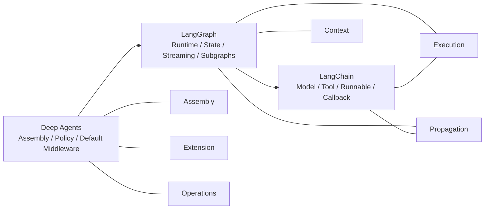

# 第2章：仓库地图与包边界

## 本章回答什么

- `deepagents`、`langgraph`、`langchain` 三个仓库各自的 ownership、主入口和模块边界是什么
- callback / config、streaming、tool runtime、subagent 可见性这些跨仓问题，真实会沿哪条链路传播
- 当行为漂移或扩展需求出现时，修复应该留在 Deep Agents，还是应该修到 LangGraph / LangChain 上游

## 在整套系统中的位置

- 横向主题：`Assembly`, `Propagation`
- 前置章节：[README](../README.md)、[前言：如何使用本教程](../00-preface.md)、[第1章：这一栈到底在构建什么](./01-what-deepagents-builds.md)
- 后续章节：[第3章：create_deep_agent 作为装配根](./03-create-deep-agent-as-assembly-root.md)、[第4章：Filesystem 与 Pregel State Model](../part2-core-runtime/04-filesystem-and-state-model.md)、[第5章：Tools 作为 Runtime Surface](../part2-core-runtime/05-tools-as-runtime-surface.md)、[第10章：Callbacks、Config 与 Callback Manager](../part3-propagation/10-callbacks-config-and-callback-manager.md)、[第11章：Streaming、Visibility 与 Selective Exposure](../part3-propagation/11-streaming-visibility-and-selective-exposure.md)、[附录 D：传播与可见性速查表](../appendix/propagation-and-visibility-cheatsheet.md)

## 静态结构

只读 `deepagents/` 最大的问题不是“上下文不够”，而是会系统性误判 ownership：

- 工具执行时 callback / config 怎么拼出来的，不在 Deep Agents
- `stream_mode="messages"` 为什么能看到 token，也不在 Deep Agents
- `CompiledSubAgent` 为什么是 use-as-is，但内部 token 又可能冒到外层 consumer，仍然不能只看 Deep Agents

所以维护者需要的不是单仓目录树，而是三层真实调用栈：

- `LangChain` 提供 primitive、callback manager、config 传播、agent middleware hook surface
- `LangGraph` 提供 `StateGraph`、Pregel runtime、checkpoint、subgraph、streaming、`ToolRuntime`
- `Deep Agents` 在前两层之上装配默认 harness，把 filesystem、todo、skills、memory、permissions、subagent policy 组织成一个可复用 agent 内核

### 这一章为什么是架构图谱型特例

这一章故意比普通章节更像一份跨仓地图，因为它要先把三层 ownership、主交互链和扩展面一次性摆平。
读到具体装配问题时回跳 [第3章](./03-create-deep-agent-as-assembly-root.md)；读到 state / runtime ownership 时回跳 [第4章](../part2-core-runtime/04-filesystem-and-state-model.md) 与 [第5章](../part2-core-runtime/05-tools-as-runtime-surface.md)；读到 callback / config 传播时回跳 [第10章](../part3-propagation/10-callbacks-config-and-callback-manager.md)；读到 stream / visibility 问题时回跳 [第11章](../part3-propagation/11-streaming-visibility-and-selective-exposure.md) 与 [附录 D](../appendix/propagation-and-visibility-cheatsheet.md)；读到 subagent isolation、permissions 与安全边界时再回跳 [第7章](../part2-core-runtime/07-subagents-and-context-isolation.md)、[第8章](../part2-core-runtime/08-summarization-permissions-and-safety-boundaries.md)；读到扩展与验证问题时回跳 [第13章](../part4-maintenance-and-extension/13-backend-protocol-and-storage-strategy.md)、[第15章](../part4-maintenance-and-extension/15-testing-the-harness.md)、[第17章](../part4-maintenance-and-extension/17-how-to-add-a-new-capability-safely.md)。

### 代码在哪里

#### `deepagents`

- `deepagents/libs/deepagents/deepagents/graph.py`
- `deepagents/libs/deepagents/deepagents/_models.py`
- `deepagents/libs/deepagents/deepagents/profiles/_harness_profiles.py`
- `deepagents/libs/deepagents/deepagents/middleware/`
- `deepagents/libs/deepagents/deepagents/backends/`

#### `langgraph`

- `langgraph/libs/langgraph/langgraph/graph/state.py`
- `langgraph/libs/langgraph/langgraph/pregel/main.py`
- `langgraph/libs/langgraph/langgraph/pregel/_loop.py`
- `langgraph/libs/langgraph/langgraph/pregel/_messages.py`
- `langgraph/libs/langgraph/langgraph/runtime.py`
- `langgraph/libs/prebuilt/langgraph/prebuilt/tool_node.py`

#### `langchain`

- `langchain/libs/core/langchain_core/runnables/config.py`
- `langchain/libs/core/langchain_core/callbacks/manager.py`
- `langchain/libs/core/langchain_core/tools/base.py`
- `langchain/libs/core/langchain_core/language_models/chat_models.py`
- `langchain/libs/langchain_v1/langchain/agents/middleware/types.py`
- `langchain/libs/langchain_v1/langchain/agents/factory.py`

### 三库的静态定位

#### `deepagents/`

回答的问题是：

- 默认 harness 怎么装
- subagent policy 怎么定
- backend / profile / permissions / memory / skills 怎么接进 agent

#### `langgraph/`

回答的问题是：

- graph 是怎么 compile 成可执行 runtime 的
- state / reducer / checkpoint / subgraph / stream / runtime 注入是怎么工作的

#### `langchain/`

回答的问题是：

- 模型与工具 primitive 怎么执行
- callback manager 与 `RunnableConfig` 怎么传播
- agent middleware 的标准 hook surface 是什么

## 跨仓模块交互关系图

### 怎么读这张图

- `Deep Agents` 负责把默认策略和 middleware 栈装起来，所以它直接关联 `Assembly`、`Extension`、`Operations`
- `LangGraph` 负责 runtime、state、streaming、subgraph，所以它横跨 `Context`、`Execution`、`Propagation`
- `LangChain` 提供 model / tool / runnable / callback primitive，因此它主要解释 `Execution` 与 `Propagation`

这张图不试图列完所有目录，而是给维护者一个最快的 taxonomy：后续遇到问题时，先判断它落在哪个主题，再判断首先属于哪一层。

## 运行时链路

### `deepagents`：装配层入口，不是执行引擎

这一层回答的是“默认 harness 是怎么被装起来的”，不是“图运行时每一步怎么调度”。维护者在这里主要看三类 ownership：

- `create_deep_agent()` 如何归一化 model、profile、subagent、permissions
- middleware 顺序、default tools、backend wiring 为什么是本地 contract
- 哪些扩展属于装配面，哪些应该直接交给上游 `create_agent()`

因此第2章只保留入口级判断：Deep Agents 负责 assembly、policy、default wiring；真正执行 graph 的 runtime ownership 不在这里。

### `langgraph`：Pregel runtime 的 ownership 在哪里

LangGraph 负责把 declarative graph 变成真正可运行的 Pregel runtime。这里该记住的是 ownership，而不是完整调用栈：

- `StateGraph` 属于 authoring / compile surface
- `Pregel` 属于 step execution、state transition、barrier、streaming
- checkpoint、store、cache 属于 runtime persistence substrate
- `Runtime` / `ToolRuntime` 属于运行期上下文注入，不等于持久化 state

如果问题开始涉及 state、writes、reducers、barrier、tool step、stream mode，那已经进入 LangGraph 的 runtime 语义，而不是 Chapter 2 要展开讲完的内容。

### `langchain`：primitive、callback、config 的 ownership 在哪里

LangChain 在这套栈里提供的是 primitive 和传播机制，不是另一层 graph runtime：

- `langchain_core` 提供 `BaseTool`、`BaseChatModel`、callback manager、`RunnableConfig`
- `langchain_v1/agents` 提供 `create_agent()` 和 middleware hook surface

所以维护者看到 callback tree、tool/model 事件、ambient config 传播时，第一反应应该是“这是不是 LangChain ownership”，而不是继续在 Deep Agents 里找调度主线。

### 为什么 `StateGraph.compile()` 不是执行主线

`StateGraph.compile()` 的作用是把 authoring graph 降成可执行对象，并固化 channels、output keys、interrupt 配置。它很重要，但它不是“系统已经开始跑”的同义词。

Chapter 2 在这里只需要建立一个判断标准：

- compile 说明 graph shape 已经落成
- 真正的 Pregel 执行、step 推进、writes 合并、stream 发射，发生在 compile 之后的 runtime
- 所以从 `compile()` 往后再追，已经不该在这一章里做逐步 walkthrough

### 维护者该先打开哪些 Pregel 文件

如果你已经确认问题属于 LangGraph runtime，先打开这些文件建立方位感：

- `langgraph/libs/langgraph/langgraph/graph/state.py`
- `langgraph/libs/langgraph/langgraph/pregel/main.py`
- `langgraph/libs/langgraph/langgraph/pregel/_loop.py`
- `langgraph/libs/langgraph/langgraph/pregel/_messages.py`
- `langgraph/libs/langgraph/langgraph/runtime.py`

这组入口足够回答“runtime ownership 大概落在哪里”，但不要求你在本章里把 `SyncPregelLoop` / `AsyncPregelLoop`、`Pregel.stream()` / `astream()`、subgraph token visibility 全部追完。

### 这一章不负责讲完 Pregel runtime

这一章到这里为止，只负责把 boundary map 立起来，并告诉你后续该去哪一章继续追：

- Pregel 执行模型详见第4章：Filesystem 与 Pregel State Model。
- Pregel 主执行路径详见第5章：Tools 作为 Runtime Surface。
- callback / config 传播判断回第10章。
- stream 可见性与 selective exposure 回第11章与附录 D。

如果你现在要回答的是：

- Pregel 的 state、writes、reducer、barrier 是什么：去第4章。
- Pregel 从 compile 之后如何真正跑起来：去第5章。
- callback/config 为什么还能连到内部 runnable：去第10章。
- 为什么外层 consumer 看到了 `messages` / `updates` / `custom`：去第11章与附录 D。

## 传播 / 可见性 / 拦截点

这一节只负责保留教程骨架里的定位，不在本章展开追调用链：

- callback / config 传播机制主要回第10章。
- `messages` / `updates` / `custom` 的对外可见性主要回第11章与附录 D。
- subagent 的上下文隔离回第7章。
- permissions、summarization、安全边界回第8章。

## 扩展接口

### `deepagents` 的主要扩展面

- `middleware=`：在主栈中间插入本地策略
- `subagents=`：可选 declarative / compiled / async 三种形态
- `backend=`：替换 filesystem / execute / state 的底层实现
- `permissions=`：统一给主 agent 与 declarative subagent 收口 tool 权限
- `skills=` / `memory=`：扩 system prompt，不碰 runtime 语义
- profile：通过 `extra_middleware`、`excluded_tools`、`tool_description_overrides`、`base_system_prompt` 调整 provider-specific 策略

### `langgraph` 的主要扩展面

- `StateGraph` state schema / reducer 注解
- `interrupt_before` / `interrupt_after`
- checkpoint / store / cache 接口
- `Runtime` / `ToolRuntime`
- `InjectedState` / `InjectedStore`
- `wrap_tool_call` / `awrap_tool_call`
- `get_stream_writer()` / `stream_mode="custom"`

### `langchain` 的主要扩展面

- 继承 `BaseTool` / `BaseChatModel`
- `AgentMiddleware` 六类 hook：`before_agent`、`before_model`、`wrap_model_call`、`wrap_tool_call`、`after_model`、`after_agent`
- `ModelRequest.override(...)` 作为不可变修改入口
- structured output strategy：`ToolStrategy`、`ProviderStrategy`、`AutoStrategy`

### 如果你要改 X，优先落在哪层

| 你要改的东西 | 优先落层 |
|--------------|----------|
| 默认 middleware 顺序、general-purpose subagent 注入、permissions 继承 | `deepagents` |
| provider-specific prompt / tool exclusion / profile 策略 | `deepagents` |
| `task` tool 的 state 过滤与结果回传 | `deepagents` |
| graph checkpoint / stream mode / subgraph 事件可见性 | `langgraph` |
| `ToolRuntime`、`InjectedState`、`InjectedStore` 注入语义 | `langgraph` |
| `nostream` tag 如何生效 | `langgraph` |
| callback tree、`get_child()`、config 合并与上下文传播 | `langchain_core` |
| `BaseTool.run()` / `BaseChatModel.stream()` 的事件触发与参数传递 | `langchain_core` |
| agent middleware hook 语义、动态工具、structured output agent loop | `langchain_v1/agents` |

### 什么时候该优先修上游

如果问题落在 `ToolRuntime`、`stream_mode`、`nostream`、callback tree、`RunnableConfig` merge 这些语义层，优先回看 `langgraph` 或 `langchain_core`。
如果问题只涉及默认 middleware 顺序、profile、permissions、subagent policy 这类 harness 装配策略，就不要先动上游。

## 常见问题与排障入口

- 坑 1：把仓库边界理解成 import 边界。维护者真正需要的是语义边界，而不是 Python 包边界。
- 坑 2：把“stream 可见”误解成“主 agent 拦截成功”。很多时候那只是 callback tree 被上层 stream observer 观测到了。
- 坑 3：看到 `CompiledSubAgent` 是 use-as-is，就推断它内部一定完全脱离主 run。middleware 栈和 callback / config 传播是两套边界，不能混为一谈。
- 坑 4：把 `nostream` 说成 Deep Agents 约定。它来自 `langgraph.constants.TAG_NOSTREAM`。

排障入口建议按问题类型选：

- 默认 middleware、profile、permissions、subagent wiring：先查 `deepagents/libs/deepagents/deepagents/`
- graph runtime、streaming、checkpoint、subgraph forwarding：先查 `langgraph/libs/langgraph/langgraph/`
- callback tree、`RunnableConfig`、tool / model primitive：先查 `langchain/libs/core/langchain_core/`
- 不确定归属时，回看本章图谱，再用 [附录 D：传播与可见性速查表](../appendix/propagation-and-visibility-cheatsheet.md) 做二次定位

## 本章结论

- 谁提供：`deepagents` 负责装配与本地策略，`langgraph` 负责 graph runtime / streaming / checkpoint / tool runtime，`langchain` 负责 primitive、callback / config 传播与 agent middleware hook surface。
- 如何传播：一次行为通常沿 `create_deep_agent()` 装配进入 `create_agent()`，再落到 `CompiledStateGraph` / Pregel 执行，并通过 `BaseTool`、`BaseChatModel`、callback tree 与 `StreamMessagesHandler` 向外传播。
- 修在哪层：先按 contract 落层；默认 middleware、profile、permissions 与 `task` tool 修 `deepagents`，runtime / stream / `ToolRuntime` 修 `langgraph`，callback / config / middleware hook 修 `langchain`。
