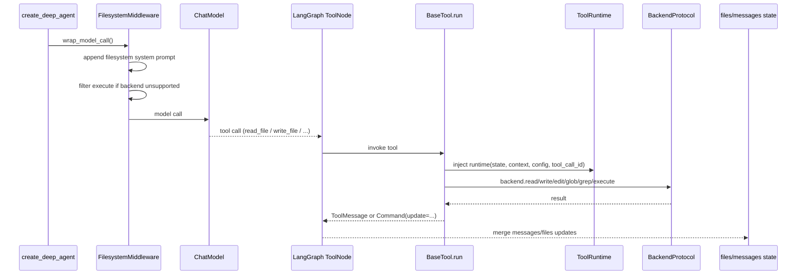

# 第4章：Filesystem 与状态模型

## 学习目标

学完本章，你应该能回答：

1. Deep Agents 的 filesystem 到底是不是“真实文件系统”
2. `FilesystemMiddleware`、`ToolRuntime`、`files` state channel、backend 之间各自负责什么
3. 文件工具是如何运行的，为什么默认 backend 是 `StateBackend`
4. filesystem 能做什么，哪些能力需要 backend 额外支持
5. 哪些约束是 prompt / tool description 规则，哪些才是代码里的硬 contract

---

## 问题是什么

“Deep Agents 有文件系统”这句话很容易让人误解。

它听上去像是：

- agent 直接拿到了宿主机磁盘
- 或者 Deep Agents 内部自己实现了一套完整虚拟文件系统

但源码里真正存在的是四层叠加：

1. 模型可见的 filesystem tool surface
2. graph 内部的 `files` state channel
3. 把文件能力接到具体介质上的 backend adapter
4. 一套写进 system prompt / tool description 的使用约束

如果这四层不拆开，你就会很难判断：

- “这个能力是谁提供的”
- “这次写文件到底落在哪里”
- “为什么某些场景有 `execute`，某些场景没有”
- “read-before-edit 到底是不是硬约束”

---

## 哪一层负责什么

### `LangChain`

- `BaseTool.run()` / `arun()` 负责 tool lifecycle、callback tree、config patch
- tool schema、tool call 输入输出归一化在这里发生

### `LangGraph`

- `ToolRuntime` 把 `state`、`context`、`config`、`tool_call_id`、`stream_writer` 注入工具
- graph state / reducer / checkpoint 决定 `files` 的生命周期

### `Deep Agents`

- `FilesystemMiddleware` 决定暴露哪些文件工具
- 决定 filesystem 相关 system prompt 和 tool descriptions
- 决定大结果何时落盘、何时裁剪消息
- `BackendProtocol` / `SandboxBackendProtocol` 决定最终读写和执行落到什么介质

---

## 代码在哪里

建议同时打开：

- `deepagents/libs/deepagents/deepagents/middleware/filesystem.py`
- `deepagents/libs/deepagents/deepagents/backends/protocol.py`
- `deepagents/libs/deepagents/deepagents/backends/state.py`
- `deepagents/libs/deepagents/deepagents/backends/filesystem.py`
- `deepagents/libs/deepagents/deepagents/backends/composite.py`
- `deepagents/libs/deepagents/deepagents/graph.py`
- `langchain/libs/core/langchain_core/tools/base.py`
- `langgraph/libs/prebuilt/langgraph/prebuilt/tool_node.py`
- `deepagents/libs/deepagents/tests/unit_tests/test_file_system_tools.py`
- `deepagents/libs/deepagents/tests/integration_tests/test_filesystem_middleware.py`

---

## 先给结论：filesystem 机制是什么

更准确的说法是：

> Deep Agents 把一组文件工具装进 agent，把这些工具接到 `BackendProtocol`，再让 graph state 决定文件状态如何在 thread / step / checkpoint 中流动。

所以“filesystem”不是一个单独模块，而是：

- 工具集合：`ls`、`read_file`、`write_file`、`edit_file`、`glob`、`grep`
- 可选执行：`execute`
- 状态载体：`FilesystemState.files`
- 介质适配：`StateBackend` / `FilesystemBackend` / `CompositeBackend` / 其他 backend
- 使用策略：system prompt 里的 read-before-edit、分页读取、避免用 shell `find` / `grep`

---

## 实现怎么工作

### 1. `FilesystemMiddleware` 提供的是 tool surface + policy layer

`FilesystemMiddleware` 初始化时会创建这些工具：

- `ls`
- `read_file`
- `write_file`
- `edit_file`
- `glob`
- `grep`
- `execute`

但这不代表每次都真的能执行 shell。

因为 `execute` 是否真正可用，后面还要看 backend 是否实现了 `SandboxBackendProtocol`。

同一个 middleware 还负责两类策略：

- 往 system prompt 里补 filesystem 使用说明
- 在模型调用前根据 backend 能力过滤 `execute`

所以它不是纯工具注册器，而是“文件能力的装配入口”。

### 2. `FilesystemState.files` 才是 graph 内部真正的文件状态面

`FilesystemState` 里定义了：

- `files: Annotated[..., _file_data_reducer]`

这意味着文件状态在 graph 内不是普通字段，而是带 reducer 的 channel。

`_file_data_reducer` 做的事情很重要：

- 合并新增或更新的文件
- 支持通过 `None` 做删除标记
- 允许多次写入在 state merge 时统一收口

因此，filesystem 不是“工具直接改全局字典”，而是：

- 工具通过 backend 产生读写
- backend 再通过 state / send 机制更新 `files`
- reducer 决定这些更新怎样并进 graph state

### 3. `create_deep_agent()` 把 filesystem 当默认能力装进去

在 `graph.py` 里你会看到：

- 主 agent 默认 middleware 栈里有 `FilesystemMiddleware`
- general-purpose subagent 默认 middleware 栈里也有 `FilesystemMiddleware`
- declarative subagent 的默认 base stack 里同样会加 `FilesystemMiddleware`

所以对大多数 Deep Agents 来说，filesystem 不是“额外插件”，而是默认 harness 的一部分。

这也解释了为什么很多 example 不显式定义文件工具，却仍然能：

- 读文件
- 写文件
- 搜代码
- 在支持 execution 的 backend 上跑命令

### 4. 一条真实执行链：从 model tool call 到 backend 读写

真正的运行链大致是：

1. `FilesystemMiddleware.wrap_model_call()` 在 model call 前更新 system prompt，并按 backend 能力决定是否保留 `execute`
2. model 产出 `read_file` / `write_file` / `edit_file` / `glob` / `grep` / `execute` tool call
3. LangGraph `ToolNode` 调用 tool，并注入 `ToolRuntime`
4. LangChain `BaseTool.run()` 负责 callback/config child run 语义
5. Filesystem tool wrapper 通过 `runtime` 解析 backend，并调用 `backend.read()` / `write()` / `edit()` / `glob()` / `grep()` / `execute()`
6. backend 返回标准化结果
7. tool wrapper 把结果转成 `ToolMessage` 或 `Command(update=...)`
8. LangGraph 再把这些更新合并回 `files` 或 `messages` state

这个链路里没有任何一步是在“绕开上游自己搞一套 agent 执行器”。

### 5. 一张时序图：filesystem tool 是怎么跑起来的

这张图强调三点：

- tool lifecycle 主要还是 LangChain / LangGraph 在跑
- filesystem 的“环境能力”是 backend 提供的
- `files` 的生命周期仍然是 graph state 语义

### 6. `ToolRuntime` 为什么关键

filesystem 工具之所以能在不显式传很多参数的情况下工作，是因为 LangGraph 注入了 `ToolRuntime`。

它能给工具带来：

- `state`
- `context`
- `config`
- `tool_call_id`
- `store`
- `stream_writer`

因此这些现象首先要往上游看，而不是先怪 Deep Agents：

- 工具里为什么拿得到 thread 相关 config
- 为什么 tool result 还能继续带 callback tree
- 为什么某些运行时上下文对子工具仍然可见

### 7. 默认 backend 为什么是 `StateBackend`

Deep Agents 默认不是直接用宿主机磁盘，而是 `StateBackend()`。

这是一个非常重要的设计选择。

`StateBackend` 的核心不是“方便 mock”，而是：

- 它直接通过 LangGraph 的 `CONFIG_KEY_READ` / `CONFIG_KEY_SEND` 读写 `files`
- 写入不是立即改某个全局对象，而是排队进 state channel
- 当前 step 内读取看到的是一致快照
- node boundary 之后，写入才被并进后续 step 可见的 state

这意味着默认 filesystem 更像：

> thread-scoped、checkpoint-aware、graph-native 工作区。

而不是：

> 直接暴露宿主机磁盘。

### 8. `StateBackend` 的真实语义是什么

从 `state.py` 看，`StateBackend` 有几个必须讲清的点：

- 它必须运行在 LangGraph graph context 里
- 在 graph 外直接调用会报错
- 预填文件的推荐方式是 `agent.invoke({"messages": [...], "files": {...}})`
- 文件在同一 thread 内可持续，但不是跨 thread 的长期全局磁盘

这就解释了为什么教程里不能把它写成“普通内存对象”。

它其实是：

- 绑定 graph context 的 backend
- 借助 LangGraph config keys 读写 state
- 与 checkpoint 机制天然兼容

### 9. `FilesystemBackend` 什么时候才是真实宿主机文件系统

如果你显式传：

- `FilesystemBackend(root_dir=...)`

那 filesystem 才会真正去读写宿主机磁盘。

这时要特别注意两件事：

1. `root_dir` 在 `virtual_mode=False` 下主要影响相对路径解析，不是硬安全边界
2. `virtual_mode=True` 也只是虚拟路径语义和路径逃逸防护，不是 sandbox

所以教程里最容易讲错的一句话是：

> “给了 root_dir，agent 就被限制在这个目录了。”

这在默认 `virtual_mode=False` 下并不成立。

### 10. `CompositeBackend` 把 filesystem 变成“虚拟路径视图”

`CompositeBackend` 的价值，不只是“多 backend 拼起来”，而是：

- 按路径前缀做路由
- 把外部路径映射到内部 backend 视图
- 在根目录 `"/"` 下把 routed directories 再聚合回统一列表

经典例子是：

- 默认文件走 `StateBackend`
- `/memories/` 走 `StoreBackend`
- `/artifacts/` 或别的目录走其他介质

因此对 agent 来说，它看到的是单一 filesystem 视图；对维护者来说，底下其实是多介质拼接。

### 11. `execute` 不是 filesystem 的天然组成部分

`execute` 虽然出现在 `FilesystemMiddleware.tools` 里，但它不是任何 backend 都能用。

当前逻辑是：

- middleware 先把 `execute` 作为候选工具建出来
- `wrap_model_call()` 里检查 backend 是否支持执行
- 如果 backend 不支持，就把 `execute` 从当次 request tools 里过滤掉

所以要分清三件事：

- `execute` 出现在源码工具列表里
- `execute` 实际暴露给当次模型
- `execute` 真正在哪个环境执行

这三件事不是同一个层次。

### 12. filesystem 到底能做什么

当前这套机制，按能力面可以分成下面几类：

| 能力 | 由谁提供 | 备注 |
|------|----------|------|
| 列目录 `ls` | `FilesystemMiddleware` + backend `ls` | 返回绝对路径列表或条目 |
| 文本文件分页读取 `read_file` | middleware + backend `read` | 默认支持 `offset` / `limit`，返回带行号内容 |
| 多模态文件读取 | middleware `_handle_read_result` | 图片、音频、视频、PDF 走 multimodal content blocks |
| 新建文件 `write_file` | middleware + backend `write` | 已存在文件默认报错 |
| 精确替换 `edit_file` | middleware + backend `edit` | 依赖 exact string replacement 语义 |
| 文件查找 `glob` | middleware + backend `glob` | 带超时保护 |
| 文本搜索 `grep` | middleware + backend `grep` | 语义是 literal text，不是 regex |
| shell 执行 `execute` | 仅 `SandboxBackendProtocol` | 可带 timeout，上限受 middleware 限制 |
| 大结果落盘 | `FilesystemMiddleware` | tool result 过大时写到 `/large_tool_results/...` |
| 超长用户消息落盘 | `FilesystemMiddleware` | HumanMessage 过大时写到 `/conversation_history/...` |

所以“filesystem 能做什么”不能只回答“读写文件”。

它实际上还是：

- 搜索界面
- 大内容中转层
- 在支持执行的 backend 上的 shell 能力入口

### 13. `read_file` 的真实 contract 比想象中更复杂

`read_file` 不只是“读整个文件字符串”。

它当前还承担了：

- 分页读取
- 行号格式化
- 长行截断说明
- 空文件提醒
- 多模态文件返回 content blocks

所以如果你要改 `read_file`，不是只看 backend 的 `read()` 返回值，还要看 middleware 的 `_handle_read_result()`。

### 14. `edit_file` 的真实 contract 是 exact replacement，不是 patch engine

`edit_file` 当前的语义更接近：

- 给我旧字符串
- 给我新字符串
- 按 exact match 做一次或多次替换

它不是：

- AST 级编辑器
- diff/patch 引擎
- “凭上下文猜哪里该改”的模糊编辑器

因此很多失败其实不是 backend 坏了，而是：

- `old_string` 不唯一
- 文件不存在
- 替换文本不精确

### 15. “必须先读再改”目前更像使用约束，不应过度写成硬状态机

`filesystem.py` 里的 system prompt 和 `edit_file` tool description 都强调：

- 先读再改
- 必须确保文件已经读过

但就当前源码表面看：

- 我看到了这条规则在 prompt / tool description 中被反复强调
- 没看到 `FilesystemMiddleware` 里有独立“读历史登记表”来硬性校验这个顺序

所以一个更严谨的写法是：

> `read-before-edit` 当前显然是核心使用约束，但从 `filesystem.py` 表面实现看，它首先是 prompt/tool contract；不要轻率写成“middleware 内部有独立 read-history state machine”。

这是我基于当前源码做的判断。

### 16. 大结果落盘是 filesystem 机制里非常容易忽略的一层

`FilesystemMiddleware` 还做了两件很 runtime 的事：

- tool result 太大时，写到 `large_tool_results_prefix`
- HumanMessage 太大时，写到 `conversation_history_prefix`

然后模型看到的是：

- 一个截断预览
- 一个可以再 `read_file` 回去的路径

这说明 filesystem 不只是业务文件区，还是：

> context overflow 的缓冲层。

如果你只把它理解成“模型能改代码”，会漏掉这个很重要的运行时角色。

### 17. 一张运行面矩阵

| 你观察到的现象 | 先看哪里 |
|----------------|----------|
| 为什么有 `ls/read_file/write_file/edit_file/glob/grep` | `FilesystemMiddleware.__init__` |
| 为什么这次没有 `execute` | `wrap_model_call()` 的 tool filtering |
| 为什么文件写完下一步才稳定可见 | `StateBackend` + LangGraph step boundary |
| 为什么 `/memories/` 能长期保存 | `CompositeBackend` route + routed backend |
| 为什么大 tool result 只给了预览和路径 | `wrap_tool_call()` + eviction helpers |
| 为什么图片/PDF 读出来不是纯文本 | `_handle_read_result()` 的 multimodal 分支 |

---

## filesystem 与 memory 的关系

两者相关，但不是一回事。

- filesystem 是通用文件能力
- memory 是把某些 `AGENTS.md` source 当作 always-on prompt material 读取

memory 之所以能“保存回去”，靠的不是独立 memory API，而是 filesystem 的：

- `write_file`
- `edit_file`
- backend 持久化能力

所以可以把 memory 理解成：

> 架设在 filesystem 之上的一层特殊读取策略。

---

## 什么时候该修上游

### 更像上游问题

- `ToolRuntime` 注入字段缺失
- tool callback tree / config propagation 异常
- LangGraph step / reducer / checkpoint 行为与你预期不一致

### 更像 Deep Agents 本地问题

- filesystem tools 的默认描述或提示词不合理
- `execute` 过滤逻辑不合理
- 大结果落盘策略不合理
- backend 适配层返回值与 tool wrapper 对不上
- `CompositeBackend` 路由后的外部视图不一致

---

## 容易踩什么坑

- 坑 1：把 filesystem 直接等同于宿主机磁盘。
  默认其实是 `StateBackend`。

- 坑 2：把 backend 当成唯一 state owner。
  graph state 才是主生命周期中心。

- 坑 3：把 `execute` 当成所有 filesystem backend 都天然支持。
  它依赖 `SandboxBackendProtocol`。

- 坑 4：把 read-before-edit 写成已经被单独状态机硬检查的事实。
  当前更稳妥的说法是：这是关键使用约束，但源码表面首先体现为 prompt / tool contract。

- 坑 5：忽略 large result eviction。
  filesystem 还承担 context overflow 缓冲层角色。

---

## 本章小结

- Deep Agents 的 filesystem 不是单一模块，而是 tool surface、`files` state channel、backend adapter、prompt policy 的组合。
- 默认运行介质是 `StateBackend`，所以它首先是 graph-native 工作区，而不是宿主机磁盘。
- `FilesystemMiddleware` 不只提供文件工具，还会动态决定 `execute` 暴露、系统提示词注入，以及大结果落盘。
- 真正的运行链路仍然建立在 LangChain tool lifecycle 和 LangGraph `ToolRuntime` / state 上。
