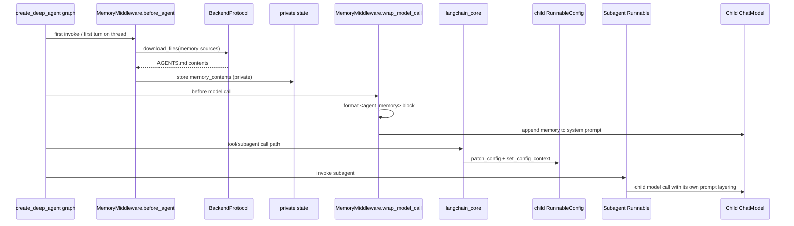
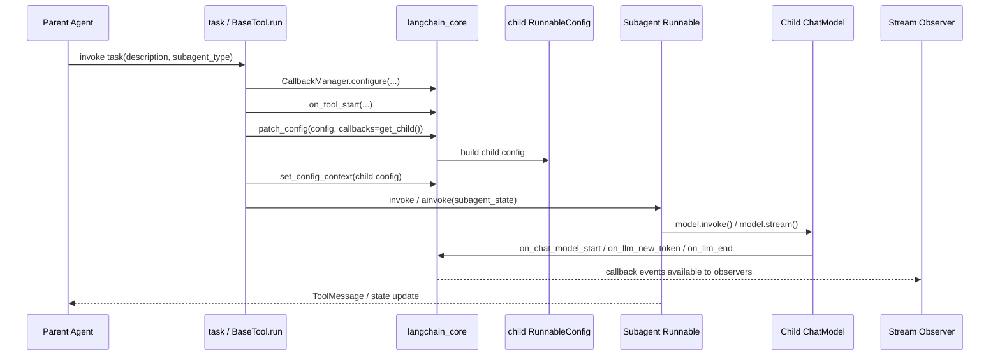

# 第6章：Memory、Skills、Prompt Layering 与 Config 传播

## 学习目标

学完本章，你应该能回答：

1. `AGENTS.md` / `SKILL.md` 属于哪一层约定
2. Deep Agents 的 memory 到底是怎么加载、缓存、注入和写回的
3. system prompt layering、`RunnableConfig`、callback manager 是怎么串起来的
4. 哪些 config 会自然传播到子层，哪些不会
5. 为什么“prompt 里有了某段话”不等于“callback / config / runtime 里也一定有对应变化”

---

## 问题是什么

维护者经常把下面四件事混成一件事：

- prompt 里多了什么
- runtime 里传下去了什么
- callback tree 里看到了什么
- child tool / child model 最终实际拿到了什么

但这四件事分别属于不同 surface：

- prompt layering 是 Deep Agents 的本地装配策略
- `RunnableConfig` / callbacks 是 LangChain primitive
- subgraph / tool runtime 的上下文承接依赖 LangGraph
- child tool / model 是否“真拿到”某个值，还要看上游如何 patch child config

这一章真正要解决的不是“prompt 是怎么拼出来的”，而是：

> 当你在子代理、工具、模型、streaming 里观察到某个值时，它到底是 prompt text、config、callback tree、还是 runtime context 的结果。

---

## 哪一层负责什么

### `LangChain`

- `ensure_config()` 负责把 ambient config 与显式 config 合并
- `patch_config()` 负责在 child run 中替换 callbacks，并清掉 `run_name` / `run_id`
- `CallbackManager.configure()` / `get_child()` 负责构建 callback tree
- `BaseTool.run()` / `BaseChatModel.stream()` 负责触发 tool / model 生命周期事件

### `LangGraph`

- 负责把 runtime context、tool runtime、subgraph namespace 带到执行期
- 让工具和节点能在不显式传参的情况下拿到当前上下文
- 把 `Runtime` / `ToolRuntime` 和 checkpoint / subgraph execution 接起来

### `Deep Agents`

- 决定 `AGENTS.md` / `SKILL.md` 如何进入 system prompt
- 决定 memory / skills middleware 的装配顺序
- 决定哪些私有 state key 不应从 parent 泄漏到 child
- 决定 general-purpose subagent 与 declarative subagent 是否默认加载 skills / memory / prompt 层

---

## 代码在哪里

建议同时打开：

- `deepagents/libs/deepagents/deepagents/graph.py`
- `deepagents/libs/deepagents/deepagents/middleware/memory.py`
- `deepagents/libs/deepagents/deepagents/middleware/skills.py`
- `deepagents/libs/deepagents/deepagents/middleware/subagents.py`
- `deepagents/libs/deepagents/tests/unit_tests/test_subagents.py`
- `langchain/libs/core/langchain_core/runnables/config.py`
- `langchain/libs/core/langchain_core/callbacks/manager.py`
- `langchain/libs/core/langchain_core/tools/base.py`
- `langchain/libs/core/langchain_core/language_models/chat_models.py`

---

## 实现怎么工作

### 1. prompt layering 是 Deep Agents 本地约定

Deep Agents 里的 memory / skills 不是上游默认概念：

- `AGENTS.md` 更像 always-on 记忆材料
- `SKILL.md` 更像按需装载的工作流知识

它们最终都进入 system prompt 或私有 state，但它们是 Deep Agents 的 harness 约定，不是 LangChain / LangGraph 自带语义。

这也是为什么下面两件事必须分开说：

- “prompt 最终长什么样”
- “config / callbacks 最终怎么传播”

前者主要由 `graph.py + memory/skills middleware` 决定，后者主要由 `langchain_core` 决定。

### 2. memory 是“文件化 always-on prompt layer”，不是单独的记忆数据库

如果只看 `create_deep_agent(memory=[...])` 这个接口，最容易误会成：

- Deep Agents 有一套独立 memory service
- memory 会像 RAG 一样按需检索
- memory 更新后会自动实时回流到 prompt

但当前源码表达的其实是另一套模型：

- `memory=` 只是告诉 `graph.py` 把 `MemoryMiddleware` 装进 middleware 栈
- `MemoryMiddleware` 在 `before_agent` / `abefore_agent` 阶段批量读取若干个 `AGENTS.md` 来源
- 读取结果以 `memory_contents` 的形式放进 private state
- 每次 model call 前，再把这些内容格式化成 `<agent_memory>...</agent_memory>` 片段 append 到 system prompt

所以它更像：

> “把若干个 AGENTS.md 文件当成 always-on prompt material 读入”，而不是“有一套独立的 memory retrieval subsystem”。

这和 skills 的差别也很关键：

- memory 是 always-on
- skills 是 progressive disclosure

### 3. memory 的加载链路到底是什么

按当前 `memory.py` 源码，链路大致是：

1. `create_deep_agent(..., memory=[...])` 在 `graph.py` 里追加 `MemoryMiddleware`
2. `MemoryMiddleware.before_agent()` / `abefore_agent()` 检查 state 里是否已有 `memory_contents`
3. 如果还没有，就调用 backend 的 `download_files(...)` / `adownload_files(...)`
4. 按 `sources` 顺序把已有文件读成 `dict[path, content]`
5. 缺失文件会被跳过，不会报错中止
6. `wrap_model_call()` / `awrap_model_call()` 再把格式化后的 memory 段 append 到当前 system prompt

这里有几个维护者很容易忽略的事实：

- memory 是批量下载的，不是逐文件串行工具调用
- memory source 的顺序是 contract，后面的内容只是在 prompt 里排得更后，不是覆盖前者
- memory contents 存在 private state 中，但不会出现在最终对用户返回的 result 顶层字段里

### 4. `memory_contents` 是 private state，但不是“根本不存在的临时变量”

`MemoryState` 里把 `memory_contents` 标成了 `PrivateStateAttr`，这意味着：

- 它不应该暴露成普通 final state surface
- 它也不应该沿 parent-child handoff 随便泄漏

但这不等于它完全不进入 graph state。

从当前测试可以看到：

- `result` 顶层通常看不到 `memory_contents`
- 但 checkpoint / channel values 里可以看到它
- `subagents.py` 还会额外把它列进 `_EXCLUDED_STATE_KEYS` 做 ingress / egress 过滤

所以更准确的说法是：

> `memory_contents` 是“内部持有、外层默认不暴露”的私有 state，不是“完全不落状态”的一次性局部变量。

### 5. memory 从哪里读，取决于 backend，而不是 MemoryMiddleware 自己

`MemoryMiddleware` 不直接访问本地磁盘，它只会调用 backend 协议。

因此 memory 的真实介质由 backend 决定：

| backend | memory 实际从哪读 | 典型场景 |
|---------|------------------|----------|
| `FilesystemBackend` | 宿主机文件系统 | 本地工程目录、真实 `AGENTS.md` 文件 |
| `StateBackend` | graph state / invoke 时传入的 `files` | 默认 backend、短生命周期工作区 |
| `StoreBackend` | `BaseStore` namespace | 长期存储、按 assistant 或 namespace 隔离的 memory |
| `CompositeBackend` | 由 route 决定 | 把 `/memories/`、工作区、artifact 拆到不同介质 |

这也是为什么“Deep Agents memory 怎么工作”这个问题，不能只看 `memory.py`，还要一起看 backend。

### 6. 默认 backend 下，memory 其实可以直接来自 `invoke(files=...)`

这点只看教程很容易漏掉，但测试已经把它钉死了：

- 如果 `create_deep_agent()` 没显式传 backend
- Deep Agents 默认会走 `StateBackend`
- 此时 memory 文件可以来自 `agent.invoke(..., {"files": {...}})` 里的文件状态

也就是说，memory 并不要求宿主机磁盘上真的有一个 `AGENTS.md`。

它也可以只是：

- 当前 thread state 里的一个文件
- 被 checkpoint 保存下来
- 再被 `MemoryMiddleware` 当作 source 读入

这是 Deep Agents 把“文件工具面”和“memory prompt 面”接在一起的关键点。

### 7. `StoreBackend` 下的 memory 更像 namespace-scoped long-term memory

当前测试还说明了另一条重要路径：

- `StoreBackend` 可以按 runtime / `assistant_id` 构 namespace
- 不同 assistant 可以读到不同 `/memory/AGENTS.md`
- 没有 assistant_id 时可以落到默认 namespace

因此，如果你在做多 assistant 或部署环境隔离，真正决定 memory 是否串线的，不只是 prompt 文本，而是：

- backend namespace 设计
- `assistant_id` 或等价上下文
- memory source path 是否稳定

### 8. memory 的“更新机制”不是单独 API，而是文件写回策略

`MEMORY_SYSTEM_PROMPT` 里明确告诉模型：

- 学到值得长期记住的信息时，要用 `edit_file`
- 更新 memory 应该尽量立刻做
- 不要把密钥、token、密码写进 memory

这说明当前 memory 更新不是靠某个独立的 `remember()` API，而是靠：

- `FilesystemMiddleware` 注入的 `write_file` / `edit_file`
- agent 自己去改某个 memory source 文件

所以 memory update 的真实边界是：

- prompt 在鼓励模型这样做
- filesystem tools 允许它这样做
- backend 决定这次写回最终落到哪里

换句话说：

> “会记住”在当前 Deep Agents 里，本质上是“会把某些长期信息写回某个文件并在后续运行中重新读入”。

### 9. `/memories/...` 路径与 `memory=[...]` 不是同一个概念

教程里另一个常见混淆，是把这两件事写成一件事：

- `memory=["/user/.deepagents/AGENTS.md"]`
- backend 里专门存在 `/memories/...` 这类长期目录

它们相关，但不是一回事。

更准确地说：

- `memory=[...]` 是 MemoryMiddleware 的 source 列表
- `/memories/...` 只是某些 backend / example 约定出来的长期存储路径

你完全可以：

- 用 `/user/.deepagents/AGENTS.md` 作为 memory source
- 同时把别的长期笔记放在 `/memories/preferences.md`
- 再由 agent 自己决定要不要读取这些普通文件

只有被放进 `memory=[...]` 的 source，才会 automatically 进入 always-on system prompt memory 段。

### 10. 当前代码更像“per-thread memory snapshot”，不是“每次改文件立刻自动重载”

这一点源码没有直接写成注释，但从实现可以推断：

- `before_agent()` 发现 state 已有 `memory_contents` 时会直接跳过重新下载
- 测试也说明 `memory_contents` 会进入 checkpoint channel values
- 当前仓库没有看到 `edit_file` 后自动刷新 `memory_contents` 的配套逻辑

因此，一个更谨慎也更贴近源码的描述是：

> 当前 memory 在同一 thread 里更像“启动时加载的私有快照”；如果运行中改了底层 memory 文件，不应默认假设这份快照会在同一线程内自动重建。

这是我根据实现和测试做的推断，不是 README 里明文写出的 contract。

### 11. `ensure_config()` 先把“当前 run 的上下文”定出来

在 `langchain_core.runnables.config.ensure_config()` 里，上游会：

- 建立默认 `tags` / `metadata` / `callbacks` / `recursion_limit`
- 合并 contextvar 中的父级 config
- 把未知顶层 key 放进 `configurable`
- 把部分 `configurable` 值镜像进 tracing metadata

这解释了为什么：

- tags 能在子层继续可见
- 某些 metadata 会一路出现在 callback / stream 中
- 即使你没有显式把 config 继续手传，child runnable 仍可能通过 ambient config 感知到父级 run

### 12. callback manager 不是“一个列表”，而是一棵树

`CallbackManager.configure()` 会把：

- inheritable callbacks
- local callbacks
- tags
- metadata
- tracing context

拼成一个 manager。

之后 `run_manager.get_child()` 会：

- 继承 handlers / inheritable handlers
- 继承 tags / metadata
- 把 `parent_run_id` 设为当前 run 的 `run_id`

所以 callback 传播更像 run tree，而不是简单参数透传。

### 13. `BaseTool.run()` 是 child callback tree 的关键节点

工具运行时，上游会：

- `CallbackManager.configure(...)`
- `on_tool_start(...)`
- `patch_config(config, callbacks=run_manager.get_child())`
- `set_config_context(child_config)`

因此，很多“工具内模型调用为什么还能继续带着 callbacks / tags / metadata”的答案，根本不在 Deep Agents 本地工具实现里，而在上游 `BaseTool.run()`。

这里还有一个维护者必须记住的细节：

- ambient child config 是被 patch 过的
- 但如果你的 `_run()` 显式接收 `config` 参数，上游传进去的仍可能是原始显式 config

这意味着“工具内部显式拿到的 config”和“工具内部通过上下文变量拿到的当前 config”不一定是同一个对象。

### 14. `BaseChatModel.stream()` 才是 token callback 的真实发射点

对 streaming 来说，第一个真正值得盯住的点不是 Deep Agents，而是：

- `BaseChatModel.stream()`
- `BaseChatModel.astream()`

它们会：

- `ensure_config(config)`
- `CallbackManager.configure(...)`
- `on_chat_model_start(...)`
- 每个 chunk 上 `on_llm_new_token(...)`
- 结束时 `on_llm_end(...)`

后面 LangGraph 的 `StreamMessagesHandler` 只是观察这些 callback events，并把它们转成外层可消费的 stream parts。

### 15. 一张时序图：从 memory source 到 child model / tool run

为了避免把“memory 进入 prompt”和“config / callback 继续传播”混成一条线，下面这张图把它们一起画出来。

它强调的是：

- memory 先走 backend -> private state -> prompt 这条线
- callback/config 再走 `langchain_core` 的 child run 这条线
- 这两条线会在 model call 前汇合，但不是同一层机制

### 16. 一张时序图：从主线程 tool call 到 child model / tool run

下面这张图故意把“prompt layering”和“config propagation”拆开画，因为维护者最容易把这两条线混成一条线。

这张图强调三个点：

- 子代理内部是否有某段 prompt，属于 prompt layering
- 子代理内部是否继承 callback tree，属于 `patch_config + set_config_context`
- 子代理内部 token 是否对外可见，取决于后续是否有 stream observer 在看这棵 callback tree

### 17. 四列表：你看到的“传播”到底是哪一类

| 面 | 主要来源 | 传播方式 | 常见误判 |
|----|----------|----------|----------|
| system prompt 文本 | Deep Agents middleware / profile / base prompt / memory sources | 装配期或 model call 前改写 | 以为 prompt 里有了文本，就代表 callbacks/config 也同步传了 |
| tags / metadata / callbacks | `RunnableConfig` + `CallbackManager` | `ensure_config()` + `patch_config()` + `get_child()` | 以为它们是 Deep Agents 自己维护的一套 parent-child 机制 |
| `ToolRuntime.context` / `ToolRuntime.state` | LangGraph runtime 注入 | graph/tool execution 期注入 | 以为所有工具参数都是显式函数参数手传 |
| child 最终结果回父线程 | Deep Agents `task` handoff + LangGraph `Command(update=...)` | `ToolMessage` + 非排除 state key 回传 | 以为 streaming 可见性和结果回传是同一回事 |

### 18. 哪些值通常会继续传播，哪些值要谨慎

| 值 | 当前最有把握的结论 | 备注 |
|----|--------------------|------|
| `tags` | 经常会继续进入 child runtime / stream metadata | 已有 subagent tests 覆盖 |
| `metadata` | 常会继续影响 callback / stream metadata | 但要区分 tracing metadata 与普通 state |
| `recursion_limit` | 会进入 child runtime config | 已有 test 覆盖 |
| `ToolRuntime.context` | 会进入子工具 runtime | 已有 test 覆盖 |
| `callbacks` | 不应写成“当前一定完整转发到 subagent 模型调用” | 现有 `xfail` 明确说明仍有缺口 |
| `run_name` / `run_id` | 在 child patch 时会被重置 | 属于设计行为，不是 bug |
| `skills_metadata` / `memory_contents` | 不应泄漏到 child ingress / parent egress | Deep Agents 本地显式过滤 |
| 已编辑的 memory 文件内容 | 不应默认假设同线程内立即重载 | 当前实现更像 per-thread cached snapshot |

### 19. 当前真正被代码和测试支持的传播面

在 Deep Agents 的 subagent 测试里，当前有明确证据支持：

- tags 会继续进入 compiled subagent / runnable lambda
- recursion limit 会继续进入 child runtime
- `ToolRuntime.context` 会继续进入 child tool runtime
- `skills_metadata` / `memory_contents` 会被过滤，不应随 child ingress / parent egress 泄漏

这几类证据分别对应：

- `test_config_passed_to_runnable_lambda_subagent`
- `test_subagent_propagates_recursion_limit_to_tool_runtime`
- `test_context_passed_to_subagent_tool_runtime`
- `test_custom_subagent_does_not_inherit_skills`

### 20. 一张“证据矩阵”：已支持、已知缺口、不要过度推断

| 传播面 | 当前状态 | 依据 |
|--------|----------|------|
| memory source order -> prompt order | 已支持 | `test_memory_middleware_order_matters` |
| missing memory files -> graceful skip | 已支持 | `test_load_memory_handles_missing_file` |
| batch load of multiple memory sources | 已支持 | `test_before_agent_batches_download_into_single_call` |
| default backend memory -> state `files` | 已支持 | `test_create_deep_agent_with_memory_default_backend` |
| store-backed memory namespace isolation | 已支持 | `test_memory_middleware_with_store_backend_assistant_id` |
| `memory_contents` hidden from final result | 已支持 | `test_agent_with_memory_middleware_async` / sync variant |
| tags -> child runnable config | 已支持 | `test_config_passed_to_runnable_lambda_subagent` |
| recursion limit -> child `ToolRuntime.config` | 已支持 | `test_subagent_propagates_recursion_limit_to_tool_runtime` |
| parent context -> child `ToolRuntime.context` | 已支持 | `test_context_passed_to_subagent_tool_runtime` |
| parent callbacks -> subagent model invocations | 已知缺口 | `test_subagent_propagates_callbacks_to_model_calls` 仍是 `xfail` |
| parent skills metadata -> custom subagent | 明确不该传播 | `test_custom_subagent_does_not_inherit_skills` |
| child private metadata -> parent final state | 明确不该传播 | `_EXCLUDED_STATE_KEYS` + 相关 tests |
| 已编辑 memory 文件 -> 同线程自动重载 | 没看到证据支持 | 需谨慎，不要写成既成事实 |

维护者写教程时，应该把“当前没有证据支持”与“当前明确不支持”分开写。

### 21. `skills_metadata` / `memory_contents` 为什么被过滤

Deep Agents 既依赖上游 state schema，也在本地显式过滤：

- `skills_metadata`
- `memory_contents`

原因不是重复，而是双保险：

- 这些 key 在各自 middleware state 里属于 private state
- subagent ingress 时还要再过滤一次，避免 parent 私有上下文误泄漏给 child
- child egress 时还要避免这些材料重新冒泡到 parent，污染主线程可见面

这也解释了为什么：

- “主 agent 装了 SkillsMiddleware”
- 不等于“所有 declarative / compiled child 都天然看到同一份 skills state”

---

## `AGENTS.md` 与 `SKILL.md` 的边界

### `AGENTS.md`

- 更接近长期、持续生效的行为约束
- 常与 memory middleware 一起看
- 更像“这个 harness 持续遵循的全局说明”

### `SKILL.md`

- 更接近任务导向的可检索工作流模块
- 常与 skills middleware 一起看
- 更像“按需装载进 prompt / private state 的工作流知识”

它们都不是上游通用标准；它们是 Deep Agents 的 harness convention。

---

## 排障时最常见的三个误判

### 误判 1：prompt 里有了某段文本，所以 child 肯定也继承了对应 callbacks

不成立。prompt layering 和 callback/config propagation 是两条线。

### 误判 2：父级 middleware 没继承，所以 child 一定完全脱离父 run

也不成立。middleware 继承和 callback tree / ambient config 传播是两套机制。

### 误判 3：stream 里看到了某个子代理 token，所以一定是 Deep Agents 主层做了拦截

不成立。那更可能是：

- LangChain callback tree 继续存在
- LangGraph `StreamMessagesHandler` 正在观察这棵树

---

## 什么时候该修上游

### 更像上游问题

- `RunnableConfig` merge / patch 行为不符预期
- callback manager child tree 构造异常
- 工具或模型内部 context propagation 失效
- `run_name` / `run_id` 在 child run 的处理与你理解不一致

### 更像 Deep Agents 本地问题

- memory / skills middleware 顺序不合理
- private state 过滤边界不合理
- prompt layering 与默认 subagent 策略冲突
- general-purpose subagent 与 custom subagent 的 skills / memory 继承策略不清晰

---

## 容易踩什么坑

- 坑 1：把“prompt 里出现了某段文本”直接等同于“callbacks/config 也一定传到了对应子层”。

- 坑 2：把 callback 传播与父 middleware 继承混为一谈。
  callback tree 是上游 runnable/tool 协议，父 middleware 继承是本地装配策略。

- 坑 3：忽略 `xfail` 测试，继续把 callbacks 传播写成既成事实。

- 坑 4：只看显式 `config=` 参数，不看 ambient config。
  很多 child propagation 就发生在 `set_config_context(...)` 这条线。

---

## 本章小结

- `AGENTS.md` / `SKILL.md` 是 Deep Agents 约定。
- Deep Agents memory 本质上是“通过 backend 读取若干 `AGENTS.md` source，再以 private state + system prompt 片段形式注入”的文件化 always-on memory。
- memory 更新当前主要靠 `edit_file` / `write_file` 改写底层 source 文件，而不是独立 memory API。
- `RunnableConfig` / callback manager 是 LangChain primitive。
- runtime context 与 child execution 落地依赖 LangGraph。
- prompt layering、config propagation、callback tree、runtime context 必须分开理解。
- 对 maintainer 来说，最重要的不是“理论上应该传播什么”，而是“当前哪些传播面已经被测试证明，哪些还只是预期”。
