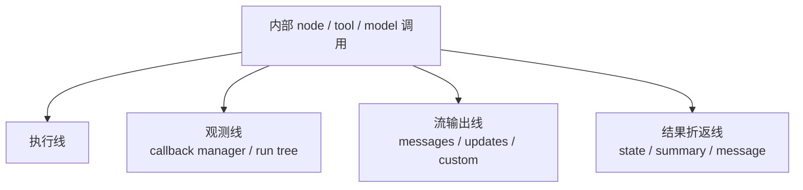

# 第9章：传播层总览与四条线

## 本章回答什么

- Part 3 为什么不再把 callbacks、streaming、subagent 折返、可见性散写在别的章节里
- 维护者看到一次内部 node / tool / model 调用时，为什么必须同时分开看执行线、观测线、流输出线、结果折返线
- “能看到”“能拦截”“会回到 parent”“会进入 state / summary”为什么不是同一件事
- 后续关于 callback/config、streaming、subagent propagation 的章节，为什么都要复用这一套四线模型

## 在整套系统中的位置

- 横向主题：`Propagation`、`Visibility`、`Observation`
- 前置章节：[README](../README.md)、[前言：如何使用本教程](../00-preface.md)、[第5章：Tools 作为 Runtime Surface](../part2-core-runtime/05-tools-as-runtime-surface.md)、[第6章：Memory、Skills、Prompt Layering 与 Config 传播](../part2-core-runtime/06-memory-skills-and-system-prompt-layering.md)、[第7章：Subagents、任务交接与上下文隔离](../part2-core-runtime/07-subagents-and-context-isolation.md)、[第8章：Summarization、Permissions 与安全边界](../part2-core-runtime/08-summarization-permissions-and-safety-boundaries.md)
- 后续章节：[第10章：Callbacks、Config 与 Callback Manager](./10-callbacks-config-and-callback-manager.md)、[附录 D：传播与可见性速查表](../appendix/propagation-and-visibility-cheatsheet.md)

这一章是 Part 3 的主线入口，不是附录式补丁。它先给出维护者判断传播问题时必须复用的统一坐标系，后面的 callback/config、streaming、subagent matrix 章节都只是在这套坐标系里展开更细的 case。

## 静态结构

传播层不是单个模块，而是三层协作结果：

| 线 | 首先由谁负责 | 第一站应看哪里 |
| --- | --- | --- |
| 执行线 | `LangGraph` + `LangChain` | `langgraph` graph runtime、`BaseTool.run()`、`BaseChatModel.invoke()/stream()` |
| 观测线 | `LangChain` | `RunnableConfig`、`ensure_config()`、`CallbackManager.configure()`、`get_child()` |
| 流输出线 | `LangGraph` + `LangChain` | `StreamMessagesHandler`、`stream_mode="messages" / "updates" / "custom"`、`stream_writer` |
| 结果折返线 | `Deep Agents` + `LangGraph` | `ToolMessage`、`Command(update=...)`、subagent return surface、summary / state reducer |

建议同时打开这些文件：

- `langchain/libs/core/langchain_core/runnables/config.py`
- `langchain/libs/core/langchain_core/callbacks/manager.py`
- `langchain/libs/core/langchain_core/tools/base.py`
- `langchain/libs/core/langchain_core/language_models/chat_models.py`
- `langgraph/libs/langgraph/langgraph/pregel/main.py`
- `langgraph/libs/langgraph/langgraph/pregel/_messages.py`
- `deepagents/libs/deepagents/deepagents/middleware/subagents.py`

最重要的静态判断是：

- callback tree 不是 state reducer
- `messages` 流不是最终结果面
- child return 不是 token 级 observability
- 本地 middleware 继承边界也不是 callback/config 传播边界

## 运行时链路

一次内部调用，最稳妥的读法是按四条线并排看，而不是把它们拍成一条“总传播链”：

1. 执行线先决定某个 node、tool、model call 到底有没有真的跑起来。
2. 观测线再决定这次执行有没有被 callback manager / run tree 接住。
3. 流输出线进一步决定外层 consumer 能否在 `messages`、`updates`、`custom` 里看到事件。
4. 结果折返线最后决定哪些结果会变成 `ToolMessage`、state update、summary 或 parent 可消费的有限回传面。

这四步经常发生在同一次运行里，但它们既不保证同时发生，也不保证对同一个观察者都可见。典型例子：

- 某次模型调用真的执行了，但因为 `nostream`，外层 `messages` consumer 看不到 token。
- 外层 consumer 看到了 token，但 parent 最终拿到的仍然只是压缩后的 `ToolMessage`。
- `task` handoff 在 callback tree 里清晰可见，不等于 parent middleware 自动拦住了 compiled subagent 的内部 model call。

所以传播层真正回答的不是“有没有传下去”，而是：

- 沿哪条线传
- 谁能看见
- 谁能拦截
- 最终折返到哪里

## 传播 / 可见性 / 拦截点

### 执行线

执行线回答的是：“这次内部调用到底在哪里真正发生。”

常见执行面包括：

- LangGraph node / subgraph step
- LangChain `BaseTool.run()` / `arun()`
- LangChain `BaseChatModel.invoke()` / `stream()`
- Deep Agents `task` handoff 之后的 child runnable

这一条线首先关心运行边界，而不是可见性：

- tool 被模型选中，不等于工具已经成功执行
- child graph 开始执行，不等于 parent 一定能看到 child 内部全部节点
- compiled subagent 是 use-as-is，不等于它自动脱离全部 callback/config 传播语义

### 观测线

观测线回答的是：“这次执行有没有进入 callback manager / run tree，因此能被 tracing、handler、调试面板或上游观察机制看到。”

这一条线的核心对象不是 prompt，也不是 state，而是：

- `RunnableConfig`
- `CallbackManager.configure()`
- `run_manager.get_child()`
- `set_config_context()` / `ensure_config()`

因此观测线最常见的误判是把“父级本地 middleware 是否继承”误写成“callback tree 是否连着”。这两者可能相关，但绝不是同一条 contract。更细的证据链见 [第10章：Callbacks、Config 与 Callback Manager](./10-callbacks-config-and-callback-manager.md)。

### 流输出线

流输出线回答的是：“外层 consumer 在运行过程中实时看到了什么。”

这里只关心对外暴露的 stream surface：

- `messages`：message / token 级流事件
- `updates`：state update 级别的增量可见面
- `custom`：通过 `runtime.stream_writer(...)` 或 `ToolRuntime.stream_writer(...)` 主动发出的阶段事件

这条线必须和观测线分开记：

- callback tree 连着，通常有利于 `messages` 观测成立，但二者仍不是同义词
- `nostream` 只控制 `messages` 可见性，不直接决定 state update 或最终结果折返
- 没有实时流输出，也不代表执行没有发生

### 结果折返线

结果折返线回答的是：“运行结束后，哪些东西真正回到了 parent、state、summary 或下一轮 message history。”

典型折返面包括：

- 普通 tool result -> `ToolMessage`
- node / tool return -> `Command(update=...)` 或 state reducer
- child runnable 结束 -> 压缩后的 parent 可消费结果
- summarization / compaction 之后的保留面

这一条线决定的是后果，不是实时 observability：

- 看不到 token，不代表不会有最终结果折返
- 看到了阶段事件，不代表这些事件会进入 checkpoint
- child 内部保留了很多状态，不代表 parent 自动拿得到整包 child state

## 扩展接口

传播层相关需求，应该先判断自己要改哪一条线，再动代码：

- 想改实际执行边界：先查 tool / subagent / graph runtime 装配，而不是先改 stream。
- 想改 tracing、callbacks、run tree：先查 `RunnableConfig` 与 callback manager，而不是先改 prompt。
- 想改前端或 consumer 能看到什么：先查 `stream_mode`、`nostream`、`stream_writer`。
- 想改 parent 最终拿到什么：先查 `ToolMessage`、state update、subagent return filtering、summary contract。

最常见的坏改法是跨线下手：例如你真正想减少外层 token 可见性，却去改 child return surface；或者你真正想补全 tracing，却去改 summary。

## 常见问题与排障入口

- “我看到了 token，所以 parent 一定完整拦截了内部调用”：先分开看观测线和流输出线，再去读 [第10章](./10-callbacks-config-and-callback-manager.md)。
- “我没看到 token，所以内部调用一定没发生”：先查执行线，再查是否有 `nostream`、是否开启了 `messages`、是否开启了 `subgraphs=True`；可结合 [附录 D](../appendix/propagation-and-visibility-cheatsheet.md)。
- “compiled subagent 是 use-as-is，所以它一定完全脱离父 run”：这是把执行边界和观测线混写了；先查 callback/config，再查 runnable 自己有没有覆写。
- “最终结果回到了 parent，所以中间 token 一定都可见”：这是把结果折返线和流输出线混写了。
- “我想修传播问题，但不知道该去 LC、LG 还是 DA”：先问自己坏在哪条线；观测线通常先查 `LangChain`，流输出线通常先查 `LangGraph`，结果折返线常常要把 `Deep Agents` 一起看。

## 本章结论

- 谁提供：传播层不是单一实现，而是 `LangChain` 的 callback/config 语义、`LangGraph` 的 runtime/stream 语义，以及 `Deep Agents` 的 handoff/return surface 共同组成。
- 如何传播：同一次内部调用至少要拆成执行线、观测线、流输出线、结果折返线四条并行判断，不能再用“看到了 / 没看到”这一种说法概括。
- 修在哪层：先判断问题坏在哪条线，再去对应层修；不要把 tool/subagent 执行边界、callback tree、stream exposure、parent return surface 混成一个补丁点。
