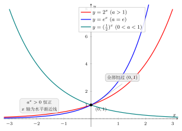

# 第2章：指数函数的定义、底数与基本性质

> 一旦把幂中的“指数”从整数推广到实数，指数函数就真正成为函数，而不再只是记号。

## 学习目标

完成本章学习后，你将能够：

1. 理解指数函数 $a^x$ 的定义条件
2. 知道为什么底数必须满足 $a>0$ 且 $a\neq1$
3. 掌握指数函数的定义域、值域与单调性
4. 识别不同底数对图像和增长速度的影响
5. 形成对指数函数“正、快、平滑”的整体直觉

---

## 正文内容

### 2.1 从幂到函数

当指数从整数推广到实数时，我们得到：

$$
y=a^x
$$

这就是指数函数。它的本质是：**底数固定，指数变化**。

指数函数之所以重要，是因为它把“变化中的倍率”抽象成了一个连续函数。

### 2.2 为什么要求 $a>0$

若 $a<0$，那么当 $x$ 取非整数时，$a^x$ 在实数范围内往往没有良好定义。例如：

$$
(-2)^{1/2}
$$

不是实数。

为了让 $a^x$ 在实数范围内对所有实数 $x$ 都有意义，我们要求：

$$
a>0
$$

### 2.3 为什么排除 $a=1$

如果 $a=1$，那么：

$$
1^x=1
$$

图像是一条水平直线，没有增长或衰减的信息。它不是没有价值，但过于平凡，因此通常排除。

### 2.4 基本性质

当 $a>0,a\neq1$ 时，指数函数具有如下性质：

- 定义域：$\mathbb{R}$
- 值域：$(0,+\infty)$
- 图像恒过点 $(0,1)$
- 当 $a>1$ 时单调递增
- 当 $0<a<1$ 时单调递减

这是指数函数最重要的结构信息。

### 2.5 单调性的原因

当 $a>1$ 时，指数每增加一点，函数值都会放大；当 $0<a<1$ 时，每增加一点，函数值都会缩小。

可以把它理解成：

- $a>1$：放大器
- $0<a<1$：缩小器

### 2.5.1 同一个公式，为什么会分成两种性格

很多初学者会把

$$
y=a^x
$$

看成“始终同一种曲线，只是陡一点或缓一点”。其实底数落在 1 的哪一侧，会让函数呈现两种根本不同的行为：

| 底数范围 | 每向右走一步会发生什么 | 图像整体感觉 |
|------|------|------|
| $a>1$ | 乘上一个大于 1 的因子 | 越走越高，表示增长 |
| $0<a<1$ | 乘上一个小于 1 的因子 | 越走越低，表示衰减 |

所以“底数”不只是一个数字参数，它决定了你看到的是：

- 增长机制
- 还是衰减机制

这也是为什么后面一旦进入应用题，第一步几乎总要先看：

> 底数究竟在 1 的哪一侧？

### 2.5.2 一个最小判断流程：看到 $a^x$ 先问什么

在真正算数值之前，可以先做三个快速判断：

1. **底数是否合法？** 是否满足 $a>0$ 且 $a\neq1$？
2. **图像向哪边走？** 是 $a>1$ 的增长型，还是 $0<a<1$ 的衰减型？
3. **比较发生在哪个区间？** 是在 $x>0$ 的右侧，还是在 $x<0$ 的左侧？

这个流程看起来很短，但能帮你提前避免很多后面才会反复出现的错误，比如：

- 把底数更大误当成函数处处更大
- 看到衰减型指数却还按增长型直觉判断
- 忽略左半轴与右半轴上的比较会不一样

### 2.6 典型图像

指数函数图像有几个共同特征：

- 在 $x=0$ 处取值为 1
- 始终在 $x$ 轴上方
- 对于增长型函数，左侧贴近 0，右侧快速上升
- 对于衰减型函数，左侧很高，右侧逐渐贴近 0

下图把 $y=2^x$、$y=e^x$（$a>1$ 递增）与 $y=\left(\tfrac12\right)^x$（$0<a<1$ 递减）画在一起：三条曲线都恒过 $(0,1)$、都保持 $a^x>0$ 恒正，并以 $x$ 轴为水平渐近线；底数在 1 的哪一侧，决定了它向右是上升还是下降。

### 2.6.1 先抓三个锚点，再看整条曲线

初学指数函数时，最稳的办法不是一上来追求“画得很像”，而是先抓住几个稳定锚点：

$$
(-1,\tfrac1a),\qquad (0,1),\qquad (1,a)
$$

因为：

- $a^0=1$，所以图像一定过 $(0,1)$
- $a^1=a$，所以图像一定过 $(1,a)$
- $a^{-1}=\dfrac1a$，所以图像一定过 $(-1,\dfrac1a)$

这三个点能帮助你快速判断：

- 底数大时，右侧增长更快
- 但在 $x<0$ 的区域，较大底数反而更低

因此“底数更大”并不等于“整张图 everywhere 都更高”，它要结合横坐标所在区间来判断。

### 2.6.2 为什么值域不包含 0，但图像又一直靠近 0

无论 $x$ 取什么实数，只要 $a>0$，就有

$$
a^x>0
$$

所以指数函数永远不会真正取到 0。

但当：

- $a>1$ 且 $x\to-\infty$ 时，$a^x\to0$
- $0<a<1$ 且 $x\to+\infty$ 时，$a^x\to0$

也就是说，图像会越来越贴近 $x$ 轴，却不会碰到它。这个现象在后面讨论渐近线、极限和衰减模型时非常重要。

### 2.6.3 识图时的两个快速判断

看到 $y=a^x$，可以先不算细节，先问两个问题：

1. **底数是在 1 的哪一侧？**
   - 若 $a>1$，图像向右上升
   - 若 $0<a<1$，图像向右下降
2. **横坐标是在 0 的哪一侧？**
   - 当 $x>0$ 时，较大底数通常给出较大函数值
   - 当 $x<0$ 时，顺序往往会反过来

例如比较 $2^x$ 与 $5^x$：

- 在 $x=2$ 时，$5^2>2^2$
- 在 $x=-2$ 时，$5^{-2}<2^{-2}$

这说明比较指数函数大小时，不能只盯着“底数谁大”，还要看所处区间。

### 2.6.4 一个常用重写：衰减也可以看成增长的镜像

当 $0<a<1$ 时，常可把它写成

$$
a=\frac1b \qquad (b>1)
$$

于是

$$
a^x=\left(\frac1b\right)^x=b^{-x}
$$

这有两个好处：

- 把“递减型指数”转写成更熟悉的“大于 1 的底数”
- 帮助理解 $y=(1/2)^x$ 和 $y=2^{-x}$ 其实是同一条曲线

这个视角在后面讨论反函数与对数函数时会很有用，因为它能把“衰减”问题重新翻译成熟悉的增长语言。

---

## 例题

**问题**：比较 $2^x$、$3^x$、$(1/2)^x$ 的图像特征。

**思路**：

- $2^x$ 和 $3^x$ 都递增，且 $3^x$ 增长更快
- $(1/2)^x$ 递减，相当于 $2^{-x}$
- 三者都经过 $(0,1)$

可进一步比较同一横坐标下的函数值大小。

---

## 常见误区与检查清单

- 是否把定义域误写成 $x>0$？
- 是否忽略了指数函数的值域不包含 0？
- 是否把 $a=1$ 误当作“普通指数函数”？
- 是否混淆了“底数大”与“图像一定更高”？

---

## 本章小结

| 主题 | 结论 |
|------|------|
| 定义 | $y=a^x$，$a>0,a\neq1$ |
| 定义域 | 全体实数 |
| 值域 | 正实数 |
| 单调性 | $a>1$ 递增，$0<a<1$ 递减 |
| 图像特征 | 过 $(0,1)$，不穿过 $x$ 轴 |

---

## 分级例题精练

> 本节精选 6 道例题，分三档难度：**初中基础 ★** / **高中核心 ★★** / **高阶拓展 ★★★**。每题含【题目】【解】【点评】，建议先自行尝试再看解。

### 例题精练 1（★ 初中基础）

**题目**：对函数 $y=3^x$，分别求 $x=0,1,-1,2$ 时的函数值。

**解**：

按定义代入即可，注意负指数取倒数：

$$
3^0=1,\qquad 3^1=3,\qquad 3^{-1}=\frac13,\qquad 3^2=9
$$

**点评**：$3^0=1$ 印证了“图像恒过 $(0,1)$”；$3^1=3$ 给出锚点 $(1,a)$；$3^{-1}=\tfrac13$ 给出锚点 $(-1,\tfrac1a)$。这正是 §2.6.1 的三个锚点。

### 例题精练 2（★ 初中基础）

**题目**：判断下列哪些可以作为指数函数 $y=a^x$ 的底数：$a=2$、$a=1$、$a=0$、$a=-3$、$a=\tfrac12$。

**解**：

指数函数要求 $a>0$ 且 $a\neq1$（见 §2.2、§2.3）。

- $a=2$：满足 $a>0$ 且 $a\neq1$，可以。
- $a=1$：被排除，因为 $1^x\equiv1$ 是水平直线，没有增长或衰减信息。
- $a=0$：不满足 $a>0$，不可以（且 $0^x$ 在 $x\le0$ 时无意义）。
- $a=-3$：不满足 $a>0$，如 $(-3)^{1/2}$ 不是实数，不可以。
- $a=\tfrac12$：满足 $a>0$ 且 $a\neq1$，可以（属衰减型）。

所以合法底数为 $a=2$ 与 $a=\tfrac12$。

**点评**：看到 $a^x$，第一步永远先做 §2.5.2 的“底数是否合法”检查，再谈增长还是衰减。

### 例题精练 3（★★ 高中核心）

**题目**：判断 $y=2^x$ 与 $y=\left(\tfrac13\right)^x$ 的单调性，并比较二者在 $x=-1$ 处的函数值。

**解**：

由底数定单调性（§2.4）：

- $2>1$，故 $y=2^x$ 在 $\mathbb{R}$ 上单调递增；
- $0<\tfrac13<1$，故 $y=\left(\tfrac13\right)^x$ 在 $\mathbb{R}$ 上单调递减。

在 $x=-1$ 处：

$$
2^{-1}=\frac12,\qquad \left(\frac13\right)^{-1}=3
$$

比较得 $\left(\tfrac13\right)^{-1}=3>\tfrac12=2^{-1}$。

**点评**：在左半轴（$x<0$），衰减型函数的值可以反超增长型。再次说明“底数大小”不能脱离横坐标区间单独判断函数值高低（§2.6.3）。

### 例题精练 4（★★ 高中核心）

**题目**：求函数 $y=2^{\,x-3}$ 的定义域和值域。

**解**：

指数 $x-3$ 是关于 $x$ 的一次式，对任意实数 $x$ 都有意义，故

$$
\text{定义域：}\ \mathbb{R}
$$

令 $t=x-3$，当 $x$ 取遍 $\mathbb{R}$ 时 $t$ 也取遍 $\mathbb{R}$，而 $2^{t}>0$ 且能取到 $(0,+\infty)$ 内任意值，故

$$
\text{值域：}\ (0,+\infty)
$$

**点评**：指数位置上换成任意一次式，只是把图像水平平移，并不改变“定义域为 $\mathbb{R}$、值域为正实数”这两条结构性结论。

### 例题精练 5（★★ 高中核心）

**题目**：已知指数函数 $y=a^x$（$a>0,a\neq1$）的图像经过点 $(2,9)$，求底数 $a$ 并写出函数解析式。

**解**：

把点 $(2,9)$ 代入：

$$
a^2=9
$$

解得 $a=3$ 或 $a=-3$。由底数约束 $a>0$，舍去 $a=-3$，故

$$
a=3,\qquad y=3^x
$$

**点评**：由“过定点”反求底数，是先列方程 $a^{x_0}=y_0$，再用 $a>0,a\neq1$ 筛掉不合法的根。底数约束在这里直接决定了取舍。

### 例题精练 6（★★★ 高阶拓展）

**题目**：设 $a>0$ 且 $a\neq1$。讨论关于 $a$ 的取值，不等式 $a^{2}<a^{3}$ 何时成立。

**解**：

把比较 $a^2$ 与 $a^3$ 看成在同一个函数 $y=a^x$ 上比较 $x=2$ 与 $x=3$ 两处的值（注意 $3>2$）。

- 若 $a>1$：函数单调递增，自变量大的函数值更大，故 $a^3>a^2$，不等式 $a^2<a^3$ **成立**。
- 若 $0<a<1$：函数单调递减，自变量大的函数值反而更小，故 $a^3<a^2$，不等式 **不成立**。

也可直接作差验证：$a^3-a^2=a^2(a-1)$。因 $a^2>0$，符号由 $a-1$ 决定——当 $a>1$ 时为正，当 $0<a<1$ 时为负，与上面结论一致。

综上，$a^2<a^3$ 当且仅当 $a>1$。

**点评**：比较同底不同指数的幂，本质是在用底数所决定的单调性（§2.5）。把数值比较翻译成“在同一条曲线上比两个自变量”，是处理含参指数不等式的通用思路；作差法 $a^2(a-1)$ 则提供了独立的校验。

---

## 练习题

1. 判断 $y=2^x$、$y=(1/3)^x$、$y=1^x$ 的单调性。
2. 说明为什么指数函数的值域不会包含 0。
3. 画出 $y=2^x$ 与 $y=(1/2)^x$ 的大致图像。
4. 解释为什么 $a>0,a\neq1$ 是必要条件。
5. 试比较 $2^x$ 和 $3^x$ 的增长速度。

