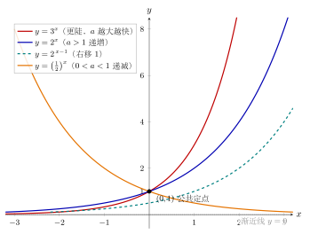

# 第4章：图像、变换与底数比较

> 指数函数最先“说话”的方式不是代数，而是图像：它会直接告诉你增长、衰减、渐近趋势和参数在整体行为中的角色。

## 学习目标

完成本章学习后，你将能够：

1. 画出 $y=a^x$ 的基本图像，并说出其关键锚点与渐近特征
2. 理解平移、伸缩和翻折对指数图像性质的影响
3. 比较不同底数在不同区间上的增长快慢
4. 看懂一般形式 $y=Aa^{x-h}+k$ 的几何意义与参数作用
5. 用图像快速判断函数的定义域、值域、单调性与大致位置

---

## 正文内容

### 4.1 基本图像先告诉我们什么

指数函数

$$
 y=a^x \, , \qquad a>0,\ a\neq 1
$$

的图像有几个最值得先抓住的结构：

- 一定经过点 $(0,1)$，因为 $a^0=1$
- 在整个实数范围内都为正，因此图像始终在 $x$ 轴上方
- 永远不会与 $x$ 轴相交，因为 $a^x$ 不会取到 0
- 会逐渐靠近某条水平线，但通常不会真正碰到它

这些结论不是零碎性质，而是后面读图的起点。

#### 4.1.1 两类底数，两种整体趋势

- 当 $a>1$ 时，$a^x$ 从左向右递增，右侧越来越快地上升
- 当 $0<a<1$ 时，$a^x$ 从左向右递减，右侧逐渐贴近 0

也就是说，底数决定的不是“某一个点的值”，而是整条曲线的整体方向。

下图把几条典型曲线放在一起对照：$y=2^x$ 与 $y=3^x$ 都随 $a>1$ 而递增、且底数越大越陡；$y=\left(\tfrac12\right)^x$ 因 $0<a<1$ 而递减；虚线 $y=2^{x-1}$ 演示了向右平移 $1$ 个单位。所有曲线都过公共定点 $(0,1)$，并以 $y=0$ 为水平渐近线。

#### 4.1.2 为什么图像总经过 $(0,1)$

这是指数函数最重要的锚点。无论底数是 $2$、$3$ 还是 $\tfrac12$，只要写成 $a^x$，在 $x=0$ 处都满足

$$
a^0=1
$$

因此图像一定经过 $(0,1)$。后面一旦遇到平移变换，这个锚点也会跟着移动，所以“先找锚点”是读图最快的方法之一。

#### 4.1.3 渐近线从哪里来

当 $a>1$ 时，$x\to -\infty$，有 $a^x\to 0$；
当 $0<a<1$ 时，$x\to +\infty$，同样有 $a^x\to 0$。

因此，最基本的指数函数都有水平渐近线

$$
y=0
$$

这条渐近线在后面的平移变换里会整体上移或下移，所以读一般图像时，先看渐近线往往比先代具体数值更重要。

---

### 4.2 如何从图像快速读性质

看一条指数曲线时，推荐按下面顺序读：

1. 先看有没有明显的水平渐近线
2. 再看锚点在什么位置
3. 再判断是递增还是递减
4. 再看有没有翻折、拉伸或平移
5. 最后再去估计具体点值

这比一开始就套公式更稳定，因为图像最擅长表达的是“整体行为”。

### 4.2.1 一个读图检查表：先看哪几个量

如果题目直接给出函数

$$
y=Aa^{x-h}+k
$$

你可以先快速做下面四件事：

- 看 $k$：先锁定水平渐近线 $y=k$
- 看 $h$：找“指数部分等于 1”的锚点横坐标 $x=h$
- 看 $A$：判断图像在渐近线上方还是下方，是否发生翻折
- 看 $a$：判断原始趋势是递增还是递减

这个检查表的价值是：

> 先把整条曲线的骨架看出来，再去补细节。

### 4.2.2 定义域和值域怎么读

对最基本的 $y=a^x$：

- 定义域是全体实数 $\mathbb R$
- 值域是 $(0,+\infty)$

原因是：指数可以取任意实数，但输出永远为正。

如果后面发生竖直平移，例如变成 $y=a^x+k$，那么值域就会整体平移成

$$
(k,+\infty)
$$

或在翻折后变成

$$
(-\infty,k)
$$

所以读值域时，关键不是死记，而是看图像相对渐近线在上方还是下方。

### 4.2.3 单调性怎么读

- 若底数 $a>1$，图像从左到右上升
- 若 $0<a<1$，图像从左到右下降

如果前面再乘一个负系数 $A<0$，则会上下翻折，单调性也会随之反转。

因此，判断单调性时，不能只盯着底数，还要一起看前面的系数符号。

---

### 4.3 一般形式 $y=Aa^{x-h}+k$ 在说什么

指数图像最常见的变形形式是

$$
y=Aa^{x-h}+k
$$

这四个符号分别控制不同层面的几何信息：

- $a$：决定原始图像是递增还是递减，以及增长快慢
- $h$：控制水平平移
- $k$：控制竖直平移，也就是控制水平渐近线的位置
- $A$：控制竖直伸缩；若 $A<0$，还会产生关于 $x$ 轴的翻折

#### 4.3.1 为什么 $h$ 是向右平移

很多人会把 $x-h$ 看反。最稳妥的理解方法是先找“原来在 $x=0$ 的点跑到了哪里”。

对于基础函数 $y=a^x$，锚点是 $(0,1)$。变成

$$
y=a^{x-h}
$$

时，当 $x=h$，指数部分才等于 0，所以图像经过点

$$
(h,1)
$$

这说明它是向右平移了 $h$ 个单位，而不是向左。

#### 4.3.2 为什么 $k$ 决定渐近线

对基础图像来说，水平渐近线是 $y=0$。若整体加上 $k$，就变成

$$
y=a^x+k
$$

于是整条曲线都被向上或向下平移，渐近线也随之变成

$$
y=k
$$

所以读一般图像时，先找 $k$，往往能立刻锁定整体位置。

#### 4.3.3 $A$ 不只是“乘了一个数”

若 $A>0$，图像仍在渐近线同一侧，只是离渐近线“更高”或“更贴近”；
若 $A<0$，图像会翻到渐近线另一侧。

特别地：

- 当 $A>1$ 时，竖直方向被拉伸
- 当 $0<A<1$ 时，竖直方向被压缩
- 当 $A<0$ 时，除了伸缩，还多了翻折

因此，$A$ 改变的不只是数值大小，还会改变图像位于渐近线的哪一边。

---

### 4.4 如何读出锚点、截距与渐近线

对

$$
y=Aa^{x-h}+k
$$

有一组非常值得记住的“读图锚点”：

- 当 $x=h$ 时，$a^{x-h}=1$，所以
$$
y=A+k
$$

  因此图像一定经过点 $(h,A+k)$
- 水平渐近线是
$$
y=k
$$

这两个信息足以帮助你快速勾勒大致形状。

#### 4.4.1 $y$ 轴截距怎么找

令 $x=0$，得到

$$
y(0)=Aa^{-h}+k
$$

这告诉我们：
- 水平平移会影响截距
- 竖直平移会直接把截距整体上移或下移
- 若 $h$ 很大，截距可能离锚点差很多

#### 4.4.2 值域怎么从渐近线判断

由于指数部分 $a^{x-h}$ 始终为正，所以：

- 若 $A>0$，图像始终在渐近线 $y=k$ 上方，值域为 $(k,+\infty)$
- 若 $A<0$，图像始终在渐近线 $y=k$ 下方，值域为 $(-\infty,k)$

这是比“逐点代值”更高效的判断方式。

---

### 4.5 底数越大，增长就一定越快吗

这是最容易说得太快的地方。

若比较 $2^x$ 与 $3^x$：

- 在 $x>0$ 时，确实有
  $$
  3^x>2^x
  $$
- 但在 $x<0$ 时，关系会反过来：
  $$
  3^x<2^x
  $$

#### 4.5.1 为什么负横坐标时会反转

因为负指数本质上会把底数放到分母里：

$$
3^{-1}=\frac13,\qquad 2^{-1}=\frac12
$$

此时底数更大的那个，倒数反而更小。

所以“底数大增长快”这句话只在适当区间里成立。更准确地说是：

- 对正横坐标，底数越大，函数值通常越大
- 对负横坐标，比较关系可能反过来
- 在 $x=0$ 时，所有 $a^x$ 都经过同一点 $(0,1)$

这也说明，比较图像时不能只看底数，还要看你处在哪个区间。

---

### 4.6 从图像反推参数

真正会看图之后，下一步就是由图像猜公式。

如果看到一条指数曲线，建议按下面顺序反推：

1. 先看水平渐近线，确定 $k$
2. 再找“指数部分等于 1”的锚点，读出 $(h,A+k)$
3. 看曲线在渐近线哪一侧，判断 $A$ 的符号
4. 看左右方向的上升/下降，判断底数是 $a>1$ 还是 $0<a<1$
5. 最后再利用另一个点估计 $a$ 或 $A$

这种反推方法比硬套代数更符合图像直觉。

---

### 4.7 图像语言和代数语言为什么要配合

第3章主要讨论的是指数运算律，它帮助我们做代数变形；而这一章告诉我们，同一个表达式还有“整体形状”这层语言。

- 代数语言擅长化简和计算
- 图像语言擅长判断趋势、交点、单调性和比较关系

后面学习对数、指数方程和不等式时，你会不断在这两种语言之间来回切换。

---

## 例题

**问题**：分析函数

$$
y=-(2^{x-2})+1
$$

的大致图像，并判断其渐近线、值域和单调性。

**分析**：

先从基础图像 $y=2^x$ 出发：

1. 变成 $2^{x-2}$，说明向右平移 2 个单位
2. 前面乘上负号，说明关于 $x$ 轴翻折
3. 最后加 1，说明整体向上平移 1 个单位

于是可以依次得到：

- 水平渐近线是
  $$
  y=1
  $$
- 当 $x=2$ 时，指数部分等于 1，所以图像经过点
  $$
  (2,0)
  $$
- 因为前面系数为负，图像始终在渐近线下方，因此值域为
  $$
  (-\infty,1)
  $$
- 原函数 $2^{x-2}$ 是递增的，再乘以负号后，整条曲线变为递减

所以这条曲线会从左侧靠近 $y=1$ 的下方开始，经过 $(2,0)$ 后向右快速下降。

这个例题说明：只要抓住“渐近线 + 锚点 + 符号 + 单调性”，指数图像通常不需要画很多点也能判断得很稳。

---

## 常见误区与检查清单

### 常见误区

- 把 $a^{x-h}$ 误看成向左平移
- 只记住“底数大增长快”，却忘了区间条件
- 忽略 $A<0$ 会把图像翻到渐近线另一侧
- 只会算点值，不会先看渐近线和锚点
- 把“图像不碰 $x$ 轴”理解成“经过平移后永远也不可能碰到其他水平线”

### 检查清单

遇到指数图像题时，先检查：

1. 基础底数属于 $a>1$ 还是 $0<a<1$？
2. 水平渐近线是哪一条直线？
3. 图像在渐近线上方还是下方？
4. 锚点 $(h,A+k)$ 在哪里？
5. 当前比较是在 $x>0$、$x<0$ 还是跨区间进行？

---

## 本章小结

| 主题 | 结论 |
|------|------|
| 基本图像 | $y=a^x$ 经过 $(0,1)$，始终为正，带有水平渐近线 $y=0$ |
| 单调性 | $a>1$ 时递增，$0<a<1$ 时递减 |
| 一般形式 | $y=Aa^{x-h}+k$ 中，$h$ 控制水平平移，$k$ 控制渐近线，$A$ 控制伸缩与翻折 |
| 读图核心 | 先看渐近线，再看锚点，再看单调性和符号 |
| 底数比较 | 比较快慢必须结合区间，尤其要注意 $x<0$ 时可能反转 |

---

## 分级例题精练

> 本节精选 6 道例题，分三档难度：**初中基础 ★** / **高中核心 ★★** / **高阶拓展 ★★★**。每题含【题目】【解】【点评】，建议先自行尝试再看解。

### 例题精练 1（★ 初中基础）

**题目**：在同一坐标系中考虑 $y=2^x$ 与 $y=\left(\dfrac12\right)^x$。请回答：

1. 它们各自经过哪个共同的定点？
2. 哪一个在整个实数范围内递增，哪一个递减？

**解**：

第 1 问。无论底数是 $2$ 还是 $\dfrac12$，都形如 $y=a^x$，当 $x=0$ 时

$$
2^0=1,\qquad \left(\frac12\right)^0=1
$$

所以两条曲线都经过同一个定点 $(0,1)$。

第 2 问。底数 $2>1$，所以 $y=2^x$ 从左到右递增；底数 $\dfrac12$ 满足 $0<\dfrac12<1$，所以 $y=\left(\dfrac12\right)^x$ 从左到右递减。

**点评**：判断 $y=a^x$ 的增减，只需看底数和 $1$ 的大小：$a>1$ 递增，$0<a<1$ 递减。两条曲线共享定点 $(0,1)$，是因为任何非零底数的零次幂都等于 $1$。

### 例题精练 2（★★ 高中核心）

**题目**：将函数 $y=3^x$ 的图像先向左平移 $1$ 个单位，再向下平移 $2$ 个单位，得到新函数。写出新函数的解析式，并指出它的水平渐近线、$y$ 轴截距与值域。

**解**：

“向左平移 $1$ 个单位”即把 $x$ 换成 $x+1$，得 $y=3^{x+1}$；“向下平移 $2$ 个单位”即整体减 $2$，得

$$
y=3^{x+1}-2
$$

这对应一般形式 $y=Aa^{x-h}+k$ 中 $A=1,\ a=3,\ h=-1,\ k=-2$。

- 水平渐近线由 $k$ 决定，为 $y=-2$。
- $y$ 轴截距令 $x=0$：$y=3^{1}-2=3-2=1$，即截距为 $(0,1)$。
- 因为 $A=1>0$，图像始终在渐近线上方，又 $3^{x+1}>0$，故值域为 $(-2,+\infty)$。

**点评**：平移要分清方向：$x\to x+1$ 是向左（锚点横坐标减小），整体减 $2$ 是向下。值域不靠死记，而是看图像位于渐近线哪一侧——$A>0$ 在上方，值域就是 $(k,+\infty)$。

### 例题精练 3（★★ 高中核心）

**题目**：不查表，比较下列各组数的大小：

1. $2^{1.5}$ 与 $2^{1.7}$；
2. $0.6^{-2}$ 与 $0.6^{3}$；
3. $3^{0.4}$ 与 $4^{0.4}$。

**解**：

第 1 组。底数 $2>1$，$y=2^x$ 递增，而 $1.5<1.7$，所以

$$
2^{1.5}<2^{1.7}
$$

第 2 组。底数 $0.6$ 满足 $0<0.6<1$，$y=0.6^x$ 递减，而 $-2<3$，由递减知函数值反序：

$$
0.6^{-2}>0.6^{3}
$$

第 3 组。此时两数指数相同（都是 $0.4$），底数不同。当指数 $x=0.4>0$ 时，底数越大幂越大，因为 $y=x^{0.4}$ 在 $x>0$ 上递增，而 $3<4$，所以

$$
3^{0.4}<4^{0.4}
$$

**点评**：比较幂的大小先看“同底”还是“同指数”。同底数：用 $y=a^x$ 的单调性，注意 $0<a<1$ 时是递减、要反序。同指数且指数为正：底数大的幂大。这两条线索覆盖了绝大多数比较题。

### 例题精练 4（★★ 高中核心）

**题目**：已知某指数型函数的图像有水平渐近线 $y=1$，且关于该渐近线整体位于其下方（即开口朝下、贴近渐近线于上方），又图像经过点 $(0,-1)$ 和 $(1,-3)$。设其解析式为 $y=A\cdot 2^{x}+k$，求 $A$ 与 $k$。

**解**：

水平渐近线为 $y=1$，故 $k=1$，于是 $y=A\cdot 2^{x}+1$。

代入点 $(0,-1)$：

$$
-1=A\cdot 2^{0}+1=A+1\ \Rightarrow\ A=-2
$$

得 $y=-2\cdot 2^{x}+1$。用第二个点检验 $(1,-3)$：

$$
-2\cdot 2^{1}+1=-4+1=-3
$$

与已知相符。故 $A=-2,\ k=1$。

因为 $A=-2<0$，图像确实在渐近线 $y=1$ 的下方，与题意“位于下方”一致；此时值域为 $(-\infty,1)$。

**点评**：从图像反推参数的顺序是“先渐近线定 $k$，再用点定 $A$，最后另取一点检验”。$A<0$ 把图像翻到渐近线下方，正好对应题目描述，这种符号与几何位置的对应是检查答案的好工具。

### 例题精练 5（★★ 高中核心）

**题目**：求函数 $y=\left(\dfrac12\right)^{x^2-2x}$ 的单调递增区间与值域。

**解**：

把它看成复合函数：外层 $y=\left(\dfrac12\right)^{u}$，内层 $u=x^2-2x$。

外层底数 $\dfrac12\in(0,1)$，所以 $y=\left(\dfrac12\right)^{u}$ 对 $u$ 是**递减**的。

内层 $u=x^2-2x=(x-1)^2-1$ 是开口向上的抛物线，对称轴 $x=1$：在 $(-\infty,1]$ 上递减，在 $[1,+\infty)$ 上递增。

由“同增异减”：原函数的增减与“内层增减”相反（因为外层递减）。

- 内层在 $(-\infty,1]$ 递减 $\Rightarrow$ 原函数在 $(-\infty,1]$ 递增；
- 内层在 $[1,+\infty)$ 递增 $\Rightarrow$ 原函数在 $[1,+\infty)$ 递减。

故单调递增区间为 $(-\infty,1]$。

值域：内层 $u=(x-1)^2-1\ge -1$，即 $u\in[-1,+\infty)$。外层 $y=\left(\dfrac12\right)^{u}$ 递减，当 $u=-1$ 取最大值 $\left(\dfrac12\right)^{-1}=2$，当 $u\to+\infty$ 时 $y\to 0^{+}$。故值域为 $(0,2]$。

**点评**：复合指数函数 $a^{f(x)}$ 的单调性遵循“同增异减”：底数 $a>1$ 时与 $f(x)$ 同向，$0<a<1$ 时相反。求值域要先求内层 $f(x)$ 的取值范围，再代入外层并注意外层的单调方向决定端点的对应。

### 例题精练 6（★★★ 高阶拓展）

**题目**：设 $a>0$ 且 $a\neq 1$，函数 $f(x)=a^{2x}-2a^{x}-1$，$x\in[-1,1]$。当 $a=2$ 时，求 $f(x)$ 的最大值与最小值。

**解**：

当 $a=2$ 时，$f(x)=2^{2x}-2\cdot 2^{x}-1=(2^x)^2-2\cdot 2^x-1$。

令 $t=2^x$。由 $x\in[-1,1]$ 且 $y=2^x$ 在该区间递增，得

$$
t\in\left[2^{-1},\,2^{1}\right]=\left[\tfrac12,\,2\right]
$$

于是问题化为求二次函数

$$
g(t)=t^2-2t-1=(t-1)^2-2,\qquad t\in\left[\tfrac12,\,2\right]
$$

的最值。抛物线开口向上，对称轴 $t=1$，落在区间 $\left[\tfrac12,2\right]$ 内。

- 最小值在 $t=1$（即 $2^x=1$，$x=0$）处取得：$g(1)=-2$。
- 最大值在离对称轴较远的端点取得。两端点到 $t=1$ 的距离：左端 $\left|\tfrac12-1\right|=\tfrac12$，右端 $|2-1|=1$，右端更远，故最大值在 $t=2$（即 $x=1$）处：

$$
g(2)=2^2-2\cdot2-1=4-4-1=-1
$$

所以 $f(x)$ 的最小值为 $-2$（在 $x=0$ 处），最大值为 $-1$（在 $x=1$ 处）。

**点评**：形如 $a^{2x}+\cdots+a^{x}$ 的式子用换元 $t=a^x$ 化为二次函数是标准手法。关键有两点：一是换元后必须由 $x$ 的范围推出 $t$ 的**准确范围**（这里 $t\in[\tfrac12,2]$）；二是二次函数在闭区间上的最值要比较对称轴与端点的位置，最大值取在离对称轴更远的端点。

---

## 练习题

1. 画出 $y=2^x$ 与 $y=\left(\frac12\right)^x$ 的大致图像，并说明它们为什么都经过同一点。
2. 分析 $y=3^{x+1}-2$ 的平移变化，并写出它的水平渐近线和值域。
3. 判断 $y=-4^x$ 的图像是否在 $x$ 轴上方，并说明理由。
4. 比较 $2^x$ 与 $3^x$ 在 $x<0$ 时的大小关系，并解释为什么会这样。
5. 已知某指数函数图像的水平渐近线是 $y=-1$，且经过点 $(2,3)$，写出一个可能的函数表达式，并说明你的思路。

练习提示

- 第1题先抓住 $(0,1)$、单调性和渐近线。
- 第2题把它看成 $A=1,\ h=-1,\ k=-2$ 的情形。
- 第3题注意 $-4^x$ 应理解为 $-(4^x)$。
- 第4题把负指数写成倒数来理解最稳。
- 第5题先由渐近线确定 $k$，再利用经过点确定 $A$ 与 $h$ 的关系。

