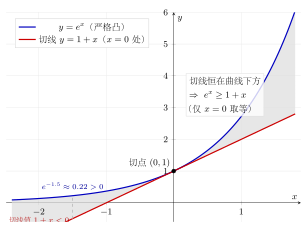

# 第19章：凸性、熵与概率尾部中的指数

> 指数函数不仅是增长函数，也是现代不等式、信息论和概率估计中的关键工具：它会放大差异，因此特别适合刻画平均、波动与极端事件。

## 学习目标

完成本章学习后，你将能够：

1. 从第12章的导数与切线视角理解指数函数的凸性
2. 解释为什么指数会自然出现在 Jensen 型不等式和平均比较中
3. 理解对数与指数在信息论中的分工
4. 认识 `log-sum-exp` 的结构，并理解它为什么像“最大值的平滑版本”
5. 建立概率尾界里“指数控制极端事件”的直觉

---

## 正文内容

## 19.1 从第12章回看：指数函数为什么是凸的

第12章已经告诉我们：

$$
\frac{d}{dx}e^x=e^x
$$

再求一次导数，得到

$$
\frac{d^2}{dx^2}e^x=e^x>0
$$

因此 $e^x$ 是严格凸函数。

这意味着它的图像始终向上弯，并且任意切线都在图像下方。换句话说：

> 指数函数不会“平平地走”，它会把偏离放大。

这件事非常关键，因为后面很多不等式、信息量和概率估计，靠的正是这种“放大偏离”的能力。

### 19.1.1 切线为什么能给出基本不等式

由于凸性，$e^x$ 在 $x=0$ 处的切线

$$
y=1+x
$$

始终位于图像下方，所以对所有实数 $x$ 都有

$$
\boxed{e^x\ge 1+x}
$$

这条不等式看起来简单，却是指数凸性的一个核心出口。它说明：

- 指数函数至少不会低于它的线性近似
- 当 $x$ 偏离 0 时，指数会越来越明显地高于切线

因此“凸性 + 切线”并不是图像附带性质，而是很多后续结论的结构源头。

下图把 $y=e^x$ 与它在 $x=0$ 处的切线 $y=1+x$ 画在一起：由于 $e^x$ 严格凸，切线恒在曲线下方，仅在切点 $(0,1)$ 相切，所以对一切实数都有 $e^x\ge 1+x$。注意当 $x<-1$ 时切线值 $1+x$ 已为负，而 $e^x$ 始终为正，差距进一步拉大——这条不等式正是后面 Chernoff 界与 Jensen 不等式的基石。

---

## 19.2 为什么指数常出现在平均与波动问题中

对凸函数而言，常常存在这样一种现象：

- 先平均，再代入函数
- 和先代入函数，再平均

两者通常并不一样。

对于指数函数，这种差别尤其明显，因为它会放大较大的偏离值。

### 19.2.1 Jensen 直觉：指数对波动很敏感

设想两个数 $x_1,x_2$，它们的平均值固定，但一大一小、差得很开。由于指数函数是凸的，较大的那个数在取指数后会被放大得更多，因此总体平均值会被拉高。

这就是 Jensen 不等式背后的直觉：

> 指数函数对“离平均值的散开程度”非常敏感。

所以当系统波动更大时，指数平均值常常会显著上升。这也是为什么指数函数在风险估计、波动刻画和概率生成函数里反复出现。

### 19.2.2 一个最小数值例子：平均值相同，指数平均值却不同

比较两组数：

- 第一组：$0,0$
- 第二组：$-1,1$

它们的平均值都等于 0。

但先取指数再平均时：

$$
\frac{e^0+e^0}{2}=1
$$

而

$$
\frac{e^{-1}+e^1}{2}\approx\frac{0.368+2.718}{2}\approx1.543
$$

可以看到，虽然两组数的平均值一样，但更“分散”的那一组，在取指数后平均值更大。

这个例子非常短，却能直接说明：

- 指数函数会放大偏离
- 波动本身会影响指数平均值
- “先平均后指数”和“先指数后平均”通常不会一样

---

## 19.3 对数与指数在信息里的配合

信息论中，对数和指数经常成对出现，但它们分工不同：

- **对数**负责把乘法关系压缩成加法关系，把极大极小尺度拉回可比较范围
- **指数**负责把被压缩后的信息重新还原到原尺度，并放大差异

### 19.3.1 为什么信息量常写成对数

概率往往通过乘法叠加，例如多个独立事件的联合概率会相乘。对数把乘法变成加法后，结构更容易分析，因此很多“信息量”更自然地在对数域中表达。

### 19.3.2 为什么又需要指数回来

当我们需要重新回到原始尺度时，指数就会出现。例如：

- 把对数损失还原成原始权重
- 把线性组合重新变成正数权重
- 把“分数差异”转成“强弱对比”

所以对数和指数不是彼此竞争，而是：

- 一个负责压缩、整理、线性化
- 一个负责还原、放大、重建

---

## 19.4 log-sum-exp：为什么它像最大值的平滑版本

考虑表达式

$$
\operatorname{LSE}(x_1,\dots,x_n)=\log\left(e^{x_1}+\cdots+e^{x_n}\right)
$$

这就是常见的 `log-sum-exp`。

它之所以重要，是因为它把“指数放大 + 对数压缩”组合在了一起。

### 19.4.1 为什么说它近似最大值

设 $M=\max\{x_1,\dots,x_n\}$，则可把式子改写为

$$
\log\left(e^{x_1}+\cdots+e^{x_n}\right)
=\log\left(e^M\sum_{i=1}^n e^{x_i-M}\right)
$$

于是

$$
\operatorname{LSE}(x_1,\dots,x_n)=M+\log\left(\sum_{i=1}^n e^{x_i-M}\right)
$$

因为所有 $x_i-M\le0$，所以每个 $e^{x_i-M}\le1$；而最大的那一项恰好等于 1。于是：

- 若某一项远大于其他项，和式几乎被它主导
- 此时 LSE 就会非常接近这个最大值 $M$

所以 `log-sum-exp` 可以理解为：

> 先用指数把较大项强调出来，再用对数把整体尺度拉回，于是得到一个平滑版的最大值。

### 19.4.2 它为什么有用

直接取最大值虽然简单，但不平滑；而 `log-sum-exp` 既保留了“谁最大谁主导”的趋势，又保持了更连续、更可分析的结构。

这在：

- 优化问题
- 机器学习中的 softmax / logits
- 概率归一化
- 近似最大值的分析

中都非常常见。

这里你不必立刻掌握全部技术细节，但应抓住主线：

- 指数负责放大差异
- 对数负责压缩尺度
- 两者组合后，可得到既保留主导项又易于分析的表达式

### 19.4.3 一个具体例子：为什么它接近最大值

取

$$
(x_1,x_2,x_3)=(1,2,5)
$$

则最大值是 $M=5$。计算

$$
\operatorname{LSE}(1,2,5)=\log(e^1+e^2+e^5)
$$

把 5 提出来：

$$
\operatorname{LSE}(1,2,5)=5+\log(e^{-4}+e^{-3}+1)
$$

由于

$$
e^{-4}\approx0.018,\qquad e^{-3}\approx0.050
$$

所以括号内约为

$$
1.068
$$

于是

$$
\operatorname{LSE}(1,2,5)\approx 5+\log(1.068)\approx5.066
$$

它比最大值 5 略大一点，但已经非常接近。这个例子说明：

- 最大项确实主导总和
- 其他项不会完全消失，只会形成一个平滑修正
- `log-sum-exp` 既像最大值，又比最大值更连续

---

## 19.5 概率尾界里为什么会自然出现指数

很多概率估计都长成下面的样子：

$$
\Pr(X\ge t)\le Ce^{-ct}
$$

它表示：随着阈值 $t$ 增大，事件发生概率会按指数速度下降。

### 19.5.1 从凸性到尾界，可以抓住哪三步

如果把第12章和本章前半部分连起来，可以把这条线索概括成：

1. **指数是凸的**，所以它会放大偏离
2. **放大后的量可以做平均或估计**，于是“大偏离”会在指数尺度下变得显眼
3. **再把这种估计翻译回概率语言**，就得到尾部快速衰减的上界

所以尾界并不是突然冒出来的新技巧，而是“凸性 + 放大偏离 + 再翻译回概率”的自然延伸。

### 19.5.2 这类界到底在说什么

它通常并不告诉你精确概率，而是在说：

> 极端偏离会变得非常罕见，而且这种罕见程度不是线性下降，而是指数下降。

与 $1/t$ 或 $1/t^2$ 这类多项式衰减相比，$e^{-ct}$ 会快得多。因此“有指数尾界”通常意味着系统的大偏离被控制得更强。

### 19.5.3 为什么指数特别适合控制极端事件

因为指数对大数值非常敏感。

- 当某个量偏离不大时，指数权重变化有限
- 当偏离很大时，指数会迅速把它突出出来

这使得指数函数特别适合把“极端行为”的代价放大出来，再通过平均或估计把这种极端行为的概率压下去。

也就是说，概率论里指数的作用并不是描述增长，而是：

- 把偏离放大到更容易估计的尺度
- 再反过来得到尾部衰减的上界

### 19.5.4 指数尾和多项式尾，直觉上差在哪

把它和第6章的衰减模型、第11章的增长快慢比较放在一起看，会更容易抓住差别：

| 尾部类型 | 典型形式 | 当阈值变大时的直觉 |
|------|------|------|
| 指数尾 | $e^{-ct}$ | 下降非常快，极端事件迅速变罕见 |
| 多项式尾 | $1/t$、$1/t^2$ | 也会下降，但“尾巴更厚”，极端事件更难被压低 |

因此“有指数尾界”通常是一个很强的结论：它说明系统对大偏离的控制，明显强于一般的多项式级衰减。

### 19.5.5 一个更高一层的统一视角：先指数化，再做平均

很多高阶概率估计背后，都在重复一个动作：

1. 先把偏离量放进指数里
2. 再对这个指数型量做平均或估计
3. 最后把结果翻译回尾概率或风险控制

这条路线的重要性在于：

- 直接研究“偏离本身”时，结构可能很硬
- 指数化之后，大偏离会被明显放大
- 一旦平均量可控，就能反推出“极端事件不会太常见”

所以指数在概率里并不只是一个函数符号，而是一种分析策略：

> 先把偏离搬到指数尺度上，再利用平均、凸性和对数把它组织成可估计的量。

这也解释了为什么指数、对数、尾界、熵这些主题会不断结伴出现。

---

## 19.6 例题：为什么右尾“掉得很快”意味着极端事件少

**问题**：如何理解估计

$$
\Pr(X\ge t)\le e^{-t}
$$

的含义？它和“尾部控制”有什么关系？

**分析**：

先看几个值：

- 当 $t=1$ 时，右侧是 $e^{-1}\approx0.368$
- 当 $t=3$ 时，右侧约为 $0.050$
- 当 $t=5$ 时，右侧约为 $0.0067$

可以看到，阈值每增加一些，右侧都会迅速缩小。

这说明该估计虽然没有告诉我们 $\Pr(X\ge t)$ 的精确数值，却给出了一个很强的趋势判断：

- 中等偏离也许还会发生
- 但越往尾部走，概率会很快变得极小

因此这类不等式的意义不在于“算得特别精确”，而在于它提供了一个结构结论：

> 大偏离不会只是慢慢减少，而是会被指数机制迅速压低。

这正是尾界的核心价值。

---

## 19.7 从本章回看整条主线

到这里，指数函数已经不只是：

- 第6章中的增长/衰减模型
- 第12章中的导数等于自身
- 第15章中的旋转与振荡

它还在第19章里承担了另一种角色：

- 作为凸函数，给出切线不等式
- 作为放大器，强调大偏离
- 作为桥梁，把对数域和原始尺度连接起来
- 作为尾部控制工具，帮助描述极端事件为何罕见

这说明指数函数的统一性比“增长”更深：它真正统一的是“按比例变化”和“对差异的系统放大”。

---

## 常见误区与检查清单

### 常见误区

- 只记住“指数函数是凸的”，却不知道这会导出切线不等式
- 以为指数只和增长模型有关，看不到它在不等式和概率里的作用
- 把 `log-sum-exp` 当作技巧公式，不理解其中“指数放大、对数压缩”的配合
- 听到“尾界”只记成符号表达，不知道它是在控制极端事件概率
- 误以为尾界给的是精确概率，而不是一种上界和趋势描述

### 检查清单

遇到本章问题时，先检查：

1. 你能否从第12章的二阶导数或切线视角解释指数的凸性？
2. 你是否理解指数为何会对波动和偏离更敏感？
3. 对数和指数在当前表达式里，谁负责压缩，谁负责还原？
4. 看到 `log-sum-exp` 时，你是否能先想到“主导项接近最大值”？
5. 遇到尾界时，你是否知道它描述的是“极端事件有多罕见”，而不是精确分布？

---

## 本章小结

| 主题 | 结论 |
|------|------|
| 凸性 | $e^x$ 满足 $e''(x)=e^x>0$，因此是严格凸函数 |
| 切线不等式 | 由凸性可得 $e^x\ge1+x$ |
| Jensen 直觉 | 指数会放大偏离，因此对平均与波动很敏感 |
| 对数/指数配合 | 对数负责压缩尺度，指数负责还原并放大差异 |
| log-sum-exp | 是“最大值的平滑版本”，体现指数放大与对数压缩的组合 |
| 概率尾界 | 指数衰减上界说明极端事件概率会快速变小 |

---

## 分级例题精练

> 本节精选 6 道例题，分三档难度：**初中基础 ★** / **高中核心 ★★** / **高阶拓展 ★★★**（本章侧重高阶拓展）。每题含【题目】【解】【点评】，建议先自行尝试再看解。

### 例题精练 1（★★ 高中核心）

**题目**：利用指数函数的凸性，证明对一切实数 $x$ 都有 $e^x\ge 1+x$，并指出等号何时成立。再用它估计 $e^{0.1}$ 的一个下界。

**解**：令 $g(x)=e^x-(1+x)$。求导：

$$
g'(x)=e^x-1,\qquad g''(x)=e^x>0.
$$

由 $g''>0$ 知 $g$ 严格凸；由 $g'(x)=0$ 解得唯一驻点 $x=0$，因严格凸故为全局最小点。代入得最小值

$$
g(0)=e^0-(1+0)=0.
$$

所以 $g(x)\ge g(0)=0$，即 $e^x\ge 1+x$ 对一切实数成立，**等号仅在 $x=0$**。

取 $x=0.1$：$e^{0.1}\ge 1+0.1=1.1$（真值约 $1.1052$，下界成立）。

**点评**：这是全章不等式的源头——“$e^x$ 严格凸 ⇒ 任一切线在图像下方”，在 $x=0$ 处切线恰为 $y=1+x$。证法的要害是**用二阶导确认凸、用一阶导定位切点、代回得最小值为 0**，三步缺一不可。等号唯一性来自“严格”凸。

### 例题精练 2（★★ 高中核心）

**题目**：设连续型随机变量 $X$ 服从参数 $\lambda>0$ 的指数分布，密度为 $p(x)=\lambda e^{-\lambda x}\ (x\ge0)$。（1）验证密度归一化 $\int_0^\infty p(x)\,dx=1$；（2）求期望 $\mathbb{E}[X]$。

**解**：（1）归一化：

$$
\int_0^\infty \lambda e^{-\lambda x}\,dx=\lambda\left[-\frac{1}{\lambda}e^{-\lambda x}\right]_0^\infty=\lambda\cdot\frac{1}{\lambda}\big(1-0\big)=1.
$$

（2）期望用分部积分（$u=x,\ dv=\lambda e^{-\lambda x}dx$，则 $du=dx,\ v=-e^{-\lambda x}$）：

$$
\mathbb{E}[X]=\int_0^\infty x\,\lambda e^{-\lambda x}\,dx=\Big[-x e^{-\lambda x}\Big]_0^\infty+\int_0^\infty e^{-\lambda x}\,dx.
$$

边界项在 $x\to\infty$ 时因 $e^{-\lambda x}$ 衰减快于 $x$ 增长而为 0，在 $x=0$ 处为 0；剩下

$$
\mathbb{E}[X]=\int_0^\infty e^{-\lambda x}\,dx=\frac{1}{\lambda}.
$$

**点评**：指数分布是“指数衰减”最直接的概率化身。归一化里的 $\lambda$ 恰好抵消积分给出的 $1/\lambda$；期望 $1/\lambda$ 说明速率 $\lambda$ 越大、平均等待时间越短。分部积分中“多项式 × 指数衰减”的边界项总趋于 0，是这类计算的通用要点。

### 例题精练 3（★★★ 高阶拓展）

**题目**：求标准正态变量 $X\sim N(0,1)$ 的矩母函数 $M(t)=\mathbb{E}[e^{tX}]$，并由它读出 $\mathbb{E}[X]$ 与 $\mathbb{E}[X^2]$。

**解**：按定义

$$
M(t)=\mathbb{E}[e^{tX}]=\int_{-\infty}^{\infty}e^{tx}\cdot\frac{1}{\sqrt{2\pi}}e^{-x^2/2}\,dx
=\frac{1}{\sqrt{2\pi}}\int_{-\infty}^{\infty}e^{-\frac{x^2}{2}+tx}\,dx.
$$

对指数配方：$-\dfrac{x^2}{2}+tx=-\dfrac12\big(x-t\big)^2+\dfrac{t^2}{2}$。于是

$$
M(t)=e^{t^2/2}\cdot\frac{1}{\sqrt{2\pi}}\int_{-\infty}^{\infty}e^{-\frac12(x-t)^2}\,dx=e^{t^2/2}\cdot 1=e^{t^2/2},
$$

其中积分是均值为 $t$ 的正态密度积分，等于 1。该 MGF 对一切实 $t$ 收敛。

读矩：$M'(t)=t\,e^{t^2/2}$，故 $\mathbb{E}[X]=M'(0)=0$；$M''(t)=(1+t^2)e^{t^2/2}$，故 $\mathbb{E}[X^2]=M''(0)=1$，即方差为 1。

**点评**：正态 MGF $e^{t^2/2}$ 是高阶概率的基石——它本身又是一个指数，体现“配方把高斯积分转回归一化形式”。MGF 在 $t=0$ 处的各阶导数依次给出各阶矩，这是“矩母”二字的来历。注意正态 MGF 对所有 $t$ 都有限，这一点在下一题的 Chernoff 优化里至关重要。

### 例题精练 4（★★★ 高阶拓展）

**题目**：设 $X\sim N(0,1)$。用 Chernoff 方法证明对 $a>0$ 的尾界 $\Pr(X\ge a)\le e^{-ta}M(t)$，并通过对 $t$ 取最优值得到 $\Pr(X\ge a)\le e^{-a^2/2}$。

**解**：对任意 $t>0$，由 $\{X\ge a\}\Leftrightarrow\{tX\ge ta\}\Leftrightarrow\{e^{tX}\ge e^{ta}\}$，再用 Markov 不等式（$e^{tX}>0$）：

$$
\Pr(X\ge a)=\Pr\!\big(e^{tX}\ge e^{ta}\big)\le \frac{\mathbb{E}[e^{tX}]}{e^{ta}}=e^{-ta}M(t).
$$

代入上一题的 $M(t)=e^{t^2/2}$：

$$
\Pr(X\ge a)\le e^{-ta}e^{t^2/2}=\exp\!\Big(\tfrac{t^2}{2}-ta\Big).
$$

右端是关于 $t$ 的指数，**对指数内部 $\varphi(t)=\tfrac{t^2}{2}-ta$ 取最小值**：$\varphi'(t)=t-a=0\Rightarrow t^\*=a>0$（落在 $t>0$ 的允许范围内），且 $\varphi''=1>0$ 确为极小。代回 $\varphi(a)=\tfrac{a^2}{2}-a^2=-\tfrac{a^2}{2}$，得

$$
\boxed{\ \Pr(X\ge a)\le e^{-a^2/2}\quad(a>0).\ }
$$

**点评**：Chernoff 界是“先指数化、再取 $\inf_t$”这一策略的范本。三个关键点：（1）Markov 只对非负量成立，所以先把事件搬进 $e^{tX}$；（2）参数 $t>0$ 是自由的，所以对上界**逐点取下确界**才得最紧结果；（3）这里最优 $t^\*=a$ 恰好把指数压到 $-a^2/2$，给出正态尾的高斯型衰减。若 $t$ 不优化，只能得到更松的界。

### 例题精练 5（★★★ 高阶拓展）

**题目**：设 $X$ 为 Bernoulli 变量，$\Pr(X=1)=p,\ \Pr(X=0)=1-p$。（1）求 MGF $M(t)=\mathbb{E}[e^{tX}]$；（2）由 Jensen 不等式与 $e^x$ 的凸性证明 $\mathbb{E}[e^{tX}]\ge e^{t\,\mathbb{E}[X]}$，并对本例直接验证。

**解**：（1）按定义对两个取值求和：

$$
M(t)=\mathbb{E}[e^{tX}]=(1-p)\,e^{t\cdot0}+p\,e^{t\cdot1}=(1-p)+p\,e^{t}.
$$

（2）因 $e^x$ 凸，Jensen 不等式给出 $\mathbb{E}[\phi(X)]\ge \phi(\mathbb{E}[X])$（凸函数方向，下凸取“$\ge$”），取 $\phi(x)=e^{tx}$（对固定 $t$ 仍是凸函数）：

$$
\mathbb{E}[e^{tX}]\ge e^{t\,\mathbb{E}[X]}.
$$

本例 $\mathbb{E}[X]=p$，右端为 $e^{tp}$。需验证 $(1-p)+p\,e^t\ge e^{tp}$。把左端看作 $e^{0}$ 与 $e^{t}$ 以权重 $1-p,\,p$ 的加权平均，右端是把权重平均后的自变量 $0\cdot(1-p)+t\cdot p=tp$ 代入 $e^{\cdot}$——这正是 Jensen 对“两点 + 凸函数”的图示：弦在曲线上方，故 $\ge$ 成立，等号当 $t=0$ 或 $p\in\{0,1\}$（退化）时取得。

**点评**：本题把 MGF 与 Jensen 串起来。**Jensen 方向务必记牢：凸函数（如 $e^x$）满足 $\mathbb{E}[\phi(X)]\ge\phi(\mathbb{E}[X])$**，即“先取指数再平均 ≥ 先平均再取指数”，恰与 19.2 节“指数放大波动”的直觉一致。Bernoulli 的 MGF $(1-p)+pe^t$ 是离散 MGF 的最简范例，也是后续二项分布 MGF $\big((1-p)+pe^t\big)^n$ 的单步因子。

### 例题精练 6（★★★ 高阶拓展）

**题目**（综合压轴）：设 $X_1,\dots,X_n$ 独立同分布于参数 $1/2$ 的 Bernoulli（即取 $0$ 或 $1$ 各半），记 $S_n=\sum_{i=1}^n X_i$。用 Chernoff 方法证明上偏差尾界

$$
\Pr\!\Big(S_n\ge \frac{n}{2}+n\varepsilon\Big)\le e^{-2n\varepsilon^2}\qquad(0<\varepsilon\le\tfrac12).
$$

**解**：对任意 $t>0$，由独立性 MGF 相乘，单个因子由第 5 题（$p=1/2$）为 $M(t)=\tfrac12(1+e^t)$，故

$$
\mathbb{E}[e^{tS_n}]=\prod_{i=1}^n\mathbb{E}[e^{tX_i}]=\Big(\tfrac12(1+e^t)\Big)^n.
$$

设阈值 $a=\tfrac n2+n\varepsilon$。Chernoff：

$$
\Pr(S_n\ge a)\le e^{-ta}\,\mathbb{E}[e^{tS_n}]=\exp\!\Big(-t a+n\ln\tfrac{1+e^t}{2}\Big).
$$

为得到干净的界，用 Hoeffding 对单个有界变量 $X_i\in[0,1]$ 的 MGF 引理：对均值 $\mu=\mathbb{E}[X_i]=\tfrac12$，有

$$
\mathbb{E}\big[e^{t(X_i-\mu)}\big]\le e^{t^2/8},
$$

（因 $X_i-\mu\in[-\tfrac12,\tfrac12]$，区间长度为 1，Hoeffding 引理给出 $e^{t^2(b-a)^2/8}=e^{t^2/8}$）。于是对中心化和 $S_n-\tfrac n2=\sum(X_i-\mu)$：

$$
\Pr\!\Big(S_n-\tfrac n2\ge n\varepsilon\Big)\le e^{-t n\varepsilon}\,\mathbb{E}\big[e^{t(S_n-n/2)}\big]\le e^{-tn\varepsilon}\,e^{n t^2/8}=\exp\!\Big(\tfrac{n t^2}{8}-tn\varepsilon\Big).
$$

对指数内部 $\psi(t)=\tfrac{nt^2}{8}-tn\varepsilon$ 取最小：$\psi'(t)=\tfrac{nt}{4}-n\varepsilon=0\Rightarrow t^\*=4\varepsilon>0$，$\psi''=\tfrac n4>0$ 确为极小。代回：

$$
\psi(4\varepsilon)=\frac{n(4\varepsilon)^2}{8}-4\varepsilon\cdot n\varepsilon=2n\varepsilon^2-4n\varepsilon^2=-2n\varepsilon^2.
$$

故

$$
\boxed{\ \Pr\!\Big(S_n\ge \tfrac n2+n\varepsilon\Big)\le e^{-2n\varepsilon^2}.\ }
$$

**点评**：这是 Hoeffding 不等式的完整推导，把本章方法全部联用：**独立 ⇒ MGF 相乘（指数把和变积）→ 有界变量的 MGF 上界（凸性 / Hoeffding 引理）→ Chernoff 取 $\inf_t$（最优 $t^\*=4\varepsilon$）→ 高斯型尾界 $e^{-2n\varepsilon^2}$**。结论的意义极强：样本均值偏离真值 $\varepsilon$ 的概率随样本量 $n$ 指数下降，这正是大数定律“为何收敛得这么快”的定量版本，也是 19.5 节“指数尾控制极端事件”的顶点应用。

---

## 练习题

1. 用“切线在图像下方”的语言解释为什么对所有实数 $x$ 都有 $e^x\ge1+x$。
2. 解释为什么指数函数会让“先代入再平均”和“先平均再代入”产生差异。
3. 设 $x_1,x_2,x_3$ 中有一个远大于另外两个，说明为什么 `log-sum-exp` 会接近最大值。
4. 比较指数尾界 $e^{-t}$ 与多项式尾界 $1/t$ 的衰减快慢，并说明这意味着什么。
5. 用一句完整的话解释为什么指数函数会在信息论、优化和概率论中反复出现。

练习提示

- 第1题回想第12章中“凸函数的切线在图像下方”的图像意义。
- 第2题抓住“指数会放大较大的偏离值”。
- 第3题可先把最大值 $M$ 提出来再观察剩余项。
- 第4题不必严密证明，只需比较当 $t$ 很大时谁下降得更快。
- 第5题可围绕“放大差异、压缩尺度、控制尾部”来组织答案。

