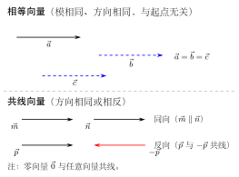

# 向量的概念

> **一例速记**：  
> 向量 $\vec{a}$ = 既有**大小**（模 $|\vec{a}|$）又有**方向**的量。  
> 几何上用**有向线段** $\vec{AB}$ 表示，起点 $A$，终点 $B$，箭头指向 $B$。  
> **相等向量**：模相同、方向相同，与起点位置**无关**。  
> **零向量** $\vec{0}$：模为 $0$，方向任意，与任何向量共线。

---

## 一、为什么要引入向量

### 数量与向量的区别

在数学和物理中，我们处理两类不同的量：

| 类型 | 定义 | 典型例子 |
|-----|------|---------|
| **数量**（scalar） | 只有大小，没有方向 | 质量 $5\,\text{kg}$、温度 $25\,^\circ\text{C}$、长度 $3\,\text{m}$ |
| **向量**（vector） | 既有大小，又有方向 | 力 $\vec{F}$（$10\,\text{N}$，向东）、位移 $\vec{s}$（$5\,\text{m}$，向北）|

物体受到 $10\,\text{N}$ 的力，如果只知道大小不知道方向，我们无法判断它将如何运动。因此，**向量是描述有方向的量的数学工具**。

---

## 二、向量的定义与几何表示

### 定义

**向量**是既有大小又有方向的量。

- **大小**称为向量的**模**，记作 $|\vec{a}|$ 或 $|\vec{AB}|$，是一个非负实数。
- **方向**指向量的指向，用箭头表示。

### 几何表示：有向线段

在平面（或空间）中，向量用**有向线段**来表示：

$$\vec{AB}$$

- **起点** $A$：有向线段的出发点
- **终点** $B$：有向线段的终点（箭头所指）
- 线段的长度 = 向量的模 $|\vec{AB}|$

### 代数符号

除了用 $\vec{AB}$ 表示，向量还可以用单个字母加箭头表示：

$$\vec{a},\quad \vec{b},\quad \vec{c},\quad \vec{v}$$

模则记作：

$$|\vec{a}|,\quad |\vec{b}|,\quad |\vec{AB}|$$

**重要约定**：向量只由大小和方向决定，与起点在哪里**无关**。画在纸上不同位置的两条有向线段，只要长度相等、方向相同，就代表**同一个向量**。

---

## 三、特殊向量

### 零向量

**零向量** $\vec{0}$ 满足：

$$|\vec{0}| = 0$$

零向量的方向是**任意的**（不确定方向）。这样规定的原因在于：向量运算（如加减法）需要零向量作为加法的单位元，即 $\vec{a} + \vec{0} = \vec{a}$。

**特别性质**：零向量与任何向量**共线**（见下文）。

### 单位向量

模等于 $1$ 的向量称为**单位向量**：

$$|\vec{e}| = 1$$

单位向量只保留方向信息，抛弃了大小。任何非零向量 $\vec{a}$ 都可以除以其模得到同方向的单位向量：$\dfrac{\vec{a}}{|\vec{a}|}$。

---

## 四、向量之间的关系

### 1. 相等向量

若向量 $\vec{a}$ 与 $\vec{b}$ 满足：
- **模相同**：$|\vec{a}| = |\vec{b}|$
- **方向相同**

则称 $\vec{a} = \vec{b}$。

**关键**：相等向量与起点位置无关。把 $\vec{a}$ 平移到任何位置，只要模和方向不变，就仍然等于 $\vec{a}$。

这一性质叫做向量的**自由性**——向量是"自由向量"，不固定在某一起点。

### 2. 共线向量（平行向量）

若两个非零向量 $\vec{a}$ 与 $\vec{b}$ 的**方向相同或相反**，则称它们**共线**（或**平行**），记作 $\vec{a} \parallel \vec{b}$。

**共线向量的直观意义**：它们可以被移到同一条直线（或平行线）上。

**零向量的特殊规定**：$\vec{0}$ 与任意向量共线。

之所以如此规定，是为了使"共线"在向量数乘章节（$\vec{b} = \lambda \vec{a}$）中不出现例外——零向量是 $\lambda = 0$ 的情形。

### 3. 相反向量

若 $\vec{a}$ 与 $\vec{b}$ 满足：
- **模相同**：$|\vec{a}| = |\vec{b}|$
- **方向相反**

则称 $\vec{b}$ 是 $\vec{a}$ 的**相反向量**，记作 $\vec{b} = -\vec{a}$。

性质：$\vec{a} + (-\vec{a}) = \vec{0}$。

有向线段中：$-\vec{AB} = \vec{BA}$（把起点终点互换）。

---

## 五、典型应用例题

### 例 1：判断向量关系

**题目**：在平行四边形 $ABCD$ 中，判断下列向量关系，并说明原因：
1. $\vec{AB}$ 与 $\vec{DC}$ 是否相等？
2. $\vec{AB}$ 与 $\vec{CD}$ 是否共线？
3. $\vec{AB}$ 与 $\vec{BA}$ 是何关系？

**【思路】** 平行四边形中，$AB \parallel DC$ 且 $AB = DC$；$AB \parallel CD$ 但方向相反；$BA$ 是 $AB$ 的反向。

**解**：

1. $\vec{AB}$ 与 $\vec{DC}$：平行四边形中 $AB \parallel DC$，方向均从左到右（$A \to B$ 与 $D \to C$ 同向），且 $|AB| = |DC|$，故 $\vec{AB} = \vec{DC}$。

2. $\vec{AB}$ 与 $\vec{CD}$：$AB \parallel CD$，但 $C \to D$ 与 $A \to B$ 方向相反，故 $\vec{AB}$ 与 $\vec{CD}$ 共线（平行），但 $\vec{AB} \neq \vec{CD}$。

3. $\vec{AB}$ 与 $\vec{BA}$：模相同（都是 $AB$ 的长度），方向相反，故 $\vec{BA} = -\vec{AB}$，即二者互为相反向量。

---

### 例 2：用向量符号描述图形关系

**题目**：如图，$M$ 是线段 $AB$ 的中点，$O$ 是平面上任意一点。以下说法中，哪些正确？

（A）$\vec{AM} = \vec{MB}$  
（B）$\vec{OM} = \vec{OA}$  
（C）$\vec{OA}$ 与 $\vec{OB}$ 方向相同  
（D）$\vec{AM}$ 与 $\vec{MB}$ 是相等向量

**【思路】** $M$ 是中点，所以 $AM = MB$；方向从 $A$ 到 $M$ 与从 $M$ 到 $B$ 同向；$O$ 是任意点，$\vec{OA}$ 和 $\vec{OB}$ 方向不一定相同。

**解**：

- (A) $\vec{AM}$ 与 $\vec{MB}$：模相等（$AM = MB$），方向相同（都沿 $AB$ 方向），故 $\vec{AM} = \vec{MB}$。**正确**。
- (B) $\vec{OM}$ 与 $\vec{OA}$：起点相同均为 $O$，但终点不同（$M \neq A$），方向和模一般不同，故 $\vec{OM} \neq \vec{OA}$。**错误**。
- (C) $\vec{OA}$ 与 $\vec{OB}$ 的方向取决于 $O, A, B$ 的相对位置，不能保证相同。**错误**。
- (D) 同 (A)，$\vec{AM}$ 与 $\vec{MB}$ 模相同方向相同，是相等向量。**正确**。

**答**：(A)(D) 正确。

---

### 例 3：识别零向量与单位向量

**题目**：下列说法是否正确？
1. 若 $|\vec{a}| = |\vec{b}|$，则 $\vec{a} = \vec{b}$。
2. 若 $\vec{a} = \vec{b}$，则 $\vec{a}$ 与 $\vec{b}$ 起点相同。
3. 大小为 $0$ 的向量是零向量 $\vec{0}$。
4. 单位向量只有一个。

**【思路】** 相等要同时满足模相同和方向相同；向量与起点无关；零向量定义为模为 $0$；单位向量只限定模为 $1$，方向可以任意。

**解**：

1. **错误**。仅模相同不足以保证相等，还需方向相同。例如 $\vec{AB}$ 和 $\vec{BA}$ 模相同但方向相反，二者不相等。

2. **错误**。向量的相等与起点无关（自由向量）。$\vec{AB} = \vec{CD}$ 不要求 $A = C$。

3. **正确**。零向量的定义就是模为 $0$，方向任意。

4. **错误**。满足 $|\vec{e}| = 1$ 的向量有无穷多个（每个方向上都有一个单位向量）。

---

## 六、易错点汇总

**易错 1：认为向量和起点绑定**

向量是"自由向量"，只由大小和方向决定，可以自由平移。$\vec{AB}$ 和 $\vec{CD}$，只要 $|AB| = |CD|$ 且方向相同，就有 $\vec{AB} = \vec{CD}$，哪怕起点 $A \neq C$。

**易错 2：忘记零向量与任意向量共线**

说"$\vec{a}$ 与 $\vec{b}$ 共线"时，若 $\vec{a} = \vec{0}$ 或 $\vec{b} = \vec{0}$，依然成立。判断题中"非零向量 $\vec{a}$ 与零向量是否共线"的答案是：**共线**。

**易错 3：相等向量要同时满足两个条件**

$\vec{a} = \vec{b}$ 需要：① $|\vec{a}| = |\vec{b}|$（模相等），② 方向相同。只满足其一不够。特别注意：$\vec{AB}$ 与 $\vec{BA}$ 模相同但方向相反，因此 $\vec{AB} \neq \vec{BA}$，而 $\vec{BA} = -\vec{AB}$。

**易错 4：混淆"共线"与"相等"**

共线（平行）只要求方向相同或相反；相等还要求方向完全一致（不能相反）且模相等。相等是比共线更强的条件。

**易错 5：单位向量的模是 1，不是 0 也不是任意值**

零向量的模是 $0$；单位向量的模是 $1$。二者都是特殊向量，但意义截然不同——零向量没有方向，单位向量有确定方向。

---

## 七、思路自测题

**自测 1**　正三角形 $ABC$ 中，$D$ 是 $BC$ 的中点。判断：$\vec{AB}$ 与 $\vec{DC}$ 是否共线？是否相等？

> 提示：$AB \parallel DC$ 吗？$AB = DC$ 吗？方向呢？注意 $D$ 是 $BC$ 中点，所以 $DC = \dfrac{1}{2}BC$，而 $AB = BC$（正三角形），故 $|AB| \neq |DC|$。因此二者共线（若方向平行的话需检查是否平行）但不相等。

**自测 2**　已知 $\vec{a} \neq \vec{0}$，$\vec{b} = -3\vec{a}$，则 $\vec{a}$ 与 $\vec{b}$ 的关系是（  ）

（A）方向相同  （B）方向相反  （C）不确定  （D）$\vec{a} = \vec{b}$

> 提示：$-3\vec{a}$ 的系数为负，方向与 $\vec{a}$ 相反，模为 $3|\vec{a}|$。答：(B)。

**自测 3**　下列向量中，哪些与 $\vec{a}$ 相等（设 $\vec{a}$ 方向向右，$|\vec{a}| = 2$）？

（A）方向向右，模为 $2$ 的向量 $\vec{p}$  
（B）方向向左，模为 $2$ 的向量 $\vec{q}$  
（C）方向向右，模为 $3$ 的向量 $\vec{r}$  
（D）方向向右，模为 $2$ 但起点不同的向量 $\vec{s}$

> 提示：(A) 模方向都同，与起点无关，故 $\vec{p} = \vec{a}$。(B) 方向相反，$\vec{q} = -\vec{a}$。(C) 模不同，$\vec{r} \neq \vec{a}$。(D) 起点不同但模方向同，仍 $\vec{s} = \vec{a}$（向量自由性）。答：(A)(D)。

**自测 4**　在平行四边形 $ABCD$ 中（$AB \parallel DC$，$AD \parallel BC$），以下四个向量 $\vec{AB}, \vec{DC}, \vec{CD}, \vec{BA}$ 中，哪两个相等，哪两个互为相反向量？

> 提示：$\vec{AB}$ 与 $\vec{DC}$：$AB \parallel DC$，方向均为从第一字母到第二字母——$A \to B$ 与 $D \to C$ 同向，且 $|AB| = |DC|$，故 $\vec{AB} = \vec{DC}$。$\vec{CD}$ 方向与 $\vec{DC}$ 相反，故 $\vec{CD} = -\vec{DC} = -\vec{AB}$。$\vec{BA} = -\vec{AB}$。因此 $\vec{AB} = \vec{DC}$（相等），$\vec{CD} = \vec{BA} = -\vec{AB}$（互为相反）。

---

**回头看"一例速记"**：

> 向量 = 大小 + 方向；几何上是有向线段 $\vec{AB}$。  
> 相等：模同 + 方向同，起点无关。  
> 共线：方向同或反（$\vec{0}$ 与任意共线）。  
> 相反：$-\vec{a}$，模同方向反。

能不看提示独立完成自测 1 和自测 4 的完整推导——本章，你拿下了。
