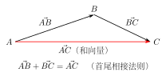
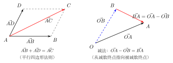

# 向量的加法与减法

> **一例速记**：  
> **三角形法则**：$\vec{AB} + \vec{BC} = \vec{AC}$（首尾相接，起点到终点即为和）。  
> **平行四边形法则**：$\vec{AB} + \vec{AD} = \vec{AC}$（以 $AB, AD$ 为邻边作平行四边形，对角线为和）。  
> **减法**：$\vec{a} - \vec{b} = \vec{a} + (-\vec{b})$；几何上 $\vec{OA} - \vec{OB} = \vec{BA}$（从减数终点指向被减数终点）。  
> **三角不等式**：$\bigl||\vec{a}| - |\vec{b}|\bigr| \leq |\vec{a} + \vec{b}| \leq |\vec{a}| + |\vec{b}|$。

---

## 一、向量加法：三角形法则

### 定义与直观

**问题引入**：一个人先向东走 $3\,\text{m}$（位移向量 $\vec{a}$），再向北走 $4\,\text{m}$（位移向量 $\vec{b}$），最终的总位移是什么？

总位移就是 $\vec{a}$ 与 $\vec{b}$ 的**和向量** $\vec{a} + \vec{b}$。

### 三角形法则（首尾相接法）

将 $\vec{b}$ 的起点移到 $\vec{a}$ 的终点（保持大小方向不变），连接 $\vec{a}$ 的起点到 $\vec{b}$ 的终点，得到的向量即为 $\vec{a} + \vec{b}$。

用有向线段表述：

$$\vec{AB} + \vec{BC} = \vec{AC}$$

$A$ 是起点，$B$ 是中间过渡点，$C$ 是终点。和向量 $\vec{AC}$ 直接从起点 $A$ 指向终点 $C$，"跳过"中间点。

**推广到多个向量**：

$$\vec{AB} + \vec{BC} + \vec{CD} + \vec{DE} = \vec{AE}$$

只要首尾依次相接，和向量永远是"第一个起点到最后一个终点"。

**特别情况**：若最后的终点与第一个起点重合（构成封闭折线），则和向量为零向量：

$$\vec{AB} + \vec{BC} + \vec{CA} = \vec{0}$$

---

## 二、向量加法：平行四边形法则

### 共起点时的加法

当两个向量 $\vec{a} = \vec{AB}$，$\vec{b} = \vec{AD}$ 从**同一起点** $A$ 出发时，以 $\vec{AB}$ 和 $\vec{AD}$ 为邻边构造平行四边形 $ABCD$，则对角线 $\vec{AC}$ 即为 $\vec{a} + \vec{b}$：

$$\vec{AB} + \vec{AD} = \vec{AC}$$

这就是**平行四边形法则**。

**与三角形法则的关系**：平行四边形法则和三角形法则是等价的——用平行四边形时，$\vec{AD} = \vec{BC}$（对边相等），所以 $\vec{AB} + \vec{AD} = \vec{AB} + \vec{BC} = \vec{AC}$。

---

## 三、加法的运算律

向量加法满足两个基本运算律：

### 交换律

$$\vec{a} + \vec{b} = \vec{b} + \vec{a}$$

**几何理解**：用平行四边形法则，$\vec{a} + \vec{b}$ 和 $\vec{b} + \vec{a}$ 都是同一个平行四边形的对角线，结果相同。

### 结合律

$$(\vec{a} + \vec{b}) + \vec{c} = \vec{a} + (\vec{b} + \vec{c})$$

**几何理解**：用三角形法则，先加 $\vec{a} + \vec{b}$ 再加 $\vec{c}$，与先加 $\vec{b} + \vec{c}$ 再加 $\vec{a}$，最终从起点到终点的向量相同。

由结合律，多个向量相加可以去掉括号，按任意顺序相加：

$$\vec{a}_1 + \vec{a}_2 + \cdots + \vec{a}_n$$

---

## 四、向量减法

### 定义

向量 $\vec{a}$ 与 $\vec{b}$ 的差定义为：

$$\vec{a} - \vec{b} = \vec{a} + (-\vec{b})$$

即，减去 $\vec{b}$ 等同于加上 $\vec{b}$ 的相反向量 $-\vec{b}$。

### 几何意义：共起点时的减法

设 $\vec{OA} = \vec{a}$，$\vec{OB} = \vec{b}$（两向量共起点 $O$），则：

$$\vec{a} - \vec{b} = \vec{OA} - \vec{OB} = \vec{BA}$$

**记忆口诀**：共起点的两向量相减，结果是"从**减数**的终点指向**被减数**的终点"。

即 $\vec{OA} - \vec{OB}$：减数是 $\vec{OB}$（终点 $B$），被减数是 $\vec{OA}$（终点 $A$），结果 $= \vec{BA}$（从 $B$ 指向 $A$）。

**推导**：

$$\vec{OA} - \vec{OB} = \vec{OA} + (-\vec{OB}) = \vec{OA} + \vec{BO} = \vec{BO} + \vec{OA} = \vec{BA}$$

（用三角形法则：$\vec{BO} + \vec{OA} = \vec{BA}$）

---

## 五、模的三角不等式

### 不等式

对任意向量 $\vec{a}$ 与 $\vec{b}$，有：

$$\bigl||\vec{a}| - |\vec{b}|\bigr| \leq |\vec{a} + \vec{b}| \leq |\vec{a}| + |\vec{b}|$$

### 右侧不等式：$|\vec{a} + \vec{b}| \leq |\vec{a}| + |\vec{b}|$

**几何理解**：三角形两边之和大于等于第三边。在三角形法则中，$\vec{a}$ 和 $\vec{b}$ 是两条边，$\vec{a} + \vec{b}$ 是第三边，第三边长度不超过两边之和。

**取等条件**：$\vec{a}$ 与 $\vec{b}$ **同向**（或其中一个为零向量）时取等，即 $\vec{a} + \vec{b}$ 与 $\vec{a}, \vec{b}$ 方向相同，三点共线，"三角形"退化。

### 左侧不等式：$|\vec{a} + \vec{b}| \geq \bigl||\vec{a}| - |\vec{b}|\bigr|$

**取等条件**：$\vec{a}$ 与 $\vec{b}$ **反向**（或其中一个为零向量）时取等，两向量"对消"部分，和向量的模为二者模的差。

### 综合取等

$$|\vec{a} + \vec{b}| = |\vec{a}| + |\vec{b}| \iff \vec{a} \text{ 与 } \vec{b} \text{ 同向（或有零向量）}$$

$$|\vec{a} + \vec{b}| = \bigl||\vec{a}| - |\vec{b}|\bigr| \iff \vec{a} \text{ 与 } \vec{b} \text{ 反向（或有零向量）}$$

---

## 六、典型应用例题

### 例 1：多向量首尾相接化简

**题目**：在六边形 $ABCDEF$ 中，求 $\vec{AB} + \vec{BC} + \vec{CD} + \vec{DE} + \vec{EF}$。

**【思路】** 多向量首尾相接，直接用三角形法则反复应用：结果是第一个向量的起点到最后一个向量的终点。

**解**：

$$\vec{AB} + \vec{BC} + \vec{CD} + \vec{DE} + \vec{EF} = \vec{AF}$$

原因：每一步都首尾相接——$\vec{AB}$ 的终点 $B$ 是 $\vec{BC}$ 的起点，以此类推，最终从 $A$ 到 $F$。

**答**：$\vec{AF}$。

---

### 例 2：减法的几何意义

**题目**：已知平面上三点 $O, A, B$，用 $\vec{OA}$ 和 $\vec{OB}$ 表示 $\vec{AB}$，并说明几何含义。

**【思路】** $\vec{AB}$ 可以分解为：先从 $A$ 回到 $O$（$= -\vec{OA}$），再从 $O$ 到 $B$（$= \vec{OB}$）；或者直接用"共起点减法"公式。

**解**：

$$\vec{AB} = \vec{AO} + \vec{OB} = -\vec{OA} + \vec{OB} = \vec{OB} - \vec{OA}$$

用共起点减法：$\vec{OB} - \vec{OA}$，两向量共起点 $O$，减数终点为 $A$，被减数终点为 $B$，结果从 $A$ 指向 $B$，即 $\vec{AB}$。与结论一致。

**答**：$\vec{AB} = \vec{OB} - \vec{OA}$。

---

### 例 3：利用三角不等式求模的范围

**题目**：已知 $|\vec{a}| = 3$，$|\vec{b}| = 5$，求 $|\vec{a} + \vec{b}|$ 的取值范围。

**【思路】** 直接套三角不等式，注意两个端点的取等条件。

**解**：

由三角不等式：

$$\bigl||\vec{a}| - |\vec{b}|\bigr| \leq |\vec{a} + \vec{b}| \leq |\vec{a}| + |\vec{b}|$$

代入 $|\vec{a}| = 3, |\vec{b}| = 5$：

$$|3 - 5| \leq |\vec{a} + \vec{b}| \leq 3 + 5$$

$$2 \leq |\vec{a} + \vec{b}| \leq 8$$

- 左端取等（$= 2$）：$\vec{a}$ 与 $\vec{b}$ 反向，即 $\vec{a} = -\dfrac{3}{5}\vec{b}$。
- 右端取等（$= 8$）：$\vec{a}$ 与 $\vec{b}$ 同向，即 $\vec{a} = \dfrac{3}{5}\vec{b}$。

**答**：$|\vec{a} + \vec{b}| \in [2, 8]$。

---

## 七、易错点汇总

**易错 1：减法方向弄反——$\vec{OA} - \vec{OB}$ 是 $\vec{BA}$ 不是 $\vec{AB}$**

记牢口诀："共起点相减，结果从**减数**终点指向**被减数**终点"。$\vec{OA} - \vec{OB}$ 中，被减数终点为 $A$，减数终点为 $B$，故结果为 $\vec{BA}$（从 $B$ 到 $A$），不是 $\vec{AB}$。

**易错 2：三角不等式取等条件混淆**

- 上界 $|\vec{a} + \vec{b}| = |\vec{a}| + |\vec{b}|$ 要求 $\vec{a}$ 与 $\vec{b}$ **同向**（不是反向）。
- 下界 $|\vec{a} + \vec{b}| = \bigl||\vec{a}| - |\vec{b}|\bigr|$ 要求 $\vec{a}$ 与 $\vec{b}$ **反向**（不是同向）。

**易错 3：首尾相接时忽略"方向"要求**

三角形法则要求 $\vec{BC}$ 的起点 $B$ 必须是 $\vec{AB}$ 的**终点** $B$，若字母不对应（如 $\vec{AB} + \vec{CB}$），需先转化（$\vec{CB} = -\vec{BC}$）再相加。

**易错 4：多个向量首尾相接时算错起终点**

$\vec{AB} + \vec{CD}$，若 $B \neq C$，不能直接得 $\vec{AD}$。必须先把 $\vec{CD}$ 的起点移到 $B$ 处，即写为 $\vec{AB} + \vec{BE}$（其中 $\vec{BE}$ 等于 $\vec{CD}$），才能用三角形法则得 $\vec{AE}$。

**易错 5：把向量加法与数的加法混淆**

$|\vec{a} + \vec{b}| \neq |\vec{a}| + |\vec{b}|$（一般情况）。向量相加是有向量的，模的加法需要三角不等式约束，只有同向时才取等。

---

## 八、思路自测题

**自测 1**　化简：$\vec{AB} + \vec{CD} + \vec{BC}$。

> 提示：先把中间的 $\vec{BC}$ 和 $\vec{CD}$ 合并，利用首尾相接：$\vec{BC} + \vec{CD} = \vec{BD}$；再与 $\vec{AB}$ 合并：$\vec{AB} + \vec{BD} = \vec{AD}$。答：$\vec{AD}$。

**自测 2**　已知 $\vec{OA} = \vec{a}$，$\vec{OB} = \vec{b}$，$M$ 是 $AB$ 的中点，用 $\vec{a}, \vec{b}$ 表示 $\vec{OM}$。

> 提示：$\vec{OM} = \vec{OA} + \vec{AM} = \vec{a} + \dfrac{1}{2}\vec{AB} = \vec{a} + \dfrac{1}{2}(\vec{b} - \vec{a}) = \dfrac{1}{2}\vec{a} + \dfrac{1}{2}\vec{b} = \dfrac{\vec{a} + \vec{b}}{2}$。答：$\vec{OM} = \dfrac{1}{2}(\vec{a} + \vec{b})$。

**自测 3**　已知 $|\vec{a}| = 4$，$|\vec{b}| = 3$，$|\vec{a} + \vec{b}| = 5$，求 $|\vec{a} - \vec{b}|$。

> 提示：注意 $|\vec{a} - \vec{b}|^2 = |\vec{a}|^2 - 2\vec{a} \cdot \vec{b} + |\vec{b}|^2$；先用 $|\vec{a} + \vec{b}|^2 = |\vec{a}|^2 + 2\vec{a} \cdot \vec{b} + |\vec{b}|^2 = 25$，得 $16 + 2\vec{a}\cdot\vec{b} + 9 = 25$，故 $\vec{a}\cdot\vec{b} = 0$。然后 $|\vec{a} - \vec{b}|^2 = 16 + 9 = 25$，故 $|\vec{a} - \vec{b}| = 5$。（此题用到点积，预习可尝试）

**自测 4**　判断：若 $|\vec{a}| = 2$，$|\vec{b}| = 7$，则 $|\vec{a} + \vec{b}| = 9$ 是否有可能？$|\vec{a} + \vec{b}| = 3$ 是否有可能？

> 提示：三角不等式：$|7 - 2| \leq |\vec{a} + \vec{b}| \leq 7 + 2$，即 $5 \leq |\vec{a} + \vec{b}| \leq 9$。$|\vec{a}+\vec{b}| = 9$ 可能（$\vec{a}, \vec{b}$ 同向时取等）；$|\vec{a}+\vec{b}| = 3 < 5$，不可能。

**自测 5**　在三角形 $ABC$ 中，$G$ 是重心（即三条中线交点），已知 $\vec{GA} + \vec{GB} + \vec{GC} = \vec{?}$

> 提示：设 $G$ 为重心，重心性质：$G$ 分每条中线为 $2:1$。设 $M$ 为 $BC$ 中点，则 $G$ 在 $AM$ 上且 $AG = 2GM$。用向量：$\vec{GA} = -\vec{AG} = -2\vec{GM}$；$\vec{GB} + \vec{GC} = (\vec{GM} + \vec{MB}) + (\vec{GM} + \vec{MC}) = 2\vec{GM} + (\vec{MB} + \vec{MC}) = 2\vec{GM} + \vec{0} = 2\vec{GM}$（因 $M$ 是 $BC$ 中点，$\vec{MB} + \vec{MC} = \vec{0}$）。故 $\vec{GA} + \vec{GB} + \vec{GC} = -2\vec{GM} + 2\vec{GM} = \vec{0}$。答：$\vec{0}$。

---

**回头看"一例速记"**：

> 三角形法则：首尾相接，$\vec{AB} + \vec{BC} = \vec{AC}$。  
> 平行四边形法则：共起点，对角线为和。  
> 减法：$\vec{OA} - \vec{OB} = \vec{BA}$（从减数终点到被减数终点）。  
> 三角不等式：$\bigl||\vec{a}| - |\vec{b}|\bigr| \leq |\vec{a}+\vec{b}| \leq |\vec{a}|+|\vec{b}|$，同向取上界，反向取下界。

能不看提示独立完成自测 2 和自测 5 的完整推导——本章，你拿下了。
