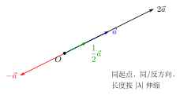

# 向量的数乘

> **一例速记**：  
> $\lambda\vec{a}$ 的模为 $|\lambda||\vec{a}|$；$\lambda > 0$ 同向，$\lambda < 0$ 反向，$\lambda = 0$ 得零向量。  
> **共线向量定理**：$\vec{a} \neq \vec{0}$ 时，$\vec{b}$ 与 $\vec{a}$ 共线 $\Leftrightarrow$ 存在唯一实数 $\lambda$ 使 $\vec{b} = \lambda\vec{a}$。

---

## 一、数乘的定义

实数 $\lambda$ 与向量 $\vec{a}$ 的**乘积** $\lambda\vec{a}$ 是一个向量，规定如下：

| 条件 | 模长 | 方向 |
|------|------|------|
| $\lambda > 0$ | $\vert \lambda\vec{a}\vert = \lambda\vert \vec{a}\vert$ | 与 $\vec{a}$ **相同** |
| $\lambda < 0$ | $\vert \lambda\vec{a}\vert = \vert \lambda\vert \vert \vec{a}\vert$ | 与 $\vec{a}$ **相反** |
| $\lambda = 0$ | $\vert 0 \cdot \vec{a}\vert = 0$ | 零向量（方向不定） |

特别地：$\vec{a} = \vec{0}$ 时，对任意实数 $\lambda$，$\lambda\vec{0} = \vec{0}$。

**图形直观**（见配图 `geo-p1-03-1`）：

以同一起点 $O$ 画出 $\vec{a}, 2\vec{a}, -\vec{a}, \dfrac{1}{2}\vec{a}$ 四条向量——

- $2\vec{a}$：与 $\vec{a}$ 同向，长度是 $\vec{a}$ 的 **2 倍**。
- $-\vec{a}$：与 $\vec{a}$ **反向**，长度相等。
- $\dfrac{1}{2}\vec{a}$：与 $\vec{a}$ 同向，长度是 $\vec{a}$ 的 **$\dfrac{1}{2}$**。

---

## 二、运算律

设 $\lambda, \mu \in \mathbb{R}$，$\vec{a}, \vec{b}$ 为向量，以下三条运算律成立：

**结合律**：
$$\lambda(\mu\vec{a}) = (\lambda\mu)\vec{a}$$

**对标量加法的分配律**：
$$(\lambda + \mu)\vec{a} = \lambda\vec{a} + \mu\vec{a}$$

**对向量加法的分配律**：
$$\lambda(\vec{a} + \vec{b}) = \lambda\vec{a} + \lambda\vec{b}$$

**常用推论**：
- $1 \cdot \vec{a} = \vec{a}$，$(-1)\vec{a} = -\vec{a}$
- $\lambda(\vec{a} - \vec{b}) = \lambda\vec{a} - \lambda\vec{b}$
- $\vec{a}$ 的单位化：$\hat{a} = \dfrac{\vec{a}}{|\vec{a}|}$（$\vec{a} \neq \vec{0}$）

---

## 三、共线向量定理

### 定理陈述

> **共线向量定理**：设 $\vec{a} \neq \vec{0}$，则向量 $\vec{b}$ 与 $\vec{a}$ 共线（平行）的充要条件是：存在**唯一**实数 $\lambda$，使得
> $$\vec{b} = \lambda\vec{a}$$

**"唯一"的含义**：给定 $\vec{a} \neq \vec{0}$ 和 $\vec{b}$，满足 $\vec{b} = \lambda\vec{a}$ 的 $\lambda$ 只有一个。

**为什么要求 $\vec{a} \neq \vec{0}$？**  
若 $\vec{a} = \vec{0}$，则 $\lambda\vec{a} = \vec{0}$ 恒成立，$\lambda$ 可以是任意实数，不唯一，定理不适用。

### 三点共线的向量判定

$A, B, C$ 三点共线的充要条件：$\vec{AB} = \lambda\vec{AC}$（$\vec{AC} \neq \vec{0}$）。

等价地：$\overrightarrow{AC} = \mu\overrightarrow{AB}$，或者 $\overrightarrow{BC} = t\overrightarrow{BA}$ 等形式均可，选最方便书写的。

**操作步骤**：
1. 建立某个基点（如 $A$），将所有向量表示成从该点出发的向量。
2. 若 $\vec{AB}$ 与 $\vec{AC}$ 共线，则 $\vec{AB} = \lambda\vec{AC}$，$\lambda$ 的值可由坐标或已知条件求出。

### 中点公式

设 $M$ 是线段 $AB$ 的中点，$O$ 是任意一点，则：

$$\vec{OM} = \dfrac{1}{2}(\vec{OA} + \vec{OB})$$

**推导**：
$$\vec{OM} = \vec{OA} + \vec{AM} = \vec{OA} + \dfrac{1}{2}\vec{AB} = \vec{OA} + \dfrac{1}{2}(\vec{OB} - \vec{OA}) = \dfrac{1}{2}(\vec{OA} + \vec{OB})$$

---

## 四、典型应用例题

### 例 1：数乘求模

**题目**：已知 $|\vec{a}| = 3$，求 $|2\vec{a}|$、$|-3\vec{a}|$、$\left|\dfrac{2}{3}\vec{a}\right|$ 的值。

**【解答】**

由数乘模长公式 $|\lambda\vec{a}| = |\lambda||\vec{a}|$：

$$|2\vec{a}| = 2 \times 3 = 6$$

$$|-3\vec{a}| = |-3| \times 3 = 3 \times 3 = 9$$

$$\left|\frac{2}{3}\vec{a}\right| = \frac{2}{3} \times 3 = 2$$

**答**：分别为 $6$、$9$、$2$。

> 关键：模长公式取的是 $\lambda$ 的**绝对值**，与方向无关。

---

### 例 2：三点共线问题

**题目**：已知 $\vec{OA} = \vec{a}$，$\vec{OB} = \vec{b}$，点 $P$ 满足 $\vec{OP} = \vec{a} + 2\vec{b}$，点 $Q$ 满足 $\vec{OQ} = 4\vec{a} + 2\vec{b}$。  
另有点 $R$ 满足 $\vec{OR} = -2\vec{a} + 2\vec{b}$，判断 $P, Q, R$ 是否三点共线。

**【解答】**

计算 $\vec{PQ}$ 和 $\vec{PR}$：

$$\vec{PQ} = \vec{OQ} - \vec{OP} = (4\vec{a} + 2\vec{b}) - (\vec{a} + 2\vec{b}) = 3\vec{a}$$

$$\vec{PR} = \vec{OR} - \vec{OP} = (-2\vec{a} + 2\vec{b}) - (\vec{a} + 2\vec{b}) = -3\vec{a}$$

由于 $\vec{PR} = -1 \cdot \vec{PQ}$，即 $\vec{PR} = \lambda\vec{PQ}$（$\lambda = -1$），故 $\vec{PR}$ 与 $\vec{PQ}$ 共线，且共享点 $P$。

**结论**：$P, Q, R$ 三点共线。

> 判定共线的核心：从公共点出发写出两个向量，验证是否为数乘关系。

---

### 例 3：中点公式应用

**题目**：设 $O$ 为原点，$A, B, C$ 为三角形的三个顶点，满足 $\vec{OA} = \vec{a}$，$\vec{OB} = \vec{b}$，$\vec{OC} = \vec{c}$。  
$M$ 是 $BC$ 的中点，$N$ 是 $AM$ 的中点，用 $\vec{a}, \vec{b}, \vec{c}$ 表示 $\vec{ON}$。

**【解答】**

**第一步**：求 $\vec{OM}$（$BC$ 中点）。

$$\vec{OM} = \dfrac{1}{2}(\vec{OB} + \vec{OC}) = \dfrac{1}{2}(\vec{b} + \vec{c})$$

**第二步**：求 $\vec{ON}$（$AM$ 中点）。

$$\vec{ON} = \dfrac{1}{2}(\vec{OA} + \vec{OM}) = \dfrac{1}{2}\left(\vec{a} + \dfrac{1}{2}(\vec{b} + \vec{c})\right) = \dfrac{1}{2}\vec{a} + \dfrac{1}{4}\vec{b} + \dfrac{1}{4}\vec{c}$$

$$\boxed{\vec{ON} = \dfrac{1}{2}\vec{a} + \dfrac{1}{4}\vec{b} + \dfrac{1}{4}\vec{c}}$$

> 多次应用中点公式时，每次套一次即可，逐层推进。

---

## 五、易错点

**易错 1：$\lambda = 0$ 时结果是零向量**

$0 \cdot \vec{a} = \vec{0}$，这是零向量，不是"模为 $0$ 的 $\vec{a}$"，方向未定义。不要写"$0 \cdot \vec{a}$ 方向与 $\vec{a}$ 相同"。

**易错 2：共线定理遗漏 $\vec{a} \neq \vec{0}$ 的条件**

使用"$\vec{b} = \lambda\vec{a}$"判定共线时，必须保证基向量 $\vec{a} \neq \vec{0}$。零向量与任何向量共线，但它无法作为基底来表示其他向量（$\lambda$ 不唯一）。

**易错 3：数乘中忘记绝对值**

$|\lambda\vec{a}| = |\lambda| \cdot |\vec{a}|$，而不是 $\lambda \cdot |\vec{a}|$。当 $\lambda < 0$ 时，若漏掉绝对值，模长会变成负数。

**易错 4：三点共线的方向混淆**

$\vec{AB} = \lambda\vec{AC}$ 中，起点相同（都是 $A$），指向 $B$ 和 $C$。别写成 $\vec{AB} = \lambda\vec{CA}$——起点不同，方向倒转，等式会出错。

**易错 5：中点公式的起点不一致**

中点公式 $\vec{OM} = \dfrac{1}{2}(\vec{OA} + \vec{OB})$ 要求 $O$ 是**同一个**起点，$A, B$ 是线段两端点。不要把 $\vec{AO}$（反向的）和 $\vec{OB}$ 混在一起相加。

---

## 六、思路自测题

**自测 1**　已知 $|\vec{a}| = 5$，$\lambda = -\dfrac{3}{5}$，求 $|\lambda\vec{a}|$，并说明 $\lambda\vec{a}$ 的方向与 $\vec{a}$ 的方向关系。

> 💡 提示：$|\lambda\vec{a}| = \left|-\dfrac{3}{5}\right| \times 5 = 3$；$\lambda < 0$，故方向与 $\vec{a}$ **相反**。

**自测 2**　判断：向量 $\vec{p} = 3\vec{a} - \vec{b}$ 与 $\vec{q} = -6\vec{a} + 2\vec{b}$ 是否共线？

> 💡 提示：注意 $\vec{q} = -2(3\vec{a} - \vec{b}) = -2\vec{p}$，故 $\vec{q} = (-2)\vec{p}$，共线。

**自测 3**　设 $\vec{OA} = 2\vec{i} + 3\vec{j}$，$\vec{OB} = 4\vec{i} - \vec{j}$（$\vec{i}, \vec{j}$ 为正交单位向量），求 $AB$ 中点 $M$ 的 $\vec{OM}$。

> 💡 提示：$\vec{OM} = \dfrac{1}{2}(\vec{OA} + \vec{OB}) = \dfrac{1}{2}(6\vec{i} + 2\vec{j}) = 3\vec{i} + \vec{j}$。

**自测 4**　已知 $A(1, 2)$，$B(3, 6)$，$C(5, 10)$，用向量法判断 $A, B, C$ 是否共线。

> 💡 提示：$\vec{AB} = (2, 4)$，$\vec{AC} = (4, 8) = 2\vec{AB}$，故 $\vec{AC} = 2\vec{AB}$，三点共线。

**自测 5**　设四边形 $ABCD$ 是平行四边形，$O$ 是对角线 $AC$ 和 $BD$ 的交点（中点），$\vec{OA} = \vec{a}$，$\vec{OB} = \vec{b}$。用中点公式和数乘写出 $\vec{OC}$ 和 $\vec{OD}$ 的表达式。

> 💡 提示：$O$ 是 $AC$ 中点，故 $\vec{OC} = -\vec{OA} = -\vec{a}$（从中点公式 $\vec{0} = \dfrac{1}{2}(\vec{OA}+\vec{OC})$ 得 $\vec{OC} = -\vec{OA}$）；同理 $\vec{OD} = -\vec{OB} = -\vec{b}$。

---

**回头看一眼"一例速记"**：

> $|\lambda\vec{a}| = |\lambda||\vec{a}|$；方向：$\lambda > 0$ 同向，$\lambda < 0$ 反向。  
> 共线 $\Leftrightarrow \vec{b} = \lambda\vec{a}$（$\vec{a} \neq \vec{0}$）；三点共线 $\Leftrightarrow \vec{AB} = \lambda\vec{AC}$。  
> 中点：$\vec{OM} = \dfrac{1}{2}(\vec{OA} + \vec{OB})$。

如果现在你能独立写出共线定理并用它判断两道题——本章，你拿下了。
