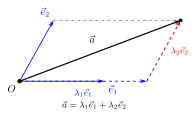
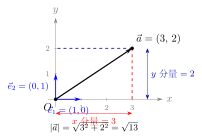

# 基底、平面向量基本定理与坐标表示

> **一例速记**：  
> **平面向量基本定理**：若 $\vec{e}_1, \vec{e}_2$ 不共线，则平面内**任意**向量 $\vec{a}$ 有**唯一**实数对 $(\lambda_1, \lambda_2)$ 使
> $$\vec{a} = \lambda_1\vec{e}_1 + \lambda_2\vec{e}_2$$
> 取**正交基**（互相垂直且模为 1）：$\vec{e}_1 = (1,0)$，$\vec{e}_2 = (0,1)$  
> → $\vec{a} = x\vec{e}_1 + y\vec{e}_2$ 即写成**坐标** $\vec{a} = (x, y)$

---

## 一、引入：用基底做运算

> **题目**：已知 $\vec{e}_1, \vec{e}_2$ 不共线，$\vec{a} = 2\vec{e}_1 - 3\vec{e}_2$，$\vec{b} = \vec{e}_1 + 4\vec{e}_2$。  
> 求 $\vec{a} + \vec{b}$ 和 $2\vec{a} - \vec{b}$，用 $\vec{e}_1, \vec{e}_2$ 表示。

拿到这道题，先别急着"凑"，我们来还原解题者的思路：

---

## 二、思维路径还原

> "题目给了两个向量，都是用 $\vec{e}_1, \vec{e}_2$ 表示的——这说明 $\vec{e}_1, \vec{e}_2$ 是选好的**基底**，所有运算只需操作系数。
>
> **计算 $\vec{a} + \vec{b}$**：
>
> 直接展开，保持 $\vec{e}_1, \vec{e}_2$ 的地位不变，对各自系数做加法：
>
> $$\vec{a} + \vec{b} = (2\vec{e}_1 - 3\vec{e}_2) + (\vec{e}_1 + 4\vec{e}_2)$$
>
> 合并 $\vec{e}_1$ 的系数：$2 + 1 = 3$；合并 $\vec{e}_2$ 的系数：$-3 + 4 = 1$。
>
> $$= 3\vec{e}_1 + 1\vec{e}_2 = 3\vec{e}_1 + \vec{e}_2$$
>
> **计算 $2\vec{a} - \vec{b}$**：
>
> 先用数乘展开（运算律）：
>
> $$2\vec{a} - \vec{b} = 2(2\vec{e}_1 - 3\vec{e}_2) - (\vec{e}_1 + 4\vec{e}_2)$$
>
> 数乘分配：$= 4\vec{e}_1 - 6\vec{e}_2 - \vec{e}_1 - 4\vec{e}_2$
>
> 合并 $\vec{e}_1$ 的系数：$4 - 1 = 3$；合并 $\vec{e}_2$ 的系数：$-6 - 4 = -10$。
>
> $$= 3\vec{e}_1 - 10\vec{e}_2$$
>
> **总结一下节奏**：识别基底 $\vec{e}_1, \vec{e}_2$ → 按运算律展开 → 分别合并 $\vec{e}_1$、$\vec{e}_2$ 的系数 → 写最终结果。
>
> **关键感悟**：$\vec{e}_1, \vec{e}_2$ 在整个过程中就像"$x$"和"$y$"——它们只是承载系数的载体，本身不参与数运算，只等着被收集。这正是**坐标**的本质。
>
> **延伸想法**：如果 $\vec{e}_1 = (1,0)$，$\vec{e}_2 = (0,1)$（正交基），那么 $\vec{a} = (2, -3)$，$\vec{b} = (1, 4)$，$\vec{a} + \vec{b} = (3, 1)$，$2\vec{a} - \vec{b} = (3, -10)$——和刚才的结果完全吻合！这说明坐标运算不过是基底运算的特殊情形。"

把这段思路读两遍，感受"基底系数 $\to$ 合并 $\to$ 结果"的节奏。

---

## 三、平面向量基本定理

### 3.1 定理表述

**定理**：如果 $\vec{e}_1, \vec{e}_2$ 是两个**不共线**的向量，那么对平面内**任意**向量 $\vec{a}$，存在**唯一**一对实数 $\lambda_1, \lambda_2$，使得：

$$\vec{a} = \lambda_1\vec{e}_1 + \lambda_2\vec{e}_2$$

这样的 $\vec{e}_1, \vec{e}_2$ 称为该平面的一组**基底**（basis）。

**定理的三个关键词**：

| 关键词 | 含义 |
|--------|------|
| **不共线** | 基底要"张成"整个平面，共线的两向量只能描述一条直线 |
| **任意** | 平面内每个向量都能分解，没有"漏网"的 |
| **唯一** | 分解方式只有一种，系数 $\lambda_1, \lambda_2$ 确定 |

（见配图 `geo-p1-04-1`：平行四边形分解示意）

### 3.2 为什么要不共线？

若 $\vec{e}_1$ 与 $\vec{e}_2$ 共线（比如 $\vec{e}_2 = 2\vec{e}_1$），则：

$$\lambda_1\vec{e}_1 + \lambda_2\vec{e}_2 = \lambda_1\vec{e}_1 + 2\lambda_2\vec{e}_1 = (\lambda_1 + 2\lambda_2)\vec{e}_1$$

结果永远在 $\vec{e}_1$ 所在直线上，无法表示"平面内所有方向"的向量，更无法保证唯一性。

---

## 四、正交基底与坐标表示

### 4.1 正交基底的引入

当基底满足以下两个条件时，称为**正交（单位）基底**：

1. $\vec{e}_1 \perp \vec{e}_2$（互相垂直）
2. $|\vec{e}_1| = |\vec{e}_2| = 1$（均为单位向量）

通常记 $\vec{e}_1 = \vec{i} = (1, 0)$，$\vec{e}_2 = \vec{j} = (0, 1)$，即直角坐标系的两个方向。

此时，平面向量 $\vec{a} = x\vec{i} + y\vec{j}$ 简记为：

$$\vec{a} = (x, y)$$

$x$ 称为 $\vec{a}$ 在 $x$ 轴方向的**分量**（即对 $\vec{i}$ 的系数），$y$ 同理。

（见配图 `geo-p1-04-2`：正交基底坐标表示）

### 4.2 坐标的四则运算

设 $\vec{a} = (x_1, y_1)$，$\vec{b} = (x_2, y_2)$，$\lambda \in \mathbb{R}$：

| 运算 | 公式 |
|------|------|
| 加法 | $\vec{a} + \vec{b} = (x_1 + x_2,\; y_1 + y_2)$ |
| 减法 | $\vec{a} - \vec{b} = (x_1 - x_2,\; y_1 - y_2)$ |
| 数乘 | $\lambda\vec{a} = (\lambda x_1,\; \lambda y_1)$ |
| 模长 | $|\vec{a}| = \sqrt{x_1^2 + y_1^2}$ |

**本质**：坐标运算就是对两个方向的系数分别做对应的实数运算。

### 4.3 起点与终点的坐标关系

设平面上两点 $A(x_A, y_A)$，$B(x_B, y_B)$，则：

$$\vec{AB} = (x_B - x_A,\; y_B - y_A)$$

**理解**：$\vec{AB} = \vec{OB} - \vec{OA} = (x_B, y_B) - (x_A, y_A) = (x_B - x_A, y_B - y_A)$，"终点坐标减起点坐标"。

**模长**（即两点距离）：

$$|AB| = |\vec{AB}| = \sqrt{(x_B - x_A)^2 + (y_B - y_A)^2}$$

---

## 五、方法变形：从基底到实用工具

### 5.1 非正交基底（斜坐标）

若基底 $\vec{e}_1, \vec{e}_2$ 不垂直，也不是单位向量，系数 $\lambda_1, \lambda_2$ 仍可唯一确定——只是此时它们**不能**直接当作直角坐标的 $x, y$ 使用。高中阶段通常用正交基，但理解"斜坐标"帮助理解基底概念。

### 5.2 用坐标判定共线

$\vec{a} = (x_1, y_1)$ 与 $\vec{b} = (x_2, y_2)$ 共线 $\Leftrightarrow \vec{b} = \lambda\vec{a}$，即：

$$\begin{cases} x_2 = \lambda x_1 \\ y_2 = \lambda y_1 \end{cases}$$

消去 $\lambda$，等价条件为：

$$\boxed{x_1 y_2 - x_2 y_1 = 0}$$

（交叉相乘等式，即行列式 $\det\begin{pmatrix} x_1 & x_2 \\ y_1 & y_2 \end{pmatrix} = 0$）

**注意**：此公式要求 $\vec{a} \neq \vec{0}$，与共线向量定理保持一致。

### 5.3 中点公式的坐标版

线段 $AB$ 中点 $M$ 的坐标：

$$M = \left(\dfrac{x_A + x_B}{2},\; \dfrac{y_A + y_B}{2}\right)$$

**来源**：$\vec{OM} = \dfrac{1}{2}(\vec{OA} + \vec{OB}) = \dfrac{1}{2}(x_A + x_B, y_A + y_B)$，对应分量即为 $M$ 的坐标。

### 5.4 重心公式

三角形 $A(x_1, y_1)$，$B(x_2, y_2)$，$C(x_3, y_3)$ 的**重心** $G$：

$$G = \left(\dfrac{x_1 + x_2 + x_3}{3},\; \dfrac{y_1 + y_2 + y_3}{3}\right)$$

**来源**：重心是三条中线的交点，满足 $\vec{OG} = \dfrac{1}{3}(\vec{OA} + \vec{OB} + \vec{OC})$。

---

## 六、思考路标（条件反射训练）

遇到以下场景，立刻触发对应策略：

1. **看到"平面内任意向量"** → 想"选基底，任意向量唯一分解"，$\vec{a} = \lambda_1\vec{e}_1 + \lambda_2\vec{e}_2$。

2. **看到正交基底（直角坐标系）** → 直接写坐标 $\vec{a} = (x, y)$，基底运算退化为分量运算。

3. **看到"$A, B, C$ 共线"** → 两种判法择一：① 向量法 $\vec{AB} = \lambda\vec{AC}$；② 坐标法 $x_{\vec{AB}} \cdot y_{\vec{AC}} = x_{\vec{AC}} \cdot y_{\vec{AB}}$。

4. **看到"$\vec{AB}$"（有方向的线段向量）** → 立即写 $(x_B - x_A,\; y_B - y_A)$，终点减起点。

5. **看到"模长"$|\vec{a}|$** → $\sqrt{x^2 + y^2}$；看到"两点距离"$|AB|$ → $\sqrt{(x_B-x_A)^2 + (y_B-y_A)^2}$。

6. **选基底时** → 要不共线（否则张不开平面），不一定要正交，但正交基最简洁。

7. **看到 $x_1 y_2 - x_2 y_1 = 0$（或叉积为零）** → 向量 $(x_1, y_1)$ 与 $(x_2, y_2)$ 共线的坐标条件。

8. **看到"中点"** → $\left(\dfrac{x_1+x_2}{2}, \dfrac{y_1+y_2}{2}\right)$，或用 $\vec{OM} = \dfrac{1}{2}(\vec{OA}+\vec{OB})$。

9. **看到"重心"** → 三顶点坐标各分量取平均，$G = \left(\dfrac{x_1+x_2+x_3}{3}, \dfrac{y_1+y_2+y_3}{3}\right)$。

10. **坐标运算出错时** → 回到"分量分开计算"，$x$ 坐标只和 $x$ 坐标运算，$y$ 坐标只和 $y$ 坐标运算，不交叉。

---

## 七、应用例题

### 例 1：基底表示与坐标化

**题目**：已知 $\vec{e}_1, \vec{e}_2$ 不共线，$\vec{a} = 3\vec{e}_1 - \vec{e}_2$，$\vec{b} = \vec{e}_1 + 2\vec{e}_2$，$\vec{c} = -\vec{e}_1 + 3\vec{e}_2$。  
(1) 求 $\vec{a} - 2\vec{b} + \vec{c}$；  
(2) 若 $\vec{e}_1 = (1, 0)$，$\vec{e}_2 = (0, 1)$，写出 $\vec{a}, \vec{b}, \vec{c}$ 的坐标，并验证 (1) 的结果。

**【解答】**

**(1) 基底运算**：

$$\vec{a} - 2\vec{b} + \vec{c} = (3\vec{e}_1 - \vec{e}_2) - 2(\vec{e}_1 + 2\vec{e}_2) + (-\vec{e}_1 + 3\vec{e}_2)$$

$$= 3\vec{e}_1 - \vec{e}_2 - 2\vec{e}_1 - 4\vec{e}_2 - \vec{e}_1 + 3\vec{e}_2$$

合并 $\vec{e}_1$ 系数：$3 - 2 - 1 = 0$；合并 $\vec{e}_2$ 系数：$-1 - 4 + 3 = -2$。

$$\vec{a} - 2\vec{b} + \vec{c} = 0 \cdot \vec{e}_1 + (-2)\vec{e}_2 = -2\vec{e}_2$$

**(2) 坐标验证**：

正交基下：$\vec{a} = (3, -1)$，$\vec{b} = (1, 2)$，$\vec{c} = (-1, 3)$。

$$\vec{a} - 2\vec{b} + \vec{c} = (3, -1) - 2(1, 2) + (-1, 3) = (3, -1) - (2, 4) + (-1, 3)$$

$$= (3 - 2 - 1,\; -1 - 4 + 3) = (0, -2)$$

$= (0, -2)$ 对应 $-2\vec{e}_2 = -2(0,1) = (0,-2)$ ✓

> 基底运算与坐标运算完全对应，系数就是坐标分量。

---

### 例 2：用坐标判定共线

**题目**：已知 $A(1, 2)$，$B(3, 6)$，$C(k, 10)$。  
(1) 用坐标法判断当 $k = 5$ 时，$A, B, C$ 是否共线；  
(2) 求使 $A, B, C$ 三点共线的 $k$ 值。

**【解答】**

$$\vec{AB} = (3-1,\; 6-2) = (2, 4)$$

$$\vec{AC} = (k-1,\; 10-2) = (k-1,\; 8)$$

$A, B, C$ 三点共线 $\Leftrightarrow \vec{AB} \times \vec{AC}$ 满足 $x_{\vec{AB}} \cdot y_{\vec{AC}} - x_{\vec{AC}} \cdot y_{\vec{AB}} = 0$：

$$2 \times 8 - (k-1) \times 4 = 0$$

$$16 - 4(k-1) = 0 \implies 4(k-1) = 16 \implies k-1 = 4 \implies k = 5$$

**(1)** 当 $k = 5$ 时，等式成立，$A, B, C$ **共线**。

**(2)** 使三点共线的唯一值为 $k = 5$。

> 交叉相乘公式 $x_1 y_2 - x_2 y_1 = 0$ 是判定共线最简洁的坐标条件，直接列方程即可。

---

### 例 3：三角形重心坐标

**题目**：三角形三顶点 $A(2, 1)$，$B(4, 7)$，$C(-2, 3)$。  
(1) 求重心 $G$ 的坐标；  
(2) 求 $|AG|$（重心到顶点 $A$ 的距离）；  
(3) 验证：$G$ 在中线 $AM$（$M$ 为 $BC$ 中点）上，且 $AG:GM = 2:1$。

**【解答】**

**(1) 重心坐标**：

$$G = \left(\dfrac{2+4+(-2)}{3},\; \dfrac{1+7+3}{3}\right) = \left(\dfrac{4}{3},\; \dfrac{11}{3}\right)$$

**(2) $|AG|$**：

$$\vec{AG} = \left(\dfrac{4}{3} - 2,\; \dfrac{11}{3} - 1\right) = \left(-\dfrac{2}{3},\; \dfrac{8}{3}\right)$$

$$|AG| = \sqrt{\left(-\dfrac{2}{3}\right)^2 + \left(\dfrac{8}{3}\right)^2} = \sqrt{\dfrac{4}{9} + \dfrac{64}{9}} = \sqrt{\dfrac{68}{9}} = \dfrac{2\sqrt{17}}{3}$$

**(3) 验证中线关系**：

$M$ 是 $BC$ 中点：$M = \left(\dfrac{4+(-2)}{2},\; \dfrac{7+3}{2}\right) = (1, 5)$。

$$\vec{AM} = (1-2,\; 5-1) = (-1, 4)$$

$$\vec{AG} = \left(-\dfrac{2}{3},\; \dfrac{8}{3}\right) = \dfrac{2}{3}(-1, 4) = \dfrac{2}{3}\vec{AM}$$

故 $\vec{AG} = \dfrac{2}{3}\vec{AM}$，即 $G$ 在 $AM$ 上，且 $AG = \dfrac{2}{3}AM$，所以 $AG:GM = 2:1$ ✓

$$\boxed{G = \left(\dfrac{4}{3},\; \dfrac{11}{3}\right),\quad |AG| = \dfrac{2\sqrt{17}}{3},\quad AG:GM = 2:1}$$

> 重心恰好将每条中线按 $2:1$（从顶点到对边中点）分割，这是重心的核心性质。

---

## 八、易错点

**易错 1：基底共线时强行分解**

若 $\vec{e}_1$ 与 $\vec{e}_2$ 平行，它们不能作为基底——分解不唯一（甚至根本无法分解某些方向的向量）。每次建立基底前，先确认两向量不共线。

**易错 2：$\vec{AB}$ 坐标写反方向**

$\vec{AB} = (x_B - x_A, y_B - y_A)$，是"终点 $B$ 减起点 $A$"，不是"$A$ 减 $B$"。  
$\vec{BA} = (x_A - x_B, y_A - y_B) = -\vec{AB}$，方向相反，不要混淆。

**易错 3：模长公式漏掉平方**

$|\vec{a}| = \sqrt{x^2 + y^2}$，有时漏写根号，或把 $\sqrt{x^2 + y^2}$ 错算成 $|x| + |y|$（这是出租车距离，不是向量模长）。

**易错 4：共线判定公式符号出错**

$x_1 y_2 - x_2 y_1 = 0$ 中，注意是"交叉相乘之差"，不是 $x_1 y_1 - x_2 y_2 = 0$（同列相乘无意义）。

**易错 5：重心公式误用为中点公式**

中点是两个顶点坐标各取平均（除以 $2$），重心是三个顶点坐标各取平均（除以 $3$）。两者形式相似，场景不同，别混淆。

---

## 九、思路自测题

**自测 1**　已知 $\vec{e}_1, \vec{e}_2$ 不共线，$\vec{m} = 5\vec{e}_1 - 2\vec{e}_2$，$\vec{n} = -\vec{e}_1 + 3\vec{e}_2$，求 $3\vec{m} + 2\vec{n}$。

> 💡 提示：$3\vec{m} + 2\vec{n} = 3(5\vec{e}_1 - 2\vec{e}_2) + 2(-\vec{e}_1 + 3\vec{e}_2) = (15-2)\vec{e}_1 + (-6+6)\vec{e}_2 = 13\vec{e}_1$。

**自测 2**　已知 $A(-1, 3)$，$B(5, 1)$，求 $\vec{AB}$ 的坐标和 $|\vec{AB}|$。

> 💡 提示：$\vec{AB} = (5-(-1),\; 1-3) = (6, -2)$。$|\vec{AB}| = \sqrt{36+4} = \sqrt{40} = 2\sqrt{10}$。

**自测 3**　判断 $\vec{p} = (3, -6)$ 与 $\vec{q} = (-2, 4)$ 是否共线。

> 💡 提示：$x_1 y_2 - x_2 y_1 = 3 \times 4 - (-2) \times (-6) = 12 - 12 = 0$，共线。（也可注意 $\vec{q} = -\dfrac{2}{3}\vec{p}$。）

**自测 4**　$A(0, 0)$，$B(6, 0)$，$C(3, 4)$，求三角形 $ABC$ 的重心 $G$，并验证 $G$ 在中线 $AG_0$（$G_0$ 为 $BC$ 中点）上。

> 💡 提示：$G = (3, \dfrac{4}{3})$；$G_0 = (\dfrac{6+3}{2}, \dfrac{0+4}{2}) = (\dfrac{9}{2}, 2)$。$\vec{AG_0} = (\dfrac{9}{2}, 2)$，$\vec{AG} = (3, \dfrac{4}{3}) = \dfrac{2}{3}(\dfrac{9}{2}, 2) = \dfrac{2}{3}\vec{AG_0}$ ✓。

**自测 5**　已知 $M(1, 4)$ 是 $AB$ 的中点，$A(a, 2)$，$B(3, b)$，求 $a$ 和 $b$。

> 💡 提示：$\dfrac{a+3}{2} = 1 \Rightarrow a = -1$；$\dfrac{2+b}{2} = 4 \Rightarrow b = 6$。

---

**回头看一眼"一例速记"**：

> **平面向量基本定理**：$\vec{e}_1, \vec{e}_2$ 不共线 → 任意 $\vec{a} = \lambda_1\vec{e}_1 + \lambda_2\vec{e}_2$，系数唯一。  
> 正交基 → 坐标 $(x, y)$；加减法分量运算；数乘各分量乘 $\lambda$。  
> $\vec{AB} = (x_B - x_A, y_B - y_A)$，$|\vec{a}| = \sqrt{x^2+y^2}$。  
> 共线判定：$x_1 y_2 - x_2 y_1 = 0$；中点 $=$ 各坐标取平均；重心 $=$ 三顶点各坐标取平均。

如果现在你能不看笔记，独立推导重心公式并完成自测 4 的全过程——本章，你拿下了。
