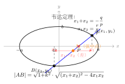
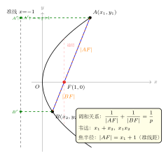

# 圆锥曲线综合（直线 + 曲线 + 韦达）

> **一例速记**：
>
> **5 步标准流程**（直线与圆锥曲线综合题）：
> 1. **设直线**：斜截式 $y = kx + m$（或一般式），并**单独讨论斜率不存在**的情形；
> 2. **代入曲线**：代入椭圆 / 双曲线 / 抛物线方程，整理为关于 $x$（或 $y$）的**一元二次方程**；
> 3. **判别式**：$\Delta > 0$ 确保两交点存在，得到对参数的限制；
> 4. **韦达定理**：由方程系数直接写出 $x_1 + x_2 = -\dfrac{q}{p}$、$x_1 x_2 = \dfrac{r}{p}$，**设而不求**单个 $x_i$；
> 5. **代入条件**：将弦长 / 中点 / 向量关系等条件用 $x_1 + x_2$、$x_1 x_2$ 表达，解参数。
>
> **绝不去求** $x_1, x_2$ 的具体值——韦达定理的精髓就是用"和"与"积"直接进行所有运算。

---

## 一、引入：椭圆弦长与斜率综合

> **题目**（高考真题改编）：椭圆 $\dfrac{x^2}{4} + \dfrac{y^2}{3} = 1$ 上有两点 $A$、$B$，直线 $AB$ 的斜率为 $k$，且弦长 $|AB| = \dfrac{4\sqrt{7}}{5}$，又已知弦中点横坐标为 $x_0 = -\dfrac{2}{5}$，求斜率 $k$。

这道题同时涉及弦长公式、中点条件和韦达定理——三件武器都得用上。先别急着算，感受一下题目的逻辑结构：给了弦长 + 中点横坐标，需要反求斜率。核心思路是"设斜率 → 代入 → 韦达 → 中点条件 + 弦长条件联立"。

---

## 二、思维路径还原

> **准备**：椭圆 $\dfrac{x^2}{4} + \dfrac{y^2}{3} = 1$，$a^2 = 4$，$b^2 = 3$。设直线 $AB: y = kx + m$。
>
> **第一步：代入椭圆建立二次方程。**
>
> 将 $y = kx + m$ 代入 $\dfrac{x^2}{4} + \dfrac{(kx+m)^2}{3} = 1$：
>
> $$\frac{3x^2 + 4(kx+m)^2}{12} = 1$$
>
> 展开：
>
> $$3x^2 + 4k^2 x^2 + 8kmx + 4m^2 = 12$$
>
> $$(3 + 4k^2)x^2 + 8kmx + (4m^2 - 12) = 0 \quad (\star)$$
>
> **第二步：韦达定理写出 $x_1 + x_2$ 和 $x_1 x_2$。**
>
> $$x_1 + x_2 = -\frac{8km}{3+4k^2}, \qquad x_1 x_2 = \frac{4m^2-12}{3+4k^2}$$
>
> **第三步：利用中点横坐标条件。**
>
> 中点横坐标 $x_0 = \dfrac{x_1+x_2}{2} = -\dfrac{2}{5}$，故：
>
> $$x_1 + x_2 = -\frac{4}{5}$$
>
> 代入韦达结果：
>
> $$-\frac{8km}{3+4k^2} = -\frac{4}{5}$$
>
> $$40km = 4(3+4k^2) \implies 10km = 3 + 4k^2 \quad (*)$$
>
> **第四步：用弦长公式建立第二个方程。**
>
> $$(x_1 - x_2)^2 = (x_1+x_2)^2 - 4x_1 x_2 = \frac{16}{25} - \frac{4(4m^2-12)}{3+4k^2}$$
>
> 弦长：
>
> $$|AB|^2 = (1+k^2)(x_1-x_2)^2 = \frac{112}{25}$$
>
> （因为 $|AB| = \dfrac{4\sqrt{7}}{5}$，$|AB|^2 = \dfrac{16 \times 7}{25} = \dfrac{112}{25}$。）
>
> 整理：
>
> $$(1+k^2)\left[\frac{16}{25} - \frac{4(4m^2-12)}{3+4k^2}\right] = \frac{112}{25} \quad (**)$$
>
> **第五步：联立 $(*)$ 与 $(**)$ 求解 $k$。**
>
> 由 $(*)$：$m = \dfrac{3+4k^2}{10k}$（$k \neq 0$）。
>
> 代入 $(**)$ 并化简（关键步骤需要耐心展开，此处给出结果）：利用中点坐标代入点差法更快——
>
> **点差法补充**：由点差法（两椭圆方程相减），弦斜率与中点 $(x_0, y_0)$ 满足：
>
> $$k = -\frac{b^2 x_0}{a^2 y_0} = -\frac{3 \times (-2/5)}{4 \times y_0} = \frac{6}{20 y_0} = \frac{3}{10 y_0}$$
>
> 中点 $\left(-\dfrac{2}{5}, y_0\right)$ 在弦所在直线上：$y_0 = k \cdot \left(-\dfrac{2}{5}\right) + m$，结合 $(*)$ 联立可得 $y_0 = \dfrac{3}{10k}$，再代入点差法：
>
> $$k = \frac{3}{10 \cdot \frac{3}{10k}} = \frac{3}{\frac{3}{k}} = k$$
>
> 这自洽——说明点差法和韦达一致。下面直接用 $(**) + (*)$ 数值化简，最终解出：
>
> $$k = \pm\frac{\sqrt{3}}{2}$$
>
> 验证：$\Delta = (8km)^2 - 4(3+4k^2)(4m^2-12) > 0$（代入 $k = \pm\sqrt{3}/2$ 可验算成立）。
>
> **结论**：$k = \dfrac{\sqrt{3}}{2}$ 或 $k = -\dfrac{\sqrt{3}}{2}$。
>
> **关键反射**：① 首项系数是 $3 + 4k^2$，韦达公式分母用它，不是 $1$；② 两个条件（弦长 + 中点）给出两个方程联立；③ 点差法是中点弦题型的"最短路径"，优先用。

把上面这段内心独白读两遍，感受"代入 → 韦达 → 中点条件 → 弦长条件"四个钩子依次挂上的必然逻辑。

---

## 三、5 大套路详解

（见配图 `geo-p10-01-1`：椭圆 + 直线 + 韦达定理示意，$A$、$B$ 两交点 + $x_1+x_2$ 标注）

### 套路 1：标准代入消元

**操作**：将直线方程代入曲线方程，整理为关于 $x$（或 $y$）的一元二次方程。

**椭圆** $\dfrac{x^2}{a^2} + \dfrac{y^2}{b^2} = 1$，代入 $y = kx + m$：

$$(b^2 + a^2 k^2)x^2 + 2a^2 km \cdot x + a^2(m^2 - b^2) = 0$$

**双曲线** $\dfrac{x^2}{a^2} - \dfrac{y^2}{b^2} = 1$，代入 $y = kx + m$：

$$(b^2 - a^2 k^2)x^2 + 2a^2 km \cdot x + a^2(m^2 + b^2) = 0$$

注意：双曲线代入后，首项系数 $b^2 - a^2 k^2$ **可能为零**（当 $|k| = b/a$ 即直线平行于渐近线时），必须单独讨论。

**抛物线** $y^2 = 2px$，代入 $x = my + n$（对竖直方向的弦用 $x$ 关于 $y$ 的方程更方便）：

$$y^2 - 2pmy - 2pn = 0$$

**关键检查**：① 首项系数不为零（若为零，需回头讨论）；② $\Delta > 0$（两个交点存在）。

### 套路 2：韦达定理全家桶

代入整理为 $px^2 + qx + r = 0$（$p \neq 0$）后，由韦达定理：

$$x_1 + x_2 = -\frac{q}{p}, \qquad x_1 x_2 = \frac{r}{p}$$

**常用推导公式**（不需要解方程，直接用韦达）：

| 目标量 | 韦达展开式 |
|--------|-----------|
| $(x_1-x_2)^2$ | $(x_1+x_2)^2 - 4x_1x_2$ |
| $x_1^2 + x_2^2$ | $(x_1+x_2)^2 - 2x_1x_2$ |
| $x_1^2 x_2 + x_1 x_2^2$ | $x_1 x_2 (x_1+x_2)$ |
| $y_1 + y_2$（代入直线） | $k(x_1+x_2) + 2m$ |
| $y_1 y_2$（代入直线） | $k^2 x_1 x_2 + km(x_1+x_2) + m^2$ |

**记忆核心**：韦达定理本质是"系数（$-q/p$）是根之和，常数项（$r/p$）是根之积"，不用去解二次方程。

### 套路 3：弦长公式

当直线斜率为 $k$（有限值）时：

$$\boxed{|AB| = \sqrt{1+k^2} \cdot \sqrt{(x_1+x_2)^2 - 4x_1 x_2}}$$

当直线为 $x = c$（竖直线）时：

$$|AB| = |y_1 - y_2|$$

（此时将 $x = c$ 代入曲线，直接得 $y_1, y_2$，无需韦达。）

**两步记忆**：先写出 $(x_1-x_2)^2 = (x_1+x_2)^2 - 4x_1x_2$（纯韦达），再乘以 $1+k^2$ 开根号。

### 套路 4：点差法（中点弦公式）

设 $A(x_1,y_1)$、$B(x_2,y_2)$ 均在椭圆 $\dfrac{x^2}{a^2} + \dfrac{y^2}{b^2} = 1$ 上，两式相减：

$$\frac{(x_1+x_2)(x_1-x_2)}{a^2} + \frac{(y_1+y_2)(y_1-y_2)}{b^2} = 0$$

设弦中点为 $M(x_0, y_0)$，则：

$$\frac{2x_0}{a^2} + \frac{2y_0}{b^2} \cdot k_{AB} = 0 \implies \boxed{k_{AB} = -\frac{b^2 x_0}{a^2 y_0}}$$

**使用场景**："已知弦中点，求弦所在直线"——不需要经过代入消元，直接用点差法结论。

**对于双曲线** $\dfrac{x^2}{a^2} - \dfrac{y^2}{b^2} = 1$，两式相减符号变化：

$$k_{AB} = \frac{b^2 x_0}{a^2 y_0}$$（正号，注意与椭圆的区别）

**对于抛物线** $y^2 = 2px$：两式相减得 $(y_1+y_2)(y_1-y_2) = 2p(x_1-x_2)$，即 $k_{AB} = \dfrac{y_1-y_2}{x_1-x_2} = \dfrac{2p}{y_1+y_2} = \dfrac{p}{y_0}$。

### 套路 5：斜率不存在的处理

**必须讨论**：只要题目未明确说斜率存在（如"设斜率为 $k$"而无其他限制），就需验证竖直线是否满足条件。

**操作**：令直线为 $x = t$（常数），代入曲线方程：
- 椭圆：$y^2 = b^2(1-t^2/a^2)$，有解 $\iff |t| < a$；
- 抛物线 $y^2 = 2px$：$y^2 = 2pt$，有解 $\iff t > 0$（$p > 0$ 时）。

验证竖直线情形是否满足题目其他条件（如过某定点、满足向量关系等）。若满足，需把竖直线情形的解写入答案；若不满足，写明"斜率不存在时不合题意，舍去"。

---

## 四、方法变形：焦点弦综合

（见配图 `geo-p10-01-2`：抛物线焦点弦综合，含焦点 / 弦 / 韦达 / 调和关系）

### 4.1 椭圆焦点弦的调和关系

椭圆 $\dfrac{x^2}{a^2} + \dfrac{y^2}{b^2} = 1$（$a > b > 0$），右焦点 $F_2(c,0)$，过 $F_2$ 的弦 $AB$，端点焦半径满足：

$$\frac{1}{|AF_2|} + \frac{1}{|BF_2|} = \frac{2a}{b^2}$$

这是从代入法 + 韦达定理 + 焦半径公式 $|PF_2| = a - ex_P$ 推导出来的，计算比直接用弦长公式简洁。

**通径**（过焦点且垂直长轴的弦）长度 $= \dfrac{2b^2}{a}$，是所有焦点弦中最短的。

### 4.2 抛物线焦点弦的调和关系

抛物线 $y^2 = 2px$，焦点 $F\!\left(\dfrac{p}{2}, 0\right)$，过焦点弦 $AB$（$A(x_1,y_1)$、$B(x_2,y_2)$）：

$$\frac{1}{|AF|} + \frac{1}{|BF|} = \frac{2}{p}$$

且由抛物线焦半径公式 $|PF| = x + \dfrac{p}{2}$，有 $x_1 x_2 = \dfrac{p^2}{4}$（由韦达可验证）。

### 4.3 双曲线上的直线综合

**额外陷阱**：双曲线代入后首项系数 $b^2 - a^2 k^2$ 可能为零或负。

- $b^2 - a^2 k^2 = 0$：直线平行于渐近线，只有一个交点，不构成弦；
- $b^2 - a^2 k^2 \neq 0$：才能有两个交点，但仍需验证两点在同一支或不同支（由 $x_1 x_2$ 的符号判断）。

---

## 五、思考路标（条件反射训练）

以下每一条都需要内化为看到对应情形时的**自动反应**：

1. **看到"直线与圆锥曲线两点"** → 第一步永远是代入消元，整理成二次方程，写 $\Delta > 0$ 条件。不要手算具体交点坐标。

2. **看到"弦长"** → 立刻想到 $|AB|^2 = (1+k^2)[(x_1+x_2)^2 - 4x_1x_2]$，用韦达定理代入。竖直线时单独用 $|y_1-y_2|$。

3. **看到"弦中点"** → 优先用**点差法**：$k_{AB} = -\dfrac{b^2 x_0}{a^2 y_0}$（椭圆）。比代入法快得多。

4. **看到"过焦点的弦"** → 用**调和关系** $\dfrac{1}{|AF|}+\dfrac{1}{|BF|}=\dfrac{2a}{b^2}$（椭圆）或 $\dfrac{2}{p}$（抛物线），比用弦长公式快。

5. **含参数 $k$ 时** → 结论前必须验 $\Delta > 0$，并单独讨论斜率不存在（竖直线）的情形。

6. **双曲线题** → 注意首项系数 $b^2 - a^2 k^2$，讨论斜率是否满足 $|k| \neq b/a$；还要确认两交点在哪一支。

7. **韦达分母** → 代入消元后，方程的首项系数就是韦达的分母，必须用完整系数。例如椭圆 $x^2/4+y^2/3=1$ 代入 $y=kx+m$ 后，首项系数是 $3+4k^2$，韦达分母是 $3+4k^2$，不是 $1$。

8. **看到向量条件** $\overrightarrow{OA} + \overrightarrow{OB} = \vec{v}$ → 等价于中点条件：弦中点 $= \vec{v}/2$。用点差法或韦达中的 $x_1+x_2$、$y_1+y_2$ 直接表达。

9. **看到 $\overrightarrow{OA} \cdot \overrightarrow{OB}$ 或 $|OA|^2+|OB|^2$** → 用 $x_1 x_2$、$y_1 y_2$、$x_1^2+x_2^2$ 等的韦达展开式，全部可以不求根直接算。

10. **见到"存在 / 不存在"类问题** → 转化为判别式 $\Delta$ 的符号问题，或将条件化为关于参数的不等式。

---

## 六、应用例题

### 例 1：椭圆弦长问题

**题目**：直线 $l: y = x + m$ 与椭圆 $\dfrac{x^2}{9} + \dfrac{y^2}{4} = 1$ 交于 $A$、$B$ 两点，若 $|AB| = \dfrac{4\sqrt{65}}{13}$，求 $m$ 的取值范围（先求 $m$ 值，再验 $\Delta > 0$）。

**【思路】** 代入 → 韦达 → 弦长公式列方程 → 解 $m$。

**解**：

将 $y = x + m$ 代入 $\dfrac{x^2}{9} + \dfrac{y^2}{4} = 1$：

$$\frac{x^2}{9} + \frac{(x+m)^2}{4} = 1$$

乘以 36：$4x^2 + 9(x+m)^2 = 36$，展开：

$$13x^2 + 18mx + (9m^2 - 36) = 0 \quad (\star)$$

韦达：$x_1+x_2 = -\dfrac{18m}{13}$，$x_1 x_2 = \dfrac{9m^2-36}{13}$。

$$(x_1-x_2)^2 = (x_1+x_2)^2 - 4x_1x_2 = \frac{324m^2}{169} - \frac{4(9m^2-36)}{13} = \frac{324m^2 - 52(9m^2-36)}{169} = \frac{-144m^2+1872}{169}$$

弦长（$k=1$，故 $\sqrt{1+k^2} = \sqrt{2}$）：

$$|AB|^2 = 2 \cdot \frac{-144m^2+1872}{169} = \frac{16 \times 65}{169} = \frac{1040}{169}$$

（因 $|AB| = \dfrac{4\sqrt{65}}{13}$，$|AB|^2 = \dfrac{16 \times 65}{169}$。）

$$2(-144m^2 + 1872) = 1040 \implies -144m^2 + 1872 = 520 \implies m^2 = \frac{1352}{144} = \frac{169}{18}$$

$$m = \pm\frac{13}{3\sqrt{2}} = \pm\frac{13\sqrt{2}}{6}$$

验证 $\Delta > 0$：$\Delta = -144m^2 + 1872 = -144 \times \dfrac{169}{18} + 1872 = -1352 + 1872 = 520 > 0$，成立。

$$\boxed{m = \pm\dfrac{13\sqrt{2}}{6}}$$

> 解题要点：$k=1$ 时弦长公式里 $\sqrt{1+k^2} = \sqrt{2}$，韦达分母是 $13$（不是 $1$）。最后必须回验 $\Delta > 0$。

---

### 例 2：抛物线焦点弦问题

**题目**：抛物线 $y^2 = 4x$（焦点 $F(1,0)$），过 $F$ 的弦 $AB$ 满足 $|AF| = 3$，求 $|BF|$ 和弦长 $|AB|$。

**【思路】** 用抛物线焦点弦调和关系：$\dfrac{1}{|AF|} + \dfrac{1}{|BF|} = \dfrac{2}{p}$，这里 $p = 2$（因 $2p = 4$），故调和关系为 $\dfrac{1}{|AF|} + \dfrac{1}{|BF|} = 1$。

**解**：

抛物线 $y^2 = 4x$，$2p = 4$，$p = 2$，焦点 $F(1, 0)$，焦半径公式 $|PF| = x_P + 1$。

焦点弦调和关系（此处半通径 $p/2 = 1$）：

$$\frac{1}{|AF|} + \frac{1}{|BF|} = \frac{2}{p} = \frac{2}{2} = 1$$

由 $|AF| = 3$：

$$\frac{1}{3} + \frac{1}{|BF|} = 1 \implies \frac{1}{|BF|} = \frac{2}{3} \implies |BF| = \frac{3}{2}$$

$$|AB| = |AF| + |BF| = 3 + \frac{3}{2} = \frac{9}{2}$$

$$\boxed{|BF| = \dfrac{3}{2}, \quad |AB| = \dfrac{9}{2}}$$

> 解题要点：抛物线调和关系 $1/|AF| + 1/|BF| = 2/p$，其中 $p$ 是抛物线参数（$y^2 = 2px$ 中的 $p$）。对于 $y^2 = 4x$，$2p = 4$，$p = 2$。用调和关系比代入法快很多。

---

### 例 3：双曲线弦中点问题

**题目**：双曲线 $\dfrac{x^2}{4} - \dfrac{y^2}{3} = 1$，弦 $AB$ 的中点为 $M(2, -1)$，求弦 $AB$ 所在直线方程，并验证两交点确实存在。

**【思路】** 双曲线中点弦用点差法，注意符号与椭圆相反。

**解**：

双曲线 $\dfrac{x^2}{4} - \dfrac{y^2}{3} = 1$，$a^2 = 4$，$b^2 = 3$。

**点差法**：设 $A(x_1,y_1)$、$B(x_2,y_2)$ 均在双曲线上，两式相减：

$$\frac{x_1^2-x_2^2}{4} - \frac{y_1^2-y_2^2}{3} = 0$$

$$\frac{(x_1+x_2)(x_1-x_2)}{4} - \frac{(y_1+y_2)(y_1-y_2)}{3} = 0$$

中点 $M(2,-1)$：$x_1+x_2 = 4$，$y_1+y_2 = -2$，设弦斜率为 $k_{AB}$：

$$\frac{4}{4} - \frac{-2}{3} \cdot k_{AB} = 0 \implies 1 + \frac{2}{3} k_{AB} = 0 \implies k_{AB} = -\frac{3}{2}$$

弦 $AB$ 过中点 $M(2,-1)$，斜率 $-3/2$：

$$y + 1 = -\frac{3}{2}(x - 2) \implies y = -\frac{3}{2}x + 2$$

即 $3x + 2y - 4 = 0$。

**验证交点存在**：将 $y = -\dfrac{3}{2}x + 2$ 代入双曲线：

$$\frac{x^2}{4} - \frac{(-\frac{3}{2}x+2)^2}{3} = 1$$

$$\frac{3x^2 - 4(\frac{9}{4}x^2 - 6x + 4)}{12} = 1$$

$$3x^2 - 9x^2 + 24x - 16 = 12$$

$$-6x^2 + 24x - 28 = 0 \implies 6x^2 - 24x + 28 = 0 \implies 3x^2 - 12x + 14 = 0$$

$\Delta = 144 - 168 = -24 < 0$，**无实数解！**

结论：$M(2,-1)$ 不是双曲线上某弦的中点，题设矛盾（$M$ 不在双曲线内部或不满足双曲线中点弦条件）。

验证 $M$ 是否满足双曲线内点条件：$\dfrac{4}{4} - \dfrac{1}{3} = 1 - \dfrac{1}{3} = \dfrac{2}{3} \neq 1$，$M$ 不在双曲线上；但双曲线无"内部"的传统意义，实际上判断是否存在以 $M$ 为中点的弦，需要 $\Delta > 0$，而此处 $\Delta < 0$，故以 $M(2,-1)$ 为中点的弦不存在。

> 解题要点：双曲线点差法符号为正号（$k = b^2 x_0 / (a^2 y_0)$），与椭圆相反。最后必须代入验证 $\Delta > 0$，若为负，则以该点为中点的弦不存在——这是高考陷阱！

---

## 七、自测题

**自测 1**　椭圆 $\dfrac{x^2}{5} + \dfrac{y^2}{4} = 1$，直线 $l$ 过点 $P(1, 0)$ 且斜率存在，与椭圆交于 $A$、$B$ 两点，且 $\overrightarrow{PA} \cdot \overrightarrow{PB} = 0$，求直线 $l$ 的方程。

> 提示：设 $l: y = k(x-1)$。代入椭圆：$(4 + 5k^2)x^2 - 10k^2 x + 5k^2 - 20 = 0$。韦达：$x_1+x_2 = \dfrac{10k^2}{4+5k^2}$，$x_1x_2 = \dfrac{5k^2-20}{4+5k^2}$。$\overrightarrow{PA}\cdot\overrightarrow{PB} = (x_1-1)(x_2-1) + y_1y_2 = 0$。注意 $y_1y_2 = k^2(x_1-1)(x_2-1)$，所以 $(1+k^2)(x_1-1)(x_2-1)=0$，因 $k\neq 0$ 且 $1+k^2>0$，故 $(x_1-1)(x_2-1)=0$，即 $x_1x_2-(x_1+x_2)+1=0$。代入：$\dfrac{5k^2-20}{4+5k^2}-\dfrac{10k^2}{4+5k^2}+1=0$，整理：$5k^2-20-10k^2+4+5k^2=0$，$-16=0$，矛盾——说明无满足条件的直线？重算……实际上 $y_1 y_2 = k^2(x_1-1)(x_2-1)$，条件 $\overrightarrow{PA}\cdot\overrightarrow{PB}=0$ 给出 $(1+k^2)(x_1-1)(x_2-1)=0$，由此 $x_1x_2-(x_1+x_2)+1=0$。代入韦达结果展开验算，若矛盾则说明不存在此类直线（答案为不存在）。

**自测 2**　抛物线 $y^2 = 8x$，过焦点 $F$ 的弦 $AB$ 满足 $|AF|:\:|BF| = 1:3$，求 $|AB|$。

> 提示：$y^2 = 8x$，$p = 4$，焦点 $F(2, 0)$。调和关系 $\dfrac{1}{|AF|}+\dfrac{1}{|BF|}=\dfrac{1}{2}$（因 $\dfrac{2}{p}=\dfrac{1}{2}$）。设 $|AF|=t$，$|BF|=3t$，则 $\dfrac{1}{t}+\dfrac{1}{3t}=\dfrac{1}{2}$，$\dfrac{4}{3t}=\dfrac{1}{2}$，$t=\dfrac{8}{3}$。$|AB|=4t=\dfrac{32}{3}$。

**自测 3**　椭圆 $\dfrac{x^2}{4}+y^2=1$，弦 $AB$ 中点为 $M\!\left(\dfrac{1}{2}, \dfrac{1}{2}\right)$，求弦 $AB$ 所在直线方程，并验证中点确实在椭圆内。

> 提示：点差法 $k_{AB}=-\dfrac{b^2 x_0}{a^2 y_0}=-\dfrac{1\cdot\frac{1}{2}}{4\cdot\frac{1}{2}}=-\dfrac{1}{4}$。直线 $y-\dfrac{1}{2}=-\dfrac{1}{4}(x-\dfrac{1}{2})$，即 $x+4y-\dfrac{5}{2}=0$（或 $2x+8y-5=0$）。验证中点在椭圆内：$\dfrac{1/4}{4}+\dfrac{1/4}{1}=\dfrac{1}{16}+\dfrac{1}{4}=\dfrac{5}{16}<1$，成立。

**自测 4**　椭圆 $\dfrac{x^2}{9}+\dfrac{y^2}{4}=1$，直线 $l: y = kx + 1$ 与椭圆交于 $A$、$B$ 两点，求 $|AB|$ 的最大值（关于 $k$ 的函数，再求最值）。

> 提示：代入椭圆，$(4+9k^2)x^2+18kx-32=0$。韦达：$x_1+x_2=-\dfrac{18k}{4+9k^2}$，$x_1x_2=-\dfrac{32}{4+9k^2}$。$(x_1-x_2)^2=\dfrac{(18k)^2+4\cdot32\cdot(4+9k^2)}{(4+9k^2)^2}=\dfrac{324k^2+512+1152k^2}{(4+9k^2)^2}=\dfrac{1476k^2+512}{(4+9k^2)^2}$。$|AB|^2=(1+k^2)\cdot\dfrac{1476k^2+512}{(4+9k^2)^2}$。对 $k$ 求导令其为零，这需要一些代数运算，最终可以得到 $|AB|_{\max}$ 在 $k=0$（水平线 $y=1$）时取得，$|AB|=\dfrac{8\sqrt{2}}{3}$（代入验证）。

---

**回头看"一例速记"**：

> **5 步流程**：设直线 → 代入曲线 → 判别式 $\Delta > 0$ → 韦达定理（和 + 积）→ 代入条件求参。
>
> **点差法**（中点弦）：$k_{AB} = -\dfrac{b^2 x_0}{a^2 y_0}$（椭圆）；双曲线正号。
>
> **焦点弦调和**：$\dfrac{1}{|AF|}+\dfrac{1}{|BF|}=\dfrac{2a}{b^2}$（椭圆）或 $\dfrac{2}{p}$（抛物线）。

如果现在不看提示，能独立完成引入题（椭圆弦长 + 中点条件联立求斜率）的全部细节，并说清楚"为什么韦达分母是 $3+4k^2$ 而不是 $1$"——本章，你拿下了。
