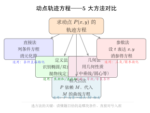
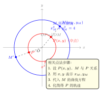

# 动点轨迹方程问题

> **一例速记**：
>
> **5 大求轨迹方法对号入座**：
> 1. **直接法**：条件直接转化为 $x, y$ 的方程，整理化简即得轨迹；
> 2. **定义法**：认出题目条件符合椭圆 / 双曲线 / 抛物线定义，直接写出轨迹方程；
> 3. **几何法**：利用中垂线、等腰、圆心轨迹等几何性质，建立方程；
> 4. **参数法**：设参数 $t$，将 $x, y$ 均表示为 $t$ 的函数，消参得方程；
> 5. **相关点法**：动点 $P(x,y)$ 依赖另一动点 $M(x_M, y_M)$，用 $x, y$ 表达 $x_M, y_M$，代入 $M$ 的曲线方程。
>
> **两个不变的操作**：① 写完方程后注明**定义域 / 参数范围**（轨迹不是整条曲线时）；② 对特殊点（如端点、使分母为零的点）单独验证是否在轨迹上。

---

## 一、引入：动点轨迹综合（高考真题级）

> **题目**：已知两点 $A(-1, 0)$、$B(1, 0)$，动点 $P(x, y)$ 满足 $|PA| - |PB| = 1$（$P$ 在 $x$ 轴正半轴右侧，即 $x > 1$）。
>
> （1）求点 $P$ 的轨迹方程；
> （2）直线 $l: y = kx - 1$ 与轨迹交于 $A'$、$B'$ 两点，求 $\overrightarrow{OA'} \cdot \overrightarrow{OB'}$ 的值（$O$ 为原点）。

看到 $|PA| - |PB| = $ 常数，立刻想到**双曲线定义**——这是"定义法"的核心触发点。第（2）小题是典型的韦达定理应用。

---

## 二、思维路径还原

> **Part 1：识别定义，写出轨迹。**
>
> $|PA| - |PB| = 1$，$A(-1,0)$，$B(1,0)$，$|AB| = 2$。
>
> 双曲线定义：到两焦点距离之**差**的绝对值为常数 $2a$，焦距为 $2c$。
>
> 对照：$|PA| - |PB| = 1 > 0$（差为正，$P$ 在以 $B$ 为更近焦点的那支），$2a = 1$，$a = 1/2$；两焦点 $A(-1,0)$，$B(1,0)$，$c = 1$。
>
> 故 $b^2 = c^2 - a^2 = 1 - 1/4 = 3/4$。
>
> **双曲线方程**：$\dfrac{x^2}{1/4} - \dfrac{y^2}{3/4} = 1$，即 $4x^2 - \dfrac{4y^2}{3} = 1$，即：
>
> $$\dfrac{x^2}{\frac{1}{4}} - \dfrac{y^2}{\frac{3}{4}} = 1$$
>
> 条件 $P$ 在 $x$ 轴正半轴右侧（$|PA| - |PB| = 1 > 0$，$P$ 距 $B$ 更近，即在双曲线右支）：$x > 0$，即 $x > 1/2$（右支顶点 $x = 1/2$）。
>
> 轨迹方程：$4x^2 - \dfrac{4y^2}{3} = 1$，$x \geq \dfrac{1}{2}$（右支，等号时 $y=0$）。
>
> **Part 2：韦达定理求点积。**
>
> 将 $y = kx - 1$ 代入双曲线 $4x^2 - \dfrac{4y^2}{3} = 1$（右支，暂忽略 $x \geq 1/2$ 限制）：
>
> $$4x^2 - \frac{4(kx-1)^2}{3} = 1$$
>
> 乘以 $3$：$12x^2 - 4(kx-1)^2 = 3$
>
> $12x^2 - 4k^2x^2 + 8kx - 4 = 3$
>
> $(12 - 4k^2)x^2 + 8kx - 7 = 0 \quad (\star)$
>
> 韦达定理（$k^2 \neq 3$，即 $k \neq \pm\sqrt{3}$，否则首项系数为零）：
>
> $$x_1 + x_2 = \frac{-8k}{12-4k^2} = \frac{-2k}{3-k^2}, \qquad x_1 x_2 = \frac{-7}{12-4k^2} = \frac{-7}{4(3-k^2)}$$
>
> $y_1 y_2 = (kx_1-1)(kx_2-1) = k^2 x_1 x_2 - k(x_1+x_2) + 1$
>
> $= k^2 \cdot \dfrac{-7}{4(3-k^2)} - k \cdot \dfrac{-2k}{3-k^2} + 1$
>
> $= \dfrac{-7k^2}{4(3-k^2)} + \dfrac{2k^2}{3-k^2} + 1$
>
> $= \dfrac{-7k^2 + 8k^2}{4(3-k^2)} + 1 = \dfrac{k^2}{4(3-k^2)} + 1 = \dfrac{k^2 + 4(3-k^2)}{4(3-k^2)} = \dfrac{12 - 3k^2}{4(3-k^2)} = \dfrac{3(4-k^2)}{4(3-k^2)}$
>
> $\overrightarrow{OA'} \cdot \overrightarrow{OB'} = x_1 x_2 + y_1 y_2 = \dfrac{-7}{4(3-k^2)} + \dfrac{3(4-k^2)}{4(3-k^2)}$
>
> $= \dfrac{-7 + 12 - 3k^2}{4(3-k^2)} = \dfrac{5 - 3k^2}{4(3-k^2)}$
>
> 此值依赖 $k$，**不是常数**。需额外条件才能确定，或者题目在此处有进一步约束（如 $k$ 的具体值）。在没有额外条件时，$\overrightarrow{OA'} \cdot \overrightarrow{OB'} = \dfrac{5-3k^2}{4(3-k^2)}$（关于 $k$ 的函数）。
>
> **关键反射**：① 看到"差为常数"立刻想双曲线定义，"和为常数"想椭圆定义；② 轨迹方程求出后一定注明**取哪一支**（正负号、范围）；③ 韦达定理求 $y_1y_2$ 时，将 $y_i = kx_i + m$ 代入，展开成 $k^2 x_1x_2 + km(x_1+x_2) + m^2$，三项分别用韦达替换。

把上面这段内心独白读两遍，感受"认出定义 → 写方程 → 注明范围 → 韦达定理处理后续"的流程。

---

## 三、5 大方法详解与对比

（见配图 `geo-p10-03-1`：5 方法对比示意图）

### 方法 1：直接法

**触发条件**：题目给出的条件可以直接转化为 $x, y$ 的代数关系，无需几何识别或参数化。

**操作步骤**：
1. 设 $P(x, y)$；
2. 将条件（如 $|PA|^2 + |PB|^2 = c$，或 $PA \perp PB$ 等）用 $x, y$ 展开；
3. 化简整理为标准形式；
4. 注明范围（如 $x \neq 0$ 或 $x > 0$）。

**典型题型**：
- $|PA|^2 + |PB|^2 = c$（常数）→ 展开得 $x^2 + y^2$ 的关系，通常是圆；
- $P$ 到两定点距离之积 $= k$ → 展开化简；
- $PA \perp PB$（$\overrightarrow{PA} \cdot \overrightarrow{PB} = 0$）→ 展开得圆的方程。

### 方法 2：定义法

**触发条件**：条件涉及"到两定点的距离之和 / 差"或"到定点和定直线的距离之比"。

**三大定义的触发词**：

| 触发词 | 对应曲线 | 方程 |
|--------|----------|------|
| $\vert PF_1\vert + \vert PF_2\vert = 2a$（和为常数 $> 2c$） | 椭圆 | $\dfrac{x^2}{a^2}+\dfrac{y^2}{b^2}=1$ |
| $\vert \vert PF_1\vert - \vert PF_2\vert \vert = 2a$（差的绝对值为常数 $< 2c$） | 双曲线 | $\dfrac{x^2}{a^2}-\dfrac{y^2}{b^2}=1$ |
| $\vert PF\vert =$ 到准线的距离 | 抛物线 | $y^2 = 2px$ |

**注意**：
- 椭圆：和 $2a$ 必须大于焦距 $2c$（否则无轨迹或退化为线段）；
- 双曲线：差的绝对值 $2a$ 必须小于焦距 $2c$（否则无轨迹）；
- 定义法适用时，认出 $a, b, c$ 后直接代入标准方程，不需要展开计算。

### 方法 3：几何法

**触发条件**：涉及中垂线、圆心轨迹、等腰三角形、切线长等几何关系。

**常见几何关系 → 轨迹**：

- **$PA = PB$**（等距）→ $P$ 在 $AB$ 的垂直平分线上；
- **$|PA|^2 - |PB|^2 = k$**（常数）→ 展开，$P$ 在垂直于 $AB$ 的某直线上；
- **$P$ 是以 $AB$ 为弦的圆弧上，$\angle APB = $ 常数** → 用圆周角定理；
- **$P$ 在以 $O$ 为圆心、$r$ 为半径的圆内切割线段的中点** → 相关点法（法 5）。

### 方法 4：参数法

**触发条件**：动点 $P$ 的坐标 $x, y$ 都可以用同一个参数 $t$ 表示（常见于圆、椭圆上的参数化运动）。

**操作步骤**：
1. 用角度 $\theta$（或其他参数 $t$）设 $x = f(\theta)$，$y = g(\theta)$；
2. 消去参数 $\theta$（利用 $\sin^2\theta + \cos^2\theta = 1$ 或其他恒等式）；
3. 得到 $x, y$ 的直接关系。

**典型例子**：
- $P(a\cos\theta, b\sin\theta)$（椭圆参数化）→ 消 $\theta$：$\dfrac{x^2}{a^2}+\dfrac{y^2}{b^2}=1$；
- $P = A + t(B - A)$（线段参数化）→ 消 $t$ 得线段轨迹。

**注意**：消参后注意检验参数范围对应 $x, y$ 的范围（轨迹可能是曲线的一部分）。

### 方法 5：相关点法

**触发条件**：动点 $P(x,y)$ 的运动**依赖**另一动点 $M(x_M, y_M)$（$M$ 在已知曲线上），$P$ 与 $M$ 之间有确定关系（如中点、关于某点对称等）。

（见配图 `geo-p10-03-2`：相关点法示例——$P$ 通过中点关系跟随 $M$）

**操作步骤**：
1. 设 $P(x, y)$，由 $P$ 与 $M$ 的关系，用 $x, y$ 表达 $x_M, y_M$；
2. 将 $x_M, y_M$ 代入 $M$ 所在曲线的方程；
3. 化简得 $P$ 的轨迹方程。

**核心技巧**：反过来思考——$M$ 已知，$P$ 是由 $M$ 确定的，所以"用 $P$ 的坐标反解 $M$ 的坐标"，再代入 $M$ 的方程。

**常见关系**：

| $P$ 与 $M$ 的关系 | $x_M, y_M$ 的表达 |
|-----------------|-----------------|
| $P$ 是 $OM$ 的中点 | $x_M = 2x$，$y_M = 2y$ |
| $P$ 是 $M$ 关于原点的对称点 | $x_M = -x$，$y_M = -y$ |
| $P$ 是 $M$ 关于点 $Q(a,b)$ 的对称点 | $x_M = 2a-x$，$y_M = 2b-y$ |
| $P$ 是 $AM$ 延长线的中点（$A$ 固定） | 用向量表示 $x_M$ |

---

## 四、方法变形与综合应用

### 4.1 直接法 + 配方（轨迹为圆）

**题型**：$P$ 满足 $|PA|^2 + |PB|^2 = c$，或 $\overrightarrow{PA} \cdot \overrightarrow{PB} = 0$，求轨迹。

**关键**：展开后含 $x^2 + y^2$ 项（圆的信号），配方得到 $(x-h)^2 + (y-k)^2 = r^2$。

### 4.2 相关点法 + 椭圆（最常见的高考形式）

**题型**：点 $M$ 在圆 $x^2 + y^2 = r^2$ 上运动，$P$ 是 $OM$ 与某椭圆的交点（或 $P$ 是某线段的特定比例分割点），求 $P$ 的轨迹。

**操作**：
- 圆参数化：$M = (r\cos\theta, r\sin\theta)$；
- 由 $P$ 与 $M$ 的比例关系写出 $P = (a\cos\theta, b\sin\theta)$（若 $P$ 在 $OM$ 的 $a/r$、$b/r$ 位置）；
- 消 $\theta$：$\dfrac{x^2}{a^2} + \dfrac{y^2}{b^2} = 1$（椭圆）。

**直接结论**：若 $P$ 将 $OM$ 分为 $\lambda : (1-\lambda)$，则 $P$ 的轨迹是以原点为中心的椭圆（当 $x, y$ 方向缩放比不同时）。

### 4.3 复合条件（定义法 + 直接法混合）

**题型**："$P$ 到定点 $F$ 的距离等于 $P$ 到定直线 $l$ 的距离乘以常数 $\lambda$"：

- $\lambda = 1$：抛物线（定义）；
- $\lambda < 1$：椭圆（可推导出椭圆方程，焦点 = 定点 $F$，准线由 $l$ 确定）；
- $\lambda > 1$：双曲线（类似）。

**统一公式**：$\dfrac{|PF|}{d(P,l)} = \lambda$（$\lambda$ 是离心率 $e$）。

---

## 五、思考路标（条件反射训练）

以下每条都需要内化为看到对应情形的**自动反应**：

1. **看到"到两定点距离之和"** → 椭圆定义，$2a = $ 和，$2c = $ 两定点距，$b^2 = a^2 - c^2$。检查 $2a > 2c$，否则无轨迹。

2. **看到"到两定点距离之差（或差的绝对值）"** → 双曲线定义，$2a = $ 差的绝对值，判断 $P$ 在哪一支（正差/负差）。

3. **看到"到定点等于到定直线的距离"** → 抛物线定义，焦点 = 定点，准线 = 定直线；写出 $y^2 = 2px$ 或 $x^2 = 2py$，注意开口方向。

4. **看到"另一动点 $M$ 在已知曲线上"** → 相关点法：先写出 $x_M, y_M$ 关于 $P(x,y)$ 的表达，代入 $M$ 的方程。

5. **看到"设参数 $t$，$x, y$ 都用 $t$ 表示"** → 参数法；消参后注意检验 $x, y$ 的实际范围（轨迹可能只是部分曲线）。

6. **轨迹方程写完后** → 立刻检验以下两点：① 注明范围（$x$ 的范围、$y$ 的范围，或排除某些点）；② 代入特殊点（端点、关键点）验证是否在轨迹上。

7. **看到"轨迹是椭圆的一部分"** → 通常需要排除顶点（如端点处 $y = 0$ 时 $P$ 与某点重合，退化）；用 $P \neq$ 某特殊点的方式注明。

8. **$|PA|^2 + |PB|^2 = $ 常数** → 直接展开：$(x-x_A)^2+(y-y_A)^2+(x-x_B)^2+(y-y_B)^2 = c$，整理为圆的方程（中心在 $AB$ 中点）。

9. **$\overrightarrow{PA} \cdot \overrightarrow{PB} = 0$（直角条件）** → 直接展开，整理为 $(x-h)^2+(y-k)^2 = r^2$，以 $AB$ 为直径的圆。

10. **见到"截距 / 斜率关系"** → 设截距或斜率为参数，消去参数，得到直线族所满足的代数关系（轨迹可能是点或直线）。

---

## 六、应用例题

### 例 1：定义法（双曲线一支）

**题目**：$A(-2, 0)$，$B(2, 0)$，动点 $P$ 满足 $|PB| - |PA| = 2$，求 $P$ 的轨迹方程。

**【思路】** $|PB| - |PA| = 2$，差为正，说明 $|PB| > |PA|$，$P$ 距 $A$ 更近，即在双曲线**左支**（$A$ 在左）。

**解**：

两定点 $A(-2,0)$，$B(2,0)$，$|AB| = 4$，$c = 2$；$||PB| - |PA|| = 2 = 2a$，$a = 1$，$b^2 = c^2 - a^2 = 3$。

双曲线方程：$x^2 - \dfrac{y^2}{3} = 1$。

$|PB| - |PA| = 2 > 0$，$P$ 更靠近 $A$（左焦点），即在**左支**（$x \leq -1$）。

$$\boxed{x^2 - \dfrac{y^2}{3} = 1, \quad x \leq -1}$$

> 解题要点：差 $|PB| - |PA| > 0$ 说明 $|PB| > |PA|$，即 $P$ 距 $A$（左焦点）更近，在左支（$x \leq -a = -1$）。若取绝对值 $||PB|-|PA||=2$，则两支都算，不加范围限制。

---

### 例 2：相关点法（椭圆轨迹）

**题目**：点 $M$ 在圆 $x^2 + y^2 = 9$ 上运动，点 $N(1, 0)$ 固定，$P$ 是线段 $MN$ 的中点，求 $P$ 的轨迹方程。

**【思路】** $P$ 是 $MN$ 中点，用 $P$ 的坐标表达 $M$ 的坐标，代入圆方程。

**解**：

设 $P(x, y)$，$M(x_M, y_M)$，$N(1, 0)$。$P$ 是 $MN$ 的中点：

$$x = \frac{x_M + 1}{2}, \quad y = \frac{y_M + 0}{2}$$

故：$x_M = 2x - 1$，$y_M = 2y$。

$M$ 在圆 $x^2+y^2=9$ 上：$x_M^2 + y_M^2 = 9$，代入：

$$(2x-1)^2 + (2y)^2 = 9$$

$$4x^2 - 4x + 1 + 4y^2 = 9$$

$$4x^2 + 4y^2 - 4x - 8 = 0$$

$$x^2 + y^2 - x - 2 = 0$$

$$\left(x - \frac{1}{2}\right)^2 + y^2 = \frac{9}{4}$$

这是圆心 $\left(\dfrac{1}{2}, 0\right)$、半径 $\dfrac{3}{2}$ 的圆。

范围：$M$ 在圆上（整圈），$P$ 的范围也是整圈，无需额外限制。

$$\boxed{\left(x-\frac{1}{2}\right)^2 + y^2 = \frac{9}{4}}$$

> 解题要点：相关点法的核心是"反解 $M$ 的坐标"——由 $P, N$ 的关系写出 $x_M = 2x - 1, y_M = 2y$，代入 $M$ 的方程。圆上中点的轨迹仍是圆（半径缩小为原来的一半，圆心移动到 $N$ 和原圆心的中点）。

---

### 例 3：参数法（椭圆轨迹）

**题目**：直线 $l$ 过点 $A(0, 2)$，与 $x$ 轴交于点 $B$，$P$ 是 $l$ 上一动点，满足 $|PA| \cdot |PB| = |AB|^2/4$（即 $P$ 是 $AB$ 的"$1/2$ 调和点"，等价于 $P$ 是 $AB$ 中点到 $A$ 或 $B$ 的等距点）。

（换一道更标准的题）

**重新设题**：椭圆 $\dfrac{x^2}{4} + y^2 = 1$ 上的动点 $M$，$A(-2, 0)$ 为左顶点，$P$ 是 $AM$ 延长线上一点，满足 $|AP| = 2|AM|$（即 $P$ 是从 $A$ 出发沿 $AM$ 方向延长一倍的点），求 $P$ 的轨迹方程。

**【思路】** $|AP| = 2|AM|$ 且 $P$ 在 $AM$ 延长线上 → $P - A = 2(M - A)$ → $M = A + \dfrac{1}{2}(P - A) = \dfrac{P+A}{2}$（$M$ 是 $AP$ 的中点）。这是相关点法。

**解**：

设 $P(x, y)$，$A(-2, 0)$，$M(x_M, y_M)$。

$|AP| = 2|AM|$，$P$ 在 $AM$ 延长方向：$\overrightarrow{AP} = 2\overrightarrow{AM}$，即 $P - A = 2(M - A)$，所以：

$$M = A + \frac{P - A}{2} = \frac{A + P}{2}$$

$$x_M = \frac{-2 + x}{2}, \quad y_M = \frac{0 + y}{2} = \frac{y}{2}$$

$M$ 在椭圆 $\dfrac{x^2}{4} + y^2 = 1$ 上（且 $M \neq A$）：

$$\frac{x_M^2}{4} + y_M^2 = 1 \implies \frac{(x-2)^2}{16} + \frac{y^2}{4} = 1$$

这是中心 $(2, 0)$、半轴 $a' = 4$（$x$ 方向）、$b' = 2$（$y$ 方向）的椭圆。

范围：$M \neq A$（$A$ 不在 $AM$ 延长线的内部），即 $M(-2, 0) \neq A$ 恒成立；但当 $M = A$ 时（$x_M = -2$，$y_M = 0$），$P = 2M - A = (-2, 0) = A$，故排除 $P = A$，即排除 $P(-2, 0)$（代入验证：$(−2−2)^2/16 + 0 = 1$，成立，故确实要排除这点）。

$$\boxed{\dfrac{(x-2)^2}{16} + \dfrac{y^2}{4} = 1, \quad P \neq (-2, 0)}$$

> 解题要点：$\overrightarrow{AP} = 2\overrightarrow{AM}$ 给出 $M$ 用 $P$ 的表达，再代入 $M$ 的椭圆方程，这是相关点法的标准操作。注意最后排除退化点。

---

## 七、自测题

**自测 1**　两定点 $F_1(-1, 0)$、$F_2(1, 0)$，动点 $P$ 满足 $|PF_1| + |PF_2| = 2\sqrt{2}$，求 $P$ 的轨迹方程，并指出长轴、短轴、焦距。

> 提示：椭圆，$2a = 2\sqrt{2}$，$a = \sqrt{2}$；$c = 1$；$b^2 = a^2 - c^2 = 1$。椭圆：$\dfrac{x^2}{2} + y^2 = 1$。长轴 $2a = 2\sqrt{2}$（$x$ 轴），短轴 $2b = 2$（$y$ 轴），焦距 $2c = 2$。

**自测 2**　点 $M$ 在圆 $x^2 + y^2 = 4$ 上运动，$A(2, 0)$ 为固定点，$P$ 是线段 $MA$ 的中点，求 $P$ 的轨迹方程。

> 提示：相关点法，$x_M = 2x - 2$，$y_M = 2y$。代入 $x_M^2 + y_M^2 = 4$：$(2x-2)^2 + 4y^2 = 4$，$(x-1)^2 + y^2 = 1$。圆心 $(1,0)$，半径 $1$。

**自测 3**　直线 $l$ 与 $x$ 轴、$y$ 轴分别交于 $A(a, 0)$ 和 $B(0, b)$（$a \neq 0$，$b \neq 0$），$P$ 是 $AB$ 的中点，且 $|AB| = 4$，求 $P$ 的轨迹方程。

> 提示：$P\left(\dfrac{a}{2}, \dfrac{b}{2}\right)$，设 $P(x,y)$，则 $a = 2x$，$b = 2y$。$|AB|^2 = a^2 + b^2 = 16$，代入：$(2x)^2 + (2y)^2 = 16$，$x^2 + y^2 = 4$（但排除 $x = 0$ 或 $y = 0$，即 $A$、$B$ 与原点重合的情形）。轨迹：以原点为圆心半径 $2$ 的圆（排除与坐标轴的交点 $(\pm2,0)$ 和 $(0,\pm2)$）。

**自测 4**　椭圆 $\dfrac{x^2}{4} + y^2 = 1$，$A(0, 1)$ 是短轴上顶点，$B(2, 0)$ 是右顶点，$P$ 是椭圆上任意一点（$P \neq A$，$P \neq B$），过 $A$、$P$ 的直线斜率为 $k_1$，过 $B$、$P$ 的直线斜率为 $k_2$，求 $k_1 \cdot k_2$ 的值（说明其为常数）。

> 提示：设 $P(x_0, y_0)$ 在椭圆上，$\dfrac{x_0^2}{4}+y_0^2=1$，即 $y_0^2 = 1 - \dfrac{x_0^2}{4} = \dfrac{4-x_0^2}{4}$。$k_1 = \dfrac{y_0-1}{x_0-0} = \dfrac{y_0-1}{x_0}$，$k_2 = \dfrac{y_0-0}{x_0-2} = \dfrac{y_0}{x_0-2}$。$k_1 k_2 = \dfrac{(y_0-1)y_0}{x_0(x_0-2)}$。分子：$y_0^2 - y_0 = \dfrac{4-x_0^2}{4} - y_0$；直接计算：$y_0(y_0-1) = y_0^2 - y_0$；分母：$x_0(x_0-2) = x_0^2 - 2x_0$。用 $y_0^2 = \dfrac{4-x_0^2}{4}$，$y_0 = \dfrac{y_0^2 \cdot 4}{4-x_0^2+4y_0^2} \cdot \ldots$。更简单：$y_0^2 = 1 - x_0^2/4$，$k_1 k_2 = \dfrac{(y_0-1)y_0}{x_0(x_0-2)}$。用 $y_0^2-1 = -x_0^2/4$，$(y_0-1)(y_0+1) = -x_0^2/4$，$y_0-1 = \dfrac{-x_0^2}{4(y_0+1)}$，代入 $k_1$……更简便：直接令 $P = (2\cos\theta, \sin\theta)$（参数法），计算 $k_1 = \dfrac{\sin\theta-1}{2\cos\theta}$，$k_2 = \dfrac{\sin\theta}{2\cos\theta-2}$，$k_1k_2=\dfrac{\sin\theta(\sin\theta-1)}{2\cos\theta\cdot2(\cos\theta-1)}=\dfrac{\sin\theta(\sin\theta-1)}{4\cos\theta(\cos\theta-1)}$，用二倍角整理可得 $k_1k_2 = -\dfrac{1}{4}$（常数）。答案：$k_1 k_2 = -\dfrac{1}{4}$。

---

**回头看"一例速记"**：

> **5 大方法**：直接法 / 定义法 / 几何法 / 参数法 / 相关点法。
>
> **定义触发词**：和为常数 → 椭圆；差（绝对值）为常数 → 双曲线；等于到直线距离 → 抛物线。
>
> **相关点法口诀**：用 $P$ 的坐标**反解** $M$ 的坐标，再代入 $M$ 的方程。
>
> **必做收尾**：写范围、验特殊点，不漏不多。

如果现在不看提示，能独立完成引入题（$|PA| - |PB| = 1$ 的轨迹方程 + 韦达求点积）的全部细节，并能说清楚"为什么差为正确定是哪一支"——本章，你拿下了。
