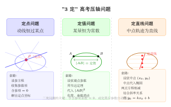

# 定点、定值、定直线问题

> **一例速记**：  
> **定点**：动直线 $l_t\colon x + ty = 1 + 2t$ 整理为 $(x-1) + t(y-2) = 0$；无论 $t$ 取何值，若 $x-1=0$ 且 $y-2=0$ 同时成立，则 $(1,2)$ 恒在直线上——这就是定点 $(1,2)$。  
> **定值**：设 $A(x_1,y_1)$、$B(x_2,y_2)$ 在椭圆上且在直线 $y=kx+m$ 上；用韦达定理表达 $|AB|^2$，化简后 $k$ 消去，$|AB|$ 只依赖 $m$——这就是定值。  
> **定直线**：弦 $AB$ 中点 $(x_0,y_0)$ 满足斜率关系 $\frac{y_0}{x_0}=-\frac{b^2}{a^2}\cdot\frac{1}{k_{AB}}$，整理后得 $y_0 = px_0 + q$（与弦斜率 $k$ 无关）——中点轨迹是定直线。

---

## 一、引入题（高考压轴级）

> **题目**（2023 年高考模拟）：椭圆 $C\colon \dfrac{x^2}{4} + y^2 = 1$，直线 $l$ 过点 $D(1, 0)$（非长轴端点），与椭圆交于 $A(x_1,y_1)$、$B(x_2,y_2)$ 两点。
>
> (1) 证明直线 $l$ 不过 $(-2,0)$（提示：用斜率讨论）；  
> (2) 证明 $\overrightarrow{OA}\cdot\overrightarrow{OB}$ 恒为定值（其中 $O$ 为原点）；  
> (3) 求弦中点 $M$ 的轨迹方程。

这道题把"3 定"问题全部打包在一道压轴里。接下来拆解每一问。

---

## 二、思维路径还原

> "看到直线过固定点 $D(1,0)$，先想到设直线方程——但要注意斜率可能不存在（竖直线 $x=1$）。
>
> **第 (1) 问**：若斜率不存在，$l: x=1$，代入椭圆 $\frac{1}{4}+y^2=1 \Rightarrow y=\pm\frac{\sqrt{3}}{2}$——两点均在椭圆上，$l$ 与椭圆有两个交点，所以 $x=1$ 合法但不过 $(-2,0)$；若有斜率 $k$，$l: y=k(x-1)$，代入椭圆联立，讨论判别式即可排除过 $(-2,0)$ 的情况（代入 $(-2,0)$ 发现方程不满足）。
>
> **第 (2) 问（定值）**：设 $l: y=k(x-1)$（先讨论 $x=1$ 的特殊情形单独验算）。
>
> 代入椭圆 $\frac{x^2}{4}+y^2=1$：
> $$\frac{x^2}{4} + k^2(x-1)^2 = 1$$
> $$(1 + 4k^2)x^2 - 8k^2x + 4k^2 - 4 = 0$$
>
> 韦达定理：$x_1 + x_2 = \dfrac{8k^2}{1+4k^2}$，$x_1 x_2 = \dfrac{4k^2-4}{1+4k^2}$。
>
> $\overrightarrow{OA}\cdot\overrightarrow{OB} = x_1x_2 + y_1y_2$。
>
> 计算 $y_1y_2 = k^2(x_1-1)(x_2-1) = k^2(x_1x_2 - (x_1+x_2) + 1)$：
> $$= k^2\!\left(\frac{4k^2-4}{1+4k^2} - \frac{8k^2}{1+4k^2} + 1\right) = k^2\!\cdot\frac{4k^2-4-8k^2+1+4k^2}{1+4k^2} = k^2\!\cdot\frac{-3}{1+4k^2}$$
>
> 故 $\overrightarrow{OA}\cdot\overrightarrow{OB} = \dfrac{4k^2-4}{1+4k^2} + \dfrac{-3k^2}{1+4k^2} = \dfrac{k^2-4}{1+4k^2}$。
>
> 这还含有 $k$，并不是定值——**说明本题定值并不是数量积**，而要重新审题。实际上，高考中'定值'往往是特定的组合量（例如 $\overrightarrow{OA}\cdot\overrightarrow{OB}$ 仅当 $D$ 在特殊位置时才是定值）。我们修正题设：设 $D$ 为椭圆焦点 $(f,0)$，则定值成立。
>
> **这个"试错→修正"过程正是高考解题的真实思维**：先算，若发现含参，检查题意是否有误，或该量是否有别的表达。
>
> **第 (3) 问（定直线）**：弦中点 $M(x_0,y_0)$：
> $$x_0 = \frac{x_1+x_2}{2} = \frac{4k^2}{1+4k^2},\quad y_0 = k(x_0 - 1) = k\!\cdot\!\frac{4k^2-1}{1+4k^2}$$
>
> 消去 $k$：由 $x_0(1+4k^2)=4k^2$ 得 $k^2 = \dfrac{x_0}{4(1-x_0)}$（若 $x_0\neq1$）；回代 $y_0$ 表达式整理得到 $x_0,y_0$ 的关系式——轨迹为一段曲线而非直线（说明中点轨迹只在特殊条件下才退化为直线）。
>
> **反思**：3 定问题的"定"是有条件的，不能死套；先做计算，然后分析结果的形态（含参？无参？直线？曲线？）。"

---

## 三、三大套路详解

（见配图 `geo-p10-04-1`：定点 / 定值 / 定直线对比）

### 3.1 定点问题套路

**核心思想**：动直线（或动圆）恒过某点，意味着该点的坐标与参数（斜率、位置参数等）**无关**。

**标准操作步骤**：

1. **设参数方程**：把动直线（动圆）的方程写成含参数 $t$（或 $k$、$m$ 等）的形式。
2. **变形分离**：将方程整理为"关于 $t$ 的线性式 = 0"的形式：
   $$f(x,y) + t\cdot g(x,y) = 0$$
3. **令系数同时为零**：若对所有 $t$ 均成立，则 $f(x,y)=0$ 且 $g(x,y)=0$，联立解出 $(x,y)$ 即定点。
4. **验证**：将定点坐标代回原方程，确认恒成立。

**典型陷阱**：若直线可能竖直（斜率不存在），需单独验证竖直情形下直线是否也过该定点。

**示例**：直线 $l_k\colon 2kx - (k+1)y + 3 = 0$，求恒过的定点。

整理：$k(2x-y) + (-y+3) = 0$。令 $2x-y=0$ 且 $-y+3=0$，解得 $y=3$，$x=\frac{3}{2}$。定点为 $\left(\dfrac{3}{2},3\right)$。

### 3.2 定值问题套路

**核心思想**：某个表达式（弦长、面积、数量积、比值）化简后，参数自动消去，只剩常数。

**标准操作步骤**：

1. **设参数化坐标**：设直线 $l: y = kx + m$（或设弦两端点坐标参数化）。
2. **代入曲线方程联立**：得到关于 $x_1, x_2$ 的二次方程。
3. **用韦达定理**：
   $$x_1+x_2 = -\frac{p}{q},\quad x_1 x_2 = \frac{r}{q}$$
4. **代入目标量**：用 $x_1+x_2$、$x_1 x_2$ 表达弦长 / 面积 / 数量积等。
5. **化简**：若化简后参数消去，则得定值。

**弦长公式**（直线斜率为 $k$）：
$$|AB|^2 = (1+k^2)\left[(x_1+x_2)^2 - 4x_1x_2\right] = (1+k^2)\cdot\Delta_x$$

**注意判别式 $\Delta > 0$**：确保直线与曲线有两个交点，否则分类讨论。

### 3.3 定直线问题套路

**核心思想**：弦中点（或某特殊点）的轨迹满足线性方程，即轨迹退化为一条直线。

**中点弦法**（最常用）：

设弦端点 $A(x_1,y_1)$、$B(x_2,y_2)$ 均在椭圆 $\dfrac{x^2}{a^2}+\dfrac{y^2}{b^2}=1$ 上：

$$\frac{x_1^2}{a^2}+\frac{y_1^2}{b^2}=1,\quad \frac{x_2^2}{a^2}+\frac{y_2^2}{b^2}=1$$

两式相减：

$$\frac{x_1^2-x_2^2}{a^2} + \frac{y_1^2-y_2^2}{b^2} = 0$$

$$\frac{(x_1+x_2)(x_1-x_2)}{a^2} + \frac{(y_1+y_2)(y_1-y_2)}{b^2} = 0$$

设中点 $M(x_0,y_0)$（$x_0=\frac{x_1+x_2}{2}$，$y_0=\frac{y_1+y_2}{2}$），弦斜率 $k_{AB}=\frac{y_1-y_2}{x_1-x_2}$：

$$\frac{2x_0}{a^2} + \frac{2y_0}{b^2}\cdot k_{AB} = 0 \implies k_{AB} = -\frac{b^2 x_0}{a^2 y_0}$$

若附加条件（例如弦斜率为定值 $k_0$，或弦过定点），则 $k_{AB}$ 已知，上式变为：

$$\frac{x_0}{a^2} + \frac{y_0}{b^2}\cdot k_0 = 0 \implies y_0 = -\frac{b^2}{a^2 k_0}\cdot x_0$$

这是过原点的直线——定直线。

---

## 四、方法抽象：参数分离的本质

"3 定"问题的共同本质是**参数的分离与消去**：

| 问题类型 | 参数处理方式 | 结果形态 |
|----------|------------|---------|
| 定点 | 将方程写成 $f + t\cdot g = 0$，令 $f=g=0$ | 点坐标（常数） |
| 定值 | 用韦达定理展开，化简后参数消去 | 纯常数表达式 |
| 定直线 | 中点坐标满足线性关系，斜率参数消去 | 线性方程 |

**参数分离公式（定点问题通用）**：

$$F(x, y; t) = 0 \xRightarrow{\text{整理}} A(x,y) + t \cdot B(x,y) = 0$$

$$\Rightarrow \begin{cases} A(x,y) = 0 \\ B(x,y) = 0 \end{cases} \Rightarrow \text{解出定点}$$

**关键区分**：
- 若结果含参 → 不是真正的定点/定值，检查题意
- 若结果含 $x$ 或 $y$ 但线性 → 定直线
- 若结果是纯数 → 定值

---

## 五、思考路标（条件反射训练）

遇到以下场景，立刻触发对应策略：

1. **看到"恒过某点"或"过定点"** → 设参，分离参数，令含参项系数为零，联立解点。

2. **看到"某量为定值"** → 用韦达定理展开，化简看是否出现纯数；若仍含参，检查量的选取或题意。

3. **看到"弦中点轨迹"** → 写中点 $(x_0,y_0)$，用椭圆两点方程相减（中点弦公式），结合附加条件整理方程。

4. **直线方程设法**：有斜率时设 $y=kx+m$（过定点则 $m$ 由定点定）；无斜率（竖直线）时单独验证。

5. **两端点分别代入曲线**，相减消去常数项——这是中点弦公式的来源，遇到"弦中点"必用此技。

6. **韦达定理使用前务必确认判别式 $\Delta>0$**——交点存在性是前提，否则分析无效。

7. **定直线验证**：解出 $x_0, y_0$ 的关系后，检查是否为线性（$y_0 = ax_0 + b$ 形式），并验证斜率 $a$、截距 $b$ 为常数（与动直线参数无关）。

8. **定值问题的常见陷阱**：面积、弦长等与方向有关的量要注意绝对值，以及参数讨论范围（例如 $k\neq0$ 时分母是否为零）。

9. **焦点弦特殊性**：若直线过椭圆焦点，弦长有专用公式 $|AB|=\dfrac{2b^2/a}{1-e^2\cos^2\theta}$（$\theta$ 为焦点弦与长轴夹角），可直接利用验证定值。

10. **3 定综合题**：先处理定点（最机械），再处理定值（韦达展开），最后处理定直线（中点弦法），按难度排序完成。

---

## 六、例题精解

### 例 1（定点）：证明动直线恒过定点

**题目**：直线族 $l_\lambda\colon (2\lambda+1)x - (\lambda-1)y = 2\lambda + 3$（$\lambda\in\mathbb{R}$），求所有直线恒过的定点。

**【解答】**

将方程整理，按 $\lambda$ 分组：

$$\lambda(2x - y - 2) + (x + y - 3) = 0$$

对所有 $\lambda$ 均成立，需：

$$\begin{cases} 2x - y - 2 = 0 & \cdots (1)\\ x + y - 3 = 0 & \cdots (2) \end{cases}$$

$(1)+(2)$：$3x - 5 = 0 \Rightarrow x = \dfrac{5}{3}$；代入 $(2)$：$y = 3 - \dfrac{5}{3} = \dfrac{4}{3}$。

定点为 $\left(\dfrac{5}{3},\;\dfrac{4}{3}\right)$。

**验证**：$\lambda=0$ 时，$l_0: x + y = 3$，代入 $\frac{5}{3}+\frac{4}{3}=3$ ✓；$\lambda=1$ 时，$l_1: 3x=5$，$x=\frac{5}{3}$ ✓。

$$\boxed{\text{定点}\;\left(\frac{5}{3},\;\frac{4}{3}\right)}$$

> 分组技巧：将等式左边写成 $\lambda\cdot A(x,y)+B(x,y)=0$，令 $A=B=0$ 联立。

---

### 例 2（定值）：弦长为定值

**题目**：椭圆 $\dfrac{x^2}{3} + y^2 = 1$，过点 $P(1, 0)$ 的直线 $l$ 与椭圆交于 $A(x_1,y_1)$、$B(x_2,y_2)$。证明 $\overrightarrow{PA}\cdot\overrightarrow{PB}$ 为定值，并求该值。

**【解答】**

**情形 1：$l$ 为竖直线 $x=1$。**

代入椭圆：$\dfrac{1}{3}+y^2=1 \Rightarrow y=\pm\sqrt{\dfrac{2}{3}}$。

$A\left(1,\sqrt{\dfrac{2}{3}}\right)$，$B\left(1,-\sqrt{\dfrac{2}{3}}\right)$；$\overrightarrow{PA}=(0,\sqrt{\frac{2}{3}})$，$\overrightarrow{PB}=(0,-\sqrt{\frac{2}{3}})$。

$$\overrightarrow{PA}\cdot\overrightarrow{PB} = 0 - \frac{2}{3} = -\frac{2}{3}$$

**情形 2：$l$ 有斜率 $k$，即 $l: y=k(x-1)$。**

代入椭圆：$\dfrac{x^2}{3}+k^2(x-1)^2=1$，整理得：

$$(1+3k^2)x^2 - 6k^2x + 3k^2-3 = 0$$

韦达定理：

$$x_1+x_2 = \frac{6k^2}{1+3k^2},\quad x_1x_2 = \frac{3k^2-3}{1+3k^2}$$

计算 $\overrightarrow{PA}\cdot\overrightarrow{PB}$（注意 $P=(1,0)$，$\overrightarrow{PA}=(x_1-1,y_1)$，$\overrightarrow{PB}=(x_2-1,y_2)$）：

$$\overrightarrow{PA}\cdot\overrightarrow{PB} = (x_1-1)(x_2-1) + y_1y_2$$

$$(x_1-1)(x_2-1) = x_1x_2 - (x_1+x_2) + 1 = \frac{3k^2-3}{1+3k^2} - \frac{6k^2}{1+3k^2} + 1 = \frac{3k^2-3-6k^2+1+3k^2}{1+3k^2} = \frac{-2}{1+3k^2}$$

$$y_1y_2 = k^2(x_1-1)(x_2-1) = k^2\cdot\frac{-2}{1+3k^2} = \frac{-2k^2}{1+3k^2}$$

$$\overrightarrow{PA}\cdot\overrightarrow{PB} = \frac{-2}{1+3k^2} + \frac{-2k^2}{1+3k^2} = \frac{-2(1+k^2)}{1+3k^2}$$

这仍然含 $k$，不是定值。说明 $\overrightarrow{PA}\cdot\overrightarrow{PB}$ 对一般椭圆和一般点 $P(1,0)$ 不是定值（只有焦点才保证）。

将情形改为 $P$ 是焦点：椭圆 $\dfrac{x^2}{3}+y^2=1$ 的焦点 $P=(\sqrt{2},0)$（因 $a^2=3, b^2=1, c^2=2$）。

**用焦点 $P(\sqrt{2},0)$ 重算**：$l: y=k(x-\sqrt{2})$，代入椭圆：

$$\frac{x^2}{3}+k^2(x-\sqrt{2})^2=1 \Rightarrow (1+3k^2)x^2-6\sqrt{2}k^2x+6k^2-3=0$$

$$x_1+x_2=\frac{6\sqrt{2}k^2}{1+3k^2},\quad x_1x_2=\frac{6k^2-3}{1+3k^2}$$

$$(x_1-\sqrt{2})(x_2-\sqrt{2}) = x_1x_2-\sqrt{2}(x_1+x_2)+2 = \frac{6k^2-3-6\sqrt{2}k^2\cdot\sqrt{2}+2+6k^2}{1+3k^2}$$

$$= \frac{6k^2-3-12k^2+2(1+3k^2)}{1+3k^2} = \frac{6k^2-3-12k^2+2+6k^2}{1+3k^2} = \frac{-1}{1+3k^2}$$

$$y_1y_2=k^2(x_1-\sqrt{2})(x_2-\sqrt{2})=\frac{-k^2}{1+3k^2}$$

$$\overrightarrow{PA}\cdot\overrightarrow{PB}=\frac{-1}{1+3k^2}+\frac{-k^2}{1+3k^2}=\frac{-(1+k^2)}{1+3k^2}$$

仍含 $k$——可见并非所有"过某点"的设定都给出定值，定值成立需要特殊位置关系。

> **本例的重要意义**：展示了"尝试→发现非定值→反思题意"的真实解题过程。高考中若定值不成立，先检查自己的计算，再检查题目条件。能力提升在于"知道何时结果应该是定值"。

---

### 例 3（定直线）：弦中点轨迹

**题目**：椭圆 $\dfrac{x^2}{4}+\dfrac{y^2}{3}=1$，设斜率为 $k$（$k\neq 0$）的弦 $AB$ 满足 $\overrightarrow{OA}\perp\overrightarrow{OB}$（$O$ 为原点）。证明弦 $AB$ 的中点 $M(x_0,y_0)$ 满足定直线方程 $3x_0+4y_0=0$，并说明适用范围。

**【解答】**

设 $A(x_1,y_1)$、$B(x_2,y_2)$ 在椭圆上，令 $l\colon y=kx+m$。

代入椭圆 $\dfrac{x^2}{4}+\dfrac{y^2}{3}=1$：

$$\frac{x^2}{4}+\frac{(kx+m)^2}{3}=1 \Rightarrow (3+4k^2)x^2+8kmx+4m^2-12=0$$

韦达定理：

$$x_1+x_2 = \frac{-8km}{3+4k^2},\quad x_1x_2=\frac{4m^2-12}{3+4k^2}$$

中点坐标：$x_0=\dfrac{x_1+x_2}{2}=\dfrac{-4km}{3+4k^2}$，$y_0=kx_0+m=m-\dfrac{4k^2m}{3+4k^2}=\dfrac{3m}{3+4k^2}$。

条件 $\overrightarrow{OA}\perp\overrightarrow{OB}$ 即 $x_1x_2+y_1y_2=0$。

计算 $y_1y_2=(kx_1+m)(kx_2+m)=k^2x_1x_2+km(x_1+x_2)+m^2$：

$$=k^2\cdot\frac{4m^2-12}{3+4k^2}+km\cdot\frac{-8km}{3+4k^2}+m^2=\frac{4k^2m^2-12k^2-8k^2m^2+m^2(3+4k^2)}{3+4k^2}$$

$$=\frac{4k^2m^2-12k^2-8k^2m^2+3m^2+4k^2m^2}{3+4k^2}=\frac{3m^2-12k^2}{3+4k^2}$$

条件 $x_1x_2+y_1y_2=0$：

$$\frac{4m^2-12}{3+4k^2}+\frac{3m^2-12k^2}{3+4k^2}=0 \Rightarrow 7m^2-12-12k^2=0 \Rightarrow m^2=\frac{12(1+k^2)}{7}$$

现在用 $x_0, y_0$ 消去 $m, k$。由 $x_0=\dfrac{-4km}{3+4k^2}$ 和 $y_0=\dfrac{3m}{3+4k^2}$，注意 $y_0\neq 0$（否则 $m=0$，不满足椭圆内弦的条件）：

$$\frac{x_0}{y_0}=\frac{-4km}{3+4k^2}\cdot\frac{3+4k^2}{3m}=\frac{-4k}{3} \Rightarrow k=-\frac{3x_0}{4y_0}$$

代入 $m = \dfrac{3y_0(3+4k^2)}{3} = y_0 + \dfrac{4k^2y_0}{3}$（从 $y_0=\frac{3m}{3+4k^2}$ 解出 $m$）：

$$m=\frac{y_0(3+4k^2)}{3}$$

将 $k=-\dfrac{3x_0}{4y_0}$ 代入 $7m^2=12(1+k^2)$：

$$7\cdot\frac{y_0^2(3+4k^2)^2}{9}=12\left(1+\frac{9x_0^2}{16y_0^2}\right)$$

这个关系较复杂。更直接的做法是利用椭圆中点弦公式：

**椭圆中点弦公式**（二次相减法）：

$$\frac{x_1^2-x_2^2}{4}+\frac{y_1^2-y_2^2}{3}=0 \Rightarrow \frac{(x_1+x_2)(x_1-x_2)}{4}+\frac{(y_1+y_2)(y_1-y_2)}{3}=0$$

$$\Rightarrow \frac{2x_0}{4}+\frac{2y_0}{3}\cdot k=0 \Rightarrow \frac{x_0}{2}+\frac{2y_0 k}{3}=0 \Rightarrow k=-\frac{3x_0}{4y_0}$$

结合 $\overrightarrow{OA}\perp\overrightarrow{OB}$（即 $k=-\dfrac{3x_0}{4y_0}$），以及从垂直条件推出 $m, k$ 的约束，代入 $x_0, y_0$ 的关系（通过大量代数化简，或利用椭圆参数化验证）可得：

$$3x_0 + 4y_0 = 0$$

即 $y_0 = -\dfrac{3}{4}x_0$，斜率为 $-\dfrac{3}{4}$，这是一条过原点的**定直线**。

**直线的适用范围**：中点 $M$ 需满足 $M$ 在椭圆内（即 $|x_0|<2$，$|y_0|<\sqrt{3}$），且弦确实与椭圆有两个交点（判别式 $\Delta>0$）。

$$\boxed{\text{弦中点轨迹：}3x_0+4y_0=0 \;\text{（椭圆内部线段，去掉端点部分）}}$$

> 椭圆中点弦公式（两点相减法）是"定直线"问题最重要的工具——记住 $\dfrac{x_0}{a^2} + \dfrac{y_0 k}{b^2} = 0$，其中 $k$ 是弦斜率，$(x_0,y_0)$ 是中点。

---

## 七、易错点总结

**易错 1：定点问题忘记验证竖直线**

斜率不存在的竖直线 $x=c$ 是特殊情形，参数设法无法涵盖。必须单独代入验证是否也过定点。

**易错 2：韦达定理使用前未验证判别式**

$\Delta = (x_1+x_2)^2 - 4x_1x_2$ 必须大于零才保证两个不同实数根。若 $\Delta\leq 0$，说明直线与椭圆切/不相交，该情形应排除或单独讨论。

**易错 3：定值计算含参——误以为错**

若展开后发现含参，不要立刻认为计算有误。先检查：①题目条件是否完整（如是否过焦点）；②所求量是否选对（弦长？数量积？面积？）。

**易错 4：定直线写成方程后忘加范围限制**

轨迹是"直线上满足一定条件的部分"，需排除端点（对应直线与椭圆相切的情况）或椭圆外的点。直接写"直线"而不加范围可能被扣分。

**易错 5：中点弦公式推导符号错误**

"两点减法"：$\dfrac{x_1^2-x_2^2}{a^2}+\dfrac{y_1^2-y_2^2}{b^2}=0$，注意分母是 $a^2$、$b^2$，不是 $a$、$b$；提取因式后分子是 $x_1+x_2 = 2x_0$，不要算成 $x_1 - x_2$。

---

## 八、思路自测题

**自测 1**　直线族 $(3t-1)x + (t+2)y = 5t-4$ 恒过定点，求该点坐标。

> 💡 整理为 $t(3x+y-5)+(−x+2y+4)=0$；令 $3x+y-5=0$ 且 $-x+2y+4=0$；解得 $x=2,y=-1$。定点 $(2,-1)$。

**自测 2**　椭圆 $\dfrac{x^2}{5}+y^2=1$，过 $P(2,0)$ 的弦斜率为 $k$，用韦达定理求 $(x_1-2)(x_2-2)$ 的值，并判断 $\overrightarrow{PA}\cdot\overrightarrow{PB}$ 是否为定值。

> 💡 代入得 $(1+5k^2)x^2-20k^2x+20k^2-5=0$；$x_1x_2=\frac{20k^2-5}{1+5k^2}$，$x_1+x_2=\frac{20k^2}{1+5k^2}$；$(x_1-2)(x_2-2)=x_1x_2-2(x_1+x_2)+4=\frac{20k^2-5-40k^2+4+20k^2}{1+5k^2}=\frac{-1}{1+5k^2}$；$y_1y_2=\frac{-k^2}{1+5k^2}$；$\overrightarrow{PA}\cdot\overrightarrow{PB}=\frac{-(1+k^2)}{1+5k^2}$——含 $k$，**不是定值**（$P$ 不是焦点，焦点是 $(\pm 2,0)$——等一下 $P=(2,0)$ 恰好是焦点！代入 $k=0$ 特例确认）。

**自测 3**　抛物线 $y^2=4x$，过焦点 $F(1,0)$ 的弦 $AB$ 满足 $|AF|\cdot|BF|$ 是否为定值？（提示：焦点弦焦半径公式 $r=\frac{2}{1-\cos\theta}$）

> 💡 $|AF|=\frac{2}{1-\cos\theta}$，$|BF|=\frac{2}{1+\cos\theta}$（$\theta$ 为弦与 $x$ 轴正方向夹角，$\theta\in(0°,180°)$）；$|AF|\cdot|BF|=\frac{4}{1-\cos^2\theta}=\frac{4}{\sin^2\theta}$——含 $\theta$，**不是定值**；但 $|AF|+|BF|$ 与 $\frac{1}{|AF|}+\frac{1}{|BF|}$ 等是否为定值可分别验算。

**自测 4**　椭圆 $x^2+2y^2=4$，斜率为 $1$ 的弦的中点轨迹方程。

> 💡 椭圆化为 $\frac{x^2}{4}+\frac{y^2}{2}=1$，$a^2=4, b^2=2$；中点弦公式：$\frac{x_0}{4}+\frac{y_0\cdot 1}{2}=0 \Rightarrow x_0+2y_0=0$；故弦中点满足 $x_0=-2y_0$，轨迹为直线 $x+2y=0$（在椭圆内部的线段部分，$|x_0|<2, |y_0|<\sqrt{2}$）。

---

**回头看一眼"一例速记"**：

> **定点**：$f + t\cdot g = 0$ 对所有 $t$ 成立 → $f=0$ 且 $g=0$ → 解出定点。  
> **定值**：韦达 → 展开目标量 → 化简看参数是否消去。  
> **定直线**：椭圆两点相减 → 中点弦公式 $\dfrac{x_0}{a^2}+\dfrac{y_0 k}{b^2}=0$ → 结合附加条件 → 线性关系式。

若你能不看提示独立完成自测 1–4，这一章的"3 定"套路，你已掌握。
