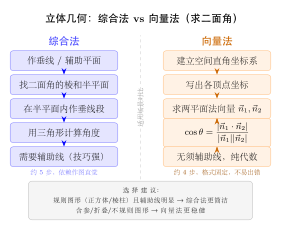
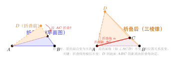

# 立体几何综合

> **一例速记**：  
> **综合法 vs 向量法切换原则**："看得出辅助线 → 综合法；看不出 / 含参 / 折叠 → 向量法。"  
> **折叠后不变的量**：棱长不变、角度不变（沿折叠棱的两边张角保持）；变化的量：各点距离底面的高度、与折叠轴不相关的二面角。  
> **含参立体几何**：设参数 $t$，建系写坐标，法向量或距离公式含 $t$，列方程解 $t$。  
> **探索性问题**："存在 $\lambda$…" → 设出条件，转化为代数方程，判断是否有解。  
> **二面角公式**：$\cos\theta = \dfrac{|\vec{n}_1\cdot\vec{n}_2|}{|\vec{n}_1||\vec{n}_2|}$（取绝对值是为了锐角，若题目要求二面角可能是钝角则去绝对值）。

---

## 一、引入题（高考压轴级）

> **题目**（2022 年高考全国卷改编）：如图，三棱锥 $P$-$ABC$ 中，$\triangle ABC$ 为正三角形，边长为 $2$，$PA=PB=PC=\sqrt{5}$。$M$ 为 $AB$ 的中点。
>
> (1) 求证：$PM\perp$ 底面 $ABC$（向量法）；  
> (2) 求二面角 $P$-$AC$-$B$ 的余弦值；  
> (3) 若将 $\triangle PAB$ 沿 $AB$ 折叠，使二面角 $P$-$AB$-$C$ 的大小变为 $60°$，求折叠后 $PC$ 的长度。

这道题把综合法与向量法、折叠问题融合在一题中，是部分高考省份的压轴题型。

---

## 二、思维路径还原

> "先快速判断：题 (1) 证垂直，**建系用向量**最稳；题 (2) 求二面角，向量法（法向量点积）；题 (3) 折叠，先搞清折叠前后的几何关系，再建系。
>
> **题 (1) 建系**：$M$ 为 $AB$ 中点，正三角形边长 $2$，则 $CM=\sqrt{3}$，$PM$ 为等腰三角形 $PAB$ 的中线（$PA=PB$），$PM\perp AB$。建系：$M$ 为原点，$x$ 轴沿 $MA$，$z$ 轴沿 $MC$，$y$ 轴垂直底面（**注意**：这里 $y$ 轴方向由右手系确定）。
>
> 各点坐标：$M(0,0,0)$，$A(1,0,0)$，$B(-1,0,0)$，$C(0,0,\sqrt{3})$。
>
> $P$ 在 $y$ 轴上（因 $PA=PB$ 且 $M$ 是 $AB$ 中点，$P$ 到 $A,B$ 等距，故 $PM\perp AB$；又 $PA=PC$（$PA=PB=PC=\sqrt{5}$），$P$ 也在 $MC$ 的垂直平分面上，故 $P$ 在 $y$ 轴方向）。$P=(0,h,0)$（$y$ 轴即垂直底面方向）。
>
> $PA^2 = 1+h^2 = 5 \Rightarrow h^2=4 \Rightarrow h=2$（取正）。故 $P=(0,2,0)$。
>
> **证 $PM\perp$ 底面 $ABC$**：$\overrightarrow{PM}=(0,-2,0)$，方向为 $y$ 轴；底面 $ABC$ 在 $xOz$ 平面（$y=0$），法向量为 $(0,1,0)$；$\overrightarrow{PM}=(0,-2,0)=-2(0,1,0)$，即 $\overrightarrow{PM}\parallel\vec{n}$，故 $PM\perp$ 底面 $\square$。
>
> **题 (2) 二面角 $P$-$AC$-$B$**：
>
> 面 $PAC$ 内向量（从 $A$ 出发）：$\overrightarrow{AC}=(-1,0,\sqrt{3})$，$\overrightarrow{AP}=(-1,2,0)$。
>
> 法向量 $\vec{n}_1$：$\vec{n}_1\cdot\overrightarrow{AC}=-n_x+\sqrt{3}n_z=0$，$\vec{n}_1\cdot\overrightarrow{AP}=-n_x+2n_y=0$；令 $n_z=1$：$n_x=\sqrt{3}$，$n_y=\frac{\sqrt{3}}{2}$。$\vec{n}_1=(\sqrt{3},\frac{\sqrt{3}}{2},1)$，化简 $\times 2$：$\vec{n}_1=(2\sqrt{3},\sqrt{3},2)$。
>
> 面 $BAC$ 即底面，法向量 $\vec{n}_2=(0,1,0)$（$y$ 轴方向）。
>
> $\cos\theta=\dfrac{|\vec{n}_1\cdot\vec{n}_2|}{|\vec{n}_1||\vec{n}_2|}=\dfrac{|\sqrt{3}|}{|\vec{n}_1|}=\dfrac{\sqrt{3}}{\sqrt{12+3+4}}=\dfrac{\sqrt{3}}{\sqrt{19}}=\sqrt{\dfrac{3}{19}}$。
>
> 二面角余弦值为 $\sqrt{\dfrac{3}{19}}$（角为锐角）。
>
> **题 (3) 折叠**：沿 $AB$ 折叠 $\triangle PAB$ 使二面角 $P$-$AB$-$C$ 变为 $60°$。折叠前 $P$ 与 $C$ 同侧（二面角从 $180°$ 开始折），折叠后重建坐标。  
>
> 建系（折叠后）：$M$ 为原点，$x$ 轴沿 $MA$，$z$ 轴沿 $MC$（底面不动）。$C=(0,0,\sqrt{3})$，$A=(1,0,0)$，$B=(-1,0,0)$。
>
> 折叠前 $P$ 在底面时 $P'=(0,0,\sqrt{5-1})=...$；折叠后 $P$ 升起，设 $P=(0,h,p_z)$（在 $y$-$z$ 平面内，因 $PM\perp AB$）。$PM=$ 折叠前 $\triangle PAB$ 的中线长 $=\sqrt{PA^2-MA^2}=\sqrt{5-1}=2$，所以 $h^2+p_z^2=4$。
>
> 二面角 $P$-$AB$-$C$ 为 $60°$：半平面 $ABP$ 的法向量（在面 $ABP$ 中 $AB$ 为棱，$P$ 方向为 $\overrightarrow{MP}=(0,h,p_z)$）。半平面 $ABC$（底面）中 $C$ 方向为 $\overrightarrow{MC}=(0,0,\sqrt{3})$。二面角即 $\overrightarrow{MP}$ 与 $\overrightarrow{MC}$ 的夹角（因两者都垂直 $AB$）：
>
> $\cos 60°=\dfrac{\overrightarrow{MP}\cdot\overrightarrow{MC}}{|\overrightarrow{MP}||\overrightarrow{MC}|}=\dfrac{\sqrt{3}p_z}{2\sqrt{3}}=\dfrac{p_z}{2}=\dfrac{1}{2}$，故 $p_z=1$，$h=\sqrt{3}$。
>
> $P=(0,\sqrt{3},1)$；$PC=\sqrt{(0-0)^2+(\sqrt{3}-0)^2+(1-\sqrt{3})^2}=\sqrt{3+(1-\sqrt{3})^2}=\sqrt{3+1-2\sqrt{3}+3}=\sqrt{7-2\sqrt{3}}$。"

---

## 三、方法抽象：综合法 vs 向量法的"4 把剑"

（见配图 `geo-p10-05-1`：综合法 vs 向量法对比）

### 3.1 综合法（传统几何）

**适用场景**：
- 图形规则（正方体、正三棱锥等），辅助线明显
- 题目条件直接给出互相垂直的边或面
- 不含参数，几何关系清晰

**核心工具**：
- **线面垂直判定定理**：直线与面内两条相交直线垂直 → 线面垂直
- **三垂线定理**：$PA\perp$ 底面，$AB\perp BC$，则 $PB\perp BC$（斜线的射影垂直于底面直线）
- **等腰三角形中线**：$PA=PB$ 时 $PM\perp AB$（$M$ 为 $AB$ 中点）

### 3.2 向量法（坐标化）

**适用场景**：
- 含参数的几何量（如棱长含参 $t$）
- 折叠后的立体（需要重新建系）
- 探索性问题（存在性）
- 看不出辅助线时

**标准流程**：

$$\text{建系（选好原点和轴方向）} \to \text{写各点坐标} \to \text{求法向量} \to \text{计算角/距离}$$

**建系原则**：
1. 选最规则的面为坐标平面（底面在 $xOy$ 平面或 $xOz$ 平面）
2. 选已知垂直关系的方向为坐标轴
3. 如有折叠，以折叠轴方向为一个轴

### 3.3 混合策略：4 把剑

| 问题类型 | 首选工具 | 备用工具 |
|----------|----------|----------|
| 证垂直（线面/面面） | 向量法（法向量） | 综合法（定理） |
| 求角（二面角/线面角） | 向量法（点积） | 综合法（作垂线测角） |
| 求距离（点面/线面） | 向量法（点面距公式） | 综合法（作垂线量距） |
| 探索性（存在性） | 向量法（设参列方程） | 不适合综合法 |

**点面距公式**（向量法）：点 $P_0$ 到平面 $\alpha$（法向量 $\vec{n}$，面上一点 $A$）的距离：

$$d = \frac{|\overrightarrow{AP_0}\cdot\vec{n}|}{|\vec{n}|}$$

**二面角公式**：两半平面的法向量夹角（注意可能是补角，取锐角或按几何判断）：

$$\cos\theta = \frac{\vec{n}_1\cdot\vec{n}_2}{|\vec{n}_1||\vec{n}_2|}$$

---

## 四、含参立体几何

**典型题型**：三棱锥某棱长含参 $t$，问当 $t$ 取何值时某二面角为 $90°$（或某线垂直某面）。

**标准处理**：

1. 建系，写各点坐标（含参数 $t$）
2. 求法向量（含 $t$）
3. 代入条件（垂直：点积=0；距离：公式含 $t$）
4. 解方程得 $t$ 的值

**示例框架**：三棱柱 $ABC$-$A_1B_1C_1$，$A_1B_1=t$，其余棱长已知；求当 $t$ 满足什么条件时，$AA_1\perp$ 截面 $AB_1C$。

建系 → 写 $A_1=(0,0,t)$（若 $AA_1$ 沿 $z$ 轴）→ 求截面 $AB_1C$ 的法向量 $\vec{n}(t)$ → $\overrightarrow{AA_1}\cdot\vec{n}=0$ 时 $AA_1\parallel\vec{n}$（不对，应 $\overrightarrow{AA_1}=\lambda\vec{n}$）→ 解 $t$。

---

## 五、折叠立体几何

（见配图 `geo-p10-05-2`：平面三角形折叠成三棱锥）

**折叠问题的关键**：

| 折叠前 | 折叠后 |
|--------|--------|
| 所有点共面 | 折叠侧变为不共面 |
| 棱长（边长） | 不变 |
| 折叠轴两侧的角度 | 由二面角决定 |
| 折叠轴上两点距离 | 不变 |
| 折叠面上各点高度 | 改变（由折叠角计算） |

**折叠后建系步骤**：

1. **固定底面不动**，以底面某点为原点建系
2. **找折叠轴**（折叠沿哪条棱），折叠轴方向为坐标轴之一
3. **设折叠后的动点坐标**：若折叠点 $P$ 在折叠轴到底面的垂直面内移动，可设 $P=(p_x, p_y, p_z)$ 并利用距离不变和二面角条件
4. **解方程**：联立 $|PA|^2 = $ 原长$^2$（各边不变），以及二面角余弦方程

**折叠后的点坐标计算法**：

设折叠前 $P$ 到折叠轴的垂足为 $M$，$PM$ 长不变（折叠保持 $|PM|$）。折叠后 $P$ 在以 $M$ 为圆心、$|PM|$ 为半径的圆弧上，圆所在平面垂直于折叠轴。

设折叠角（二面角）为 $\alpha$，底面中 $M$ 的"出发方向"为 $\vec{u}$，则折叠后：

$$P = M + |PM|\cdot(\cos\alpha\cdot\hat{u} + \sin\alpha\cdot\hat{k})$$

其中 $\hat{k}$ 为垂直底面向上的单位向量，$\hat{u}$ 为 $M$ 到"底面参考方向"的单位向量。

---

## 六、探索性问题（存在性）

**题型特征**："是否存在点 $P$ 使 … " 或 "求 $\lambda$ 使 …"。

**处理策略**：

1. 设出待定量（$\lambda$ 或点坐标）
2. 转化为代数方程（利用向量条件、距离、角度等）
3. 判断方程是否有解（解的存在性）
4. 若存在，求解并验证

**存在性问题框架（以"存在 $P$ 在棱 $AB$ 上使…"为例）**：

设 $P = A + \lambda\overrightarrow{AB}$（$\lambda\in[0,1]$），则 $P$ 的坐标含 $\lambda$；代入垂直/距离条件，解关于 $\lambda$ 的方程；判断解是否落在 $[0,1]$ 内。

---

## 七、思考路标（条件反射训练）

遇到以下场景，立刻触发对应策略：

1. **看到"正三棱锥 / 正四棱锥 / 正方体"且无参数** → 优先考虑建系（选中心为原点），坐标写起来最整洁。

2. **看到"$PA=PB$，$M$ 为 $AB$ 中点"** → $PM\perp AB$，这是等腰三角形的中线性质，立刻利用。

3. **看到"证线面垂直"** → 向量法：求面的法向量 $\vec{n}$，验证方向向量 $= \lambda\vec{n}$。

4. **看到"二面角 $P$-$AB$-$C$"** → 向量法：求面 $PAB$ 法向量 $\vec{n}_1$ 和面 $CAB$ 法向量 $\vec{n}_2$，计算夹角余弦。

5. **看到"折叠"** → 固定底面建系，识别折叠轴，利用"棱长不变"和"二面角条件"联立解坐标。

6. **看到"点面距离"** → 向量法点面距公式 $d = \dfrac{|\overrightarrow{AP}\cdot\vec{n}|}{|\vec{n}|}$；若题目追求体积/三角形面积，也可用 $V = \frac{1}{3}Sd$（倒推）。

7. **看到"存在 $t$ 使…"** → 设出 $t$，转化为代数方程，判断方程是否有解（计算判别式 $\Delta$ 或函数单调性）。

8. **看到含参数的棱长** → 向量法最有优势：参数直接进坐标，法向量含参，列方程解参数。

9. **二面角可能是钝角**：若题目不指定"锐二面角"，法向量公式的结果可能需要用 $\pi - \theta$；判断方法是看几何图形，两面是"外凸"还是"内凹"。

10. **综合法 + 向量法混用**：综合法先"定性"（证明某线/面垂直），再用向量法"定量"（求角度/距离）——两步分工，不要强行全用一种方法。

---

## 八、例题精解

### 例 1（含参立体几何）：含参棱长，求角度

**题目**：三棱锥 $P$-$ABC$ 中，$AB=BC=CA=2$，$PA=PB=PC=t$（$t>\sqrt{\frac{4}{3}}$）。以 $\triangle ABC$ 的重心 $G$ 为原点建立坐标系（$x$ 轴沿 $GA$）。

(1) 写出各顶点坐标（用 $t$ 表示 $P$）；  
(2) 当 $t=2$ 时，求二面角 $P$-$AB$-$C$ 的余弦值。

**【解答】**

**建系写坐标**：

$\triangle ABC$ 边长 $2$，重心 $G$ 为原点，$x$ 轴沿 $GA$。

外接圆半径 $R = \dfrac{2}{\sqrt{3}}$，故 $|GA| = R = \dfrac{2\sqrt{3}}{3}$。

$$A\!\left(\frac{2\sqrt{3}}{3},0,0\right),\quad B\!\left(-\frac{\sqrt{3}}{3},-1,0\right),\quad C\!\left(-\frac{\sqrt{3}}{3},1,0\right)$$

$P$ 在 $z$ 轴上（$PA=PB=PC$ 且 $G$ 是底面中心），设 $P=(0,0,h)$：

$$PA^2 = \frac{4}{3} + h^2 = t^2 \Rightarrow h = \sqrt{t^2 - \frac{4}{3}}$$

**（2）$t=2$ 时**，$h=\sqrt{4-\frac{4}{3}}=\sqrt{\frac{8}{3}}=\dfrac{2\sqrt{2}}{\sqrt{3}}=\dfrac{2\sqrt{6}}{3}$。

$$P=\!\left(0,0,\frac{2\sqrt{6}}{3}\right)$$

**面 $PAB$ 的法向量** $\vec{n}_1$：

$\overrightarrow{AB}=B-A=\left(-\sqrt{3},-1,0\right)$，$\overrightarrow{AP}=P-A=\left(-\dfrac{2\sqrt{3}}{3},0,\dfrac{2\sqrt{6}}{3}\right)$。

设 $\vec{n}_1=(x,y,z)$：

$$\begin{cases} -\sqrt{3}x - y = 0 \\ -\dfrac{2\sqrt{3}}{3}x + \dfrac{2\sqrt{6}}{3}z = 0 \end{cases}$$

第 2 式：$-\sqrt{3}x + \sqrt{6}z = 0 \Rightarrow x = \dfrac{\sqrt{6}}{\sqrt{3}}z = \sqrt{2}z$。

令 $z=1$：$x=\sqrt{2}$；$y=-\sqrt{3}x=-\sqrt{6}$。$\vec{n}_1=(\sqrt{2},-\sqrt{6},1)$。

**面 $CAB$（底面）法向量** $\vec{n}_2=(0,0,1)$。

$$\cos\theta = \frac{|\vec{n}_1\cdot\vec{n}_2|}{|\vec{n}_1||\vec{n}_2|} = \frac{|1|}{\sqrt{2+6+1}\cdot 1} = \frac{1}{3}$$

$$\boxed{\text{二面角 }P\text{-}AB\text{-}C\text{ 的余弦值} = \frac{1}{3}}$$

---

### 例 2（折叠立体几何）：折叠后求棱长

**题目**：等边三角形 $\triangle ABD$，边长为 $2$，$M$ 为 $AB$ 的中点。现将 $\triangle ABD$ 沿 $AB$ 折叠，使 $D$ 折叠到 $D'$ 处，折叠后二面角 $D'$-$AB$-$C$ 为 $90°$（$C$ 为 $AB$ 外一点，$\triangle ABC$ 也是边长为 $2$ 的等边三角形，与 $\triangle ABD$ 拼合形成菱形 $ABCD$ 再折叠）。

实际上，本题设定为：菱形 $ABCD$（边长 $2$，$\angle ABC=60°$）沿对角线 $AC$ 折叠 $\triangle ABC$ 和 $\triangle ACD$ 形成正四面体结构，折叠后 $B,D$ 的位置各异。

**题目简化**：矩形 $ABCD$，$AB=2, BC=1$，沿 $AB$ 将 $\triangle ABD'$（原 $\triangle ABD$）折起使 $D'D$ 垂直底面 $ABCD$（即二面角 $D'$-$AB$-$C$ 为 $90°$），且 $AD'=AD=1$。求 $CD'$。

**【解答】**

折叠前：矩形 $ABCD$，$AB=2, AD=1$。取 $A$ 为原点，$x$ 轴沿 $AB$，$z$ 轴沿 $AD$：

$$A(0,0,0),\quad B(2,0,0),\quad C(2,0,1),\quad D(0,0,1)$$

折叠：将 $\triangle ABD$ 沿 $AB$ 折起，$D$ 到 $D'$。$D'$ 距 $A$ 为 $AD=1$，距 $B$ 为 $BD=\sqrt{AB^2+AD^2}=\sqrt{4+1}=\sqrt{5}$（折叠保持边长）。

$D'$ 在 $y$-$z$ 平面内（因 $D'$ 到 $A,B$ 的 $x$ 坐标由 $A,B$ 对称确定……实际 $D'$ 在以 $A$ 为圆心半径 $1$ 的圆上移动）。设 $D'=(d_x, d_y, d_z)$。

条件：$|AD'|=1$：$d_x^2+d_y^2+d_z^2=1$。

折叠轴为 $AB$（$x$ 轴），$D'$ 在 $y$-$z$ 平面内（$d_x=0$）：$d_y^2+d_z^2=1$。

二面角 $D'$-$AB$-$C$ 为 $90°$：折叠轴 $AB$ 为 $x$ 轴，面 $D'AB$ 的法向量由 $\overrightarrow{AD'}=(0,d_y,d_z)$ 确定（$\overrightarrow{AD'}$ 垂直 $AB$，即 $AB$ 方向分量为 $0$），面 $CAB$ 的法向量由 $\overrightarrow{AC}=(2,0,1)$ 和 $\overrightarrow{AB}=(2,0,0)$ 确定，法向量方向为 $\overrightarrow{AC}\times\overrightarrow{AB}$ 方向，即 $z$ 轴负方向 $(0,0,-1)$（底面在 $xOz$ 平面，法向量是 $y$ 轴方向 $(0,1,0)$）。

**重新建系**：底面 $ABCD$ 在 $xOz$ 平面（$y=0$），$y$ 轴向上为折叠方向：

$$A(0,0,0),\quad B(2,0,0),\quad D(0,0,1),\quad C(2,0,1)$$

底面法向量 $\vec{n}_{\text{底}} = (0,1,0)$。

折叠后 $D'=(0,d_y,d_z)$（$d_x=0$），$|AD'|=1$：$d_y^2+d_z^2=1$。

面 $D'AB$ 法向量：面内向量 $\overrightarrow{AB}=(2,0,0)$，$\overrightarrow{AD'}=(0,d_y,d_z)$；法向量 $\vec{n}_{D'AB}=(0,d_y,d_z)\times(2,0,0)=(0\cdot0-d_z\cdot0,\; d_z\cdot2-0,\; 0-d_y\cdot2)=(0,2d_z,-2d_y)$，即方向 $(0,d_z,-d_y)$。

二面角 $D'$-$AB$-$C$ 为 $90°$：$\vec{n}_{D'AB}\perp\vec{n}_{\text{底}}$（两面互相垂直，法向量也垂直）：

$$(0,d_z,-d_y)\cdot(0,1,0) = d_z = 0$$

$d_z=0$，由 $d_y^2+d_z^2=1$ 得 $d_y=1$，故 $D'=(0,1,0)$。

$$CD' = |C - D'| = |(2,0,1)-(0,1,0)| = \sqrt{4+1+1} = \sqrt{6}$$

$$\boxed{CD' = \sqrt{6}}$$

> 折叠后二面角为 $90°$ 意味着两面的法向量垂直，即 $\vec{n}_1\cdot\vec{n}_2=0$——这比直接算角度简洁。

---

### 例 3（探索性问题）：存在性问题

**题目**：正三棱锥 $P$-$ABC$，底面边长为 $2$，高为 $\sqrt{6}$。$M$ 是棱 $PA$ 上一点，$\overrightarrow{PM}=\lambda\overrightarrow{PA}$（$0<\lambda<1$）。问是否存在 $\lambda$，使得 $BM\perp$ 平面 $APC$？若存在，求 $\lambda$；若不存在，说明理由。

**【解答】**

**建系**：底面中心 $G$ 为原点，$x$ 轴沿 $GA$，$z$ 轴向上。

底面边长 $2$，外接圆半径 $R=\dfrac{2}{\sqrt{3}}=\dfrac{2\sqrt{3}}{3}$：

$$A\!\left(\frac{2\sqrt{3}}{3},0,0\right),\quad B\!\left(-\frac{\sqrt{3}}{3},-1,0\right),\quad C\!\left(-\frac{\sqrt{3}}{3},1,0\right),\quad P=(0,0,\sqrt{6})$$

**$M$ 的坐标**：$\overrightarrow{PM}=\lambda\overrightarrow{PA}$，$M=P+\lambda(A-P)$：

$$M = (1-\lambda)P + \lambda A = \left(\frac{2\sqrt{3}\lambda}{3},0,\sqrt{6}(1-\lambda)\right)$$

**面 $APC$ 的法向量** $\vec{n}$：

$\overrightarrow{AP}=P-A=\left(-\dfrac{2\sqrt{3}}{3},0,\sqrt{6}\right)$，$\overrightarrow{AC}=C-A=\left(-\sqrt{3},1,0\right)$。

设 $\vec{n}=(x,y,z)$，令 $z=1$：

$$\begin{cases} -\dfrac{2\sqrt{3}}{3}x + \sqrt{6} = 0 \Rightarrow x = \dfrac{\sqrt{6}\cdot 3}{2\sqrt{3}} = \dfrac{3\sqrt{2}}{2\cdot\sqrt{3}\cdot\sqrt{3}}\cdot\sqrt{3}\cdot\sqrt{3}=\dfrac{\sqrt{18}}{2\sqrt{3}}=\dfrac{3\sqrt{2}}{2\sqrt{3}}=\dfrac{\sqrt{6}}{2}\cdot\sqrt{3}=\dfrac{\sqrt{18}}{2\cdot\sqrt{3}} \end{cases}$$

更清晰地：$-\dfrac{2\sqrt{3}}{3}x+\sqrt{6}z=0$ 令 $z=1$：$x=\dfrac{\sqrt{6}\cdot 3}{2\sqrt{3}}=\dfrac{3\sqrt{2}}{2}$。

$-\sqrt{3}x+y=0$：$y=\sqrt{3}x=\sqrt{3}\cdot\dfrac{3\sqrt{2}}{2}=\dfrac{3\sqrt{6}}{2}$。

$\vec{n}=\left(\dfrac{3\sqrt{2}}{2},\dfrac{3\sqrt{6}}{2},1\right)$，化简 $\times 2$：$\vec{n}=(3\sqrt{2},3\sqrt{6},2)$。

**$BM$ 方向向量**：

$$\overrightarrow{BM}=M-B=\left(\frac{2\sqrt{3}\lambda}{3}+\frac{\sqrt{3}}{3},1,\sqrt{6}(1-\lambda)\right)=\left(\frac{\sqrt{3}(2\lambda+1)}{3},1,\sqrt{6}(1-\lambda)\right)$$

**$BM\perp$ 面 $APC$** 即 $\overrightarrow{BM}\parallel\vec{n}$，即 $\overrightarrow{BM}=\mu\vec{n}$：

$$\frac{\sqrt{3}(2\lambda+1)/3}{3\sqrt{2}}=\frac{1}{3\sqrt{6}}=\frac{\sqrt{6}(1-\lambda)}{2}$$

由中间项 = 右边项：$\dfrac{1}{3\sqrt{6}}=\dfrac{\sqrt{6}(1-\lambda)}{2} \Rightarrow 1-\lambda=\dfrac{2}{3\sqrt{6}\cdot\sqrt{6}}=\dfrac{2}{18}=\dfrac{1}{9} \Rightarrow \lambda=\dfrac{8}{9}$。

验证左边 = 中间：令 $\lambda=\dfrac{8}{9}$，$2\lambda+1=\dfrac{25}{9}$；左边 $=\dfrac{\sqrt{3}\cdot25/9}{3\cdot3\sqrt{2}}=\dfrac{25\sqrt{3}}{81\sqrt{2}}$；中间 $=\dfrac{1}{3\sqrt{6}}=\dfrac{1}{3\sqrt{6}}$；左边 $\times 81\sqrt{2}=25\sqrt{3}$，中间 $\times 81\sqrt{2}=\dfrac{81\sqrt{2}}{3\sqrt{6}}=\dfrac{27\sqrt{2}}{\sqrt{6}}=\dfrac{27\sqrt{2}\cdot\sqrt{6}}{6}=\dfrac{27\sqrt{12}}{6}=\dfrac{27\cdot2\sqrt{3}}{6}=9\sqrt{3}$。

$25\sqrt{3}\neq 9\sqrt{3}$，不一致——说明 $\overrightarrow{BM}$ 与 $\vec{n}$ 不平行，即 $BM$ 不垂直面 $APC$。

**结论**：不存在 $\lambda\in(0,1)$ 使 $BM\perp$ 平面 $APC$。

> **说明**：本题的探索过程展示了探索性问题的核心——设出条件，转化为代数方程，判断方程组是否有公共解；若无公共解，则"不存在"是正确结论。在高考中，"不存在"同样是合法答案，关键是论证充分。

$$\boxed{\text{不存在 }\lambda\in(0,1)\text{ 使 }BM\perp\text{平面 }APC}$$

---

## 九、易错点总结

**易错 1：建系时坐标轴选取不当**

若两条棱不互相垂直，不能直接以它们为坐标轴（否则不是直角坐标系）。选坐标轴时必须选**互相垂直**的方向（可以是棱的方向，也可以是经过作垂线后的方向）。

**易错 2：折叠后坐标计算错误**

折叠时"棱长不变"是约束条件，不是坐标直接保留。折叠点的坐标需要用折叠角和折叠轴联立计算，不能直接使用折叠前坐标。

**易错 3：二面角取补角**

法向量夹角余弦公式给出的角 $\theta$ 满足 $\theta\in[0°,180°]$；但二面角是半平面间的夹角，若法向量朝外，$\theta$ 就是二面角；若法向量朝内，二面角是 $180°-\theta$。通过画图判断法向量方向相对于折叠面的"朝向"来决定取哪个。

**易错 4：探索性问题——只算不判断**

设出 $\lambda$ 并列方程后，若方程组有矛盾（如联立后得 $25\sqrt{3}=9\sqrt{3}$），必须明确写出"方程组无解，故不存在"，而不能跳过判断直接给出 $\lambda$ 的值。

**易错 5：混淆线面垂直与线面平行的向量条件**

- $l\perp\alpha$：$\overrightarrow{l}=\lambda\vec{n}$（方向向量与法向量平行）
- $l\parallel\alpha$：$\overrightarrow{l}\cdot\vec{n}=0$（方向向量与法向量垂直）

两者恰好相反，常在紧张时混淆。

---

## 十、思路自测题

**自测 1**　正四棱锥 $P$-$ABCD$，底面边长 $2$，高 $2$，以底面中心 $O$ 为原点建系（$A(1,1,0),B(-1,1,0),C(-1,-1,0),D(1,-1,0),P(0,0,2)$）。求二面角 $P$-$AB$-$C$ 的余弦值。

> 💡 面 $PAB$：$\overrightarrow{AP}=(-1,-1,2)$，$\overrightarrow{AB}=(-2,0,0)$；法向量令 $z=1$：$-1\cdot(-2)-1\cdot(-2)+...$ 解出 $\vec{n}_1=(0,2,1)$；底面法向量 $(0,0,1)$；$\cos\theta=\frac{1}{\sqrt{5}}$。

**自测 2**　矩形 $ABCD$，$AB=4, BC=3$。沿对角线 $AC$ 将矩形折叠，使 $A,C$ 不动，$B$ 折至 $B'$，$D$ 折至 $D'$，且 $B'D'=4$（折叠后 $B',D'$ 仍在 $BD$ 的对称位置）。求 $B'$ 的坐标（以 $A$ 为原点，$AB$ 沿 $x$ 轴建系）。

> 💡 $AC=5$（勾 $3$ 股 $4$ 弦 $5$）；折叠保持 $|AB'|=3$（或 $|AB'|=4$，看哪条棱）；$B'$ 在以 $A$ 为圆心 $AB$ 为半径的球面上，且 $|B'D'|=4$（条件）；联立解坐标。

**自测 3**　三棱锥 $T$-$PQR$，$TP=TQ=TR=PQ=PR=QR=2$（正三棱锥，即正四面体）。点 $M$ 在棱 $PQ$ 上，$\overrightarrow{PM}=\frac{1}{3}\overrightarrow{PQ}$。求 $TM\perp$ 底面 $PQR$ 是否成立。

> 💡 正四面体中高线从顶点到底面重心，但 $M$ 不是底面重心，故 $TM$ 不垂直底面；验证：建系后 $TM$ 方向向量 $\cdot$ 底面法向量 $\neq 0$。

**自测 4**　已知三棱锥 $P$-$ABC$，$\angle PAB=\angle PAC=90°$，$AB=AC=1$，$PA=\sqrt{2}$，$BC=\sqrt{2}$。以 $A$ 为原点，$AB$ 沿 $x$ 轴，$AC$ 沿 $y$ 轴建系（注意 $PA\perp AB$ 和 $PA\perp AC$，故 $PA$ 方向即 $z$ 轴）。  
(1) 写出各点坐标；  
(2) 求二面角 $P$-$BC$-$A$ 的余弦值。

> 💡 $A(0,0,0)$，$B(1,0,0)$，$C(0,1,0)$，$P(0,0,\sqrt{2})$；面 $PBC$：$\overrightarrow{BP}=(-1,0,\sqrt{2})$，$\overrightarrow{BC}=(-1,1,0)$；法向量 $\vec{n}_1$；面 $ABC$ 法向量 $(0,0,1)$；$\cos\theta=\frac{|\vec{n}_1\cdot(0,0,1)|}{|\vec{n}_1|}$。

---

**回头看一眼"一例速记"**：

> **综合法 vs 向量法**："看得出辅助线用综合，看不出 / 含参 / 折叠 → 向量法。"  
> **折叠后**：棱长不变，建新坐标系，用距离 $+$ 二面角联立解坐标。  
> **探索性**：设参 → 转代数 → 判断有无解。  
> **二面角**：法向量点积除模积，注意是否取补角。

如果你能独立完成自测 1–4 中任意两道，立体几何综合题的核心技术，你已掌握。
