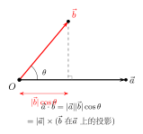
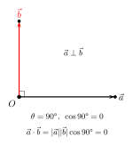

# 平面向量的数量积

> **一例速记**：  
> **数量积定义**：$\vec{a} \cdot \vec{b} = |\vec{a}||\vec{b}|\cos\theta$（$\theta$ 是夹角，$0 \leq \theta \leq \pi$）  
> **坐标公式**：$\vec{a} = (x_1, y_1),\ \vec{b} = (x_2, y_2)$ → $\vec{a} \cdot \vec{b} = x_1 x_2 + y_1 y_2$  
> **三大用途**：  
> ① 求夹角 $\cos\theta = \dfrac{\vec{a}\cdot\vec{b}}{|\vec{a}||\vec{b}|}$  
> ② 判垂直 $\vec{a} \perp \vec{b} \Leftrightarrow \vec{a}\cdot\vec{b} = 0$  
> ③ 求投影 $\vec{b}$ 在 $\vec{a}$ 上的投影 $= \dfrac{\vec{a}\cdot\vec{b}}{|\vec{a}|}$

---

## 一、引入：计算数量积、模长与夹角

> **题目**：已知 $\vec{a} = (3, 4)$，$\vec{b} = (1, -2)$，求 $\vec{a}\cdot\vec{b}$、$|\vec{a}|$、$|\vec{b}|$ 以及夹角余弦值。

拿到这道题，先别急——$\vec{a}$ 和 $\vec{b}$ 都以坐标形式给出，这意味着三件事可以直接用公式逐一完成：坐标点积算出数量积，模长公式算出 $|\vec{a}|$ 和 $|\vec{b}|$，最后再用夹角公式。

---

## 二、思维路径还原（解题者的内心独白）

> "题目给了两个向量的坐标，我的目标是依次求出数量积、两个模长和夹角余弦值。
>
> **第一步：算数量积。** 坐标点积公式：对应分量相乘再相加。
>
> $$\vec{a}\cdot\vec{b} = 3 \times 1 + 4 \times (-2) = 3 - 8 = -5$$
>
> 结果是负数——说明夹角 $\theta$ 是钝角（$\cos\theta < 0$，$\theta \in (90°, 180°]$）。这是一个重要的"符号判断"，先记下来。
>
> **第二步：算模长。** 分别对 $\vec{a}$、$\vec{b}$ 用 $|\vec{v}| = \sqrt{x^2 + y^2}$：
>
> $$|\vec{a}| = \sqrt{3^2 + 4^2} = \sqrt{9 + 16} = \sqrt{25} = 5$$
>
> $$|\vec{b}| = \sqrt{1^2 + (-2)^2} = \sqrt{1 + 4} = \sqrt{5}$$
>
> **第三步：算夹角余弦。** 把前两步的结果代入夹角公式：
>
> $$\cos\theta = \frac{\vec{a}\cdot\vec{b}}{|\vec{a}||\vec{b}|} = \frac{-5}{5\sqrt{5}} = \frac{-1}{\sqrt{5}} = -\frac{\sqrt{5}}{5}$$
>
> **检验直觉：** $\cos\theta = -\dfrac{\sqrt{5}}{5} \approx -0.447$，对应 $\theta \approx 116.6°$，是钝角，与第一步"数量积为负"的判断吻合 ✓。
>
> **关键反射：** 坐标形式 → 三步走：① 点积（对应乘加）② 模长（平方和开根）③ 夹角（商）。每步都是独立的计算，先做完再代入，不要混在一起算。
>
> **延伸思考：** 如果我要求 $\vec{b}$ 在 $\vec{a}$ 方向上的投影（即 $\vec{a}$ 方向的分量），用投影公式：
>
> $$\text{投影} = \frac{\vec{a}\cdot\vec{b}}{|\vec{a}|} = \frac{-5}{5} = -1$$
>
> 负值说明 $\vec{b}$ 在 $\vec{a}$ 方向上的分量反向（夹角为钝角时投影为负）。"

把这段内心独白读两遍，感受"点积 $\to$ 模长 $\to$ 夹角"的三步节奏。

---

## 三、公式全览

### 3.1 五大公式

**定义式（几何形式）**：

$$\vec{a} \cdot \vec{b} = |\vec{a}||\vec{b}|\cos\theta \qquad (0 \leq \theta \leq \pi)$$

（见配图 `geo-p2-01-1`：夹角与几何意义）

**坐标公式**：

$$\vec{a} = (x_1, y_1),\ \vec{b} = (x_2, y_2) \implies \vec{a} \cdot \vec{b} = x_1 x_2 + y_1 y_2$$

**模长公式**（数量积的特例，$\vec{a} = \vec{b}$）：

$$|\vec{a}|^2 = \vec{a} \cdot \vec{a} = x_1^2 + y_1^2 \implies |\vec{a}| = \sqrt{x_1^2 + y_1^2}$$

**夹角公式**：

$$\cos\theta = \frac{\vec{a}\cdot\vec{b}}{|\vec{a}||\vec{b}|} = \frac{x_1 x_2 + y_1 y_2}{\sqrt{x_1^2+y_1^2}\,\sqrt{x_2^2+y_2^2}}$$

**投影公式**（$\vec{b}$ 在 $\vec{a}$ 上的投影）：

$$\text{proj}_{\vec{a}}\vec{b} = |\vec{b}|\cos\theta = \frac{\vec{a}\cdot\vec{b}}{|\vec{a}|}$$

### 3.2 运算性质

| 性质 | 公式 |
|------|------|
| 交换律 | $\vec{a}\cdot\vec{b} = \vec{b}\cdot\vec{a}$ |
| 分配律 | $\vec{a}\cdot(\vec{b}+\vec{c}) = \vec{a}\cdot\vec{b} + \vec{a}\cdot\vec{c}$ |
| 数乘结合 | $(\lambda\vec{a})\cdot\vec{b} = \lambda(\vec{a}\cdot\vec{b})$ |
| 自积 | $\vec{a}\cdot\vec{a} = |\vec{a}|^2 \geq 0$，等号当且仅当 $\vec{a} = \vec{0}$ |

**注意：数量积不满足结合律！** 即一般地 $(\vec{a}\cdot\vec{b})\vec{c} \neq \vec{a}(\vec{b}\cdot\vec{c})$。

原因：左边 $(\vec{a}\cdot\vec{b})$ 是一个**数**，乘以向量 $\vec{c}$ 得向量；右边 $(\vec{b}\cdot\vec{c})$ 是一个**数**，乘以向量 $\vec{a}$ 方向未必相同。这个"形式上像结合律但其实不是"的陷阱，高考中常出现。

### 3.3 垂直判定

$$\vec{a} \perp \vec{b} \Longleftrightarrow \vec{a}\cdot\vec{b} = 0 \Longleftrightarrow x_1 x_2 + y_1 y_2 = 0$$

（见配图 `geo-p2-01-2`：垂直情形）

---

## 四、方法变形：三种典型拓展

### 4.1 含参的垂直条件解参

**场景**：给定含参向量，条件为垂直，列方程求参数。

**步骤**：写出 $\vec{a}\cdot\vec{b} = 0$ 的坐标表达，化为关于参数的代数方程，求解。

**示例**：若 $\vec{a} = (2, \lambda)$，$\vec{b} = (3, -1)$，且 $\vec{a} \perp \vec{b}$，求 $\lambda$。

$$\vec{a}\cdot\vec{b} = 2\times3 + \lambda\times(-1) = 6 - \lambda = 0 \implies \lambda = 6$$

### 4.2 模长展开公式

利用 $|\vec{a}|^2 = \vec{a}\cdot\vec{a}$，得到：

$$|\vec{a} + \vec{b}|^2 = (\vec{a}+\vec{b})\cdot(\vec{a}+\vec{b}) = |\vec{a}|^2 + 2\vec{a}\cdot\vec{b} + |\vec{b}|^2$$

$$|\vec{a} - \vec{b}|^2 = |\vec{a}|^2 - 2\vec{a}\cdot\vec{b} + |\vec{b}|^2$$

**用途**：已知两向量模长和夹角，求向量和（差）的模长；或反过来，由模长关系求数量积。

### 4.3 极化恒等式

$$\vec{a}\cdot\vec{b} = \frac{1}{4}\left(|\vec{a}+\vec{b}|^2 - |\vec{a}-\vec{b}|^2\right)$$

**推导**：对 $|\vec{a}+\vec{b}|^2 = |\vec{a}|^2 + 2\vec{a}\cdot\vec{b} + |\vec{b}|^2$ 和 $|\vec{a}-\vec{b}|^2 = |\vec{a}|^2 - 2\vec{a}\cdot\vec{b} + |\vec{b}|^2$ 相减，除以 4 即得。

**用途**：当题目给出 $|\vec{a}+\vec{b}|$ 和 $|\vec{a}-\vec{b}|$ 时（如已知对角线长的平行四边形），可直接求 $\vec{a}\cdot\vec{b}$，进而求夹角。

---

## 五、思考路标（条件反射训练）

下面每条都要反复内化，遇到对应场景立刻触发：

1. **看到"求夹角"** → 立刻想夹角公式 $\cos\theta = \dfrac{\vec{a}\cdot\vec{b}}{|\vec{a}||\vec{b}|}$。先算坐标点积，再算两模长，最后商。不要跳步。

2. **看到"判断垂直"** → 验 $\vec{a}\cdot\vec{b} = 0$，即 $x_1 x_2 + y_1 y_2 = 0$。坐标形式直接列等式，不需要求模长。

3. **看到"求投影"** → 分清是哪个向量投影到哪个方向。$\vec{b}$ 在 $\vec{a}$ 上的投影 $= \dfrac{\vec{a}\cdot\vec{b}}{|\vec{a}|}$（注意分母是 $\vec{a}$ 的模）。

4. **看到模长平方 $|\vec{a}|^2$** → 改写为 $\vec{a}\cdot\vec{a}$，这是将代数（模长）与向量运算（数量积）互转的关键桥梁。

5. **看到 $|\vec{a}\pm\vec{b}|$ 或其平方** → 展开 $|\vec{a}+\vec{b}|^2 = |\vec{a}|^2 + 2\vec{a}\cdot\vec{b} + |\vec{b}|^2$，找到数量积。

6. **看到含参向量的垂直条件** → $\vec{a}\cdot\vec{b} = 0$ 列方程，直接解出参数。

7. **数量积的符号判断**：$\vec{a}\cdot\vec{b} > 0 \Leftrightarrow \theta$ 为锐角；$\vec{a}\cdot\vec{b} = 0 \Leftrightarrow \theta = 90°$；$\vec{a}\cdot\vec{b} < 0 \Leftrightarrow \theta$ 为钝角。

8. **交换律可用，结合律不可用**：$\vec{a}\cdot\vec{b} = \vec{b}\cdot\vec{a}$ 成立；但 $(\vec{a}\cdot\vec{b})\vec{c} \neq \vec{a}(\vec{b}\cdot\vec{c})$ 一般不成立——结果一个有方向，一个方向不同。

9. **极化恒等式触发时机**：题目同时给出两条对角线长（或 $|\vec{a}+\vec{b}|$、$|\vec{a}-\vec{b}|$），想到极化恒等式直接求 $\vec{a}\cdot\vec{b}$。

10. **向量不是数**：$\vec{a}\cdot\vec{b}$ 的结果是数（标量），不是向量；$(\vec{a}\cdot\vec{b})$ 后面只能做数的运算，不能再做向量点积。

---

## 六、应用例题

### 例 1：求夹角

**题目**：已知 $\vec{a} = (2, -1)$，$\vec{b} = (1, \sqrt{3})$，求 $\vec{a}$ 与 $\vec{b}$ 的夹角 $\theta$。

**【解答】**

**第一步：计算数量积。**

$$\vec{a}\cdot\vec{b} = 2\times1 + (-1)\times\sqrt{3} = 2 - \sqrt{3}$$

**第二步：计算模长。**

$$|\vec{a}| = \sqrt{4+1} = \sqrt{5},\quad |\vec{b}| = \sqrt{1+3} = 2$$

**第三步：求夹角余弦。**

$$\cos\theta = \frac{2-\sqrt{3}}{2\sqrt{5}} = \frac{2-\sqrt{3}}{2\sqrt{5}} \cdot \frac{\sqrt{5}}{\sqrt{5}} = \frac{(2-\sqrt{3})\sqrt{5}}{10}$$

数值上 $2 - \sqrt{3} \approx 0.268$，$\cos\theta \approx \dfrac{0.268\times2.236}{10} \approx 0.060$，故 $\theta \approx 86.6°$（锐角）。

$$\boxed{\cos\theta = \frac{(2-\sqrt{3})\sqrt{5}}{10}}$$

> 解题要点：三步不跳。数量积、模长各自算清楚，最后再除。不要边算模长边算夹角，容易出错。

---

### 例 2：含参垂直求参数

**题目**：已知 $\vec{m} = (1+\lambda, 2)$，$\vec{n} = (1, \lambda - 1)$，且 $\vec{m} \perp \vec{n}$，求 $\lambda$。

**【解答】**

$\vec{m} \perp \vec{n}$ 等价于 $\vec{m}\cdot\vec{n} = 0$：

$$\vec{m}\cdot\vec{n} = (1+\lambda)\times1 + 2\times(\lambda-1) = 1+\lambda + 2\lambda - 2 = 3\lambda - 1 = 0$$

$$\lambda = \frac{1}{3}$$

**验证**：$\vec{m} = \left(\dfrac{4}{3}, 2\right)$，$\vec{n} = \left(1, -\dfrac{2}{3}\right)$，$\vec{m}\cdot\vec{n} = \dfrac{4}{3} - \dfrac{4}{3} = 0$ ✓。

$$\boxed{\lambda = \dfrac{1}{3}}$$

> 解题要点："判垂直 → 点积为零"，列方程解参数，最后代入验证。

---

### 例 3：投影与模长展开综合

**题目**：已知 $|\vec{a}| = 2$，$|\vec{b}| = 3$，$\vec{a}$ 与 $\vec{b}$ 的夹角 $\theta = 60°$，求：  
(1) $\vec{a}\cdot\vec{b}$；  
(2) $\vec{b}$ 在 $\vec{a}$ 方向上的投影；  
(3) $|\vec{a} + \vec{b}|$；  
(4) $|\vec{a} - \vec{b}|$。

**【解答】**

**(1)** 直接用定义：

$$\vec{a}\cdot\vec{b} = |\vec{a}||\vec{b}|\cos 60° = 2\times3\times\frac{1}{2} = 3$$

**(2)** 投影 $= \dfrac{\vec{a}\cdot\vec{b}}{|\vec{a}|} = \dfrac{3}{2}$。

**(3)** 模长展开：

$$|\vec{a}+\vec{b}|^2 = |\vec{a}|^2 + 2\vec{a}\cdot\vec{b} + |\vec{b}|^2 = 4 + 6 + 9 = 19$$

$$|\vec{a}+\vec{b}| = \sqrt{19}$$

**(4)** 模长展开：

$$|\vec{a}-\vec{b}|^2 = |\vec{a}|^2 - 2\vec{a}\cdot\vec{b} + |\vec{b}|^2 = 4 - 6 + 9 = 7$$

$$|\vec{a}-\vec{b}| = \sqrt{7}$$

$$\boxed{\vec{a}\cdot\vec{b}=3,\quad \text{投影}=\dfrac{3}{2},\quad |\vec{a}+\vec{b}|=\sqrt{19},\quad |\vec{a}-\vec{b}|=\sqrt{7}}$$

> 解题要点：(1) 定义式直接代；(2) 投影公式分母是 $|\vec{a}|$；(3)(4) 模长展开公式，点积已在 (1) 求出，直接代入。

---

## 七、思路自测题

**自测 1**　已知 $\vec{a} = (-3, 4)$，$\vec{b} = (2, 1)$，求 $\vec{a}\cdot\vec{b}$、$|\vec{a}|$、$|\vec{b}|$ 和夹角 $\theta$（精确到度）。

> 💡 提示：$\vec{a}\cdot\vec{b} = -6+4=-2$，$|\vec{a}|=5$，$|\vec{b}|=\sqrt{5}$，$\cos\theta = \dfrac{-2}{5\sqrt{5}} = -\dfrac{2\sqrt{5}}{25}$，$\theta \approx 100.3°$（钝角）。

**自测 2**　已知 $\vec{u} = (\lambda, 3)$ 与 $\vec{v} = (2, \lambda + 1)$ 垂直，求 $\lambda$。

> 💡 提示：$\vec{u}\cdot\vec{v} = 2\lambda + 3(\lambda+1) = 5\lambda + 3 = 0$，$\lambda = -\dfrac{3}{5}$。

**自测 3**　已知 $|\vec{a}| = 1$，$|\vec{b}| = 2$，$|\vec{a}+\vec{b}| = \sqrt{7}$，求 $\vec{a}$ 与 $\vec{b}$ 的夹角。

> 💡 提示：$|\vec{a}+\vec{b}|^2 = 1 + 2\vec{a}\cdot\vec{b} + 4 = 7$，故 $\vec{a}\cdot\vec{b} = 1$。$\cos\theta = \dfrac{1}{1\times2} = \dfrac{1}{2}$，$\theta = 60°$。

**自测 4**　已知 $\vec{a} = (3, 4)$，求 $\vec{a}$ 在 $\vec{e}_1 = (1, 0)$ 方向上的投影，并与 $\vec{a}$ 的 $x$ 分量对比。

> 💡 提示：投影 $= \dfrac{\vec{a}\cdot\vec{e}_1}{|\vec{e}_1|} = \dfrac{3}{1} = 3$，恰好等于 $\vec{a}$ 的 $x$ 分量。这说明坐标分量就是向量在坐标轴方向上的投影。

**自测 5**　已知 $|\vec{a}| = \sqrt{2}$，$|\vec{b}| = 1$，$\vec{a}\cdot\vec{b} = 1$，用极化恒等式求 $|\vec{a}+\vec{b}|^2 - |\vec{a}-\vec{b}|^2$，并验证。

> 💡 提示：$|\vec{a}+\vec{b}|^2 - |\vec{a}-\vec{b}|^2 = 4\vec{a}\cdot\vec{b} = 4$。验证：$|\vec{a}+\vec{b}|^2 = 2+2+1=5$，$|\vec{a}-\vec{b}|^2=2-2+1=1$，差 $= 4$ ✓。

---

**回头看一眼"一例速记"**：

> $\vec{a}\cdot\vec{b} = |\vec{a}||\vec{b}|\cos\theta$；坐标：$x_1 x_2 + y_1 y_2$。  
> 求夹角 → 先算点积和模长再相除；  
> 判垂直 → 点积为零；  
> 求投影 → 点积除以基准向量模长。

如果现在你能不看笔记，独立完成引入题（$\vec{a}=(3,4)$，$\vec{b}=(1,-2)$，求点积、模长、余弦）并说出三大用途——本章，你拿下了。
