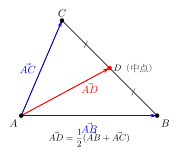
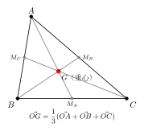

# 向量在三角形中的应用

> **一例速记**：  
> **三点共线**：$A, B, C$ 共线 $\Leftrightarrow$ $\vec{OC} = \lambda\vec{OA} + (1-\lambda)\vec{OB}$（$\lambda \in \mathbb{R}$，$O$ 为任意参考点，不在该直线上）  
> **中点公式**：$M$ 是 $BC$ 中点 $\Rightarrow$ $\vec{OM} = \dfrac{1}{2}(\vec{OB}+\vec{OC})$  
> **重心公式**：$G$ 是 $\triangle ABC$ 重心 $\Rightarrow$ $\vec{OG} = \dfrac{1}{3}(\vec{OA}+\vec{OB}+\vec{OC})$  
> **分点比**：$AP:PB = m:n$ $\Rightarrow$ $\vec{OP} = \dfrac{n}{m+n}\vec{OA} + \dfrac{m}{m+n}\vec{OB}$

---

## 一、引入：用已知向量表示中线

> **题目**：在 $\triangle ABC$ 中，$D$ 是 $BC$ 的中点，用 $\vec{AB}$ 和 $\vec{AC}$ 表示 $\vec{AD}$。

这是"向量在三角形中应用"的最基础题型——用两条已知边向量表示一条待求向量。核心技巧是：找一条经过三角形内部连接起点与终点的向量路径，拆成已知分段。

---

## 二、思维路径还原（解题者的内心独白）

> "目标：用 $\vec{AB}$、$\vec{AC}$ 表示 $\vec{AD}$，其中 $D$ 是 $BC$ 中点。
>
> **第一步：选路径。** $A$ 是起点，$D$ 是终点，直接走 $\overrightarrow{AD}$ 不知道。但我可以"绕路"：先从 $A$ 到 $B$，再从 $B$ 到 $D$。
>
> $$\vec{AD} = \vec{AB} + \vec{BD}$$
>
> **第二步：表示 $\vec{BD}$。** $D$ 是 $BC$ 中点，所以 $\vec{BD} = \dfrac{1}{2}\vec{BC}$。
>
> **第三步：表示 $\vec{BC}$。** $\vec{BC} = \vec{AC} - \vec{AB}$（三角形中最常用的转换：$\vec{BC} = \vec{BA} + \vec{AC} = -\vec{AB} + \vec{AC}$）。
>
> $$\vec{BD} = \frac{1}{2}\vec{BC} = \frac{1}{2}(\vec{AC} - \vec{AB})$$
>
> **第四步：代入合并。**
>
> $$\vec{AD} = \vec{AB} + \frac{1}{2}(\vec{AC} - \vec{AB}) = \vec{AB} + \frac{1}{2}\vec{AC} - \frac{1}{2}\vec{AB} = \frac{1}{2}\vec{AB} + \frac{1}{2}\vec{AC}$$
>
> $$\vec{AD} = \frac{1}{2}(\vec{AB} + \vec{AC})$$
>
> **验证直觉。** $\vec{AD}$ 是中线，从顶点出发"均分"了 $\vec{AB}$ 和 $\vec{AC}$ 方向的贡献，所以系数各为 $\dfrac{1}{2}$，且两系数之和为 $1$——这符合 $D$ 在 $BC$ 上的特征 ✓。
>
> **关键反射：** 向量路径分解的核心是"绕路"——目标向量 = 任意一条从起点出发经过已知点最终到达终点的折线路径之和。中途的每一段都要能用基底（已知向量）表示。
>
> **延伸思考：** 也可以走另一条路：$\vec{AD} = \vec{AC} + \vec{CD} = \vec{AC} + \dfrac{1}{2}\vec{CB} = \vec{AC} + \dfrac{1}{2}(\vec{AB}-\vec{AC}) = \dfrac{1}{2}\vec{AB} + \dfrac{1}{2}\vec{AC}$，结果相同 ✓。路径不唯一，结果唯一。"

把这段内心独白读两遍，感受"选路径 $\to$ 逐段展开 $\to$ 合并基底系数"的节奏。

---

## 三、基底法的标准三步

向量在三角形（以及几何图形）中的应用，核心方法是**基底法**，标准流程分三步：

### 第一步：选基底

从题目中找两个**不共线**的向量，作为表达其他所有向量的基底。在三角形问题中，通常选 $\vec{AB}$、$\vec{AC}$（或 $\vec{OA}$、$\vec{OB}$ 等）作基底。

**选基底的原则**：
- 基底向量必须不共线（共线无法"张开"平面）
- 优先选与题目已知条件直接相关的向量
- 选好后，**所有其他向量都必须用这对基底线性表示**

### 第二步：路径分解

把待求向量写成从起点经若干已知节点到终点的折线路径之和。

$$\vec{PQ} = \vec{PA_1} + \vec{A_1 A_2} + \cdots + \vec{A_k Q}$$

中途经过的每段都要能最终用基底表示。

### 第三步：化简，合并基底系数

展开后，将 $\vec{e}_1 = \vec{AB}$（或 $\vec{OA}$）和 $\vec{e}_2 = \vec{AC}$（或 $\vec{OB}$）的系数分别合并，利用**唯一性**——若 $\alpha_1\vec{e}_1 + \alpha_2\vec{e}_2 = \beta_1\vec{e}_1 + \beta_2\vec{e}_2$，则 $\alpha_1 = \beta_1$，$\alpha_2 = \beta_2$（基底不共线时成立）。

---

## 四、核心公式

### 4.1 中点公式

$M$ 是线段 $BC$ 的中点，则对任意参考点 $O$：

$$\vec{OM} = \frac{1}{2}(\vec{OB} + \vec{OC})$$

（见配图 `geo-p2-02-1`：三角形中线）

**记忆方式**：$M$ 的位置向量 = 两端点位置向量的平均。

### 4.2 重心公式

$G$ 是 $\triangle ABC$ 的重心（三条中线的交点），则对任意参考点 $O$：

$$\vec{OG} = \frac{1}{3}(\vec{OA} + \vec{OB} + \vec{OC})$$

（见配图 `geo-p2-02-2`：三角形重心）

**推导**：设 $M$ 是 $BC$ 中点，$\vec{OM} = \dfrac{1}{2}(\vec{OB}+\vec{OC})$。重心 $G$ 在 $AM$ 上且 $AG:GM = 2:1$，故：

$$\vec{OG} = \vec{OA} + \frac{2}{3}\vec{AM} = \vec{OA} + \frac{2}{3}(\vec{OM}-\vec{OA}) = \frac{1}{3}\vec{OA} + \frac{2}{3}\vec{OM}$$

$$= \frac{1}{3}\vec{OA} + \frac{2}{3}\cdot\frac{1}{2}(\vec{OB}+\vec{OC}) = \frac{1}{3}(\vec{OA}+\vec{OB}+\vec{OC}) \quad \checkmark$$

**重心的关键性质**：重心将每条中线按 $2:1$（顶点侧 $:$ 对边中点侧）的比分割。

### 4.3 分点比公式

若 $P$ 在线段 $AB$ 上，且 $AP:PB = m:n$（$m, n > 0$），则：

$$\vec{OP} = \frac{n}{m+n}\vec{OA} + \frac{m}{m+n}\vec{OB}$$

**记忆方式**：靠近 $A$ 的系数 $\dfrac{n}{m+n}$ 反而是 $B$ 侧的比例 $n$——"用对方的比例"。可由向量路径推导：

$$\vec{OP} = \vec{OA} + \frac{m}{m+n}\vec{AB} = \vec{OA} + \frac{m}{m+n}(\vec{OB}-\vec{OA}) = \frac{n}{m+n}\vec{OA} + \frac{m}{m+n}\vec{OB}$$

**注意**：两系数之和 $= \dfrac{n}{m+n} + \dfrac{m}{m+n} = 1$，这是 $P$ 在线段 $AB$ 上的特征。

### 4.4 三点共线判定

**定理**：$A, B, C$ 三点共线 $\Longleftrightarrow$ 存在实数 $\lambda$，使：

$$\vec{OC} = \lambda\vec{OA} + (1-\lambda)\vec{OB}$$

其中 $O$ 为平面内任意不在直线 $ABC$ 上的参考点。

**等价形式**：若设 $\vec{AB}$ 为基底向量之一，则 $C$ 在直线 $AB$ 上 $\Leftrightarrow$ $\vec{AC} = t\,\vec{AB}$（$t \in \mathbb{R}$），即 $\vec{AC}$ 与 $\vec{AB}$ 共线。

---

## 五、方法变形：三种典型拓展

### 5.1 重心向量恒等式

重心 $G$ 满足 $\vec{GA} + \vec{GB} + \vec{GC} = \vec{0}$（三角形三顶点到重心的向量之和为零向量）。

**推导**：$\vec{GA} + \vec{GB} + \vec{GC} = (\vec{OA}-\vec{OG}) + (\vec{OB}-\vec{OG}) + (\vec{OC}-\vec{OG}) = (\vec{OA}+\vec{OB}+\vec{OC}) - 3\vec{OG} = \vec{0}$。

**应用**：题目中出现"$\vec{GA} + \vec{GB} + \vec{GC}$"，立刻判断其为 $\vec{0}$；或者由此推断 $G$ 的位置。

### 5.2 三点共线的参数范围

若 $P$ 在**线段** $AB$ 内部，$AP:PB = m:n$，分点比公式的两系数均为正数。若 $P$ 在线段 $AB$ 的**延长线**上，则一个系数为负——这是"三点共线但不在线段内"的典型情形。

更一般地，$\vec{OC} = \lambda\vec{OA} + (1-\lambda)\vec{OB}$：
- $0 < \lambda < 1$：$C$ 在线段 $AB$ 内部
- $\lambda < 0$ 或 $\lambda > 1$：$C$ 在线段 $AB$ 的延长线上

### 5.3 含分点比的应用（BD:DC = 1:2）

**场景**：$D$ 是 $BC$ 上的点，$BD:DC = 1:2$，用 $\vec{AB}$、$\vec{AC}$ 表示 $\vec{AD}$。

$$\vec{AD} = \vec{AB} + \vec{BD} = \vec{AB} + \frac{1}{3}\vec{BC} = \vec{AB} + \frac{1}{3}(\vec{AC}-\vec{AB}) = \frac{2}{3}\vec{AB} + \frac{1}{3}\vec{AC}$$

**规律**：$D$ 把 $BC$ 按 $m:n$ 分，则 $\vec{AD} = \dfrac{n}{m+n}\vec{AB} + \dfrac{m}{m+n}\vec{AC}$（两系数之和为 1，靠近 $B$ 侧的系数大则 $\vec{AB}$ 系数大）。

---

## 六、思考路标（条件反射训练）

下面每条都要反复内化，遇到对应场景立刻触发：

1. **看到三角形 + 某点在边上（中点或分点）** → 路径分解：$\vec{AD} = \vec{AB} + \vec{BD}$，再把 $\vec{BD}$ 用分点比或中点公式表示为 $\vec{BC}$ 的倍数，最后把 $\vec{BC} = \vec{AC}-\vec{AB}$ 代入。

2. **看到"中点"** → 立刻写中点公式 $\vec{OM} = \dfrac{1}{2}(\vec{OB}+\vec{OC})$，或 $\vec{AM} = \dfrac{1}{2}(\vec{AB}+\vec{AC})$（$M$ 为 $BC$ 中点）。

3. **看到"重心"** → $\vec{OG} = \dfrac{1}{3}(\vec{OA}+\vec{OB}+\vec{OC})$，同时记住恒等式 $\vec{GA}+\vec{GB}+\vec{GC}=\vec{0}$。

4. **看到"三点共线"** → 两种路径：① $\vec{AC} = t\,\vec{AB}$（共线等价于平行）；② $\vec{OC} = \lambda\vec{OA}+(1-\lambda)\vec{OB}$（待定系数之和为 1）。两种形式等价，看题目选哪个更简洁。

5. **看到分点比 $AP:PB = m:n$** → $\vec{OP} = \dfrac{n}{m+n}\vec{OA} + \dfrac{m}{m+n}\vec{OB}$，注意系数交叉（$A$ 旁系数用 $n$，$B$ 旁系数用 $m$）。

6. **用向量法证几何定理（如中位线定理）** → 先选好基底 $\vec{AB}$、$\vec{AC}$，把所有顶点和中点的位置向量表示出来，再计算目标向量，利用平行或等长的向量特征得出结论。

7. **两个向量表示同一向量 → 比较系数** → 若 $p\vec{e}_1 + q\vec{e}_2 = r\vec{e}_1 + s\vec{e}_2$（$\vec{e}_1$、$\vec{e}_2$ 不共线），则 $p=r$，$q=s$。这是含参问题解方程的关键。

8. **向量路径的选择不唯一** → 可以 $A\to B\to D$ 也可以 $A\to C\to D$，两条路都正确，结果相同。遇到计算量不同时，选更短的路径。

9. **分点比为负数的情形** → 若 $P$ 在 $AB$ 的延长线上（$B$ 的那一侧），$AP:PB = m:n$ 中 $n < 0$（$P$ 超过了 $B$），此时分点比公式仍成立，系数之和仍为 1，但某系数为负。

10. **中位线定理的向量证明** → $MN$ 是 $\triangle ABC$ 的中位线（$M, N$ 分别是 $AB, AC$ 中点），$\vec{MN} = \vec{AN} - \vec{AM} = \dfrac{1}{2}\vec{AC} - \dfrac{1}{2}\vec{AB} = \dfrac{1}{2}\vec{BC}$，故 $MN \parallel BC$ 且 $MN = \dfrac{1}{2}BC$。

---

## 七、应用例题

### 例 1：中位线定理的向量证明

**题目**：在 $\triangle ABC$ 中，$M$ 是 $AB$ 的中点，$N$ 是 $AC$ 的中点，证明 $MN \parallel BC$ 且 $MN = \dfrac{1}{2}BC$。

**【解答】**

以 $A$ 为参考点，设 $\vec{AB} = \vec{b}$，$\vec{AC} = \vec{c}$（基底）。

$M$ 是 $AB$ 中点：$\vec{AM} = \dfrac{1}{2}\vec{b}$。

$N$ 是 $AC$ 中点：$\vec{AN} = \dfrac{1}{2}\vec{c}$。

$$\vec{MN} = \vec{AN} - \vec{AM} = \frac{1}{2}\vec{c} - \frac{1}{2}\vec{b} = \frac{1}{2}(\vec{c} - \vec{b}) = \frac{1}{2}\vec{BC}$$

因为 $\vec{MN} = \dfrac{1}{2}\vec{BC}$，所以 $MN \parallel BC$（方向相同），且 $|MN| = \dfrac{1}{2}|BC|$，即 $MN = \dfrac{1}{2}BC$。$\square$

$$\boxed{\vec{MN} = \frac{1}{2}\vec{BC},\text{ 故 } MN \parallel BC \text{ 且 } MN = \frac{1}{2}BC}$$

> 解题要点：路径分解的关键是找出 $\vec{MN} = \vec{AN} - \vec{AM}$；中点各贡献 $\dfrac{1}{2}$ 系数；最终向量恰为 $\dfrac{1}{2}\vec{BC}$，平行且等于一半。

---

### 例 2：重心坐标与性质验证

**题目**：在 $\triangle ABC$ 中，$G$ 是重心，$M$ 是 $BC$ 的中点。  
(1) 用 $\vec{AB}$、$\vec{AC}$ 表示 $\vec{AG}$；  
(2) 证明 $AG:GM = 2:1$。

**【解答】**

**(1)** 设 $\vec{AB} = \vec{b}$，$\vec{AC} = \vec{c}$。

$M$ 是 $BC$ 中点：$\vec{AM} = \dfrac{1}{2}(\vec{b}+\vec{c})$（由中点公式：$\vec{AM} = \vec{AB} + \dfrac{1}{2}\vec{BC} = \vec{b}+\dfrac{1}{2}(\vec{c}-\vec{b}) = \dfrac{1}{2}\vec{b}+\dfrac{1}{2}\vec{c}$）。

$G$ 是中线 $AM$ 上的点（重心在每条中线上），由重心公式：

$$\vec{AG} = \frac{1}{3}(\vec{AB}+\vec{AC}+\vec{AA}) - \vec{AA}$$

更直接地，$G$ 在 $AM$ 上满足 $AG:GM = 2:1$（这正是重心的定义/性质），故：

$$\vec{AG} = \frac{2}{3}\vec{AM} = \frac{2}{3}\cdot\frac{1}{2}(\vec{b}+\vec{c}) = \frac{1}{3}\vec{b}+\frac{1}{3}\vec{c} = \frac{1}{3}(\vec{AB}+\vec{AC})$$

**(2)** 由上，$\vec{AG} = \dfrac{2}{3}\vec{AM}$，即 $G$ 在线段 $AM$ 上，且 $|AG| = \dfrac{2}{3}|AM|$，所以 $|GM| = \dfrac{1}{3}|AM|$，故：

$$AG:GM = \frac{2}{3}|AM| : \frac{1}{3}|AM| = 2:1 \quad \checkmark$$

$$\boxed{\vec{AG} = \frac{1}{3}(\vec{AB}+\vec{AC}),\quad AG:GM=2:1}$$

> 解题要点：重心在每条中线上，且将中线按 $2:1$ 分割（从顶点到对边中点）。用路径分解先求 $\vec{AM}$，再取 $\dfrac{2}{3}$ 得 $\vec{AG}$。

---

### 例 3：含参分点与共线条件

**题目**：在 $\triangle ABC$ 中，$\vec{AB} = \vec{b}$，$\vec{AC} = \vec{c}$。$D$ 是 $BC$ 上的点，$BD:DC = 2:1$；$E$ 是 $AD$ 上的点，满足 $AE:ED = 1:2$。用 $\vec{b}$、$\vec{c}$ 表示 $\vec{AE}$，并判断 $B, E, C$ 是否共线。

**【解答】**

**第一步：求 $\vec{AD}$。**

$BD:DC = 2:1$，$D$ 在 $BC$ 上：

$$\vec{AD} = \vec{AB} + \vec{BD} = \vec{b} + \frac{2}{3}\vec{BC} = \vec{b} + \frac{2}{3}(\vec{c}-\vec{b}) = \frac{1}{3}\vec{b} + \frac{2}{3}\vec{c}$$

**第二步：求 $\vec{AE}$。**

$AE:ED = 1:2$，$E$ 在 $AD$ 上，且 $\vec{AE} = \dfrac{1}{3}\vec{AD}$：

$$\vec{AE} = \frac{1}{3}\vec{AD} = \frac{1}{3}\left(\frac{1}{3}\vec{b}+\frac{2}{3}\vec{c}\right) = \frac{1}{9}\vec{b} + \frac{2}{9}\vec{c}$$

**第三步：判断 $B, E, C$ 共线。**

$\vec{BE} = \vec{AE} - \vec{AB} = \dfrac{1}{9}\vec{b}+\dfrac{2}{9}\vec{c} - \vec{b} = -\dfrac{8}{9}\vec{b}+\dfrac{2}{9}\vec{c}$。

$\vec{BC} = \vec{c} - \vec{b}$。

若 $B, E, C$ 共线，则 $\vec{BE} = t\,\vec{BC}$ 即 $-\dfrac{8}{9}\vec{b}+\dfrac{2}{9}\vec{c} = t(-\vec{b}+\vec{c})$，需 $t = \dfrac{8}{9}$ 且 $t = \dfrac{2}{9}$，矛盾。

故 $B, E, C$ **不共线**（$E$ 不在 $BC$ 上）。

$$\boxed{\vec{AE} = \frac{1}{9}\vec{b}+\frac{2}{9}\vec{c},\quad B, E, C \text{ 不共线}}$$

> 解题要点：先用分点比求 $\vec{AD}$，再取分段比例得 $\vec{AE}$；判断共线时，检验 $\vec{BE}$ 是否为 $\vec{BC}$ 的数倍，通过比较系数判断。

---

## 八、思路自测题

**自测 1**　在 $\triangle ABC$ 中，$E$ 是 $AB$ 的中点，$F$ 是 $AC$ 的中点。  
用 $\vec{AB}=\vec{b}$、$\vec{AC}=\vec{c}$ 表示 $\vec{EF}$，并验证 $EF \parallel BC$。

> 💡 提示：$\vec{AE} = \dfrac{1}{2}\vec{b}$，$\vec{AF} = \dfrac{1}{2}\vec{c}$，$\vec{EF} = \vec{AF}-\vec{AE} = \dfrac{1}{2}\vec{c}-\dfrac{1}{2}\vec{b} = \dfrac{1}{2}(\vec{c}-\vec{b}) = \dfrac{1}{2}\vec{BC}$，故 $EF \parallel BC$。

**自测 2**　$\triangle ABC$ 中，$G$ 是重心。已知 $\vec{GA} = (2, 1)$，$\vec{GB} = (-1, 3)$，求 $\vec{GC}$。

> 💡 提示：重心性质 $\vec{GA}+\vec{GB}+\vec{GC}=\vec{0}$，故 $\vec{GC} = -\vec{GA}-\vec{GB} = -(2,1)-(-1,3) = (-1,-4)$。

**自测 3**　已知 $A(1, 2)$，$B(5, 4)$，$P$ 在 $AB$ 上且 $AP:PB = 3:1$，求 $P$ 的坐标。

> 💡 提示：$\vec{OP} = \dfrac{1}{4}\vec{OA}+\dfrac{3}{4}\vec{OB} = \dfrac{1}{4}(1,2)+\dfrac{3}{4}(5,4) = \left(\dfrac{1}{4}+\dfrac{15}{4},\dfrac{2}{4}+\dfrac{12}{4}\right) = (4, 3.5)$。

**自测 4**　在 $\triangle ABC$ 中，$\vec{AB} = \vec{b}$，$\vec{AC} = \vec{c}$，点 $M$ 满足 $\vec{AM} = \dfrac{2}{3}\vec{b}+\dfrac{1}{3}\vec{c}$。  
判断 $M$ 在三角形哪条线段上，以及比例关系。

> 💡 提示：系数之和 $= \dfrac{2}{3}+\dfrac{1}{3}=1$，故 $M$ 在 $BC$ 上。$\vec{BM}=\vec{AM}-\vec{AB}=-\dfrac{1}{3}\vec{b}+\dfrac{1}{3}\vec{c}=\dfrac{1}{3}\vec{BC}$，故 $BM:MC=1:2$。

**自测 5**　$A, B, C$ 三点坐标分别为 $(0, 0)$，$(4, 0)$，$(1, 3)$，$P$ 满足 $\vec{OP} = \lambda\vec{OA}+(1-\lambda)\vec{OB}$。  
当 $\lambda = -1$ 时，求 $P$ 的坐标，并说明 $P$ 相对于线段 $AB$ 的位置。

> 💡 提示：$\lambda=-1$，$\vec{OP} = -1\cdot(0,0)+2\cdot(4,0)=(8,0)$，即 $P=(8,0)$。$P$ 在 $AB$ 的延长线上（$B$ 外侧），因为 $\lambda < 0$，$P$ 超出了 $B$（$A$ 侧系数 $\lambda=-1<0$）。

---

**回头看一眼"一例速记"**：

> 三点共线：系数之和为 $1$，$\vec{OC}=\lambda\vec{OA}+(1-\lambda)\vec{OB}$。  
> 中点：$\vec{OM}=\dfrac{1}{2}(\vec{OB}+\vec{OC})$；重心：$\vec{OG}=\dfrac{1}{3}(\vec{OA}+\vec{OB}+\vec{OC})$。  
> 分点比 $m:n$：系数 $\dfrac{n}{m+n}$ 和 $\dfrac{m}{m+n}$，和为 $1$，交叉取对方比例。

如果现在你能不看笔记，独立推导引入题（$D$ 是 $BC$ 中点，求 $\vec{AD}$）并写出重心公式的推导过程——本章，你拿下了。
