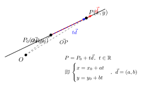

# 向量与直线、圆的关系

> **一例速记**：  
> 直线方程：过定点 $P_0(x_0,y_0)$，方向向量 $\vec{d}=(a,b)$，则直线上任意点 $P$ 满足  
> $$\vec{OP} = \vec{OP_0} + t\vec{d} \quad (t \in \mathbb{R})$$  
> 即参数方程 $\begin{cases} x = x_0 + at \\ y = y_0 + bt \end{cases}$。  
> 圆方程：圆心 $C$、半径 $r$ 的圆 $\Leftrightarrow |\vec{CP}|=r$，即 $|\vec{OP}-\vec{OC}|=r$。  
> **平行**：$\vec{AB} = \lambda\vec{CD}$；**垂直**：$\vec{AB}\cdot\vec{CD}=0$；**相切**：圆心距 $= r$。

---

## 一、直线的向量方程

### 概念引入：从两点式到向量式

高中阶段已知"两点确定一条直线"和斜截式 $y = kx + b$。但斜截式有缺陷：**无法表示竖直直线**（斜率不存在）。向量方程统一处理所有方向的直线。

**几何直觉**：从定点 $P_0$ 沿某个固定方向 $\vec{d}$ 走，走多远都是直线上的点，参数 $t$ 就是"走了多远"的倍数。

### 定义：直线的向量方程

**定理**：过点 $P_0(x_0, y_0)$，以非零向量 $\vec{d} = (a, b)$ 为方向向量的直线 $l$ 的向量方程为：

$$\vec{OP} = \vec{OP_0} + t\vec{d}, \quad t \in \mathbb{R}$$

等价于参数方程：

$$\begin{cases} x = x_0 + at \\ y = y_0 + bt \end{cases}, \quad t \in \mathbb{R}$$

**方向向量的含义**：$\vec{d} = (a, b)$ 的方向就是直线的延伸方向；直线上任意两点之差都与 $\vec{d}$ 共线（平行）。

**由参数方程消去 $t$**（当 $a \neq 0, b \neq 0$）：

$$\frac{x - x_0}{a} = \frac{y - y_0}{b}$$

这就是直线的**对称式**（点斜式的变形）。

当 $a = 0$：直线为 $x = x_0$（竖直线，斜率不存在）。

当 $b = 0$：直线为 $y = y_0$（水平线）。

**方向向量与法向量的区别**：

| 概念 | 定义 | 与直线的关系 |
|------|------|------------|
| 方向向量 $\vec{d} = (a, b)$ | 沿直线方向的向量 | 与直线**平行**（$\vec{d} \parallel l$） |
| 法向量 $\vec{n} = (b, -a)$ | 垂直于直线的向量 | 与直线**垂直**（$\vec{n} \perp l$） |

若直线方程为 $Ax + By + C = 0$，则法向量为 $(A, B)$，方向向量为 $(-B, A)$（或 $(B, -A)$）。

---

## 二、圆的向量方程

### 定义：圆的向量方程

圆是到定点（圆心）距离等于定值（半径）的点的集合。向量语言描述：

**圆的向量方程**：圆心为 $C$，半径为 $r$ 的圆：

$$|\vec{CP}| = r$$

展开为：

$$|\vec{OP} - \vec{OC}| = r$$

若 $C = (a, b)$，$P = (x, y)$，则 $\vec{CP} = (x - a, y - b)$，即：

$$\sqrt{(x-a)^2 + (y-b)^2} = r$$

两边平方得到标准方程 $(x-a)^2 + (y-b)^2 = r^2$。

**向量形式的优势**：在向量语言中，圆的定义非常简洁：$|\vec{CP}| = r$，不依赖坐标系的具体形式。

---

## 三、用向量法判断直线与直线的关系

### 平行判定

两条直线 $l_1 \parallel l_2$ $\Leftrightarrow$ 它们的方向向量平行，即：

$$\vec{d_1} = \lambda \vec{d_2} \quad (\lambda \in \mathbb{R}, \lambda \neq 0)$$

坐标表示：$\vec{d_1} = (a_1, b_1)$，$\vec{d_2} = (a_2, b_2)$，则 $l_1 \parallel l_2$ $\Leftrightarrow$ $a_1 b_2 - a_2 b_1 = 0$（叉积为零）。

**注意**：方向向量平行只保证两直线**平行或重合**，要区分需检查是否有公共点。

### 垂直判定

两条直线 $l_1 \perp l_2$ $\Leftrightarrow$ 方向向量垂直，即：

$$\vec{d_1} \cdot \vec{d_2} = 0$$

坐标表示：$a_1 a_2 + b_1 b_2 = 0$。

---

## 四、用向量法判断直线与圆的关系

设直线 $l$：过点 $P_0$，方向向量 $\vec{d}$；圆 $C$：圆心 $C$，半径 $r$。

**圆心到直线的距离公式**（向量法）：

从圆心 $C$ 向直线作垂线，垂足为 $H$，则圆心距 $d = |CH|$。利用向量投影：

$$d = \left| \vec{CP_0} - \frac{\vec{CP_0} \cdot \vec{d}}{|\vec{d}|^2} \vec{d} \right|$$

即 $d = |\vec{CP_0}| \sin\theta$，其中 $\theta$ 是 $\vec{CP_0}$ 与 $\vec{d}$ 的夹角。

也可直接用解析法：若直线方程为 $Ax + By + C = 0$，圆心为 $(x_0, y_0)$，则：

$$d = \frac{|Ax_0 + By_0 + C|}{\sqrt{A^2 + B^2}}$$

**判断关系**：

| 条件 | 关系 |
|------|------|
| $d > r$ | 直线与圆**相离** |
| $d = r$ | 直线与圆**相切** |
| $d < r$ | 直线与圆**相交** |

**相切条件（向量语言）**：直线 $l$ 与圆 $C$ 相切 $\Leftrightarrow$ $\vec{CP_0} \cdot \vec{d} = 0$（当 $P_0$ 是切点时）或圆心距 $= r$。

---

## 五、典型应用例题

### 例 1：用向量法判断两直线是否垂直

**题目**：已知点 $A(1, 2)$，$B(3, 6)$，$C(0, 4)$，$D(2, 2)$。判断直线 $AB$ 与直线 $CD$ 是否垂直。

**【思路】** 求两直线方向向量，计算数量积。

**解**：

$$\vec{AB} = B - A = (3-1,\ 6-2) = (2, 4)$$

$$\vec{CD} = D - C = (2-0,\ 2-4) = (2, -2)$$

计算数量积：

$$\vec{AB} \cdot \vec{CD} = 2 \times 2 + 4 \times (-2) = 4 - 8 = -4 \neq 0$$

**结论**：$\vec{AB} \cdot \vec{CD} \neq 0$，故直线 $AB$ 与直线 $CD$ **不垂直**。

---

### 例 2：写出直线的参数方程并求交点

**题目**：直线 $l_1$ 过点 $A(1, 0)$，方向向量 $\vec{d_1} = (1, 2)$；直线 $l_2$ 过点 $B(3, 1)$，方向向量 $\vec{d_2} = (1, -1)$。求两直线的交点坐标。

**【思路】** 写出两条直线的参数方程，联立求解。

**解**：

直线 $l_1$ 的参数方程：$\begin{cases} x = 1 + t \\ y = 0 + 2t \end{cases}$

直线 $l_2$ 的参数方程：$\begin{cases} x = 3 + s \\ y = 1 - s \end{cases}$

联立（令 $l_1, l_2$ 的 $x, y$ 相等）：

$$1 + t = 3 + s \quad \Rightarrow \quad t - s = 2 \quad \cdots (1)$$

$$2t = 1 - s \quad \Rightarrow \quad 2t + s = 1 \quad \cdots (2)$$

$(1) + (2)$：$3t = 3$，故 $t = 1$。

代入 $(1)$：$s = t - 2 = -1$。

交点坐标：代入 $l_1$ 的参数方程：$x = 1 + 1 = 2$，$y = 2 \times 1 = 2$。

**验证**（代入 $l_2$）：$x = 3 + (-1) = 2$，$y = 1 - (-1) = 2$。一致。

**答**：交点为 $(2, 2)$。

---

### 例 3：判断直线与圆是否相切

**题目**：直线 $l$：$3x + 4y - 15 = 0$；圆 $C$：圆心 $C(1, 2)$，半径 $r = 2$。判断直线 $l$ 与圆 $C$ 的位置关系。

**【思路】** 求圆心到直线的距离，与半径比较。

**解**：

圆心 $C(1, 2)$ 到直线 $3x + 4y - 15 = 0$ 的距离：

$$d = \frac{|3 \times 1 + 4 \times 2 - 15|}{\sqrt{3^2 + 4^2}} = \frac{|3 + 8 - 15|}{\sqrt{9 + 16}} = \frac{|-4|}{5} = \frac{4}{5}$$

由于 $d = \dfrac{4}{5} < r = 2$，故直线 $l$ 与圆 $C$ **相交**。

若换为直线 $3x + 4y - 15 = 0$ 调整为 $3x + 4y - 5 = 0$，则：

$$d' = \frac{|3 + 8 - 5|}{5} = \frac{6}{5} < 2$$，仍相交。

若直线为 $3x + 4y - 1 = 0$：$d'' = \frac{|3 + 8 - 1|}{5} = 2 = r$，**相切**。

**答**：原直线 $l$ 与圆 $C$ 相交（圆心距 $\dfrac{4}{5} < 2$）。

---

## 六、易错点汇总

**易错 1：方向向量与法向量混淆**

直线 $2x + 3y - 5 = 0$ 的**法向量**是 $(2, 3)$，**方向向量**是 $(-3, 2)$（或 $(3, -2)$）——法向量旋转 $90°$ 得方向向量。判断两直线平行用方向向量共线（叉积为零），判断垂直用数量积为零，两者对应的向量类型不同，切勿混淆。

**易错 2：参数方程中参数 $t$ 的范围**

直线的参数方程 $\begin{cases} x = x_0 + at \\ y = y_0 + bt \end{cases}$ 中，$t \in \mathbb{R}$ 表示整条直线。若题目问的是**线段**（从 $A$ 到 $B$），则 $t \in [0, 1]$（以 $A$ 为起点、$B$ 为终点作归一化）；若是**射线**，则 $t \geq 0$。抄题时注意是直线、射线还是线段。

**易错 3：圆方程形式选择**

向量形式 $|\vec{OP} - \vec{OC}| = r$ 与标准方程 $(x-a)^2 + (y-b)^2 = r^2$ 完全等价。在**解析计算**时（求交点、距离）用标准方程更方便；在**几何推理**时（如证明某点在圆上）用向量形式更简洁。

**易错 4：直线平行与重合的区分**

方向向量 $\vec{d_1} \parallel \vec{d_2}$（叉积为零）只能保证两直线**平行或重合**。要区分：检查一条直线上的点是否在另一条直线上。例如取 $l_1$ 上的点 $P_0$，若 $P_0$ 满足 $l_2$ 的方程则重合，否则平行。

**易错 5：直线与圆相切的方向**

直线与圆相切时，切点处半径**垂直**于切线，即 $\vec{CP_{\text{切}}} \perp \vec{d}$（圆心到切点的向量与直线方向向量垂直）。用此性质可快速求切点坐标，但要注意圆心距 $= r$ 是相切的充要条件，不要用"判别式为零"替代（判别式法和距离法等价，但距离法更直观）。

---

## 七、思路自测题

**自测 1**　直线 $l$ 过点 $A(2, -1)$，方向向量 $\vec{d} = (3, 4)$。写出直线的参数方程，并求直线与 $x$ 轴的交点。

> 提示：参数方程 $\begin{cases} x = 2 + 3t \\ y = -1 + 4t \end{cases}$。令 $y = 0$：$-1 + 4t = 0 \Rightarrow t = \dfrac{1}{4}$。$x = 2 + 3 \times \dfrac{1}{4} = \dfrac{11}{4}$。交点为 $\left(\dfrac{11}{4},\ 0\right)$。

**自测 2**　已知直线 $l_1$ 过 $(0, 0)$ 和 $(2, 1)$，直线 $l_2$ 过 $(1, 3)$ 和 $(3, 4)$。判断 $l_1$ 与 $l_2$ 是否平行。

> 提示：$\vec{d_1} = (2, 1)$，$\vec{d_2} = (3-1,\ 4-3) = (2, 1)$。$\vec{d_1} = \vec{d_2}$，方向向量相同，检查是否重合：点 $(0, 0)$ 在 $l_2$ 上吗？$l_2$ 的方向 $(2,1)$ 过 $(1,3)$，方程：$x - 1 = 2t, y - 3 = t$，即 $y = \dfrac{1}{2}x + \dfrac{5}{2}$。$(0,0)$ 代入：$0 \neq \dfrac{5}{2}$，故不重合，$l_1 \parallel l_2$。

**自测 3**　圆 $C$ 的圆心为 $(3, 4)$，半径为 $5$。判断直线 $l$：$3x - 4y + 25 = 0$ 与圆 $C$ 的位置关系。

> 提示：圆心到直线距离 $d = \dfrac{|3\times3 - 4\times4 + 25|}{\sqrt{9+16}} = \dfrac{|9-16+25|}{5} = \dfrac{18}{5} = 3.6 < 5$。故直线与圆**相交**。

**自测 4**　直线 $l$：$x - 2y + k = 0$ 与圆 $C$：$(x-1)^2 + (y-2)^2 = 5$ 相切，求 $k$ 的值。

> 提示：圆心 $(1, 2)$，半径 $r = \sqrt{5}$。圆心到 $l$ 的距离 $= r$：$\dfrac{|1 - 4 + k|}{\sqrt{1+4}} = \sqrt{5}$，即 $\dfrac{|k-3|}{\sqrt{5}} = \sqrt{5}$，$|k-3| = 5$，故 $k = 8$ 或 $k = -2$。

**自测 5**　已知向量 $\vec{a} = (2, m)$，$\vec{b} = (1, 3)$，且 $\vec{a} \perp \vec{b}$，求 $m$，并写出过点 $P(0, 0)$、方向向量为 $\vec{a}$ 的直线方程。

> 提示：$\vec{a} \perp \vec{b} \Rightarrow \vec{a} \cdot \vec{b} = 0$：$2 \times 1 + m \times 3 = 0 \Rightarrow m = -\dfrac{2}{3}$。直线参数方程：$\begin{cases} x = 2t \\ y = -\dfrac{2}{3}t \end{cases}$，消去 $t$：$y = -\dfrac{1}{3}x$，即 $x + 3y = 0$。

---

**回头看"一例速记"**：

> 直线向量方程：$\vec{OP} = \vec{OP_0} + t\vec{d}$，方向向量 $\vec{d}$ 平行于直线，法向量垂直于直线。  
> 圆：$|\vec{OP} - \vec{OC}| = r$。  
> 平行：方向向量共线；垂直：数量积为零；相切：圆心距 $= r$。  
> 易混点：方向向量 $\neq$ 法向量；参数 $t$ 的范围要看题意。

能不看提示独立完成自测 4 的完整推导——本章，你拿下了。
