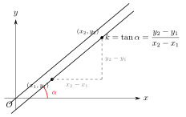
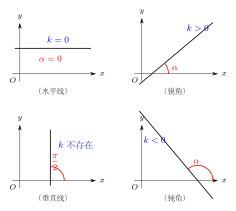

# 直线的斜率与倾斜角

> **一例速记**：  
> 直线 $l$ 与 $x$ 轴正方向所成的角 $\alpha$（逆时针，$\alpha \in [0, \pi)$）叫**倾斜角**。  
> **斜率** $k = \tan\alpha$（$\alpha \neq \dfrac{\pi}{2}$）。  
> 已知两点 $(x_1, y_1)$，$(x_2, y_2)$（$x_1 \neq x_2$）：$k = \dfrac{y_2 - y_1}{x_2 - x_1}$。  
> $\alpha = \dfrac{\pi}{2}$ 时直线垂直 $x$ 轴，$k$ **不存在**。

---

## 一、为什么需要"倾斜程度"的概念

### 从斜坡说起

生活中我们常说某条路"坡度很大"或"坡度平缓"，实际上是在描述路面与水平方向的倾斜程度。公路、滑梯、山坡——凡是有方向的斜面，我们都自然地想用一个数来描述它有多"斜"。

平面直角坐标系中的直线也是如此：同样是一条直线，有的几乎水平，有的向右上方陡峭延伸，有的向右下方急剧下降。如何用一个统一的量刻画这些差异，让"倾斜程度"可以相互比较、参与代数运算？

数学给出了两个互补的工具：

- **倾斜角** $\alpha$：角度视角，直观描述直线与水平轴的夹角，几何意义清晰
- **斜率** $k$：数值视角，用一个实数量化倾斜程度，便于代数运算和方程建立

二者一体两面，通过 $k = \tan\alpha$ 紧密联系。理解它们的关系，是学习直线方程一切后续内容的基础。

### 为什么需要两个概念

倾斜角直接刻画角度，直观但不够代数化；斜率是实数，可以做加减乘除，但丢失了"角度"的直观感。在解题中，几何问题用倾斜角理解，代数运算用斜率计算，两者配合使用。

---

## 二、倾斜角的定义

### 定义

设直线 $l$ 与 $x$ 轴相交（或平行于 $x$ 轴），令 $\alpha$ 为**从 $x$ 轴正方向**出发，**逆时针旋转**到直线 $l$ 的向上方向所经过的最小非负角。规定：

$$\alpha \in [0,\, \pi)$$

具体来说：

- 若直线平行于 $x$ 轴（或与 $x$ 轴重合），则 $\alpha = 0$。
- 若直线垂直于 $x$ 轴（即形如 $x = c$ 的直线），则 $\alpha = \dfrac{\pi}{2}$。
- 对于一般倾斜直线，$\alpha$ 在 $0$ 到 $\pi$ 之间（不含端点 $\pi$）。

### 为什么范围是 $[0, \pi)$ 而非 $[0, 2\pi)$

直线没有方向之分——从两端看它都是"同一条直线"。如果我们逆时针转过 $\pi$，得到的方向与原方向完全相同（反方向也代表同一直线）。因此一条直线只需要 $[0, \pi)$ 这半个圆就能覆盖所有情形。

- $\alpha = \pi$ 与 $\alpha = 0$ 代表完全相同的水平方向，两者规定统一取 $\alpha = 0$，不出现 $\alpha = \pi$。
- 这就是为什么范围右端是开区间 $\pi$（不含），左端是闭区间 $0$（含）。

### 关键说明

"从 $x$ 轴正方向逆时针"这句话至关重要：倾斜角总是测量直线**向上**那一侧与 $x$ 轴正方向的夹角。对于从左上向右下倾斜的直线（斜率为负），需要逆时针旋转超过 $90°$ 才能到达它的向上方向，故倾斜角是钝角（$\dfrac{\pi}{2} < \alpha < \pi$）。

---

## 三、斜率的定义与两点公式

### 通过倾斜角定义

$$\boxed{k = \tan\alpha} \qquad \left(\alpha \neq \frac{\pi}{2}\right)$$

当 $\alpha = \dfrac{\pi}{2}$ 时，$\tan\alpha$ 无意义（趋向无穷），故**垂直于 $x$ 轴的直线没有斜率**。注意：斜率"不存在"是一个确定的事实，而非 $k = \infty$ 或 $k = 0$。

### 通过两点计算：两点公式

设直线经过两点 $P_1(x_1, y_1)$ 和 $P_2(x_2, y_2)$，且 $x_1 \neq x_2$，则：

$$\boxed{k = \frac{y_2 - y_1}{x_2 - x_1}}$$

**几何解释**：

分子 $y_2 - y_1$ 是纵向变化量（通常称为"升高量"，rise），分母 $x_2 - x_1$ 是横向变化量（"水平位移"，run）。斜率就是"每向右走一个单位，纵向变化了多少"：

- $k > 0$：向右走，纵坐标增大（上坡）
- $k < 0$：向右走，纵坐标减小（下坡）
- $k = 0$：向右走，纵坐标不变（平路）

**与两点顺序无关**：

若把 $P_1$、$P_2$ 互换，分子分母同时变号，商不变：
$$k = \frac{y_1 - y_2}{x_1 - x_2}$$

因此两点公式与"先取哪个点"无关。

### 特别注意 $x_1 = x_2$ 的情形

若两点横坐标相等（$x_1 = x_2$），则 $x_2 - x_1 = 0$，分母为零，不能套公式。这意味着两点确定的直线垂直于 $x$ 轴，方程为 $x = x_1$，斜率不存在。

---

## 四、倾斜角与斜率的对应关系

| 倾斜角 $\alpha$ | 斜率 $k$ | 直线形态 | 典型方程 |
|---|---|---|---|
| $\alpha = 0$ | $k = 0$ | 水平线 | $y = c$ |
| $0 < \alpha < \dfrac{\pi}{2}$ | $k > 0$ | 右上倾斜 | $y = 2x + 1$（锐角） |
| $\alpha = \dfrac{\pi}{2}$ | $k$ **不存在** | 垂直线 | $x = c$ |
| $\dfrac{\pi}{2} < \alpha < \pi$ | $k < 0$ | 右下倾斜 | $y = -x + 3$（钝角） |

**记忆要点**：

- 锐角倾斜 $\Rightarrow$ 正斜率；钝角倾斜 $\Rightarrow$ 负斜率
- 水平 $\Rightarrow$ $k = 0$；垂直 $\Rightarrow$ $k$ 不存在（两者截然不同！）
- 斜率可以是任意实数（包括负数和零），但不能是"无穷大"

**关于"斜率大"的直觉纠正**：

注意"斜率越大"不等于"直线越陡"。例如 $k = 100$（正数）确实很陡，但 $k = -100$ 更陡（倾斜角更大），却数值上更小。用倾斜角而非斜率来比较"陡度"更直观：倾斜角越接近 $\dfrac{\pi}{2}$，直线越陡（无论斜率正负）。

---

## 五、典型应用例题

### 例 1：已知两点求斜率与倾斜角

**题目**：直线 $l$ 过点 $A(1, 2)$ 和 $B(4, -1)$，求直线的斜率和倾斜角。

**【思路】** 直接用两点公式求 $k$，再由 $k = \tan\alpha$（$\alpha \in [0, \pi)$）反解 $\alpha$。

**解**：

$$k = \frac{-1 - 2}{4 - 1} = \frac{-3}{3} = -1$$

由 $\tan\alpha = -1$ 且 $\alpha \in [0, \pi)$，需找 $[0, \pi)$ 内正切值为 $-1$ 的角。

$\tan\dfrac{\pi}{4} = 1$，而 $\tan\alpha < 0$，故 $\alpha \in \left(\dfrac{\pi}{2}, \pi\right)$。

利用辅助角：$\tan\alpha = -1 = -\tan\dfrac{\pi}{4} = \tan\left(\pi - \dfrac{\pi}{4}\right)$，

故 $\alpha = \pi - \dfrac{\pi}{4} = \dfrac{3\pi}{4}$（即 $135°$）。

**验证**：$\tan\dfrac{3\pi}{4} = -1$，正确。倾斜角为钝角，符合斜率为负的情形。

---

### 例 2：已知斜率求倾斜角范围

**题目**：若直线 $l$ 的斜率满足 $k \in (0, \sqrt{3}]$，求倾斜角 $\alpha$ 的范围。

**【思路】** 将斜率条件转化为 $\tan\alpha$ 的约束，再利用正切函数在 $\left(0, \dfrac{\pi}{2}\right)$ 上单调递增的性质。

**解**：

$k > 0$ 说明 $\alpha \in \left(0, \dfrac{\pi}{2}\right)$（锐角范围）。

在 $\left(0, \dfrac{\pi}{2}\right)$ 上 $\tan\alpha$ 单调递增，且：
$$\tan\alpha = k \in (0,\, \sqrt{3}]$$

- $\tan\alpha > 0 \Rightarrow \alpha > 0$
- $\tan\alpha \leq \sqrt{3} = \tan\dfrac{\pi}{3} \Rightarrow \alpha \leq \dfrac{\pi}{3}$

故 $\alpha \in \left(0,\, \dfrac{\pi}{3}\right]$。

---

### 例 3：含参数的斜率问题

**题目**：已知 $A(a, 3)$，$B(2, -1)$，直线 $AB$ 的倾斜角为 $\dfrac{\pi}{4}$，求参数 $a$ 的值。

**【思路】** 由倾斜角算出斜率 $k$，再用两点公式列方程求 $a$。注意先用倾斜角求斜率，顺序不能颠倒。

**解**：

**第一步**：由倾斜角求斜率。

$$k = \tan\frac{\pi}{4} = 1$$

**第二步**：代入两点公式。

$$k = \frac{-1 - 3}{2 - a} = 1$$

$$\frac{-4}{2 - a} = 1 \implies -4 = 2 - a \implies a = 6$$

**第三步**：验证。

$$k = \frac{-1-3}{2-6} = \frac{-4}{-4} = 1 \quad \checkmark$$

倾斜角 $\alpha = \arctan 1 = \dfrac{\pi}{4}$，正确。

---

## 六、易错点汇总

**易错 1：$\alpha = \dfrac{\pi}{2}$ 时误写 $k = 0$ 或 $k$ 取无穷大**

垂直于 $x$ 轴的直线斜率**不存在**（undefined）。"不存在"意味着这个量对该直线根本没有定义，既不能写 $k = 0$（那是水平线），也不能写 $k = \infty$（无穷大不是实数，不在斜率的定义域中）。判断题中出现"直线 $x = 3$ 的斜率为 $0$"时，答案是**错误**。

**易错 2：混淆"斜率为零"与"斜率不存在"**

$k = 0$ 对应水平线（$\alpha = 0$，形如 $y = c$）；斜率不存在对应垂直线（$\alpha = \dfrac{\pi}{2}$，形如 $x = c$）。两者表面上都很"特殊"，但含义完全不同。这是历年高考选择题的经典坑点，必须牢记。

**易错 3：倾斜角范围写成 $(0, \pi]$ 或 $[0, \pi]$**

正确范围是 $[0, \pi)$。原因：$\alpha = 0$ 是合法的（水平线的倾斜角就是 $0$），必须包含左端点；$\alpha = \pi$ 与 $\alpha = 0$ 代表同一个水平方向，规定只用 $0$，不用 $\pi$，故排除右端点。

**易错 4：两点公式中 $x_1 = x_2$ 时仍强行套公式**

若题目给出的两点横坐标相等（例如 $A(3, 1)$，$B(3, 5)$），则连线为垂直线 $x = 3$，斜率不存在，两点公式分母为零，**不可套用**。应直接写出方程 $x = 3$，不需要斜率。

**易错 5：由 $\tan\alpha = k$ 反解 $\alpha$ 时忘记限制范围**

$\tan\alpha = -1$ 有无穷多解（$-\dfrac{\pi}{4}$、$\dfrac{3\pi}{4}$、$\dfrac{7\pi}{4}$……），但倾斜角严格限定在 $[0, \pi)$。必须先确定 $\alpha$ 的区间再取反正切值：$k < 0 \Rightarrow \alpha \in \left(\dfrac{\pi}{2}, \pi\right)$，在该区间内找满足 $\tan\alpha = k$ 的唯一值。

---

## 七、思路自测题

**自测 1**　已知直线过点 $P(-1, 4)$ 和 $Q(3, -2)$，求斜率和倾斜角（结果用反正切表示）。

> 提示：$k = \dfrac{-2-4}{3-(-1)} = \dfrac{-6}{4} = -\dfrac{3}{2}$。由 $\tan\alpha = -\dfrac{3}{2}$ 且 $\alpha \in \left(\dfrac{\pi}{2}, \pi\right)$，故 $\alpha = \pi - \arctan\dfrac{3}{2}$。

**自测 2**　直线 $l$ 的倾斜角为 $\dfrac{2\pi}{3}$（即 $120°$），求斜率；反过来，若斜率 $k = \sqrt{3}$，求倾斜角。

> 提示：$k = \tan\dfrac{2\pi}{3} = -\sqrt{3}$。若 $k = \sqrt{3}$，则 $\tan\alpha = \sqrt{3}$，$\alpha \in \left(0, \dfrac{\pi}{2}\right)$，故 $\alpha = \dfrac{\pi}{3}$。

**自测 3**　设直线过 $M(t, 1)$ 和 $N(2, t+1)$，其中 $t \neq 2$，求斜率 $k$（用 $t$ 表示），并讨论 $k$ 的正负及何时 $k = 0$。

> 提示：$k = \dfrac{(t+1)-1}{2-t} = \dfrac{t}{2-t}$。$t > 0$ 且 $t < 2$ 时，$k > 0$；$t < 0$ 时 $k < 0$（分子负，分母正）；$t > 2$ 时 $k < 0$（分子正，分母负）；$t = 0$ 时 $k = 0$（水平线）；$t = 2$ 时分母为零，斜率不存在（已排除）。

**自测 4**　判断以下说法正误，并说明理由：

（A）斜率越大，直线越陡  
（B）斜率为 $-3$ 的直线比斜率为 $2$ 的直线倾斜角更大  
（C）坐标平面内任意一条直线都有斜率  
（D）直线 $y = -5$ 的斜率为 $0$

> 提示：  
> (A) **错**。斜率大不等于更陡。$k = 100$ 和 $k = -100$ 都很陡，但 $k = 100$ 数值上更大，不能说明哪个更陡；"陡度"用倾斜角与 $\dfrac{\pi}{2}$ 的距离衡量。  
> (B) **对**。$\tan\alpha = -3$，$\alpha \approx 108°$；$\tan\alpha = 2$，$\alpha \approx 63°$，故斜率 $-3$ 对应的倾斜角更大。  
> (C) **错**。垂直于 $x$ 轴的直线（$x = c$）斜率不存在。  
> (D) **对**。$y = -5$ 是平行于 $x$ 轴的水平线，$\alpha = 0$，$k = \tan 0 = 0$。

---

**回头看"一例速记"**：

> 倾斜角 $\alpha \in [0, \pi)$，水平 $\alpha = 0$，垂直 $\alpha = \dfrac{\pi}{2}$。  
> $k = \tan\alpha$（垂直时不存在，水平时 $k = 0$）。  
> 两点公式：$k = \dfrac{y_2 - y_1}{x_2 - x_1}$（$x_1 \neq x_2$）。  
> 核心区分：$k = 0$ 是水平，$k$ 不存在是垂直——二者不可混淆。

能不看提示独立写出例 2 和例 3 的完整推导——本章，你拿下了。
