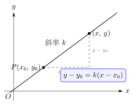
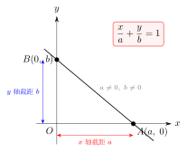

# 直线方程的五种形式

> **一例速记**：  
> 平面直线方程有 5 种标准形式，万能选手是**一般式** $Ax + By + C = 0$（$A$、$B$ 不全为零），任何直线都可写成此形式。  
> 其余 4 种各有限制，选用前必须检查适用条件——**截距式**最容易忽略两个禁区。

---

## 一、为什么需要多种方程形式

### 同一条直线的多张"身份证"

平面上确定一条直线的方式有很多：给出它的斜率和一个点、给出它过的两个点、给出它与两坐标轴的截距……不同的出发点，产生不同形式的直线方程。这 5 种形式本质上都是同一条直线的不同"身份证"——可以互相转化。

掌握各形式的**适用条件**和**禁忌情形**，是解题时选用正确形式、避免低级失误的关键。高考常见的一类陷阱，就是某种形式在题设条件下根本不适用，却被错误地套用。

### 五种形式一览

| 形式名称 | 方程 | 核心禁忌 |
|---|---|---|
| 点斜式 | $y - y_0 = k(x - x_0)$ | $k$ 不存在时不可用 |
| 斜截式 | $y = kx + b$ | $k$ 不存在时不可用 |
| 两点式 | $\dfrac{y-y_1}{y_2-y_1} = \dfrac{x-x_1}{x_2-x_1}$ | $x_1 = x_2$ 或 $y_1 = y_2$ 时不可用 |
| 截距式 | $\dfrac{x}{a} + \dfrac{y}{b} = 1$ | 过原点或平行坐标轴时不可用 |
| 一般式 | $Ax + By + C = 0$ | **无**（任何直线均可） |

---

## 二、五种方程形式详解

### 形式 1：点斜式

$$\boxed{y - y_0 = k(x - x_0)}$$

**含义**：直线上一个**定点** $P_0(x_0, y_0)$ 已知，斜率 $k$ 已知。动点 $(x, y)$ 在直线上，当且仅当它与定点的连线斜率等于 $k$。

**适用条件**：
1. 已知直线上**某一点**的坐标 $(x_0, y_0)$
2. 直线的**斜率** $k$ 已知且存在

**禁忌**：若直线垂直于 $x$ 轴（$k$ 不存在），点斜式无法表达，此时方程应直接写为 $x = x_0$。

**实际操作**：写出点斜式后，通常将其整理为一般式 $Ax + By + C = 0$，以便后续计算。

---

### 形式 2：斜截式

$$\boxed{y = kx + b}$$

**含义**：直线的斜率为 $k$，与 $y$ 轴的交点（$y$ 轴截距）为 $b$，即直线过点 $(0, b)$。

**适用条件**：已知**斜率** $k$ 和 **$y$ 轴截距** $b$。

**与点斜式的关系**：斜截式是点斜式取 $(x_0, y_0) = (0, b)$ 的特殊情况：
$$y - b = k(x - 0) \implies y = kx + b$$

所以斜截式本质上是点斜式的子集。

**禁忌**：与点斜式相同——直线不能垂直于 $x$ 轴。

**注意**：$b = 0$ 完全合法（表示直线过原点，方程为 $y = kx$），这与截距式的禁忌不同，不可混淆。

---

### 形式 3：两点式

$$\boxed{\frac{y - y_1}{y_2 - y_1} = \frac{x - x_1}{x_2 - x_1}}$$

**含义**：直线经过两个已知点 $P_1(x_1, y_1)$ 和 $P_2(x_2, y_2)$。方程表达了"点 $(x, y)$ 在直线上"等价于"$(x, y)$ 到 $P_1$ 的斜率等于 $P_1$ 到 $P_2$ 的斜率"。

**适用条件**：已知直线上**两个不同的点**，且满足：
- $x_1 \neq x_2$（否则分母 $x_2 - x_1 = 0$）
- $y_1 \neq y_2$（否则分母 $y_2 - y_1 = 0$）

**禁忌**：
- $x_1 = x_2$：直线垂直 $x$ 轴，方程写 $x = x_1$
- $y_1 = y_2$：直线平行 $x$ 轴，方程写 $y = y_1$

**实用性**：在知道两点但不明确斜率时，两点式比先算斜率再用点斜式更直接，但需要注意上述两种退化情形。

---

### 形式 4：截距式

$$\boxed{\frac{x}{a} + \frac{y}{b} = 1}$$

**含义**：直线与 $x$ 轴交于 $A(a, 0)$（$x$ 轴截距为 $a$），与 $y$ 轴交于 $B(0, b)$（$y$ 轴截距为 $b$）。公式来自于两点式代入 $(a, 0)$ 和 $(0, b)$：

$$\frac{y - 0}{b - 0} = \frac{x - a}{0 - a} \implies \frac{y}{b} = 1 - \frac{x}{a} \implies \frac{x}{a} + \frac{y}{b} = 1$$

**适用条件**：
1. 直线与 $x$ 轴的交点已知，即 $a \neq 0$
2. 直线与 $y$ 轴的交点已知，即 $b \neq 0$

**两个禁忌（缺一不可）**：
- 禁忌一：$a = 0$，即直线过 $y$ 轴（包括：直线过原点、直线就是 $y$ 轴）
- 禁忌二：$b = 0$，即直线过 $x$ 轴（包括：直线过原点、直线就是 $x$ 轴）
- 过原点同时违背两个禁忌，绝对不能用截距式
- 平行 $x$ 轴的直线（$y = c$，$c \neq 0$）无 $x$ 轴截距（永不与 $x$ 轴相交），也不能用截距式

**特别提醒**：截距式是最容易出问题的一种形式，凡是题目条件中有"截距"字样，或者需要讨论直线是否过原点时，必须对截距式的适用性做充分检验。

---

### 形式 5：一般式

$$\boxed{Ax + By + C = 0 \qquad (A,\, B \text{ 不全为零})}$$

**含义**：所有关于 $x, y$ 的一次方程（两变量线性方程），在平面内的图形都是直线。反之，任何直线都可以写成一般式。

**适用条件**：任何直线，无限制。

**转化关系**：
- $B \neq 0$ 时，化为斜截式：$y = -\dfrac{A}{B}x - \dfrac{C}{B}$，斜率 $k = -\dfrac{A}{B}$，$y$ 截距 $b = -\dfrac{C}{B}$
- $B = 0$（$A \neq 0$）时：$x = -\dfrac{C}{A}$（垂直线，斜率不存在）

**优势**：在含参讨论或位置关系判断时，用一般式可以避免对斜率是否存在进行分类讨论，统一处理所有情形，是最安全的兜底形式。

---

## 三、五种形式选用策略

### 选用流程

拿到一道直线方程题，按如下流程选形式：

1. **已知一点和斜率** → 点斜式（先检查 $k$ 是否存在）
2. **已知斜率和 $y$ 截距** → 斜截式
3. **已知两个点** → 两点式（先检查 $x_1 \neq x_2$ 且 $y_1 \neq y_2$），或先算斜率用点斜式
4. **已知 $x$ 截距和 $y$ 截距（两者非零）** → 截距式
5. **含参、需统一讨论、或其他情形不确定** → 直接用一般式设方程，代入条件

### 含参问题的陷阱：分类讨论不能省

当直线的存在形式不确定（如斜率可能不存在）时，需要分情形讨论：
- 先考虑"$k$ 不存在"的特殊情形（直线垂直 $x$ 轴）
- 再设斜率存在，用点斜式或斜截式列方程

**这一步常被遗漏，是解题失分的高频原因。**

---

## 四、典型应用例题

### 例 1：由已知条件建立直线方程（点斜式）

**题目**：直线 $l$ 过点 $A(2, -3)$，斜率为 $\dfrac{1}{2}$，写出直线方程，并化为一般式。

**【思路】** 已知一点和斜率，首选点斜式，然后整理。

**解**：

点斜式：
$$y - (-3) = \frac{1}{2}(x - 2) \implies y + 3 = \frac{1}{2}(x - 2)$$

两边乘以 $2$：$2y + 6 = x - 2$，整理：

$$x - 2y - 8 = 0$$

**验证**：将 $A(2, -3)$ 代入 $x - 2y - 8$：$2 - 2 \times (-3) - 8 = 2 + 6 - 8 = 0$，正确。

**斜率验证**：由一般式 $x - 2y - 8 = 0$（即 $A = 1$，$B = -2$），斜率 $k = -\dfrac{A}{B} = -\dfrac{1}{-2} = \dfrac{1}{2}$，正确。

---

### 例 2：由两点建立直线方程

**题目**：直线 $l$ 过点 $P_1(1, 3)$ 和 $P_2(5, -1)$，求直线方程。

**【思路】** 两点已知，可用两点式，也可先求斜率再用点斜式，验证结果一致。

**方法一（两点式）**：

$$\frac{y - 3}{-1 - 3} = \frac{x - 1}{5 - 1} \implies \frac{y-3}{-4} = \frac{x-1}{4}$$

两边乘以 $-4$：$y - 3 = -(x - 1)$，整理：

$$x + y - 4 = 0$$

**方法二（先求斜率再用点斜式）**：

斜率 $k = \dfrac{-1-3}{5-1} = -1$。

取 $P_1(1, 3)$，点斜式：$y - 3 = -1 \cdot (x - 1) \implies x + y - 4 = 0$，与方法一一致。

**验证**：$P_1(1,3)$：$1 + 3 - 4 = 0$；$P_2(5,-1)$：$5 + (-1) - 4 = 0$。两点均满足。

---

### 例 3：截距条件建立方程（含分类讨论）

**题目**：直线 $l$ 在 $x$ 轴和 $y$ 轴上的截距互为相反数，且过点 $(-2, 3)$，求直线 $l$ 的方程。

**【思路】** "截距互为相反数"意味着 $b = -a$，但当 $a = b = 0$ 时（直线过原点）同样满足条件，而此时截距式失效，需单独讨论。共有两种情形。

**解**：

**情形一**：$a = 0$（直线过原点，$b = -a = 0$ 也成立）。

直线过原点 $(0, 0)$ 和点 $(-2, 3)$，斜率：
$$k = \frac{3 - 0}{-2 - 0} = -\frac{3}{2}$$

方程：$y = -\dfrac{3}{2}x$，即 $3x + 2y = 0$。

**验证**：过原点 $\checkmark$，过 $(-2, 3)$：$3 \times (-2) + 2 \times 3 = 0$ $\checkmark$。两截距均为 $0$，互为相反数 $\checkmark$。

**情形二**：$a \neq 0$，故 $b = -a \neq 0$，可用截距式。

$$\frac{x}{a} + \frac{y}{-a} = 1 \implies \frac{x - y}{a} = 1 \implies x - y = a$$

代入点 $(-2, 3)$：
$$-2 - 3 = a \implies a = -5$$

方程：$x - y = -5$，即 $x - y + 5 = 0$。

**验证**：$(-2) - 3 + 5 = 0$ $\checkmark$。$x$ 截距 $-5$，$y$ 截距 $5$，互为相反数 $\checkmark$。

**答**：直线 $l$ 的方程为 $3x + 2y = 0$ 或 $x - y + 5 = 0$，共 **2** 条。

---

## 五、易错点汇总

**易错 1：含参时漏掉 $k$ 不存在的情形**

题目若说"过定点作直线"而没有给出斜率的具体值，必须考虑直线垂直于 $x$ 轴的可能性。例如"过点 $(2, 1)$ 的直线"，其倾斜角可以是 $\dfrac{\pi}{2}$，此时斜率不存在，需单独写 $x = 2$，不能忽略。

**易错 2：截距式漏掉过原点的情形**

当题目条件允许 $a = b = 0$ 时（如"截距相等"或"截距互为相反数"），必须单独处理过原点的情形，因为过原点的直线不能用截距式（分母为零）。这是例 3 中最典型的分类情形，也是高考大题常见失分点。

**易错 3：两点式在 $y_1 = y_2$ 时分子为零**

若 $y_1 = y_2$，两点式左侧分子 $y_2 - y_1 = 0$，整个左边为 $0$，方程化为 $0 = \dfrac{x - x_1}{x_2 - x_1}$，即 $x = x_1$，这明显不对（那应该是 $y = y_1$）。遇到 $y_1 = y_2$ 时，直接写 $y = y_1$ 即可，不要套两点式。

**易错 4：一般式中 $A$、$B$ 不全为零但误以为必须非零**

$A = 0$（$B \neq 0$）时一般式表示水平线 $y = -C/B$，完全合法；$B = 0$（$A \neq 0$）时表示垂直线 $x = -C/A$，也合法。"不全为零"的要求只是排除 $A = B = 0$ 这种退化情况（否则方程变成 $C = 0$，失去直线方程的意义）。

**易错 5：将"$y$ 轴截距为 $b$"与截距式的条件 $b \neq 0$ 混淆**

斜截式 $y = kx + b$ 中，$b = 0$ 意味着直线过原点，斜截式完全适用；但截距式的 $b$ 是 $y$ 轴截距，若 $b = 0$ 则截距式失效（分母为零）。两个 $b$ 来自同一直线的不同参数，含义相同，但在两种形式中的"禁忌"截然不同，不可混淆。

---

## 六、思路自测题

**自测 1**　直线过点 $A(-1, 2)$，斜率为 $-2$，写出点斜式并化为一般式。

> 提示：$y - 2 = -2(x - (-1)) = -2(x + 1)$，展开得 $y - 2 = -2x - 2$，故 $2x + y = 0$。验证：$2(-1) + 2 = 0$ $\checkmark$，斜率 $k = -2/1 = -2$ $\checkmark$。

**自测 2**　直线在两轴上的截距分别为 $x$ 截距 $3$，$y$ 截距 $-4$，写出截距式，并化为一般式。

> 提示：$\dfrac{x}{3} + \dfrac{y}{-4} = 1$，两边乘以 $12$：$4x - 3y = 12$，一般式 $4x - 3y - 12 = 0$。斜率 $k = 4/3$，$\alpha < \pi/2$（正斜率）。

**自测 3**　直线 $l$ 过点 $P(2, 1)$ 且与两坐标轴围成三角形，面积为 $4$。设 $x$ 截距为 $a$，$y$ 截距为 $b$，求直线方程（注意讨论是否过原点）。

> 提示：过原点的直线不围三角形（退化），故 $a \neq 0$，$b \neq 0$。截距式代入 $P$：$\dfrac{2}{a} + \dfrac{1}{b} = 1$；面积条件 $\dfrac{1}{2}|ab| = 4$，即 $|ab| = 8$。由第一式 $b = \dfrac{a}{a-2}$，代入得 $a \cdot \dfrac{a}{a-2} = \pm 8$，求解得 $(a, b)$。

**自测 4**　将方程 $3x - 2y + 6 = 0$ 化为斜截式，指出斜率和 $y$ 轴截距，并写出截距式。

> 提示：斜截式 $y = \dfrac{3}{2}x + 3$，斜率 $k = \dfrac{3}{2}$，$y$ 截距 $b = 3$。令 $y = 0$：$x = -2$，故截距式 $\dfrac{x}{-2} + \dfrac{y}{3} = 1$。

**自测 5**　下列哪种情形不能直接用截距式（多选）？

（A）直线过 $(-3, 0)$ 和 $(0, 5)$  
（B）直线过原点和 $(1, 2)$  
（C）直线方程为 $y = 3$  
（D）直线过 $(2, 1)$ 和 $(2, 5)$  
（E）直线方程为 $x + y = 0$

> 提示：  
> (A) $x$ 截距 $-3$，$y$ 截距 $5$，均非零，**可用**截距式。  
> (B) 过原点，$a = b = 0$，**不可用**截距式。  
> (C) $y = 3$ 为水平线，无 $x$ 轴截距（不与 $x$ 轴相交），$a$ 不存在，**不可用**截距式。  
> (D) 两点横坐标相同，直线为 $x = 2$（垂直线），无 $y$ 轴截距，$b$ 不存在，**不可用**截距式。  
> (E) $x + y = 0$ 即 $y = -x$，过原点，$a = b = 0$，**不可用**截距式。  
> **答：(B)(C)(D)(E)**。

---

**回头看"一例速记"**：

> 5 种形式：点斜、斜截、两点、截距、一般。  
> 一般式对所有直线通用；其余 4 种各有禁忌。  
> 截距式禁区：过原点（$a = b = 0$）+ 平行任一坐标轴（截距不存在）。  
> 含参讨论时，先考虑"$k$ 不存在"或"过原点"的特殊情形，再处理一般情形。

能不看提示独立完成例 3 的两种情形分类讨论——本章，你拿下了。
