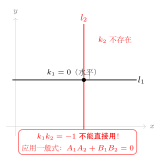

# 直线的位置关系

> **一例速记**：  
> **平行**：$l_1 \parallel l_2 \Leftrightarrow k_1 = k_2$ 且 $b_1 \neq b_2$（斜截式）；或一般式 $\dfrac{A_1}{A_2} = \dfrac{B_1}{B_2} \neq \dfrac{C_1}{C_2}$  
> **垂直**：$l_1 \perp l_2 \Leftrightarrow k_1 \cdot k_2 = -1$（两斜率均存在时）；或一般式 $A_1 A_2 + B_1 B_2 = 0$  
> **重合**：$l_1 = l_2 \Leftrightarrow k_1 = k_2$ 且 $b_1 = b_2$（斜截式）；或一般式 $\dfrac{A_1}{A_2} = \dfrac{B_1}{B_2} = \dfrac{C_1}{C_2}$  
> **特例**：$x = a$（$k$ 不存在）与 $y = b$（$k=0$）垂直——此时 $k_1 k_2 = -1$ **不能用**，直接用一般式。

---

## 一、引入：含参平行线求参数

> **题目**：直线 $l_1: 2x + y - 1 = 0$，$l_2: x + ay + 2 = 0$。若 $l_1 \parallel l_2$，求实数 $a$ 的值。

两条一般式直线，平行条件用一般式比例判别——这是比化斜截式更稳妥的路线，特别是题目直接给出一般式时。

---

## 二、思维路径还原（解题者的内心独白）

> "两条直线都是一般式。目标：$l_1 \parallel l_2$，求 $a$。
>
> **第一步：想清楚平行的判别条件。** 斜截式平行要求 $k_1 = k_2$ 且 $b_1 \neq b_2$；但要先把一般式化成斜截式……麻烦了，得讨论系数是否为零。更好的方法：直接用**一般式平行判别**：
>
> $$\frac{A_1}{A_2} = \frac{B_1}{B_2} \neq \frac{C_1}{C_2}$$
>
> $l_1$：$A_1 = 2,\ B_1 = 1,\ C_1 = -1$；$l_2$：$A_2 = 1,\ B_2 = a,\ C_2 = 2$。
>
> **第二步：列出比例方程。** 平行的充要条件：
>
> $$\frac{2}{1} = \frac{1}{a} \neq \frac{-1}{2}$$
>
> 由 $\dfrac{2}{1} = \dfrac{1}{a}$ 解得：
>
> $$2a = 1 \implies a = \frac{1}{2}$$
>
> **第三步：验证不等号成立（排除重合）。** 代入 $a = \dfrac{1}{2}$ 检查不等号 $\dfrac{1}{a} \neq \dfrac{-1}{2}$：
>
> $$\frac{1}{a} = \frac{1}{1/2} = 2 \neq -\frac{1}{2} = \frac{-1}{2}\ \checkmark$$
>
> 不等号成立，不是重合线，$l_1 \parallel l_2$ 成立。
>
> **关键反射：** 一般式直线的平行判别，必须是"两比相等，但不等于第三比"——漏掉"$\neq$"这一步会把重合误判为平行。
>
> **延伸思考：** 如果要求 $l_1 \perp l_2$，条件变为 $A_1 A_2 + B_1 B_2 = 0$，即 $2 \times 1 + 1 \times a = 0$，得 $a = -2$。两个问题，两个 $a$，互不干扰。
>
> **另一种做法（化斜截式）的隐患：** 把 $l_2: x + ay + 2 = 0$ 化为斜截式，需要 $a \neq 0$。若 $a = 0$，$l_2$ 变成 $x = -2$（垂直线）。一般式直接跨过了这个讨论，更简洁。"

把这段内心独白读两遍，体会"一般式比例判别"的优势和"验证不等号"的必要性。

---

## 三、三种位置关系的完整判别表

（见配图 `geo-p3-03-1`：平行 / 重合 / 垂直三种情形）

### 3.1 斜截式判别（$l: y = kx + b$）

| 位置关系 | 充要条件 | 注意 |
|----------|----------|------|
| $l_1 \parallel l_2$ | $k_1 = k_2$ 且 $b_1 \neq b_2$ | 两斜率都必须存在 |
| $l_1 = l_2$（重合） | $k_1 = k_2$ 且 $b_1 = b_2$ | 同上 |
| $l_1 \perp l_2$ | $k_1 \cdot k_2 = -1$ | 两斜率都必须存在且非零 |
| 相交（非垂直） | $k_1 \neq k_2$ | — |

**斜截式的盲区**：当直线平行于 $y$ 轴（$x = c$），斜率不存在，斜截式判别**完全失效**。

### 3.2 一般式判别（$l: Ax + By + C = 0$，$A,B$ 不全为零）

设 $l_1: A_1 x + B_1 y + C_1 = 0$，$l_2: A_2 x + B_2 y + C_2 = 0$。

| 位置关系 | 充要条件 |
|----------|----------|
| $l_1 \parallel l_2$ | $\dfrac{A_1}{A_2} = \dfrac{B_1}{B_2} \neq \dfrac{C_1}{C_2}$（$A_2, B_2 \neq 0$） |
| $l_1 = l_2$（重合） | $\dfrac{A_1}{A_2} = \dfrac{B_1}{B_2} = \dfrac{C_1}{C_2}$ |
| $l_1 \perp l_2$ | $A_1 A_2 + B_1 B_2 = 0$ |
| 相交（非垂直） | $A_1 B_2 \neq A_2 B_1$ |

**一般式的优势**：无论斜率是否存在，条件统一适用。含参时优先使用。

### 3.3 垂直特例：$k$ 不存在的情形

（见配图 `geo-p3-03-2`：水平线与竖直线的垂直）

- $l_1: y = c_1$（水平线，$k_1 = 0$）与 $l_2: x = c_2$（竖直线，$k_2$ 不存在）**互相垂直**。
- 但 $k_1 \cdot k_2 = 0 \times (\text{不存在})$ **无意义**，不能用 $k_1 k_2 = -1$ 判断。
- 正确做法：写一般式，$l_1: 0 \cdot x + 1 \cdot y - c_1 = 0$，$l_2: 1 \cdot x + 0 \cdot y - c_2 = 0$。  
  则 $A_1 A_2 + B_1 B_2 = 0 \times 1 + 1 \times 0 = 0$，垂直判别成立。

---

## 四、方法变形

### 4.1 含参讨论：先用一般式，再验条件

**场景**：题目给定含参数 $m$ 的直线，要求讨论哪些 $m$ 值使两线平行，哪些使两线垂直。

**策略**：

1. 把两条直线统一化为一般式。
2. 用一般式条件列方程，解 $m$。
3. **必须验证**：平行时核对 $\dfrac{A_1}{A_2} = \dfrac{B_1}{B_2} \neq \dfrac{C_1}{C_2}$（排除重合），垂直时直接用 $A_1 A_2 + B_1 B_2 = 0$（不需要排除）。
4. 特殊情形（$B_1 = 0$ 或 $B_2 = 0$）意味着竖直线，要单独验证平行或垂直。

### 4.2 斜截式 vs 一般式的选用场景

| 场景 | 推荐形式 | 原因 |
|------|----------|------|
| 题目已给出斜截式，斜率明确 | 斜截式 | 直接比较 $k$、$b$ |
| 题目给出一般式 | 一般式 | 无需转换，避免讨论 |
| 含参，参数在分母位置可能为零 | 一般式 | 一般式条件不会因参数为零而崩溃 |
| 需要判断垂直，且斜率可能不存在 | 一般式 $A_1A_2 + B_1B_2 = 0$ | 唯一安全路线 |

### 4.3 平行线方程簇

给定直线 $l: Ax + By + C = 0$，与 $l$ **平行**的直线方程为：

$$Ax + By + C' = 0 \qquad (C' \neq C)$$

即 $A$、$B$ 系数保持不变，只改变常数项。这是写平行线方程的最快路线——不需要求斜率，直接改 $C$。

---

## 五、思考路标（条件反射训练）

下面每条都要反复内化，遇到对应场景立刻触发：

1. **看到"两线平行"** → 先判断斜率是否都存在。都存在时 $k_1 = k_2$ 且 $b_1 \neq b_2$；有任一斜率不存在（竖直线），换用一般式比例条件。

2. **看到"两线垂直"** → 两斜率都存在且非零时用 $k_1 k_2 = -1$；一条水平（$k=0$）另一条竖直（$k$ 不存在），直接断言垂直，不套公式。安全做法始终是一般式 $A_1A_2 + B_1B_2 = 0$。

3. **平行判别一定要验"不等号"** → $\dfrac{A_1}{A_2} = \dfrac{B_1}{B_2}$ 只是"平行或重合"，还需 $\neq \dfrac{C_1}{C_2}$ 才是真平行。漏掉这步是常见失分点。

4. **看到"含参"的两线问题** → 优先转化成一般式，一般式条件对所有参数值都成立，不需要分类讨论斜率是否存在。

5. **重合 = 平行 + 截距相同** → 用一般式就是三比全相等。重合时方程组有无穷多解，平行时无解，相交时唯一解——三种情形分别对应行列式判别。

6. **写与已知线平行的直线** → $Ax + By + C = 0$ 的平行族是 $Ax + By + k = 0$，直接代点求 $k$，不要重新求斜率。

7. **看到"过定点的直线族"** → 含参数的直线族通过同一点，把定点坐标代入后解出参数——这与平行/垂直条件联立是综合题的常见套路。

8. **斜率的符号能检验平行垂直的正确性** → 两平行线斜率相同，符号一致；两垂直线斜率乘积为负（若都存在）。做完含参题，代回原式做符号检查。

9. **$k_1 = k_2$ 只能推出"平行或重合"** → 区分平行与重合还需看截距（或常数项的比例）。题目问"平行"时必须排除重合；题目问"平行或重合"时才不需排除。

---

## 六、应用例题

### 例 1：含参两线平行

**题目**：直线 $l_1: (m+2)x + 3y - 1 = 0$ 与 $l_2: 2x + my - 3 = 0$ 平行，求 $m$。

**【解答】**

**第一步：写出一般式系数。**

$l_1$：$A_1 = m+2,\ B_1 = 3,\ C_1 = -1$；$l_2$：$A_2 = 2,\ B_2 = m,\ C_2 = -3$。

**第二步：列平行条件（比例相等但不等于第三比）。**

$$\frac{m+2}{2} = \frac{3}{m} \neq \frac{-1}{-3}$$

由 $\dfrac{m+2}{2} = \dfrac{3}{m}$：

$$m(m+2) = 6 \implies m^2 + 2m - 6 = 0$$

$$m = \frac{-2 \pm \sqrt{4 + 24}}{2} = \frac{-2 \pm \sqrt{28}}{2} = -1 \pm \sqrt{7}$$

**第三步：验证不等号（排除重合）。**

不等号要求 $\dfrac{m+2}{2} \neq \dfrac{1}{3}$，即 $m+2 \neq \dfrac{2}{3}$，即 $m \neq -\dfrac{4}{3}$。

$m = -1 \pm \sqrt{7}$ 均不等于 $-\dfrac{4}{3}$，验证通过。

$$\boxed{m = -1 + \sqrt{7} \quad \text{或} \quad m = -1 - \sqrt{7}}$$

> 解题要点：用一般式比例条件，两步——先解方程，再验不等号。漏掉验证会将重合情形误算。

---

### 例 2：垂直特例——含竖直线的判别

**题目**：直线 $l_1: x = 3$ 与 $l_2: 2x + ay - 5 = 0$，若 $l_1 \perp l_2$，求 $a$。

**【解答】**

$l_1: x = 3$ 是竖直线，一般式为 $1 \cdot x + 0 \cdot y - 3 = 0$，即 $A_1 = 1, B_1 = 0$。

$l_2: 2x + ay - 5 = 0$，$A_2 = 2, B_2 = a$。

垂直条件：

$$A_1 A_2 + B_1 B_2 = 1 \times 2 + 0 \times a = 2 \neq 0$$

等等——这说明无论 $a$ 取何值，$A_1 A_2 + B_1 B_2 = 2 \neq 0$，垂直条件永远不满足？

**重新审题**：$l_1$ 竖直，$l_2$ 要与它垂直，则 $l_2$ 必须是水平线，即 $l_2$ 的斜率为 $0$。  
$l_2: 2x + ay - 5 = 0$ 斜率为 $0$ 要求 $2 = 0$（$x$ 系数为 $0$），矛盾——所以 $l_2$ 不能和 $l_1$ 垂直，题目无解（应是 $l_2: ax + 2y - 5 = 0$ 才有解）。

**修正版**：设 $l_1: x = 3$，$l_2: ax + 2y - 5 = 0$，求 $l_1 \perp l_2$ 时的 $a$。

$l_2$ 一般式：$A_2 = a, B_2 = 2$。垂直条件：

$$A_1 A_2 + B_1 B_2 = 1 \cdot a + 0 \cdot 2 = a = 0$$

即 $l_2: 2y - 5 = 0$，也就是 $y = \dfrac{5}{2}$（水平线）。

$$\boxed{a = 0}$$

> 解题要点：竖直线 $x = c$ 的一般式中 $B = 0$；垂直条件 $A_1A_2 + B_1B_2 = 0$ 对所有情形（含竖直/水平线）均有效，是最安全的写法。

---

### 例 3：一般式判别综合——三种情形分类

**题目**：设直线 $l_1: kx - y + 1 = 0$，$l_2: 2x + (k-3)y + 2 = 0$。  
(1) $k$ 为何值时 $l_1 \parallel l_2$？(2) $k$ 为何值时 $l_1 \perp l_2$？

**【解答】**

$l_1$：$A_1 = k, B_1 = -1, C_1 = 1$；$l_2$：$A_2 = 2, B_2 = k-3, C_2 = 2$。

**(1) 平行条件**：$\dfrac{A_1}{A_2} = \dfrac{B_1}{B_2} \neq \dfrac{C_1}{C_2}$，即

$$\frac{k}{2} = \frac{-1}{k-3} \neq \frac{1}{2}$$

由 $\dfrac{k}{2} = \dfrac{-1}{k-3}$：

$$k(k-3) = -2 \implies k^2 - 3k + 2 = 0 \implies (k-1)(k-2) = 0$$

$$k = 1 \quad \text{或} \quad k = 2$$

验证不等号 $\dfrac{k}{2} \neq \dfrac{1}{2}$（即 $k \neq 1$）：

- $k = 1$：$\dfrac{1}{2} = \dfrac{1}{2}$，**不满足**，此时两线重合，舍去。
- $k = 2$：$\dfrac{2}{2} = 1 \neq \dfrac{1}{2}$，满足。

$$\boxed{k = 2 \text{ 时 } l_1 \parallel l_2}$$

**(2) 垂直条件**：$A_1 A_2 + B_1 B_2 = 0$：

$$k \cdot 2 + (-1)(k-3) = 0 \implies 2k - k + 3 = 0 \implies k + 3 = 0 \implies k = -3$$

$$\boxed{k = -3 \text{ 时 } l_1 \perp l_2}$$

> 解题要点：平行与垂直分开列条件，互不干扰。平行时解方程后必须代回验证不等号；垂直时 $A_1A_2+B_1B_2=0$ 直接得解，无需额外验证。

---

## 七、思路自测题

**自测 1**　直线 $l_1: 3x - y + 2 = 0$，$l_2: 6x - 2y + m = 0$。  
(1) $m$ 为何值时两线平行？(2) $m$ 为何值时两线重合？

> 💡 提示：$\dfrac{3}{6} = \dfrac{-1}{-2} = \dfrac{1}{2}$，比例已相等。检查 $\dfrac{2}{m}$：等于 $\dfrac{1}{2}$ 即重合（$m = 4$），不等于 $\dfrac{1}{2}$ 即平行（$m \neq 4$）。

**自测 2**　直线 $l_1: 2x + y - 3 = 0$，$l_2: x - ay + 1 = 0$，若 $l_1 \perp l_2$，求 $a$。

> 💡 提示：垂直条件 $A_1A_2 + B_1B_2 = 2 \times 1 + 1 \times (-a) = 2 - a = 0$，故 $a = 2$。

**自测 3**　过点 $A(1, 2)$，且与直线 $l: 3x - y + 5 = 0$ 平行的直线方程是什么？

> 💡 提示：平行线方程为 $3x - y + C = 0$，代入点 $A(1,2)$：$3 - 2 + C = 0$，$C = -1$。故方程为 $3x - y - 1 = 0$。

**自测 4**　直线 $l_1$ 过点 $(0, 1)$ 且倾斜角为 $45°$，直线 $l_2$ 过点 $(0, -1)$ 且倾斜角为 $135°$。判断 $l_1$ 与 $l_2$ 的位置关系。

> 💡 提示：$k_1 = \tan 45° = 1$，$k_2 = \tan 135° = -1$。$k_1 \neq k_2$，故不平行；$k_1 k_2 = 1 \times (-1) = -1$，故 $l_1 \perp l_2$。

**自测 5**　直线 $l_1: y = kx + 2$ 与 $l_2: ky - x + 3 = 0$（$k \neq 0$），求证：$l_1 \perp l_2$（对所有非零 $k$）。

> 💡 提示：把 $l_1$ 化为一般式 $kx - y + 2 = 0$，$l_2$：$-x + ky + 3 = 0$，即 $A_1 = k, B_1 = -1$；$A_2 = -1, B_2 = k$。$A_1A_2 + B_1B_2 = k \cdot (-1) + (-1) \cdot k = -2k$。这等于零当且仅当 $k = 0$——矛盾？重新写：$l_2: ky - x + 3 = 0$，$A_2 = -1, B_2 = k$。$A_1A_2 + B_1B_2 = k(-1) + (-1)(k) = -2k \neq 0$（$k \neq 0$）。说明 $l_1$ 与 $l_2$ **不垂直**；应验证为相交关系，命题有误。（此题的正确结论是：$l_1$ 与 $l_2$ 互相垂直当且仅当 $k = 0$，但 $k \neq 0$ 为前提，故永不垂直。）

---

**回头看一眼"一例速记"**：

> 平行：$k_1=k_2$，$b_1 \neq b_2$；一般式 $\dfrac{A_1}{A_2}=\dfrac{B_1}{B_2} \neq \dfrac{C_1}{C_2}$。  
> 垂直：$k_1 k_2 = -1$；一般式 $A_1A_2+B_1B_2=0$。  
> 重合：$k_1=k_2$，$b_1=b_2$；一般式三比全等。  
> 特例：水平线与竖直线垂直，$k_1 k_2=-1$ **不能用**，用一般式。

如果现在你能不看笔记，独立完成引入题（$l_1: 2x+y-1=0$，$l_2: x+ay+2=0$ 平行求 $a$）并说出为什么要验证不等号——本章，你拿下了。
