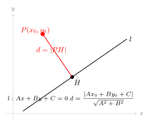
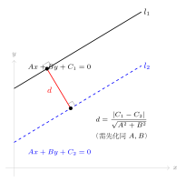

# 点到直线的距离与两平行线距离

> **一例速记**：  
> **点到直线距离**：点 $P(x_0, y_0)$ 到直线 $Ax + By + C = 0$ 的距离
> $$d = \frac{|Ax_0 + By_0 + C|}{\sqrt{A^2 + B^2}}$$
> **两平行线距离**：$l_1: Ax + By + C_1 = 0$，$l_2: Ax + By + C_2 = 0$（$A, B$ 系数相同）
> $$d = \frac{|C_1 - C_2|}{\sqrt{A^2 + B^2}}$$
> **两点距离**（辅助工具）：$d = \sqrt{(x_2-x_1)^2 + (y_2-y_1)^2}$  
> **关键**：点到直线公式分子带绝对值，分母是 $\sqrt{A^2+B^2}$（不是 $A+B$）；两平行线公式要求 $A, B$ 系数完全相同。

---

## 一、引入：求距离 + 写平行线方程

> **题目**：求点 $P(3, 1)$ 到直线 $l: 4x - 3y + 1 = 0$ 的距离，并写出过 $P$ 且与 $l$ 平行的直线方程。

先看一眼：$P$ 在 $l$ 上吗？代入：$4 \times 3 - 3 \times 1 + 1 = 12 - 3 + 1 = 10 \neq 0$——$P$ 不在 $l$ 上，距离不为零，可以继续。

---

## 二、思维路径还原（解题者的内心独白）

> "题目问两件事：距离，以及过 $P$ 的平行直线方程。先搞距离，再写方程。
>
> **第一步：识别公式参数。** $l: 4x - 3y + 1 = 0$，$A = 4, B = -3, C = 1$。点 $P(3, 1)$，$x_0 = 3, y_0 = 1$。
>
> **第二步：代入点到直线距离公式。**
>
> $$d = \frac{|Ax_0 + By_0 + C|}{\sqrt{A^2 + B^2}} = \frac{|4 \times 3 + (-3) \times 1 + 1|}{\sqrt{4^2 + (-3)^2}}$$
>
> 分子：$|12 - 3 + 1| = |10| = 10$。  
> 分母：$\sqrt{16 + 9} = \sqrt{25} = 5$。
>
> $$d = \frac{10}{5} = 2$$
>
> **第三步：写过 $P$ 的平行直线。** 平行线与 $l$ 的 $A, B$ 系数相同，只改常数项：
>
> $$4x - 3y + C = 0$$
>
> 代入点 $P(3, 1)$：$4 \times 3 - 3 \times 1 + C = 12 - 3 + C = 9 + C = 0$，故 $C = -9$。
>
> 平行直线方程：$4x - 3y - 9 = 0$。
>
> **验证**：$P$ 在新直线上：$4 \times 3 - 3 \times 1 - 9 = 12 - 3 - 9 = 0$ ✓。  
> 用两平行线距离公式验证：$d = \dfrac{|1 - (-9)|}{\sqrt{16+9}} = \dfrac{10}{5} = 2$ ✓，与第一步结果一致。
>
> **关键反射：** "点到直线距离"三步走——①读出 $A, B, C, x_0, y_0$；②算分子绝对值；③算分母 $\sqrt{A^2+B^2}$，然后相除。注意分母是 $\sqrt{A^2+B^2}$，绝对不是 $A + B$ 或 $\sqrt{A} + \sqrt{B}$。
>
> **延伸思考：** $P$ 关于 $l$ 的对称点 $P'$ 应该怎么求？先找 $P$ 到 $l$ 的垂足 $H$（垂线斜率 $= -\dfrac{A}{B} = \dfrac{3}{4}$ 方向），$P' = 2H - P$。距离公式是更基础的工具，对称点需要坐标几何进一步处理。"

把这段内心独白读两遍，感受"读参数 → 算分子 → 算分母 → 相除"的四步节奏。

---

## 三、公式全览

### 3.1 点到直线距离公式

（见配图 `geo-p3-04-1`：点 $P$、直线 $l$、垂足 $H$、距离 $d = |PH|$）

点 $P(x_0, y_0)$ 到直线 $l: Ax + By + C = 0$（$A, B$ 不全为零）的距离：

$$\boxed{d = \frac{|Ax_0 + By_0 + C|}{\sqrt{A^2 + B^2}}}$$

**公式中各部分的意义**：
- 分子 $|Ax_0 + By_0 + C|$：将点的坐标代入直线方程左侧，取绝对值
- 分母 $\sqrt{A^2 + B^2}$：直线法向量 $(A, B)$ 的模长
- 绝对值保证距离非负

**特殊情形**：
- 若 $P$ 在 $l$ 上，则 $Ax_0 + By_0 + C = 0$，$d = 0$ ✓
- 坐标原点 $O(0,0)$ 到 $l$ 的距离：$d = \dfrac{|C|}{\sqrt{A^2+B^2}}$

### 3.2 两平行线距离公式

（见配图 `geo-p3-04-2`：两平行线 $l_1, l_2$ 及公共垂线段 $d$）

两平行线 $l_1: Ax + By + C_1 = 0$ 与 $l_2: Ax + By + C_2 = 0$（$A, B$ 系数相同）之间的距离：

$$\boxed{d = \frac{|C_1 - C_2|}{\sqrt{A^2 + B^2}}}$$

**前提**：$A, B$ 系数完全相同（同号同值）。若两平行线的 $A, B$ 系数不同（如倍数关系），必须先化为相同 $A, B$ 再使用公式。

**推导思路**：在 $l_2$ 上取任意一点 $Q\left(x_Q, -\dfrac{Ax_Q + C_2}{B}\right)$（若 $B \neq 0$），代入点到直线公式，算 $Q$ 到 $l_1$ 的距离，化简即得。

### 3.3 两点距离公式

$$d = \sqrt{(x_2 - x_1)^2 + (y_2 - y_1)^2}$$

这是平面几何的基础，在坐标化后的每个距离问题中都是备用工具。

---

## 四、方法变形

### 4.1 含参点的距离条件——解方程

**场景**：点的坐标含参数 $t$，要求距离等于某值，列方程解 $t$。

**步骤**：
1. 写出距离公式 $d(t) = \dfrac{|Ax_0(t) + By_0(t) + C|}{\sqrt{A^2+B^2}} = k$
2. 去分母：$|Ax_0 + By_0 + C| = k\sqrt{A^2+B^2}$
3. 去绝对值（两种情形）：$Ax_0 + By_0 + C = \pm k\sqrt{A^2+B^2}$
4. 分别解出 $t$，检验合理性

### 4.2 距离条件解参——两平行线系数化

**场景**：两平行线的 $A, B$ 系数成倍数关系（如 $l_1: 2x+4y+1=0$，$l_2: x+2y+3=0$），不能直接代公式。

**步骤**：先将其中一条的 $A, B$ 系数化为与另一条相同（乘以适当倍数，**常数项也要同倍数缩放**），再用公式。

**示例**：$l_1: 2x+4y+1=0$，$l_2: x+2y+3=0$。  
将 $l_2$ 乘以 $2$：$2x + 4y + 6 = 0$。  
现在 $A=2, B=4, C_1=1, C_2=6$：

$$d = \frac{|1-6|}{\sqrt{4+16}} = \frac{5}{\sqrt{20}} = \frac{5}{2\sqrt{5}} = \frac{\sqrt{5}}{2}$$

### 4.3 与圆相切的铺垫（Part 4 预告）

当圆心到直线的距离等于圆的半径时，直线与圆相切。  
形式化地：圆心 $O(a,b)$，半径 $r$，直线 $l: Ax+By+C=0$，相切条件：

$$\frac{|Aa + Bb + C|}{\sqrt{A^2+B^2}} = r$$

这正是点到直线距离公式的直接应用，将在 Part 4（圆的方程）中大量使用。现在掌握距离公式，Part 4 可以直接上手。

### 4.4 距离不等式与点的范围

**场景**：要求点 $P(x, y)$ 到某直线的距离大于（或小于）某值，得到不等式，对应平面区域。

$$\frac{|Ax + By + C|}{\sqrt{A^2+B^2}} > k \iff |Ax + By + C| > k\sqrt{A^2+B^2}$$

去绝对值后，得到两个半平面的并（$>$）或两平行线之间的带状区域（$<$）。

---

## 五、思考路标（条件反射训练）

下面每条都要反复内化，遇到对应场景立刻触发：

1. **看到"点到直线距离"** → 立刻想距离公式 $d = \dfrac{|Ax_0+By_0+C|}{\sqrt{A^2+B^2}}$。先识别 $A, B, C$（一般式系数），再识别 $x_0, y_0$（点的坐标），代入算。绝不能把分母写成 $A + B$。

2. **看到"两平行线距离"** → 先检查两线的 $A, B$ 系数是否完全相同。不相同就先化系数，然后再用 $\dfrac{|C_1-C_2|}{\sqrt{A^2+B^2}}$。

3. **看到"点是否在直线上"** → 代入直线方程，看左侧是否为零。为零则在直线上，距离为零；不为零则不在，可以求距离。

4. **距离公式里的绝对值不能省** → 分子 $|Ax_0+By_0+C|$ 中的绝对值保证距离为正数。计算时不要漏掉，特别是含参数时，绝对值去掉要分两种情形。

5. **看到"过已知点且与已知线平行"** → 平行线族 $Ax + By + k = 0$，代点坐标求 $k$，全程不需要斜率。

6. **看到"到直线距离为 $r$"** → 这是圆与直线相切的预告，圆心到切线距离等于半径。先把距离求出来，再和 $r$ 比较：$d > r$ 相离，$d = r$ 相切，$d < r$ 相交。

7. **两线平行的距离公式，系数化是关键步骤** → 忘记先化系数就代公式，$C_1, C_2$ 的分子来自不同倍数，结果错误。化系数时常数项也要同比例缩放。

8. **看到"含参距离条件"** → 设距离 $= k$，得方程 $|Ax_0+By_0+C| = k\sqrt{A^2+B^2}$，去绝对值得两个一次方程，分别解参数。两个解都可能有意义，需要代回检验几何意义是否合理。

9. **原点到直线的距离** → 公式简化：$d = \dfrac{|C|}{\sqrt{A^2+B^2}}$，直接代入 $(0,0)$，分子只剩 $|C|$。

---

## 六、应用例题

### 例 1：含参点的距离

**题目**：点 $P(m, m+1)$ 到直线 $l: 3x - 4y + 2 = 0$ 的距离为 $3$，求 $m$。

**【解答】**

**第一步：识别参数。**

$A = 3, B = -4, C = 2$；$x_0 = m, y_0 = m+1$；$\sqrt{A^2+B^2} = \sqrt{9+16} = 5$。

**第二步：列距离方程。**

$$d = \frac{|3m - 4(m+1) + 2|}{5} = 3$$

分子化简：$3m - 4m - 4 + 2 = -m - 2$。

$$\frac{|-m-2|}{5} = 3 \implies |-m-2| = 15 \implies |m+2| = 15$$

**第三步：去绝对值，分两情形。**

$$m + 2 = 15 \implies m = 13 \qquad \text{或} \qquad m + 2 = -15 \implies m = -17$$

**验证**（$m = 13$）：$d = \dfrac{|-13-2|}{5} = \dfrac{15}{5} = 3$ ✓；（$m = -17$）：$d = \dfrac{|17-2|}{5} = \dfrac{15}{5} = 3$ ✓。

$$\boxed{m = 13 \quad \text{或} \quad m = -17}$$

> 解题要点：含参代入后先化简分子，再去绝对值得两个方程。两个解都合法，不要只取一个。

---

### 例 2：两平行线距离——需化同系数

**题目**：求直线 $l_1: 2x - y + 3 = 0$ 与 $l_2: 4x - 2y + 1 = 0$ 之间的距离。

**【解答】**

**第一步：验证是否平行。**

$l_1$ 的法向量方向 $(2, -1)$，$l_2$ 的法向量方向 $(4, -2) = 2(2, -1)$——成比例，两线平行（或重合）。  
检查是否重合：$\dfrac{2}{4} = \dfrac{-1}{-2} = \dfrac{1}{2}$，但 $\dfrac{3}{1} = 3 \neq \dfrac{1}{2}$，故平行，不重合。

**第二步：化同系数。**

将 $l_1$ 乘以 $2$：$4x - 2y + 6 = 0$。  
现在 $A = 4, B = -2, C_1 = 6, C_2 = 1$，$\sqrt{A^2+B^2} = \sqrt{16+4} = \sqrt{20} = 2\sqrt{5}$。

**第三步：代入两平行线距离公式。**

$$d = \frac{|C_1 - C_2|}{\sqrt{A^2+B^2}} = \frac{|6-1|}{2\sqrt{5}} = \frac{5}{2\sqrt{5}} = \frac{5\sqrt{5}}{10} = \frac{\sqrt{5}}{2}$$

$$\boxed{d = \dfrac{\sqrt{5}}{2}}$$

> 解题要点：两线系数不同时，先把 $A, B$ 化为相同（记得常数项同倍数缩放），再代公式。忘记化系数是常见错误。

---

### 例 3：距离条件确定直线方程

**题目**：过点 $A(2, -1)$ 的直线 $l$，到点 $B(1, 3)$ 的距离为 $2$，求直线 $l$ 的方程。

**【解答】**

**第一步：设直线方程。**

直线过 $A(2, -1)$，设方程为：
- 若斜率存在，用点斜式：$y + 1 = k(x - 2)$，化为 $kx - y - 2k - 1 = 0$。
- 若斜率不存在（竖直线），方程为 $x = 2$。

**第二步：先验竖直线情形。**

$x = 2$（一般式 $1 \cdot x + 0 \cdot y - 2 = 0$）到 $B(1,3)$ 的距离：

$$d = \frac{|1 \times 1 + 0 \times 3 - 2|}{\sqrt{1+0}} = \frac{|1-2|}{1} = 1 \neq 2$$

竖直线不满足，排除。

**第三步：用含斜率方程列距离条件。**

$l: kx - y - 2k - 1 = 0$，$A = k, B = -1, C = -(2k+1)$。点 $B(1,3)$ 到 $l$ 的距离：

$$d = \frac{|k \cdot 1 + (-1) \cdot 3 - (2k+1)|}{\sqrt{k^2+1}} = \frac{|k - 3 - 2k - 1|}{\sqrt{k^2+1}} = \frac{|-k-4|}{\sqrt{k^2+1}} = \frac{|k+4|}{\sqrt{k^2+1}} = 2$$

**第四步：解方程。**

两边平方：

$$\frac{(k+4)^2}{k^2+1} = 4 \implies (k+4)^2 = 4(k^2+1)$$

$$k^2 + 8k + 16 = 4k^2 + 4 \implies 3k^2 - 8k - 12 = 0$$

$$k = \frac{8 \pm \sqrt{64 + 144}}{6} = \frac{8 \pm \sqrt{208}}{6} = \frac{8 \pm 4\sqrt{13}}{6} = \frac{4 \pm 2\sqrt{13}}{3}$$

直线方程：$y + 1 = \dfrac{4 \pm 2\sqrt{13}}{3}(x-2)$，整理后得两条直线。

$$\boxed{k = \frac{4 + 2\sqrt{13}}{3} \text{ 或 } k = \frac{4 - 2\sqrt{13}}{3}}$$

（对应两条满足条件的直线方程，展开后保留精确形式。）

> 解题要点：过一点的直线问题要记得单独验证竖直线情形；斜率存在时列距离等式，两边平方去绝对值得到关于 $k$ 的方程。

---

## 七、思路自测题

**自测 1**　求点 $P(1, -2)$ 到直线 $l: 5x + 12y - 3 = 0$ 的距离。

> 💡 提示：$d = \dfrac{|5 \times 1 + 12 \times (-2) - 3|}{\sqrt{25+144}} = \dfrac{|5 - 24 - 3|}{13} = \dfrac{22}{13}$。

**自测 2**　求两平行线 $l_1: x - 2y + 5 = 0$ 与 $l_2: 2x - 4y + 3 = 0$ 之间的距离。

> 💡 提示：将 $l_1$ 乘以 $2$：$2x-4y+10=0$。$d = \dfrac{|10-3|}{\sqrt{4+16}} = \dfrac{7}{2\sqrt{5}} = \dfrac{7\sqrt{5}}{10}$。

**自测 3**　已知点 $Q(a, 2)$ 到直线 $x + y - 1 = 0$ 的距离为 $\sqrt{2}$，求 $a$。

> 💡 提示：$d = \dfrac{|a+2-1|}{\sqrt{2}} = \dfrac{|a+1|}{\sqrt{2}} = \sqrt{2}$，故 $|a+1| = 2$，$a = 1$ 或 $a = -3$。

**自测 4**　原点 $O$ 到直线 $3x + 4y - 10 = 0$ 的距离是多少？直线上到原点最近的点的坐标是什么？

> 💡 提示：$d = \dfrac{|0+0-10|}{\sqrt{9+16}} = \dfrac{10}{5} = 2$。最近点即垂足，过原点作直线的垂线（斜率 $= -\frac{A}{B} = -\frac{3}{4}$ 的倒数，即 $\frac{4}{3}$），联立求交点 $H = \left(\frac{6}{5}, \frac{8}{5}\right)$。

**自测 5**　直线 $l: 2x + y + c = 0$ 与圆 $x^2 + y^2 = 5$ 相切，求常数 $c$ 的值。

> 💡 提示：圆心 $(0,0)$，半径 $r = \sqrt{5}$。相切条件：$d = r$，即 $\dfrac{|c|}{\sqrt{4+1}} = \sqrt{5}$，$\dfrac{|c|}{\sqrt{5}} = \sqrt{5}$，$|c| = 5$，故 $c = 5$ 或 $c = -5$。

---

**回头看一眼"一例速记"**：

> 点到直线：$d = \dfrac{|Ax_0+By_0+C|}{\sqrt{A^2+B^2}}$；  
> 两平行线：先化同 $A, B$ 系数，再 $d = \dfrac{|C_1-C_2|}{\sqrt{A^2+B^2}}$；  
> 圆相切：圆心到切线距离 $=$ 半径。

如果现在你能不看笔记，独立完成引入题（$P(3,1)$ 到 $4x-3y+1=0$ 的距离，以及过 $P$ 平行直线的方程）并解释分母为什么是 $\sqrt{A^2+B^2}$ 而不是 $A+B$——本章，你拿下了。
