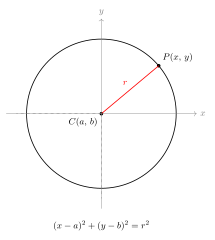
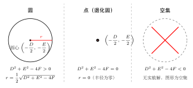

# 圆的标准方程与一般方程

> **一例速记**：  
> 圆心 $(a, b)$，半径 $r$，则圆的**标准方程**为 $(x-a)^2 + (y-b)^2 = r^2$。  
> 展开后整理为**一般方程** $x^2 + y^2 + Dx + Ey + F = 0$。  
> 一般方程表示圆的条件：$D^2 + E^2 - 4F > 0$；  
> 此时圆心为 $\left(-\dfrac{D}{2},\,-\dfrac{E}{2}\right)$，半径 $r = \dfrac{1}{2}\sqrt{D^2+E^2-4F}$。

---

## 一、从几何到代数：圆的标准方程的诞生

### 圆是什么？

在平面上，**到定点距离等于定长的所有点的集合**，叫做圆。定点叫**圆心**，定长叫**半径**。

这个定义本质上是一个**距离条件**，而距离公式已经是代数工具——自然地，我们可以把它翻译成坐标方程。

### 从定义推导标准方程

设圆心为 $C(a, b)$，半径为 $r$（$r > 0$）。圆上动点 $P(x, y)$ 满足：

$$|CP| = r$$

由两点距离公式：

$$\sqrt{(x-a)^2 + (y-b)^2} = r$$

两边平方（$r > 0$，平方不丢解）：

$$\boxed{(x-a)^2 + (y-b)^2 = r^2}$$

这就是圆的**标准方程**。

### 标准方程的三个参数

| 参数 | 含义 |
|------|------|
| $a$ | 圆心横坐标 |
| $b$ | 圆心纵坐标 |
| $r$ | 半径（$r > 0$） |

**特殊情形**：

- 圆心在原点：$a = b = 0$，方程化为 $x^2 + y^2 = r^2$（最简形式）
- 圆心在 $x$ 轴：$b = 0$，方程为 $(x-a)^2 + y^2 = r^2$
- 圆心在 $y$ 轴：$a = 0$，方程为 $x^2 + (y-b)^2 = r^2$

---

## 二、一般方程：标准方程展开后的样子

### 展开标准方程

将 $(x-a)^2 + (y-b)^2 = r^2$ 展开：

$$x^2 - 2ax + a^2 + y^2 - 2by + b^2 = r^2$$

移项整理：

$$x^2 + y^2 - 2ax - 2by + (a^2 + b^2 - r^2) = 0$$

令 $D = -2a$，$E = -2b$，$F = a^2 + b^2 - r^2$，得到**一般方程**：

$$\boxed{x^2 + y^2 + Dx + Ey + F = 0}$$

### 一般方程不一定是圆

一般方程 $x^2 + y^2 + Dx + Ey + F = 0$ 通过**配方**可以还原：

$$\left(x + \frac{D}{2}\right)^2 + \left(y + \frac{E}{2}\right)^2 = \frac{D^2 + E^2 - 4F}{4}$$

右边的值 $\dfrac{D^2 + E^2 - 4F}{4}$ 决定了方程的类型：

| 判别式 $\Delta = D^2 + E^2 - 4F$ | 方程表示 |
|-----------------------------------|---------|
| $\Delta > 0$ | **圆**，圆心 $\left(-\dfrac{D}{2},\,-\dfrac{E}{2}\right)$，半径 $r = \dfrac{1}{2}\sqrt{\Delta}$ |
| $\Delta = 0$ | **点**（半径为零的退化圆），即单点 $\left(-\dfrac{D}{2},\,-\dfrac{E}{2}\right)$ |
| $\Delta < 0$ | **空集**（方程无实数解） |

### 圆心和半径的提取公式

当 $D^2 + E^2 - 4F > 0$ 时，由 $D = -2a$，$E = -2b$，$F = a^2 + b^2 - r^2$ 得：

$$\text{圆心} = \left(-\frac{D}{2},\,-\frac{E}{2}\right), \qquad r = \frac{1}{2}\sqrt{D^2 + E^2 - 4F}$$

**记忆方法**：圆心的坐标是 $D$、$E$ 系数取一半并变号；半径用配方后右边开根号。

---

## 三、两种方程的互转换

### 标准方程 → 一般方程

**直接展开再合并**：

1. 展开各括号的平方
2. 合并 $x^2$、$y^2$、$x$、$y$ 的系数
3. 移项整理为 $x^2 + y^2 + Dx + Ey + F = 0$ 的形式

**例**：将 $(x-2)^2 + (y+3)^2 = 16$ 转为一般方程。

展开：$x^2 - 4x + 4 + y^2 + 6y + 9 = 16$

整理：$x^2 + y^2 - 4x + 6y - 3 = 0$

### 一般方程 → 标准方程

**配方**是唯一路径，步骤固定：

1. 将 $x$ 相关项和 $y$ 相关项分别分组
2. 各自配方（注意等式两边同时加减相同的数）
3. 整理为 $(x-a)^2 + (y-b)^2 = r^2$ 的形式
4. 核查 $r^2 > 0$，否则不是圆

**例**：将 $x^2 + y^2 - 6x + 4y - 3 = 0$ 转为标准方程。

$x$ 分组配方：$(x^2 - 6x) = (x-3)^2 - 9$

$y$ 分组配方：$(y^2 + 4y) = (y+2)^2 - 4$

代回：$(x-3)^2 - 9 + (y+2)^2 - 4 - 3 = 0$

$(x-3)^2 + (y+2)^2 = 16$

圆心 $(3, -2)$，半径 $r = 4$。

---

## 四、三点确定一个圆：两种方法

**原理**：不在同一条直线上的三点唯一确定一个圆。

### 方法一：两条中垂线的交点

三点 $A$、$B$、$C$ 到圆心的距离相等，而垂直平分线（中垂线）上的点到线段两端点距离相等。

**步骤**：

1. 求 $AB$ 的中垂线方程
2. 求 $BC$ 的中垂线方程
3. 解方程组，交点即为圆心 $(a, b)$
4. 圆心到任意一点的距离即为半径 $r$

**例**：过 $A(1, 0)$、$B(3, 0)$、$C(0, 2)$ 三点作圆，求圆的方程。

$AB$ 中点 $(2, 0)$，$AB$ 水平，中垂线为 $x = 2$。

$BC$ 中点 $\left(\dfrac{3}{2}, 1\right)$，$BC$ 斜率为 $\dfrac{2-0}{0-3} = -\dfrac{2}{3}$，中垂线斜率为 $\dfrac{3}{2}$。

中垂线方程：$y - 1 = \dfrac{3}{2}\left(x - \dfrac{3}{2}\right)$，即 $y = \dfrac{3}{2}x - \dfrac{5}{4}$。

代入 $x = 2$：$y = 3 - \dfrac{5}{4} = \dfrac{7}{4}$。

圆心 $\left(2, \dfrac{7}{4}\right)$，半径 $r = |CA| = \sqrt{(2-1)^2 + \left(\dfrac{7}{4}\right)^2} = \sqrt{1 + \dfrac{49}{16}} = \sqrt{\dfrac{65}{16}} = \dfrac{\sqrt{65}}{4}$。

方程：$(x-2)^2 + \left(y - \dfrac{7}{4}\right)^2 = \dfrac{65}{16}$。

### 方法二：代入一般方程，解线性方程组

**步骤**：

1. 设一般方程 $x^2 + y^2 + Dx + Ey + F = 0$
2. 将三点坐标逐一代入，得 3 个方程
3. 解关于 $D$、$E$、$F$ 的线性方程组

这是更系统的代数方法，尤其适合坐标较复杂时。

**例**（同上）：代入 $A(1, 0)$：$1 + D + F = 0$；代入 $B(3, 0)$：$9 + 3D + F = 0$；代入 $C(0, 2)$：$4 + 2E + F = 0$。

$(2) - (1)$：$8 + 2D = 0$，故 $D = -4$；代入 $(1)$：$F = 3$；代入 $(3)$：$2E = -7$，故 $E = -\dfrac{7}{2}$。

方程：$x^2 + y^2 - 4x - \dfrac{7}{2}y + 3 = 0$，即 $(x-2)^2 + \left(y - \dfrac{7}{4}\right)^2 = \dfrac{65}{16}$，与方法一一致。

---

## 五、典型应用例题

### 例 1：由标准方程提取圆心、半径

**题目**：已知圆的方程为 $(x+1)^2 + (y-3)^2 = 5$，写出圆心和半径。

**【思路】** 标准方程 $(x-a)^2 + (y-b)^2 = r^2$ 中，圆心是 $(a, b)$，半径是 $r$（注意是 $r$，不是 $r^2$）。  
这里 $x+1 = x-(-1)$，故 $a = -1$；$y-3$ 对应 $b = 3$；$r^2 = 5$，故 $r = \sqrt{5}$。

**解**：圆心 $(-1, 3)$，半径 $r = \sqrt{5}$。

---

### 例 2：一般方程配方求圆心、半径

**题目**：判断方程 $x^2 + y^2 + 2x - 4y - 4 = 0$ 是否表示圆，若是，求圆心和半径。

**【思路】** 先配方，再看右边是否正数。

**解**：

$x$ 配方：$(x^2 + 2x) = (x+1)^2 - 1$

$y$ 配方：$(y^2 - 4y) = (y-2)^2 - 4$

代回：$(x+1)^2 - 1 + (y-2)^2 - 4 - 4 = 0$

$(x+1)^2 + (y-2)^2 = 9$

$r^2 = 9 > 0$，方程表示圆，圆心 $(-1, 2)$，半径 $r = 3$。

---

### 例 3：三点定圆

**题目**：已知 $A(4, 0)$、$B(0, -2)$、$C(-1, 3)$ 三点，求过这三点的圆的方程。

**【思路】** 设一般方程代入三点，解 $D$、$E$、$F$。

**解**：设方程 $x^2 + y^2 + Dx + Ey + F = 0$。

代入 $A(4, 0)$：$16 + 4D + F = 0$ ……①

代入 $B(0, -2)$：$4 - 2E + F = 0$ ……②

代入 $C(-1, 3)$：$10 - D + 3E + F = 0$ ……③

由①：$F = -16 - 4D$；代入②：$4 - 2E - 16 - 4D = 0$，即 $-4D - 2E = 12$，即 $2D + E = -6$ ……④

代入③：$10 - D + 3E - 16 - 4D = 0$，即 $-5D + 3E = 6$ ……⑤

由④：$E = -6 - 2D$；代入⑤：$-5D + 3(-6-2D) = 6$，即 $-11D = 24$，$D = -\dfrac{24}{11}$。

$E = -6 + \dfrac{48}{11} = -\dfrac{18}{11}$；$F = -16 + \dfrac{96}{11} = -\dfrac{80}{11}$。

验证 $\Delta = D^2 + E^2 - 4F = \dfrac{576}{121} + \dfrac{324}{121} + \dfrac{320}{11} = \dfrac{576+324}{121} + \dfrac{3520}{121} = \dfrac{4420}{121} > 0$，是圆。

圆的方程：

$$x^2 + y^2 - \frac{24}{11}x - \frac{18}{11}y - \frac{80}{11} = 0$$

配方（或直接用圆心公式）：圆心 $\left(\dfrac{12}{11}, \dfrac{9}{11}\right)$，$r = \dfrac{1}{2}\sqrt{\dfrac{4420}{121}} = \dfrac{\sqrt{4420}}{22} = \dfrac{\sqrt{1105}}{11}$。

---

## 六、易错点汇总

**易错 1：一般方程的 $x^2$、$y^2$ 系数必须都是 1**

一般方程 $x^2 + y^2 + Dx + Ey + F = 0$ 要求 $x^2$ 和 $y^2$ 的系数均为 $1$。若出现 $2x^2 + 2y^2 + \cdots = 0$，须先除以 $2$，否则配方结果有误，提取的圆心、半径都是错的。

**易错 2：配方时等式两边没有同步加减**

配 $x^2 + 2x$ 时需加 $1$：$(x^2 + 2x + 1) - 1 = (x+1)^2 - 1$。左边"补上"的 $1$，必须在右边（或整体）"减去"。遗漏这一步会导致等式不平衡，圆心、半径全错。

**易错 3：$r^2 = r$ 的混淆**

标准方程右边是 $r^2$，不是 $r$。例如 $(x-1)^2 + (y+2)^2 = 5$，半径是 $\sqrt{5}$，而不是 $5$。在求面积、周长等进一步计算时，用 $r^2$ 还是 $r$ 区分清楚。

**易错 4：不验证 $D^2 + E^2 - 4F > 0$ 就直接称"是圆"**

遇到一般方程，必须先判断判别式的正负。有的题目会故意给出 $\Delta = 0$（点）或 $\Delta < 0$（空集）的情形，若不验证就写"圆心是……"会失分。

**易错 5：三点定圆时忘记检验三点不共线**

如果三点共线，则不存在过它们的圆（无解或矛盾方程组）。做题时若方程组出现矛盾（例如 $0 = 6$），需回头检查三点是否共线。正式解答中写"三点不共线，故存在唯一圆"更严谨。

---

## 七、自测题

**自测 1**　写出圆心 $(-2, 5)$、半径 $3$ 的圆的标准方程，并将其转化为一般方程。

> 提示：标准方程 $(x+2)^2 + (y-5)^2 = 9$；展开整理：$x^2 + y^2 + 4x - 10y + 20 = 0$。

**自测 2**　判断方程 $x^2 + y^2 - 4x + 6y + 13 = 0$ 表示什么图形。

> 提示：$D = -4, E = 6, F = 13$，$\Delta = 16 + 36 - 52 = 0$，表示单点 $(2, -3)$。

**自测 3**　已知圆过原点 $O(0, 0)$，且圆心在直线 $y = 2x$ 上，半径为 $\sqrt{5}$，求圆的方程。

> 提示：设圆心 $(a, 2a)$，则 $a^2 + (2a)^2 = 5$（原点到圆心距离等于半径），$5a^2 = 5$，$a = \pm 1$。  
> 两个圆：$(x-1)^2 + (y-2)^2 = 5$（圆心 $(1,2)$）和 $(x+1)^2 + (y+2)^2 = 5$（圆心 $(-1,-2)$）。

**自测 4**　过点 $A(1, 2)$、$B(3, 4)$，且圆心在 $x$ 轴上的圆的方程是什么？

> 提示：设圆心 $(a, 0)$，由 $|CA|^2 = |CB|^2$：$(a-1)^2 + 4 = (a-3)^2 + 16$，展开得 $-2a + 5 = -6a + 25$，$4a = 20$，$a = 5$。  
> $r^2 = (5-1)^2 + (0-2)^2 = 16 + 4 = 20$，方程为 $(x-5)^2 + y^2 = 20$。

---

**回头看"一例速记"**：

> 标准方程 $(x-a)^2 + (y-b)^2 = r^2$：圆心 $(a, b)$，半径 $r$。  
> 一般方程转标准方程：**配方**；标准方程转一般方程：**展开**。  
> 表示圆的充要条件：$D^2 + E^2 - 4F > 0$；等于 $0$ 是点，小于 $0$ 是空集。  
> 三点定圆：中垂线交点法（几何）或代入一般方程解 $D, E, F$（代数）。

能不看提示独立完成自测 3 和自测 4 的完整推导——本章，你拿下了。
