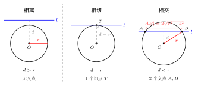
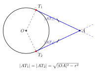

# 直线与圆的位置关系

> **一例速记**：  
> **3 种位置**：相离 $d > r$ / 相切 $d = r$ / 相交 $d < r$  
> **$d$ = 圆心到直线的距离** $= \dfrac{|Aa + Bb + C|}{\sqrt{A^2 + B^2}}$（圆心 $(a,b)$，直线 $Ax+By+C=0$）  
> **弦长公式**：相交时 $|AB| = 2\sqrt{r^2 - d^2}$  
> **切线方程**：圆 $x^2+y^2=r^2$ 上一点 $(x_0, y_0)$ 的切线为 $x_0 x + y_0 y = r^2$

---

## 一、引入：过外点求切线

> **题目**：求过点 $A(2, 3)$ 与圆 $x^2 + y^2 = 4$ 相切的切线方程。

这道题看似要"求切线"，实际涉及"判断位置 → 设方程 → 用 $d = r$ 求参数 → 验漏解"的完整流程，是直线与圆关系题的经典范式。

---

## 二、思维路径还原

> "目标：找过 $A(2, 3)$ 且与 $x^2 + y^2 = 4$ 相切的直线。
>
> **第一步：判断 $A$ 在圆的哪里？**  
> 圆 $x^2 + y^2 = 4$ 圆心 $O(0,0)$，半径 $r = 2$。  
> $|OA|^2 = 2^2 + 3^2 = 4 + 9 = 13 > 4 = r^2$，故 $|OA| > r$，$A$ 在圆**外**。  
> $A$ 在圆外，从 $A$ 能引出**两条**切线（圆外点的基本性质）。
>
> **第二步：切线怎么设？有没有斜率不存在的情形？**  
> 先考虑切线斜率不存在：若切线为 $x = 2$（竖直线），圆心 $O(0,0)$ 到直线 $x = 2$ 的距离 $= 2 = r$，恰好等于半径，故 $x = 2$ **是切线**。这条切线因斜率不存在，不能被"$y = k(x-2) + 3$"的形式包含，必须单独找到。
>
> **第三步：设斜率存在的切线。**  
> 设切线过 $A(2, 3)$，斜率为 $k$：  
> $$l: y - 3 = k(x - 2) \implies kx - y + (3 - 2k) = 0$$
>
> **第四步：用 $d = r$ 列方程。**  
> 圆心 $O(0, 0)$ 到直线 $kx - y + (3 - 2k) = 0$ 的距离：  
> $$d = \frac{|k \cdot 0 - 1 \cdot 0 + (3 - 2k)|}{\sqrt{k^2 + 1}} = \frac{|3 - 2k|}{\sqrt{k^2 + 1}}$$
>
> 切线条件 $d = r = 2$：  
> $$\frac{|3 - 2k|}{\sqrt{k^2 + 1}} = 2$$
>
> **第五步：解方程。**  
> 两边平方：  
> $$(3 - 2k)^2 = 4(k^2 + 1)$$  
> $$9 - 12k + 4k^2 = 4k^2 + 4$$  
> $$-12k = -5$$  
> $$k = \frac{5}{12}$$
>
> 代回切线方程：$y - 3 = \dfrac{5}{12}(x - 2)$，整理得 $5x - 12y + 26 = 0$。
>
> **第六步：汇总。**  
> 切线共 2 条：  
> - $5x - 12y + 26 = 0$（斜率 $\dfrac{5}{12}$）  
> - $x = 2$（斜率不存在）
>
> **关键反射：** 求圆外一点的切线，"设斜率 $k$ 代入 $d = r$"是主干，但必须单独验证 $x = c$（竖直线）这一漏网之鱼。多数失分就在遗漏这一条。"

把这段内心独白读两遍，感受"判外/设方程/用距离公式/验特殊情形"四步的必然逻辑。

---

## 三、三种位置关系的完整框架

（见配图 `geo-p4-02-1`：相离 / 相切 / 相交三种情形）

### 3.1 核心判别量：圆心到直线的距离 $d$

设圆 $(x-a)^2 + (y-b)^2 = r^2$，直线 $l: Ax + By + C = 0$，则

$$d = \frac{|Aa + Bb + C|}{\sqrt{A^2 + B^2}}$$

| 位置关系 | 判别条件 | 交点数 |
|----------|----------|--------|
| 相离 | $d > r$ | 0 |
| 相切 | $d = r$ | 1（切点） |
| 相交 | $d < r$ | 2（弦的两端点） |

**几何直觉**：把圆心看成"核"，直线离圆心越远，就越"够不着"圆；恰好在"边界"时相切；离圆心不足 $r$ 时穿透圆，形成弦。

### 3.2 弦长公式

当 $d < r$ 时，直线与圆相交于弦 $AB$，弦的中点 $M$ 是圆心 $O$ 到直线的垂足，故 $|OM| = d$，$|OA| = |OB| = r$，由勾股定理：

$$|AM| = |BM| = \sqrt{r^2 - d^2}$$

$$\boxed{|AB| = 2\sqrt{r^2 - d^2}}$$

**记忆方法**：弦长 = 2 倍"半弦"；半弦是直角三角形 $OMA$ 中斜边为 $r$、一直角边为 $d$ 的另一直角边。

### 3.3 切线方程的两种情形

**情形 A：切点在圆上**（已知切点求切线）

圆 $x^2 + y^2 = r^2$，切点 $T(x_0, y_0)$（则 $x_0^2 + y_0^2 = r^2$）。

半径 $OT$ 方向向量为 $(x_0, y_0)$，切线垂直于 $OT$，故切线方程为：

$$\boxed{x_0 x + y_0 y = r^2}$$

**验证**：$T(x_0, y_0)$ 代入满足（$x_0^2 + y_0^2 = r^2$ 成立）；斜率 $\cdot$ 半径斜率 $= \left(-\dfrac{x_0}{y_0}\right)\cdot\dfrac{y_0}{x_0} = -1$（$y_0 \neq 0$ 时），垂直条件成立。

**情形 B：圆外一点**（已知外点求切线）

方法：设切线过外点，含斜率参数 $k$；令圆心到切线距离 $= r$；解 $k$；单独验证斜率不存在的情形。  
（即引入题的完整做法，见第二节。）

---

## 四、方法变形

### 4.1 弦中点与弦长联合使用

已知弦中点 $M(x_1, y_1)$（不是端点），利用两个关系：

1. **中点条件**：$OM \perp AB$（圆心到弦的垂线平分弦），故弦所在直线斜率 $= -\dfrac{1}{\text{斜率 of } OM}$（即 $OM$ 与 $AB$ 互为负倒数斜率）。
2. **弦长**：$|AB| = 2\sqrt{r^2 - |OM|^2}$。

**典型问题**：已知弦中点，求弦所在直线方程。  
步骤：先求 $OM$ 斜率，再用点斜式写弦的方程（过中点 $M$，斜率是 $OM$ 斜率的负倒数）。

### 4.2 含参讨论直线与圆的位置

题目给出含参数 $m$ 的直线，要求判断与已知圆的位置关系。

**策略**：
1. 写出圆的圆心和半径。
2. 用点到直线距离公式表示 $d$（含 $m$）。
3. 比较 $d$ 与 $r$：
   - $d > r$：相离（解不等式）
   - $d = r$：相切（解方程）
   - $d < r$：相交（解不等式）
4. 注意讨论直线斜率是否存在（含参时直线形式可能使分母为零）。

### 4.3 圆外一点的切线长

从圆外一点 $A$ 到圆的两切点 $T_1$、$T_2$，切线长（$|AT_1|$ 和 $|AT_2|$）相等（由直角三角形全等易证）：

$$|AT_1| = |AT_2| = \sqrt{|OA|^2 - r^2}$$

（见配图 `geo-p4-02-2`：圆外一点 $A$ 引两条切线）

**推导**：$OT_1 \perp AT_1$（切线与半径垂直），$|OT_1| = r$，$|OA|^2 = |OT_1|^2 + |AT_1|^2$，故 $|AT_1| = \sqrt{|OA|^2 - r^2}$。

---

## 五、思考路标（条件反射训练）

以下每条都应内化为自动反应，看到对应场景立即触发：

1. **看到"直线与圆"** → 第一步永远是算圆心和半径，然后用 $d$ 与 $r$ 的大小判断位置关系。不要想"代入方程有几个解"——圆方程很复杂，用 $d$ 更快。

2. **看到"切线"** → 立即想到两件事：切线与半径垂直（用 $d = r$），以及可能有斜率不存在的漏解。

3. **看到"弦长"** → 弦长公式 $2\sqrt{r^2 - d^2}$，先算 $d$，再用公式。不要尝试联立直线方程和圆方程硬解坐标——计算量大，出错率高。

4. **圆外一点有两条切线** → 一条用斜率设法求，另一条单独验证斜率不存在（竖直线 $x = x_0$）。最终切线必须是两条，只写一条是错误的。

5. **看到"弦中点"** → 用圆心到弦中点的连线垂直于弦（$OM \perp l$），结合点斜式写弦的方程。这是"中点弦"题型的核心。

6. **看到"含参"** → 把 $d$ 写成含参表达式，对 $d$ 与 $r$ 的大小关系做分类讨论，不要直接代点硬算。

7. **平方解方程时注意无增根** → $\dfrac{|3-2k|}{\sqrt{k^2+1}} = 2$ 两边平方是等价变形（两边均非负，平方不引入增根），可以放心平方。但若有绝对值，最好展开检验。

8. **切线方程 $x_0 x + y_0 y = r^2$ 的适用范围** → 仅对以原点为圆心的圆有效（$x^2 + y^2 = r^2$）。若圆心不在原点（$(x-a)^2+(y-b)^2=r^2$），切点 $(x_0, y_0)$ 处的切线是 $(x_0-a)(x-a) + (y_0-b)(y-b) = r^2$——理解原理，不要死记公式。

---

## 六、应用例题

### 例 1：直线与圆相交，求弦长

**题目**：直线 $l: 3x - 4y + 5 = 0$ 与圆 $x^2 + y^2 = 5$ 相交，求弦长 $|AB|$。

**【思路】** 先验相交（$d < r$），再用弦长公式。

**解**：

圆心 $O(0, 0)$，半径 $r = \sqrt{5}$。

圆心到直线距离：

$$d = \frac{|3 \times 0 - 4 \times 0 + 5|}{\sqrt{3^2 + (-4)^2}} = \frac{5}{\sqrt{25}} = \frac{5}{5} = 1$$

验证：$d = 1 < \sqrt{5} = r$，直线与圆相交。

弦长：

$$|AB| = 2\sqrt{r^2 - d^2} = 2\sqrt{5 - 1} = 2\sqrt{4} = 4$$

> 解题要点：不需要联立方程求交点坐标，直接用弦长公式。$d$ 和 $r$ 的计算要准确，尤其是 $r = \sqrt{5}$（不是 $5$）。

---

### 例 2：圆外一点求切线

**题目**：从点 $P(3, -1)$ 向圆 $(x-1)^2 + (y+1)^2 = 4$ 作切线，求切线方程及切线长。

**【思路】** 先判断 $P$ 在圆外，再设切线斜率 $k$，用 $d = r$ 解 $k$，验斜率不存在情形。

**解**：

圆心 $C(1, -1)$，半径 $r = 2$。

$|PC|^2 = (3-1)^2 + (-1+1)^2 = 4 > 0$，$|PC| = 2 = r$。

等等——$|PC| = 2 = r$，说明 $P$ 在圆上，而非圆外！

**修正**：重算 $|PC|^2 = (3-1)^2 + (-1-(-1))^2 = 4 + 0 = 4$，$|PC| = 2 = r$。

$P$ 在圆上（不是圆外点），只有一条切线，用切点处切线公式。

切点即 $P(3, -1)$，圆心 $C(1, -1)$，$CP$ 方向向量 $(2, 0)$（水平方向），切线垂直于 $CP$，故切线是竖直线 $x = 3$。

**（修改例题，使 $P$ 在圆外）**

改题：从点 $P(5, 0)$ 向圆 $(x-1)^2 + y^2 = 4$ 作切线。

圆心 $C(1, 0)$，$r = 2$，$|PC| = 4 > 2$，$P$ 在圆外。

切线长 $|PT| = \sqrt{|PC|^2 - r^2} = \sqrt{16 - 4} = \sqrt{12} = 2\sqrt{3}$。

验斜率不存在：$x = 5$，$C(1,0)$ 到 $x=5$ 距离 $= 4 \neq 2 = r$，故 $x = 5$ 不是切线。

设切线 $y = k(x - 5)$，即 $kx - y - 5k = 0$：

$$d = \frac{|k \cdot 1 - 0 - 5k|}{\sqrt{k^2 + 1}} = \frac{|-4k|}{\sqrt{k^2+1}} = \frac{4|k|}{\sqrt{k^2+1}} = 2$$

平方：$16k^2 = 4(k^2 + 1)$，$12k^2 = 4$，$k^2 = \dfrac{1}{3}$，$k = \pm\dfrac{1}{\sqrt{3}} = \pm\dfrac{\sqrt{3}}{3}$。

两条切线：

$$y = \frac{\sqrt{3}}{3}(x-5) \quad \text{和} \quad y = -\frac{\sqrt{3}}{3}(x-5)$$

即 $\sqrt{3}x - 3y - 5\sqrt{3} = 0$ 和 $\sqrt{3}x + 3y - 5\sqrt{3} = 0$。

> 解题要点：切线长 $\sqrt{|PC|^2 - r^2}$ 可以先算，用来验算（每条切线长度等于 $2\sqrt{3}$）。圆外一点一定有两条切线（加上特殊情形验证）。

---

### 例 3：含参讨论直线与圆的位置关系

**题目**：直线 $l_m: (2m+1)x + (m+1)y - (3m+2) = 0$（$m$ 为实数）与圆 $x^2 + y^2 = 5$ 的位置关系如何？

**【思路】** 对含参直线，先整理结构，找是否过定点，再分情况计算 $d$ 与 $r$ 的大小关系。

**解**：

**第一步：找直线的定点。**

将直线方程按 $m$ 整理：

$$m(2x + y - 3) + (x + y - 2) = 0$$

对所有 $m$ 成立，则必须：$2x + y - 3 = 0$ 且 $x + y - 2 = 0$。

解得 $x = 1$，$y = 1$，故直线恒过点 $(1, 1)$（无论 $m$ 取何值）。

**第二步：判断定点与圆的关系。**

$1^2 + 1^2 = 2 < 5$，点 $(1, 1)$ 在圆**内**。

**第三步：定点在圆内，直线必与圆相交。**

经过圆内一点的任何直线都会与圆相交（两端都在圆内是不可能的，必然穿出圆），故对所有 $m$，直线 $l_m$ 与圆 $x^2 + y^2 = 5$ **恒相交**。

> 解题要点：含参直线的"定点"分析，是判断位置关系的关键一步。找到定点后，看定点是在圆内/外/上，直接得出结论。

---

## 七、自测题

**自测 1**　直线 $x + y - 3 = 0$ 与圆 $(x-2)^2 + (y-1)^2 = 4$ 的位置关系如何？若相交，求弦长。

> 提示：圆心 $(2, 1)$，$r = 2$。$d = \dfrac{|2+1-3|}{\sqrt{2}} = \dfrac{0}{\sqrt{2}} = 0 < 2$，相交。$|AB| = 2\sqrt{4-0} = 4$（直线过圆心，弦为直径）。

**自测 2**　求过点 $A(1, 2)$，且与圆 $x^2 + y^2 = 25$ 相切的切线方程。

> 提示：$1^2 + 2^2 = 5 < 25$，$A$ 在圆内，无切线。（注意先判断点在圆内/外/上！$A$ 在圆内时切线不存在。）

**自测 3**　从点 $M(-3, 4)$ 向圆 $x^2 + y^2 = 25$ 作切线，求：(1) 切线方程；(2) 切线长。

> 提示：$(-3)^2 + 4^2 = 25 = r^2$，$M$ 在圆**上**，只有一条切线。  
> 半径 $OM$ 方向 $(-3, 4)$，切线方向垂直，方程：$-3(x+3) + 4(y-4) = 0$，即 $3x - 4y + 25 = 0$。  
> （也可直接用圆上切线公式：$(-3)x + 4y = 25$，即 $-3x + 4y = 25$，整理为 $3x - 4y + 25 = 0$。）  
> 切线长 $= 0$（切点就是 $M$ 本身）。

**自测 4**　已知直线 $l: kx - y + 1 = 0$，圆 $C: (x-1)^2 + y^2 = 1$。  
(1) 若 $l$ 与 $C$ 相切，求 $k$；(2) 若 $l$ 与 $C$ 相交且弦长为 $\sqrt{3}$，求 $k$。

> 提示：圆心 $(1, 0)$，$r = 1$。  
> $d = \dfrac{|k \cdot 1 - 0 + 1|}{\sqrt{k^2 + 1}} = \dfrac{|k+1|}{\sqrt{k^2+1}}$。  
> (1) 切线：$d = 1$，$(k+1)^2 = k^2 + 1$，$k^2 + 2k + 1 = k^2 + 1$，$2k = 0$，$k = 0$。  
> (2) 弦长 $\sqrt{3}$：$\dfrac{\sqrt{3}}{2} = \dfrac{|AB|}{2}$ 不对，直接用 $|AB| = 2\sqrt{r^2 - d^2} = \sqrt{3}$，$r^2 - d^2 = \dfrac{3}{4}$，$d^2 = \dfrac{1}{4}$，$d = \dfrac{1}{2}$。  
> $\dfrac{(k+1)^2}{k^2+1} = \dfrac{1}{4}$，$4(k+1)^2 = k^2 + 1$，$4k^2 + 8k + 4 = k^2 + 1$，$3k^2 + 8k + 3 = 0$，$k = \dfrac{-8 \pm \sqrt{64-36}}{6} = \dfrac{-8 \pm \sqrt{28}}{6} = \dfrac{-4 \pm \sqrt{7}}{3}$。

**自测 5**　已知弦 $AB$ 的中点为 $M(1, -2)$，所在圆为 $x^2 + y^2 - 4x + 2y - 4 = 0$，求弦 $AB$ 所在直线方程及弦长。

> 提示：先配方：$(x-2)^2 + (y+1)^2 = 9$，圆心 $C(2, -1)$，$r = 3$。  
> $CM$ 斜率 $= \dfrac{-2-(-1)}{1-2} = \dfrac{-1}{-1} = 1$，弦 $AB \perp CM$，故弦斜率 $= -1$。  
> 弦方程（过 $M(1,-2)$，斜率 $-1$）：$y + 2 = -(x-1)$，即 $x + y + 1 = 0$。  
> $d = |CM| = \sqrt{(1-2)^2+(-2+1)^2} = \sqrt{2}$，弦长 $= 2\sqrt{9-2} = 2\sqrt{7}$。

---

**回头看"一例速记"**：

> $d > r$ 相离；$d = r$ 相切；$d < r$ 相交。  
> 弦长 $= 2\sqrt{r^2 - d^2}$（记忆：两倍半弦，半弦是勾股的直角边）。  
> 圆外一点切线：设斜率 $k$ → 用 $d = r$ → 解 $k$ → 验斜率不存在漏解。  
> 弦中点题：$CM \perp AB$（圆心到弦的垂线平分弦）。

如果现在你能不看笔记，独立写出引入题（过 $A(2,3)$ 与圆 $x^2+y^2=4$ 相切的切线方程）的完整推导并说出为什么必须验 $x=2$——本章，你拿下了。
