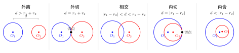
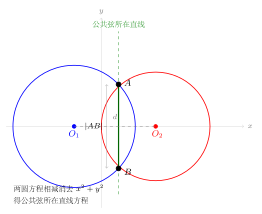

# 圆与圆的位置关系

> **一例速记**：  
> 两圆圆心距为 $d$，半径分别为 $r_1$、$r_2$（设 $r_1 \geq r_2$）。  
> 外离：$d > r_1 + r_2$；外切：$d = r_1 + r_2$；相交：$|r_1 - r_2| < d < r_1 + r_2$；  
> 内切：$d = |r_1 - r_2|$；内含：$d < |r_1 - r_2|$（含同心圆 $d = 0$）。  
> **公共弦方程**：两圆标准方程展开后相减，消去 $x^2 + y^2$ 项，所得一次方程即公共弦所在直线。

---

## 一、为什么需要研究圆与圆的位置关系

直线与圆的位置关系只有 3 种（相离、相切、相交），因为直线无"大小"之分。但两个圆各自有圆心和半径，"大圆包小圆""两圆部分重叠"等情形直线与圆中不会出现，因此圆与圆之间的位置关系更丰富，共有**5 种**。

理解这 5 种关系，不仅是几何直觉的基础，更直接服务于以下问题：

- 判断两圆是否有公共点（及公共点个数）
- 求两圆的公共弦方程与弦长
- 含参数的圆族中，讨论参数取何值时两圆满足某种位置关系

---

## 二、5 种位置关系的定义与判别

### 基本设定

设两圆圆心分别为 $O_1$、$O_2$，半径分别为 $r_1$、$r_2$（均为正数），圆心距

$$d = |O_1 O_2|$$

不妨设 $r_1 \geq r_2 > 0$（若 $r_1 < r_2$ 则内含方向相反，但条件形式完全相同）。

### 5 种位置关系一览

**1. 外离（相离于两圆外）**

两圆没有公共点，且一圆不在另一圆内部。

$$\boxed{d > r_1 + r_2}$$

几何含义：圆心距大于两半径之和，两圆完全分离，互不相交也不内含。

**2. 外切**

两圆恰好有 1 个公共点，且该点在两圆圆心连线的延长线上（圆的外侧）。

$$\boxed{d = r_1 + r_2}$$

几何含义：两圆"外侧"恰好接触，切点在两圆心之间靠外的位置。

**3. 相交**

两圆有 2 个公共点。

$$\boxed{|r_1 - r_2| < d < r_1 + r_2}$$

几何含义：圆心距介于两半径之差（绝对值）与两半径之和之间，两圆部分重叠，形成公共弦 $AB$。

**4. 内切**

两圆恰好有 1 个公共点，且该点在两圆圆心连线上（两圆内侧相切）。

$$\boxed{d = |r_1 - r_2|}$$

几何含义：较小圆内嵌于较大圆，两圆在连线延长方向上恰好接触。切点、两圆心三点共线。

**5. 内含（内离）**

两圆没有公共点，且较小圆完全在较大圆内部。

$$\boxed{d < |r_1 - r_2|}$$

特殊情形：$d = 0$ 为同心圆（不同半径），也属内含（公共点数为 0）。

### 公共点个数汇总

| 位置关系 | 判别条件 | 公共点数 |
|---------|---------|---------|
| 外离    | $d > r_1 + r_2$ | 0 |
| 外切    | $d = r_1 + r_2$ | 1 |
| 相交    | $\lvert r_1 - r_2 \rvert < d < r_1 + r_2$ | 2 |
| 内切    | $d = \lvert r_1 - r_2 \rvert$，$r_1 \neq r_2$ | 1 |
| 内含    | $d < \lvert r_1 - r_2 \rvert$ | 0 |

> **记忆口诀**：从外向内，公共点数依次为 0、1、2、1、0。相交时最多，两侧各 0 个。

---

## 三、公共弦方程

### 背景

当两圆**相交**时，两个公共点 $A$、$B$ 确定一条线段，称为**公共弦**。连接 $A$、$B$ 的直线称为公共弦所在直线。

### 推导方法：两圆方程相减

设两圆的一般方程为：

$$C_1: x^2 + y^2 + D_1 x + E_1 y + F_1 = 0$$

$$C_2: x^2 + y^2 + D_2 x + E_2 y + F_2 = 0$$

两圆的公共点 $(x_0, y_0)$ 同时满足这两个方程。将两式相减：

$$(D_1 - D_2)x + (E_1 - E_2)y + (F_1 - F_2) = 0$$

这就是**公共弦所在直线**的方程。

**关键点**：
- 相减恰好消去 $x^2 + y^2$ 项，得到一次方程（直线）
- 该直线方程由两圆的任意公共点满足，且公共点恰好有两个（相交时），故公共点都在这条直线上
- 这条直线就是公共弦所在直线（含公共弦延长线）

> **注意**：即使两圆不相交（如外离），两方程相减仍能得到一条直线，但此时该直线没有与两圆同时交于实数点的意义，通常称为"根轴"（radical axis），高中阶段不要求。

### 公共弦长度

求公共弦 $|AB|$ 的步骤：

1. 由两圆方程相减，得公共弦所在直线 $l$
2. 选其中一个圆（如 $C_1$，圆心 $O_1$，半径 $r_1$），计算圆心 $O_1$ 到直线 $l$ 的距离 $d_1$
3. 由弦长公式：

$$\boxed{|AB| = 2\sqrt{r_1^2 - d_1^2}}$$

（也可用 $C_2$ 进行同样计算，结果相同）

---

## 四、典型应用例题

### 例 1：判断两圆的位置关系

**题目**：判断圆 $C_1: x^2 + y^2 = 4$ 与圆 $C_2: (x-3)^2 + y^2 = 1$ 的位置关系。

**【思路】** 分别读出圆心、半径，计算圆心距，与 $r_1 + r_2$、$|r_1 - r_2|$ 比较。

**解**：

$C_1$：圆心 $O_1 = (0, 0)$，半径 $r_1 = 2$

$C_2$：圆心 $O_2 = (3, 0)$，半径 $r_2 = 1$

圆心距：$d = |O_1 O_2| = \sqrt{(3-0)^2 + 0^2} = 3$

两半径之和：$r_1 + r_2 = 2 + 1 = 3$

两半径之差（绝对值）：$|r_1 - r_2| = |2 - 1| = 1$

因为 $d = 3 = r_1 + r_2$，故两圆**外切**，有且只有 1 个公共点。

**验证**：切点在 $O_1 O_2$ 连线上距 $O_1$ 为 $r_1 = 2$ 处，即点 $(2, 0)$。代入 $C_1$：$4 + 0 = 4$ ✓；代入 $C_2$：$(2-3)^2 + 0 = 1$ ✓。

---

### 例 2：求公共弦方程与弦长

**题目**：已知两圆 $C_1: x^2 + y^2 - 4x + 2 = 0$ 和 $C_2: x^2 + y^2 + 2x - 8 = 0$，求两圆的公共弦所在直线方程及公共弦长。

**【思路】** 先验证两圆相交，再用两方程相减求公共弦方程，最后用弦长公式。

**解**：

**第一步**：化标准方程。

$C_1$：$(x-2)^2 + y^2 = 2$，圆心 $O_1 = (2, 0)$，半径 $r_1 = \sqrt{2}$

$C_2$：$(x+1)^2 + y^2 = 9$，圆心 $O_2 = (-1, 0)$，半径 $r_2 = 3$

**第二步**：验证相交。

$d = |O_1 O_2| = \sqrt{(2-(-1))^2} = 3$

$r_1 + r_2 = \sqrt{2} + 3 \approx 4.41$，$|r_1 - r_2| = |3 - \sqrt{2}| \approx 1.59$

$1.59 < 3 < 4.41$，故两圆**相交**。

**第三步**：两方程相减求公共弦方程。

$C_1 - C_2$：$(−4x + 2) − (2x − 8) = 0$，即

$$-6x + 10 = 0 \implies x = \frac{5}{3}$$

公共弦所在直线方程为 $x = \dfrac{5}{3}$（竖直线）。

**第四步**：求公共弦长。

用圆 $C_1$（圆心 $(2, 0)$，$r_1 = \sqrt{2}$）：

$d_1 = \left|2 - \dfrac{5}{3}\right| = \dfrac{1}{3}$

$$|AB| = 2\sqrt{r_1^2 - d_1^2} = 2\sqrt{2 - \frac{1}{9}} = 2\sqrt{\frac{17}{9}} = \frac{2\sqrt{17}}{3}$$

---

### 例 3：含参讨论两圆位置关系

**题目**：圆 $C_1: x^2 + y^2 = 1$，圆 $C_2: (x - a)^2 + y^2 = 4$，其中 $a > 0$。讨论两圆的位置关系。

**【思路】** 读出参数化的圆心距，对照 5 种判别条件分段讨论。

**解**：

$C_1$：圆心 $O_1 = (0, 0)$，$r_1 = 1$

$C_2$：圆心 $O_2 = (a, 0)$（$a > 0$），$r_2 = 2$

$d = a$（因为 $a > 0$）

$r_1 + r_2 = 3$，$|r_1 - r_2| = 1$

| 条件 | 位置关系 |
|------|---------|
| $a > 3$ | 外离 |
| $a = 3$ | 外切 |
| $1 < a < 3$ | 相交 |
| $a = 1$ | 内切（$C_1$ 在 $C_2$ 内）|
| $0 < a < 1$ | 内含 |

**特别说明**：当 $a = 0$ 时（同心圆），$C_1$ 完全包含在 $C_2$ 内，仍属内含（无公共点）。但题目限定 $a > 0$，故 $a = 0$ 不在讨论范围。

---

## 五、易错点汇总

**易错 1：将内含与外离的公共点数混淆**

外离和内含都是 0 个公共点，但原因不同：外离是两圆太远，内含是一圆完全包住另一圆。两者的条件分别是 $d > r_1 + r_2$（外离）和 $d < |r_1 - r_2|$（内含），不可混淆。

**易错 2：内切条件写为 $d = r_1 - r_2$ 而忘绝对值**

内切条件是 $d = |r_1 - r_2|$。如果 $r_2 > r_1$，则 $|r_1 - r_2| = r_2 - r_1 > 0$，而 $r_1 - r_2 < 0$，写成无绝对值形式就会出现 $d < 0$ 的荒谬结论。**始终写绝对值**。

**易错 3：公共弦方程是直线方程，非弦段本身**

$C_1 - C_2 = 0$ 得到的是公共弦**所在直线**的方程，不是弦段本身。这条直线在两圆外的部分（直线的延长段）实际上与两圆没有交点，只有两圆公共点之间的那一段才是弦。题目如果要求"公共弦所在直线方程"就直接写出来；若要求"公共弦长"则另需求圆心到直线的距离后用弦长公式。

**易错 4：用两圆方程相减时没有先展开为一般式**

如果两圆给的是标准方程形式，如 $(x-a)^2 + (y-b)^2 = r^2$，必须**先展开**成 $x^2 + y^2 + Dx + Ey + F = 0$ 的形式，再相减。直接用标准式相减，$x^2 + y^2$ 前的系数不为 1（若两式不同）时相减不能消去二次项。

**易错 5：含参讨论时漏掉边界情形（等号条件）**

含参讨论时，$d = r_1 + r_2$（外切）和 $d = |r_1 - r_2|$（内切）两个边界条件对应特殊位置关系，必须单独列出，不能并入相邻区间。区间和端点都需明确标注。

---

## 六、思路自测题

**自测 1**　圆 $C_1: x^2 + y^2 = 9$ 与圆 $C_2: x^2 + (y-4)^2 = 4$，判断两圆位置关系。

> 提示：$O_1 = (0,0)$，$r_1 = 3$；$O_2 = (0,4)$，$r_2 = 2$；$d = 4$；$r_1 + r_2 = 5$，$|r_1 - r_2| = 1$；$1 < 4 < 5$，相交。

**自测 2**　两圆 $C_1: x^2 + y^2 - 6x + 4y + 4 = 0$ 与 $C_2: x^2 + y^2 - 2x - 2y - 2 = 0$ 的公共弦所在直线方程是什么？

> 提示：$C_1 - C_2$：$(-6x+2x) + (4y+2y) + (4+2) = 0$，即 $-4x + 6y + 6 = 0$，化简得 $2x - 3y - 3 = 0$。

**自测 3**　接自测 2，求公共弦长。（用 $C_1$ 的圆心和半径计算）

> 提示：$C_1$：$(x-3)^2 + (y+2)^2 = 9$，圆心 $(3,-2)$，$r_1 = 3$；到直线 $2x-3y-3=0$ 的距离 $d = \dfrac{|6+6-3|}{\sqrt{4+9}} = \dfrac{9}{\sqrt{13}}$；弦长 $= 2\sqrt{9 - \dfrac{81}{13}} = 2\sqrt{\dfrac{36}{13}} = \dfrac{12}{\sqrt{13}} = \dfrac{12\sqrt{13}}{13}$。

**自测 4**　圆 $C_1: (x-t)^2 + y^2 = 4$ 与圆 $C_2: x^2 + y^2 = 1$（$t \geq 0$），问 $t$ 满足什么条件时两圆相交？

> 提示：$d = t$，$r_1 = 2$，$r_2 = 1$；相交条件：$|r_1 - r_2| < d < r_1 + r_2$，即 $1 < t < 3$。

**自测 5**　两圆 $C_1: x^2 + y^2 = r^2$ 与 $C_2: (x-5)^2 + y^2 = 4$ 外切，求 $r$ 的值。

> 提示：$d = 5$，$r_2 = 2$；外切条件 $d = r_1 + r_2$，即 $5 = r + 2$，得 $r = 3$（需验证 $r > 0$ 成立）。

---

**回头看"一例速记"**：

> 5 种位置关系，核心是将 $d$ 与 $r_1 + r_2$（外侧界）和 $|r_1 - r_2|$（内侧界）进行比较。  
> 公共弦：两方程相减消去 $x^2+y^2$，得公共弦所在直线。  
> 公共弦长：选一圆，圆心到公共弦所在直线的距离 $d_0$，弦长 $= 2\sqrt{r^2 - d_0^2}$。  
> 含参题：先写出 $d$（用参数表示），再对照 5 种条件分段讨论。

能不看提示独立完成自测 2 和自测 4 的完整推导——本章，你拿下了。
