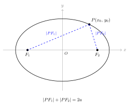
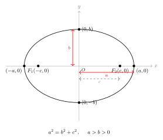
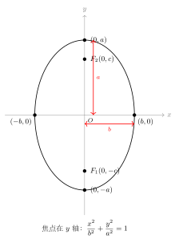

# 椭圆的定义与标准方程

> **一例速记**：  
> 平面上到两定点 $F_1$、$F_2$ 距离之和等于常数 $2a$（$2a > |F_1F_2| = 2c$）的点的轨迹叫**椭圆**。  
> 焦点在 $x$ 轴时，标准方程为 $\dfrac{x^2}{a^2}+\dfrac{y^2}{b^2}=1$（$a>b>0$），其中 $b^2 = a^2-c^2$。  
> 焦点在 $y$ 轴时，方程为 $\dfrac{x^2}{b^2}+\dfrac{y^2}{a^2}=1$（$a>b>0$）。  
> **判断焦点位置**：比较 $x^2$、$y^2$ 的分母大小——分母大的对应长轴方向，焦点在该轴上。

---

## 一、从几何到代数：椭圆的定义

### 什么是椭圆？

在平面上，**到两个定点（焦点）$F_1$、$F_2$ 距离之和等于常数的点的全体**，叫做**椭圆**。

这两个定点称为椭圆的**焦点**，两焦点之间的距离叫做**焦距**。

这个常数通常记为 $2a$，两焦点间的距离记为 $2c$（即 $|F_1F_2| = 2c$），条件为

$$|PF_1| + |PF_2| = 2a, \quad 2a > 2c \quad (a > c > 0)$$

**为什么要求 $2a > 2c$？**

若 $2a = 2c$，则由三角形两边之和等于第三边的极端情形，点 $P$ 只能在线段 $F_1F_2$ 上运动，"椭圆"退化为线段——没有实际几何意义；若 $2a < 2c$，则由三角不等式，三角形的任意两边之和大于第三边，不可能有点 $P$ 满足该条件，无实数解，即轨迹为空集。因此，**必须 $2a > 2c$**，即 $a > c$，才能保证椭圆的存在性。

### 用橡皮筋体验椭圆

椭圆有一个直观的物理做法：把一根绳子的两端固定在画板上的两个钉子（即两焦点）上，再用铅笔拉紧绳子在纸上滑动，铅笔尖画出的轨迹就是椭圆。绳子的总长度即 $2a$，两钉子间距即 $2c$。这个做法把"距离之和为常数"的定义直接可视化了。

改变两钉子的间距（$2c$）而保持绳长（$2a$）不变：钉子越靠近（$c \to 0$），椭圆越接近圆；钉子越分开（$c \to a$），椭圆越扁——这就是离心率 $e = c/a$ 的几何直觉。

### 三个量的关系

| 记号 | 几何含义 |
|------|---------|
| $a$ | 长半轴（半长轴） |
| $b$ | 短半轴（半短半轴），$b^2 = a^2 - c^2$ |
| $c$ | 半焦距（焦点到中心距离） |

核心关系：

$$\boxed{a^2 = b^2 + c^2}$$

这与勾股定理形同，可用"直角三角形"来记忆：以长半轴 $a$ 为斜边，短半轴 $b$、半焦距 $c$ 为两直角边。

**如何记住这个关系？** 考虑短轴端点 $B(0, b)$ 与焦点 $F_2(c, 0)$ 的关系。由于 $B$ 在椭圆上，$|BF_1| + |BF_2| = 2a$；又由对称性，$|BF_1| = |BF_2|$，故 $|BF_2| = a$。在直角三角形 $OF_2B$ 中（$O$ 为原点），$|OF_2| = c$，$|OB| = b$，$|BF_2| = a$，勾股定理给出 $a^2 = b^2 + c^2$。这就是该关系的几何来源，也是记忆的最佳方式。

**不等式关系**：由 $a^2 = b^2 + c^2 > b^2$ 可得 $a > b$；由 $a^2 = b^2 + c^2 > c^2$ 可得 $a > c$。因此三个量满足 $a > b > 0$，$a > c > 0$，且 $b$ 与 $c$ 之间没有固定的大小关系（需视具体椭圆而定）。

---

## 二、标准方程的推导

以两焦点连线的中点为原点、连线所在直线为 $x$ 轴建立坐标系，则

$$F_1(-c, 0), \quad F_2(c, 0)$$

设椭圆上动点 $P(x, y)$，由定义：

$$|PF_1| + |PF_2| = 2a$$

**第一步**：用距离公式写出 $|PF_1|$ 和 $|PF_2|$：

$$\sqrt{(x+c)^2 + y^2} + \sqrt{(x-c)^2 + y^2} = 2a$$

**第二步**：移项，让一个根号在右边：

$$\sqrt{(x+c)^2 + y^2} = 2a - \sqrt{(x-c)^2 + y^2}$$

**第三步**：两边平方（$2a > 0$，且可以验证右边非负），展开整理：

$$(x+c)^2 + y^2 = 4a^2 - 4a\sqrt{(x-c)^2+y^2} + (x-c)^2 + y^2$$

$$x^2 + 2cx + c^2 = 4a^2 - 4a\sqrt{(x-c)^2+y^2} + x^2 - 2cx + c^2$$

$$4cx - 4a^2 = -4a\sqrt{(x-c)^2+y^2}$$

$$a^2 - cx = a\sqrt{(x-c)^2+y^2}$$

**第四步**：再次两边平方（需验证左边 $a^2 - cx \geq 0$，由 $a > c$ 且 $-a \leq x \leq a$ 可保证）：

$$(a^2 - cx)^2 = a^2[(x-c)^2 + y^2]$$

$$a^4 - 2a^2cx + c^2x^2 = a^2x^2 - 2a^2cx + a^2c^2 + a^2y^2$$

$$a^4 + c^2x^2 = a^2x^2 + a^2c^2 + a^2y^2$$

$$(a^2 - c^2)x^2 - a^2y^2 = a^2c^2 - a^4 = -a^2(a^2-c^2)$$

令 $b^2 = a^2 - c^2$（$b > 0$），两边除以 $-a^2b^2$：

$$\boxed{\dfrac{x^2}{a^2} + \dfrac{y^2}{b^2} = 1} \quad (a > b > 0)$$

这就是**焦点在 $x$ 轴时椭圆的标准方程**。

---

## 三、标准方程中各参数的几何意义

在推导完标准方程之后，我们来系统整理方程 $\dfrac{x^2}{a^2}+\dfrac{y^2}{b^2}=1$ 中每个参数的几何含义。

### 椭圆的范围

由方程 $\dfrac{x^2}{a^2}+\dfrac{y^2}{b^2}=1$，可直接读出：

$$\dfrac{x^2}{a^2} = 1 - \dfrac{y^2}{b^2} \leq 1 \Rightarrow x^2 \leq a^2 \Rightarrow -a \leq x \leq a$$

类似地 $-b \leq y \leq b$。椭圆整个"住"在矩形 $[-a,a]\times[-b,b]$ 里。

当 $x = \pm a$ 时，方程给出 $y = 0$，这两点是长轴端点（顶点）。  
当 $y = \pm b$ 时，方程给出 $x = 0$，这两点是短轴端点（顶点）。

### 椭圆的对称性

- **关于 $x$ 轴对称**：将 $y$ 换成 $-y$，方程不变（因为 $y^2 = (-y)^2$）
- **关于 $y$ 轴对称**：将 $x$ 换成 $-x$，方程不变
- **关于原点对称**：将 $(x,y)$ 换成 $(-x,-y)$，方程不变

因此椭圆是一个**中心对称图形**（关于原点），也是一个**轴对称图形**（关于两坐标轴）。

---

## 四、两种标准方程

### 3.1 焦点在 $x$ 轴

$$\dfrac{x^2}{a^2} + \dfrac{y^2}{b^2} = 1 \quad (a > b > 0)$$

- 长轴在 $x$ 轴，顶点 $(\pm a, 0)$；短轴在 $y$ 轴，顶点 $(0, \pm b)$
- 焦点 $F_1(-c, 0)$，$F_2(c, 0)$，$c = \sqrt{a^2 - b^2}$
- **分母大的（$a^2$）在 $x^2$ 下面** → 长轴沿 $x$ 轴 → 焦点在 $x$ 轴

### 3.2 焦点在 $y$ 轴

$$\dfrac{x^2}{b^2} + \dfrac{y^2}{a^2} = 1 \quad (a > b > 0)$$

- 长轴在 $y$ 轴，顶点 $(0, \pm a)$；短轴在 $x$ 轴，顶点 $(\pm b, 0)$
- 焦点 $F_1(0, -c)$，$F_2(0, c)$，$c = \sqrt{a^2 - b^2}$
- **分母大的（$a^2$）在 $y^2$ 下面** → 长轴沿 $y$ 轴 → 焦点在 $y$ 轴

### 3.3 焦点位置的快速判断

| 方程中 | 焦点位置 |
|--------|---------|
| $x^2$ 的分母 **大于** $y^2$ 的分母 | 焦点在 $x$ 轴 |
| $y^2$ 的分母 **大于** $x^2$ 的分母 | 焦点在 $y$ 轴 |

**记忆口诀**：大分母对应的变量轴就是长轴，焦点也在该轴上。

**注意**：看的是分母（$a^2$ 和 $b^2$）的大小，而不是方程中 $x^2$ 还是 $y^2$ "看起来大"——容易搞反！

---

## 五、两种标准方程的对称结构

将两种方程放在一起对比：

| 方程 | 焦点位置 | 长轴方向 | $a^2$ 在哪个变量下 |
|------|---------|---------|------------------|
| $\dfrac{x^2}{a^2}+\dfrac{y^2}{b^2}=1$ | $(\pm c,0)$ | $x$ 轴 | $x^2$ 下面 |
| $\dfrac{x^2}{b^2}+\dfrac{y^2}{a^2}=1$ | $(0,\pm c)$ | $y$ 轴 | $y^2$ 下面 |

**统一规律**：$a^2$ 总是"更大的分母"，焦点在与 $a^2$ 对应的坐标轴上。

**特殊情形**：若 $a = b$，两个方程都变为 $\dfrac{x^2}{a^2}+\dfrac{y^2}{a^2}=1$，即 $x^2+y^2=a^2$，这是圆——椭圆的退化形式（$c=0$，焦点合并为圆心）。

### 一个常见陷阱

方程 $\dfrac{x^2}{3}+\dfrac{y^2}{5}=1$ 中，$y^2$ 的分母 $5 > 3$，故 $a^2 = 5$（在 $y^2$ 下面），焦点在 $y$ 轴。长轴在 $y$ 轴，顶点 $(0, \pm\sqrt{5})$。很多同学看到 $x^2$ 就以为长轴在 $x$ 轴——这是最常见的错误，一定要看分母大小，不是看变量名称。

---

## 六、由方程读取椭圆信息

**例**：椭圆 $\dfrac{x^2}{16} + \dfrac{y^2}{9} = 1$，读取所有关键量。

- $a^2 = 16 > b^2 = 9$，焦点在 $x$ 轴
- $a = 4$，$b = 3$，$c = \sqrt{a^2-b^2} = \sqrt{7}$
- 长轴端点：$(\pm 4, 0)$；短轴端点：$(0, \pm 3)$
- 焦点：$(\pm\sqrt{7}, 0)$
- 离心率 $e = c/a = \sqrt{7}/4 \approx 0.661$

---

## 七、典型应用例题

### 例 1：已知焦点求椭圆方程

**题目**：椭圆的两个焦点为 $F_1(-\sqrt{3}, 0)$，$F_2(\sqrt{3}, 0)$，椭圆经过点 $A(1, 1)$，求椭圆的标准方程。

**【思路】** 焦点在 $x$ 轴（$c = \sqrt{3}$），设方程为 $\dfrac{x^2}{a^2}+\dfrac{y^2}{b^2}=1$，利用 $A$ 在椭圆上和 $b^2 = a^2 - c^2$ 两个条件列方程组。

**解**：

焦点在 $x$ 轴，故设方程为 $\dfrac{x^2}{a^2}+\dfrac{y^2}{b^2}=1$，$a > b > 0$。

已知 $c = \sqrt{3}$，故 $b^2 = a^2 - 3$ ……①

点 $A(1,1)$ 在椭圆上：$\dfrac{1}{a^2}+\dfrac{1}{b^2}=1$ ……②

将①代入②：$\dfrac{1}{a^2}+\dfrac{1}{a^2-3}=1$

$(a^2-3) + a^2 = a^2(a^2-3)$

$2a^2 - 3 = a^4 - 3a^2$

$a^4 - 5a^2 + 3 = 0$ 等一下，重新计算：

$$\frac{1}{a^2} + \frac{1}{a^2-3} = 1$$

两边乘以 $a^2(a^2-3)$：

$$(a^2-3) + a^2 = a^2(a^2-3)$$

$$2a^2 - 3 = a^4 - 3a^2$$

$$a^4 - 5a^2 + 3 = 0$$

用求根公式：$a^2 = \dfrac{5 \pm \sqrt{13}}{2}$。

由于 $a^2 > c^2 = 3$，且 $b^2 = a^2 - 3 > 0$，需 $a^2 > 3$。

$\dfrac{5-\sqrt{13}}{2} \approx \dfrac{5-3.606}{2} \approx 0.697 < 3$（舍去）

$\dfrac{5+\sqrt{13}}{2} \approx \dfrac{5+3.606}{2} \approx 4.303 > 3$（保留）

故 $a^2 = \dfrac{5+\sqrt{13}}{2}$，$b^2 = a^2 - 3 = \dfrac{5+\sqrt{13}}{2} - 3 = \dfrac{\sqrt{13}-1}{2}$。

椭圆方程为 $\dfrac{x^2}{\frac{5+\sqrt{13}}{2}}+\dfrac{y^2}{\frac{\sqrt{13}-1}{2}}=1$。

> 解题要点：焦点确定后，$c$ 已知，再用椭圆上一点列方程。$a^2 > c^2$ 是取舍的依据。

---

### 例 2：已知长轴和短轴求方程

**题目**：椭圆长轴长为 $10$，短轴长为 $6$，焦点在 $y$ 轴上，求标准方程。

**【思路】** 长轴长 $= 2a$，短轴长 $= 2b$，先求 $a$、$b$，焦点在 $y$ 轴则方程为 $\dfrac{x^2}{b^2}+\dfrac{y^2}{a^2}=1$。

**解**：

$2a = 10 \Rightarrow a = 5$，$2b = 6 \Rightarrow b = 3$。

焦点在 $y$ 轴，标准方程：$\dfrac{x^2}{9}+\dfrac{y^2}{25}=1$。

验证：$c = \sqrt{a^2-b^2} = \sqrt{25-9} = 4$，焦点 $(0, \pm 4)$ 在 $y$ 轴上，符合题意。

> 解题要点：焦点在 $y$ 轴时，$a^2$ 在 $y^2$ 下面，$b^2$ 在 $x^2$ 下面，不要写反。

---

### 例 3：用定义判断点是否在椭圆上

**题目**：椭圆 $\dfrac{x^2}{25}+\dfrac{y^2}{16}=1$，点 $P$ 到两焦点距离之和等于 $10$，判断 $P$ 是否在椭圆上，并说明理由。

**【思路】** 椭圆定义的充要条件是：到两焦点距离之和 $= 2a$，且点在椭圆平面内。

**解**：

$a^2 = 25 \Rightarrow a = 5$，$2a = 10$。

椭圆上任意点到两焦点距离之和 $= 2a = 10$。

若 $|PF_1|+|PF_2|=10$，则 $P$ **满足椭圆定义**，故 $P$ 在椭圆上。

但需补充：椭圆定义要求点 $P$ 在平面内，且 $|PF_1|+|PF_2|=2a=10$ 是充要条件（当 $2a>|F_1F_2|$ 成立）。由 $|F_1F_2|=2c=2\times 3=6<10$，条件满足。

故 $P$ 一定在此椭圆上。

> 解题要点：椭圆定义本身是轨迹的充要条件；若题目直接给出距离和等于 $2a$，即可断言点在椭圆上。

---

## 八、易错点汇总

**易错 1：$a > b > 0$，不可忽视 $a > b$**

椭圆标准方程要求 $a > b > 0$。若解得 $a < b$，需交换角色（此时真正的长半轴应命名为 $a$），或检查是否弄混了焦点方向。

**易错 2：焦点位置与分母大小的对应关系搞反**

"$x^2$ 的分母大" $\Leftrightarrow$ 焦点在 $x$ 轴，这是因为 $a^2$（大分母）对应长轴方向。很多同学误以为"$x^2$ 在分子位置更显眼"就把焦点放在 $y$ 轴，刚好反了。

**易错 3：$b^2 = a^2 - c^2$，不是 $a^2 = b^2 - c^2$ 或 $c^2 = a^2 + b^2$**

$a^2 = b^2 + c^2$ 是固定关系，$a$ 最大，$c$ 最小。双曲线才有 $c^2 = a^2 + b^2$，不要混用。

**易错 4：$2a$ 是常数，而不是 $a$**

椭圆定义中 $|PF_1|+|PF_2| = 2a$，是"两倍半长轴"。若题目说"两焦半径之和为 $6$"，则 $2a = 6$，$a = 3$。直接把 $6$ 当成 $a$ 是常见错误。

**易错 5：定义要求 $2a > 2c$（即 $a > c > 0$），等号情形不是椭圆**

若 $|PF_1|+|PF_2| = |F_1F_2|$，则点 $P$ 只能在线段 $F_1F_2$ 上（退化），不是椭圆。解题时要记得核查 $a > c$ 的条件。

---

## 九、自测题

**自测 1**　已知椭圆方程 $\dfrac{x^2}{m}+\dfrac{y^2}{4}=1$ 表示焦点在 $x$ 轴的椭圆，则实数 $m$ 的范围是什么？

> 提示：焦点在 $x$ 轴 $\Rightarrow$ $x^2$ 分母 $>$ $y^2$ 分母，即 $m > 4$；同时需 $m > 0$（椭圆方程要求两分母均正）。答：$m > 4$。

**自测 2**　椭圆 $\dfrac{x^2}{9}+\dfrac{y^2}{5}=1$，求：(1) 长半轴 $a$、短半轴 $b$、半焦距 $c$；(2) 两焦点坐标；(3) 椭圆上一点与两焦点距离之积的最小值（用定义思考）。

> 提示：$a^2=9, b^2=5 \Rightarrow a=3, b=\sqrt{5}, c=\sqrt{4}=2$。焦点 $(\pm 2,0)$。  
> 最小值：$|PF_1|\cdot|PF_2| \leq \left(\dfrac{|PF_1|+|PF_2|}{2}\right)^2 = a^2 = 9$，等号在 $|PF_1|=|PF_2|=a$ 时取得（此时 $P$ 在短轴端点）；最小值用 AM-GM 的另一方向：$|PF_1|\cdot|PF_2| \geq ?$ 需进一步用坐标法，此处略。直接计算：$|PF_1|\cdot|PF_2|$ 最小值为 $b^2 = 5$（取在短轴端点）。

**自测 3**　椭圆焦点在 $y$ 轴，长轴长为 $2\sqrt{5}$，过点 $(1, -2)$，求椭圆方程。

> 提示：$2a=2\sqrt{5}\Rightarrow a=\sqrt{5}$，设方程 $\dfrac{x^2}{b^2}+\dfrac{y^2}{5}=1$。代入 $(1,-2)$：$\dfrac{1}{b^2}+\dfrac{4}{5}=1 \Rightarrow \dfrac{1}{b^2}=\dfrac{1}{5} \Rightarrow b^2=5$。但 $b^2=5=a^2$，不满足 $a>b$，矛盾。  
> 重检：若 $b^2=5$，则 $a=b$，退化为圆，不是椭圆。故题目数据需重核（此自测题有意设陷——检验能否发现矛盾）。  
> 正确做法：若过 $(1,-2)$ 且长轴 $2\sqrt{5}$ 但焦点在 $y$ 轴，则需 $a^2=5>b^2$；代入得矛盾，说明这样的椭圆不存在（该点在长轴端点上，不在椭圆内部）。

**自测 4**　点 $P$ 在椭圆 $\dfrac{x^2}{25}+\dfrac{y^2}{9}=1$ 上，$|PF_1| = 3$，求 $|PF_2|$。

> 提示：$a^2=25\Rightarrow a=5$，$|PF_1|+|PF_2|=2a=10$，故 $|PF_2|=10-3=7$。  
> 验证：$c=\sqrt{25-9}=4$，椭圆上点到焦点距离范围 $[a-c,a+c]=[1,9]$，$|PF_1|=3\in[1,9]$，合法。

---

**回头看"一例速记"**：

> 椭圆定义：$|PF_1|+|PF_2|=2a$（$a>c>0$）。  
> 焦点在 $x$ 轴：$\dfrac{x^2}{a^2}+\dfrac{y^2}{b^2}=1$（$a>b>0$，$b^2=a^2-c^2$）。  
> 焦点在 $y$ 轴：交换 $a^2$ 与 $b^2$ 的位置。  
> 判断焦点：看哪个变量的分母更大，焦点就在那条轴上。

能不查笔记写出例 1 的完整推导（包括取舍理由）——本章，你拿下了。
