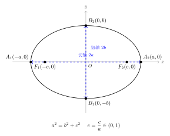
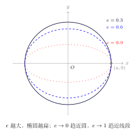
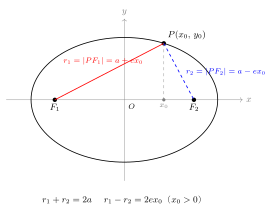

# 椭圆的几何性质

> **一例速记**：  
> **7 大基本性质**（焦点在 $x$ 轴情形 $\dfrac{x^2}{a^2}+\dfrac{y^2}{b^2}=1$，$a>b>0$）：  
> ① 关于 $x$ 轴、$y$ 轴、原点三者均对称  
> ② 长轴端点 $A_1(-a,0)$，$A_2(a,0)$；短轴端点 $B_1(0,-b)$，$B_2(0,b)$  
> ③ 焦点 $F_1(-c,0)$，$F_2(c,0)$，$c=\sqrt{a^2-b^2}$  
> ④ **离心率** $e=\dfrac{c}{a}\in(0,1)$，$e$ 越大椭圆越扁  
> ⑤ **焦半径**（$P(x_0,y_0)$ 在椭圆上）：$|PF_1|=a+ex_0$，$|PF_2|=a-ex_0$  
> ⑥ **通径**（过焦点且垂直长轴的弦）$= \dfrac{2b^2}{a}$  
> ⑦ **准线** $x = \pm\dfrac{a}{e} = \pm\dfrac{a^2}{c}$（与离心率配对使用）

---

## 一、引入题：从一道题读尽所有性质

> **题目**：椭圆 $\dfrac{x^2}{9}+\dfrac{y^2}{5}=1$，求：  
> (1) 长半轴 $a$、短半轴 $b$、半焦距 $c$；  
> (2) 离心率 $e$；  
> (3) 顶点坐标和焦点坐标；  
> (4) 通径长度。

---

## 二、思维路径还原

> "看到椭圆方程，第一步：**读出 $a^2$ 和 $b^2$**。
>
> 方程 $\dfrac{x^2}{9}+\dfrac{y^2}{5}=1$，$x^2$ 下面是 $9$，$y^2$ 下面是 $5$，$9 > 5$，所以 $a^2 = 9$，$b^2 = 5$。
>
> 大分母对应长轴，$a^2=9 > b^2=5$ 在 $x^2$ 下面，**焦点在 $x$ 轴**。
>
> **读各量**：$a = \sqrt{9} = 3$，$b = \sqrt{5}$，$c = \sqrt{a^2 - b^2} = \sqrt{9-5} = \sqrt{4} = 2$。
>
> 记 $c=2$ 的时候，同时验算：$b^2 = a^2 - c^2 = 9-4 = 5$，正确。
>
> **离心率**：$e = c/a = 2/3$。$e\in(0,1)$ 是椭圆，$2/3 \approx 0.667$，椭圆中等偏扁。
>
> **顶点**：长轴端点 $(\pm 3, 0)$，短轴端点 $(0, \pm\sqrt{5})$。
>
> **焦点**：$(\pm 2, 0)$（$c=2$ 在 $x$ 轴上）。
>
> **通径**：过焦点 $(2,0)$ 作垂直于 $x$ 轴的弦，代入方程 $x=2$：
>
> $\dfrac{4}{9} + \dfrac{y^2}{5} = 1 \Rightarrow \dfrac{y^2}{5} = \dfrac{5}{9} \Rightarrow y^2 = \dfrac{25}{9} \Rightarrow y = \pm\dfrac{5}{3}$
>
> 通径长 $= 2\times\dfrac{5}{3} = \dfrac{10}{3}$。
>
> 用公式验证：$\dfrac{2b^2}{a} = \dfrac{2\times 5}{3} = \dfrac{10}{3}$，一致。
>
> **关键反射**：椭圆题第一步永远是读出 $a^2$、$b^2$、$c = \sqrt{a^2-b^2}$，然后套公式。别急着算通径或焦半径，先把基础量清楚写出来。"

把这段独白读两遍，体会"读 $a^2, b^2 \to$ 算 $c \to$ 定焦点 $\to$ 求 $e \to$ 套焦半径公式"这条完整链条。

---

## 三、抽象成方法：椭圆 7 大性质 + 4 大公式

### 3.1 对称性

椭圆 $\dfrac{x^2}{a^2}+\dfrac{y^2}{b^2}=1$ 关于 $x$ 轴（$y\to -y$）、$y$ 轴（$x\to -x$）和原点（$(x,y)\to(-x,-y)$）均对称。椭圆的**中心**（对称中心）是原点 $O$，**对称轴**是坐标轴。

利用对称性可简化计算：若 $P(x_0, y_0)$ 在椭圆上，则 $(-x_0, y_0)$、$(x_0,-y_0)$、$(-x_0,-y_0)$ 也在椭圆上。

**对称性的应用**：求关于坐标轴对称的点到焦点的距离时，可直接利用对称性，不必重新计算。例如，若 $|PF_1|$ 已知，则 $P$ 关于 $x$ 轴的对称点 $P'$ 满足 $|P'F_1| = |PF_1|$（焦点在 $x$ 轴时）。

### 3.2 范围与形状

$x$ 的范围：$-a \leq x \leq a$；$y$ 的范围：$-b \leq y \leq b$。

椭圆"装"在矩形 $[-a,a]\times[-b,b]$ 里，四边恰好在顶点处相切。

### 3.3 长轴与短轴

（见配图 `geo-p5-02-1`：4 顶点 + 2 焦点 + 长短轴标注）

| 名称 | 含义 | 长度 |
|------|------|------|
| 长轴 | 连接 $A_1A_2$ 的线段（通过两焦点） | $2a$ |
| 短轴 | 连接 $B_1B_2$ 的线段（垂直长轴过中心） | $2b$ |
| 焦距 | 两焦点距离 | $2c$ |

### 3.4 离心率 $e$

$$\boxed{e = \dfrac{c}{a}, \quad e \in (0, 1)}$$

（见配图 `geo-p5-02-2`：$e=0.3, 0.6, 0.9$ 三个椭圆形状对比）

- $e \to 0^+$：$c \to 0$，焦点趋近于中心，椭圆趋近于**圆**（当 $e=0$ 时退化为圆）
- $e \to 1^-$：$c \to a$，$b \to 0$，椭圆趋近于**线段**（退化）
- $e$ 越大，椭圆越"扁"；$e$ 越小，椭圆越"圆"

**几何直觉**：$e = c/a$ 是"焦点偏离中心程度"相对于"半长轴"的比值，可以理解为偏心程度。

### 3.5 焦半径公式

（见配图 `geo-p5-02-3`：焦半径示意）

设 $P(x_0, y_0)$ 是椭圆 $\dfrac{x^2}{a^2}+\dfrac{y^2}{b^2}=1$ 上一点，$F_1(-c,0)$，$F_2(c,0)$，则：

$$\boxed{|PF_1| = a + ex_0, \quad |PF_2| = a - ex_0}$$

**推导**：由椭圆方程，$y_0^2 = b^2\left(1 - \dfrac{x_0^2}{a^2}\right) = \dfrac{b^2(a^2-x_0^2)}{a^2}$。

$$|PF_1|^2 = (x_0+c)^2 + y_0^2 = x_0^2 + 2cx_0 + c^2 + \dfrac{b^2(a^2-x_0^2)}{a^2}$$

$$= x_0^2 + 2cx_0 + c^2 + b^2 - \dfrac{b^2 x_0^2}{a^2}$$

$$= x_0^2\left(1 - \dfrac{b^2}{a^2}\right) + 2cx_0 + c^2 + b^2$$

由 $1 - b^2/a^2 = c^2/a^2$ 及 $c^2 + b^2 = a^2$：

$$= \dfrac{c^2 x_0^2}{a^2} + 2cx_0 + a^2 = \left(\dfrac{cx_0}{a} + a\right)^2 = (a + ex_0)^2$$

因 $-a \leq x_0 \leq a$，$e < 1$，故 $a + ex_0 > 0$，故 $|PF_1| = a + ex_0$。类似地 $|PF_2| = a - ex_0$。

**验证**：$|PF_1| + |PF_2| = 2a$（椭圆定义，成立）。

### 3.6 通径

过焦点 $F_2(c, 0)$ 作垂直长轴的弦，令 $x = c$ 代入方程：

$$\dfrac{c^2}{a^2} + \dfrac{y^2}{b^2} = 1 \Rightarrow y^2 = b^2 \cdot \dfrac{a^2 - c^2}{a^2} = \dfrac{b^4}{a^2}$$

$$y = \pm \dfrac{b^2}{a}$$

通径长 $= \dfrac{2b^2}{a}$（是焦半径公式的特例：令 $x_0 = c$，$|PF_2| = a - ec = a - c^2/a = b^2/a$，两倍即通径）。

**通径性质**：
- 通径是椭圆所有过焦点的弦中**最短**的（焦点弦最短为通径，最长为长轴）
- 两焦点处的通径等长（对称性）

### 3.7 准线

椭圆 $\dfrac{x^2}{a^2}+\dfrac{y^2}{b^2}=1$ 的准线（与离心率配合定义椭圆的另一种方式）：

$$\boxed{x = \pm \dfrac{a}{e} = \pm \dfrac{a^2}{c}}$$

（高中阶段一般不作重点，了解即可。）

---

## 四、4 大公式汇总

| 公式名 | 表达式（焦点在 $x$ 轴） |
|--------|----------------------|
| 关系式 | $a^2 = b^2 + c^2$ |
| 离心率 | $e = c/a \in (0,1)$ |
| 焦半径 | $\|PF_1\| = a+ex_0$，$\|PF_2\| = a-ex_0$ |
| 通径 | $2b^2/a$ |

---

## 五、方法变形

### 5.0 焦半径公式的两种情形

当焦点在 $y$ 轴时（方程为 $\dfrac{x^2}{b^2}+\dfrac{y^2}{a^2}=1$），焦半径公式变为：

$$|PF_1| = a + ey_0, \quad |PF_2| = a - ey_0$$

其中 $F_1(0,-c)$，$F_2(0,c)$，$P(x_0, y_0)$ 在椭圆上，$e = c/a$。

**记忆统一口诀**：焦半径 $= a \pm e \times (\text{P 在长轴方向的坐标})$。$F_1$ 在负方向，公式用"$+$"（距离更大）；$F_2$ 在正方向，公式用"$-$"（距离更小，当 $P$ 坐标为正时）。

### 5.1 由离心率反推椭圆方程

**技巧**：$e = c/a$，结合 $b^2 = a^2 - c^2 = a^2(1-e^2)$，再由题目给定的另一个条件（如通过某点、短轴长等）确定 $a$。

**例**：椭圆焦点在 $x$ 轴，离心率 $e = \dfrac{1}{2}$，短轴长为 $2\sqrt{3}$，求标准方程。

$b = \sqrt{3}$，$b^2 = 3$。由 $b^2 = a^2(1-e^2) = a^2 \cdot \dfrac{3}{4}$：$a^2 = 4$，$c^2 = a^2 - b^2 = 1$，$c=1$，$e=1/2$，验证正确。

方程：$\dfrac{x^2}{4}+\dfrac{y^2}{3}=1$。

### 5.2 焦点弦的最值

过焦点 $F_2(c,0)$ 的弦（焦点弦）设斜率为 $k$，弦长随 $k$ 变化：

- 当弦垂直长轴（$k \to \infty$，即 $x = c$）时，弦长 $= \dfrac{2b^2}{a}$（通径，**最短**）
- 当弦沿长轴方向（$k = 0$，弦即长轴段）时，弦长 $= 2a$（**最长**）

**结论**：焦点弦长 $\in \left[\dfrac{2b^2}{a}, 2a\right]$。

### 5.2 焦点三角形

当椭圆上一点 $P$ 不在长轴上时，$P$、$F_1$、$F_2$ 构成三角形，称为**焦点三角形**。

**焦点三角形的面积**：

$$S_{\triangle PF_1F_2} = \dfrac{1}{2} \cdot |F_1F_2| \cdot |y_0| = c|y_0|$$

其中 $y_0$ 是 $P$ 的纵坐标。

由椭圆方程 $y_0^2 = b^2\left(1-\dfrac{x_0^2}{a^2}\right)$，代入后面积与 $x_0$ 相关。

当 $x_0 = 0$ 时（$P$ 在短轴端点），$|y_0| = b$，面积最大：$S_{\max} = cb$。

**焦点三角形的另一常用性质**：

若 $\angle F_1PF_2 = \theta$，由余弦定理：

$$|F_1F_2|^2 = |PF_1|^2 + |PF_2|^2 - 2|PF_1||PF_2|\cos\theta$$

$$4c^2 = (|PF_1|+|PF_2|)^2 - 2|PF_1||PF_2|(1+\cos\theta)$$

$$4c^2 = 4a^2 - 2|PF_1||PF_2|(1+\cos\theta)$$

这个关系可用于已知 $\angle F_1PF_2$ 求 $|PF_1|\cdot|PF_2|$，再结合 $|PF_1|+|PF_2|=2a$ 解出两焦半径。

### 5.3 离心率范围与形状

| 离心率 | 曲线形状 |
|--------|---------|
| $e = 0$ | 圆（退化，焦点合一） |
| $0 < e < 1$ | 椭圆 |
| $e = 1$ | 抛物线 |
| $e > 1$ | 双曲线 |

高中阶段重点是 $0 < e < 1$ 的椭圆情形。

---

## 六、常用结论整理

在高中考试中，以下结论反复出现，建议直接记住：

**结论 1**：椭圆 $\dfrac{x^2}{a^2}+\dfrac{y^2}{b^2}=1$ 上任意点 $P(x_0,y_0)$ 满足：

$$b^2 \leq |PF_1|^2 + |PF_2|^2 - (|PF_1|+|PF_2|)^2/2 + \cdots$$

更实用的是：由 $|PF_1|+|PF_2|=2a$ 且 $|PF_1||PF_2|=(a+ex_0)(a-ex_0)=a^2-e^2x_0^2$，结合 $x_0^2 \leq a^2$，得

$$b^2 \leq |PF_1||PF_2| \leq a^2$$

等号左边在 $P$ 为长轴端点时取得（$x_0=\pm a$，$|PF_1||PF_2|=b^2$）；等号右边在 $P$ 为短轴端点时取得（$x_0=0$，$|PF_1||PF_2|=a^2$）。

**结论 2**：椭圆上点 $P$ 到焦点的距离范围是：

$$a - c \leq |PF_2| \leq a + c \quad (\text{即} \; b^2/a \leq |PF_2| \leq 2a - b^2/a)$$

注意：$a-c$ 在 $P$ 为长轴靠近 $F_2$ 一侧端点时取得，$a+c$ 在 $P$ 为长轴靠近 $F_1$ 一侧端点时取得。

**结论 3**：$|PF_1|$、$|PF_2|$ 不可能同时小于 $a-c$，也不可能同时大于 $a+c$。若题目给出两者之和 $=2a$、某者 $=k$，需验证 $k \in [a-c, a+c]$，否则该点不在椭圆上。

**结论 4（焦半径与坐标的转换）**：由 $|PF_2| = a - ex_0$ 可以反解 $x_0 = \dfrac{a - |PF_2|}{e}$。这是将"到焦点的距离"转换为"点的坐标"的重要技巧，在求轨迹、最值等问题中频繁用到。

**结论 5（等腰焦点三角形）**：若 $|PF_1| = |PF_2|$，则 $P$ 在短轴上（即 $x_0 = 0$）。此时 $|PF_1| = |PF_2| = a$，焦点三角形为等腰三角形，$\angle F_1PF_2$ 由余弦定理给出：

$$\cos(\angle F_1PF_2) = 1 - \dfrac{2c^2}{a^2} = 1 - 2e^2$$

当 $e = \dfrac{\sqrt{2}}{2}$ 时，$\cos(\angle F_1PF_2) = 1 - 1 = 0$，即 $\angle F_1PF_2 = 90°$（焦点三角形为等腰直角三角形）。这是高考中常见的特殊情形。

---

## 六B、准线与焦点的配合（了解）

准线是与长轴垂直的两条直线，方程为 $x = \pm\dfrac{a^2}{c} = \pm\dfrac{a}{e}$（焦点在 $x$ 轴时）。

椭圆上任意一点 $P(x_0,y_0)$ 到焦点 $F_2$ 的距离，与 $P$ 到对应准线 $x = \dfrac{a}{e}$ 的距离之比，恒等于离心率：

$$\dfrac{|PF_2|}{d(P, l_2)} = e$$

其中 $d(P, l_2) = \dfrac{a}{e} - x_0$（$P$ 在准线左侧，$x_0 \leq a < \dfrac{a}{e}$）。

验证：$|PF_2| = a - ex_0$，$d = \dfrac{a}{e} - x_0 = \dfrac{a - ex_0}{e} = \dfrac{|PF_2|}{e}$，故比值 $= e$，成立。

这实际上是"以焦点为焦点、对应准线为准线、离心率为 $e$"定义圆锥曲线的焦点-准线定义，高中阶段了解即可，不作重点考查。

---

## 七、思考路标（条件反射训练）

以下每条应成为自动反应：

1. **看到"离心率"** → 立即写 $e = c/a$，并思考 $e \in (0,1)$ 对应椭圆。不要把 $e$ 和 $\varepsilon$（自然底数）混淆，也不要忘记 $e < 1$ 的约束。

2. **看到"焦半径"** → 用 $a \pm ex_0$（焦点在 $x$ 轴时）；若焦点在 $y$ 轴则用 $a \pm ey_0$。先确认焦点方向再套公式。

3. **$0 < e < 1$** 是椭圆的充要条件；$e=0$ 退化为圆；$e=1$ 是抛物线；$e>1$ 是双曲线——这是"圆锥曲线家族"的统一视角，高考常考对比。

4. **看到"通径"** → $2b^2/a$，这是焦点处最短弦。不要与弦长公式混用。

5. **椭圆上的点 $P$ 满足 $|PF_1|+|PF_2|=2a$**（定义恒成立）——这一条在几何论证中极其有用，要形成反射。

6. **看到"最短弦"** → 过焦点且垂直长轴时弦最短（等于通径）；沿长轴时最长。不要误以为"最短弦"就是短轴。

7. **含参椭圆** → 先用 $a^2 > b^2 > 0$ 确定参数范围，再代入其他条件。参数取值合法性是得分点。

8. **焦半径公式的符号** → $|PF_1| = a + ex_0$，$|PF_2| = a - ex_0$。$F_1$ 在左边（$-c$），对应"+$ex_0$"（$x_0$ 越靠右，$P$ 离 $F_1$ 越远）。直觉：离哪个焦点远，加号就在那一边。

9. **看到两焦半径乘积 $|PF_1|\cdot|PF_2|$** → 用 $(a+ex_0)(a-ex_0) = a^2 - e^2x_0^2$，在 $x_0=0$ 时取最大值 $a^2$，在 $x_0=\pm a$ 时取最小值 $a^2 - e^2a^2 = b^2$（即短轴端点处乘积最小为 $b^2$，长轴端点处乘积最大等于…验算：$x_0=\pm a$ 时，$(a\pm ea)(a\mp ea)=(a+c)(a-c)=a^2-c^2=b^2$）。

---

## 八、应用例题

### 例 1：已知离心率求椭圆方程

**题目**：椭圆焦点在 $x$ 轴，离心率 $e = \dfrac{\sqrt{3}}{2}$，且椭圆过点 $A(1, 1)$，求椭圆的标准方程。

**【思路】** $e = c/a$，用 $b^2 = a^2 - c^2 = a^2(1-e^2)$，代入点 $A$ 坐标列方程求 $a$。

**解**：

设方程为 $\dfrac{x^2}{a^2}+\dfrac{y^2}{b^2}=1$，$a > b > 0$。

$e = \dfrac{c}{a} = \dfrac{\sqrt{3}}{2}$，故 $c = \dfrac{\sqrt{3}}{2}a$。

$b^2 = a^2 - c^2 = a^2 - \dfrac{3}{4}a^2 = \dfrac{a^2}{4}$

代入点 $A(1,1)$：

$$\dfrac{1}{a^2} + \dfrac{1}{\frac{a^2}{4}} = 1$$

$$\dfrac{1}{a^2} + \dfrac{4}{a^2} = 1$$

$$\dfrac{5}{a^2} = 1 \Rightarrow a^2 = 5$$

故 $b^2 = \dfrac{a^2}{4} = \dfrac{5}{4}$。

验证：$c = \sqrt{a^2 - b^2} = \sqrt{5 - \frac{5}{4}} = \sqrt{\frac{15}{4}} = \dfrac{\sqrt{15}}{2}$，$e = c/a = \dfrac{\sqrt{15}/2}{\sqrt{5}} = \dfrac{\sqrt{15}}{2\sqrt{5}} = \dfrac{\sqrt{3}}{2}$，正确。

椭圆方程：$\dfrac{x^2}{5}+\dfrac{y^2}{\frac{5}{4}}=1$，即 $\dfrac{x^2}{5}+\dfrac{4y^2}{5}=1$。

> 解题要点：$b^2 = a^2(1-e^2)$ 是用离心率消去 $b^2$ 的核心步骤，使方程只含 $a$ 一个未知量。

---

### 例 2：焦半径的应用

**题目**：椭圆 $\dfrac{x^2}{25}+\dfrac{y^2}{16}=1$，$P$ 是椭圆上一点，$|PF_1| = 7$，求 $|PF_2|$ 及点 $P$ 的横坐标 $x_0$。

**【思路】** 先用定义求 $|PF_2|$，再用焦半径公式求 $x_0$。

**解**：

$a^2 = 25, b^2 = 16 \Rightarrow a = 5, c = \sqrt{25-16} = 3, e = 3/5$。

由椭圆定义：$|PF_1| + |PF_2| = 2a = 10$，故 $|PF_2| = 10 - 7 = 3$。

由焦半径公式（焦点在 $x$ 轴）：

$$|PF_1| = a + ex_0 = 5 + \dfrac{3}{5}x_0 = 7$$

$$\dfrac{3}{5}x_0 = 2 \Rightarrow x_0 = \dfrac{10}{3}$$

验证：$|PF_2| = a - ex_0 = 5 - \dfrac{3}{5}\cdot\dfrac{10}{3} = 5 - 2 = 3$，正确。

验证 $x_0 \in [-a, a] = [-5, 5]$：$\dfrac{10}{3} \approx 3.33 \in [-5,5]$，合法。

> 解题要点：$|PF_1|+|PF_2|=2a$ 先给出 $|PF_2|$；再用焦半径公式 $a+ex_0$ 反解 $x_0$。注意检验 $x_0$ 在范围内。

---

### 例 3：含参椭圆的讨论

**题目**：方程 $\dfrac{x^2}{k-2}+\dfrac{y^2}{6-k}=1$ 表示椭圆，且焦点在 $x$ 轴，求参数 $k$ 的范围及焦点坐标。

**【思路】** 椭圆条件：两分母均正且不相等；焦点在 $x$ 轴条件：$x^2$ 分母 $>$ $y^2$ 分母。

**解**：

椭圆条件：两分母均正且不相等，故

$$k-2 > 0 \Rightarrow k > 2$$

$$6-k > 0 \Rightarrow k < 6$$

$$k-2 \neq 6-k \Rightarrow k \neq 4$$

焦点在 $x$ 轴条件：$k-2 > 6-k \Rightarrow 2k > 8 \Rightarrow k > 4$。

综合：$k \in (4, 6)$（且 $k \neq 4$，已包含在 $k > 4$ 中）。

此时 $a^2 = k-2$，$b^2 = 6-k$，$c^2 = a^2 - b^2 = (k-2)-(6-k) = 2k-8$。

焦点：$(\pm\sqrt{2k-8}, 0)$。

**反例检验**：$k = 5$（在范围内）：$a^2 = 3$，$b^2 = 1$，$c = \sqrt{2}$，$e = \sqrt{2/3}$，焦点 $(\pm\sqrt{2},0)$，正确。

> 解题要点：含参椭圆需同时满足"两分母正"和"两分母不等"；焦点位置再给出 $>$ 号约束。分类讨论时要合并所有约束取交集。

---

## 九、自测题

**自测 1**　椭圆 $\dfrac{x^2}{4}+y^2=1$，求：离心率 $e$、焦点坐标、通径长。

> 提示：$a^2=4, b^2=1 \Rightarrow a=2, b=1, c=\sqrt{3}$，$e=\sqrt{3}/2$。焦点 $(\pm\sqrt{3},0)$。通径 $=2b^2/a=2/2=1$。

**自测 2**　椭圆上点 $P$ 到两焦点距离之差 $|PF_1|-|PF_2|=2$，椭圆 $\dfrac{x^2}{9}+\dfrac{y^2}{5}=1$，求 $|PF_1|$ 和 $|PF_2|$。

> 提示：$2a=6$，$|PF_1|+|PF_2|=6$，$|PF_1|-|PF_2|=2$，解得 $|PF_1|=4, |PF_2|=2$。  
> 验证范围：$c=2, e=2/3$，焦半径范围 $[a-c,a+c]=[1,5]$，$4\in[1,5]$，$2\in[1,5]$，合法。

**自测 3**　已知椭圆离心率 $e=1/2$，长轴长为 $4$，求椭圆两种可能的标准方程（考虑焦点在 $x$ 轴和 $y$ 轴两种情形）。

> 提示：$2a=4\Rightarrow a=2$，$c=ea=1$，$b^2=a^2-c^2=3$。  
> 焦点在 $x$ 轴：$\dfrac{x^2}{4}+\dfrac{y^2}{3}=1$；焦点在 $y$ 轴：$\dfrac{x^2}{3}+\dfrac{y^2}{4}=1$。

**自测 4**　椭圆 $\dfrac{x^2}{16}+\dfrac{y^2}{9}=1$ 上点 $P$ 满足 $|PF_1|\cdot|PF_2|$ 最大，求该最大值及 $P$ 的坐标。

> 提示：$a=4, b=3, c=\sqrt{7}, e=\sqrt{7}/4$。  
> $|PF_1|\cdot|PF_2| = (a+ex_0)(a-ex_0) = a^2 - e^2x_0^2 = 16 - \dfrac{7}{16}x_0^2$。  
> $x_0^2$ 最小时（$x_0=0$）乘积最大，最大值 $= a^2 = 16$。$P$ 在短轴端点 $(0, \pm 3)$。

**自测 5**　设椭圆 $\dfrac{x^2}{a^2}+\dfrac{y^2}{b^2}=1$（$a>b>0$）的两焦点为 $F_1$、$F_2$，椭圆上点 $P$ 满足 $\angle F_1PF_2 = 90°$，且 $|PF_1|=1$，$|PF_2|=3$，求该椭圆的方程。

> 提示：$|PF_1|+|PF_2|=2a=4\Rightarrow a=2$。  
> $\angle F_1PF_2=90°$，由勾股定理：$|F_1F_2|^2=|PF_1|^2+|PF_2|^2=1+9=10$，故 $2c=\sqrt{10}$，$c^2=10/4=5/2$。  
> $b^2=a^2-c^2=4-5/2=3/2$。  
> 椭圆方程：$\dfrac{x^2}{4}+\dfrac{y^2}{\frac{3}{2}}=1$，即 $\dfrac{x^2}{4}+\dfrac{2y^2}{3}=1$。

---

**回头看"一例速记"**：

> 7 大性质：对称 → 顶点 → 焦点 → 离心率 → 焦半径 → 通径 → 准线。  
> 4 大公式：$a^2=b^2+c^2$，$e=c/a$，$|PF_{1,2}|=a\pm ex_0$，通径 $2b^2/a$。  
> **解题主线**：读出 $a^2,b^2$ → 算 $c,e$ → 套公式 → 验范围。

能不看提示独立完成自测 5 的完整推导（用勾股定理求 $c$）——本章，你拿下了。
