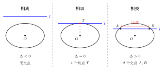
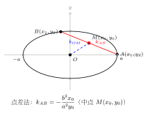
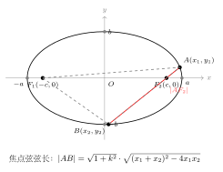

# 直线与椭圆的位置关系

> **一例速记**：
>
> **位置判别**：将直线 $y = kx + m$ 代入椭圆方程，得关于 $x$ 的一元二次方程，判别式 $\Delta > 0$ 相交，$\Delta = 0$ 相切，$\Delta < 0$ 相离。
>
> **弦长公式**：$|AB| = \sqrt{1+k^2}\cdot|x_1-x_2| = \sqrt{1+k^2}\cdot\sqrt{(x_1+x_2)^2 - 4x_1 x_2}$（韦达定理代入）。
>
> **中点弦（点差法）**：设两交点 $(x_1,y_1),(x_2,y_2)$ 均在椭圆上，两式相减消高次项，得斜率与中点的关系
> $$k_{AB} = -\frac{b^2 x_0}{a^2 y_0}$$
> 其中 $(x_0, y_0)$ 是弦 $AB$ 的中点，椭圆为 $\dfrac{x^2}{a^2}+\dfrac{y^2}{b^2}=1$。

---

## 一、引入：直线与椭圆相交求弦长

> **题目**：直线 $y = k(x-1)$ 与椭圆 $\dfrac{x^2}{4} + y^2 = 1$ 交于 $A$、$B$ 两点，若 $|AB| = \dfrac{8\sqrt{2}}{5}$，求 $k$ 的值。

这道题综合了"代入消元、韦达定理、弦长公式"三步，是直线与椭圆关系题的经典范式。看似复杂，但每一步都是固定套路，掌握后可以秒解同类问题。

---

## 二、思维路径还原

> **目标**：已知弦长 $|AB|$，反求斜率 $k$。核心流程：代入消元 → 韦达定理 → 弦长公式。
>
> **第一步：代入消元，建立一元二次方程。**
>
> 将 $y = k(x-1)$ 代入 $\dfrac{x^2}{4} + y^2 = 1$：
>
> $$\frac{x^2}{4} + k^2(x-1)^2 = 1$$
>
> 展开：
>
> $$\frac{x^2}{4} + k^2 x^2 - 2k^2 x + k^2 = 1$$
>
> 两边乘以 4：
>
> $$x^2 + 4k^2 x^2 - 8k^2 x + 4k^2 = 4$$
>
> 整理得：
>
> $$(1 + 4k^2)x^2 - 8k^2 x + (4k^2 - 4) = 0 \quad (\star)$$
>
> **第二步：由韦达定理写出 $x_1 + x_2$ 和 $x_1 x_2$。**
>
> 设两交点横坐标为 $x_1, x_2$，由韦达定理对方程 $(\star)$：
>
> $$x_1 + x_2 = \frac{8k^2}{1+4k^2}, \qquad x_1 x_2 = \frac{4k^2 - 4}{1+4k^2}$$
>
> **第三步：用弦长公式列方程。**
>
> 直线斜率为 $k$，弦长：
>
> $$|AB|^2 = (1+k^2)\left[(x_1+x_2)^2 - 4x_1 x_2\right]$$
>
> 计算方括号内：
>
> $$(x_1+x_2)^2 - 4x_1 x_2 = \left(\frac{8k^2}{1+4k^2}\right)^2 - \frac{4(4k^2-4)}{1+4k^2}$$
>
> $$= \frac{64k^4}{(1+4k^2)^2} - \frac{4(4k^2-4)(1+4k^2)}{(1+4k^2)^2}$$
>
> $$= \frac{64k^4 - 4(4k^2-4)(1+4k^2)}{(1+4k^2)^2}$$
>
> 展开分子：$4(4k^2-4)(1+4k^2) = 4(4k^2 + 16k^4 - 4 - 16k^2) = 4(16k^4 - 12k^2 - 4)$
>
> $$= 64k^4 - 48k^2 - 16$$
>
> 故分子 $= 64k^4 - (64k^4 - 48k^2 - 16) = 48k^2 + 16$
>
> 所以：
>
> $$(x_1+x_2)^2 - 4x_1 x_2 = \frac{48k^2+16}{(1+4k^2)^2} = \frac{16(3k^2+1)}{(1+4k^2)^2}$$
>
> **第四步：代入弦长求 $k$。**
>
> $$|AB|^2 = (1+k^2) \cdot \frac{16(3k^2+1)}{(1+4k^2)^2} = \left(\frac{8\sqrt{2}}{5}\right)^2 = \frac{128}{25}$$
>
> 即：
>
> $$\frac{16(1+k^2)(3k^2+1)}{(1+4k^2)^2} = \frac{128}{25}$$
>
> 两边化简，$16 \times 25 = 128 \times \ldots$，即：
>
> $$25(1+k^2)(3k^2+1) = 8(1+4k^2)^2$$
>
> 展开左边：$25(3k^2 + 1 + 3k^4 + k^2) = 25(3k^4 + 4k^2 + 1)$
>
> $= 75k^4 + 100k^2 + 25$
>
> 展开右边：$8(1 + 8k^2 + 16k^4) = 128k^4 + 64k^2 + 8$
>
> 两边相减：$75k^4 + 100k^2 + 25 = 128k^4 + 64k^2 + 8$
>
> $$53k^4 - 36k^2 - 17 = 0$$
>
> 令 $u = k^2$：$53u^2 - 36u - 17 = 0$，分解：$(53u + 17)(u - 1) = 0$（验证：$53 - 36 - 17 = 0$ ✓）
>
> 故 $u = 1$（$u = -17/53$ 舍去），即 $k^2 = 1$，$k = \pm 1$。
>
> **第五步：验证 $\Delta > 0$（直线确实与椭圆相交）。**
>
> 当 $k = \pm 1$ 时，方程 $(\star)$ 变为 $5x^2 - 8x = 0$，$\Delta = 64 > 0$，两点确实存在。
>
> **结论**：$k = 1$ 或 $k = -1$。
>
> **关键反射**：弦长公式是"$(1+k^2) \times [(x_1+x_2)^2 - 4x_1 x_2]$"，一定要记住这里是 $k^2$（来自 $1+k^2$），不要写成 $1+k$。韦达定理的系数要小心——方程首项系数是 $1+4k^2$，不是 $1$。

把这段内心独白读两遍，感受"代入消元 → 韦达 → 弦长公式 → 解方程"四步一气呵成的必然逻辑。

---

## 三、三种位置关系的完整框架

（见配图 `geo-p5-03-1`：直线与椭圆相离 / 相切 / 相交三种情形）

### 3.1 位置判别：判别式 $\Delta$

设椭圆 $\dfrac{x^2}{a^2} + \dfrac{y^2}{b^2} = 1$，直线 $l: y = kx + m$。

将直线代入椭圆，整理得 $x$ 的一元二次方程：

$$\left(\frac{1}{a^2} + \frac{k^2}{b^2}\right)x^2 + \frac{2km}{b^2}x + \frac{m^2}{b^2} - 1 = 0$$

即 $(b^2 + a^2 k^2)x^2 + 2a^2 km \cdot x + a^2(m^2 - b^2) = 0$。

**判别式**：

$$\Delta = 4a^4 k^2 m^2 - 4(b^2 + a^2 k^2)\cdot a^2(m^2 - b^2)$$

| 判别条件 | 位置关系 | 交点数 |
|----------|----------|--------|
| $\Delta > 0$ | 直线与椭圆**相交** | 2 |
| $\Delta = 0$ | 直线与椭圆**相切** | 1（切点） |
| $\Delta < 0$ | 直线与椭圆**相离** | 0 |

**几何直觉**：椭圆是一个封闭曲线，直线要么"够不到"（相离），恰好"贴着"（相切），要么"穿过去"（相交形成弦）。

> **注意**：对于竖直线 $x = x_0$，不能用斜截式，需直接代入 $x = x_0$ 看 $y^2 = b^2(1 - x_0^2/a^2)$，$\Delta$ 体现在 $b^2(1 - x_0^2/a^2)$ 是否为正。

### 3.2 弦长公式

当直线与椭圆相交时，设交点为 $A(x_1, y_1)$，$B(x_2, y_2)$。

由距离公式：

$$|AB| = \sqrt{(x_1-x_2)^2 + (y_1-y_2)^2}$$

因为 $y_1 - y_2 = k(x_1 - x_2)$（直线斜率）：

$$|AB| = \sqrt{1 + k^2} \cdot |x_1 - x_2|$$

而 $|x_1 - x_2| = \sqrt{(x_1+x_2)^2 - 4x_1 x_2}$（由韦达定理表示），所以：

$$\boxed{|AB| = \sqrt{1+k^2} \cdot \sqrt{(x_1+x_2)^2 - 4x_1 x_2}}$$

**记忆口诀**：弦长 = $\sqrt{1+k^2}$ 乘以"$x$ 差的绝对值"；$x$ 差的绝对值由韦达定理的"和²减4积"开根号给出。

### 3.3 切线方程

椭圆 $\dfrac{x^2}{a^2} + \dfrac{y^2}{b^2} = 1$ 上一点 $(x_0, y_0)$（满足椭圆方程）处的切线方程为：

$$\boxed{\frac{x_0 x}{a^2} + \frac{y_0 y}{b^2} = 1}$$

这是椭圆版的"切点切线公式"，与圆的公式 $x_0 x + y_0 y = r^2$ 结构类似，仅多了 $a^2, b^2$ 的分母。

---

## 四、5 大方法套路

### 套路 1：代入消元

**步骤**：将直线方程代入椭圆方程 → 得一元二次方程 → 用 $\Delta$ 判位置 / 用韦达定理求 $x_1+x_2$，$x_1 x_2$。

**适用场景**：几乎所有直线与椭圆相交的计算题。

**关键提示**：
- 若直线为 $y = kx + m$，代入消 $y$，得关于 $x$ 的二次方程；
- 若直线为 $x = my + n$（斜率可能不存在时换成关于 $y$ 的方程），代入消 $x$，得关于 $y$ 的二次方程；
- 代入后整理时注意**首项系数不为零**（若 $k$ 含参数，有时需讨论）。

### 套路 2：韦达定理

设代入后得 $px^2 + qx + r = 0$（$p \neq 0$），则：

$$x_1 + x_2 = -\frac{q}{p}, \quad x_1 x_2 = \frac{r}{p}$$

**常见用法**：
- 求 $|x_1 - x_2|^2 = (x_1+x_2)^2 - 4x_1 x_2$（弦长）
- 求 $x_1 x_2$（判断弦端点是否关于某点对称）
- 求 $x_1^2 + x_2^2 = (x_1+x_2)^2 - 2x_1 x_2$（用于距离、面积计算）

### 套路 3：设而不求

**适用场景**：题目只要求斜率 / 截距等，不要求具体坐标。

**方法**：设出两交点 $A(x_1,y_1)$、$B(x_2,y_2)$，利用椭圆方程给出的约束 + 韦达定理，直接建立含目标量的方程，避免求 $x_1, x_2$ 的具体值。

**典型例子**：已知弦中点 $(x_0, y_0)$，用点差法（套路 5）直接求斜率，而不用解二次方程找两个根。

### 套路 4：弦长公式

**完整版**（斜率 $k$ 存在时）：

$$|AB| = \sqrt{1+k^2} \cdot \sqrt{(x_1+x_2)^2 - 4x_1 x_2}$$

**斜率不存在时**（竖直弦 $x = x_0$）：

$$|AB| = |y_1 - y_2| = 2b\sqrt{1 - \frac{x_0^2}{a^2}}$$

**用途**：由弦长反求斜率（引入题），或由斜率求弦长。

### 套路 5：中点弦点差法

（见配图 `geo-p5-03-3`：中点弦几何示意）

**原理**：设 $A(x_1,y_1)$、$B(x_2,y_2)$ 均在椭圆 $\dfrac{x^2}{a^2} + \dfrac{y^2}{b^2} = 1$ 上：

$$\frac{x_1^2}{a^2} + \frac{y_1^2}{b^2} = 1 \quad (1)$$

$$\frac{x_2^2}{a^2} + \frac{y_2^2}{b^2} = 1 \quad (2)$$

$(1) - (2)$：

$$\frac{x_1^2 - x_2^2}{a^2} + \frac{y_1^2 - y_2^2}{b^2} = 0$$

$$\frac{(x_1+x_2)(x_1-x_2)}{a^2} + \frac{(y_1+y_2)(y_1-y_2)}{b^2} = 0$$

设弦的斜率 $k_{AB} = \dfrac{y_1-y_2}{x_1-x_2}$（$x_1 \neq x_2$），中点 $(x_0, y_0) = \left(\dfrac{x_1+x_2}{2}, \dfrac{y_1+y_2}{2}\right)$，代入：

$$\frac{2x_0}{a^2} + \frac{2y_0}{b^2} \cdot k_{AB} = 0$$

$$\boxed{k_{AB} = -\frac{b^2 x_0}{a^2 y_0}}$$

**记忆**：斜率 = 负号 × $\dfrac{b^2}{a^2}$ × $\dfrac{x_0}{y_0}$（中点坐标之比乘一个系数）。

**使用场景**：题目"已知弦中点，求弦所在直线方程"或"弦中点轨迹"。

---

## 五、方法变形

### 5.1 焦点弦

（见配图 `geo-p5-03-2`：焦点弦示意）

**定义**：过椭圆一个焦点的弦，称为**焦点弦**。

设椭圆 $\dfrac{x^2}{a^2} + \dfrac{y^2}{b^2} = 1$（$a > b > 0$），焦点 $F_2(c, 0)$，过 $F_2$ 的弦端点 $A(x_1, y_1)$、$B(x_2, y_2)$。

利用焦半径公式（$x$ 轴长轴，右焦点 $F_2$）：$|AF_2| = a - ex_1$，$|BF_2| = a - ex_2$（其中 $e = c/a$），焦点弦长：

$$|AB| = |AF_2| + |BF_2| = 2a - e(x_1 + x_2)$$

也可直接用代入法 + 韦达定理得到，与通常弦长公式等价。

**特殊情形——通径**（过焦点且垂直于长轴的弦）：弦为 $x = c$，此时：

$$|y|^2 = b^2\left(1 - \frac{c^2}{a^2}\right) = b^2 \cdot \frac{b^2}{a^2} = \frac{b^4}{a^2}$$

通径长 $= 2|y| = \dfrac{2b^2}{a}$（这是椭圆焦点弦中最短的弦，也是通径公式的几何来源）。

### 5.2 公共弦

两条曲线（如椭圆与圆）的公共弦，是同时满足两方程的点连成的线段。

**求法**：两方程相减（若同次项相同）或直接联立，得到公共弦所在直线方程，再代回一个方程求两端点。

**典型题**：椭圆与圆有两个公共点，求公共弦长。
- 两方程相减得公共弦所在直线（公共弦必在这条直线上）；
- 再用弦长公式（圆的版本或椭圆的版本）计算长度。

### 5.3 弦中点轨迹

**问题形式**：弦 $AB$ 满足某条件（如 $\overrightarrow{OA} + \overrightarrow{OB} = \vec{v}$，或斜率固定，或过定点），求弦中点 $M$ 的轨迹。

**步骤**：
1. 设中点 $M(x_0, y_0)$；
2. 由点差法得弦斜率（或由约束条件得斜率）；
3. 弦过某定点（或满足某条件）给出另一个方程；
4. 联立 $M$ 的约束，消去参数，得轨迹方程；
5. 注意检验中点是否在椭圆内部（$\dfrac{x_0^2}{a^2} + \dfrac{y_0^2}{b^2} < 1$）。

### 5.4 斜率不存在的情形

当直线垂直于 $x$ 轴（$x = t$，$t$ 为常数）时，斜截式 $y = kx + m$ 失效，必须**单独讨论**。

**处理方法**：令 $x = t$（$|t| < a$），代入椭圆方程求 $y = \pm b\sqrt{1 - t^2/a^2}$，直接读出弦长 $= 2b\sqrt{1 - t^2/a^2}$，验证该情形下是否满足题目条件。

**何时必须讨论**：含参数的斜率问题（"设直线斜率为 $k$"但题目未明确斜率存在）；过椭圆短轴顶点的弦（可能竖直）。

---

## 六、思考路标（条件反射训练）

以下每条都应内化为自动反应，看到对应场景立刻触发：

1. **看到"直线与椭圆相交"** → 第一步永远是代入消元，整理成二次方程，写 $\Delta$。不要手算求交点坐标——用韦达定理更高效。

2. **看到"弦长"** → 弦长公式 $\sqrt{1+k^2}\cdot\sqrt{(x_1+x_2)^2 - 4x_1 x_2}$。先写韦达定理的 $x_1+x_2$ 和 $x_1 x_2$，再代入计算，不要去单独求 $x_1, x_2$。

3. **看到"弦中点"** → 点差法：两个椭圆方程相减，整理得 $k_{AB} = -\dfrac{b^2 x_0}{a^2 y_0}$。这是中点弦题型的唯一核心公式。

4. **看到"焦点弦"** → 两种可选路径：① 代入消元 + 韦达（通用）；② 焦半径公式 $|PF| = a \pm ex_P$（有时更快）。先看题目已知什么，选最短路径。

5. **含参数 $k$ 时** → 结论写完后必须验 $\Delta > 0$（确认两点存在）；同时单独讨论 $k$ 不存在（竖直线）的情形。

6. **看到"弦中点轨迹"** → 设 $M(x_0, y_0)$ 为中点，用点差法写斜率，再利用弦过定点（或其他附加条件）建第二个方程，联立消参数。

7. **斜率公式和韦达公式中的分母** → 代入消元后，方程首项系数通常是 $b^2 + a^2 k^2$（不是 $1$！），韦达定理的分母就是这个系数，必须用完整系数。例如椭圆 $x^2/4 + y^2 = 1$ 代入 $y = kx + m$ 后方程为 $(1 + 4k^2)x^2 + \cdots$，韦达分母是 $1+4k^2$。

8. **看到"切线"** → 若切点已知（在椭圆上），直接用切线方程 $\dfrac{x_0 x}{a^2} + \dfrac{y_0 y}{b^2} = 1$；若是外点求切线，设斜率 $k$，代入 $\Delta = 0$（切线条件），解 $k$，再验斜率不存在。

---

## 七、应用例题

### 例 1：求弦长（引入题扩展）

**题目**：直线 $l: y = x + m$ 与椭圆 $\dfrac{x^2}{9} + \dfrac{y^2}{4} = 1$ 相交于 $A$、$B$ 两点，且 $|AB| = 4$，求 $m$ 的值。

**【思路】** 代入消元，用韦达写弦长，列方程解 $m$；最后验 $\Delta > 0$。

**解**：

将 $y = x + m$ 代入 $\dfrac{x^2}{9} + \dfrac{y^2}{4} = 1$：

$$\frac{x^2}{9} + \frac{(x+m)^2}{4} = 1$$

通分（乘以 36）：$4x^2 + 9(x+m)^2 = 36$

$$4x^2 + 9x^2 + 18mx + 9m^2 = 36$$

$$13x^2 + 18mx + (9m^2 - 36) = 0 \quad (\star)$$

由韦达定理：

$$x_1 + x_2 = -\frac{18m}{13}, \quad x_1 x_2 = \frac{9m^2-36}{13}$$

$$(x_1-x_2)^2 = (x_1+x_2)^2 - 4x_1 x_2 = \frac{324m^2}{169} - \frac{4(9m^2-36)}{13}$$

$$= \frac{324m^2}{169} - \frac{52(9m^2-36)}{169} = \frac{324m^2 - 468m^2 + 1872}{169} = \frac{-144m^2 + 1872}{169}$$

弦长（$k = 1$）：

$$|AB|^2 = (1+1^2) \cdot \frac{-144m^2+1872}{169} = \frac{2(-144m^2+1872)}{169}$$

令 $|AB| = 4$：

$$16 = \frac{2(-144m^2+1872)}{169}$$

$$16 \times 169 = 2(-144m^2 + 1872)$$

$$2704 = -288m^2 + 3744$$

$$288m^2 = 1040, \quad m^2 = \frac{1040}{288} = \frac{65}{18}$$

$$m = \pm\sqrt{\frac{65}{18}} = \pm\frac{\sqrt{130}}{6}$$

验证 $\Delta > 0$（方程 $(\star)$ 有两个不同实根）：

$$\Delta = (18m)^2 - 4 \cdot 13 \cdot (9m^2-36) = 324m^2 - 52(9m^2-36) = -144m^2 + 1872$$

代入 $m^2 = 65/18$：$\Delta = -144 \times 65/18 + 1872 = -520 + 1872 = 1352 > 0$，两点确实存在。

$$\boxed{m = \pm\frac{\sqrt{130}}{6}}$$

> 解题要点：弦长公式里的 $\sqrt{1+k^2}$ 当 $k=1$ 时等于 $\sqrt{2}$，不要遗漏。首项系数 $13$ 在韦达定理中必须用到，不能省略。

---

### 例 2：焦点弦问题

**题目**：椭圆 $\dfrac{x^2}{5} + \dfrac{y^2}{4} = 1$，过右焦点 $F$ 的弦 $AB$ 满足 $|AF| = 2$，求 $|BF|$ 和 $|AB|$。

**【思路】** 椭圆的焦半径公式：$|PF_2| = a - ex_P$，$|PF_1| = a + ex_P$（右焦点情形）。或用焦点弦性质。

**解**：

椭圆参数：$a^2 = 5$，$b^2 = 4$，$c^2 = a^2 - b^2 = 1$，$c = 1$，$e = c/a = 1/\sqrt{5}$，$a = \sqrt{5}$。

右焦点 $F = (1, 0)$。

设 $A(x_1, y_1)$ 在椭圆上，右焦半径：$|AF| = a - ex_1 = \sqrt{5} - \dfrac{x_1}{\sqrt{5}}$。

由 $|AF| = 2$：

$$\sqrt{5} - \frac{x_1}{\sqrt{5}} = 2 \implies x_1 = \sqrt{5}(\sqrt{5} - 2) = 5 - 2\sqrt{5}$$

类似地，$B(x_2, y_2)$ 在椭圆上，$|BF| = \sqrt{5} - \dfrac{x_2}{\sqrt{5}}$。

由于 $A$、$F$、$B$ 三点共线（$F$ 在弦 $AB$ 上），且 $F$ 在线段 $AB$ 内，有：

$$\frac{1}{|AF|} + \frac{1}{|BF|} = \frac{2a}{b^2}$$（焦点弦的调和关系）

这里 $\dfrac{2a}{b^2} = \dfrac{2\sqrt{5}}{4} = \dfrac{\sqrt{5}}{2}$。

$$\frac{1}{2} + \frac{1}{|BF|} = \frac{\sqrt{5}}{2}$$

$$\frac{1}{|BF|} = \frac{\sqrt{5}-1}{2}$$

$$|BF| = \frac{2}{\sqrt{5}-1} = \frac{2(\sqrt{5}+1)}{4} = \frac{\sqrt{5}+1}{2}$$

$$|AB| = |AF| + |BF| = 2 + \frac{\sqrt{5}+1}{2} = \frac{5+\sqrt{5}}{2}$$

$$\boxed{|BF| = \frac{\sqrt{5}+1}{2}, \quad |AB| = \frac{5+\sqrt{5}}{2}}$$

> 解题要点：焦点弦调和关系 $\dfrac{1}{|AF|} + \dfrac{1}{|BF|} = \dfrac{2a}{b^2}$ 是椭圆独有的性质，比代入法计算更简洁。推导：利用焦半径公式表达两个焦半径，再由 $x_1 + x_2$（代入法）联立即可证明。

---

### 例 3：中点弦轨迹

**题目**：椭圆 $\dfrac{x^2}{4} + y^2 = 1$，弦 $AB$ 满足斜率 $k_{AB} = 1$，求弦中点 $M$ 的轨迹方程。

**【思路】** 由点差法得中点坐标满足的方程。

**解**：

设中点 $M(x_0, y_0)$，$A(x_1, y_1)$、$B(x_2, y_2)$ 均在椭圆上，由点差法：

$$k_{AB} = -\frac{b^2 x_0}{a^2 y_0} = -\frac{1 \cdot x_0}{4 \cdot y_0} = -\frac{x_0}{4y_0}$$

已知 $k_{AB} = 1$，故：

$$-\frac{x_0}{4y_0} = 1 \implies x_0 = -4y_0$$

中点 $(x_0, y_0)$ 在椭圆内（$A$、$B$ 是椭圆上两点，中点必在椭圆内部）：

$$\frac{x_0^2}{4} + y_0^2 < 1$$

代入 $x_0 = -4y_0$：$\dfrac{16y_0^2}{4} + y_0^2 = 5y_0^2 < 1$，即 $|y_0| < \dfrac{1}{\sqrt{5}}$。

弦中点 $M(x_0, y_0)$ 的轨迹方程（去掉下标）：

$$\boxed{x = -4y, \quad |y| < \frac{1}{\sqrt{5}}}$$

即一条线段（直线 $x = -4y$ 在椭圆内部的部分）。

> 解题要点：点差法给出中点满足的方程，中点必须在椭圆**内部**（$< 1$，而非 $\leq 1$），轨迹是线段而非整条直线。

---

## 八、自测题

**自测 1**　直线 $y = 2x + 1$ 与椭圆 $\dfrac{x^2}{4} + \dfrac{y^2}{3} = 1$ 的位置关系如何（相离 / 相切 / 相交）？若相交，求弦长 $|AB|$。

> 提示：将 $y = 2x+1$ 代入椭圆，化简得 $19x^2 + 16x - 9 = 0$。$\Delta = 256 + 4\times19\times9 = 256+684 = 940 > 0$，故**相交**。韦达：$x_1+x_2 = -16/19$，$x_1 x_2 = -9/19$。$(x_1-x_2)^2 = (16/19)^2 + 4\times9/19 = 256/361 + 684/361 = 940/361$。$|AB| = \sqrt{1+4}\cdot\sqrt{940/361} = \sqrt{5}\cdot\dfrac{\sqrt{940}}{19} = \dfrac{\sqrt{4700}}{19} = \dfrac{10\sqrt{47}}{19}$。

**自测 2**　椭圆 $\dfrac{x^2}{9} + \dfrac{y^2}{4} = 1$，过左焦点 $F_1$ 作弦 $AB$，若 $|AF_1| : |BF_1| = 1 : 2$，求 $|AB|$。

> 提示：$a = 3$，$b = 2$，$c = \sqrt{5}$，$e = \sqrt{5}/3$。调和关系 $\dfrac{1}{|AF_1|} + \dfrac{1}{|BF_1|} = \dfrac{2a}{b^2} = \dfrac{6}{4} = \dfrac{3}{2}$。设 $|AF_1| = t$，$|BF_1| = 2t$：$\dfrac{1}{t} + \dfrac{1}{2t} = \dfrac{3}{2}$，$\dfrac{3}{2t} = \dfrac{3}{2}$，$t = 1$。$|AB| = 3t = 3$。

**自测 3**　设椭圆 $\dfrac{x^2}{4} + \dfrac{y^2}{3} = 1$，弦 $AB$ 的中点为 $M(1, 1)$，求弦 $AB$ 所在直线方程。

> 提示：点差法，$k_{AB} = -\dfrac{b^2 x_0}{a^2 y_0} = -\dfrac{3\times1}{4\times1} = -\dfrac{3}{4}$。直线过 $M(1,1)$，斜率 $-3/4$：$y-1 = -\dfrac{3}{4}(x-1)$，整理得 $3x + 4y - 7 = 0$。验证 $M$ 在椭圆内：$\dfrac{1}{4}+\dfrac{1}{3} = \dfrac{7}{12} < 1$，成立。

**自测 4**　直线 $l$ 过点 $P(0, 2)$，与椭圆 $\dfrac{x^2}{4} + y^2 = 1$ 相切，求切线方程。

> 提示：设切线 $y = kx + 2$。代入椭圆：$\dfrac{x^2}{4} + (kx+2)^2 = 1$，即 $(1 + 4k^2)x^2 + 16kx + 12 = 0$。切线条件 $\Delta = 0$：$(16k)^2 - 4(1+4k^2)\times12 = 0$，$256k^2 - 48 - 192k^2 = 0$，$64k^2 = 48$，$k^2 = 3/4$，$k = \pm\dfrac{\sqrt{3}}{2}$。两条切线：$y = \dfrac{\sqrt{3}}{2}x+2$ 和 $y = -\dfrac{\sqrt{3}}{2}x+2$。竖直线 $x=0$：代入得 $y^2 = 1$，$P(0,2)$ 不在 $x=0$ 上，且 $x=0$ 与椭圆交于 $(0,\pm1)$，不过 $P(0,2)$，故竖直线不是切线，无需另讨论。

**自测 5**　椭圆 $\dfrac{x^2}{a^2} + \dfrac{y^2}{b^2} = 1$（$a > b > 0$），弦 $AB$ 平行于长轴（即 $AB$ 是水平弦 $y = t$，$|t| < b$），求弦中点 $M$ 的轨迹。

> 提示：$y = t$（水平线），弦中点 $x_0 = \dfrac{x_1+x_2}{2}$，由对称性（椭圆关于 $y$ 轴对称），$x_1 = -x_2$，故 $x_0 = 0$。弦中点 $M$ 的轨迹为 $y$ 轴上线段（$|y| < b$），即 $x = 0$，$-b < y < b$。（结论：与长轴平行的弦的中点都在短轴所在直线上。）

---

**回头看"一例速记"**：

> **位置判别**：代入 → 一元二次方程 → 判别式 $\Delta$（$>0$ 相交，$=0$ 相切，$<0$ 相离）。
>
> **弦长公式**：$\sqrt{1+k^2} \cdot \sqrt{(x_1+x_2)^2 - 4x_1 x_2}$（韦达定理代入，不求个别 $x_i$）。
>
> **点差法**：两椭圆方程相减，得 $k_{AB} = -\dfrac{b^2 x_0}{a^2 y_0}$（$M(x_0,y_0)$ 为中点）。

如果现在你能不看笔记，独立写出引入题（$y = k(x-1)$ 与 $\dfrac{x^2}{4}+y^2=1$ 的弦长问题）从代入到最终解的完整推导，并说明为什么"韦达的分母是 $1+4k^2$"而不是 $1$——本章，你拿下了。
