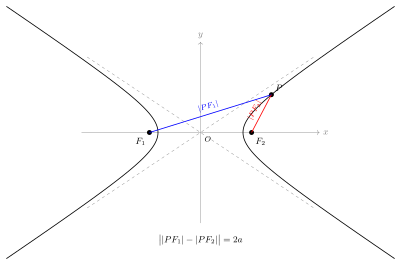
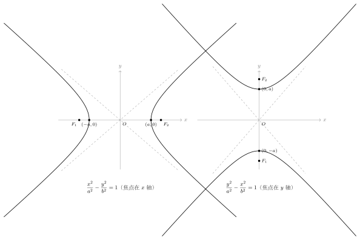

# 双曲线的定义与标准方程

> **一例速记**：  
> 平面上到两定点 $F_1$、$F_2$ 距离之**差的绝对值**等于常数 $2a$（$0 < 2a < 2c$）的点的轨迹叫**双曲线**。  
> 焦点在 $x$ 轴时，标准方程为 $\dfrac{x^2}{a^2}-\dfrac{y^2}{b^2}=1$（$a>0,\,b>0$），其中 $c^2 = a^2+b^2$（**加号**，区别于椭圆）。  
> 焦点在 $y$ 轴时，方程为 $\dfrac{y^2}{a^2}-\dfrac{x^2}{b^2}=1$（$a>0,\,b>0$）。  
> **判断焦点位置**：看哪个变量的系数为正（即哪个变量带正号），焦点就在该轴上。

---

## 一、从几何到代数：双曲线的定义

### 什么是双曲线？

在平面上，**到两个定点（焦点）$F_1$、$F_2$ 距离之差的绝对值等于常数的点的全体**，叫做**双曲线**。

这两个定点称为双曲线的**焦点**，两焦点之间的距离叫做**焦距**。

这个常数记为 $2a$，两焦点间的距离记为 $2c$（即 $|F_1F_2| = 2c$），定义写作

$$\bigl| |PF_1| - |PF_2| \bigr| = 2a, \quad 0 < 2a < 2c \quad (a > 0,\; c > a > 0)$$

### 为什么要求 $2a < 2c$？

若 $2a = 2c$，则由三角不等式的极端情形，$|PF_1| - |PF_2| = |F_1F_2|$ 只能在 $F_1$、$P$、$F_2$ 三点共线时成立，"双曲线"退化为两条射线（去掉两焦点间线段的那部分），失去曲线的几何意义。  
若 $2a > 2c$，则 $|PF_1| - |PF_2| > |F_1F_2|$，由三角不等式（任意两边之差小于第三边），平面内不存在满足条件的点，轨迹为空集。  
因此**必须 $0 < 2a < 2c$**，即 $0 < a < c$，才能保证双曲线的存在性。

### 定义与椭圆的本质区别

椭圆是"距离**之和**为常数"，双曲线是"距离**之差的绝对值**为常数"——一字之差，形状天壤之别：椭圆是封闭曲线，双曲线是**两支**开放曲线。

为什么有"绝对值"？因为平面上的点可以离 $F_1$ 更近或离 $F_2$ 更近，绝对值保证两种情形都包含——去掉绝对值得到 $|PF_1| - |PF_2| = 2a$ 只是一支（靠近 $F_2$ 的那支），$|PF_2| - |PF_1| = 2a$ 是另一支（靠近 $F_1$ 的那支），合起来才是完整的双曲线。

### 三个量的关系

| 记号 | 几何含义 |
|------|---------|
| $a$ | 实半轴（顶点到中心的距离） |
| $b$ | 虚半轴（辅助矩形的半高） |
| $c$ | 半焦距（焦点到中心的距离） |

核心关系（**注意是加号，与椭圆不同！**）：

$$\boxed{c^2 = a^2 + b^2}$$

**如何记住这个关系？** 与椭圆 $a^2 = b^2 + c^2$ 相比，双曲线中 $c$ 最大（因为 $c > a$，而椭圆中 $a$ 最大）。双曲线的焦点在顶点之外，所以"跨越"了更远的距离，$c^2 = a^2 + b^2$ 中 $c^2$ 是最大的一项。

**不等式关系**：由 $c^2 = a^2 + b^2 > a^2$ 可得 $c > a$（焦点比顶点更远离中心）；$b$ 与 $a$ 之间没有固定大小关系，当 $a = b$ 时为特殊的**等轴双曲线**。

---

## 二、标准方程的推导

以两焦点连线的中点为原点、连线所在直线为 $x$ 轴建立坐标系，则

$$F_1(-c, 0), \quad F_2(c, 0)$$

设双曲线上动点 $P(x, y)$，不妨先考虑 $|PF_1| - |PF_2| = 2a$（另一支类似）的情形：

**第一步**：用距离公式写出 $|PF_1|$ 和 $|PF_2|$：

$$\sqrt{(x+c)^2 + y^2} - \sqrt{(x-c)^2 + y^2} = 2a$$

**第二步**：移项，让一个根号在右边：

$$\sqrt{(x+c)^2 + y^2} = 2a + \sqrt{(x-c)^2 + y^2}$$

**第三步**：两边平方，展开整理：

$$(x+c)^2 + y^2 = 4a^2 + 4a\sqrt{(x-c)^2+y^2} + (x-c)^2 + y^2$$

$$x^2 + 2cx + c^2 = 4a^2 + 4a\sqrt{(x-c)^2+y^2} + x^2 - 2cx + c^2$$

$$4cx - 4a^2 = 4a\sqrt{(x-c)^2+y^2}$$

$$cx - a^2 = a\sqrt{(x-c)^2+y^2}$$

**第四步**：再次两边平方（需验证左边 $cx - a^2 \geq 0$；由 $c > a$ 且双曲线右支 $x \geq a$ 可保证）：

$$(cx - a^2)^2 = a^2[(x-c)^2 + y^2]$$

$$c^2x^2 - 2a^2cx + a^4 = a^2x^2 - 2a^2cx + a^2c^2 + a^2y^2$$

$$c^2x^2 - a^2x^2 - a^2y^2 = a^2c^2 - a^4$$

$$(c^2 - a^2)x^2 - a^2y^2 = a^2(c^2 - a^2)$$

令 $b^2 = c^2 - a^2$（$b > 0$，由 $c > a$ 保证），两边除以 $a^2b^2$：

$$\boxed{\dfrac{x^2}{a^2} - \dfrac{y^2}{b^2} = 1} \quad (a>0,\; b>0)$$

这就是**焦点在 $x$ 轴时双曲线的标准方程**。考虑另一支（$|PF_2| - |PF_1| = 2a$）会得到同一个方程，因此完整的双曲线（两支）满足同一个方程。

---

## 三、标准方程中各参数的几何意义

### 双曲线的范围

由方程 $\dfrac{x^2}{a^2}-\dfrac{y^2}{b^2}=1$，可得

$$\dfrac{x^2}{a^2} = 1 + \dfrac{y^2}{b^2} \geq 1 \Rightarrow x^2 \geq a^2 \Rightarrow x \leq -a \;\text{或}\; x \geq a$$

注意是"$\geq$"而不是"$\leq$"——双曲线上的点 $x$ **不在** $(-a, a)$ 内，而在两侧：$x \leq -a$（左支）或 $x \geq a$（右支）。

$y$ 无范围限制：随 $|x|$ 增大，$|y|$ 也无界增大，两支向外延伸到无穷远处。

### 双曲线的对称性

- **关于 $x$ 轴对称**：将 $y$ 换成 $-y$，方程不变
- **关于 $y$ 轴对称**：将 $x$ 换成 $-x$，方程不变
- **关于原点对称**：将 $(x,y)$ 换成 $(-x,-y)$，方程不变

因此双曲线也是**中心对称图形**（关于原点）和**轴对称图形**（关于两坐标轴）。

---

## 四、两种标准方程

### 4.1 焦点在 $x$ 轴

$$\dfrac{x^2}{a^2} - \dfrac{y^2}{b^2} = 1 \quad (a>0,\; b>0)$$

- 实轴在 $x$ 轴，顶点 $(\pm a, 0)$；虚轴在 $y$ 轴，辅助点 $(0, \pm b)$
- 焦点 $F_1(-c, 0)$，$F_2(c, 0)$，$c = \sqrt{a^2 + b^2}$
- **$x^2$ 项带正号，$y^2$ 项带负号** → 焦点在 $x$ 轴

### 4.2 焦点在 $y$ 轴

$$\dfrac{y^2}{a^2} - \dfrac{x^2}{b^2} = 1 \quad (a>0,\; b>0)$$

- 实轴在 $y$ 轴，顶点 $(0, \pm a)$；虚轴在 $x$ 轴，辅助点 $(\pm b, 0)$
- 焦点 $F_1(0, -c)$，$F_2(0, c)$，$c = \sqrt{a^2 + b^2}$
- **$y^2$ 项带正号，$x^2$ 项带负号** → 焦点在 $y$ 轴

### 4.3 焦点位置的快速判断

| 方程形式 | 焦点位置 |
|---------|---------|
| $\dfrac{x^2}{a^2} - \dfrac{y^2}{b^2} = 1$ | 焦点在 $x$ 轴，$(\pm c, 0)$ |
| $\dfrac{y^2}{a^2} - \dfrac{x^2}{b^2} = 1$ | 焦点在 $y$ 轴，$(0, \pm c)$ |

**记忆口诀**：哪个变量是正号，焦点就在哪条轴上（正号对应"实轴"方向）。

---

## 五、双曲线与椭圆的对比

这是高考最容易混淆的地方，必须彻底分清：

| 项目 | 椭圆 | 双曲线 |
|------|------|--------|
| **定义** | $\vert PF_1\vert +\vert PF_2\vert =2a$ | $\bigl\vert \vert PF_1\vert -\vert PF_2\vert \bigr\vert =2a$ |
| **存在条件** | $2a > 2c$（$a > c > 0$） | $2a < 2c$（$0 < a < c$） |
| **焦点在 $x$ 轴方程** | $\dfrac{x^2}{a^2}+\dfrac{y^2}{b^2}=1$，$a>b>0$ | $\dfrac{x^2}{a^2}-\dfrac{y^2}{b^2}=1$，$a>0,b>0$ |
| **$a, b, c$ 关系** | $a^2 = b^2 + c^2$（$a$ 最大） | $c^2 = a^2 + b^2$（$c$ 最大） |
| **$b$ 与 $a$ 的大小** | $a > b$（$a$ 必须最大） | $b$ 可大于、等于或小于 $a$ |
| **图形形态** | 封闭曲线（一支） | 两支开放曲线 |
| **离心率** | $e = c/a \in (0,1)$ | $e = c/a > 1$ |

**最易混淆的一个点**：
- 椭圆：$b^2 = a^2 - c^2$（$a$ 最大，要减去 $c^2$）
- 双曲线：$b^2 = c^2 - a^2$（$c$ 最大，要减去 $a^2$）

**记忆方法**：椭圆"$a$最大"所以 $a^2 = b^2 + c^2$；双曲线"$c$最大"所以 $c^2 = a^2 + b^2$。

---

## 六、由方程读取双曲线信息

**例**：双曲线 $\dfrac{x^2}{16} - \dfrac{y^2}{9} = 1$，读取所有关键量。

- $x^2$ 带正号，焦点在 $x$ 轴
- $a^2 = 16$，$b^2 = 9$，$a = 4$，$b = 3$
- $c = \sqrt{a^2+b^2} = \sqrt{16+9} = 5$
- 顶点：$(\pm 4, 0)$；焦点：$(\pm 5, 0)$
- 离心率 $e = c/a = 5/4 = 1.25 > 1$，符合双曲线
- 渐近线：$y = \pm\dfrac{b}{a}x = \pm\dfrac{3}{4}x$

---

## 七、典型应用例题

### 例 1：已知焦点求双曲线方程

**题目**：双曲线的两个焦点为 $F_1(-5, 0)$，$F_2(5, 0)$，双曲线经过点 $A(5, 4\sqrt{2}/{\sqrt{5}})$……（改为更典型的设置）

**题目**：双曲线的两个焦点为 $F_1(-5, 0)$，$F_2(5, 0)$，实轴长为 $6$，求双曲线标准方程。

**【思路】** 焦点在 $x$ 轴（$c = 5$），$2a = 6$ 所以 $a = 3$，再由 $b^2 = c^2 - a^2$ 求 $b^2$。

**解**：

焦点在 $x$ 轴，$c = 5$，$a = 3$。

$$b^2 = c^2 - a^2 = 25 - 9 = 16$$

双曲线方程：$\dfrac{x^2}{9} - \dfrac{y^2}{16} = 1$。

验证：$c = \sqrt{9+16} = 5$，焦点 $(\pm 5, 0)$，$e = 5/3 > 1$，正确。

> 解题要点：先从"焦点 → $c$"，再从"实轴长 → $a$"，最后用 $b^2 = c^2 - a^2$。注意是**减**$a^2$，不要写成 $a^2 - c^2$（那是椭圆的！）。

---

### 例 2：已知两个方程条件求双曲线

**题目**：双曲线焦点在 $y$ 轴上，且经过点 $P(2, 2\sqrt{5})$，$e = \sqrt{5}$，求双曲线方程。

**【思路】** 焦点在 $y$ 轴，设方程为 $\dfrac{y^2}{a^2}-\dfrac{x^2}{b^2}=1$。由 $e = c/a = \sqrt{5}$ 得 $c = \sqrt{5}a$，再由 $b^2 = c^2 - a^2 = 5a^2 - a^2 = 4a^2$。代入点 $P$ 坐标解 $a^2$。

**解**：

设方程为 $\dfrac{y^2}{a^2}-\dfrac{x^2}{b^2}=1$。

$e = c/a = \sqrt{5}$，故 $c = \sqrt{5}a$，$b^2 = c^2 - a^2 = 5a^2 - a^2 = 4a^2$。

代入点 $P(2, 2\sqrt{5})$：

$$\dfrac{(2\sqrt{5})^2}{a^2} - \dfrac{4}{4a^2} = 1$$

$$\dfrac{20}{a^2} - \dfrac{1}{a^2} = 1$$

$$\dfrac{19}{a^2} = 1 \Rightarrow a^2 = 19$$

故 $b^2 = 4a^2 = 76$。

双曲线方程：$\dfrac{y^2}{19} - \dfrac{x^2}{76} = 1$。

> 解题要点：焦点在 $y$ 轴时，$e = c/a$ 中的 $a$ 仍是实半轴（$y^2$ 下面那个），代入坐标时注意 $y_0$ 代入实轴变量下的分项。

---

### 例 3：含参方程的讨论

**题目**：方程 $\dfrac{x^2}{k+1}-\dfrac{y^2}{k-3}=1$ 表示焦点在 $x$ 轴的双曲线，求参数 $k$ 的范围。

**【思路】** 双曲线要求：两分母均为正且两分母同号（分别对应 $x^2$ 正，$y^2$ 负）；焦点在 $x$ 轴要求 $x^2$ 下面的分母为正，$y^2$ 下面的分母为正（$y^2$ 项整体带负号，分母需为正才构成负项）。

更精确地说：方程已经是 $\dfrac{x^2}{?} - \dfrac{y^2}{?} = 1$ 的形式，要构成合法双曲线，只需两个分母均为正数：

$$k + 1 > 0 \Rightarrow k > -1$$

$$k - 3 > 0 \Rightarrow k > 3$$

综合：$k > 3$。

验证：$k = 4$ 时，$\dfrac{x^2}{5}-\dfrac{y^2}{1}=1$，$a^2=5$，$b^2=1$，$c=\sqrt{6}$，焦点 $(\pm\sqrt{6},0)$ 在 $x$ 轴，$e = \sqrt{6/5} > 1$，正确。

> 解题要点：双曲线标准方程的分母**都必须为正**；焦点方向由哪个变量带正号决定，与分母大小无关（这是双曲线与椭圆判断焦点位置的最大区别！）。

---

## 八、易错点汇总

**易错 1：$c^2 = a^2 + b^2$，不是 $a^2 = b^2 + c^2$**

双曲线中 $c^2 = a^2 + b^2$，$c$ 最大；椭圆中 $a^2 = b^2 + c^2$，$a$ 最大。高考出题常故意混淆，务必区分。记忆方法：双曲线中焦点"跑到"顶点外面了（$c > a$），所以 $c^2 = a^2 + b^2$ 里 $c^2$ 是最大的。

**易错 2：双曲线没有"$a > b$"的约束**

椭圆要求 $a > b > 0$；双曲线只要求 $a > 0$，$b > 0$，$a$ 和 $b$ 可以相等（等轴双曲线）或 $b > a$，没有大小约束。很多同学把 $a > b$ 的习惯带入双曲线，导致错误。

**易错 3：焦点位置判断方法不同于椭圆**

- 椭圆：比较分母大小，分母大的对应长轴（焦点所在轴）
- 双曲线：看哪个变量带正号，正号那一项对应实轴（焦点所在轴）

双曲线中两个分母没有大小约束，不能用"大分母"来判断焦点位置！

**易错 4：定义中漏掉绝对值，只写一支**

$|PF_1| - |PF_2| = 2a$ 只是双曲线的一支；完整定义是 $\bigl||PF_1|-|PF_2|\bigr| = 2a$（绝对值）。用定义解题时要考虑到两支。

**易错 5：范围搞反——双曲线是"$|x| \geq a$"而非"$|x| \leq a$"**

椭圆 $-a \leq x \leq a$（点在内部），双曲线 $|x| \geq a$（点在外部两侧）。判断某点是否可能在双曲线上时，先检查 $x$ 坐标是否满足 $|x| \geq a$（焦点在 $x$ 轴时）。

---

## 九、自测题

**自测 1**　双曲线 $\dfrac{x^2}{9}-\dfrac{y^2}{16}=1$，求：(1) $a$、$b$、$c$；(2) 焦点坐标；(3) 离心率 $e$；(4) 渐近线方程。

> 提示：$a^2=9,\,b^2=16$，$a=3,\,b=4$，$c=\sqrt{9+16}=5$。焦点 $(\pm5,0)$。$e=5/3$。渐近线 $y=\pm\dfrac{4}{3}x$。

**自测 2**　双曲线 $9x^2-4y^2=36$，将方程化为标准形式，并求焦点坐标和渐近线。

> 提示：方程除以 $36$ 得 $\dfrac{x^2}{4}-\dfrac{y^2}{9}=1$，$a^2=4,\,b^2=9$，$a=2,\,b=3$，$c=\sqrt{13}$。焦点 $(\pm\sqrt{13},0)$。渐近线 $y=\pm\dfrac{3}{2}x$。

**自测 3**　双曲线焦点为 $(0, \pm 3)$，且过点 $(2, 3)$，求双曲线标准方程。

> 提示：焦点在 $y$ 轴，$c=3$，设方程 $\dfrac{y^2}{a^2}-\dfrac{x^2}{b^2}=1$，$b^2=c^2-a^2=9-a^2$。代入 $(2,3)$：$\dfrac{9}{a^2}-\dfrac{4}{9-a^2}=1$。整理：$9(9-a^2)-4a^2=a^2(9-a^2)$，$81-9a^2-4a^2=9a^2-a^4$，$a^4-22a^2+81=0$。解：$a^2=\dfrac{22\pm\sqrt{484-324}}{2}=\dfrac{22\pm\sqrt{160}}{2}=11\pm2\sqrt{10}$。需 $0<a^2<9$：$11+2\sqrt{10}\approx17.3>9$（舍），$11-2\sqrt{10}\approx4.68<9$（取）。故 $a^2=11-2\sqrt{10}$，$b^2=9-(11-2\sqrt{10})=2\sqrt{10}-2$。方程：$\dfrac{y^2}{11-2\sqrt{10}}-\dfrac{x^2}{2\sqrt{10}-2}=1$。

**自测 4**　方程 $\dfrac{x^2}{m^2-9}-\dfrac{y^2}{m+3}=1$ 表示焦点在 $x$ 轴的双曲线，求实数 $m$ 的范围。

> 提示：需 $m^2-9>0$ 且 $m+3>0$。$m^2>9\Rightarrow m>3$ 或 $m<-3$；$m>-3$。取交集：$m>3$。另外，两分母不能使方程退化（本题标准形式已确定方向，无需额外判断焦点位置）。答：$m>3$。

---

**回头看"一例速记"**：

> 双曲线定义：$\bigl||PF_1|-|PF_2|\bigr|=2a$（$0<a<c$）。  
> 焦点在 $x$ 轴：$\dfrac{x^2}{a^2}-\dfrac{y^2}{b^2}=1$（$x^2$ 带正号，$c^2=a^2+b^2$）。  
> 焦点在 $y$ 轴：$\dfrac{y^2}{a^2}-\dfrac{x^2}{b^2}=1$（$y^2$ 带正号，$c^2=a^2+b^2$）。  
> 与椭圆最大区别：定义用"差"，方程用"减号"，$c^2=a^2+b^2$（加号）。

能不看笔记写出完整推导步骤（从定义到标准方程的四步骤）并指出与椭圆的三处差异——本章，你拿下了。
