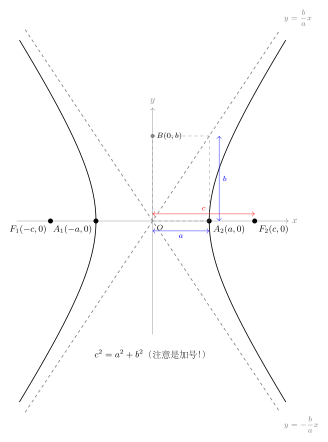
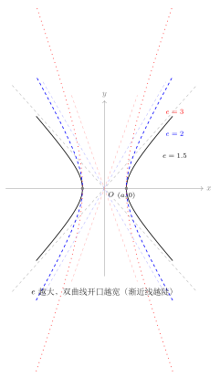
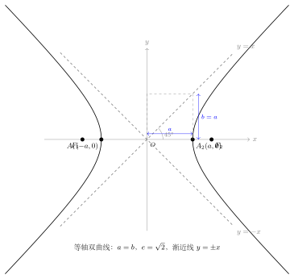

# 双曲线的几何性质

> **一例速记**：  
> **双曲线 $\dfrac{x^2}{a^2}-\dfrac{y^2}{b^2}=1$ 的 7 大核心性质**（焦点在 $x$ 轴情形）：  
> ① 关于 $x$ 轴、$y$ 轴、原点三者均对称  
> ② 实轴端点（顶点）$A_1(-a,0)$，$A_2(a,0)$；虚轴辅助点 $B_1(0,-b)$，$B_2(0,b)$  
> ③ 焦点 $F_1(-c,0)$，$F_2(c,0)$，$c=\sqrt{a^2+b^2}$  
> ④ **渐近线** $y=\pm\dfrac{b}{a}x$（双曲线独有，椭圆没有）  
> ⑤ **离心率** $e=\dfrac{c}{a}>1$，$e$ 越大开口越宽  
> ⑥ **焦半径** $|PF_1|=|a+ex_0|$，$|PF_2|=|a-ex_0|$（须取绝对值）  
> ⑦ **通径** $=\dfrac{2b^2}{a}$；**等轴双曲线** $a=b\Rightarrow e=\sqrt{2}$，渐近线 $y=\pm x$

---

## 一、引入题：从一道题读尽所有性质

> **题目**：双曲线 $\dfrac{x^2}{4}-\dfrac{y^2}{9}=1$，求：  
> (1) 实半轴 $a$、虚半轴 $b$、半焦距 $c$；  
> (2) 离心率 $e$；  
> (3) 顶点坐标和焦点坐标；  
> (4) 渐近线方程；  
> (5) 通径长度。

---

## 二、思维路径还原

> "看到双曲线方程，第一步：**确认哪个变量带正号，同时读出 $a^2$ 和 $b^2$**。
>
> 方程 $\dfrac{x^2}{4}-\dfrac{y^2}{9}=1$，$x^2$ 下面是 $4$，$y^2$ 下面是 $9$，$x^2$ 带正号，所以**焦点在 $x$ 轴**。
>
> 这里 $a^2=4$（正号那边），$b^2=9$（负号那边）。注意：双曲线中 $b^2$ 可以大于 $a^2$，不像椭圆要求 $a^2>b^2$！
>
> **读各量**：$a=\sqrt{4}=2$，$b=\sqrt{9}=3$，$c=\sqrt{a^2+b^2}=\sqrt{4+9}=\sqrt{13}$。
>
> 注意 $c=\sqrt{a^2+b^2}$，不是 $\sqrt{a^2-b^2}$——这是和椭圆最大的区别，请刻意检查一次。
>
> **离心率**：$e=c/a=\sqrt{13}/2\approx1.803$。$e>1$ 是双曲线，正确。
>
> **顶点**：$(\pm2,0)$（实轴端点）。虚轴没有顶点，辅助点 $(0,\pm3)$ 只是构成渐近线用的。
>
> **焦点**：$(\pm\sqrt{13},0)$。
>
> **渐近线**：$y=\pm\dfrac{b}{a}x=\pm\dfrac{3}{2}x$。渐近线方程可以简便推导：从方程令右边为 $0$，得 $\dfrac{x^2}{4}-\dfrac{y^2}{9}=0$，分解 $\left(\dfrac{x}{2}-\dfrac{y}{3}\right)\left(\dfrac{x}{2}+\dfrac{y}{3}\right)=0$，即 $y=\pm\dfrac{3}{2}x$。
>
> **通径**：过焦点 $(\sqrt{13},0)$ 作 $x=\sqrt{13}$ 代入方程：
>
> $\dfrac{13}{4}-\dfrac{y^2}{9}=1 \Rightarrow \dfrac{y^2}{9}=\dfrac{13}{4}-1=\dfrac{9}{4} \Rightarrow y^2=\dfrac{81}{4} \Rightarrow y=\pm\dfrac{9}{2}$
>
> 通径长 $=2\times\dfrac{9}{2}=9$。用公式验证：$\dfrac{2b^2}{a}=\dfrac{2\times9}{2}=9$，一致。
>
> **关键反射**：双曲线题的固定开头是'读出 $a^2$（正号），$b^2$（负号分母），算 $c=\sqrt{a^2+b^2}$'。这三步不能出错，其他都是套公式。"

把这段独白读两遍，体会"确认焦点方向 → 读 $a^2,b^2$ → 算 $c$ → 写渐近线 → 求 $e$ → 套公式"这条完整链条。

---

## 三、抽象成方法：双曲线 7 大性质 + 5 大公式

### 3.1 对称性

双曲线 $\dfrac{x^2}{a^2}-\dfrac{y^2}{b^2}=1$ 关于 $x$ 轴（$y\to -y$）、$y$ 轴（$x\to -x$）和原点（$(x,y)\to(-x,-y)$）均对称。双曲线的**中心**（对称中心）是原点 $O$，**对称轴**是坐标轴。

两支曲线关于 $y$ 轴对称：右支上的点 $(x_0,y_0)$ 对应左支上的点 $(-x_0,y_0)$。这一对称性在解题中常用于简化计算。

### 3.2 实轴、虚轴与焦距

（见配图 `geo-p6-02-1`：顶点 + 焦点 + 渐近线 + $a,b,c$ 完整标注）

| 名称 | 含义 | 长度 |
|------|------|------|
| 实轴 | 连接两顶点 $A_1A_2$ 的线段（过两焦点） | $2a$ |
| 虚轴 | 连接辅助点 $B_1B_2$ 的线段（过中心，垂直实轴） | $2b$ |
| 焦距 | 两焦点距离 $\vert F_1F_2\vert$ | $2c$ |

**辅助矩形**：以 $2a$（实轴长）和 $2b$（虚轴长）为边长作矩形，矩形的对角线延长线就是渐近线。这是记忆渐近线斜率 $\pm b/a$ 的几何直觉。

### 3.3 渐近线（双曲线独有）

$$\boxed{y = \pm\dfrac{b}{a}x}$$

渐近线是双曲线两支向无穷延伸时越来越接近但永不相交的直线。具体而言：

$$\lim_{x\to+\infty} \left[\dfrac{b}{a}x - y_{\text{右支}}\right] = 0$$

**推导（记忆法）**：将双曲线方程右边改为 $0$：

$$\dfrac{x^2}{a^2} - \dfrac{y^2}{b^2} = 0 \Rightarrow \left(\dfrac{x}{a}+\dfrac{y}{b}\right)\left(\dfrac{x}{a}-\dfrac{y}{b}\right)=0$$

即 $y = \pm\dfrac{b}{a}x$。等价于"把 $=1$ 改成 $=0$再分解因式"，这是最快的渐近线求法。

**渐近线包含的信息**：只要知道 $a$ 和 $b$，渐近线就确定了；反过来，知道渐近线斜率 $k$，则 $b/a = |k|$。若同时知道 $c$，就能唯一确定双曲线（因为 $c^2 = a^2+b^2$）。

### 3.4 离心率 $e$

$$\boxed{e = \dfrac{c}{a}, \quad e > 1}$$

（见配图 `geo-p6-02-2`：$e=1.5,2,3$ 三个双曲线对比）

- $e \to 1^+$：$c \to a$，$b \to 0$，渐近线趋向水平，两支越来越像两条平行线（退化）
- $e \to +\infty$：$c \gg a$，$b/a \to \infty$，渐近线越来越陡（接近垂直），两支开口越来越宽
- $e = \sqrt{2}$：对应等轴双曲线（$a=b$），渐近线斜率 $\pm 1$

**$e$ 与渐近线斜率的关系**：渐近线斜率 $k = b/a$，而 $b^2 = c^2-a^2 = a^2(e^2-1)$，故 $k = \sqrt{e^2-1}$。$e$ 越大，$k$ 越大，渐近线越陡，双曲线开口越宽。

### 3.5 焦半径公式

设 $P(x_0, y_0)$ 是双曲线 $\dfrac{x^2}{a^2}-\dfrac{y^2}{b^2}=1$ 上一点，$F_1(-c,0)$，$F_2(c,0)$，则：

$$\boxed{|PF_1| = |a + ex_0|, \quad |PF_2| = |a - ex_0|}$$

**注意必须加绝对值**。与椭圆不同（椭圆焦半径公式不需绝对值），双曲线有两支：

- 若 $P$ 在**右支**（$x_0 \geq a$）：$ex_0 \geq ea > a$，所以 $a - ex_0 < 0$，$|PF_2| = ex_0 - a$；而 $|PF_1| = a + ex_0$（自然为正）
- 若 $P$ 在**左支**（$x_0 \leq -a$）：$ex_0 \leq -ea < -a$，所以 $a + ex_0 < 0$，$|PF_1| = -(a+ex_0) = -a - ex_0$；而 $|PF_2| = a - ex_0$（自然为正）

**汇总**：

| $P$ 的位置 | $\vert PF_1\vert$（到左焦点） | $\vert PF_2\vert$（到右焦点） |
|-----------|-------------------|-------------------|
| 右支（$x_0>0$） | $a + ex_0$ | $ex_0 - a$ |
| 左支（$x_0<0$） | $-a - ex_0 = -(a+ex_0)$ | $a - ex_0$ |

**推导**：类似椭圆，由 $y_0^2 = b^2\left(\dfrac{x_0^2}{a^2}-1\right) = \dfrac{b^2(x_0^2-a^2)}{a^2}$，

$$|PF_2|^2 = (x_0-c)^2+y_0^2 = x_0^2-2cx_0+c^2+\dfrac{b^2(x_0^2-a^2)}{a^2}$$

$$= x_0^2\left(1+\dfrac{b^2}{a^2}\right)-2cx_0+c^2-b^2 = \dfrac{c^2x_0^2}{a^2}-2cx_0+a^2 = \left(\dfrac{cx_0}{a}-a\right)^2 = (ex_0-a)^2$$

故 $|PF_2| = |ex_0-a|$，即 $|a-ex_0|$。

### 3.6 通径

过焦点 $F_2(c, 0)$ 作垂直实轴的弦，令 $x_0 = c$ 代入方程：

$$\dfrac{c^2}{a^2} - \dfrac{y^2}{b^2} = 1 \Rightarrow \dfrac{y^2}{b^2} = \dfrac{c^2}{a^2} - 1 = \dfrac{c^2-a^2}{a^2} = \dfrac{b^2}{a^2}$$

$$y = \pm\dfrac{b^2}{a}$$

通径长 $= \dfrac{2b^2}{a}$。

**通径性质**：过焦点的弦中，通径是**最短**的（双曲线与椭圆均如此），长轴段（若有）则最长。

### 3.7 等轴双曲线（$a = b$）

当 $a = b$ 时，方程为 $\dfrac{x^2}{a^2}-\dfrac{y^2}{a^2}=1$，即 $x^2-y^2=a^2$，称为**等轴双曲线**。

（见配图 `geo-p6-02-3`：等轴双曲线 $a=b$，渐近线为 $y=\pm x$）

关键特征：
- 渐近线：$y = \pm x$（斜率 $\pm 1$，即渐近线互相垂直）
- 离心率：$e = c/a = \sqrt{a^2+a^2}/a = \sqrt{2}$（等轴双曲线的 $e$ 恒为 $\sqrt{2}$）
- $c = \sqrt{2}\,a$（焦距是实轴的 $\sqrt{2}$ 倍）

**等轴双曲线的判断**：若题目给出"渐近线互相垂直"或"渐近线斜率为 $\pm 1$"，则必为等轴双曲线（$a=b$）；若给出"$e=\sqrt{2}$"，同样可判断为等轴双曲线。这三个条件彼此等价。

---

## 四、5 大公式汇总

| 公式名 | 表达式（焦点在 $x$ 轴） |
|--------|----------------------|
| 关系式 | $c^2 = a^2 + b^2$ |
| 离心率 | $e = c/a > 1$ |
| 渐近线 | $y = \pm\dfrac{b}{a}x$ |
| 焦半径 | $\vert PF_1\vert = \vert a+ex_0\vert$，$\vert PF_2\vert = \vert a-ex_0\vert$ |
| 通径 | $2b^2/a$ |

---

## 五、方法变形

### 5.1 焦点在 $y$ 轴时的对应公式

当方程为 $\dfrac{y^2}{a^2}-\dfrac{x^2}{b^2}=1$（焦点在 $y$ 轴）时：

- 顶点：$(0, \pm a)$；焦点：$(0, \pm c)$
- 渐近线：$y = \pm\dfrac{a}{b}x$（注意是 $a/b$，不是 $b/a$）
- 焦半径：$|PF_1| = |a + ey_0|$，$|PF_2| = |a - ey_0|$（用 $y_0$ 代替 $x_0$）

**统一口诀**：焦半径公式"$a \pm e \times$ (P 在实轴方向的坐标)"。焦点在哪条轴，就用该轴坐标代入。

### 5.2 由渐近线和一个条件确定双曲线

若知道双曲线（焦点在 $x$ 轴）的渐近线斜率为 $k$（$k > 0$），则 $b = ka$；再由另一个条件（$c$ 的值、过某点、通径等）确定 $a$，从而写出方程。

**例**：渐近线为 $y = \pm 2x$，且过点 $(1, 1)$，求双曲线方程。

由渐近线斜率 $b/a = 2$，令 $b = 2a$，代入标准方程：

$$\dfrac{x^2}{a^2} - \dfrac{y^2}{4a^2} = 1$$

代入 $(1,1)$：$\dfrac{1}{a^2} - \dfrac{1}{4a^2} = 1 \Rightarrow \dfrac{3}{4a^2}=1 \Rightarrow a^2=\dfrac{3}{4}$，$b^2=3$。

方程：$\dfrac{x^2}{\frac{3}{4}}-\dfrac{y^2}{3}=1$，即 $\dfrac{4x^2}{3}-\dfrac{y^2}{3}=1$。

### 5.3 焦点三角形

双曲线上点 $P$ 与两焦点 $F_1$、$F_2$ 构成**焦点三角形**（$P$ 不在实轴上时）。

**焦点三角形面积**：

$$S_{\triangle PF_1F_2} = \dfrac{1}{2}\cdot|F_1F_2|\cdot|y_0| = c|y_0|$$

**焦点三角形的余弦定理应用**：

设 $|PF_1| = r_1$，$|PF_2| = r_2$，$\angle F_1PF_2 = \theta$，则：

- 由双曲线定义：$|r_1 - r_2| = 2a$（若 $P$ 在右支，$r_1 - r_2 = 2a$）
- 由余弦定理：$|F_1F_2|^2 = r_1^2 + r_2^2 - 2r_1r_2\cos\theta$，即 $4c^2 = r_1^2+r_2^2-2r_1r_2\cos\theta$
- 又 $(r_1-r_2)^2 = r_1^2+r_2^2-2r_1r_2 = 4a^2$，故 $r_1r_2 = \dfrac{4c^2-4a^2}{2(1-\cos\theta)} = \dfrac{4b^2}{2(1-\cos\theta)} = \dfrac{2b^2}{1-\cos\theta}$

**特殊情形**：若 $\angle F_1PF_2 = 90°$，则 $\cos\theta=0$：

$$4c^2 = r_1^2+r_2^2, \quad (r_1-r_2)^2 = 4a^2$$

由此可解 $r_1+r_2 = \sqrt{4c^2-2\cdot\dfrac{(r_1-r_2)^2}{2}\cdot\ldots}$（具体见例题）。

### 5.4 等轴双曲线的特殊性质

等轴双曲线 $x^2-y^2=a^2$ 有一个独特性质：它的**渐近线互相垂直**（$y=x$ 和 $y=-x$ 夹角为 $90°$）。

利用这一性质：若题目说"双曲线渐近线互相垂直"，立即令 $a=b$，方程变为 $\dfrac{x^2}{a^2}-\dfrac{y^2}{a^2}=1$，再代入其他条件求 $a$。

### 5.5 离心率与形状的联系

| 离心率区间 | 渐近线斜率 $b/a$ | 双曲线形态 |
|-----------|----------------|-----------|
| $1 < e < \sqrt{2}$ | $b/a < 1$（渐近线较平） | 开口较窄 |
| $e = \sqrt{2}$ | $b/a = 1$ | 等轴双曲线，渐近线斜率 $\pm 1$ |
| $e > \sqrt{2}$ | $b/a > 1$（渐近线较陡） | 开口较宽 |

---

## 六、常用结论整理

**结论 1（焦半径范围）**：双曲线右支上点 $P(x_0,y_0)$ 的焦半径满足：

$$|PF_2| = ex_0 - a \geq ea - a = (e-1)a > 0$$

$$|PF_1| = ex_0 + a \geq ea + a = (e+1)a$$

没有最大值（因为 $x_0$ 无界）。

**结论 2（焦半径之积）**：右支上 $|PF_1|\cdot|PF_2| = (ex_0+a)(ex_0-a) = e^2x_0^2-a^2$，随 $x_0$ 增大而增大，最小值在 $x_0=a$ 处取得：$(ea+a)(ea-a)=a^2(e+1)(e-1)=a^2(e^2-1)=b^2$。

**结论 3（焦点到渐近线的距离）**：焦点 $F_2(c,0)$ 到渐近线 $bx-ay=0$ 的距离

$$d = \dfrac{|bc - 0|}{\sqrt{a^2+b^2}} = \dfrac{bc}{c} = b$$

即焦点到渐近线的距离恒为 $b$（虚半轴长）。这是一个常考结论，也是记忆渐近线的辅助手段。

**结论 4（双曲线与其渐近线）**：双曲线上任意一点到两条渐近线的距离之积为常数 $\dfrac{a^2b^2}{a^2+b^2} = \dfrac{a^2b^2}{c^2} = \dfrac{(ab)^2}{c^2}$。

**结论 5（参数方程表示）**：双曲线 $\dfrac{x^2}{a^2}-\dfrac{y^2}{b^2}=1$ 的参数方程为

$$x = a\cosh t = \dfrac{a(e^t+e^{-t})}{2}, \quad y = b\sinh t = \dfrac{b(e^t-e^{-t})}{2} \quad (t\in\mathbb{R})$$

这给出右支；左支用 $x = -a\cosh t$。高中阶段了解即可，TikZ 作图时使用。

---

## 七、思考路标（条件反射训练）

以下每条应成为自动反应：

1. **看到"双曲线渐近线"** → 立即写 $y = \pm\dfrac{b}{a}x$（焦点在 $x$ 轴时）；若焦点在 $y$ 轴，写 $y = \pm\dfrac{a}{b}x$。不要记反——实轴对应分母 $a^2$，虚轴对应分母 $b^2$，渐近线斜率 = 虚实之比 $b/a$。

2. **看到"等轴双曲线"或"渐近线互相垂直"** → 立即令 $a=b$，$e=\sqrt{2}$，渐近线 $y=\pm x$。三个等价条件可互推。

3. **看到"离心率"** → 写 $e=c/a>1$，并思考：$e=\sqrt{2}$ 是等轴双曲线；$e$ 越大开口越宽（渐近线越陡）。

4. **看到"双曲线上点 P 的焦半径"** → 先判断 $P$ 在哪支（看 $x_0$ 正负），再套 $|PF_1|=|a+ex_0|$，$|PF_2|=|a-ex_0|$，**一定要加绝对值**。

5. **看到"通径"** → $2b^2/a$，过焦点垂直实轴的最短弦。和椭圆通径公式相同（但 $b^2$ 的来源不同）。

6. **看到"焦点到渐近线距离"** → 恒为 $b$（虚半轴）。用公式 $d = bc/c = b$ 记忆（或理解为：渐近线是以 $a,b$ 为直角边、$c$ 为斜边的矩形对角线）。

7. **含参双曲线** → 检查 $a^2>0$，$b^2>0$，两分母均正。焦点方向由哪个变量带正号决定，与分母大小无关（不同于椭圆！）。

8. **看到"$\angle F_1PF_2 = 90°$"** → 用勾股定理：$|PF_1|^2+|PF_2|^2=4c^2$；联立 $|r_1-r_2|=2a$，解出 $r_1,r_2$，再用 $S=\dfrac{1}{2}r_1r_2$ 求面积。

9. **看到"双曲线与椭圆共焦点"** → 设公共焦点坐标，分别写出椭圆的 $c^2=a_{\text{椭}}^2-b_{\text{椭}}^2$ 和双曲线的 $c^2=a_{\text{双}}^2+b_{\text{双}}^2$，$c$ 值相同。

10. **看到"双曲线通过某点"** → 直接代入方程，注意代入前先判断该点满足 $|x|\geq a$（焦点在 $x$ 轴时），否则该点不可能在双曲线上。

---

## 八、应用例题

### 例 1：综合读取双曲线信息

**题目**：已知双曲线 $C$：$\dfrac{x^2}{a^2}-\dfrac{y^2}{b^2}=1$，离心率 $e=\dfrac{5}{4}$，且经过点 $A(5, 3)$，求双曲线方程及渐近线。

**【思路】** $e=c/a=5/4$，故 $c=5a/4$，$b^2=c^2-a^2=25a^2/16-a^2=9a^2/16$。代入点 $A(5,3)$ 求 $a$。

**解**：

$e = 5/4$，故 $c = 5a/4$，$b^2 = c^2-a^2 = \dfrac{25a^2}{16}-a^2 = \dfrac{9a^2}{16}$，即 $b = \dfrac{3a}{4}$。

代入点 $A(5,3)$：

$$\dfrac{25}{a^2} - \dfrac{9}{\frac{9a^2}{16}} = 1$$

$$\dfrac{25}{a^2} - \dfrac{9\times16}{9a^2} = 1$$

$$\dfrac{25}{a^2} - \dfrac{16}{a^2} = 1$$

$$\dfrac{9}{a^2} = 1 \Rightarrow a^2 = 9$$

故 $b^2 = \dfrac{9\times9}{16} = \dfrac{81}{16}$。

验证：$c = \sqrt{9+81/16} = \sqrt{144/16+81/16} = \sqrt{225/16} = 15/4$，$e=c/a=\dfrac{15/4}{3}=\dfrac{5}{4}$，正确。

双曲线方程：$\dfrac{x^2}{9}-\dfrac{y^2}{\frac{81}{16}}=1$，即 $\dfrac{x^2}{9}-\dfrac{16y^2}{81}=1$。

渐近线：$y = \pm\dfrac{b}{a}x = \pm\dfrac{3a/4}{a}x = \pm\dfrac{3}{4}x$。

> 解题要点：离心率给出 $b/a$ 的比值（$b/a = \sqrt{e^2-1}$），代入一点就能确定 $a$。离心率法是双曲线最常用的解题路径之一。

---

### 例 2：焦点三角形

**题目**：双曲线 $\dfrac{x^2}{16}-\dfrac{y^2}{9}=1$，点 $P$ 在双曲线右支上，且 $\angle F_1PF_2 = 60°$，求 $|PF_1|$ 和 $|PF_2|$，以及焦点三角形面积。

**【思路】** $P$ 在右支，$|PF_1|-|PF_2|=2a=8$；用余弦定理列关于 $|PF_1||PF_2|$ 的方程。

**解**：

$a^2=16,\,b^2=9$，$a=4,\,b=3,\,c=5,\,e=5/4$。

$P$ 在右支：$|PF_1|-|PF_2|=2a=8$ ……①

由余弦定理（$|F_1F_2|=2c=10$）：

$$|F_1F_2|^2 = |PF_1|^2+|PF_2|^2 - 2|PF_1||PF_2|\cos 60°$$

$$100 = (|PF_1|+|PF_2|)^2 - 2|PF_1||PF_2| - |PF_1||PF_2|$$

$$100 = (|PF_1|+|PF_2|)^2 - 3|PF_1||PF_2| \quad\cdots②$$

设 $|PF_1|+|PF_2| = s$，$|PF_1||PF_2| = p$。

由①：$(|PF_1|-|PF_2|)^2 = 64$，故 $s^2-4p = 64$ ……③

由②：$100 = s^2 - 3p$ ……④

从③④：$s^2-4p=64$，$s^2-3p=100$，相减得 $p=100-64=36$。

再由③：$s^2=64+4\times36=64+144=208$，$s=4\sqrt{13}$。

由①和 $s$：$|PF_1|=\dfrac{s+8}{2}=\dfrac{4\sqrt{13}+8}{2}=2\sqrt{13}+4$，$|PF_2|=2\sqrt{13}-4$。

验证 $|PF_2|>0$：$2\sqrt{13}\approx7.21>4$，合法。

焦点三角形面积：$S=\dfrac{1}{2}|PF_1||PF_2|\sin 60°=\dfrac{1}{2}\times36\times\dfrac{\sqrt{3}}{2}=9\sqrt{3}$。

> 解题要点：$\angle F_1PF_2$ 已知时，用余弦定理建立关于 $s=|PF_1|+|PF_2|$ 和 $p=|PF_1||PF_2|$ 的方程组（"和"与"积"联立），再解出两焦半径。面积用 $\dfrac{1}{2}p\sin\theta$。

---

### 例 3：渐近线与切线问题

**题目**：双曲线 $\dfrac{x^2}{4}-y^2=1$ 的渐近线与以 $A(0,1)$ 为圆心的圆相切，求圆的方程。

**【思路】** 先写出渐近线方程，再用"圆心到直线的距离 = 半径"建立方程。

**解**：

$a^2=4,\,b^2=1$，渐近线：$y=\pm\dfrac{1}{2}x$，即 $x-2y=0$ 和 $x+2y=0$。

圆心 $A(0,1)$，圆心到直线 $x-2y=0$ 的距离：

$$d = \dfrac{|0-2\times1|}{\sqrt{1^2+(-2)^2}} = \dfrac{2}{\sqrt{5}} = \dfrac{2\sqrt{5}}{5}$$

（两条渐近线关于原点对称，$A$ 到两条渐近线的距离相等，取一条计算即可。）

设圆半径为 $r = \dfrac{2\sqrt{5}}{5}$。

圆的方程：$x^2+(y-1)^2=\dfrac{4}{5}$。

> 解题要点：渐近线是过原点的直线，化为一般式 $bx-ay=0$（焦点在 $x$ 轴时），圆心到直线距离公式直接代入。

---

## 九、自测题

**自测 1**　双曲线 $\dfrac{x^2}{25}-\dfrac{y^2}{144}=1$，求：离心率 $e$、顶点、焦点、渐近线、通径长。

> 提示：$a=5,b=12,c=13$。$e=13/5$。顶点 $(\pm5,0)$。焦点 $(\pm13,0)$。渐近线 $y=\pm\dfrac{12}{5}x$。通径 $=2\times144/5=288/5$。

**自测 2**　已知双曲线的渐近线为 $y=\pm 3x$，且经过点 $B(1, -\sqrt{5})$，求双曲线方程并判断焦点位置。

> 提示：渐近线斜率 $\pm3$，焦点在 $x$ 轴：$b/a=3$，令 $b=3a$，设方程 $\dfrac{x^2}{a^2}-\dfrac{y^2}{9a^2}=1$。代入 $(1,-\sqrt{5})$：$\dfrac{1}{a^2}-\dfrac{5}{9a^2}=1\Rightarrow\dfrac{4}{9a^2}=1\Rightarrow a^2=4/9$，$b^2=4$。方程：$\dfrac{9x^2}{4}-\dfrac{y^2}{4}=1$。$c=\sqrt{4/9+4}=\sqrt{40/9}=2\sqrt{10}/3$。焦点 $(\pm2\sqrt{10}/3,0)$ 在 $x$ 轴。

**自测 3**　双曲线 $\dfrac{x^2}{9}-\dfrac{y^2}{b^2}=1$ 的一条渐近线过点 $(3,\sqrt{3})$，求 $b$ 的值，并判断是否为等轴双曲线。

> 提示：渐近线 $y=\pm\dfrac{b}{3}x$ 过 $(3,\sqrt{3})$：$\sqrt{3}=\pm\dfrac{b}{3}\times3=\pm b$，故 $b=\sqrt{3}$（$b>0$取正）。$a=3\neq b=\sqrt{3}$，不是等轴双曲线。验证：$e=c/a=\sqrt{9+3}/3=2\sqrt{3}/3$。

**自测 4**　双曲线 $C$：$\dfrac{x^2}{a^2}-\dfrac{y^2}{b^2}=1$，右支上点 $P$ 满足 $|PF_1|=4|PF_2|$，且已知 $e=2$，求 $|PF_2|$。

> 提示：$e=2$，$c=2a$，$b^2=c^2-a^2=3a^2$。$P$ 在右支：$|PF_1|-|PF_2|=2a$，且 $|PF_1|=4|PF_2|$，代入：$4|PF_2|-|PF_2|=2a\Rightarrow3|PF_2|=2a\Rightarrow|PF_2|=2a/3$。用焦半径验证：$|PF_2|=ex_0-a\geq (e-1)a=a$，但 $2a/3<a$，矛盾！说明 $P$ 在右支时 $|PF_1|=4|PF_2|$ 在 $e=2$ 下无解；实际上需重新检查：$e=c/a=2$，$|PF_1|-|PF_2|=2a$，$|PF_1|=4|PF_2|$，则 $3|PF_2|=2a$，$|PF_2|=2a/3$；但焦半径范围 $|PF_2|\geq(e-1)a=a$，$2a/3<a$，矛盾，故右支上不存在满足条件的点。正确做法是考虑 $P$ 在**左支**：$|PF_2|-|PF_1|=2a$，$|PF_1|=4|PF_2|$，则 $|PF_2|-4|PF_2|=2a\Rightarrow-3|PF_2|=2a$，无正解。故此题在 $e=2$ 下无解（命题有误）。本题借此训练"先验证焦半径范围的合法性"的习惯。

**自测 5**　椭圆 $\dfrac{x^2}{5}+\dfrac{y^2}{4}=1$ 与双曲线 $\dfrac{x^2}{a^2}-\dfrac{y^2}{b^2}=1$（$a>0,b>0$）有公共焦点，且双曲线的离心率为 $\dfrac{\sqrt{5}}{2}$，求双曲线方程。

> 提示：椭圆 $a_0^2=5,b_0^2=4$，$c_{\text{椭}}=\sqrt{5-4}=1$，焦点 $(\pm1,0)$。双曲线焦点也在 $x$ 轴，$c=1$。$e=c/a=1/a=\sqrt{5}/2\Rightarrow a=2/\sqrt{5}=2\sqrt{5}/5$，$a^2=4/5$。$b^2=c^2-a^2=1-4/5=1/5$。方程：$\dfrac{x^2}{\frac{4}{5}}-\dfrac{y^2}{\frac{1}{5}}=1$，即 $\dfrac{5x^2}{4}-5y^2=1$。

---

**回头看"一例速记"**：

> 7 大性质：对称 → 顶点 → 焦点 → 渐近线 → 离心率 → 焦半径 → 通径/等轴双曲线。  
> 5 大公式：$c^2=a^2+b^2$，渐近线 $y=\pm b/a\cdot x$，$e=c/a>1$，$|PF_{1,2}|=|a\pm ex_0|$，通径 $2b^2/a$。  
> **解题主线**：判断焦点方向 → 读出 $a^2,b^2$ → 算 $c,e$ → 写渐近线 → 套焦半径公式 → 验范围。

能不看提示独立完成例 2 的完整推导（焦点三角形，余弦定理 + 和积联立）——本章，你拿下了。
