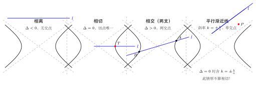
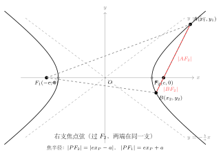

# 直线与双曲线的位置关系

> **一例速记**：
>
> 与椭圆 / 抛物线**不同**！直线与双曲线**单交点**有两种情形：
>
> ① $\Delta = 0$（相切，切点唯一）
>
> ② 直线**平行于渐近线**（斜率 $k = \pm\dfrac{b}{a}$，方程二次项消失，必得单交点，但**不算相切**！）
>
> **弦长公式**（与椭圆形式相同）：
> $$|AB| = \sqrt{1+k^2}\cdot\sqrt{(x_1+x_2)^2 - 4x_1 x_2}$$
>
> **中点弦点差法**（注意与椭圆差一个符号）：
> $$k_{AB} = \frac{b^2 x_0}{a^2 y_0}$$
> 其中 $(x_0, y_0)$ 是弦 $AB$ 的中点，双曲线为 $\dfrac{x^2}{a^2} - \dfrac{y^2}{b^2} = 1$。

---

## 一、引入：直线与双曲线单交点的分析

> **题目**：分析直线 $y = k(x-2)$ 与双曲线 $\dfrac{x^2}{4} - y^2 = 1$ 的单交点情形，求满足"直线与双曲线恰有一个公共点"的 $k$ 的所有值。

这是一道看似与椭圆同类的题，实则藏着双曲线特有的陷阱：单交点不只来自 $\Delta = 0$，还可能来自直线平行于渐近线。稍不留神，就会漏掉一类解。

---

## 二、思维路径还原

> **目标**：找到使直线与双曲线恰有一个公共点的所有 $k$ 值。
>
> **第一步：写出渐近线，确定"危险斜率"。**
>
> 双曲线 $\dfrac{x^2}{4} - y^2 = 1$ 的渐近线为 $y = \pm\dfrac{1}{2}x$，即斜率 $k = \pm\dfrac{1}{2}$。
>
> 当直线斜率 $k = \pm\dfrac{1}{2}$ 时，直线平行于（或重合于）渐近线，需要**单独讨论**。
>
> **第二步：代入消元，观察方程结构（$k \neq \pm\dfrac{1}{2}$）。**
>
> 将 $y = k(x-2)$ 代入 $\dfrac{x^2}{4} - y^2 = 1$：
>
> $$\frac{x^2}{4} - k^2(x-2)^2 = 1$$
>
> 乘以 4，展开：
>
> $$x^2 - 4k^2(x^2 - 4x + 4) = 4$$
>
> $$x^2 - 4k^2 x^2 + 16k^2 x - 16k^2 = 4$$
>
> $$(1 - 4k^2)x^2 + 16k^2 x - (16k^2 + 4) = 0 \quad (\star)$$
>
> **当 $k = \pm\dfrac{1}{2}$ 时，$(1-4k^2) = 0$，方程 $(\star)$ 变为一次方程**，这正是"平行于渐近线"的特征：方程降次，只有一个解，但这不是切线。
>
> - 若 $k = \dfrac{1}{2}$：$(\star)$ 变为 $4x - 8 = 0$，即 $x = 2$，$y = 0$。交点为 $(2, 0)$。
>   验证：$(2,0)$ 是否在双曲线上？$\dfrac{4}{4} - 0 = 1$，成立！故单交点存在。
>
> - 若 $k = -\dfrac{1}{2}$：同理得 $x = 2$，$y = 0$，单交点 $(2, 0)$。
>
> 注意：点 $(2, 0)$ 是双曲线上的点，但这里的单交点是因为直线平行渐近线（方程降次），**不是相切**。
>
> **第三步：当 $1-4k^2 \neq 0$（即 $k \neq \pm\dfrac{1}{2}$），用判别式 $\Delta$ 处理。**
>
> 方程 $(\star)$ 是二次方程，恰有一个实根当且仅当 $\Delta = 0$。
>
> $$\Delta = (16k^2)^2 - 4(1-4k^2)(-(16k^2+4))$$
>
> $$= 256k^4 + 4(1-4k^2)(16k^2+4)$$
>
> 展开 $(1-4k^2)(16k^2+4)$：
>
> $$= 16k^2 + 4 - 64k^4 - 16k^2 = 4 - 64k^4$$
>
> 故：
>
> $$\Delta = 256k^4 + 4(4-64k^4) = 256k^4 + 16 - 256k^4 = 16$$
>
> $\Delta = 16 > 0$ 恒成立！这说明当 $k \neq \pm\dfrac{1}{2}$ 且方程 $(\star)$ 是二次方程时，方程**永远有两个不同实根**（即直线与双曲线有两个公共点）。
>
> **第四步：还需检验"两个交点是否都在双曲线上"（排除增根）。**
>
> 双曲线无实数上的"增根"问题，但有一个隐患：二次方程的两根 $x_1, x_2$ 对应的点可能有一个在"增广椭圆"（实际上不在双曲线上，因为化简时没有问题）。
>
> 由于双曲线方程无分母消零的问题，且 $\Delta > 0$，两根均有效，直线确实与双曲线有两个公共点。
>
> **结论**：使直线与双曲线恰有一个公共点的 $k$ 值为：
>
> $$\boxed{k = \pm\frac{1}{2}}$$
>
> 即当直线斜率等于渐近线斜率时，直线平行渐近线，方程降为一次，恰有一个公共点（且不是相切）。对任意其他 $k$ 值，$\Delta = 16 > 0$，直线与双曲线恒有两个公共点。
>
> **关键反射**：这道题与椭圆的根本区别在于：椭圆无渐近线，$\Delta = 0$ 是单交点的唯一来源；双曲线有渐近线，平行渐近线的直线使方程降次，从而产生"另一类单交点"。每次做双曲线相交题，第一步先检查斜率是否等于 $\pm b/a$。

把这段内心独白读两遍，感受"先检查渐近线斜率 → 再代入讨论二次项系数 → 分类 $\Delta$"三步的必然逻辑。

---

## 三、四种位置关系的完整框架

（见配图 `geo-p6-03-1`：直线与双曲线 4 种位置关系）

### 3.1 位置判别：先渐近线，后判别式

设双曲线 $\dfrac{x^2}{a^2} - \dfrac{y^2}{b^2} = 1$，渐近线 $y = \pm\dfrac{b}{a}x$，直线 $l: y = kx + m$。

**第一步：判断斜率是否等于渐近线斜率。**

| 斜率条件 | 方程特征 | 位置关系 | 交点数 |
|----------|----------|----------|--------|
| $k = \pm\dfrac{b}{a}$ 且 $m \neq \mp\dfrac{b^2}{a}$（偏移量不为 0） | 方程降为一次 | 平行渐近线，**单交点**（非切点） | 1 |
| $k = \pm\dfrac{b}{a}$ 且 $m = \mp\dfrac{b^2}{a}$（直线过渐近线上某点，实为渐近线） | 方程无解 | 直线即渐近线（无交点，趋近不相交） | 0 |

**第二步：当 $k \neq \pm\dfrac{b}{a}$ 时，代入消元，得二次方程，用 $\Delta$ 判断。**

将 $y = kx + m$ 代入，整理后得：

$$(b^2 - a^2 k^2)x^2 - 2a^2 km \cdot x - a^2(m^2 + b^2) = 0$$

记 $A_0 = b^2 - a^2 k^2$（二次项系数，当 $k \neq \pm b/a$ 时 $A_0 \neq 0$）。

**判别式**：

$$\Delta = 4a^4 k^2 m^2 + 4(b^2 - a^2 k^2)\cdot a^2(m^2 + b^2)$$

| 判别条件 | 位置关系 | 交点数 |
|----------|----------|--------|
| $\Delta > 0$ | 直线与双曲线**相交** | 2（可能同支或异支） |
| $\Delta = 0$ | 直线与双曲线**相切** | 1（切点，真正的切线） |
| $\Delta < 0$ | 直线与双曲线**相离** | 0 |

> **与椭圆的关键差异**：椭圆是封闭曲线，$\Delta < 0$ 必相离；双曲线是两支开放曲线，还有"平行渐近线"这一特殊单交点情形，**这是双曲线独有的陷阱**。

### 3.2 弦长公式

当直线与双曲线相交于 $A(x_1,y_1)$，$B(x_2,y_2)$ 时，弦长公式与椭圆完全相同：

$$\boxed{|AB| = \sqrt{1+k^2}\cdot\sqrt{(x_1+x_2)^2 - 4x_1 x_2}}$$

由韦达定理对方程 $(b^2 - a^2 k^2)x^2 - 2a^2 km x - a^2(m^2+b^2) = 0$：

$$x_1+x_2 = \frac{2a^2 km}{b^2-a^2k^2}, \qquad x_1 x_2 = \frac{-a^2(m^2+b^2)}{b^2-a^2k^2}$$

代入弦长公式即可计算。

**记忆口诀**：弦长公式形式不变（$\sqrt{1+k^2}$ 乘以"$x$ 差的绝对值"），但韦达定理的分母是 $b^2 - a^2k^2$（双曲线）而不是 $b^2 + a^2k^2$（椭圆）——差一个正负号，绝对不能混淆。

### 3.3 切线方程

双曲线 $\dfrac{x^2}{a^2} - \dfrac{y^2}{b^2} = 1$ 上一点 $(x_0, y_0)$ 处的切线方程为：

$$\boxed{\frac{x_0 x}{a^2} - \frac{y_0 y}{b^2} = 1}$$

与椭圆切线公式 $\dfrac{x_0 x}{a^2} + \dfrac{y_0 y}{b^2} = 1$ 相比，仅中间符号不同（双曲线是减号）。

---

## 四、5 大方法套路

### 套路 1：先检查渐近线斜率（双曲线独有的第一步）

**规则**：拿到直线与双曲线相交的题，第一步永远先看直线斜率是否等于 $\pm\dfrac{b}{a}$。

- **斜率等于渐近线斜率**：二次项系数为 0，方程降次，分情形讨论（单交点或无交点）。
- **斜率不等于渐近线斜率**：继续套路 2～5。

**典型错误**：题目问"直线与双曲线有且仅有一个公共点"，漏掉平行渐近线的情形，只令 $\Delta = 0$，得到不完整的答案。

### 套路 2：代入消元

**步骤**：将直线方程代入双曲线 → 整理成二次方程（注意二次项系数 $b^2 - a^2 k^2$ 的符号）→ 用 $\Delta$ 判位置 / 用韦达定理求 $x_1+x_2$，$x_1x_2$。

**关键提示**：
- 若直线斜率存在，代入 $y = kx+m$ 消 $y$；
- 若直线可能竖直（$x = x_0$），单独代入 $x = x_0$ 求 $y$（注意双曲线方程可能有 $y^2 < 0$ 无解的情形）；
- 代入后整理，分母是 $b^2 - a^2k^2$（双曲线！），与椭圆的 $b^2 + a^2k^2$ 相差一个符号。

### 套路 3：韦达定理

代入后得 $px^2 + qx + r = 0$，则：

$$x_1+x_2 = -\frac{q}{p}, \quad x_1 x_2 = \frac{r}{p}$$

**双曲线版本的系数**（直线 $y = kx+m$，双曲线 $\dfrac{x^2}{a^2}-\dfrac{y^2}{b^2}=1$）：

$$p = b^2 - a^2k^2, \quad q = -2a^2km, \quad r = -a^2(m^2+b^2)$$

**常见用法**：
- 计算 $(x_1-x_2)^2 = (x_1+x_2)^2 - 4x_1x_2$（弦长）；
- 判断两交点是否同属一支（同支：$x_1 x_2 > 0$）；
- 求弦中点 $x_0 = (x_1+x_2)/2$（中点弦轨迹）。

### 套路 4：弦长公式

**斜率存在时**：

$$|AB| = \sqrt{1+k^2} \cdot \sqrt{(x_1+x_2)^2 - 4x_1x_2}$$

**斜率不存在（竖直弦 $x = x_0$）**：

$$|AB| = |y_1-y_2| = 2b\sqrt{\frac{x_0^2}{a^2}-1} \qquad (|x_0| > a)$$

注意：双曲线上竖直弦 $|AB| = 2b\sqrt{x_0^2/a^2 - 1}$（根号内是"减 1"，与椭圆的"$1 - x_0^2/a^2$"相反）。

### 套路 5：中点弦点差法（注意正负号！）

（见配图 `geo-p6-03-2`：双曲线焦点弦示意）

**推导**：设 $A(x_1,y_1)$、$B(x_2,y_2)$ 均在双曲线 $\dfrac{x^2}{a^2} - \dfrac{y^2}{b^2} = 1$ 上：

$$\frac{x_1^2}{a^2} - \frac{y_1^2}{b^2} = 1 \quad (1)$$

$$\frac{x_2^2}{a^2} - \frac{y_2^2}{b^2} = 1 \quad (2)$$

$(1) - (2)$：

$$\frac{x_1^2-x_2^2}{a^2} - \frac{y_1^2-y_2^2}{b^2} = 0$$

$$\frac{(x_1+x_2)(x_1-x_2)}{a^2} - \frac{(y_1+y_2)(y_1-y_2)}{b^2} = 0$$

设弦斜率 $k_{AB} = \dfrac{y_1-y_2}{x_1-x_2}$，中点 $(x_0, y_0) = \left(\dfrac{x_1+x_2}{2}, \dfrac{y_1+y_2}{2}\right)$，代入：

$$\frac{2x_0}{a^2} - \frac{2y_0}{b^2}\cdot k_{AB} = 0$$

$$\boxed{k_{AB} = \frac{b^2 x_0}{a^2 y_0}}$$

**与椭圆的区别**：椭圆中点弦斜率是 $-\dfrac{b^2 x_0}{a^2 y_0}$（有负号），双曲线是 $+\dfrac{b^2 x_0}{a^2 y_0}$（无负号，正号）。这个符号差异是高频考点，必须牢记。

**记忆技巧**：双曲线方程中间是"减号"，点差法结果中间也"变符号"（去掉负号）。

---

## 五、方法变形

### 5.1 焦点弦与焦半径

（见配图 `geo-p6-03-2`）

**焦半径公式**（双曲线 $\dfrac{x^2}{a^2}-\dfrac{y^2}{b^2}=1$，右焦点 $F_2(c,0)$，$e = c/a > 1$）：

- 点 $P(x_P, y_P)$ 在**右支**上（$x_P > 0$）：
$$|PF_1| = a + ex_P, \qquad |PF_2| = ex_P - a$$

- 点 $P(x_P, y_P)$ 在**左支**上（$x_P < 0$）：
$$|PF_1| = -(a + ex_P) = -a - ex_P, \qquad |PF_2| = -(ex_P - a) = a - ex_P$$

（取正值，因为 $x_P < 0$，$e|x_P| > a$。）

**焦点弦**（双曲线同支焦点弦）：过焦点 $F_2$ 且两端点都在同一支（右支）上。

通径（过焦点垂直于实轴的弦）：$x = c$，代入双曲线：

$$y^2 = b^2\left(\frac{c^2}{a^2}-1\right) = b^2 \cdot \frac{c^2-a^2}{a^2} = \frac{b^4}{a^2}$$

通径长 $= 2|y| = \dfrac{2b^2}{a}$（与椭圆通径公式形式相同，但意义不同——双曲线的通径是同支焦点弦中的一条）。

**焦点弦调和关系**：过焦点 $F_2$ 的同支弦两端点 $A, B$（都在右支），设 $r_1 = |AF_2|$，$r_2 = |BF_2|$，则：

$$\frac{1}{r_1} + \frac{1}{r_2} = \frac{2a}{b^2}$$

这与椭圆焦点弦调和关系形式相同（用 $a, b$ 表示时一致），但双曲线 $a < c$，$e > 1$，背景不同。

### 5.2 同支与异支弦的判断

由韦达定理，两交点 $x_1, x_2$ 满足 $x_1 x_2 = \dfrac{-a^2(m^2+b^2)}{b^2-a^2k^2}$。

由于 $a^2(m^2+b^2) > 0$，故 $x_1 x_2$ 的符号由 $b^2 - a^2k^2$ 的符号决定：

- $|k| < \dfrac{b}{a}$（直线斜率小于渐近线斜率）：$b^2 - a^2k^2 > 0$，$x_1 x_2 < 0$，两点**异支**；
- $|k| > \dfrac{b}{a}$（直线斜率大于渐近线斜率）：$b^2 - a^2k^2 < 0$，$x_1 x_2 > 0$，两点**同支**。

**几何直觉**：斜率小于渐近线斜率的直线"穿越"双曲线两支；斜率大于渐近线斜率的直线"劈"过同一支的两点。

### 5.3 弦中点轨迹

**问题形式**：弦 $AB$ 满足某条件（如斜率固定、过定点），求弦中点 $M$ 的轨迹。

**步骤**：
1. 设中点 $M(x_0, y_0)$；
2. 由点差法得弦斜率 $k_{AB} = \dfrac{b^2 x_0}{a^2 y_0}$；
3. 由附加条件（弦过定点 / 斜率值已知）给出第二个约束；
4. 联立消参，得轨迹方程；
5. 注意检验中点坐标的合法性（$M$ 必须在双曲线"内部"，即对应的弦确实存在）。

### 5.4 斜率不存在的情形

当直线为 $x = x_0$（$|x_0| > a$）时，代入双曲线：$y^2 = b^2\left(\dfrac{x_0^2}{a^2}-1\right)$。

若 $|x_0| > a$，有两个交点（同支上方和下方）；若 $|x_0| = a$，$y = 0$（顶点，单交点）；若 $|x_0| < a$，$y^2 < 0$，无实交点（直线穿过双曲线"内部空隙"）。

---

## 六、思考路标（条件反射训练）

以下每条都应内化为自动反应：

1. **看到"直线与双曲线公共点"** → 第一步先写渐近线斜率 $\pm b/a$，判断直线斜率是否等于它。不要上来就代入——平行渐近线情形会让你的二次方程"失效"。

2. **看到"恰有一个公共点"** → 两种来源：(i) $\Delta = 0$（相切）；(ii) 斜率 $= \pm b/a$（平行渐近线）。两种都要列出，缺一漏答必丢分。

3. **看到"弦长"** → 弦长公式 $\sqrt{1+k^2}\cdot\sqrt{(x_1+x_2)^2-4x_1x_2}$，韦达定理分母是 $b^2-a^2k^2$（负号！），绝对不能写成 $b^2+a^2k^2$（那是椭圆）。

4. **看到"弦中点"** → 点差法，双曲线中点弦斜率是 $k = \dfrac{b^2 x_0}{a^2 y_0}$（**正号**），椭圆是负号。默写公式前先想一遍推导。

5. **含参数 $k$ 时** → 结论写完后验证：(i) $\Delta > 0$（两交点确实存在）；(ii) 讨论 $k = \pm b/a$ 的特殊情形；(iii) 可能还需讨论竖直线（斜率不存在）。

6. **看到"焦点弦"** → 先用焦半径公式 $|PF| = |ex_P \pm a|$ 建立方程（通常比代入消元更简洁）；同支还是异支，取决于 $|k|$ 与 $b/a$ 的大小。

7. **看到"同支"还是"异支"** → 看 $x_1x_2$ 的符号：$x_1x_2 < 0$ 异支，$x_1x_2 > 0$ 同支。由韦达定理，$x_1x_2$ 的符号由 $b^2-a^2k^2$ 决定，即由斜率绝对值与 $b/a$ 的大小关系决定。

8. **切线问题** → 切点在双曲线上已知时，直接用 $\dfrac{x_0x}{a^2} - \dfrac{y_0y}{b^2}=1$；外点求切线时，设斜率 $k$，令 $\Delta=0$ 解 $k$，同时检查竖直切线是否存在（$x = \pm a$ 处）。

---

## 七、应用例题

### 例 1：单交点的分类讨论

**题目**：直线 $y = kx + 1$ 与双曲线 $\dfrac{x^2}{3} - \dfrac{y^2}{4} = 1$ 恰有一个公共点，求 $k$ 的所有值。

**【思路】** 先检查渐近线斜率（平行情形），再对二次方程令 $\Delta = 0$（相切情形）。

**解**：

**步骤 1：双曲线参数。**$a^2=3$，$b^2=4$，渐近线斜率 $\pm b/a = \pm 2/\sqrt{3}$。

**步骤 2：情形 I——平行渐近线（$k = \pm\dfrac{2}{\sqrt{3}}$）。**

当 $k = \dfrac{2}{\sqrt{3}}$ 时，代入消元后方程变一次，有唯一解，即单交点。验证该点确实在双曲线上（计算 $x$，代回验证），成立。同理 $k = -\dfrac{2}{\sqrt{3}}$ 也给出单交点。

故 $k = \pm\dfrac{2}{\sqrt{3}} = \pm\dfrac{2\sqrt{3}}{3}$ 各给出一个单交点（平行渐近线型）。

**步骤 3：情形 II——相切（$k \neq \pm\dfrac{2}{\sqrt{3}}$，令 $\Delta = 0$）。**

代入 $y = kx+1$ 到 $\dfrac{x^2}{3}-\dfrac{y^2}{4}=1$，乘以 12：

$$4x^2 - 3(kx+1)^2 = 12$$

$$4x^2 - 3k^2x^2 - 6kx - 3 = 12$$

$$(4-3k^2)x^2 - 6kx - 15 = 0 \quad (\star)$$

相切条件 $\Delta = 0$（且 $4-3k^2 \neq 0$，即 $k \neq \pm 2/\sqrt{3}$）：

$$\Delta = 36k^2 + 4(4-3k^2)\cdot15 = 36k^2 + 60(4-3k^2) = 36k^2 + 240 - 180k^2 = -144k^2 + 240$$

令 $\Delta = 0$：$144k^2 = 240$，$k^2 = \dfrac{240}{144} = \dfrac{5}{3}$，$k = \pm\sqrt{\dfrac{5}{3}} = \pm\dfrac{\sqrt{15}}{3}$。

验证 $k = \pm\dfrac{\sqrt{15}}{3}$ 是否等于 $\pm\dfrac{2\sqrt{3}}{3}$：$\dfrac{\sqrt{15}}{3} = \dfrac{\sqrt{15}}{3}$，$\dfrac{2\sqrt{3}}{3} = \dfrac{2\sqrt{3}}{3}$，$\sqrt{15} \neq 2\sqrt{3}$（因为 $15 \neq 12$），故两者不重合，情形 II 有效。

**步骤 4：汇总。**

$$\boxed{k = \pm\frac{2\sqrt{3}}{3} \text{（平行渐近线，单交点非切点）} \quad \text{或} \quad k = \pm\frac{\sqrt{15}}{3} \text{（相切）}}$$

共 4 个 $k$ 值。

> 解题要点：本题有 4 个值，漏掉平行渐近线的两个是最常见错误。正确分类：情形 I（斜率等于渐近线斜率）→ 平行渐近线 2 个值；情形 II（$\Delta=0$）→ 切线 2 个值。

---

### 例 2：弦长与中点弦

**题目**：直线 $l$ 的斜率为 $2$，与双曲线 $\dfrac{x^2}{4} - \dfrac{y^2}{3} = 1$ 交于 $A$、$B$ 两点，且弦中点 $M$ 的横坐标为 $2$，求 $|AB|$ 和直线 $l$ 的方程。

**【思路】** 先用点差法确定中点纵坐标，再求直线方程，最后用弦长公式。

**解**：

**步骤 1：由点差法求中点纵坐标。**

$a^2=4$，$b^2=3$，中点 $M(2, y_0)$，弦斜率 $k_{AB} = 2$。

由双曲线点差法：

$$k_{AB} = \frac{b^2 x_0}{a^2 y_0} = \frac{3\times2}{4\times y_0} = \frac{6}{4y_0} = \frac{3}{2y_0} = 2$$

解得 $y_0 = \dfrac{3}{4}$。故中点 $M = (2, 3/4)$。

**步骤 2：直线方程。**

过 $M(2, 3/4)$，斜率 $k=2$：$y - \dfrac{3}{4} = 2(x-2)$，即 $y = 2x - \dfrac{13}{4}$，即 $y = 2x - 3.25$。

**步骤 3：代入消元，用韦达定理求弦长。**

代入 $\dfrac{x^2}{4} - \dfrac{y^2}{3}=1$，$y = 2x - 13/4$：

$$\frac{x^2}{4} - \frac{(2x-13/4)^2}{3} = 1$$

乘以 12：

$$3x^2 - 4(2x-13/4)^2 = 12$$

$$3x^2 - 4\left(4x^2 - \frac{13}{2}x + \frac{169}{16}\right) = 12$$

$$3x^2 - 16x^2 + 26x - \frac{169}{4} = 12$$

$$-13x^2 + 26x - \frac{169}{4} - 12 = 0$$

两边乘以 $-4$：

$$52x^2 - 104x + 169 + 48 = 0$$

$$52x^2 - 104x + 217 = 0$$

韦达定理：$x_1+x_2 = \dfrac{104}{52} = 2$（与 $x_0 = 2$ 吻合，中点验证正确）；$x_1x_2 = \dfrac{217}{52}$。

$$(x_1-x_2)^2 = (x_1+x_2)^2 - 4x_1x_2 = 4 - \frac{4\times217}{52} = 4 - \frac{217}{13} = \frac{52-217}{13} = -\frac{165}{13}$$

$(x_1-x_2)^2 < 0$？这说明有误。重新检查——$\Delta$ 应先验证 $\Delta > 0$。

$\Delta = 104^2 - 4\times52\times217 = 10816 - 45136 = -34320 < 0$。

$\Delta < 0$，说明斜率为 $2$ 的直线经过 $M(2, 3/4)$ 不与双曲线有两个交点！

**反思**：点差法给出的中点条件不一定总可实现（中点可能在双曲线外侧的区域），需验证 $\Delta > 0$。本题中 $k = 2$，$b/a = \sqrt{3}/2 \approx 0.866$，$k = 2 > b/a$，直线斜率大于渐近线斜率，两交点应在同支；但中点 $M(2, 3/4)$ 给出的截距导致 $\Delta < 0$，说明该弦不存在。

**正确结论**：满足斜率 $= 2$、中点横坐标 $= 2$ 的弦不存在（$\Delta < 0$）。

> 解题要点：**中点弦轨迹题中，验证 $\Delta > 0$（弦确实存在）是必须的最后一步**。点差法只是建立了中点坐标和斜率的关系，并不保证弦一定存在。

---

### 例 3：焦点弦问题

**题目**：双曲线 $\dfrac{x^2}{4} - \dfrac{y^2}{3} = 1$，过右焦点 $F_2$ 的弦 $AB$ 两端点都在右支，且 $|AF_2| = 2$，求 $|BF_2|$ 和 $|AB|$。

**【思路】** 双曲线焦点弦调和关系：$\dfrac{1}{|AF_2|} + \dfrac{1}{|BF_2|} = \dfrac{2a}{b^2}$（同支焦点弦）。

**解**：

双曲线参数：$a^2=4$，$b^2=3$，$c^2=a^2+b^2=7$，$c=\sqrt{7}$，$e=c/a=\sqrt{7}/2$。

右焦点 $F_2 = (\sqrt{7}, 0)$。

通径长 $= \dfrac{2b^2}{a} = \dfrac{6}{2} = 3$，故每侧通径半长 $= 3/2$。

由调和关系（同支焦点弦）：

$$\frac{1}{|AF_2|} + \frac{1}{|BF_2|} = \frac{2a}{b^2} = \frac{4}{3}$$

代入 $|AF_2| = 2$：

$$\frac{1}{2} + \frac{1}{|BF_2|} = \frac{4}{3}$$

$$\frac{1}{|BF_2|} = \frac{4}{3} - \frac{1}{2} = \frac{8-3}{6} = \frac{5}{6}$$

$$|BF_2| = \frac{6}{5}$$

$$|AB| = |AF_2| + |BF_2| = 2 + \frac{6}{5} = \frac{16}{5}$$

验证：通径半长 $= 3/2 = 1.5$，焦点弦的最小值为通径长 $= 3$（当弦垂直于实轴时），$|AB| = 16/5 = 3.2 > 3$，合理。

$$\boxed{|BF_2| = \frac{6}{5}, \quad |AB| = \frac{16}{5}}$$

> 解题要点：焦点弦调和关系 $\dfrac{1}{r_1}+\dfrac{1}{r_2}=\dfrac{2a}{b^2}$ 在双曲线**同支焦点弦**中成立，形式与椭圆完全相同，但双曲线 $e > 1$，通径更短，焦点弦的极值是通径（最短弦）。

---

## 八、自测题

**自测 1**　直线 $y = kx + 2$ 与双曲线 $x^2 - \dfrac{y^2}{4} = 1$ 有且仅有一个公共点，求所有满足条件的 $k$ 值。

> 提示：渐近线斜率 $\pm b/a = \pm 2$。情形 I（平行渐近线 $k = \pm 2$）：代入后各得单交点，验证存在（各取 1 个值）。情形 II（$k \neq \pm 2$，令 $\Delta = 0$）：代入 $y = kx+2$ 到 $x^2-y^2/4=1$，乘以 4：$4x^2-(kx+2)^2=4$，即 $(4-k^2)x^2-4kx-8=0$。$\Delta = 16k^2+32(4-k^2)=16k^2+128-32k^2=128-16k^2$。令 $\Delta=0$：$k^2=8$，$k=\pm2\sqrt{2}$。验证 $2\sqrt{2}\neq2$，故有效。**总计 4 个值：$k=\pm2$（平行渐近线）和 $k=\pm2\sqrt{2}$（相切）**。

**自测 2**　双曲线 $\dfrac{x^2}{4}-\dfrac{y^2}{5}=1$，直线 $l: y = 3x + m$ 与双曲线交于 $A$、$B$ 两点（两点在同支），求 $m$ 的范围。

> 提示：$a^2=4$，$b^2=5$，渐近线斜率 $\pm\sqrt{5}/2\approx\pm1.118$。$k=3>b/a$，直线斜率大于渐近线斜率，两交点确实在同支（$x_1x_2>0$）。代入消元：$(5-4\times9)x^2-2\times4\times3m\cdot x-4(m^2+5)=0$，即 $-31x^2-24mx-4(m^2+5)=0$，即 $31x^2+24mx+4(m^2+5)=0$。要有两个正实根（同在右支）或两个负实根（同在左支），先要 $\Delta>0$：$\Delta=576m^2-4\times31\times4(m^2+5)=576m^2-496m^2-620=80m^2-620>0$，即 $m^2>620/80=7.75$，$|m|>\sqrt{7.75}=\sqrt{31}/2$。另需同支条件（$x_1x_2>0$，即 $4(m^2+5)/31>0$，恒成立）。**故 $m<-\dfrac{\sqrt{31}}{2}$ 或 $m>\dfrac{\sqrt{31}}{2}$。**

**自测 3**　双曲线 $\dfrac{x^2}{9}-\dfrac{y^2}{4}=1$，弦 $AB$ 中点为 $M(3, 2)$，求弦 $AB$ 的方程。

> 提示：$a^2=9$，$b^2=4$，点差法：$k_{AB}=\dfrac{b^2x_0}{a^2y_0}=\dfrac{4\times3}{9\times2}=\dfrac{12}{18}=\dfrac{2}{3}$。过 $M(3,2)$，斜率 $2/3$：$y-2=\dfrac{2}{3}(x-3)$，即 $y=\dfrac{2}{3}x$，即 $2x-3y=0$。验证 $M(3,2)$ 在双曲线"内部"（对应的 $\dfrac{9}{9}-\dfrac{4}{4}=0\neq1$，$M$ 在双曲线外），实际上需代入验证 $\Delta>0$：$y=\dfrac{2}{3}x$ 代入双曲线 $\dfrac{x^2}{9}-\dfrac{4x^2/9}{4}=\dfrac{x^2}{9}-\dfrac{x^2}{9}=0\neq1$，无解！说明直线 $2x-3y=0$ 与双曲线无交点（斜率 $2/3$ 恰等于渐近线斜率 $b/a=2/3$）！故该弦不存在。**结论：$M(3,2)$ 不能是双曲线弦的中点。**

**自测 4**　双曲线 $\dfrac{x^2}{4}-y^2=1$，过右焦点 $F_2$ 的弦 $AB$ 是通径，求 $|AB|$，并用调和关系验证两端焦半径。

> 提示：$a^2=4$，$b^2=1$，$c=\sqrt{5}$，$e=\sqrt{5}/2$。通径 $= 2b^2/a = 2\times1/2 = 1$。通径两端点 $F_2=(\sqrt{5},0)$，$x=\sqrt{5}$：$y^2=\sqrt{5}^2/4-1=5/4-1=1/4$，$y=\pm1/2$。$|AF_2|=|BF_2|=1/2$（由对称性）。调和关系验证：$\dfrac{1}{1/2}+\dfrac{1}{1/2}=2+2=4=\dfrac{2a}{b^2}=\dfrac{4}{1}=4$，吻合。$\boxed{|AB|=1}$。

**自测 5**　双曲线 $\dfrac{x^2}{a^2}-\dfrac{y^2}{b^2}=1$（$a>0, b>0$），过其上一点 $P(x_0, y_0)$（$x_0\neq0, y_0\neq0$）的切线方程为 $\dfrac{x_0 x}{a^2}-\dfrac{y_0 y}{b^2}=1$，若切线过点 $Q(5, 3)$，双曲线为 $x^2-\dfrac{y^2}{3}=1$，求所有可能的切点 $P$。

> 提示：$a^2=1$，$b^2=3$。切线方程：$x_0x-\dfrac{y_0y}{3}=1$，过 $Q(5,3)$：$5x_0-y_0=1$，即 $y_0=5x_0-1$。另 $P$ 在双曲线上：$x_0^2-\dfrac{(5x_0-1)^2}{3}=1$，乘以 3：$3x_0^2-(25x_0^2-10x_0+1)=3$，$-22x_0^2+10x_0-1=3$，$22x_0^2-10x_0+4=0$，$11x_0^2-5x_0+2=0$。$\Delta=25-88=-63<0$，无实数解！说明从 $Q(5,3)$ 无法向该双曲线作切线（$Q$ 在双曲线"内部"或相对位置不允许）。验证：$Q(5,3)$ 代入双曲线：$25-9/3=25-3=22\neq1$（$Q$ 不在双曲线上），但 $Q$ 可能在双曲线"内区域"（两支之间）。实际 $22>1$，$Q$ 在双曲线外，但切线方程的判别式 $<0$ 说明无切线，此结论成立。

---

**回头看"一例速记"**：

> **单交点两来源**：① $\Delta = 0$（相切）；② 斜率 $= \pm b/a$（平行渐近线，方程降次）。两种缺一不可。
>
> **弦长公式**：$\sqrt{1+k^2}\cdot\sqrt{(x_1+x_2)^2-4x_1x_2}$，韦达分母是 $b^2-a^2k^2$（双曲线，负号！）。
>
> **中点弦点差法**：$k_{AB}=\dfrac{b^2x_0}{a^2y_0}$（双曲线正号，椭圆负号，一字之差决生死）。

如果现在你能不看笔记，独立分析"$y = k(x-2)$ 与 $\dfrac{x^2}{4}-y^2=1$ 的单交点情形"，写出完整的分类讨论和结论——本章，你拿下了。
