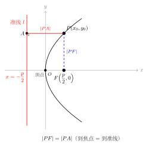
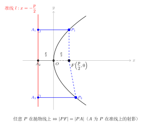
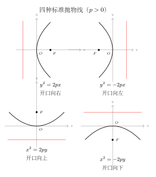

# 抛物线的定义与标准方程

> **一例速记**：  
> 平面上到定点 $F$（焦点）与定直线 $l$（准线）距离**相等**的点的轨迹叫**抛物线**。  
> 开口右：$y^2=2px$（$p>0$），焦点 $\left(\dfrac{p}{2}, 0\right)$，准线 $x=-\dfrac{p}{2}$。  
> **易错**：$p$ 不是焦距！焦点到顶点距离 $=\dfrac{p}{2}$，准线到顶点距离也 $=\dfrac{p}{2}$。  
> **4 种方向**：开口右/左/上/下，对应 $y^2=\pm 2px$、$x^2=\pm 2py$。

---

## 一、从几何到代数：抛物线的定义

### 什么是抛物线？

在平面上，**到一个定点（焦点）$F$ 与一条定直线（准线）$l$ 距离相等的点的全体**，叫做**抛物线**。

用数学语言描述：设焦点 $F$，准线 $l$，点 $P$ 在抛物线上，则

$$|PF| = d(P, l)$$

其中 $d(P, l)$ 表示点 $P$ 到直线 $l$ 的距离。

**关键条件**：焦点 $F$ 不在准线 $l$ 上。若 $F$ 在 $l$ 上，则满足条件的点集退化，不构成抛物线。

### 生活中的抛物线

- 卫星天线的截面是抛物线（焦点处放接收器，信号从准线方向反射后汇聚于焦点）
- 汽车车头灯的反射面是旋转抛物面（灯泡放在焦点处，光线反射后平行射出）
- 炮弹（忽略空气阻力）的运动轨迹是抛物线

抛物线的"焦点-准线"定义正是这类光学性质的数学本质。

### 与椭圆、双曲线的对比

| 曲线 | 定义条件 | 离心率 |
|------|---------|--------|
| 椭圆 | $\vert PF_1\vert +\vert PF_2\vert =2a$（和为常数） | $e\in(0,1)$ |
| 双曲线 | $\big\vert \vert PF_1\vert -\vert PF_2\vert \big\vert =2a$（差的绝对值为常数） | $e>1$ |
| 抛物线 | $\vert PF\vert =d(P,l)$（到焦点等于到准线） | $e=1$ |

抛物线的离心率恒为 $1$，这是其区别于椭圆和双曲线的标志性特征。

---

## 二、标准方程的推导

以焦点 $F$ 与准线 $l$ 的垂足连线的中点为坐标原点，焦点-准线连线为 $x$ 轴，建立坐标系。

设焦点到准线的距离（即焦准距）为 $p$（$p>0$），则：

$$F = \left(\dfrac{p}{2}, 0\right), \quad l: x = -\dfrac{p}{2}$$

设抛物线上动点 $P(x, y)$，由定义 $|PF| = d(P, l)$：

**第一步**：写出 $|PF|$ 和 $d(P,l)$：

$$|PF| = \sqrt{\left(x - \dfrac{p}{2}\right)^2 + y^2}$$

$$d(P, l) = \left|x + \dfrac{p}{2}\right| = x + \dfrac{p}{2} \quad (\text{要求 } x \geq -\dfrac{p}{2})$$

**第二步**：令两者相等并两边平方（右边已非负）：

$$\left(x - \dfrac{p}{2}\right)^2 + y^2 = \left(x + \dfrac{p}{2}\right)^2$$

**第三步**：展开左右两边：

$$x^2 - px + \dfrac{p^2}{4} + y^2 = x^2 + px + \dfrac{p^2}{4}$$

**第四步**：化简（$x^2$ 和 $\dfrac{p^2}{4}$ 抵消）：

$$y^2 = 2px$$

这就是**开口向右的抛物线标准方程**：

$$\boxed{y^2 = 2px \quad (p > 0)}$$

**合法性验证**：由 $y^2 = 2px$ 且 $p > 0$，自然有 $x \geq 0 \geq -p/2$，第二步中 $x + p/2 \geq 0$ 的条件自动满足。

---

## 三、四种标准方程

根据开口方向不同，抛物线的标准方程分为 4 种：

### 3.1 开口向右：$y^2 = 2px$（$p>0$）

以顶点为原点，对称轴为 $x$ 轴，向右开口：

| 要素 | 值 |
|------|----|
| 顶点 | $(0, 0)$ |
| 焦点 | $\left(\dfrac{p}{2}, 0\right)$ |
| 准线 | $x = -\dfrac{p}{2}$ |
| 对称轴 | $x$ 轴 |
| 开口方向 | 向右（$x \geq 0$） |

### 3.2 开口向左：$y^2 = -2px$（$p>0$）

$$\text{焦点}\left(-\dfrac{p}{2}, 0\right), \quad \text{准线 } x = \dfrac{p}{2}$$

向左开口（$x \leq 0$），与开口右的方程关于 $y$ 轴对称。

### 3.3 开口向上：$x^2 = 2py$（$p>0$）

$$\text{焦点}\left(0, \dfrac{p}{2}\right), \quad \text{准线 } y = -\dfrac{p}{2}$$

对称轴为 $y$ 轴，向上开口（$y \geq 0$）。

### 3.4 开口向下：$x^2 = -2py$（$p>0$）

$$\text{焦点}\left(0, -\dfrac{p}{2}\right), \quad \text{准线 } y = \dfrac{p}{2}$$

向下开口（$y \leq 0$），与开口上的方程关于 $x$ 轴对称。

### 四种方程对照表

| 方程 | 开口方向 | 焦点 | 准线 |
|------|---------|------|------|
| $y^2 = 2px$（$p>0$） | 右 | $\left(\dfrac{p}{2}, 0\right)$ | $x = -\dfrac{p}{2}$ |
| $y^2 = -2px$（$p>0$） | 左 | $\left(-\dfrac{p}{2}, 0\right)$ | $x = \dfrac{p}{2}$ |
| $x^2 = 2py$（$p>0$） | 上 | $\left(0, \dfrac{p}{2}\right)$ | $y = -\dfrac{p}{2}$ |
| $x^2 = -2py$（$p>0$） | 下 | $\left(0, -\dfrac{p}{2}\right)$ | $y = \dfrac{p}{2}$ |

**快速记忆**：
- 含 $y^2$ 的方程 → 对称轴为 $x$ 轴，焦点在 $x$ 轴上
- 含 $x^2$ 的方程 → 对称轴为 $y$ 轴，焦点在 $y$ 轴上
- 等号右边正 → 开口朝正方向；负 → 朝负方向
- 焦点与准线各在顶点两侧，距顶点均为 $p/2$

---

## 四、由方程读取抛物线信息

**例**：抛物线 $y^2 = 8x$，读取所有关键量。

与标准型 $y^2 = 2px$ 对比：$2p = 8$，故 $p = 4$。

- 开口方向：向右（$y^2 = 8x > 0$ 需 $x \geq 0$）
- 顶点：$(0, 0)$
- 焦点：$\left(\dfrac{p}{2}, 0\right) = (2, 0)$
- 准线：$x = -\dfrac{p}{2} = -2$
- 对称轴：$x$ 轴

---

## 五、典型应用例题

### 例 1：已知焦点求方程

**题目**：抛物线的焦点为 $F(0, 3)$，求抛物线的标准方程。

**【思路】** 焦点在 $y$ 轴正半轴 → 方程为 $x^2 = 2py$（$p>0$），由 $\dfrac{p}{2} = 3$ 求 $p$。

**解**：

焦点 $(0, 3)$ 在 $y$ 轴上且纵坐标为正，故抛物线开口向上，方程为 $x^2 = 2py$（$p>0$）。

由 $\dfrac{p}{2} = 3$，得 $p = 6$，故 $2p = 12$。

抛物线方程为 $\boxed{x^2 = 12y}$。

验证：准线 $y = -\dfrac{p}{2} = -3$，顶点 $(0,0)$，焦点到顶点距离 $= 3$，准线到顶点距离 $= 3$，正确。

> 解题要点：由焦点坐标判断开口方向，再由焦点坐标读出 $p/2$ 的值。$p$ 是焦准距，$p/2$ 才是焦点到顶点的距离。

---

### 例 2：已知抛物线上的点求参数

**题目**：抛物线 $x^2 = 2py$（$p>0$）过点 $A(2, 1)$，求 $p$ 的值及焦点坐标。

**【思路】** 将点 $A$ 代入方程求 $p$，再写出焦点。

**解**：

将 $A(2, 1)$ 代入 $x^2 = 2py$：

$$4 = 2p \cdot 1 = 2p \Rightarrow p = 2$$

故方程为 $x^2 = 4y$，焦点为 $\left(0, \dfrac{p}{2}\right) = (0, 1)$。

验证：$A(2,1)$ 到焦点距离 $= \sqrt{4+0} = 2$；到准线 $y = -1$ 距离 $= 1-(-1) = 2$，相等，正确。

> 解题要点：点在曲线上直接代入，注意区分 $p$ 和 $2p$（方程中出现的是 $2p$，不是 $p$）。

---

### 例 3：利用定义求点到焦点的距离

**题目**：点 $P$ 在抛物线 $y^2 = 4x$ 上，$P$ 的横坐标为 $3$，求 $|PF|$。

**【思路】** 不必求出 $P$ 的具体坐标，直接用焦半径公式（或定义）：$|PF| = x_0 + \dfrac{p}{2}$。

**解**：

$y^2 = 4x$ 中，$2p = 4$，故 $p = 2$，$\dfrac{p}{2} = 1$。

由焦半径公式（见第 7 章 02 节），$|PF| = x_0 + \dfrac{p}{2} = 3 + 1 = 4$。

也可直接用定义：准线为 $x = -1$，$P$ 到准线距离 $= x_0 - (-1) = 3 + 1 = 4$，等于 $|PF|$。

> 解题要点：给出横坐标即可用 $|PF| = x_0 + p/2$ 快速算出到焦点距离，无需坐标计算。

---

## 六、易错点汇总

**易错 1：$p$ 不是焦点到顶点的距离，$\dfrac{p}{2}$ 才是**

方程 $y^2 = 2px$ 中，$p$ 是焦准距（焦点到准线的距离），而焦点到顶点距离 $= \dfrac{p}{2}$，准线到顶点距离也 $= \dfrac{p}{2}$。常见错误：看到 $y^2 = 6x$ 就认为焦点是 $(6, 0)$——正确做法是 $2p = 6 \Rightarrow p = 3 \Rightarrow$ 焦点 $(3/2, 0)$。

**易错 2：没有"焦距"的概念**

椭圆有焦距 $2c$（两焦点之间的距离），抛物线只有一个焦点，没有"焦距"。"焦准距"$p$ 是焦点到准线的距离，不要和椭圆的焦距混淆。

**易错 3：开口方向与正负号的对应关系搞反**

$y^2 = -2px$（$p>0$）中右边为负，$y^2 \geq 0$ 则需 $x \leq 0$，故开口向左。有些同学看到"$-2p$"就以为向下开口——含 $y^2$ 的方程对称轴一定是 $x$ 轴，与"上下"无关。

**易错 4：写方程时把 $x^2, y^2$ 搞反**

焦点在 $x$ 轴上 → 方程含 $y^2$；焦点在 $y$ 轴上 → 方程含 $x^2$。口诀：**焦点在哪个轴，方程就含另一个变量的平方**（因为对称轴就是焦点所在的轴，$y^2=2px$ 中对称轴是 $x$ 轴，焦点在 $x$ 轴上）。

**易错 5：忽略 $p > 0$ 的条件**

四种标准方程中均要求 $p > 0$，方向由方程中的正负号（$+2px$ 或 $-2px$）决定。若求出 $p < 0$ 需立即排查——通常是由条件列方程时符号出错。

---

## 七、自测题

**自测 1**　写出焦点为 $F(-2, 0)$ 的抛物线的标准方程。

> 提示：焦点在 $x$ 轴负半轴，开口向左，方程为 $y^2 = -2px$，由 $p/2=2$ 得 $p=4$，方程为 $y^2 = -8x$。

**自测 2**　抛物线 $x^2 = -6y$ 的焦点坐标和准线方程是什么？

> 提示：$2p = 6 \Rightarrow p = 3$，开口向下，焦点 $(0, -p/2) = (0, -3/2)$，准线 $y = 3/2$。

**自测 3**　点 $M(a, 4)$ 在抛物线 $y^2 = 8x$ 上，求 $a$ 的值及点 $M$ 到焦点的距离。

> 提示：代入 $16 = 8a \Rightarrow a = 2$。$2p = 8 \Rightarrow p = 4$，准线 $x = -2$。$|MF| = x_M + p/2 = 2 + 2 = 4$。

**自测 4**　已知抛物线的准线方程为 $y = 1$，求抛物线的标准方程。

> 提示：准线 $y = 1 > 0$，对称轴为 $y$ 轴且开口向下，方程为 $x^2 = -2py$，$p/2 = 1 \Rightarrow p = 2$，方程为 $x^2 = -4y$。焦点 $(0, -1)$。

---

**回头看"一例速记"**：

> 抛物线定义：$|PF| = d(P, l)$（到焦点等于到准线）。  
> 4 种标准方程：$y^2 = \pm 2px$（对称轴为 $x$ 轴），$x^2 = \pm 2py$（对称轴为 $y$ 轴），$p > 0$。  
> 焦点到顶点 $= \dfrac{p}{2}$，准线到顶点 $= \dfrac{p}{2}$（$p$ 不是焦距！）。  
> **判断焦点位置**：含 $y^2$ → 焦点在 $x$ 轴；含 $x^2$ → 焦点在 $y$ 轴；正负号决定开口方向。

能不看提示写出全部 4 种标准方程的焦点坐标和准线方程——本章，你拿下了。
