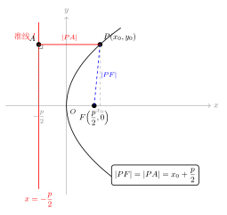
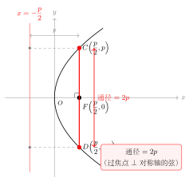
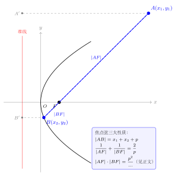

# 抛物线的几何性质

> **一例速记**：  
> 抛物线 $y^2=2px$（$p>0$）：顶点 $(0,0)$，焦点 $\left(\dfrac{p}{2}, 0\right)$，准线 $x=-\dfrac{p}{2}$  
> **焦半径**：$|PF|=x_0+\dfrac{p}{2}$（焦点距离 $=$ 横坐标 $+\dfrac{p}{2}$）  
> **离心率** $e=1$（抛物线标志！离心率恒等于 $1$）  
> **通径** $= 2p$（过焦点 $\perp$ 对称轴的弦，是最短焦点弦）  
> **焦点弦三大性质**（过焦点的弦 $AB$，$x_1, x_2$ 为两端点横坐标）：  
> - $|AB|=x_1+x_2+p$  
> - $\dfrac{1}{|AF|}+\dfrac{1}{|BF|}=\dfrac{2}{p}$  
> - $|AF|\cdot|BF| = \dfrac{y_1 y_2 (x_1+p)(x_2+p)}{...}$（用参数表示见正文）

---

## 一、引入题：从一道综合题读尽所有性质

> **题目**：抛物线 $y^2 = 6x$，直线 $l$ 过焦点 $F$ 且与抛物线交于两点 $A(x_1, y_1)$、$B(x_2, y_2)$，求：  
> (1) 焦点 $F$ 的坐标与准线方程；  
> (2) $|AF|$ 与 $|BF|$（用 $x_1, x_2$ 表示）；  
> (3) 弦长 $|AB|$；  
> (4) $\dfrac{1}{|AF|}+\dfrac{1}{|BF|}$；  
> (5) 当 $l \perp x$ 轴（通径）时，$|AB|$ 等于多少？

---

## 二、思维路径还原

> "看到抛物线 $y^2 = 6x$，第一步：**配出标准型读 $p$**。
>
> $y^2 = 6x$ 对应 $y^2 = 2px$，故 $2p = 6$，$p = 3$。
>
> 焦点：$\left(\dfrac{p}{2}, 0\right) = \left(\dfrac{3}{2}, 0\right)$。准线：$x = -\dfrac{3}{2}$。
>
> **(1) 完成**。下一步：求焦半径。
>
> **焦半径公式来自定义**：$|PF| = d(P, \text{准线}) = x_0 + \dfrac{p}{2}$（$P$ 的横坐标加 $p/2$）。
>
> 所以 $|AF| = x_1 + \dfrac{p}{2} = x_1 + \dfrac{3}{2}$，$|BF| = x_2 + \dfrac{3}{2}$。
>
> **(2) 完成**。注意 $x_1, x_2 \geq 0$（抛物线上的点横坐标非负），$|AF|, |BF| \geq \dfrac{3}{2}$。
>
> **求弦长**：$A$、$B$ 均在抛物线上，$|AF| + |BF| = (x_1 + \frac{3}{2}) + (x_2 + \frac{3}{2}) = x_1 + x_2 + 3 = x_1 + x_2 + p$。
>
> 又 $A$、$F$、$B$ 三点共线，$|AB| = |AF| + |BF|$（$F$ 在 $A$、$B$ 之间），所以
> $$|AB| = x_1 + x_2 + p$$
>
> **(3) 完成**。关键是"$F$ 在弦的内部"，所以弦长等于两段焦半径之和。
>
> **求调和关系**：
> $$\frac{1}{|AF|} + \frac{1}{|BF|} = \frac{1}{x_1+\frac{p}{2}} + \frac{1}{x_2+\frac{p}{2}}$$
>
> 设 $r_1 = x_1 + \frac{p}{2}$，$r_2 = x_2 + \frac{p}{2}$，则
> $$\frac{1}{r_1} + \frac{1}{r_2} = \frac{r_1+r_2}{r_1 r_2}$$
>
> 这个结果要化简，需利用 $A$、$B$ 在同一条直线（过焦点的弦）上的约束——见第三节详细推导。
>
> 最终结论：$\dfrac{1}{|AF|}+\dfrac{1}{|BF|}=\dfrac{2}{p}$，与直线斜率无关！
>
> **(4) 完成**。这是焦点弦的调和性质，非常重要。
>
> **通径**：令 $l \perp x$ 轴，即直线 $x = \dfrac{3}{2}$，代入 $y^2 = 6x$：
> $y^2 = 6 \cdot \dfrac{3}{2} = 9$，$y = \pm 3$。
> 通径长 $= 2|y| = 6 = 2p$。
>
> **(5) 完成**。通径 $= 2p$，是所有焦点弦中最短的。
>
> **关键反射**：抛物线题第一步永远是读出 $p$，然后立刻写出焦点和准线。焦半径公式 $|PF| = x_0 + p/2$ 是最核心的工具，90% 的计算都从这里出发。"

把这段独白读两遍，体会"读 $p$ → 写焦点准线 → 焦半径公式 → 三大性质"这条完整链条。

---

## 三、抽象成方法：抛物线 5 大性质 + 3 大公式

### 3.1 对称性

抛物线 $y^2 = 2px$ 关于 $x$ 轴（$y \to -y$）对称，其**对称轴**是 $x$ 轴，**顶点**是原点 $O(0,0)$，是整条曲线的"最左端"（离准线最近的点）。

抛物线**没有中心对称性**（不是中心对称图形），这与椭圆、双曲线不同。

利用对称性：若 $P(x_0, y_0)$ 在抛物线上，则 $P'(x_0, -y_0)$ 也在抛物线上，且 $|PF| = |P'F|$（两点到焦点等距）。

### 3.2 范围

由 $y^2 = 2px$（$p > 0$），$y^2 \geq 0$ 要求 $x \geq 0$：

- $x$ 的范围：$x \geq 0$（向右无限延伸）
- $y$ 的范围：$y \in (-\infty, +\infty)$（上下无限延伸）

抛物线是**无界曲线**，不像椭圆那样被限定在矩形内。

### 3.3 离心率 $e = 1$

抛物线的离心率恒为 $1$。

$$\boxed{e = 1}$$

这是抛物线在圆锥曲线中的独特标志：

| 离心率 | 曲线类型 |
|--------|---------|
| $e = 0$ | 圆 |
| $0 < e < 1$ | 椭圆 |
| $e = 1$ | 抛物线 |
| $e > 1$ | 双曲线 |

离心率 $e = 1$ 意味着焦点-准线定义中，"到焦点的距离"与"到准线的距离"恰好相等（比值为 $1$）——这正是抛物线定义本身。

### 3.4 焦半径公式

（见配图 `geo-p7-02-1`：焦半径与准线射影的关系）

设 $P(x_0, y_0)$ 是抛物线 $y^2 = 2px$ 上一点，$F = (p/2, 0)$，则：

$$\boxed{|PF| = x_0 + \dfrac{p}{2}}$$

**推导**：由定义，$|PF| = d(P, l)$，其中准线 $l: x = -p/2$。故

$$|PF| = x_0 - \left(-\dfrac{p}{2}\right) = x_0 + \dfrac{p}{2}$$

（因 $x_0 \geq 0 > -p/2$，距离无需加绝对值。）

**范围**：$x_0 \geq 0$，故 $|PF| \geq p/2$。当且仅当 $x_0 = 0$（$P$ 在顶点）时取等，但顶点不是严格意义上的"极值点"——抛物线上距焦点最近的点正是顶点，距离为 $p/2$。

**四种抛物线的焦半径**：

| 方程 | 焦半径公式 |
|------|-----------|
| $y^2 = 2px$ | $\|PF\| = x_0 + \dfrac{p}{2}$ |
| $y^2 = -2px$ | $\|PF\| = -x_0 + \dfrac{p}{2} = \dfrac{p}{2} - x_0$（此时 $x_0 \leq 0$） |
| $x^2 = 2py$ | $\|PF\| = y_0 + \dfrac{p}{2}$ |
| $x^2 = -2py$ | $\|PF\| = -y_0 + \dfrac{p}{2} = \dfrac{p}{2} - y_0$（此时 $y_0 \leq 0$） |

**统一口诀**：焦半径 $=$ 点在"开口方向坐标"$+$ $\dfrac{p}{2}$（开口右/上加横/纵坐标，开口左/下减横/纵坐标）。

### 3.5 通径

（见配图 `geo-p7-02-3`：通径的几何意义）

**通径**：过焦点 $F$ 且垂直于对称轴的弦。

**通径长的计算**：令 $x = p/2$ 代入 $y^2 = 2px$：

$$y^2 = 2p \cdot \dfrac{p}{2} = p^2 \Rightarrow y = \pm p$$

两端点为 $C\left(\dfrac{p}{2}, p\right)$ 和 $D\left(\dfrac{p}{2}, -p\right)$，通径长 $= 2p$。

也可用焦半径验算：$|CF| = \dfrac{p}{2} + \dfrac{p}{2} = p$，通径 $= 2|CF| = 2p$，一致。

$$\boxed{\text{通径} = 2p}$$

**通径是所有焦点弦中最短的**：过焦点作任意弦，弦长 $\geq 2p$，等号当且仅当弦垂直对称轴时取得（即通径）。

---

## 四、焦点弦三大性质

（见配图 `geo-p7-02-2`：焦点弦的三大性质标注）

设直线 $l$ 过焦点 $F\left(\dfrac{p}{2}, 0\right)$，与抛物线 $y^2 = 2px$ 交于 $A(x_1, y_1)$、$B(x_2, y_2)$（$F$ 在 $A$、$B$ 之间）。

### 4.1 性质一：弦长公式

$$\boxed{|AB| = |AF| + |BF| = x_1 + x_2 + p}$$

**推导**：$|AF| = x_1 + \dfrac{p}{2}$，$|BF| = x_2 + \dfrac{p}{2}$。因 $F$ 在 $A$、$B$ 之间，

$$|AB| = |AF| + |BF| = \left(x_1 + \dfrac{p}{2}\right) + \left(x_2 + \dfrac{p}{2}\right) = x_1 + x_2 + p$$

**若用参数表示**：设 $A = \left(\dfrac{y_1^2}{2p}, y_1\right)$（由方程 $x = y^2/(2p)$），则

$$|AB| = \dfrac{y_1^2}{2p} + \dfrac{y_2^2}{2p} + p$$

### 4.2 性质二：调和性质（"调和弦"公式）

$$\boxed{\dfrac{1}{|AF|}+\dfrac{1}{|BF|}=\dfrac{2}{p}}$$

**推导**：

$$\dfrac{1}{|AF|}+\dfrac{1}{|BF|} = \dfrac{1}{x_1+\frac{p}{2}}+\dfrac{1}{x_2+\frac{p}{2}}$$

需利用 $A$、$B$ 在过焦点直线上的约束。设直线斜率为 $k$，直线方程 $x = ky + \dfrac{p}{2}$（$y$ 为参数，处理竖直线更方便）。

代入 $y^2 = 2px$：

$$y^2 = 2p\left(ky + \dfrac{p}{2}\right) = 2pky + p^2$$

$$y^2 - 2pky - p^2 = 0$$

由韦达定理：$y_1 + y_2 = 2pk$，$y_1 y_2 = -p^2$。

注意到 $|AF| = x_1 + \dfrac{p}{2} = \dfrac{y_1^2}{2p} + \dfrac{p}{2} = \dfrac{y_1^2 + p^2}{2p}$，故

$$\dfrac{1}{|AF|} = \dfrac{2p}{y_1^2 + p^2}$$

类似地 $\dfrac{1}{|BF|} = \dfrac{2p}{y_2^2 + p^2}$。

用 $y_1 y_2 = -p^2$，可以验证 $y_1^2 + p^2 = y_1^2 - y_1 y_2 = y_1(y_1 - y_2)$（当 $y_2 \neq 0$ 时），但更直接的方法是：

$$\dfrac{1}{|AF|}+\dfrac{1}{|BF|} = \dfrac{|AF|+|BF|}{|AF|\cdot|BF|}$$

分子：$|AF|+|BF| = x_1+x_2+p = \dfrac{y_1^2+y_2^2}{2p}+p$。

分母：$|AF|\cdot|BF| = \dfrac{(y_1^2+p^2)(y_2^2+p^2)}{4p^2}$。

这条路虽然正确，计算较繁。最快的方法用 $y_1 y_2 = -p^2$：

$$|AF| \cdot |BF| = \left(x_1+\dfrac{p}{2}\right)\left(x_2+\dfrac{p}{2}\right) = \dfrac{y_1^2}{2p}\cdot\dfrac{p}{2}+\cdots$$

事实上，最简洁推导：

由 $y_i^2 = 2px_i$ 得 $x_i = \dfrac{y_i^2}{2p}$，

$$|AF|+|BF| = x_1+x_2+p = \dfrac{y_1^2+y_2^2}{2p}+p = \dfrac{y_1^2+y_2^2+2p^2}{2p}$$

$$|AF|\cdot|BF| = \left(\dfrac{y_1^2}{2p}+\dfrac{p}{2}\right)\left(\dfrac{y_2^2}{2p}+\dfrac{p}{2}\right) = \dfrac{(y_1^2+p^2)(y_2^2+p^2)}{4p^2}$$

用 $y_1 y_2 = -p^2$，注意 $(y_1^2+p^2)(y_2^2+p^2) = y_1^2y_2^2 + p^2(y_1^2+y_2^2)+p^4 = p^4 + p^2(y_1^2+y_2^2)+p^4 = p^2(y_1^2+y_2^2+2p^2)$，故

$$|AF|\cdot|BF| = \dfrac{p^2(y_1^2+y_2^2+2p^2)}{4p^2} = \dfrac{y_1^2+y_2^2+2p^2}{4}$$

于是

$$\dfrac{1}{|AF|}+\dfrac{1}{|BF|} = \dfrac{|AF|+|BF|}{|AF|\cdot|BF|} = \dfrac{\frac{y_1^2+y_2^2+2p^2}{2p}}{\frac{y_1^2+y_2^2+2p^2}{4}} = \dfrac{4}{2p} = \dfrac{2}{p}$$

结论得证，**与斜率 $k$ 无关**！

### 4.3 性质三：焦点弦端点纵坐标之积

$$\boxed{y_1 y_2 = -p^2}$$

这是在推导调和性质时得到的中间结论（由韦达定理 $y_1 y_2 = -p^2$）。

**应用**：$y_1 y_2 < 0$ 表明 $A$、$B$ 在对称轴的两侧（一上一下），这对任意非竖直焦点弦均成立。

**焦点弦乘积**：

$$|AF|\cdot|BF| = \dfrac{y_1^2+y_2^2+2p^2}{4} = \dfrac{(y_1+y_2)^2 - 2y_1y_2 + 2p^2}{4} = \dfrac{(y_1+y_2)^2 + 4p^2}{4}$$

这个值依赖于斜率（通过 $y_1+y_2 = 2pk$），故 $|AF|\cdot|BF|$ 随弦的方向变化。

---

## 五、4 大公式汇总

| 公式名 | 表达式（以 $y^2=2px$ 为例） |
|--------|---------------------------|
| 焦半径 | $\|PF\| = x_0 + \dfrac{p}{2}$ |
| 离心率 | $e = 1$ |
| 通径 | $2p$ |
| 弦长公式 | $\|AB\| = x_1 + x_2 + p$ |
| 调和公式 | $\dfrac{1}{\|AF\|}+\dfrac{1}{\|BF\|}=\dfrac{2}{p}$ |
| 纵坐标积 | $y_1 y_2 = -p^2$（焦点弦） |

---

## 六、方法变形

### 6.1 焦半径公式的灵活运用

**已知 $|PF|$ 求坐标**：由 $|PF| = x_0 + p/2$ 可反解 $x_0 = |PF| - p/2$。若还知道 $y_0^2 = 2px_0$，可求出 $y_0$。

**例**：$y^2 = 4x$ 上点 $P$ 满足 $|PF| = 5$，求 $x_0$。

$p/2 = 1$，故 $x_0 = |PF| - 1 = 4$。

### 6.2 弦长公式与斜率的关系

对抛物线 $y^2 = 2px$，过焦点斜率为 $k$（$k \neq 0$）的直线与抛物线交于 $A, B$，则：

$$|AB| = x_1 + x_2 + p$$

由韦达定理（将直线方程 $x = ky + p/2$ 代入 $y^2 = 2px$ 得 $y^2 - 2pky - p^2 = 0$）：

$$y_1 + y_2 = 2pk, \quad y_1 y_2 = -p^2$$

$$x_1 + x_2 = \dfrac{y_1^2 + y_2^2}{2p} = \dfrac{(y_1+y_2)^2 - 2y_1y_2}{2p} = \dfrac{4p^2k^2+2p^2}{2p} = 2pk^2 + p$$

故

$$|AB| = x_1 + x_2 + p = 2pk^2 + p + p = 2pk^2 + 2p = 2p(k^2+1)$$

**结论**：$|AB| = \dfrac{2p}{sin^2\theta}$（其中 $\theta$ 为直线与对称轴的夹角），$k\to\infty$（通径）时 $|AB|$ 最小 $= 2p$；$|k| \to 0$ 时 $|AB| \to \infty$。

**特殊情形**：
- 通径（$k\to\infty$ 或弦垂直对称轴）：$|AB| = 2p$（最短弦）
- 斜率为 $1$（$\theta = 45°$）：$|AB| = 4p$

### 6.3 弦的中点问题

设 $M(x_m, y_m)$ 是焦点弦 $AB$ 的中点，则：

$$x_m = \dfrac{x_1+x_2}{2} = pk^2 + \dfrac{p}{2}, \quad y_m = \dfrac{y_1+y_2}{2} = pk$$

由此 $y_m = pk$ 且 $x_m = \dfrac{y_m^2}{p} + \dfrac{p}{2}$，即中点满足 $x_m = \dfrac{y_m^2}{p} + \dfrac{p}{2}$。

---

## 七、常用结论整理

**结论 1（焦半径范围）**：抛物线 $y^2=2px$ 上任意点到焦点距离 $|PF| \geq \dfrac{p}{2}$，最小值 $\dfrac{p}{2}$ 在顶点取得。

**结论 2（通径最短）**：焦点弦中，通径最短，长度为 $2p$；弦长随弦的倾斜程度趋近于轴时趋于无穷。

**结论 3（焦点弦调和性）**：对任意过焦点的弦 $AB$，$\dfrac{1}{|AF|}+\dfrac{1}{|BF|}=\dfrac{2}{p}$，是关于 $|AF|$、$|BF|$ 的调和平均关系，即 $|AF|$、$|BF|$ 的调和平均数恒为 $\dfrac{p}{2}$（等于顶点到焦点距离）。

**结论 4（焦点弦端点纵坐标积）**：$y_1 y_2 = -p^2$，即两端点纵坐标异号，乘积为 $-p^2$。

**结论 5（端点横坐标积）**：

$$x_1 x_2 = \dfrac{y_1^2}{2p}\cdot\dfrac{y_2^2}{2p} = \dfrac{(y_1 y_2)^2}{4p^2} = \dfrac{p^4}{4p^2} = \dfrac{p^2}{4}$$

即焦点弦两端点横坐标之积恒为 $\dfrac{p^2}{4}$。

**结论 6（斜率与端点关系）**：设直线 $AB$ 斜率为 $k$，则：
- $y_1 y_2 = -p^2$（不依赖 $k$）
- $x_1 x_2 = p^2/4$（不依赖 $k$）
- $|AB| = 2p(k^2+1)$（依赖 $k$）

这三个结论在做最值和范围题时非常有用。

---

## 八、思考路标（条件反射训练）

以下每条应成为自动反应：

1. **看到抛物线方程** → 立即写出 $p$ 的值，再写焦点和准线。$p$ 不是焦距，$p/2$ 才是焦点到顶点的距离。

2. **看到"点到焦点"** → 用焦半径公式 $|PF| = x_0 + p/2$（开口右）。不要用距离公式算 $\sqrt{(x_0-p/2)^2+y_0^2}$，慢且易出错。

3. **看到"过焦点的弦"** → 立即用韦达定理，$y_1+y_2=2pk$，$y_1y_2=-p^2$；弦长公式 $|AB|=x_1+x_2+p$；调和公式 $\frac{1}{|AF|}+\frac{1}{|BF|}=\frac{2}{p}$。

4. **看到"通径"** → $2p$，过焦点垂直对称轴的弦，是最短焦点弦。令 $x = p/2$ 代入方程验算。

5. **离心率 $e=1$** 是抛物线的标志。高考对比题常考"曲线类型由离心率决定"，$e=1$ 唯一对应抛物线。

6. **看到"切线方向/斜率为 $k$"** → 用参数 $y_1y_2 = -p^2$ 和 $y_1+y_2 = 2pk$ 表达所求量，不要硬联立方程组。

7. **弦的中点** → $x_m = y_m^2/p + p/2$（中点轨迹），与斜率 $k$ 的关系 $y_m = pk$ 联立可求轨迹方程。

8. **看到两焦半径之积 $|AF|\cdot|BF|$** → 用 $|AF|\cdot|BF| = (y_1^2+y_2^2+2p^2)/4$，结合 $y_1^2+y_2^2 = (y_1+y_2)^2 - 2y_1y_2 = 4p^2k^2+2p^2$，得 $|AF|\cdot|BF| = p^2(k^2+1)/1$（见下方例题）。

---

## 九、应用例题

### 例 1：焦半径与准线的综合应用

**题目**：抛物线 $y^2 = 8x$，点 $P$ 在抛物线上，$|PF| = 6$，求点 $P$ 的坐标。

**【思路】** 用焦半径公式求 $x_0$，再用方程求 $y_0$。

**解**：

$y^2 = 8x$，$2p=8$，$p=4$，$p/2=2$。焦点 $F(2,0)$，准线 $x=-2$。

由 $|PF| = x_0 + 2 = 6$，得 $x_0 = 4$。

代入 $y_0^2 = 8 \cdot 4 = 32$，故 $y_0 = \pm 4\sqrt{2}$。

$P$ 的坐标为 $(4, 4\sqrt{2})$ 或 $(4, -4\sqrt{2})$。

验证：$|PF| = \sqrt{(4-2)^2 + (4\sqrt{2})^2} = \sqrt{4+32} = 6$，正确。

> 解题要点：焦半径公式先定 $x_0$，再代回方程求 $y_0$，避免直接解距离公式的繁琐根号计算。

---

### 例 2：焦点弦的三大性质

**题目**：直线 $l$ 过抛物线 $y^2 = 4x$ 的焦点，与抛物线交于 $A$、$B$ 两点，若 $|AF| = 3$，求 $|BF|$、$|AB|$ 及 $y_1 y_2$。

**【思路】** 用调和公式求 $|BF|$，再求 $|AB|$ 和纵坐标积。

**解**：

$y^2 = 4x$，$p=2$，$p/2=1$。

由调和公式：$\dfrac{1}{|AF|}+\dfrac{1}{|BF|}=\dfrac{2}{p}=\dfrac{2}{2}=1$。

$$\dfrac{1}{3}+\dfrac{1}{|BF|}=1 \Rightarrow |BF|=\dfrac{3}{2}$$

$|AB|=|AF|+|BF|=3+\dfrac{3}{2}=\dfrac{9}{2}$。

由 $|AF| = x_1 + 1 = 3 \Rightarrow x_1 = 2$，$y_1^2 = 4\cdot 2 = 8$，$y_1 = \pm 2\sqrt{2}$。

由 $|BF| = x_2 + 1 = \dfrac{3}{2} \Rightarrow x_2 = \dfrac{1}{2}$，$y_2^2 = 4\cdot\dfrac{1}{2} = 2$，$y_2 = \pm\sqrt{2}$。

由 $y_1 y_2 = -p^2 = -4$，可判断 $y_1$，$y_2$ 异号，故 $y_1 = 2\sqrt{2}$，$y_2 = -\sqrt{2}$（或反之）。

验证：$y_1 y_2 = 2\sqrt{2} \cdot (-\sqrt{2}) = -4 = -p^2$，正确。

> 解题要点：调和公式是焦点弦最快速的计算工具。已知一端焦半径，立刻求出另一端。

---

### 例 3：斜率与弦长的最值

**题目**：过抛物线 $y^2 = 6x$ 焦点作斜率为 $\sqrt{3}$ 的弦，求弦长 $|AB|$。

**【思路】** 用弦长公式 $|AB| = 2p(k^2+1)$（其中 $k$ 为直线斜率）。

**解**：

$y^2=6x$，$p=3$，$p/2=3/2$。斜率 $k = \sqrt{3}$。

$$|AB| = 2p(k^2+1) = 2\cdot 3 \cdot (3+1) = 24$$

> 解题要点：弦长公式 $|AB|=2p(k^2+1)$ 适用于斜线焦点弦；通径时 $k\to\infty$，改用 $|AB|=2p$。

---

## 十、自测题

**自测 1**　抛物线 $y^2 = 12x$ 上点 $P$ 的横坐标为 $3$，求 $|PF|$。

> 提示：$p=6$，$|PF|=x_0+p/2=3+3=6$。

**自测 2**　抛物线 $x^2 = -4y$，点 $P(2, t)$ 在抛物线上，求 $t$ 的值和 $P$ 到焦点的距离。

> 提示：代入 $4 = -4t \Rightarrow t=-1$，$P=(2,-1)$。$p=2$，焦点 $(0,-1)$，$|PF|=|t|+p/2=-(-1)+1=2$（开口下焦半径 $=p/2-y_0$，代入 $y_0=-1$：$1-(-1)=2$）。

**自测 3**　直线 $l$ 过抛物线 $y^2=8x$ 焦点，与抛物线交 $A$、$B$，已知 $|AB|=10$，求 $x_1+x_2$ 及 $x_1 x_2$。

> 提示：$p=4$。$|AB|=x_1+x_2+p=10 \Rightarrow x_1+x_2=6$。$x_1x_2=p^2/4=4$。

**自测 4**　抛物线 $y^2=2x$ 的过焦点弦两端点纵坐标之比 $y_1:y_2=-3:1$，求弦长 $|AB|$。

> 提示：$p=1$，$y_1y_2=-p^2=-1$，由 $y_1/y_2=-3$，令 $y_1=3t,\,y_2=-t$（取正 $y_1$），则 $-3t^2=-1 \Rightarrow t^2=1/3$，$y_1^2=3$，$y_2^2=1/3$。$x_1=y_1^2/2=3/2$，$x_2=y_2^2/2=1/6$。$|AB|=x_1+x_2+1=3/2+1/6+1=8/3$。

**自测 5**　设抛物线 $y^2=2px$（$p>0$）的焦点为 $F$，若以 $F$ 为圆心、通径的一半（$p$）为半径作圆，该圆与抛物线的交点为 $M$，求 $|MF|$，并说明 $M$ 就是通径的端点。

> 提示：圆方程 $(x-p/2)^2+y^2=p^2$。通径端点 $C(p/2, p)$，$|CF|=\sqrt{0+p^2}=p$，在圆上。故 $M$ 即通径端点，$|MF|=p$（通径之半）。另法：$|MF|=x_M+p/2=p/2+p/2=p$，同样说明 $M$ 是通径端点。

---

**回头看"一例速记"**：

> 焦半径 $|PF|=x_0+p/2$；离心率 $e=1$；通径 $=2p$。  
> 焦点弦：$|AB|=x_1+x_2+p$；$\dfrac{1}{|AF|}+\dfrac{1}{|BF|}=\dfrac{2}{p}$；$y_1y_2=-p^2$。  
> **解题主线**：读 $p$ → 写焦点准线 → 焦半径公式 → 韦达定理 → 三大性质。

能不看提示独立完成自测 4 的完整推导（用纵坐标比反求坐标，再用弦长公式）——本章，你拿下了。
