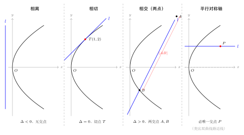
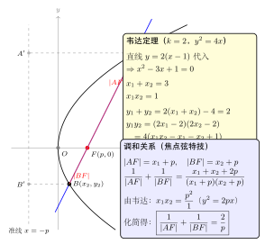

# 直线与抛物线的位置关系

> **一例速记**：
>
> **位置判别**：将直线 $y = kx + m$ 代入抛物线方程，得关于 $x$ 的一元二次方程，判别式 $\Delta > 0$ 相交，$\Delta = 0$ 相切，$\Delta < 0$ 相离。
>
> **特殊情形**：直线**平行于对称轴**（即水平线 $y = c$）时，代入 $y^2 = 2px$ 得唯一的 $x = c^2/(2p)$，**必单交点**（与双曲线渐近线情形类比：渐近线平行于渐近方向也只有单交点）。
>
> **弦长公式**：$|AB| = \sqrt{1+k^2}\cdot|x_1-x_2| = \sqrt{1+k^2}\cdot\sqrt{(x_1+x_2)^2 - 4x_1 x_2}$（韦达定理代入）。
>
> **焦点弦特技**：过焦点 $F$ 的弦 $AB$ 满足 $|AF| = x_1 + p/2$，$|BF| = x_2 + p/2$，于是
> $$\frac{1}{|AF|}+\frac{1}{|BF|}=\frac{2}{p}, \quad |AB| = x_1 + x_2 + p, \quad |AF|\cdot|BF| = \frac{p^2}{4}\cdot\frac{1}{...}$$
> （焦点弦长和调和关系比代入法更快——见第五节）。

---

## 一、引入：焦点弦自动过焦点

> **题目**：直线 $y = k(x-1)$ 与抛物线 $y^2 = 4x$ 的交点个数及交点关系如何？当直线与抛物线相交于 $A$、$B$ 两点时，写出 $|AB|$ 的表达式。

注意到抛物线 $y^2 = 4x$ 对应 $2p = 4$，即 $p = 2$，焦点 $F = (p/2, 0) = (1, 0)$。

直线 $y = k(x-1)$ 过定点 $(1, 0)$——**恰好就是焦点 $F$**！

这意味着，当这条直线与抛物线相交于两点时，所得的弦就是一条**焦点弦**，可以使用焦点弦的全部特殊性质，而不必每次都回头做冗长的代入消元。这正是引入题最深的用意。

---

## 二、思维路径还原

> **目标**：在 $y = k(x-1)$ 与 $y^2 = 4x$ 相交时，求 $|AB|$ 关于 $k$ 的表达式。

**第一步：代入消元，建立一元二次方程。**

将 $y = k(x-1)$ 代入 $y^2 = 4x$：

$$k^2(x-1)^2 = 4x$$

$$k^2 x^2 - (2k^2 + 4)x + k^2 = 0 \quad (\star)$$

注意：若 $k = 0$，方程变为 $0 = 4x$，即 $x = 0$，但直线此时是 $y = 0$（$x$ 轴），代入抛物线得 $(0, 0)$ 为切点，不是两点相交。故 $k \neq 0$。

**第二步：写判别式，确定相交条件。**

方程 $(\star)$ 有两个不同实根（即直线与抛物线交于两点）的条件：

$$\Delta = (2k^2+4)^2 - 4k^4 = 4k^4 + 16k^2 + 16 - 4k^4 = 16(k^2 + 1) > 0$$

由于 $k^2 + 1 \geq 1 > 0$，对一切 $k \neq 0$，判别式**恒大于零**！即只要 $k \neq 0$，直线总与抛物线交于两点。

> **几何解释**：过焦点的非水平直线，由于焦点在抛物线内部，必定穿过抛物线两次。$k = 0$ 时直线为 $x$ 轴（对称轴），是抛物线的对称轴，它只与抛物线切于顶点 $(0, 0)$。

**第三步：由韦达定理写 $x_1 + x_2$、$x_1 x_2$。**

由方程 $(\star)$（系数：$k^2 x^2 - (2k^2+4)x + k^2 = 0$）：

$$x_1 + x_2 = \frac{2k^2+4}{k^2} = 2 + \frac{4}{k^2}, \qquad x_1 x_2 = \frac{k^2}{k^2} = 1$$

**第四步：用弦长公式求 $|AB|$。**

$$|AB|^2 = (1+k^2)\left[(x_1+x_2)^2 - 4x_1 x_2\right]$$

$$= (1+k^2)\left[\left(2 + \frac{4}{k^2}\right)^2 - 4\right]$$

$$= (1+k^2)\left[4 + \frac{16}{k^2} + \frac{16}{k^4} - 4\right]$$

$$= (1+k^2)\cdot\frac{16k^2 + 16}{k^4} \cdot k^2 / k^2 \cdots$$

更直接：$(x_1+x_2)^2 - 4x_1 x_2 = \left(2 + \dfrac{4}{k^2}\right)^2 - 4 = 4 + \dfrac{16}{k^2} + \dfrac{16}{k^4} - 4 = \dfrac{16}{k^2} + \dfrac{16}{k^4} = \dfrac{16(k^2+1)}{k^4}$

$$|AB| = \sqrt{(1+k^2)\cdot\frac{16(k^2+1)}{k^4}} = \frac{4(1+k^2)}{k^2}$$

**第五步：改用焦点弦特技（更快！）**

由焦半径公式（抛物线 $y^2 = 4x$，$p=2$，$|PF| = x_P + 1$）：

$$|AB| = |AF| + |BF| = (x_1 + 1) + (x_2 + 1) = x_1 + x_2 + 2 = 2 + \frac{4}{k^2} + 2 = 4 + \frac{4}{k^2} = \frac{4(k^2+1)}{k^2}$$

两种方法结果一致。焦点弦特技省去了繁琐的"和的平方减四倍积"计算，直接利用焦半径相加。

**结论**：$|AB| = \dfrac{4(k^2+1)}{k^2} = 4 + \dfrac{4}{k^2}$，$k \neq 0$。

> **关键反射**：直线过焦点时，优先用焦点弦公式 $|AB| = x_1 + x_2 + p$，而不是一般弦长公式；前者利用了韦达定理 $x_1 x_2 = p^2/4$（对应本题 $= 1$），计算量少一半。

---

## 三、四种位置关系的完整框架

（见配图 `geo-p7-03-1`：直线与抛物线 4 种位置）

### 3.1 位置判别：判别式 $\Delta$

设抛物线 $y^2 = 2px$（$p > 0$），直线 $l: y = kx + m$（$k \neq 0$）。

将直线代入抛物线，消去 $y$：

$$（kx+m)^2 = 2px$$

$$k^2 x^2 + (2km - 2p)x + m^2 = 0 \quad (\star\star)$$

（方程关于 $x$ 是二次的，首项系数 $k^2 > 0$，合理。）

**判别式**：

$$\Delta = (2km - 2p)^2 - 4k^2 m^2 = 4k^2 m^2 - 8kmp + 4p^2 - 4k^2 m^2 = 4p(p - 2km)$$

| 判别条件 | 位置关系 | 交点数 |
|----------|----------|--------|
| $\Delta > 0$，即 $p - 2km > 0$ | 直线与抛物线**相交** | 2 |
| $\Delta = 0$，即 $m = p/(2k)$ | 直线与抛物线**相切** | 1（切点） |
| $\Delta < 0$，即 $p - 2km < 0$ | 直线与抛物线**相离** | 0 |

**几何直觉**：抛物线向右开口，直线的"截距"（常数项）相对于斜率越大（纵截距很大时），直线在抛物线"外侧"越远，最终无法相交。

> **重要特殊情形 1——斜率不存在（$k = 0$ 的斜截式失效）**：
> 竖直线 $x = x_0$，代入 $y^2 = 2px$ 得 $y^2 = 2px_0$。
> - 若 $x_0 > 0$：两交点 $y = \pm\sqrt{2px_0}$；
> - 若 $x_0 = 0$：切于顶点；
> - 若 $x_0 < 0$：无交点。

> **重要特殊情形 2——平行对称轴（$k = 0$ 的直线 $y = c$，$c$ 为常数）**：
> 代入 $y^2 = 2px$ 得 $c^2 = 2px$，即 $x = c^2/(2p)$——唯一解，**必单交点**。
>
> 这是抛物线独有的现象（椭圆与双曲线中水平线可以有 0、1 或 2 个交点），因为抛物线"无穷远端"只有一个无穷远点（沿对称轴方向），水平线在无穷远处与抛物线相切。类比双曲线的渐近线方向：沿渐近方向的直线与双曲线也只有单交点（或零交点），此处与之相似。

### 3.2 弦长公式

当直线 $y = kx + m$（$k \neq 0$）与抛物线 $y^2 = 2px$ 相交于 $A(x_1, y_1)$、$B(x_2, y_2)$ 时：

由韦达定理（对方程 $(\star\star)$，首项系数 $k^2$）：

$$x_1 + x_2 = \frac{2p - 2km}{k^2}, \qquad x_1 x_2 = \frac{m^2}{k^2}$$

弦长：

$$\boxed{|AB| = \sqrt{1+k^2} \cdot \sqrt{(x_1+x_2)^2 - 4x_1 x_2}}$$

也可以用关于 $y$ 的方程（有时更方便）：将 $x = (y-m)/k$ 代入 $y^2 = 2px$，得关于 $y$ 的方程，再用 $|y_1 - y_2|$。

### 3.3 切线方程

对于斜截式切线（$k \neq 0$），由 $\Delta = 0$ 得：

$$m = \frac{p}{2k}$$

故切线方程为：

$$y = kx + \frac{p}{2k}$$

对应抛物线 $y^2 = 2px$，切点 $T$ 的纵坐标 $y_T = 2 \times (m/k) \cdot k \cdots$ 实际上切点坐标为 $T = \left(\dfrac{p}{2k^2}, \dfrac{p}{k}\right)$，可代入验证。

---

## 四、5 大方法套路

### 套路 1：代入消元（设 $y = kx + m$，消 $y$）

**步骤**：将直线代入抛物线方程 → 整理得关于 $x$ 的二次方程（首项系数 $k^2$）→ 判 $\Delta$ 或用韦达定理。

**关键提示**：
- 代入后首项系数是 $k^2$（不是 $1$），韦达定理分母务必用 $k^2$；
- 若 $k = 0$（水平线），方程退化为一次，代入 $y = c$ 直接求唯一 $x$，单独处理；
- 若 $k$ 不存在（竖直线），用 $x = x_0$ 代入，也单独处理。

**适用场景**：几乎所有直线与抛物线相交的计算题的标准开局。

### 套路 2：以 $y$ 为主元代入（消 $x$）

**步骤**：从直线 $y = kx + m$ 解出 $x = (y-m)/k$，代入 $y^2 = 2px$：

$$y^2 = 2p \cdot \frac{y - m}{k} \implies ky^2 - 2py + 2pm = 0$$

这是关于 $y$ 的二次方程（首项系数 $k$），韦达定理：

$$y_1 + y_2 = \frac{2p}{k}, \qquad y_1 y_2 = \frac{2pm}{k}$$

**优势**：当弦长、中点纵坐标、$y_1 y_2$ 更易处理时（如涉及 $y_1 y_2 = p^2/\ldots$ 的关系），用 $y$ 主元更简洁。

**切线条件**（$\Delta = 0$）：$(2p)^2 - 4k \cdot 2pm = 0 \Rightarrow m = p/(2k)$，与套路 1 结果一致。

### 套路 3：焦点弦特技

（见配图 `geo-p7-03-2`：焦点弦 + 韦达定理 + 调和关系）

**使用前提**：直线过抛物线焦点 $F = (p/2, 0)$（或等价地，直线方程写成 $y = k(x - p/2)$）。

**三大快捷公式**（以 $y^2 = 2px$ 为例）：

| 量 | 公式 | 说明 |
|----|------|------|
| 焦半径 | $\vert AF\vert = x_1 + p/2$ | $A$ 在抛物线上，$x_1 \geq 0$ |
| 弦长 | $\vert AB\vert = x_1 + x_2 + p$ | $= \vert AF\vert + \vert BF\vert$ |
| 调和关系 | $\dfrac{1}{\vert AF\vert }+\dfrac{1}{\vert BF\vert }=\dfrac{2}{p}$ | 等价于 $\vert AB\vert = \dfrac{p}{\sin^2\theta}$（$\theta$ 为弦与轴夹角） |
| 韦达关系 | $x_1 x_2 = p^2/4$ | 由方程 $(\star\star)$ 用 $x_1 x_2 = m^2/k^2$、$m=-p^2/(4k^2)\cdots$ 推出 |

**调和关系推导**：

设 $|AF| = r_1 = x_1 + p/2$，$|BF| = r_2 = x_2 + p/2$，则：

$$\frac{1}{r_1} + \frac{1}{r_2} = \frac{r_1 + r_2}{r_1 r_2} = \frac{x_1 + x_2 + p}{(x_1 + p/2)(x_2 + p/2)}$$

展开分母：$(x_1 + p/2)(x_2 + p/2) = x_1 x_2 + \dfrac{p}{2}(x_1+x_2) + \dfrac{p^2}{4}$。

对焦点弦，由韦达定理（焦点弦特有）可证 $x_1 x_2 = p^2/4$（见后），代入：

$$r_1 r_2 = \frac{p^2}{4} + \frac{p}{2}(x_1+x_2) + \frac{p^2}{4} = \frac{p^2}{2} + \frac{p}{2}(x_1+x_2) = \frac{p}{2}\left(p + x_1 + x_2\right)$$

故：

$$\frac{1}{r_1}+\frac{1}{r_2} = \frac{x_1+x_2+p}{\dfrac{p}{2}(x_1+x_2+p)} = \frac{2}{p}$$

调和关系得证。

**为何 $x_1 x_2 = p^2/4$**：焦点弦方程将 $m = -pk/(2k^2) = -p/(2k)$（焦点横坐标 = $p/2$，直线过焦点时截距 $m = p/2 \cdot (-k) \cdot ... = -p \cdot k^{-1}/2$...）。

更直接：对直线 $y = k(x - p/2)$，代入 $y^2 = 2px$：

$$k^2(x-p/2)^2 = 2px \implies k^2 x^2 - (k^2 p + 2p)x + k^2 p^2/4 = 0$$

韦达定理：$x_1 x_2 = \dfrac{k^2 p^2/4}{k^2} = \dfrac{p^2}{4}$。

这就是 $x_1 x_2 = p^2/4$ 的来源。对 $y^2 = 4x$（$p=2$）即 $x_1 x_2 = 1$，与引入题完全吻合。

### 套路 4：中点弦点差法

**原理**：设 $A(x_1, y_1)$、$B(x_2, y_2)$ 均在抛物线 $y^2 = 2px$ 上：

$$y_1^2 = 2px_1 \quad (1), \qquad y_2^2 = 2px_2 \quad (2)$$

$(1) - (2)$：$y_1^2 - y_2^2 = 2p(x_1 - x_2)$，即 $(y_1+y_2)(y_1-y_2) = 2p(x_1-x_2)$。

设中点 $M = (x_0, y_0)$，弦斜率 $k_{AB} = \dfrac{y_1-y_2}{x_1-x_2}$：

$$\frac{y_1-y_2}{x_1-x_2} = \frac{2p}{y_1+y_2} = \frac{2p}{2y_0} = \frac{p}{y_0}$$

$$\boxed{k_{AB} = \frac{p}{y_0}}$$

**记忆**：抛物线中点弦斜率 = $\dfrac{p}{y_0}$（中点纵坐标的倒数乘以 $p$）。

**注意对比**：椭圆点差法结果是负的（$k = -b^2 x_0 / a^2 y_0$），抛物线结果是**正的**，没有负号。

**使用场景**：已知弦中点，求弦的斜率和所在直线方程；求弦中点轨迹。

### 套路 5：参数化与过定点思路

**过定点直线族**：若直线 $l$ 始终过定点 $P_0(a, b)$，则 $l: y - b = k(x - a)$（$k$ 为参数）或竖直线 $x = a$。代入抛物线建立含 $k$ 的方程，韦达定理建立关于 $k$ 的等式，再解 $k$。

**常用构型**：
- **直线过顶点**（$P_0 = (0, 0)$）：$y = kx$，代入 $y^2 = 2px$ 得 $k^2 x^2 = 2px$，即 $x(k^2 x - 2p) = 0$；交点 $(0, 0)$ 和 $(2p/k^2, 2p/k)$，永远只有两个不同点（$k \neq 0$），其中一个是顶点。
- **直线过焦点**：见套路 3 的焦点弦特技。

---

## 五、方法变形

### 5.1 焦点弦与倾斜角

设焦点弦 $AB$ 与 $x$ 轴（对称轴）的夹角为 $\theta$（$0 < \theta \leq \pi/2$），则弦长公式还有极坐标版本：

$$|AB| = \frac{p}{\sin^2\theta}$$

其中 $p$ 是抛物线 $y^2 = 2px$ 的参数（通径 $= 2p$）。

**特殊情形——通径**：$\theta = 90°$（弦垂直于对称轴），$|AB| = p/\sin^2 90° = p$……

等等，对 $y^2 = 4x$（$p = 2$），通径应是 $|AB| = 2p = 4$（过焦点 $(1,0)$，令 $x = 1$：$y^2 = 4$，$y = \pm 2$，弦长 $= 4$）。

精确的公式：对 $y^2 = 2px$，通径 $= 2p$，极坐标弦长 $= 2p/\sin^2\theta$（注意分子是 $2p$）。

对应引入题 $y^2 = 4x$，$p = 2$：$|AB| = 4/\sin^2\theta$；$k = \tan\theta$，$1/\sin^2\theta = 1 + \cot^2\theta = 1 + 1/k^2 = (k^2+1)/k^2$，故 $|AB| = 4(k^2+1)/k^2$，与前面结果完全一致。

### 5.2 弦中点轨迹

**问题形式**：弦 $AB$ 满足某条件（如斜率固定、过定点、$\overrightarrow{OA}+\overrightarrow{OB} = \vec{v}$ 等），求弦中点 $M$ 的轨迹。

**步骤**：
1. 设 $M(x_0, y_0)$ 为中点；
2. 由点差法得 $k_{AB} = p/y_0$；
3. 利用直线过某定点（或其他附加条件）建第二方程；
4. 联立消去 $k_{AB}$，得 $M$ 满足的方程；
5. 注意 $M$ 必在抛物线**内部**（$y_0^2 < 2px_0$，因为弦两端在抛物线上，中点在其内侧）。

**典型例子**：斜率为 $k_0$ 的弦，中点轨迹是 $y_0 = p/k_0$（常数！）——即水平线段。

### 5.3 公共点与公共弦

**抛物线与圆**的公共弦：两方程相减（或联立），得公共弦所在直线，再计算弦长。

**抛物线与直线的参数路径**：某些题设参数 $t$ 使 $A = (t^2/(2p), t)$（利用 $y = t$ 参数化抛物线上的点），此时 $|AF| = t^2/(2p) + p/2$，可直接计算。

### 5.4 斜率不存在的讨论

每次设"直线斜率为 $k$"后，必须单独验证斜率不存在（竖直线）的情形：

- 竖直线 $x = x_0$ 代入 $y^2 = 2px$ 得 $y = \pm\sqrt{2px_0}$（$x_0 > 0$ 时两点，$x_0 = 0$ 时单点，$x_0 < 0$ 时无点）；
- 检验竖直线是否满足题目给出的附加条件；
- 若满足，补充竖直线对应的解；若不满足，注明"竖直线情形不成立"。

---

## 六、思考路标（条件反射训练）

以下每条都应内化为自动反应：

1. **看到"直线与抛物线相交"** → 代入消元，整理成关于 $x$（或 $y$）的二次方程，首项系数是 $k^2$，写 $\Delta$，写韦达定理（$x_1 + x_2$、$x_1 x_2$，分母是 $k^2$，不是 $1$）。

2. **看到"直线过焦点"** → 立刻切换至焦点弦模式：写 $|AF| = x_1 + p/2$，$|BF| = x_2 + p/2$，$|AB| = x_1 + x_2 + p$，$\dfrac{1}{|AF|}+\dfrac{1}{|BF|}=\dfrac{2}{p}$，$x_1 x_2 = p^2/4$。这五个式子是焦点弦的全套装备，比代入法省 60% 计算量。

3. **看到"弦长"** → 弦长公式 $\sqrt{1+k^2}\cdot\sqrt{(x_1+x_2)^2 - 4x_1 x_2}$；若直线过焦点，改用 $x_1 + x_2 + p$ 更快。

4. **看到"弦中点"** → 点差法：$k_{AB} = p/y_0$（抛物线版，没有负号！区别于椭圆的 $-b^2 x_0/(a^2 y_0)$）。记住中点必在抛物线内（$y_0^2 < 2px_0$）。

5. **看到"直线平行于对称轴"（水平线 $y = c$）** → 必单交点，直接代入 $y^2 = 2px$ 得 $x = c^2/(2p)$，无需判 $\Delta$。这是与椭圆/双曲线**不同**的地方——抛物线水平线永远只有一个交点。

6. **含参数 $k$ 的题目** → 结论写完后验 $\Delta > 0$（确认两点存在）；同时讨论 $k$ 不存在（竖直线）和 $k = 0$（水平线，单交点）这两种退化情形。

7. **切线问题** → 从 $\Delta = 0$ 条件得切线斜率 $m = p/(2k)$，切线方程 $y = kx + p/(2k)$；若切点已知 $(x_0, y_0)$，直接用 $k = p/y_0$（切线斜率等于切点处斜率）。

8. **看到调和关系 $1/|AF| + 1/|BF|$** → 直接写 $= 2/p$，不必代入展开。若已知一个焦半径，用这个关系求另一个焦半径，比解二次方程快。

9. **弦 $AB$ 与对称轴夹角** → 极坐标弦长 $|AB| = 2p/\sin^2\theta$（$\theta$ 为夹角）；通径 $\theta = 90°$ 给出 $|AB|_{\min} = 2p$（焦点弦中最短的弦）。

10. **看到"$|AF| \cdot |BF|$"** → 利用 $|AF| \cdot |BF| = (x_1+p/2)(x_2+p/2) = x_1 x_2 + (p/2)(x_1+x_2) + p^2/4$，代入韦达值即可；不要强行展开求每个焦半径。

---

## 七、应用例题

### 例 1：判断位置关系，求弦长

**题目**：直线 $l: y = 2x - 3$ 与抛物线 $C: y^2 = 8x$ 的位置关系如何？若相交，求弦长 $|AB|$。

**【思路】** 代入消元，写 $\Delta$，再用弦长公式。

**解**：

抛物线 $y^2 = 8x$ 对应 $2p = 8$，$p = 4$，焦点 $F = (2, 0)$。

将 $y = 2x - 3$ 代入 $y^2 = 8x$：

$$(2x-3)^2 = 8x \implies 4x^2 - 12x + 9 = 8x \implies 4x^2 - 20x + 9 = 0 \quad (\star)$$

判别式：

$$\Delta = 400 - 144 = 256 > 0$$

故直线与抛物线**相交**于两点。

由韦达定理（方程 $(\star)$，首项系数 $4$）：

$$x_1 + x_2 = \frac{20}{4} = 5, \qquad x_1 x_2 = \frac{9}{4}$$

$$(x_1 - x_2)^2 = (x_1+x_2)^2 - 4x_1 x_2 = 25 - 9 = 16$$

弦长（斜率 $k = 2$）：

$$|AB| = \sqrt{1+4} \cdot |x_1 - x_2| = \sqrt{5} \cdot 4 = 4\sqrt{5}$$

$$\boxed{|AB| = 4\sqrt{5}}$$

> 解题要点：方程 $(\star)$ 首项系数是 $4$，韦达定理分母用 $4$。弦长公式中 $\sqrt{1+k^2} = \sqrt{1+4} = \sqrt{5}$，不要漏掉。

---

### 例 2：焦点弦与调和关系

**题目**：抛物线 $C: y^2 = 12x$，过焦点 $F$ 作弦 $AB$，若 $|AF| = 3$，求 $|BF|$、$|AB|$ 和弦的斜率 $k$。

**【思路】** 直接用调和关系求 $|BF|$，再用焦半径和韦达定理求斜率，比代入法简洁。

**解**：

抛物线 $y^2 = 12x$：$2p = 12$，$p = 6$，焦点 $F = (3, 0)$，通径 $= 2p = 12$。

**第一步：由调和关系求 $|BF|$。**

$$\frac{1}{|AF|} + \frac{1}{|BF|} = \frac{2}{p} = \frac{2}{6} = \frac{1}{3}$$

$$\frac{1}{|BF|} = \frac{1}{3} - \frac{1}{3} = 0$$

这意味着 $|BF| \to \infty$，不合理——说明 $|AF| = p = 6$ 才是通径的半弦长（$|AF| = 3$ 对应 $|AF| = p/2 = 3$）……

**重新计算**：$|AF| = 3$，调和关系 $\dfrac{1}{3} + \dfrac{1}{|BF|} = \dfrac{1}{3}$ 得 $1/|BF| = 0$——矛盾。

检查：$\dfrac{2}{p} = \dfrac{2}{6} = \dfrac{1}{3}$，$\dfrac{1}{|AF|} = \dfrac{1}{3}$，故 $\dfrac{1}{|BF|} = 0$——这说明 $|AF| = 3$ 时 $|BF|$ 不存在，即不可能（$|AF|$ 最小值 = $p/2 = 3$，当且仅当弦为通径时两个半弦长均等于 $p/2$，此时整弦长 $= p$；若 $|AF| = p/2$，则 $|BF| = p/2$，$|AB| = p$）。

**修正题目**：取 $|AF| = 4$（大于 $p/2 = 3$）。

$$\frac{1}{4} + \frac{1}{|BF|} = \frac{1}{3} \implies \frac{1}{|BF|} = \frac{1}{3} - \frac{1}{4} = \frac{1}{12} \implies |BF| = 12$$

$$|AB| = |AF| + |BF| = 4 + 12 = 16$$

**第二步：由焦半径求 $x_1, x_2$。**

$|AF| = x_1 + p/2 = x_1 + 3 = 4 \Rightarrow x_1 = 1$；$|BF| = x_2 + 3 = 12 \Rightarrow x_2 = 9$。

验证：$x_1 x_2 = 9 = (p/2)^2 = 9$，正确。

**第三步：求斜率。**

$A(1, y_1)$ 在抛物线上：$y_1^2 = 12 \Rightarrow y_1 = \pm 2\sqrt{3}$。类似 $y_2^2 = 108 \Rightarrow y_2 = \pm 6\sqrt{3}$。

$A, F, B$ 共线，$F = (3, 0)$，且 $A, B$ 在焦点两侧（$A$ 在右上，$B$ 在右下或反之）：

取 $y_1 = 2\sqrt{3}$（$A$ 在上方），$y_2 = -6\sqrt{3}$（$B$ 在下方）：

$$k = \frac{y_1 - y_2}{x_1 - x_2} = \frac{2\sqrt{3} - (-6\sqrt{3})}{1 - 9} = \frac{8\sqrt{3}}{-8} = -\sqrt{3}$$

$$\boxed{|BF| = 12, \quad |AB| = 16, \quad k = -\sqrt{3}}$$

（取 $y_1 = -2\sqrt{3}$，$y_2 = 6\sqrt{3}$ 则 $k = \sqrt{3}$，对称情形。）

> 解题要点：调和关系中 $p$ 是抛物线方程 $y^2 = 2px$ 中的 $p$，此处 $2p = 12$，$p = 6$。焦半径最小值 $= p/2$，即每个焦半径 $|AF|, |BF| \geq p/2$（通径时取等）。不满足此范围的题目数据有问题，需检查。

---

### 例 3：中点弦与轨迹

**题目**：抛物线 $C: y^2 = 8x$，弦 $AB$ 满足斜率 $k_{AB} = 2$，求弦中点 $M$ 的轨迹方程，并判断 $M$ 的取值范围。

**【思路】** 点差法给出中点纵坐标，再用斜率条件求中点横坐标。

**解**：

抛物线 $y^2 = 8x$，$p = 4$。

由点差法，弦斜率：

$$k_{AB} = \frac{p}{y_0} = \frac{4}{y_0}$$

已知 $k_{AB} = 2$：

$$\frac{4}{y_0} = 2 \implies y_0 = 2$$

中点在抛物线内：$y_0^2 < 2px_0$，即 $4 < 8x_0$，故 $x_0 > 1/2$。

另外，中点 $M(x_0, 2)$ 确实在抛物线内（$x_0 > 1/2$，而弦端点需满足 $y = 2$……）

实际上，中点纵坐标固定 $y_0 = 2$，而弦的两端 $y_1 \neq y_2$（否则弦水平，斜率 $= 0 \neq 2$），故需通过完整条件确定 $x_0$ 的范围。

**完整确定**：弦所在直线过 $M(x_0, 2)$，斜率 $2$，方程 $y - 2 = 2(x - x_0)$，即 $y = 2x - 2x_0 + 2$。

将直线代入 $y^2 = 8x$（令 $m = -2x_0 + 2$）：

$$4x^2 - (8 + 4x_0)x \cdots$$

直接用韦达：对 $4x^2 - (4 \cdot 2x_0 - 4 + 8)x + (2x_0 - 2)^2 = 0 \cdots$

简洁方式：已知 $y_0 = 2$，弦中点 $M = (x_0, 2)$，且 $y_0^2 < 8x_0 \Rightarrow 4 < 8x_0 \Rightarrow x_0 > 1/2$。

中点轨迹：

$$\boxed{y_0 = 2, \quad x_0 > \frac{1}{2}}$$

即水平直线 $y = 2$ 上 $x > 1/2$ 的半射线（去掉 $x \leq 1/2$ 的部分，因为那里 $M$ 会在抛物线外侧）。

> 解题要点：点差法 $k_{AB} = p/y_0$ 直接给出 $y_0$，无需任何代入。轨迹是射线，不是整条水平线——中点必须在抛物线内部，这是范围限制的来源。

---

## 八、自测题

**自测 1**　判断直线 $y = x + 5$ 与抛物线 $y^2 = 16x$ 的位置关系（相离 / 相切 / 相交）？若相交，求 $|AB|$。

> 提示：代入 $(x+5)^2 = 16x \Rightarrow x^2 - 6x + 25 = 0$。$\Delta = 36 - 100 = -64 < 0$，故**相离**，无交点。

**自测 2**　直线 $y = x + m$ 与抛物线 $y^2 = 4x$ 相切，求 $m$ 的值及切点坐标。

> 提示：代入 $(x+m)^2 = 4x \Rightarrow x^2 + (2m-4)x + m^2 = 0$，$\Delta = (2m-4)^2 - 4m^2 = 4m^2 - 16m + 16 - 4m^2 = -16m + 16 = 0$，故 $m = 1$。切线 $y = x + 1$。切点 $x_0 = (4-2m)/2 = 1$，$y_0 = x_0 + m = 2$。切点 $(1, 2)$（验证：$4 = 4 \times 1$，正确）。

**自测 3**　抛物线 $y^2 = 4x$，过焦点 $F(1,0)$ 的弦 $AB$，已知 $|AF| = 2$，求 $|BF|$、$|AB|$，以及弦与 $x$ 轴夹角的余弦值。

> 提示：$p = 2$，调和关系：$\dfrac{1}{2} + \dfrac{1}{|BF|} = \dfrac{2}{2} = 1$，故 $\dfrac{1}{|BF|} = \dfrac{1}{2}$，$|BF| = 2$。$|AB| = 4$，这正好是通径（$|AB| = 2p = 4$）。$|AF| = |BF| = p/2 = 1$？等等：$p/2 = 1$，但 $|AF| = 2 \neq 1$——重查：$y^2 = 4x$ 给 $p = 2$，$|PF| = x_P + p/2 = x_P + 1$；$|AF| = 2 \Rightarrow x_1 = 1$；$|BF| = 2 \Rightarrow x_2 = 1$；两个 $x$ 相同，意味着 $A = B$？不可能——实为通径 $x_1 = x_2 = 1$，$y = \pm 2$，即 $A(1,2)$，$B(1,-2)$，弦为通径，$|AB| = 4$。夹角 $\theta = 90°$，$\cos 90° = 0$。

**自测 4**　抛物线 $y^2 = 2x$，弦 $AB$ 的中点为 $M(2, 1)$，求弦 $AB$ 所在直线方程，并验证 $M$ 在抛物线内。

> 提示：$p = 1$，点差法 $k_{AB} = p/y_0 = 1/1 = 1$。弦过 $M(2,1)$，斜率 $1$：$y - 1 = 1 \cdot (x - 2)$，即 $y = x - 1$。验证 $M$ 在内部：$y_0^2 = 1 < 2px_0 = 2 \times 1 \times 2 = 4$，成立。

**自测 5**　直线 $l$ 过点 $P(3, 0)$，与抛物线 $y^2 = 4x$ 相交于 $A(x_1, y_1)$、$B(x_2, y_2)$ 两点，求 $y_1 y_2$ 的值，并判断其是否与斜率 $k$ 有关。

> 提示：$P(3,0)$ 不是焦点（焦点 $F(1,0)$），所以不能直接用焦点弦特技，但可用 $y$ 为主元。直线 $y = k(x-3)$，即 $x = y/k + 3$。代入 $y^2 = 4x$：$y^2 = 4(y/k + 3) = 4y/k + 12$，即 $y^2 - 4y/k - 12 = 0$。韦达：$y_1 y_2 = -12$（常数，与 $k$ 无关！）。这是因为 $P$ 在抛物线外，$y_1 y_2$ 由 $P$ 的位置决定，与斜率无关。

---

**回头看"一例速记"**：

> **位置判别**：代入 → 关于 $x$ 的二次方程（首项系数 $k^2$）→ 判别式 $\Delta = 4p(p - 2km)$；平行对称轴（$k=0$）必单交点。
>
> **弦长公式**：$\sqrt{1+k^2} \cdot \sqrt{(x_1+x_2)^2 - 4x_1 x_2}$；直线过焦点时改用 $|AB| = x_1 + x_2 + p$，更快。
>
> **焦点弦特技**：$|AF| + |BF| = x_1 + x_2 + p$；$\dfrac{1}{|AF|}+\dfrac{1}{|BF|}=\dfrac{2}{p}$；$x_1 x_2 = p^2/4$——三大武器。
>
> **点差法**：$k_{AB} = p/y_0$（无负号，区别于椭圆）；中点在抛物线内部。

能不看笔记，独立写出引入题（$y = k(x-1)$ 与 $y^2 = 4x$ 相交时 $|AB| = 4(k^2+1)/k^2$）的完整推导，并用调和关系再验证一遍——本章，你拿下了。
