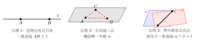
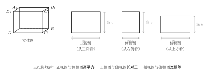

# 点、线、面的基本关系与三视图

> **一例速记**：  
> 空间几何的"公理基础"：  
> 公理 1：**两点**确定一条直线；公理 2：**不共线三点**确定一个平面；公理 3：两平面相交，交点构成一条**直线**。  
> 三视图三规律：**长对正、高平齐、宽相等**。

---

## 一、空间里的点、线、面

### 从平面到立体

平面几何研究的对象在一张"纸"上，而立体几何研究的是**三维空间**中的图形。空间中的基本元素仍是点、直线、平面，但它们之间的关系更丰富：两直线不只有"平行"或"相交"——还可能**异面**（既不平行也不相交）。

在讨论空间图形之前，需要先建立逻辑起点：哪些事实是"约定成立"的公理？

---

## 二、三大基本公理

### 公理 1：两点确定一条直线

> **表述**：经过两点有且只有一条直线。

**符号表达**：若 $A$、$B$ 是两点，则存在唯一直线 $l$ 使得 $A \in l$，$B \in l$，记为 $l = AB$。

**理解**：这条公理保证了"画一条直线连接两点"操作的**唯一性**。平面几何中你已使用了它，在空间中同样成立——两点在任何平面中都确定同一条直线。

### 公理 2：不在同一直线上的三点确定一个平面

> **表述**：过不共线的三点，有且只有一个平面。

**符号表达**：若 $A$、$B$、$C$ 不共线，则存在唯一平面 $\alpha$ 使得 $A$、$B$、$C \in \alpha$。

**理解**："不共线"这个条件不可少——三点共线时过它们的平面有无数个（想象绕直线旋转的所有平面）。"不共线的三点"恰好能"撑开"一个平面，使其唯一确定。

**实例**：桌子有三条腿，不论地面是否平整，三腿始终能稳定支撑桌面（三点确定一个平面），而四条腿的桌子则可能"晃动"（四点未必共面）。

### 公理 3：两平面有公共点，则它们的公共点集合是一条直线

> **表述**：若两平面 $\alpha$、$\beta$ 有一个公共点，则它们有且有一条公共直线。

**符号表达**：若 $\alpha \cap \beta \neq \emptyset$，则 $\alpha \cap \beta = l$（一条直线）。

**理解**：两平面不是"一个点相交"，而是"沿一条直线相交"。这条直线叫做两平面的**交线**。想象两张纸（两个平面）拼在一起，相交之处必是一条折痕（直线）。

---

## 三、三条推论

由三大公理可以推出三条常用推论：

> **推论 1**：一条直线和这直线外一点确定一个平面。

即：若直线 $l$ 与点 $P$ 不在同一直线上（$P \notin l$），则存在唯一平面 $\alpha$ 含 $P$ 和 $l$。

**推导思路**：在 $l$ 上取两点 $A$、$B$，则 $P$、$A$、$B$ 三点不共线（因 $P \notin l = AB$），由公理 2，$P$、$A$、$B$ 确定唯一平面。

> **推论 2**：两条相交直线确定一个平面。

即：若直线 $l_1$、$l_2$ 相交于点 $P$，则存在唯一平面含 $l_1$ 和 $l_2$。

**推导思路**：在 $l_1$ 上（去除 $P$）取点 $A$，在 $l_2$ 上（去除 $P$）取点 $B$，则 $P$、$A$、$B$ 不共线（$A$、$B$ 在两条不同直线上，不与 $P$ 共线），由公理 2 确定唯一平面。

> **推论 3**：两条平行直线确定一个平面。

即：若 $l_1 \parallel l_2$，则存在唯一平面含 $l_1$ 和 $l_2$。

**推导思路**：在 $l_1$ 上取点 $A$，在 $l_2$ 上取点 $B$，再在 $l_1$ 上取另一点 $C$（$C \neq A$），则 $A$、$B$、$C$ 不共线（若共线则 $l_1 = l_2$，矛盾），由公理 2 确定唯一平面。

**三条推论记忆总结**：

| 已知 | 确定的平面 |
|------|-----------|
| 直线外一点 + 这条直线 | 唯一平面 |
| 两条相交直线 | 唯一平面 |
| 两条平行直线 | 唯一平面 |

---

## 四、三视图

立体几何中描述空间图形的一种方法是**三视图**——把一个立体分别从三个方向投影到平面上，得到三张平面图。

### 4.1 三视图的定义

| 视图名称 | 观察方向 | 看到的投影 |
|----------|----------|-----------|
| **正视图**（主视图） | 从**正面**（前方）向后投影 | 宽 × 高 |
| **侧视图**（左视图） | 从**左侧**（或右侧）向内投影 | 深 × 高 |
| **俯视图**（平视图） | 从**上方**向下投影 | 宽 × 深 |

标准画法（国家标准 GB）：正视图在左上，侧视图在右上，俯视图在左下，三者按规定位置排列。

### 4.2 三投影规律

> - **长对正**：正视图与俯视图，水平尺寸（"长"）上下对齐。  
> - **高平齐**：正视图与侧视图，竖直尺寸（"高"）左右对齐（在同一水平线上）。  
> - **宽相等**：侧视图与俯视图，深度尺寸（"宽"）相等。

以棱长为 $a$ 的正方体为例：

| 视图 | 外轮廓 |
|------|--------|
| 正视图 | $a \times a$ 正方形 |
| 侧视图 | $a \times a$ 正方形 |
| 俯视图 | $a \times a$ 正方形 |

三个视图完全相同，均为正方形。这说明正方体三视图"对称"。

### 4.3 三视图还原立体图

**步骤**：
1. 看三视图的**外轮廓形状**，判断大致是哪类立体（棱柱？棱锥？球？圆柱？）。
2. 对照三投影规律，确认各视图之间的**尺寸一致性**。
3. 从正视图和侧视图确认**高度**，从俯视图确认**底面形状**。
4. 特别注意**虚线**（代表被遮挡的棱或线）——虚线代表存在但看不见的结构。

**例**：正三棱锥的三视图：
- 正视图：等腰三角形（底边 = 底面边长，高 = 棱锥高）
- 侧视图：等腰三角形（同上，如底面为正三角形则两个三角形相同）
- 俯视图：正三角形（底面），中心有一点（顶点投影）及三条线段（侧棱投影）

---

## 五、典型应用例题

### 例 1：判断三点是否确定唯一平面

**题目**：已知空间中的点 $A(0,0,0)$、$B(1,1,0)$、$C(2,2,0)$，这三点能确定唯一平面吗？

**【思路】** 先判断三点是否共线。$\vec{AB} = (1,1,0)$，$\vec{AC} = (2,2,0) = 2\vec{AB}$，所以 $A$、$B$、$C$ **共线**，三点在同一直线上，**不能**确定唯一平面（过这条直线有无数个平面）。

**解**：由于 $\vec{AC} = 2\vec{AB}$，三点共线，不满足公理 2 的"不共线"条件，故这三点不能确定唯一平面。

---

### 例 2：正方体的三视图

**题目**：棱长为 $2$ 的正方体 $ABCD$-$A_1B_1C_1D_1$，画出其三视图并标出各图尺寸。

**【思路】** 正方体各棱相等，三个方向投影均为正方形。

**解**：
- 正视图：$2 \times 2$ 正方形。
- 侧视图：$2 \times 2$ 正方形。
- 俯视图：$2 \times 2$ 正方形（顶面和底面的正方形完全重叠，只显示外轮廓）。

三视图均为边长 $2$ 的正方形，符合"长对正、高平齐、宽相等"。

---

### 例 3：由三视图还原立体图

**题目**：已知某立体的三视图如下：正视图是一个圆，侧视图是一个圆（与正视图相同），俯视图是一个正方形。请判断该立体是什么。

**【思路】** 从各方向都看到圆，且俯视图为正方形——这符合**球**的特征（球从任何方向看都是圆）与**正方体内切球**的情形。但俯视图是正方形……

**再分析**：正视图为圆，侧视图为圆，俯视图为正方形，说明这是一个**圆柱**——从上方看是圆（底面），从前后/左右看是矩形……不对。

重新审题：俯视图为正方形，正/侧视图为圆，最可能是**球**放在一个正方形底座上，俯视图中正方形是底座，圆是球的俯视。或者是以正方形截面为底、各截面均为圆的特殊立体——实际上，若正视图 = 侧视图 = 圆（直径相同），俯视图 = 正方形（边长 = 直径），则该立体是**球**，正方形是其外切正方形轮廓（实际球俯视图为圆，不为正方形）。

**更正**：若俯视图为圆，正视图和侧视图均为矩形（宽 = 直径，高 = 高度），则该立体为**圆柱**。三视图的准确解读需严格对应，不能凭印象猜测。

> **解题要点**：读三视图时，必须同时参考三个视图、对照三投影规律，缺一不可。仅看一个视图无法唯一确定立体形状。

---

## 六、易错点汇总

**易错 1：公理 2 中忘记"不共线"条件**

过三点确定平面，前提是**三点不共线**。三点共线时过它们的平面有无数个。做题时若发现三点共线，需特别说明"三点共线，不能确定唯一平面"。

**易错 2：误以为两平面只能交于一个点**

公理 3 指出：两平面相交，交集是一条**直线**，不是"一个公共点"。两平面若"只有一个公共点"在逻辑上是不可能的——有了公共点，必然有公共直线。

**易错 3：三视图方向混淆（正视图 vs 侧视图）**

正视图是**从正面看**（$xz$ 平面的投影）；侧视图是**从侧面看**（$yz$ 平面的投影）；俯视图是**从上方看**（$xy$ 平面的投影）。方向搞反会导致"宽/深"互换，三投影规律全部失效。

**易错 4：忽视三视图中的虚线**

虚线代表**被遮挡的棱或面的轮廓**，不能忽略。例如，正方体正视图中，后面的四条竖棱虽然看不到，但仍用虚线表示"它们存在"。忽略虚线会造成还原立体图时漏掉结构。

**易错 5：三投影规律中"宽相等"的方向**

"宽相等"指侧视图的水平方向（对应立体的"深度"）等于俯视图的竖直方向（同样对应"深度"）。很多同学误把俯视图的水平方向（"长"）和侧视图比较，这是混淆了"长"与"宽"。

---

## 七、自测题

**自测 1**　空间中有 4 个点 $A$、$B$、$C$、$D$，若 $A$、$B$、$C$ 不共线，$D$ 在平面 $ABC$ 上，则这 4 个点最多能确定几个不同的平面？

> 提示：$A$、$B$、$C$ 确定平面 $\alpha$，$D \in \alpha$，则 $A$、$B$、$D$；$A$、$C$、$D$；$B$、$C$、$D$ 确定的平面均为 $\alpha$。因此 4 点共面，只确定 **1 个**平面。（若 $D \notin \alpha$，则 4 个不共面的点可确定 4 个不同的平面——$ABC$，$ABD$，$ACD$，$BCD$。）

**自测 2**　一个立体的正视图为矩形（宽 3，高 2），侧视图为矩形（宽 1，高 2），俯视图为矩形（宽 3，深 1），判断该立体是什么，并用三投影规律验证。

> 提示：底面为 $3 \times 1$ 矩形，高为 $2$，这是一个**长方体**（正四棱柱）。验证：正视图宽 $3$ = 俯视图宽 $3$（长对正）；正视图高 $2$ = 侧视图高 $2$（高平齐）；侧视图宽 $1$ = 俯视图深 $1$（宽相等）。三规律全部满足。

**自测 3**　直线 $l$ 与平面 $\alpha$ 相交，交点为 $P$；另有平面 $\beta$ 也包含直线 $l$。根据公理 3，$\alpha$ 与 $\beta$ 的公共部分是什么？

> 提示：$\alpha$ 与 $\beta$ 都含直线 $l$（因 $l \subset \beta$ 且 $P = l \cap \alpha \in \alpha$，所以 $l$ 与 $\alpha$ 不一定整体在 $\alpha$ 内）。需判断 $\beta$ 是否与 $\alpha$ 有公共点——若 $\beta$ 包含 $l$ 而 $l$ 交 $\alpha$ 于 $P$，则 $P \in \alpha \cap \beta$，由公理 3，$\alpha \cap \beta$ 是一条直线，且这条直线必过 $P$。

**自测 4**　正三棱锥 $P$-$ABC$（底面为边长 $a$ 的正三角形，顶点 $P$ 在底面中心正上方）：
(1) 正视图、侧视图、俯视图分别是什么形状？  
(2) 若底面边长 $a=2$，高 $h=\sqrt{3}$，正视图的底边和高各是多少？

> 提示：  
> (1) 正视图 = 等腰三角形（底 = $a$，斜面对应腰）；侧视图 = 等腰三角形（方向不同，底稍变化）；俯视图 = 正三角形（底面），中心有一个点（顶点投影）及三条线段（侧棱在俯视中的投影）。  
> (2) 底面正三角形从正面看，底边宽为 $a = 2$；高为棱锥高 $h = \sqrt{3}$；正视图为底边 $2$、高 $\sqrt{3}$ 的等腰三角形。

---

**回头看"一例速记"**：

> 公理 1 两点定线，公理 2 不共线三点定面，公理 3 两平面交于一直线。  
> 三条推论：直线外一点、两相交直线、两平行直线——各自确定唯一平面。  
> 三视图：正视（宽×高）/ 侧视（深×高）/ 俯视（宽×深）；三规律：长对正、高平齐、宽相等。

能不看笔记说清楚"为什么三点必须不共线才能定面"以及"三投影三规律的每一条是哪两个视图之间的关系"——本章，你拿下了。
