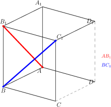
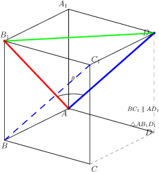
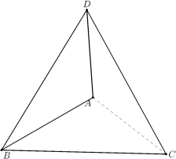

# 异面直线及其夹角

> **一例速记**：  
> **异面直线**：既不在同一平面内、又不相交的两条直线（既不平行也不相交）。  
> **异面直线夹角** $\theta \in (0°, 90°]$：将其中一条直线平移，使两线交于同一点，所成的锐角（或直角）即为夹角。  
> **求法**：① 综合法（平移找平行线，构造三角形） ② 向量法（建立坐标系，计算 $\cos\theta = |\cos\langle\vec{a},\vec{b}\rangle|$）

---

## 一、引入：正方体里的两条直线

> **引入题**：在正方体 $ABCD$-$A_1B_1C_1D_1$（棱长为 $1$）中，求异面直线 $AB_1$ 与 $BC_1$ 所成的角。

这道题表面上只是"求个角"，实际上蕴含了两个关键问题：

1. $AB_1$ 与 $BC_1$ 究竟是什么关系？（为什么叫"异面直线"？）
2. 异面直线连"在哪里"都不在一块儿，怎么定义它们的夹角？

带着这两个问题，我们先建立概念框架，再回头彻底解决这道题。

---

## 二、思维路径还原

> "拿到这道题，我的第一反应是：$AB_1$ 和 $BC_1$ 有公共点吗？  
>
> **检查公共点**：$A$、$B$、$C$、$B_1$、$C_1$ 都是正方体的顶点，$AB_1$ 上的点是 $A$ 和 $B_1$（以及它们之间的线段），$BC_1$ 上的点是 $B$ 和 $C_1$。它们有公共点吗？端点不同，中间点是否重合？直线 $AB_1$ 的参数方程是 $A + t(B_1 - A) = (t, 0, t)$（$t \in \mathbb{R}$），直线 $BC_1$ 是 $B + s(C_1 - B) = (1, s, s)$。两者相等要求 $t = 1, 0 = s, t = s$，即 $t = 1, s = 0, 1 = 0$——矛盾，故**不相交**。
>
> **检查平行**：方向向量 $\vec{AB_1} = (1, 0, 1)$，$\vec{BC_1} = (0, 1, 1)$。两向量不成比例，故**不平行**。
>
> **结论**：$AB_1$ 与 $BC_1$ 既不相交又不平行，它们是**异面直线**。
>
> **求夹角——综合法**：  
> 我需要把两条直线移到同一个点上。注意到 $BC_1$ 与 $AD_1$ 方向完全相同（因为 $ABCD$-$A_1B_1C_1D_1$ 是正方体，$\vec{BC_1} = (0,1,1) = \vec{AD_1}$），所以 $BC_1 \parallel AD_1$。  
> 将 $BC_1$ 平移到 $AD_1$，现在 $AB_1$ 和 $AD_1$ 共起点 $A$，所成角即为 $\angle B_1AD_1$。  
>
> 计算三边长度：  
> $|AB_1| = \sqrt{1^2 + 0^2 + 1^2} = \sqrt{2}$  
> $|AD_1| = \sqrt{0^2 + 1^2 + 1^2} = \sqrt{2}$  
> $|B_1D_1| = |B_1 - D_1| = |(1,0,1)-(0,1,1)| = |(1,-1,0)| = \sqrt{2}$  
>
> 三边均为 $\sqrt{2}$，$\triangle AB_1D_1$ 是**等边三角形**，故 $\angle B_1AD_1 = 60°$。  
>
> **答**：异面直线 $AB_1$ 与 $BC_1$ 所成角为 **$60°$**。
>
> **关键反射**：平移找平行线，使两线共点，再用三角形或向量求角——这是异面直线夹角题的通用路径。"

---

## 三、异面直线：定义与判定

### 3.1 定义

> **异面直线**：不在任何一个平面内的两条直线。

等价说法：空间中既**不平行**、又**不相交**的两条直线，叫做**异面直线**。

| 空间中两直线的关系 | 条件 |
|------------------|------|
| 相交 | 有且只有一个公共点 |
| 平行 | 无公共点，方向向量成比例，且在同一平面内 |
| **异面** | 无公共点，方向向量不成比例（或方向相同但不在同一平面） |

**注意**：平行的两条直线也"无公共点"，但它们在同一个平面内，不叫异面；异面是在"无公共点且不平行"的基础上的。

### 3.2 判定方法

**方法一（直接判定）**：
1. 证明两直线不相交（假设有公共点，推出矛盾）；
2. 证明两直线不平行（方向向量不成比例）；
3. 两条都成立 → 异面。

**方法二（利用公理反证）**：若两直线在同一个平面内，则它们的每一个点都在该平面内。若能找到一个点在某条直线上但不在包含另一条直线的任何平面内，则两线异面。

**方法三（坐标法）**：设参数方程联立，若方程组无解 + 方向向量不成比例 → 异面。

### 3.3 典型异面直线对

在正方体 $ABCD$-$A_1B_1C_1D_1$ 中，以下都是异面直线：

- $AB$ 与 $A_1D_1$（底面一边与顶面另一方向的边）
- $AB$ 与 $CD_1$（底面一边与体对角面上的线段）
- $AB_1$ 与 $BC_1$（即引入题的两条）

---

## 四、异面直线夹角

### 4.1 定义

由于异面直线不相交，无法直接测量它们的夹角。定义夹角时，用**平移**把问题化为相交直线的夹角：

> **异面直线夹角**：过空间中任意一点 $O$，分别作直线 $a' \parallel l_1$，$b' \parallel l_2$，则 $a'$ 与 $b'$ 所成的锐角（或直角）$\theta$ 叫做异面直线 $l_1$、$l_2$ 所成的角（即夹角）。

**范围**：$\theta \in (0°, 90°]$

- 下限 $0°$ 排除：$\theta = 0°$ 意味着两线平行，但平行直线不是异面直线。
- 上限 $90°$ 包含：两直线垂直时夹角为 $90°$。
- 取锐角：若两方向向量夹角为钝角，则取其补角（即取锐角那侧），保证 $\theta \leq 90°$。

### 4.2 夹角的唯一性

平移到不同的点 $O_1$、$O_2$、…，作出来的 $a'$、$b'$ 方向相同（因为 $a'$ 始终平行于 $l_1$），故夹角与选取的点 $O$ 无关——**夹角是异面直线的几何不变量**。

---

## 五、综合法（平移找平行线）

### 步骤框架

> 1. 找（或构造）与其中一条异面直线**平行的直线**，使两直线能共一个点或同一个平面。  
> 2. 两线共点后，所成角用三角形的角来计算（余弦定理 / 特殊三角形）。  
> 3. 若所成角为钝角，取其补角。

### 平移的关键

平移不改变方向，因此原来的夹角 = 平移后相交直线的夹角。通常利用**平行四边形**的对边平行来实现：在正方体/长方体中，相对的棱平行，可以把一条棱"搬"到与另一条棱共端点。

---

## 六、向量法（建坐标系）

### 步骤框架

> 1. 以正方体（或长方体、其他已知立体）的一个顶点为原点，三条棱方向为坐标轴，建立直角坐标系。  
> 2. 写出两条异面直线的方向向量 $\vec{a}$、$\vec{b}$。  
> 3. 计算 $\cos\theta = \dfrac{|\vec{a} \cdot \vec{b}|}{|\vec{a}||\vec{b}|}$（取绝对值是为了保证夹角为锐角）。  
> 4. 由 $\cos\theta$ 反解 $\theta$。

**公式**：

$$\boxed{\cos\theta = \dfrac{|\vec{a} \cdot \vec{b}|}{|\vec{a}||\vec{b}|}}$$

其中 $\theta \in [0°, 90°]$。

---

## 七、引入题完整解法（综合法 + 向量法对比）

正方体 $ABCD$-$A_1B_1C_1D_1$，棱长为 $1$，建立坐标系：  
$A = (0,0,0)$，$B = (1,0,0)$，$C = (1,1,0)$，$D = (0,1,0)$，  
$A_1 = (0,0,1)$，$B_1 = (1,0,1)$，$C_1 = (1,1,1)$，$D_1 = (0,1,1)$。

**综合法**：

由于 $\overrightarrow{BC_1} = C_1 - B = (0,1,1) = D_1 - A = \overrightarrow{AD_1}$，故 $BC_1 \parallel AD_1$。

将 $BC_1$ 平移到 $AD_1$，则异面直线 $AB_1$ 与 $BC_1$ 所成角 = 直线 $AB_1$ 与直线 $AD_1$ 所成角 = $\angle B_1AD_1$（$A$ 是公共端点）。

计算三边：

$$|AB_1| = \sqrt{1^2+0^2+1^2} = \sqrt{2}$$

$$|AD_1| = \sqrt{0^2+1^2+1^2} = \sqrt{2}$$

$$|B_1D_1| = |B_1 - D_1| = |(1,-1,0)| = \sqrt{2}$$

$\triangle AB_1D_1$ 三边全为 $\sqrt{2}$，是等边三角形，故

$$\angle B_1AD_1 = 60°$$

**向量法**：

$\vec{AB_1} = (1,0,1)$，$\vec{BC_1} = (0,1,1)$。

$$\vec{AB_1} \cdot \vec{BC_1} = 1\cdot0 + 0\cdot1 + 1\cdot1 = 1$$

$$|\vec{AB_1}| = \sqrt{2},\quad |\vec{BC_1}| = \sqrt{2}$$

$$\cos\theta = \dfrac{|1|}{\sqrt{2}\cdot\sqrt{2}} = \dfrac{1}{2}$$

$$\theta = 60°$$

两种方法结果一致：异面直线 $AB_1$ 与 $BC_1$ 所成角为 $\boldsymbol{60°}$。

**方法比较**：

| 方法 | 优势 | 劣势 |
|------|------|------|
| 综合法 | 直观，图形清晰，可验证 | 需要找平行线，有时不明显 |
| 向量法 | 系统，适用范围广，不需要构造图形 | 建坐标可能繁琐，容易算术出错 |

---

## 八、抽象成方法

### 求异面直线夹角的两套完整方法

**综合法（平移+构造）**：

1. 确认两线异面（不交不平行）。
2. 找与 $l_2$ 平行的直线 $l_2'$，使 $l_2'$ 与 $l_1$ 相交于点 $P$。
3. 计算 $\angle(l_1, l_2') = \angle(l_1, l_2)$，用三角函数或余弦定理求解。
4. 若得到钝角，补到 $180°$ 以内取锐角。

**向量法（坐标计算）**：

1. 建立空间直角坐标系，写出各关键点坐标。
2. 读出两直线的方向向量 $\vec{a}$、$\vec{b}$。
3. 用公式 $\cos\theta = \dfrac{|\vec{a}\cdot\vec{b}|}{|\vec{a}||\vec{b}|}$ 计算，反解 $\theta$。

### 方法变形

**变形 1：夹角范围的意义**

$\theta \in (0°, 90°]$ 这个范围有严格含义：
- $\theta$ 不能为 $0°$（那就是平行，不是异面）；
- $\theta$ 不能超过 $90°$（超过就取补角，因为"哪侧是锐角"才是实际夹角）。

计算 $\cos\langle\vec{a},\vec{b}\rangle$ 可能得到负值（两向量夹角 $> 90°$），此时必须取绝对值，对应的 $\theta$ 才是真正的异面直线夹角。

**变形 2：平面中的"角"与空间中的"角"**

平面内两直线相交有两对对顶角（一对锐角，一对钝角），通常取锐角（或直角）为两直线所成的角——与异面直线夹角定义一致。空间中异面直线的夹角同样取锐角（或直角）这侧。

**变形 3：利用对称性化简**

若立体具有对称性（如正方体、正四面体），可以优先观察是否存在特殊的等边三角形、等腰三角形，直接从几何结构读出角度，而无需计算。

---

## 九、思考路标（条件反射训练）

以下每条应内化为自动反应，看到对应场景立即触发：

1. **看到"两直线"且无法判断位置关系** → 先检查：有公共点？方向向量成比例？都没有 → 异面直线。

2. **看到"异面直线夹角"** → 立即想到两种方法：综合法（平移找平行线）或向量法（建坐标）。

3. **综合法的核心操作** → 找与一条直线平行、又与另一条直线共点的直线，构造出以夹角为内角的三角形。

4. **向量法的核心公式** → $\cos\theta = \dfrac{|\vec{a}\cdot\vec{b}|}{|\vec{a}||\vec{b}|}$，注意取**绝对值**，确保 $\theta \leq 90°$。

5. **得到 $\cos\theta$ 为负数时** → 必须取绝对值，不能直接用负值的反余弦（那样会得到 $>90°$ 的角，违反定义）。

6. **正方体/长方体中平移哪条线** → 观察哪条棱与目标线平行：相对的棱平行（正方体 12 条棱，三组各 4 条平行棱）。

7. **等边三角形 / 等腰三角形 → 直接读角** → $|AB_1| = |AD_1| = |B_1D_1| = \sqrt{2}$（等边 → $60°$）是高考常见结论，优先考虑。

8. **"所成角"与"夹角"的区别** → 在本章中两者含义相同，都指锐角（或直角）。不要把异面直线的夹角与二面角混淆（二面角可以到 $180°$）。

9. **空间中两直线垂直** → 可以通过方向向量点积为零来判断：$\vec{a} \cdot \vec{b} = 0 \Rightarrow \theta = 90°$，两直线垂直（不论它们是相交、平行还是异面）。

10. **"异面"不是"不垂直"** → 异面直线可以垂直（夹角 $90°$），也可以不垂直。"异面"描述位置关系，"夹角"描述方向关系，二者独立。

---

## 十、应用例题

### 例 1：长方体中判断异面并求夹角

**题目**：在长方体 $ABCD$-$A_1B_1C_1D_1$ 中，$AB = 2$，$BC = 1$，$AA_1 = 1$。求直线 $BD$ 与 $A_1B_1$ 所成的角。

**【思路】** 先判断两直线关系，再用向量法求角。

**解**：

建立坐标系：$A = (0,0,0)$，$B = (2,0,0)$，$C = (2,1,0)$，$D = (0,1,0)$，$A_1 = (0,0,1)$，$B_1 = (2,0,1)$。

方向向量：$\vec{BD} = D - B = (-2,1,0)$，$\vec{A_1B_1} = B_1 - A_1 = (2,0,0)$。

检验位置关系：$\vec{BD}$ 与 $\vec{A_1B_1}$ 不成比例（不平行）；$BD$ 过 $B(2,0,0)$，$A_1B_1$ 过 $A_1(0,0,1)$，无公共点（高度不同）——异面直线。

$$\cos\theta = \dfrac{|(-2)(2)+(1)(0)+(0)(0)|}{\sqrt{4+1+0}\cdot\sqrt{4}} = \dfrac{|-4|}{\sqrt{5}\cdot 2} = \dfrac{4}{2\sqrt{5}} = \dfrac{2}{\sqrt{5}} = \dfrac{2\sqrt{5}}{5}$$

$$\theta = \arccos\dfrac{2\sqrt{5}}{5} \approx 26.6°$$

> 解题要点：长方体的方向向量很容易写错符号，尤其是 $\vec{BD}$ 注意是从 $B$ 到 $D$，不是 $\vec{AB}$。向量法结束后记得取绝对值（本题分子已是正数，但要养成习惯）。

---

### 例 2：正四面体中的异面直线夹角

**题目**：正四面体 $ABCD$（4 个面均为等边三角形，棱长为 $1$）中，$E$、$F$ 分别是 $AB$、$CD$ 的中点，求 $AE$（即 $AB$）与 $CF$（即 $CD$）所成的角，以及直线 $AB$ 与 $CD$ 所成的角。

**【思路】** 正四面体棱长相等，利用向量法，建立坐标系。

**解**：

正四面体顶点坐标：设 $A = (0,0,0)$，$B = (1,0,0)$，$C = (1/2, \sqrt{3}/2, 0)$，$D = (1/2, \sqrt{3}/6, \sqrt{6}/3)$。

方向向量 $\vec{AB} = (1,0,0)$，$\vec{CD} = D - C = (0, \sqrt{3}/6 - \sqrt{3}/2, \sqrt{6}/3) = (0, -\sqrt{3}/3, \sqrt{6}/3)$。

$$\vec{AB}\cdot\vec{CD} = 0$$

$$\cos\theta = \dfrac{|0|}{1\cdot|\vec{CD}|} = 0$$

$$\theta = 90°$$

正四面体中，任意一对**不相交且不平行**的棱，夹角均为 $90°$。

> 这是一个漂亮的结论：正四面体 6 条棱形成 3 对互相平行的对棱（$AB \parallel CD$？不，正四面体中对棱**异面且互相垂直**）。

---

### 例 3：含参数的异面直线夹角

**题目**：在正方体中，$P$ 为棱 $DD_1$ 上一点，$DP = t$（$0 < t < 1$），求直线 $AP$ 与 $B_1C$ 所成角（用 $t$ 表示）。

**【思路】** 建坐标，写方向向量，代入公式，得含 $t$ 的表达式。

**解**：

以 $A$ 为原点，建坐标系：$A = (0,0,0)$，$B = (1,0,0)$，$C = (1,1,0)$，$D = (0,1,0)$，$A_1 = (0,0,1)$，$B_1 = (1,0,1)$，$D_1 = (0,1,1)$。

$P$ 在 $DD_1$ 上，$DP = t$，故 $P = D + t\cdot(D_1 - D) = (0,1,0) + t(0,0,1) = (0,1,t)$。

方向向量：$\vec{AP} = (0,1,t)$，$\vec{B_1C} = C - B_1 = (1,1,0)-(1,0,1) = (0,1,-1)$。

$$\cos\theta = \dfrac{|\vec{AP}\cdot\vec{B_1C}|}{|\vec{AP}||\vec{B_1C}|} = \dfrac{|0\cdot0+1\cdot1+t\cdot(-1)|}{\sqrt{0+1+t^2}\cdot\sqrt{0+1+1}} = \dfrac{|1-t|}{\sqrt{1+t^2}\cdot\sqrt{2}}$$

当 $0 < t < 1$ 时，$1 - t > 0$，故

$$\cos\theta = \dfrac{1-t}{\sqrt{2(1+t^2)}}$$

当 $t = 1/2$ 时，$\cos\theta = \dfrac{1/2}{\sqrt{2\cdot 5/4}} = \dfrac{1/2}{\sqrt{5/2}} = \dfrac{1}{\sqrt{10}} = \dfrac{\sqrt{10}}{10}$，$\theta = \arccos\dfrac{\sqrt{10}}{10} \approx 71.6°$。

> 解题要点：参数 $t$ 出现在分子绝对值中，需讨论 $1-t$ 的符号（本题限定 $0 < t < 1$ 故 $1 - t > 0$，无需分类）。最终答案是含 $t$ 的函数。

---

## 十一、方法总结对比

| | 综合法 | 向量法 |
|---|---|---|
| 核心思想 | 平移一条直线，使两线共点，转化为相交直线夹角 | 用方向向量的点积计算夹角 |
| 适用场景 | 图形对称性强，容易看出平行线（如正方体） | 坐标已知或容易建系，特别是含参数题 |
| 关键步骤 | 找 $l_2' \parallel l_2$ 且 $l_2'$ 与 $l_1$ 相交 | $\cos\theta = \dfrac{|\vec{a}\cdot\vec{b}|}{|\vec{a}||\vec{b}|}$ |
| 注意点 | 最后若得钝角需取补角 | 公式中必须取绝对值 |

---

## 十二、自测题

**自测 1**　判断正方体 $ABCD$-$A_1B_1C_1D_1$ 中以下各对直线的关系（相交 / 平行 / 异面），不需要计算，凭空间想象：  
(1) $AB$ 与 $CD$；(2) $AB$ 与 $A_1D_1$；(3) $AC$ 与 $BD_1$；(4) $AB$ 与 $CC_1$。

> 提示：(1) 平行（底面对边）；(2) 异面（底面与顶面不同方向）；(3) 异面（对角线与侧棱相关，需建坐标验证，但直觉异面）；(4) 异面（底面边与竖棱）——但 $AB$ 与 $CC_1$：$AB$ 在 $z=0$ 平面，$CC_1$ 竖直，只有 $C$ 与 $AB$ 不相交（$C$ 不在 $AB$ 上，$CC_1$ 也不与 $AB$ 相交），不平行，故异面。

**自测 2**　在棱长为 $1$ 的正方体 $ABCD$-$A_1B_1C_1D_1$ 中（$A$ 在原点），求直线 $AC$ 与 $A_1B_1$ 所成的角。

> 提示：$\vec{AC} = (1,1,0)$，$\vec{A_1B_1} = (1,0,0)$；$\cos\theta = \dfrac{|1|}{\sqrt{2}\cdot1} = \dfrac{1}{\sqrt{2}}$；$\theta = 45°$。

**自测 3**　求正方体 $ABCD$-$A_1B_1C_1D_1$ 中体对角线 $AC_1$ 与底面对角线 $BD$ 所成的角。

> 提示：$\vec{AC_1} = (1,1,1)$，$\vec{BD} = (-1,1,0)$；$\vec{AC_1}\cdot\vec{BD} = -1+1+0 = 0$；$\cos\theta = 0$，故 $\theta = 90°$，两线垂直（但位置关系是异面）。

**自测 4**　直线 $l_1$ 的方向向量为 $(1, 2, -1)$，直线 $l_2$ 的方向向量为 $(2, -1, 3)$，求 $l_1$ 与 $l_2$ 所成角的余弦值。

> 提示：$\vec{a}\cdot\vec{b} = 2 - 2 - 3 = -3$；$|\vec{a}| = \sqrt{6}$，$|\vec{b}| = \sqrt{14}$；$\cos\theta = \dfrac{|-3|}{\sqrt{6}\cdot\sqrt{14}} = \dfrac{3}{\sqrt{84}} = \dfrac{3}{2\sqrt{21}} = \dfrac{3\sqrt{21}}{42} = \dfrac{\sqrt{21}}{14}$。

**自测 5**　在长方体 $ABCD$-$A_1B_1C_1D_1$ 中，$AB = BC = 1$，$AA_1 = 2$。  
(1) 证明 $AC_1$ 与 $BD$ 是异面直线；  
(2) 求 $AC_1$ 与 $BD$ 所成的角。

> 提示：建坐标 $A = (0,0,0)$，$B = (1,0,0)$，$C = (1,1,0)$，$D = (0,1,0)$，$A_1=(0,0,2)$，$C_1=(1,1,2)$。  
> (1) $\vec{AC_1} = (1,1,2)$，$\vec{BD} = (-1,1,0)$，不成比例（不平行）；直线 $AC_1$ 过 $(0,0,0)$，$BD$ 过 $(1,0,0)$，参数方程联立 $(t, t, 2t) = (1-s, s, 0)$，由第三分量 $2t = 0$ 得 $t = 0$，则第一分量 $0 = 1-s$，$s = 1$，第二分量 $0 = 1$，矛盾——不相交；故异面。  
> (2) $\cos\theta = \dfrac{|(1)(-1)+(1)(1)+(2)(0)|}{\sqrt{6}\cdot\sqrt{2}} = \dfrac{0}{\sqrt{12}} = 0$；$\theta = 90°$。$AC_1 \perp BD$（异面垂直）。

---

**回头看"一例速记"**：

> **异面直线**：既不平行也不相交的两直线。  
> **夹角** $\theta \in (0°, 90°]$：平移其中一条，使两线共点，取锐角（或直角）。  
> **综合法**：平移 → 找平行线 → 构造三角形 → 余弦定理或特殊三角形。  
> **向量法**：建坐标 → 写方向向量 → $\cos\theta = \dfrac{|\vec{a}\cdot\vec{b}|}{|\vec{a}||\vec{b}|}$，取绝对值。

能不看笔记，独立完整地用向量法解出引入题（正方体 $AB_1$ 与 $BC_1$ 夹角），并说出"为什么公式要取绝对值"——本章，你拿下了。
