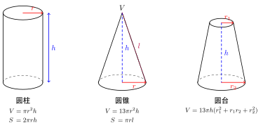

# 立体图形的表面积与体积

> **一例速记**：  
> **棱柱**：$V = S_\text{底} \cdot h$；侧面积 $S_\text{侧} = $ 侧面矩形面积之和。  
> **棱锥**：$V = \dfrac{1}{3} S_\text{底} \cdot h$（"$1/3$ × 底 × 高"是金科玉律）。  
> **棱台**：$V = \dfrac{1}{3} h(S_1 + S_2 + \sqrt{S_1 S_2})$。  
> **圆柱**：$V = \pi r^2 h$，$S_\text{侧} = 2\pi r h$。  
> **圆锥**：$V = \dfrac{1}{3}\pi r^2 h$，$S_\text{侧} = \pi r l$（$l$ 是**母线**长，不是高！）。  
> **圆台**：$V = \dfrac{1}{3}\pi h(r_1^2 + r_1 r_2 + r_2^2)$。  
> **球**：$S = 4\pi r^2$，$V = \dfrac{4}{3}\pi r^3$。

---

## 一、引入：从棱柱到球的体积公式族

立体几何的"表面积 + 体积"是一个公式密集型主题。如果死记硬背 7 类立体的 14 个公式，容易混淆。正确的学法：**记结构、记关系、记派生**。

**核心结构**（"3 大派生族"）：
1. **柱体族**（柱、圆柱）：$V = S_\text{底} \cdot h$（**直筒**）
2. **锥体族**（棱锥、圆锥）：$V = \dfrac{1}{3} S_\text{底} \cdot h$（**尖头**，比柱小 $\dfrac{1}{3}$）
3. **球**：$V = \dfrac{4}{3}\pi r^3$，$S = 4\pi r^2$（独成一类，由微积分推导）

**关系**：$\dfrac{d V_\text{球}}{d r} = 4\pi r^2 = S_\text{球}$（球的表面积是体积关于 $r$ 的导数）——记住这个对应可帮你减少混淆。

---

## 二、公式族详解

### 1. 棱柱

设底面是任意多边形 $S_\text{底}$、高（两底面距离）$h$。
- **体积**：$V = S_\text{底} \cdot h$
- **侧面积**：$S_\text{侧} = $ 所有侧面矩形面积之和 $= $ 底周长 $\times h$（直棱柱情形）
- **表面积**：$S_\text{表} = S_\text{侧} + 2 S_\text{底}$

特殊：
- **长方体**（直四棱柱）$V = abc$，$S = 2(ab + bc + ca)$
- **正方体** $V = a^3$，$S = 6a^2$

### 2. 棱锥

设底面 $S_\text{底}$、高（顶点到底面距离）$h$。
- **体积**：$V = \dfrac{1}{3} S_\text{底} \cdot h$
- **侧面积**：$S_\text{侧} = $ 所有侧面三角形面积之和

特殊：
- **正棱锥**（底面正多边形 + 顶点在底面中心正上方）：$S_\text{侧} = \dfrac{1}{2} \cdot $ 底周长 $\times l$（$l$ 是斜高，从顶点到底面边中点的距离）

### 3. 棱台

由棱锥被平行底面的面截去顶部得到。上底 $S_1$、下底 $S_2$、高 $h$。
- **体积**：$V = \dfrac{1}{3} h(S_1 + S_2 + \sqrt{S_1 S_2})$（最难背的公式）
- **侧面积**：4 个梯形面积之和

### 4. 圆柱

底面圆 $r$、高 $h$。
- **体积**：$V = \pi r^2 h$
- **侧面积**（展开是矩形）：$S_\text{侧} = 2\pi r \cdot h$
- **表面积**：$S = 2\pi r h + 2\pi r^2 = 2\pi r(h + r)$

### 5. 圆锥

底面圆 $r$、高 $h$、**母线 $l = \sqrt{r^2 + h^2}$**。
- **体积**：$V = \dfrac{1}{3}\pi r^2 h$
- **侧面积**（展开是扇形）：$S_\text{侧} = \pi r l$
- **表面积**：$S = \pi r l + \pi r^2 = \pi r(l + r)$

**侧面展开扇形**：扇形半径 = $l$，扇形弧长 = 底圆周长 $2\pi r$ → 扇形圆心角 $= \dfrac{2\pi r}{l}$。

### 6. 圆台

由圆锥被平行底面的面截去顶部得到。上底圆 $r_1$、下底圆 $r_2$、高 $h$、母线 $l$。
- **体积**：$V = \dfrac{1}{3}\pi h(r_1^2 + r_1 r_2 + r_2^2)$
- **侧面积**：$S_\text{侧} = \pi(r_1 + r_2) l$

### 7. 球

半径 $r$。
- **表面积**：$S = 4\pi r^2$
- **体积**：$V = \dfrac{4}{3}\pi r^3$
- **球的截面是圆**：球被平面截得的截面是圆；过球心的截面（大圆）半径 = $r$，不过球心的截面半径 = $\sqrt{r^2 - d^2}$（$d$ 为球心到截面距离）

---

## 三、几何示意

---

## 四、球的内切外接经典模型

立体几何最常考的"球 + 多面体"组合：

| 模型 | 关系 | 关键 |
|---|---|---|
| **球内切正方体** | $2r = a$（球径 = 棱长） | $r = a/2$ |
| **正方体外接球**（顶点在球面上） | $2r = $ 体对角线 $= a\sqrt{3}$ | $r = \dfrac{\sqrt{3}}{2} a$ |
| **正方体棱切球**（球切 12 条棱） | $2r = $ 面对角线 $= a\sqrt{2}$ | $r = \dfrac{\sqrt{2}}{2} a$ |
| **球内切正四面体** | 体积法 | $r = \dfrac{\sqrt{6}}{12} a$（$a$ 是棱长）|
| **球外接正四面体** | 体对角线对应 | $r = \dfrac{\sqrt{6}}{4} a$ |
| **球外接长方体** | $2r = \sqrt{a^2+b^2+c^2}$ | — |
| **球外接圆锥** | 利用直角三角形 | 见例 3 |

**核心思想**：找球心位置 + 列方程。

---

## 五、典型应用

### 例 1：直三棱柱的表面积体积

> **题目**：直三棱柱 $ABC$-$A_1B_1C_1$ 中底面为直角三角形（直角边 $3, 4$），高 $5$。求 $V$ 和 $S_\text{表}$。

【思路】套公式。

【解】
- 底面积 $S_\text{底} = \frac{1}{2} \times 3 \times 4 = 6$
- 体积 $V = 6 \times 5 = 30$
- 底周长 $= 3 + 4 + 5 = 12$（斜边 = $\sqrt{9+16} = 5$）
- 侧面积 $S_\text{侧} = 12 \times 5 = 60$
- 表面积 $S = 60 + 2 \times 6 = 72$

### 例 2：圆锥侧面展开扇形

> **题目**：圆锥底面半径 $r = 3$，母线 $l = 6$。求侧面展开扇形的圆心角。

【思路】扇形弧长 = 底圆周长。

【解】
- 扇形半径 = $l = 6$
- 扇形弧长 = $2\pi r = 6\pi$
- 圆心角（弧度）$= \dfrac{\text{弧长}}{\text{半径}} = \dfrac{6\pi}{6} = \pi$
- 即扇形圆心角为 $\pi$（$180°$，半圆形）

### 例 3：球外接圆锥

> **题目**：圆锥底面半径 $r = 3$，高 $h = 4$。求其外接球（即圆锥顶点和底面圆周上所有点都在球面上）的半径。

【思路】球心在圆锥的轴线上。设球心 $O$ 距圆锥底面距离为 $d$（沿轴线方向）。

【解】令圆锥顶点 $P$、底面圆心 $O'$。$PO' = h = 4$。球心 $O$ 在 $PO'$ 上。

设 $OO' = d$（$O$ 在 $O'$ 上方距 $d$，或下方）。由 $O$ 到顶点 $P$ 距离 = 球半径 $R$，到底面圆周一点距离也 = $R$：
- $OP = h - d = 4 - d$
- $O$ 到底面圆上点距离 = $\sqrt{d^2 + r^2} = \sqrt{d^2 + 9}$

令二者相等：$(4-d)^2 = d^2 + 9$ → $16 - 8d + d^2 = d^2 + 9$ → $d = \frac{7}{8}$

故 $R = 4 - \frac{7}{8} = \frac{25}{8}$。

---

## 六、易错点

1. **圆锥的"母线 $l$" vs "高 $h$"**：侧面积公式用 $l$（母线），体积用 $h$。这两个量满足 $l = \sqrt{r^2 + h^2}$，**不要混用**。

2. **棱锥体积 $\dfrac{1}{3}$ 系数**：所有锥体（棱锥、圆锥）都比对应的柱体（棱柱、圆柱）少 $\dfrac{1}{3}$ 系数。常见错误：忘记 $\dfrac{1}{3}$。

3. **球的截面**：球被任意平面截得的截面是**圆**（不是椭圆！）。过球心的截面叫大圆，半径 = 球半径；不过球心的截面半径 = $\sqrt{r^2 - d^2}$。

4. **正棱锥的"斜高"vs"侧棱长"**：正棱锥侧面是等腰三角形，**斜高**是这个三角形从顶点到底面边中点的距离（用于算侧面积）；**侧棱长**是从顶点到底面顶点的距离。两者不同。

5. **棱台体积公式**：$V = \dfrac{h}{3}(S_1 + S_2 + \sqrt{S_1 S_2})$ 不是 $V = \dfrac{h}{3}(S_1 + S_2)$（梯形面积的类推是错的）。

---

## 七、自测题

**自测 1**　正方体棱长为 $1$，求其外接球的体积。

> 💡 提示：外接球直径 = 体对角线 = $\sqrt{3}$ → $r = \frac{\sqrt{3}}{2}$ → $V = \frac{4}{3}\pi r^3 = \frac{4}{3}\pi \cdot \frac{3\sqrt{3}}{8} = \frac{\sqrt{3}}{2}\pi$。

**自测 2**　正三棱锥底面边长 $a$，侧棱长 $\sqrt{3} a$。求其体积。

> 💡 提示：底面是正三角形 $S_\text{底} = \frac{\sqrt{3}}{4} a^2$。求高 $h$：顶点到底面距离 = $\sqrt{(\sqrt{3}a)^2 - (\frac{\sqrt{3}}{3}a)^2}$（底面正三角形重心到顶点距离 = $\frac{\sqrt{3}}{3}a$）$= \sqrt{3a^2 - \frac{a^2}{3}} = \sqrt{\frac{8a^2}{3}} = \frac{2\sqrt{6}}{3}a$。$V = \frac{1}{3} \cdot \frac{\sqrt{3}}{4}a^2 \cdot \frac{2\sqrt{6}}{3}a = \frac{\sqrt{2}}{6}a^3$。

**自测 3**　圆台上底半径 $1$，下底半径 $2$，高 $3$。求体积和侧面积。

> 💡 提示：$V = \frac{\pi \cdot 3}{3}(1 + 4 + 2) = 7\pi$。母线 $l = \sqrt{3^2 + (2-1)^2} = \sqrt{10}$。侧面积 $= \pi(1+2) \cdot \sqrt{10} = 3\sqrt{10}\pi$。

**自测 4**　球面上有 $A, B$ 两点，球心到 $AB$ 的距离为 $4$，$|AB| = 6$，求球半径。

> 💡 提示：用勾股 $r^2 = 4^2 + 3^2 = 25$（$|AB|/2 = 3$ 是 $AB$ 弦的一半）→ $r = 5$。

**自测 5**　把一个底面半径为 $3$、高为 $4$ 的圆柱熔铸成若干个半径为 $1$ 的球，最多能铸多少个（球之间不重叠）？

> 💡 提示：体积守恒（不是占空守恒）。圆柱体积 $= \pi \cdot 9 \cdot 4 = 36\pi$。每球体积 $= \frac{4}{3}\pi$。最多 $36\pi / \frac{4\pi}{3} = 27$ 个。

---

**回头看一眼"一例速记"**：

> 柱体 $V = S_\text{底} h$；锥体 $V = \frac{1}{3} S_\text{底} h$（少 $\frac{1}{3}$）；球 $V = \frac{4}{3}\pi r^3, S = 4\pi r^2$。  
> 圆锥侧面积用**母线 $l$**（不是高 $h$）：$S_\text{侧} = \pi r l$。  
> 棱台体积 $V = \frac{h}{3}(S_1+S_2+\sqrt{S_1 S_2})$（**3 项**不是 2 项！）。

如果现在不看笔记能独立完成例 3（球外接圆锥）+ 自测 2 + 自测 5——本章，你拿下了。
