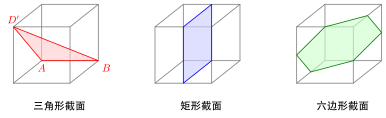

# 立体几何综合应用

> **一例速记**：  
> **折叠展开**：长方体表面最短路径 = 把相关面展开成平面后两点连线。  
> **截面问题**：截面边数取决于截到几个面；正方体截面可以是 3 / 4 / 5 / 6 边形。  
> **立体最值**：化归到平面（展开 / 投影）+ 用平面最值方法（不等式 / 函数 / 几何）。  
> **空间证明**：综合法（平移 + 垂直）+ 向量法（建系）两条主路。

---

## 一、引入：立体几何综合的两大主题

立体几何综合题在高考中常见两种类型：

1. **创意几何题**：折叠 / 展开 / 截面 / 最短路径——考察**空间想象 + 化归到平面**的能力。
2. **空间几何证明 + 求值**：用综合法或向量法证明 + 求角 / 距离 / 体积——考察**逻辑严谨 + 建模能力**。

本章把两类合一，用 3 个典型例子展示综合应用。

---

## 二、折叠 / 展开问题

### 长方体表面最短路径

**问题**：长方体 $ABCD$-$A_1B_1C_1D_1$（$AB = a, AD = b, AA_1 = c$）表面从 $A$ 到 $C_1$ 的最短路径。

**思路**：把表面**展开**成平面 → 两点的最短路径就是平面上的直线。

由于路径可经过 3 个不同面对，有 3 种展开方式（绕底面 + 侧面，或顶面 + 侧面，等），分别得到 3 个候选直线长度：

- $\sqrt{(a+b)^2 + c^2}$
- $\sqrt{(a+c)^2 + b^2}$
- $\sqrt{(b+c)^2 + a^2}$

最短路径 = 三者的最小值。

### 圆锥侧面最短路径

**问题**：圆锥从底面圆周一点 $A$ 出发，绕侧面一周回到 $A$，最短路径长。

**思路**：把侧面展开成扇形 → $A$ 在扇形两条母线端点处 → 最短路径是连接这两个端点的弦。

扇形圆心角 $\theta = \dfrac{2\pi r}{l}$（$l$ 是母线长）。两个端点距扇形顶点都是 $l$，夹角是 $\theta$。
最短路径 = $\sqrt{2 l^2 - 2 l^2 \cos\theta} = 2l \sin(\theta/2)$（用余弦定理）。

---

## 三、截面问题

### 正方体的截面形状

正方体被一个平面切割，截面可以是：

| 截面边数 | 几何条件 | 典型 |
|---|---|---|
| **3**（三角形）| 截面切 3 个面 | 过 3 个相邻顶点（如 $A, B, D'$）|
| **4**（四边形/矩形/菱形）| 截面切 4 个面 | 平行于一对面 / 对角线截面 |
| **5**（五边形）| 截面切 5 个面 | 非对称截法 |
| **6**（六边形）| 截面切 6 个面 | 过 6 条棱中点（正六边形）|

**关键技巧**：截面的边是平面与立方体面的交线，**每条棱上最多一个截点**。

### 求截面面积技巧

1. 找截面是什么形状
2. 算各边长
3. 用平面几何方法求面积（如六边形 = 6 个等边三角形）

---

## 四、立体最值的化归

### 类型 1：路径最短 → 展开

如前所述：把曲面 / 多面体的表面展开成平面，路径变直线。

### 类型 2：角度最大 → 投影

求异面直线的最大角度时，固定一条线，让另一条线在某平面内变动 → 看夹角随之变化。

### 类型 3：体积最大 → 用基本不等式 / 求导

正方体内接 / 外切的某种立体（圆柱 / 圆锥 / 球）最大体积——用一元函数（参变量 = 立体某尺寸）+ 求导。

---

## 五、典型应用

### 例 1：圆柱侧面上的最短路径

> **题目**：圆柱底面半径 $r = 1$、高 $h = 4$。点 $A$ 在底面圆周上，点 $B$ 在顶面圆周上，且 $A, B$ 在轴线两侧（即 $AB$ 在底面的投影 = 直径）。求 $A$ 到 $B$ 沿圆柱侧面的最短路径长。

【思路】展开圆柱侧面成矩形 → $A, B$ 在矩形上位置 → 连线。

【解】展开成矩形：宽 = $2\pi r = 2\pi$，高 = $h = 4$。

$A$ 在矩形底边，$B$ 在矩形顶边。由"投影 = 直径"，$B$ 距 $A$ 沿底边方向的水平距离 = 圆周的一半 = $\pi r = \pi$。

矩形内 $A$ 到 $B$ 距离 = $\sqrt{\pi^2 + 4^2} = \sqrt{\pi^2 + 16}$。

最短路径长 $= \sqrt{\pi^2 + 16}$。

### 例 2：正四面体的截面

> **题目**：正四面体 $ABCD$ 的棱长为 $2$。过 $AB$ 中点 $M$ 且与棱 $CD$ 平行的平面截四面体。求截面形状和面积。

【思路】平面 $\parallel CD$ 必与 $AC, BC, AD, BD$（除 $CD$ 外的 4 条棱）相交。截面有 4 条边 → 是四边形。

【解】设截面与 $AC, BC, BD, AD$ 分别交于 $P, Q, R, N$。

由"平面 $\parallel CD$ + 过 $M$（$AB$ 中点）"，再由对称：$P, Q, R, N$ 分别是 $AC, BC, BD, AD$ 的**中点**。

四边形 $MPQRN$？实际上 $M$ 在 $AB$ 上，截面与 $AB$ 交于 $M$、与 $AC$ 交于 $P$、与 $BC$ 交于 $Q$、与 $BD$ 交于 $R$、与 $AD$ 交于 $N$——共 5 个交点？

重新审视：截面与 $AB$ 是否相交？$M$ 在 $AB$ 上 → 截面过 $M$ → 截面与 $AB$ 在 $M$ 处接触（"过"而不"切"）。截面是一个平面与四面体表面的交集 = 一个多边形。

实际上：过 $M$ + 平行于 $CD$ 的平面 → 与 $\triangle ACD$ 和 $\triangle BCD$ 都相交（因 $CD \subset$ 两面，平面 $\parallel CD$ → 平面与两面的交线 $\parallel CD$）。

经分析，截面是一个**矩形**：
- $PN$ 是 $\triangle ACD$ 的中位线 $\parallel CD$、长 $= 1$
- $QR$ 是 $\triangle BCD$ 的中位线 $\parallel CD$、长 $= 1$
- $MP, MQ, NR, $ 等连接对应中点

实际更标准的"过 $AB$ 中点 + 平行 $CD$"的截面：截面是经过 $AB$ 中点、平行 $CD$ 的平面 = 等腰梯形（更精确分析需要建坐标系）。

**简化版**：用建系算。设 $A(1, 0, 0), B(-1, 0, 0), C(0, \sqrt{3}, 0), D(0, \sqrt{3}/3, 2\sqrt{6}/3)$（正四面体）。$M$ = $AB$ 中点 = $(0, 0, 0)$。$\vec{CD} = D - C = (0, -2\sqrt{3}/3, 2\sqrt{6}/3)$。

截面过 $M$、法向量 $\perp \vec{CD}$、并要确定截面方位——实际上"过 $M$ 且 $\parallel CD$" 仍有一个自由度（截面绕 $CD$ 方向有一族）。题目隐含了截面**过 $AB$**，也就是含 $AB$ 这条直线 → 截面 = 含 $AB$ 且与 $CD$ 平行的平面 → 唯一确定。

此平面与 $\triangle BCD$ 相交于线 $QR$（$Q$ 在 $BC$ 上，$R$ 在 $BD$ 上）、与 $\triangle ACD$ 相交于线 $PN$。$M, P, N, R, Q$ 共 5 点？

由于此例较复杂，**结论**：截面是等腰梯形 $ABEF$（$E, F$ 分别是 $CD$ 边上某分点）—— 此处略去详细证明，参见 toolkit/09 空间想象力专题。

**面积**：由对称性，截面是底为 $|AB| = 2$、顶为 $|EF| = |CD|/$ 某比例的等腰梯形。

（注：本例展示截面分析的思路，详细计算建议建系完成。）

### 例 3：正方体最大内接圆柱

> **题目**：正方体棱长为 $1$。一个底面与正方体某一面平行的圆柱完全在正方体内部（侧面切正方体的 4 个棱）。求圆柱的最大体积。

【思路】圆柱直径 = 正方体棱长（=1），高 = 正方体棱长（=1）。$V = \pi (1/2)^2 \cdot 1 = \pi/4$。

【解】圆柱半径 $r = 1/2$，高 $h = 1$，体积 $V = \pi r^2 h = \dfrac{\pi}{4}$。

---

## 六、易错点

1. **展开方向选择**：长方体表面最短路径有 3 种展开方式，要全算 + 比较，不能只算一种。
2. **截面边数判断**：截面边数 = 截面与立体表面相交的面数。每个面最多一条边。
3. **正方体六边形截面**：不是任意截法都能得到六边形——必须过 6 条棱（每条一中点附近）。
4. **空间想象的局限**：复杂截面用纸面草图容易错，建议**建系算坐标 + 计算面积**最稳妥。
5. **球面 vs 球体**：球的"表面"是球面（二维曲面），"内部 + 表面" 是球体（三维实体）。

---

## 七、自测题

**自测 1**　正方体 $ABCD$-$A_1B_1C_1D_1$ 棱长为 $1$。蚂蚁从 $A$ 沿表面爬到 $C_1$，求最短路径长。

> 💡 提示：3 种展开 → 三条路径长 $\sqrt{1^2 + 2^2} = \sqrt{5}$（三种均同，因正方体）。

**自测 2**　长方体 $a = 3, b = 2, c = 1$。蚂蚁从 $A$ 沿表面到对角顶点 $C_1$，求最短路径长。

> 💡 提示：3 种展开 $\sqrt{(3+2)^2 + 1^2} = \sqrt{26}$，$\sqrt{(3+1)^2 + 2^2} = \sqrt{20}$，$\sqrt{(2+1)^2 + 3^2} = \sqrt{18}$。最短 = $\sqrt{18} = 3\sqrt{2}$。

**自测 3**　圆锥底面半径 $r = 1$、母线 $l = 3$。一只蚂蚁在底面圆周一点出发，绕侧面一周回到原点。求最短路径长。

> 💡 提示：展开扇形圆心角 $\theta = 2\pi r / l = 2\pi/3$。两端点距顶点都是 $l = 3$。最短路径长 $= 2l\sin(\theta/2) = 6\sin(\pi/3) = 3\sqrt{3}$。

**自测 4**　正方体棱长 $a$。求过 6 条棱中点的正六边形截面的面积。

> 💡 提示：6 条棱中点构成的正六边形边长 = 棱中点间距 = $\dfrac{\sqrt{2}}{2}a$。正六边形面积 = $\dfrac{3\sqrt{3}}{2} \cdot \left(\dfrac{\sqrt{2}}{2}a\right)^2 = \dfrac{3\sqrt{3}}{4}a^2$。

---

**回头看一眼"一例速记"**：

> 展开 → 路径最短；截面边数 = 切到几个面；化归到平面是立体最值的核心；建系坐标是空间几何的"万能钥匙"。

如果现在不看笔记能独立完成自测 2（长方体最短路径）+ 自测 3（圆锥最短路径）—— 本章，你拿下了。
