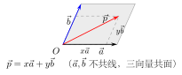

# 空间向量的基本概念与运算

> **一例速记**：  
> 空间向量 = 有向线段，既有**大小**又有**方向**，可自由平移。  
> **平行六面体法则**：$\vec{a}+\vec{b}+\vec{c}$ 沿三条共顶点向量张成的平行六面体的对角线。  
> **共线定理**：$\vec{a} \parallel \vec{b} \Leftrightarrow \exists\,\lambda \in \mathbb{R},\,\vec{a}=\lambda\vec{b}$（$\vec{b}\neq\vec{0}$）。  
> **共面定理**：$\vec{p},\vec{a},\vec{b}$ 共面 $\Leftrightarrow \vec{p}=x\vec{a}+y\vec{b}$（$\vec{a},\vec{b}$ 不共线）。  
> **基本定理**：3 个不共面向量构成空间基底，任意向量可唯一分解。

---

## 一、为什么要从平面向量走向空间

平面向量只能描述二维运动——飞机的位移、平面上的力。但现实世界是三维的：火箭轨迹、卫星姿态、建筑应力都需要三维工具。**空间向量**将平面向量的概念和运算全面推广到三维空间，同时保留"自由向量"的核心性质。

---

## 二、空间向量的定义与基本性质

### 定义

**空间向量**是空间中既有大小又有方向的量。

几何上用**有向线段** $\vec{AB}$ 表示，起点 $A$，终点 $B$，箭头指向 $B$。向量的**模**（大小）记作 $|\vec{AB}|$ 或 $|\vec{a}|$。

**自由性**：向量不固定在某个起点，只由大小和方向决定，可自由平移。相同大小、相同方向的向量，无论起点在何处，都视为**相等向量**。

### 与平面向量的相同点

| 性质 | 平面向量 | 空间向量 |
|---|---|---|
| 自由性（可平移） | 是 | 是 |
| 零向量 $\vec{0}$ | 模为 $0$，方向任意 | 同左 |
| 单位向量 | $\vert \vec{e}\vert =1$ | 同左 |
| 共线（平行）的定义 | 方向相同或相反 | 同左 |
| 加减法、数乘法则 | 三角形/平行四边形法则 | 推广见下 |

### 与平面向量的主要差异

| 维度 | 平面向量 | 空间向量 |
|---|---|---|
| 空间维数 | 2 | 3 |
| 基底向量个数 | 2（线性无关即可） | 3（不共面） |
| 坐标分量 | $(x,y)$ | $(x,y,z)$ |
| 共面含义 | 任意两向量都共面 | 需额外验证 |

**关键差异**：在平面中，任意两个不共线向量都能张成整个平面；在空间中，需要**三个不共面的向量**才能张成整个空间。

---

## 三、空间向量的加法

### 三角形法则（首尾相接）

与平面情形完全相同：

$$\vec{AB} + \vec{BC} = \vec{AC}$$

首尾相接，和向量从第一个起点直达最后一个终点。

推广到多个向量：

$$\vec{AB} + \vec{BC} + \vec{CD} = \vec{AD}$$

封闭折线的向量和为零：

$$\vec{AB} + \vec{BC} + \vec{CA} = \vec{0}$$

### 平行六面体法则（三向量共顶点相加）

平面加法中，两向量共起点用平行四边形法则；在空间中，三个共起点向量 $\vec{a}, \vec{b}, \vec{c}$ 可以张成**平行六面体**，其和向量即为**对角线**方向的向量：

$$\vec{a} + \vec{b} + \vec{c} = \text{平行六面体对角线向量}$$

**几何原理**：以 $\vec{a}, \vec{b}, \vec{c}$ 为三条棱，先用平行四边形法则得 $\vec{a}+\vec{b}$，再与 $\vec{c}$ 用三角形法则合并，结果是六面体对角线。

### 加法的运算律

$$\vec{a} + \vec{b} = \vec{b} + \vec{a} \quad\text{（交换律）}$$

$$(\vec{a} + \vec{b}) + \vec{c} = \vec{a} + (\vec{b} + \vec{c}) \quad\text{（结合律）}$$

运算律的推导与平面情形完全相同，此处不再赘述。

---

## 四、向量的减法与数乘

### 减法

$$\vec{a} - \vec{b} = \vec{a} + (-\vec{b})$$

共起点几何意义：$\vec{OA} - \vec{OB} = \vec{BA}$（从减数终点指向被减数终点）。

### 数乘 $\lambda\vec{a}$

**定义**：设 $\lambda$ 为实数，$\vec{a}$ 为向量，则 $\lambda\vec{a}$ 是一个向量，满足：

- **模**：$|\lambda\vec{a}| = |\lambda|\cdot|\vec{a}|$
- **方向**：
  - $\lambda > 0$：与 $\vec{a}$ 同向
  - $\lambda < 0$：与 $\vec{a}$ 反向
  - $\lambda = 0$：结果为 $\vec{0}$

**数乘运算律**：

$$\lambda(\mu\vec{a}) = (\lambda\mu)\vec{a}$$

$$(\lambda+\mu)\vec{a} = \lambda\vec{a} + \mu\vec{a}$$

$$\lambda(\vec{a}+\vec{b}) = \lambda\vec{a} + \lambda\vec{b}$$

---

## 五、共线向量定理

**定理**：设 $\vec{b}\neq\vec{0}$，则 $\vec{a}\parallel\vec{b}$ 当且仅当存在唯一实数 $\lambda$，使得

$$\vec{a} = \lambda\vec{b}$$

**推论**：若 $\vec{a} \parallel \vec{b}$，且 $\vec{a} \parallel \vec{c}$，$\vec{b} \parallel \vec{c}$（且 $\vec{b}, \vec{c}$ 非零），则 $\vec{b}, \vec{c}$ 共线（可以用同一实数倍关系联系）。

**注意**：
- 零向量 $\vec{0}$ 与任意向量共线（平行）。
- 两直线共线（平行）与向量共线（平行）在高中数学中等价：若 $\vec{AB} \parallel \vec{CD}$，则直线 $AB$ 与直线 $CD$ 平行或共线。

**证明思路**：若 $\vec{a} \parallel \vec{b}$，则 $\vec{a}$ 与 $\vec{b}$ 方向相同或相反，设 $|\vec{a}|/|\vec{b}| = r$，则 $\lambda = r$（同向）或 $\lambda = -r$（反向）。反之，若 $\vec{a}=\lambda\vec{b}$，则 $\vec{a}$ 的模和方向完全由 $\vec{b}$ 确定，方向与 $\vec{b}$ 相同（$\lambda>0$）或相反（$\lambda<0$），故共线。

---

## 六、共面向量定理

### 定理陈述

**共面向量定理**：设 $\vec{a}, \vec{b}$ 是不共线的两个向量，则向量 $\vec{p}$ 与 $\vec{a}, \vec{b}$ **共面**，当且仅当存在唯一一对实数 $x, y$，使得

$$\vec{p} = x\vec{a} + y\vec{b}$$

### 几何理解

$\vec{a}$ 与 $\vec{b}$ 不共线，它们确定一个平面（过公共起点的平面）。在这个平面内，任何向量 $\vec{p}$ 都可以沿 $\vec{a}$ 和 $\vec{b}$ 两个方向分解，这类似于平面直角坐标系中 $(x, y)$ 的分量。

反之，若 $\vec{p}$ 不在这个平面内（即 $\vec{p}, \vec{a}, \vec{b}$ 不共面），则 $\vec{p}$ 无法写成 $x\vec{a}+y\vec{b}$ 的形式。

### 平面与空间的对比

| | 平面向量 | 空间向量（三向量共面） |
|---|---|---|
| 条件 | $\vec{a}, \vec{b}$ 不共线 | $\vec{a}, \vec{b}$ 不共线，$\vec{p}$ 在 $\vec{a},\vec{b}$ 张成的平面内 |
| 结论 | 平面内任意 $\vec{p} = x\vec{a}+y\vec{b}$ | $\vec{p} = x\vec{a}+y\vec{b}$ |
| 系数唯一性 | 唯一 | 唯一 |

---

## 七、空间向量基本定理

### 定理陈述

**空间向量基本定理**：若三个向量 $\vec{e}_1, \vec{e}_2, \vec{e}_3$ **不共面**，则空间中任意向量 $\vec{p}$ 都可以唯一地表示为

$$\vec{p} = x\vec{e}_1 + y\vec{e}_2 + z\vec{e}_3 \quad (x, y, z \in \mathbb{R})$$

我们称 $\{\vec{e}_1, \vec{e}_2, \vec{e}_3\}$ 为空间的一组**基底**，$\vec{e}_1, \vec{e}_2, \vec{e}_3$ 称为**基向量**，$(x, y, z)$ 称为 $\vec{p}$ 在该基底下的**坐标**。

### 与坐标系的关联

取特殊基底：$\vec{e}_1 = \vec{i}=(1,0,0)$，$\vec{e}_2 = \vec{j}=(0,1,0)$，$\vec{e}_3 = \vec{k}=(0,0,1)$（三条坐标轴方向的单位向量），则任意向量

$$\vec{a} = a_1\vec{i} + a_2\vec{j} + a_3\vec{k} = (a_1, a_2, a_3)$$

这正是空间直角坐标系中向量的**坐标表示**。

### 唯一性的意义

唯一性保证了坐标运算的一致性：如果两种方式算出同一向量，它们的坐标必须相同，不存在歧义。这也是用坐标法解决空间问题的理论基础。

**三个不共面**是关键条件：
- 三个向量共线（均平行）：只能表示一条直线上的方向，张成 0 维或 1 维；
- 三个向量共面：只能表示该平面内的向量，张成 2 维；
- 三个向量不共面：才能张成整个三维空间。

---

## 八、典型应用例题

### 例 1：利用共面向量定理判断点的位置

**题目**：在空间四边形 $OABC$ 中，$\vec{OA} = \vec{a}$，$\vec{OB} = \vec{b}$，$\vec{OC} = \vec{c}$。点 $M$ 满足 $\vec{OM} = \dfrac{1}{3}\vec{a} + \dfrac{1}{3}\vec{b} + \dfrac{1}{3}\vec{c}$。判断 $M$ 是否在平面 $ABC$ 内。

**【思路】** 先用基本定理表示平面 $ABC$ 上的点，再判断 $M$ 的坐标是否满足条件。

**解**：

平面 $ABC$ 上的点 $P$ 满足 $\vec{OP} = \vec{OA} + s\,\vec{AB} + t\,\vec{AC}$，其中 $s + t \leq 1$，$s,t \geq 0$（重心坐标形式）。

更简洁地，平面 $ABC$ 上的点可以写为：

$$\vec{OP} = (1-s-t)\vec{a} + s\vec{b} + t\vec{c}$$

其中 $(1-s-t)$ 、$s$、$t$ 的系数之和为 $1$。

对于 $M$：系数为 $\dfrac{1}{3}, \dfrac{1}{3}, \dfrac{1}{3}$，三者之和为 $1$，故 $M$ 在平面 $ABC$ 内。

进一步，$M$ 是三角形 $ABC$ 的**重心**（三个系数均为 $\dfrac{1}{3}$，即等权重组合）。

**答**：$M$ 在平面 $ABC$ 内，是 $\triangle ABC$ 的重心。

---

### 例 2：用共线向量定理求参数

**题目**：已知向量 $\vec{a} = (1, 2, -1)$，$\vec{b} = (2, t, -2)$，若 $\vec{a} \parallel \vec{b}$，求 $t$。

**【思路】** 共线等价于 $\vec{b} = \lambda\vec{a}$，列方程组求 $\lambda$ 和 $t$。

**解**：

若 $\vec{a} \parallel \vec{b}$，则 $\vec{b} = \lambda\vec{a}$，即：

$$\begin{cases} 2 = \lambda \cdot 1 \\ t = \lambda \cdot 2 \\ -2 = \lambda \cdot (-1) \end{cases}$$

由第一个方程：$\lambda = 2$；由第三个方程：$\lambda = 2$（一致）。

由第二个方程：$t = 2\lambda = 4$。

**验证**：$\vec{b} = (2, 4, -2) = 2(1, 2, -1) = 2\vec{a}$，确实共线。

**答**：$t = 4$。

---

### 例 3：空间向量基本定理的应用

**题目**：在长方体 $ABCD$-$A_1B_1C_1D_1$ 中（$AB=2, AD=1, AA_1=1$），设 $\vec{AB}=\vec{a}$，$\vec{AD}=\vec{b}$，$\vec{AA_1}=\vec{c}$。点 $P$ 是体对角线 $AG$（其中 $G=C_1$）上距 $A$ 为 $\dfrac{2}{3}$ 处的点。用 $\vec{a},\vec{b},\vec{c}$ 表示 $\vec{AP}$，并说明 $P$ 在哪个平面上。

**【思路】** 体对角线 $\vec{AC_1} = \vec{a} + \vec{b} + \vec{c}$，$P$ 在其上故 $\vec{AP} = \dfrac{2}{3}(\vec{a}+\vec{b}+\vec{c})$。

**解**：

$\vec{AC_1} = \vec{AB} + \vec{BC_1} = \vec{a} + \vec{b} + \vec{c}$（首尾相接：$\vec{AB} + \vec{AD} + \vec{AA_1}$）。

$P$ 在 $\overline{AC_1}$ 上，距 $A$ 为线段长度的 $\dfrac{2}{3}$，故：

$$\vec{AP} = \dfrac{2}{3}\vec{AC_1} = \dfrac{2}{3}(\vec{a}+\vec{b}+\vec{c}) = \dfrac{2}{3}\vec{a} + \dfrac{2}{3}\vec{b} + \dfrac{2}{3}\vec{c}$$

用 $\vec{a}, \vec{b}, \vec{c}$ 表示：$\vec{AP}$ 的三个系数之和为 $\dfrac{2}{3}+\dfrac{2}{3}+\dfrac{2}{3}=2$，不等于 $1$，故 $P$ 不在平面 $A_1BC$ 类的截面上（此结论可进一步探究）。

**答**：$\vec{AP} = \dfrac{2}{3}\vec{a} + \dfrac{2}{3}\vec{b} + \dfrac{2}{3}\vec{c}$。

---

## 九、易错点汇总

**易错 1：把平面向量的"任意两向量共面"误用于空间**

在平面里，任意两个向量当然处于同一平面。但在空间里，若题目给出三个向量 $\vec{a}, \vec{b}, \vec{c}$，不能想当然地认为它们共面，必须检验是否存在 $x, y$ 使得 $\vec{c} = x\vec{a}+y\vec{b}$（或等价条件）。

**易错 2：共线定理中忘记排除 $\vec{b}=\vec{0}$ 的情况**

$\vec{a} \parallel \vec{b} \Leftrightarrow \vec{a}=\lambda\vec{b}$ 的等价性要求 $\vec{b}\neq\vec{0}$。若 $\vec{b}=\vec{0}$，则 $\vec{a}=\lambda\vec{b}=\vec{0}$ 对一切 $\lambda$ 成立，但零向量与任何向量都平行，所以实际上零向量的情况需单独说明。

**易错 3：共面定理中混淆"系数存在"与"系数唯一"**

共面向量定理保证了系数 $x, y$ 的**唯一性**，不能认为有多种分解。若两种方法给出不同系数，一定有错误。

**易错 4：平行六面体法则中把"对角线"认错**

平行六面体有 $4$ 条对角线（体对角线），$\vec{a}+\vec{b}+\vec{c}$ 对应的是从三向量公共起点出发、穿过六面体中心到达对顶点的那条对角线，不是面对角线。

**易错 5：三个不共面向量的条件理解偏差**

三个不共面向量的关键是：任何一个都不能用其余两个的线性组合表示。若 $\vec{c} = x\vec{a}+y\vec{b}$，则三者共面，不构成基底。判断时可用行列式（坐标法）或几何直观。

---

## 十、思路自测题

**自测 1**　已知 $\vec{a} = (2, 1, -1)$，$\vec{b} = (-4, -2, 2)$，判断 $\vec{a}$ 与 $\vec{b}$ 是否共线，若是，写出 $\lambda$ 的值。

> 提示：$\vec{b} = -2\vec{a}$（各分量均为 $\vec{a}$ 的 $-2$ 倍），故 $\vec{a}\parallel\vec{b}$，$\lambda=-2$。

**自测 2**　空间中有向量 $\vec{a}=(1,0,0)$，$\vec{b}=(0,1,0)$，$\vec{p}=(3,-2,0)$。判断三向量是否共面，若共面，写出分解式 $\vec{p}=x\vec{a}+y\vec{b}$。

> 提示：$\vec{p}$ 的 $z$ 分量为 $0$，而 $\vec{a}, \vec{b}$ 张成 $z=0$ 的 $xy$ 平面，故三向量共面。$\vec{p} = 3\vec{a} + (-2)\vec{b}$，即 $x=3, y=-2$。

**自测 3**　判断下列三组向量是否构成空间基底（即是否不共面）：

（A）$\vec{e}_1=(1,0,0)$，$\vec{e}_2=(0,1,0)$，$\vec{e}_3=(0,0,1)$  
（B）$\vec{e}_1=(1,1,0)$，$\vec{e}_2=(0,1,1)$，$\vec{e}_3=(1,0,-1)$  
（C）$\vec{e}_1=(1,2,0)$，$\vec{e}_2=(0,1,0)$，$\vec{e}_3=(2,4,0)$

> 提示：(A) 标准基，不共面，构成基底。(B) 检验：若 $x(1,1,0)+y(0,1,1)+z(1,0,-1)=(0,0,0)$，则 $x+z=0, x+y=0, y-z=0$，推得 $x=y=z=0$，故线性无关，不共面，构成基底。(C) $\vec{e}_3 = 2\vec{e}_1$，三向量共面（均在 $z=0$ 平面），不构成基底。

**自测 4**　在正三棱柱 $ABC$-$A_1B_1C_1$ 中（底边长为 $2$，高为 $\sqrt{3}$），设 $\vec{AB}=\vec{a}$，$\vec{AC}=\vec{b}$，$\vec{AA_1}=\vec{c}$，求 $\vec{BB_1}$ 和 $\vec{BC_1}$ 用 $\vec{a},\vec{b},\vec{c}$ 的表示。

> 提示：$\vec{BB_1}=\vec{AA_1}=\vec{c}$（平行四边形性质，棱柱侧棱平行且相等）。$\vec{BC_1}=\vec{BA}+\vec{AC}+\vec{CC_1}=(-\vec{a})+\vec{b}+\vec{c}=\vec{b}-\vec{a}+\vec{c}$。

---

**回头看"一例速记"**：

> 自由向量，大小方向决定一切，起点无关。  
> 平行六面体法则：$\vec{a}+\vec{b}+\vec{c}$ 沿对角线。  
> 共线：$\vec{a}=\lambda\vec{b}$；共面：$\vec{p}=x\vec{a}+y\vec{b}$。  
> 三个不共面向量构成基底，分解唯一。

能不看提示独立完成自测 3(B) 的完整推导、自测 4 的两个结论——本章，你拿下了。
