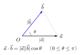

# 空间向量的数量积

> **一例速记**：  
> $\vec{a}\cdot\vec{b}=|\vec{a}||\vec{b}|\cos\theta$，夹角 $\theta\in[0,\pi]$。  
> **坐标公式**（比平面多一项 $z$）：$\vec{a}\cdot\vec{b}=x_1x_2+y_1y_2+z_1z_2$。  
> **垂直**：$\vec{a}\perp\vec{b}\Leftrightarrow x_1x_2+y_1y_2+z_1z_2=0$。  
> **模长**：$|\vec{a}|=\sqrt{x^2+y^2+z^2}$。  
> **夹角**：$\cos\theta=\dfrac{x_1x_2+y_1y_2+z_1z_2}{|\vec{a}||\vec{b}|}$。

---

## 一、从平面到空间：数量积的自然推广

平面向量中，数量积 $\vec{a}\cdot\vec{b}=|\vec{a}||\vec{b}|\cos\theta$ 用于计算投影和夹角。空间中，两个向量同样可以确定一个夹角，因此数量积的定义完全相同，只需把坐标从 $(x,y)$ 扩展到 $(x,y,z)$。

---

## 二、数量积的定义

### 定义

设空间向量 $\vec{a}$ 与 $\vec{b}$ 的夹角为 $\theta$（$0 \leq \theta \leq \pi$），则它们的**数量积**（点积、内积）定义为：

$$\vec{a}\cdot\vec{b} = |\vec{a}||\vec{b}|\cos\theta$$

**结果是实数**（数量），不是向量。

### 夹角的约定

两个空间向量的夹角 $\theta$ 规定在 $[0, \pi]$ 之间。几何上，将两向量平移到共同起点后，取两向量之间的较小夹角（不超过 $\pi$）。

特殊情况：
- $\theta = 0$：两向量**同向**，$\cos 0 = 1$，$\vec{a}\cdot\vec{b} = |\vec{a}||\vec{b}|$
- $\theta = \dfrac{\pi}{2}$：两向量**垂直**，$\cos\dfrac{\pi}{2} = 0$，$\vec{a}\cdot\vec{b} = 0$
- $\theta = \pi$：两向量**反向**，$\cos\pi = -1$，$\vec{a}\cdot\vec{b} = -|\vec{a}||\vec{b}|$

---

## 三、数量积的坐标公式

### 推导

设 $\vec{e}_1, \vec{e}_2, \vec{e}_3$ 为空间直角坐标系的三个单位向量（即 $\vec{i}, \vec{j}, \vec{k}$），满足：

$$\vec{i}\cdot\vec{i} = \vec{j}\cdot\vec{j} = \vec{k}\cdot\vec{k} = 1$$

$$\vec{i}\cdot\vec{j} = \vec{j}\cdot\vec{k} = \vec{k}\cdot\vec{i} = 0$$

（互相垂直的单位向量点积为 $0$，自身点积为 $1$）

设 $\vec{a} = (x_1, y_1, z_1) = x_1\vec{i}+y_1\vec{j}+z_1\vec{k}$，$\vec{b} = (x_2, y_2, z_2) = x_2\vec{i}+y_2\vec{j}+z_2\vec{k}$，展开点积：

$$\vec{a}\cdot\vec{b} = (x_1\vec{i}+y_1\vec{j}+z_1\vec{k})\cdot(x_2\vec{i}+y_2\vec{j}+z_2\vec{k})$$

由分配律展开 $9$ 项，利用上述正交关系，只剩下三项：

$$\boxed{\vec{a}\cdot\vec{b} = x_1x_2 + y_1y_2 + z_1z_2}$$

**对比平面情形**：平面向量 $\vec{a}\cdot\vec{b} = x_1x_2 + y_1y_2$，空间多了 $z_1z_2$ 一项。

### 常用计算公式汇总

| 量 | 公式 |
|---|---|
| 数量积 | $\vec{a}\cdot\vec{b} = x_1x_2+y_1y_2+z_1z_2$ |
| 模长 | $|\vec{a}| = \sqrt{x_1^2+y_1^2+z_1^2}$ |
| 夹角余弦 | $\cos\theta = \dfrac{x_1x_2+y_1y_2+z_1z_2}{\sqrt{x_1^2+y_1^2+z_1^2}\cdot\sqrt{x_2^2+y_2^2+z_2^2}}$ |
| 垂直条件 | $\vec{a}\perp\vec{b} \Leftrightarrow x_1x_2+y_1y_2+z_1z_2=0$ |

---

## 四、模长公式

由数量积的定义，当 $\vec{a}=\vec{b}$ 时，$\theta=0$，$\cos 0=1$，故：

$$\vec{a}\cdot\vec{a} = |\vec{a}|^2$$

用坐标计算：

$$|\vec{a}|^2 = x_1^2+y_1^2+z_1^2$$

$$\therefore \quad |\vec{a}| = \sqrt{x^2+y^2+z^2}$$

**几何意义**：这正是空间中点 $(x,y,z)$ 到原点的**欧氏距离**公式，来源于三维勾股定理（两次应用平面勾股定理）。

**推论**——两点间距离公式：若 $A=(x_1,y_1,z_1)$，$B=(x_2,y_2,z_2)$，则：

$$|AB| = |\vec{AB}| = \sqrt{(x_2-x_1)^2+(y_2-y_1)^2+(z_2-z_1)^2}$$

---

## 五、垂直判定

### 充要条件

$$\vec{a}\perp\vec{b} \Leftrightarrow \vec{a}\cdot\vec{b}=0 \Leftrightarrow x_1x_2+y_1y_2+z_1z_2=0$$

**证明**：$\vec{a}\cdot\vec{b}=|\vec{a}||\vec{b}|\cos\theta=0$。当 $\vec{a},\vec{b}$ 均非零时，$\cos\theta=0 \Leftrightarrow \theta=\dfrac{\pi}{2} \Leftrightarrow \vec{a}\perp\vec{b}$。

**注意**：零向量 $\vec{0}$ 与任何向量的数量积为 $0$，但零向量没有方向，不能说与任何向量垂直；所以垂直判定要求两向量均非零。

### 应用

若已知平面的法向量 $\vec{n}$ 和平面内向量 $\vec{v}$，则 $\vec{n}\perp\vec{v}$ 要求：

$$\vec{n}\cdot\vec{v} = 0$$

这是立体几何中求法向量、证明垂直关系的核心工具。

---

## 六、夹角公式

### 两向量夹角

由数量积定义：

$$\cos\theta = \frac{\vec{a}\cdot\vec{b}}{|\vec{a}||\vec{b}|} = \frac{x_1x_2+y_1y_2+z_1z_2}{\sqrt{x_1^2+y_1^2+z_1^2}\cdot\sqrt{x_2^2+y_2^2+z_2^2}}$$

其中 $\theta\in[0,\pi]$，从 $\cos\theta$ 的值可唯一确定 $\theta$。

### 直线与直线的夹角

两直线 $l_1, l_2$ 的**方向向量**分别为 $\vec{v}_1, \vec{v}_2$，则两直线所成角 $\alpha\in\left[0,\dfrac{\pi}{2}\right]$：

$$\cos\alpha = \frac{|\vec{v}_1\cdot\vec{v}_2|}{|\vec{v}_1||\vec{v}_2|}$$

（取绝对值是因为直线夹角不区分向量方向，取锐角或直角）

### 直线与平面的夹角

直线方向向量 $\vec{v}$，平面法向量 $\vec{n}$，两者夹角为 $\varphi$，则直线与平面所成角 $\alpha = \dfrac{\pi}{2} - \varphi$：

$$\sin\alpha = \frac{|\vec{v}\cdot\vec{n}|}{|\vec{v}||\vec{n}|}$$

### 两平面夹角（二面角）

两平面的法向量分别为 $\vec{n}_1, \vec{n}_2$，两平面所成二面角 $\beta$：

$$\cos\beta = \frac{|\vec{n}_1\cdot\vec{n}_2|}{|\vec{n}_1||\vec{n}_2|}$$

（同样取绝对值，因为法向量有两个方向，取锐二面角或直二面角）

---

## 七、投影

### 定义

向量 $\vec{b}$ 在 $\vec{a}$ 方向上的**投影**定义为实数：

$$\text{proj}_{\vec{a}}\vec{b} = |\vec{b}|\cos\theta = \frac{\vec{a}\cdot\vec{b}}{|\vec{a}|}$$

其中 $\theta$ 是 $\vec{a}$ 与 $\vec{b}$ 的夹角。

**符号**：投影可正可负——$\theta < \dfrac{\pi}{2}$ 时为正，$\theta > \dfrac{\pi}{2}$ 时为负，$\theta = \dfrac{\pi}{2}$ 时为 $0$。

### 向量投影

$\vec{b}$ 在 $\vec{a}$ 方向上的**投影向量**为：

$$\text{proj}_{\vec{a}}^{\text{vec}}\vec{b} = \frac{\vec{a}\cdot\vec{b}}{|\vec{a}|^2}\vec{a} = \frac{\vec{a}\cdot\vec{b}}{\vec{a}\cdot\vec{a}}\vec{a}$$

这在求点到直线的距离、分解向量等问题中常用。

---

## 八、数量积的运算性质

### 基本性质

$$\vec{a}\cdot\vec{b} = \vec{b}\cdot\vec{a} \quad\text{（交换律）}$$

$$\vec{a}\cdot(\vec{b}+\vec{c}) = \vec{a}\cdot\vec{b} + \vec{a}\cdot\vec{c} \quad\text{（分配律）}$$

$$(\lambda\vec{a})\cdot\vec{b} = \lambda(\vec{a}\cdot\vec{b}) \quad\text{（数乘结合律）}$$

$$\vec{a}\cdot\vec{a} = |\vec{a}|^2 \geq 0，\text{且 } \vec{a}\cdot\vec{a}=0\Leftrightarrow\vec{a}=\vec{0}$$

### 柯西-施瓦茨不等式

由 $|\cos\theta|\leq 1$，得：

$$|\vec{a}\cdot\vec{b}| \leq |\vec{a}||\vec{b}|$$

等号成立当且仅当 $\vec{a} \parallel \vec{b}$（方向相同或相反）。

**注意**：数量积**没有结合律**，即 $(\vec{a}\cdot\vec{b})\cdot\vec{c}$ 无意义（因为 $\vec{a}\cdot\vec{b}$ 是数量，不能再对向量 $\vec{c}$ 取点积）。同理，**不满足消去律**：$\vec{a}\cdot\vec{b}=\vec{a}\cdot\vec{c}$ 且 $\vec{a}\neq\vec{0}$，不能推出 $\vec{b}=\vec{c}$。

---

## 九、典型应用例题

### 例 1：求空间两向量的夹角

**题目**：已知 $\vec{a}=(1,2,-2)$，$\vec{b}=(3,-4,0)$，求 $\vec{a}$ 与 $\vec{b}$ 的夹角 $\theta$。

**【思路】** 直接用坐标公式求 $\cos\theta$，再反求 $\theta$。

**解**：

$$\vec{a}\cdot\vec{b} = 1\times 3 + 2\times(-4) + (-2)\times 0 = 3 - 8 + 0 = -5$$

$$|\vec{a}| = \sqrt{1^2+2^2+(-2)^2} = \sqrt{1+4+4} = 3$$

$$|\vec{b}| = \sqrt{3^2+(-4)^2+0^2} = \sqrt{9+16} = 5$$

$$\cos\theta = \frac{-5}{3\times 5} = -\frac{1}{3}$$

$$\theta = \arccos\!\left(-\frac{1}{3}\right) \approx 109.5^\circ$$

**答**：$\cos\theta = -\dfrac{1}{3}$，$\theta = \arccos\!\left(-\dfrac{1}{3}\right)$。

---

### 例 2：判断向量垂直并求参数

**题目**：已知 $\vec{a}=(2,-1,k)$，$\vec{b}=(1,3,1)$，若 $\vec{a}\perp\vec{b}$，求 $k$。

**【思路】** 垂直条件：$\vec{a}\cdot\vec{b}=0$，代入坐标求 $k$。

**解**：

$$\vec{a}\cdot\vec{b} = 2\times 1 + (-1)\times 3 + k\times 1 = 2 - 3 + k = k - 1$$

令 $\vec{a}\cdot\vec{b}=0$：

$$k - 1 = 0 \implies k = 1$$

**验证**：$\vec{a}=(2,-1,1)$，$\vec{b}=(1,3,1)$，$\vec{a}\cdot\vec{b}=2-3+1=0$。正确。

**答**：$k=1$。

---

### 例 3：求投影与距离

**题目**：已知空间中 $A(1,2,0)$，$B(3,4,2)$，$C(2,1,1)$，求 $\vec{CB}$ 在 $\vec{CA}$ 方向上的投影。

**【思路】** 先求向量坐标，再用投影公式 $\dfrac{\vec{CA}\cdot\vec{CB}}{|\vec{CA}|}$。

**解**：

$$\vec{CA} = A - C = (1-2, 2-1, 0-1) = (-1, 1, -1)$$

$$\vec{CB} = B - C = (3-2, 4-1, 2-1) = (1, 3, 1)$$

$$\vec{CA}\cdot\vec{CB} = (-1)\times 1 + 1\times 3 + (-1)\times 1 = -1+3-1 = 1$$

$$|\vec{CA}| = \sqrt{(-1)^2+1^2+(-1)^2} = \sqrt{3}$$

$$\text{投影} = \frac{\vec{CA}\cdot\vec{CB}}{|\vec{CA}|} = \frac{1}{\sqrt{3}} = \frac{\sqrt{3}}{3}$$

**答**：$\vec{CB}$ 在 $\vec{CA}$ 方向上的投影为 $\dfrac{\sqrt{3}}{3}$。

---

## 十、易错点汇总

**易错 1：数量积结果是数，不是向量**

$\vec{a}\cdot\vec{b}$ 是一个**实数**，不能再对它做向量运算（如再取点积）。写 $(\vec{a}\cdot\vec{b})\cdot\vec{c}$ 是错误的，应写 $(\vec{a}\cdot\vec{b})\vec{c}$（数乘）。

**易错 2：夹角公式忘记绝对值（直线/平面夹角时）**

两向量夹角 $\theta\in[0,\pi]$，$\cos\theta$ 可负；但两直线所成角 $\in[0,\pi/2]$，需取绝对值。混淆这两点会导致夹角超过 $90°$ 的错误。

**易错 3：模长公式里开根号前忘记平方**

$|\vec{a}|=\sqrt{x^2+y^2+z^2}$，是 $x^2+y^2+z^2$ 的平方根。常见错误是写成 $|x|+|y|+|z|$（这是"曼哈顿距离"，不是欧氏距离）。

**易错 4：垂直条件不检验零向量**

$\vec{a}\cdot\vec{b}=0$ 能推出 $\vec{a}\perp\vec{b}$ 只在两者均非零时成立。若某向量可能为零向量，需先排除再用垂直判定。

**易错 5：数量积的"消去律"错误使用**

由 $\vec{a}\cdot\vec{b}=\vec{a}\cdot\vec{c}$（$\vec{a}\neq\vec{0}$）不能推出 $\vec{b}=\vec{c}$。反例：$\vec{a}=(1,0,0)$，$\vec{b}=(1,1,0)$，$\vec{c}=(1,0,1)$，$\vec{a}\cdot\vec{b}=\vec{a}\cdot\vec{c}=1$，但 $\vec{b}\neq\vec{c}$。

---

## 十一、思路自测题

**自测 1**　已知 $\vec{a}=(1,-1,2)$，$\vec{b}=(2,1,1)$，求 $\vec{a}\cdot\vec{b}$、$|\vec{a}|$、$|\vec{b}|$ 及夹角 $\theta$。

> 提示：$\vec{a}\cdot\vec{b}=1\times2+(-1)\times1+2\times1=2-1+2=3$。$|\vec{a}|=\sqrt{1+1+4}=\sqrt{6}$。$|\vec{b}|=\sqrt{4+1+1}=\sqrt{6}$。$\cos\theta=\dfrac{3}{\sqrt{6}\cdot\sqrt{6}}=\dfrac{3}{6}=\dfrac{1}{2}$，故 $\theta=60°$。

**自测 2**　已知 $\vec{a}=(m, 2, 1)$ 与 $\vec{b}=(2, m, -4)$ 垂直，求 $m$。

> 提示：$\vec{a}\cdot\vec{b}=2m+2m-4=4m-4=0$，故 $m=1$。

**自测 3**　空间中两点 $P(1,0,2)$ 和 $Q(4,-3,5)$，求 $|PQ|$。

> 提示：$\vec{PQ}=(3,-3,3)$，$|PQ|=\sqrt{9+9+9}=\sqrt{27}=3\sqrt{3}$。

**自测 4**　已知 $|\vec{a}|=2$，$|\vec{b}|=\sqrt{3}$，$\vec{a}$ 与 $\vec{b}$ 的夹角为 $\dfrac{\pi}{6}$，求 $\vec{a}\cdot\vec{b}$ 及 $\vec{b}$ 在 $\vec{a}$ 方向上的投影。

> 提示：$\vec{a}\cdot\vec{b}=2\cdot\sqrt{3}\cdot\cos\dfrac{\pi}{6}=2\sqrt{3}\cdot\dfrac{\sqrt{3}}{2}=3$。$\vec{b}$ 在 $\vec{a}$ 上的投影 $=\dfrac{\vec{a}\cdot\vec{b}}{|\vec{a}|}=\dfrac{3}{2}$。

---

**回头看"一例速记"**：

> $\vec{a}\cdot\vec{b}=|\vec{a}||\vec{b}|\cos\theta=x_1x_2+y_1y_2+z_1z_2$（结果是数）。  
> 模长：$\sqrt{x^2+y^2+z^2}$；垂直：点积为 $0$；夹角：$\cos\theta=\dfrac{\text{点积}}{|\vec{a}||\vec{b}|}$。  
> 投影 $= \dfrac{\vec{a}\cdot\vec{b}}{|\vec{a}|}$；点积无结合律，无消去律。

能不看提示独立完成自测 1 和自测 4 的完整计算——本章，你拿下了。
