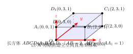
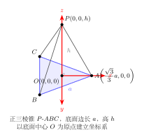

# 空间基底与坐标系建立

> **一例速记**：  
> **空间向量基本定理**：若 $\vec{e}_1, \vec{e}_2, \vec{e}_3$ **不共面**，则空间内**任意**向量 $\vec{p}$ 有**唯一**实数组 $(x,y,z)$ 使  
> $$\vec{p} = x\vec{e}_1 + y\vec{e}_2 + z\vec{e}_3$$  
> **正交基底（空间直角坐标系）**：3 条相互垂直、共原点的单位轴 $\vec{i}, \vec{j}, \vec{k}$ → 任意点 $P$ 唯一对应坐标 $(x, y, z)$  
> **建系 4 步**：① 找正交三边 ② 确定原点与轴正方向 ③ 求关键点坐标 ④ 代入公式计算

---

## 一、引入：在长方体里建立坐标系

> **题目**：长方体 $ABCD$-$A_1B_1C_1D_1$，$AB = 2$，$AD = 3$，$AA_1 = 1$。  
> 以 $A$ 为原点建立空间直角坐标系，写出全部 8 个顶点的坐标。

拿到这道题，别急着"默默算"——先把建系过程说清楚，再顺着坐标轴把 8 个点写出来。

---

## 二、思维路径还原

> "看到长方体——**三条棱两两垂直**，天然就是正交坐标系的骨架。
>
> **第一步**：找正交三边。$AA_1 \perp$ 底面，$AB \perp AD$，$AB \perp AA_1$，$AD \perp AA_1$——三边恰好两两垂直。选 $A$ 做原点最方便，因为三条棱都从 $A$ 出发。
>
> **第二步**：定轴正方向。让 $AB$ 方向为 $x$ 轴正方向（长度 $2$），$AD$ 方向为 $y$ 轴正方向（长度 $3$），$AA_1$ 方向为 $z$ 轴正方向（长度 $1$）。
>
> **第三步**：每个单位方向的"一格"就是轴的单位长。坐标值 $=$ 沿对应轴走了多少格：
>
> - $A = (0, 0, 0)$：原点，什么都不走。
> - $B$ 在 $A$ 的 $x$ 方向走 $AB = 2$，所以 $B = (2, 0, 0)$。
> - $D$ 在 $A$ 的 $y$ 方向走 $AD = 3$，所以 $D = (0, 3, 0)$。
> - $A_1$ 在 $A$ 的 $z$ 方向走 $AA_1 = 1$，所以 $A_1 = (0, 0, 1)$。
>
> 上面四个顶点给了基准，其余四个只需**叠加**方向：
>
> - $C$ 既沿 $x$ 走 $2$ 又沿 $y$ 走 $3$：$C = (2, 3, 0)$。
> - $B_1 = B + (AA_1 \text{ 方向走 } 1) = (2, 0, 0) + (0, 0, 1) = (2, 0, 1)$。
> - $D_1 = D + (0, 0, 1) = (0, 3, 1)$。
> - $C_1 = C + (0, 0, 1) = (2, 3, 1)$。
>
> **汇总**：$A(0,0,0)$、$B(2,0,0)$、$C(2,3,0)$、$D(0,3,0)$、$A_1(0,0,1)$、$B_1(2,0,1)$、$C_1(2,3,1)$、$D_1(0,3,1)$。
>
> **验证直觉**：同一底面的四顶点 $z = 0$；顶面四顶点 $z = 1$；前两列 $y = 0$ 或 $y = 3$，左右 $x = 0$ 或 $x = 2$——符合预期，无遗漏。
>
> **关键感悟**：建系成功后，3D 几何变成代数：求距离用 $\sqrt{(\Delta x)^2+(\Delta y)^2+(\Delta z)^2}$，求向量用"终点减起点"，求法向量列方程——繁琐的几何推导变成了干净的计算。"

把这段独白读两遍，感受"建系 → 写坐标 → 开始计算"的完整节奏。

（见配图 `geo-p9-03-1`：长方体建系，标注 $x, y, z$ 轴与 8 个顶点坐标）

---

## 三、空间向量基本定理与正交基底

### 3.1 空间向量基本定理

**定理**：若 $\vec{e}_1, \vec{e}_2, \vec{e}_3$ 是**不共面**的三个向量，则空间内任意向量 $\vec{p}$ 均可由它们**唯一**表示：

$$\vec{p} = x\vec{e}_1 + y\vec{e}_2 + z\vec{e}_3$$

$\vec{e}_1, \vec{e}_2, \vec{e}_3$ 称为空间的一组**基底**（basis），系数 $(x, y, z)$ 称为 $\vec{p}$ 在该基底下的**坐标**。

**三个关键词**：

| 关键词 | 含义 |
|--------|------|
| **不共面** | 三个基向量不能都躺在同一个平面里，否则张不开整个空间 |
| **任意** | 空间内每个向量都可以分解，没有例外 |
| **唯一** | 系数 $(x, y, z)$ 只有一组，分解方式唯一 |

**对比平面情形**：平面向量基本定理要求 2 个不共线向量；空间版要求 3 个不共面向量——从"张开平面"升级为"张开空间"。

### 3.2 为什么要"不共面"？

若 $\vec{e}_1, \vec{e}_2, \vec{e}_3$ 共面（如 $\vec{e}_3 = \vec{e}_1 + \vec{e}_2$），则

$$x\vec{e}_1 + y\vec{e}_2 + z\vec{e}_3 = x\vec{e}_1 + y\vec{e}_2 + z(\vec{e}_1+\vec{e}_2) = (x+z)\vec{e}_1 + (y+z)\vec{e}_2$$

结果永远在 $\vec{e}_1, \vec{e}_2$ 所在平面内，无法表示离开该平面的方向——更无法保证唯一性（$x$ 与 $z$ 可互相抵消，系数不唯一）。

### 3.3 正交基底：最实用的选择

**定义**：若基底满足：
1. $\vec{e}_1 \perp \vec{e}_2$，$\vec{e}_2 \perp \vec{e}_3$，$\vec{e}_1 \perp \vec{e}_3$（三两互相垂直）
2. $|\vec{e}_1| = |\vec{e}_2| = |\vec{e}_3| = 1$（均为单位向量）

则称为**正交（单位）基底**，记为 $\vec{i}, \vec{j}, \vec{k}$。

$$\vec{i} = (1,0,0),\quad \vec{j} = (0,1,0),\quad \vec{k} = (0,0,1)$$

任意向量 $\vec{p} = x\vec{i} + y\vec{j} + z\vec{k}$ 简记为 $\vec{p} = (x, y, z)$。

**正交基 vs 一般基对比**：

| 比较项 | 正交基 | 一般基（斜基） |
|--------|--------|---------------|
| 基向量关系 | 两两垂直、模为 1 | 不共面即可，无其他限制 |
| 坐标计算 | 分量各自独立，运算简洁 | 坐标运算涉及度量矩阵，较复杂 |
| 高考场景 | 长方体、正方体、正三棱锥等 | 不规则立体（高考少见） |
| 使用时机 | 有互相垂直的三条棱/线段时 | 找不到正交三方向时 |

**结论**：高中阶段几乎总用正交基，建系前先找"两两垂直的三条线段"。

---

## 四、建系 4 步法（方法抽象）

### 4.1 通用流程

**第一步：找正交三边**  
观察立体图形，找出两两垂直的三条线段（或方向）。长方体/正方体天然具备；正三棱锥取底面高（中线）与顶高；一般情形需先找出直角关系。

**第二步：确定原点与轴方向**  
选择某个顶点（或特殊点，如中心、重心）为原点 $O$，让三条正交方向分别对应 $x, y, z$ 轴正方向。**技巧**：选轴时让最多的顶点落在坐标轴或坐标平面上，后续计算最简。

**第三步：写关键点坐标**  
沿每条轴量对应长度，叠加即得坐标。公式：
$$P = (|OP_x|, |OP_y|, |OP_z|)$$
其中 $|OP_x|$ 是 $P$ 在 $x$ 轴方向距原点的投影长度（有正负之分）。

**第四步：代公式计算**  
建系完成后，用以下工具：

| 需求 | 公式 |
|------|------|
| 两点距离 | $\vert AB\vert = \sqrt{(\Delta x)^2+(\Delta y)^2+(\Delta z)^2}$ |
| 向量坐标 | $\vec{AB} = (x_B-x_A,\;y_B-y_A,\;z_B-z_A)$ |
| 点积（夹角/垂直） | $\vec{a}\cdot\vec{b} = x_1x_2+y_1y_2+z_1z_2$ |
| 法向量 | 联立 $\vec{n}\cdot\vec{a}=0,\;\vec{n}\cdot\vec{b}=0$，令一分量为 1 解出 |

### 4.2 典型立体的建系策略

**长方体/正方体**：取一顶点为原点，三条棱为坐标轴，最自然。

**正三棱锥 $P$-$ABC$（底面边长 $a$，高 $h$）**：  
- 取底面中心 $O$ 为原点（中心到三顶点等距）  
- $x$ 轴沿 $OA$ 方向，$y$ 轴在底面内垂直 $OA$，$z$ 轴垂直底面向上  
- 底面外接圆半径 $R = \dfrac{a}{\sqrt{3}} = \dfrac{\sqrt{3}}{3}a$  
- 三顶点坐标：$A\!\left(\dfrac{\sqrt{3}}{3}a,0,0\right)$，$B\!\left(-\dfrac{\sqrt{3}}{6}a,-\dfrac{1}{2}a,0\right)$，$C\!\left(-\dfrac{\sqrt{3}}{6}a,\dfrac{1}{2}a,0\right)$，顶点 $P(0,0,h)$

（见配图 `geo-p9-03-2`：正三棱锥建系，取底面中心为原点）

**正四棱锥 $P$-$ABCD$（底面边长 $a$，高 $h$）**：  
- 取底面中心 $O$ 为原点  
- $x$ 轴沿 $OA$ 方向（等价于沿底面对角线之一）；$y$ 轴垂直 $x$ 在底面内；$z$ 轴垂直底面  
- 底面顶点：$A\!\left(\dfrac{a}{2},\dfrac{a}{2},0\right)$，$B\!\left(-\dfrac{a}{2},\dfrac{a}{2},0\right)$，$C\!\left(-\dfrac{a}{2},-\dfrac{a}{2},0\right)$，$D\!\left(\dfrac{a}{2},-\dfrac{a}{2},0\right)$，顶点 $P(0,0,h)$

**非正交建系（一般基）**：当立体没有明显的直角结构时，可选 3 个不共面的棱方向作基底，但坐标运算会涉及基向量内积，高中阶段通常通过辅助线将其转化为正交情形再处理。

### 4.3 法向量的求法

设平面 $\alpha$ 内有两个**不共线**向量 $\vec{a} = (a_1, a_2, a_3)$，$\vec{b} = (b_1, b_2, b_3)$。  
法向量 $\vec{n} = (x, y, z)$ 满足：

$$\begin{cases} \vec{n}\cdot\vec{a} = a_1 x + a_2 y + a_3 z = 0 \\ \vec{n}\cdot\vec{b} = b_1 x + b_2 y + b_3 z = 0 \end{cases}$$

两个方程三个未知数，令 $z = 1$（或赋任一分量值），解出 $x, y$，即得法向量。

**注意**：法向量不唯一（任意非零倍数均可），取最简整数组合即可。

---

## 五、思考路标（条件反射训练）

遇到以下场景，立刻触发对应策略：

1. **看到"空间直角坐标系"或"建系"** → 想建系 4 步：找正交三边 → 选原点 → 写坐标 → 代公式。

2. **看到长方体/正方体** → 以一顶点为原点，三棱为坐标轴，直接读 8 个顶点坐标（$x, y, z$ 分量各取 $0$ 或对应棱长）。

3. **看到正三棱锥或正四棱锥** → 取底面中心为原点（等距对称优先），$z$ 轴沿高方向。

4. **看到"任意向量 $\vec{AB}$"** → 立即写 $(x_B - x_A,\; y_B - y_A,\; z_B - z_A)$，终点减起点，不要混淆方向。

5. **看到"模长"或"两点距离"** → $|\vec{a}| = \sqrt{x^2+y^2+z^2}$，$|AB|= \sqrt{(\Delta x)^2+(\Delta y)^2+(\Delta z)^2}$。

6. **看到"法向量"** → 在面内取两不共线向量，列 2 个方程（各自点积 = 0），令一分量 = 1 解方程组。

7. **看到"线线/线面/面面垂直"** → 先建系求法向量/方向向量，再用点积 = 0 或平行条件代入检验。

8. **建系后坐标不对** → 检查：① 原点选对了吗？② 轴方向正确吗（右手系？）③ 叠加方向时有没有漏掉某条棱？

9. **看到"底面中心 $O'$"** → $O'$ 坐标 = 各底面顶点坐标的平均，不要硬背，用定义推导。

10. **整个题算出来发现数太乱** → 回查建系是否最优，换一个原点位置或调换轴方向往往大幅简化。

---

## 六、应用例题

### 例 1：长方体/正方体建系

**题目**：正方体 $ABCD$-$A_1B_1C_1D_1$，棱长为 $2$。以 $A$ 为原点，$AB, AD, AA_1$ 方向依次为 $x, y, z$ 轴建立坐标系。  
(1) 写出全部 8 个顶点坐标；  
(2) 求体对角线 $\vec{AG_1}$（$G_1 = C_1$）的长度；  
(3) 求 $\vec{AB}$ 与 $\vec{AC_1}$ 的夹角。

**【解答】**

**(1) 建系 → 写坐标**：

棱长 $= 2$，所以各轴方向走满时坐标分量为 $2$。

| 顶点 | 坐标 | 顶点 | 坐标 |
|------|------|------|------|
| $A$ | $(0,0,0)$ | $A_1$ | $(0,0,2)$ |
| $B$ | $(2,0,0)$ | $B_1$ | $(2,0,2)$ |
| $C$ | $(2,2,0)$ | $C_1$ | $(2,2,2)$ |
| $D$ | $(0,2,0)$ | $D_1$ | $(0,2,2)$ |

**(2) 体对角线 $AC_1$**：

$$\vec{AC_1} = (2-0,\;2-0,\;2-0) = (2,2,2)$$

$$|AC_1| = \sqrt{4+4+4} = 2\sqrt{3}$$

**(3) $\vec{AB}$ 与 $\vec{AC_1}$ 的夹角**：

$$\vec{AB} = (2,0,0),\quad \vec{AC_1} = (2,2,2)$$

$$\cos\theta = \dfrac{\vec{AB}\cdot\vec{AC_1}}{|\vec{AB}||\vec{AC_1}|} = \dfrac{2\times2+0+0}{2\times2\sqrt{3}} = \dfrac{4}{4\sqrt{3}} = \dfrac{1}{\sqrt{3}} = \dfrac{\sqrt{3}}{3}$$

$$\theta = \arccos\dfrac{\sqrt{3}}{3} \approx 54.7°$$

$$\boxed{|AC_1| = 2\sqrt{3},\quad \theta = \arccos\dfrac{\sqrt{3}}{3}}$$

> 建系后一切归结为代数计算，不再需要用几何方法画辅助线——这就是向量法建系的力量。

---

### 例 2：正三棱锥建系

**题目**：正三棱锥 $P$-$ABC$，底面边长 $a = 2$，高 $h = \sqrt{6}$。取底面中心 $O'$ 为原点建立坐标系（$x$ 轴沿 $O'A$ 方向，$z$ 轴垂直底面向上）。  
(1) 写出各顶点坐标；  
(2) 求 $|PA|$；  
(3) 求底面法向量。

**【解答】**

**(1) 坐标**：

底面外接圆半径 $R = \dfrac{a}{\sqrt{3}} = \dfrac{2}{\sqrt{3}} = \dfrac{2\sqrt{3}}{3}$。

$$A = \left(\dfrac{2\sqrt{3}}{3},\;0,\;0\right),\quad B = \left(-\dfrac{\sqrt{3}}{3},\;-1,\;0\right),\quad C = \left(-\dfrac{\sqrt{3}}{3},\;1,\;0\right),\quad P = (0,0,\sqrt{6})$$

**(2) $|PA|$**：

$$\vec{PA} = \left(\dfrac{2\sqrt{3}}{3}-0,\;0-0,\;0-\sqrt{6}\right) = \left(\dfrac{2\sqrt{3}}{3},\;0,\;-\sqrt{6}\right)$$

$$|PA| = \sqrt{\dfrac{4\cdot3}{9}+0+6} = \sqrt{\dfrac{4}{3}+6} = \sqrt{\dfrac{22}{3}} = \dfrac{\sqrt{66}}{3}$$

**(3) 底面法向量**：

底面在 $z=0$ 平面内，法向量直接读出（无需联立方程）：

$$\vec{n} = (0,0,1)$$

也可验证：$\vec{AB}\cdot(0,0,1) = 0$ ✓，$\vec{AC}\cdot(0,0,1) = 0$ ✓。

$$\boxed{\vec{n}_{\text{底面}} = (0,0,1),\quad |PA| = \dfrac{\sqrt{66}}{3}}$$

> 建系时让高方向沿 $z$ 轴，底面法向量就是 $(0,0,1)$——这是正三/四棱锥建系的最大优势。

---

### 例 3：求法向量（联立方程法）

**题目**：在长方体 $ABCD$-$A_1B_1C_1D_1$（$AB=2, AD=3, AA_1=1$）中，以 $A$ 为原点建系（同引入题）。求斜截面 $\triangle B_1CD$ 所在平面的法向量。

**【解答】**

各顶点坐标（与引入题相同）：$B_1(2,0,1)$，$C(2,3,0)$，$D(0,3,0)$。

在面 $B_1CD$ 内取两不共线向量：

$$\vec{CB_1} = (2-2,\;0-3,\;1-0) = (0,-3,1)$$

$$\vec{CD} = (0-2,\;3-3,\;0-0) = (-2,0,0)$$

设法向量 $\vec{n} = (x,y,z)$，令 $z = 1$：

$$\begin{cases} \vec{n}\cdot\vec{CB_1} = 0x - 3y + z = 0 \\ \vec{n}\cdot\vec{CD} = -2x + 0y + 0z = 0 \end{cases}$$

第 2 式：$-2x = 0 \Rightarrow x = 0$。  
令 $z = 1$，代入第 1 式：$-3y + 1 = 0 \Rightarrow y = \dfrac{1}{3}$。

取 $z = 3$（消分数）：$x = 0, y = 1, z = 3$，即

$$\boxed{\vec{n} = (0,\;1,\;3)}$$

验证：$\vec{n}\cdot\vec{CB_1} = 0(0)+1(-3)+3(1) = -3+3 = 0$ ✓；$\vec{n}\cdot\vec{CD} = 0(-2)+1(0)+3(0) = 0$ ✓。

> 法向量求法固定三步：取两向量 → 列两方程 → 令一分量解方程。遇到分数就整体乘以公分母取整数。

---

## 七、易错点

**易错 1：建系时轴方向混淆**

$AB$ 方向是 $x$ 轴还是 $y$ 轴没有规定，但一旦选定就要全程一致。中途改轴会导致坐标矛盾。建系时在图上标出 $x/y/z$ 方向后，再统一写坐标。

**易错 2："终点减起点"忘记负号**

$\vec{BA} = A - B = (0,0,0)-(2,0,0) = (-2,0,0)$，不是 $(2,0,0)$。$\vec{BA}$ 与 $\vec{AB}$ 方向相反，写法向量时方向不影响垂直判定，但写平行/共线条件时方向有意义。

**易错 3：底面中心坐标算错**

底面中心 $= \dfrac{1}{4}(A+B+C+D)$（四顶点坐标各分量取平均）。正三棱锥底面中心 $= \dfrac{1}{3}(A+B+C)$（三顶点平均）。不要用面积法或几何直觉随意猜测。

**易错 4：法向量联立方程忘记"令一分量值"**

两个方程无法完全确定三个未知量，必须主动令其中一个（通常取 $z=1$ 或 $z=1$）才能解出。若令 $z=0$ 恰好使方程全是 $0$ 解（即法向量不含该分量），则换令 $x=1$ 或 $y=1$。

**易错 5：正三棱锥外接圆半径记错**

底面边长 $a$ 的正三角形，外接圆半径 $R = \dfrac{a}{\sqrt{3}} = \dfrac{\sqrt{3}}{3}a$，内切圆半径 $r = \dfrac{a}{2\sqrt{3}} = \dfrac{\sqrt{3}}{6}a$，外接圆直径是内切圆直径的 2 倍。若建系时用 $R = a/2$（混淆正方形情形），坐标会出错。

---

## 八、思路自测题

**自测 1**　正方体棱长为 $1$，以某顶点 $A$ 为原点建系（三棱为轴）。写出所有 8 个顶点坐标，并求体对角线长度。

> 💡 提示：$A(0,0,0), B(1,0,0), C(1,1,0), D(0,1,0), A_1(0,0,1), B_1(1,0,1), C_1(1,1,1), D_1(0,1,1)$；体对角线 $|AC_1| = \sqrt{3}$。

**自测 2**　长方体 $AB=1, AD=2, AA_1=3$，以 $A$ 为原点建系。求 $B_1$ 到 $D$ 的距离。

> 💡 提示：$B_1=(1,0,3)$，$D=(0,2,0)$；$|B_1D|=\sqrt{1+4+9}=\sqrt{14}$。

**自测 3**　正四棱锥底面边长 $2$，高 $\sqrt{2}$，取底面中心为原点建系。写出 5 个顶点坐标，并求顶点到底面顶点的距离。

> 💡 提示：底面顶点 $(\pm1,\pm1,0)$，顶点 $P(0,0,\sqrt{2})$；$|PA|=\sqrt{1+1+2}=2$。

**自测 4**　正三棱锥底面边长 $2$，取底面中心 $O'$ 为原点。求面 $PAB$（$P$ 为顶点，$A, B$ 为底面相邻顶点）的法向量。

> 💡 提示：建系，写 $A, B, P$ 坐标，取 $\vec{AP}, \vec{AB}$，联立 $\vec{n}\cdot\vec{AP}=0,\;\vec{n}\cdot\vec{AB}=0$，令一分量解之。

**自测 5**　长方体 $AB=3, AD=4, AA_1=2$，以 $A$ 为原点建系。对角截面 $A_1BCD_1$（即过 $A_1, B, D_1$ 的平面，此时 $C$ 也在面内，因它们四点共面）中，求该面的法向量。

> 💡 提示：$\vec{BA_1}=(-3,0,2)$，$\vec{BD}=(-3,4,0)$，联立方程组令 $z=3$，解得 $\vec{n}=(8,6,9)$（或乘适当倍数化整）。

---

**回头看一眼"一例速记"**：

> **空间向量基本定理**：$\vec{e}_1, \vec{e}_2, \vec{e}_3$ 不共面 → 任意 $\vec{p} = x\vec{e}_1+y\vec{e}_2+z\vec{e}_3$，唯一。  
> **正交基底**：$\vec{i}, \vec{j}, \vec{k}$ 两两垂直且单位长 → 坐标 $(x,y,z)$，运算按分量独立进行。  
> **建系 4 步**：① 找正交三边 ② 选原点定轴向 ③ 写关键点坐标 ④ 代公式。  
> **法向量**：取面内两不共线向量 → 联立两点积 $= 0$ 方程 → 令一分量 = 1 解出。

如果现在你能不看笔记，独立完成"正四棱锥建系 + 写 5 个顶点坐标 + 求斜面法向量"——本章，你拿下了。
