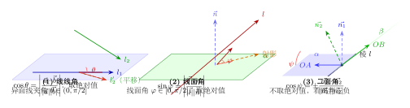
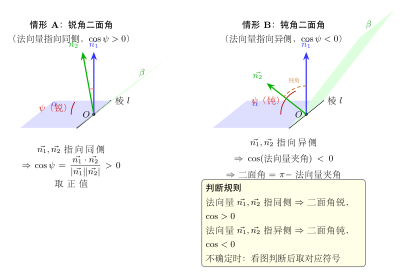

# 用向量求空间角（线线 / 线面 / 二面角）

> **一例速记**：  
> **线线角** $\cos\theta=\left|\dfrac{\vec{a}\cdot\vec{b}}{|\vec{a}||\vec{b}|}\right|$（异面线角 $\theta\in(0,\pi/2]$，**取绝对值**）  
> **线面角** $\sin\varphi=\left|\dfrac{\vec{l}\cdot\vec{n}}{|\vec{l}||\vec{n}|}\right|$（$\vec{n}$ 为面法向量，$\varphi\in[0,\pi/2]$，**取绝对值**）  
> **二面角** $\cos\psi=\pm\dfrac{\vec{n_1}\cdot\vec{n_2}}{|\vec{n_1}||\vec{n_2}|}$（**不**总取绝对值——**看图判正负**！）

---

## 一、引入：正方体二面角的法向量求法

> **题目**：正方体 $ABCD$-$A_1B_1C_1D_1$（棱长为 $1$），求平面 $A_1BD$ 与平面 $D_1BC$ 所成二面角的余弦值。

停下来思考：这道题的核心是"两个斜截面形成的二面角"。两个平面都是正方体的对角截面——不平行，不垂直，需要用法向量法。

**策略**：以 $B$ 为原点建系 → 求两平面各自的法向量 $\vec{n_1}, \vec{n_2}$ → 用点积公式算 $\cos$ → 看图判断二面角锐钝。

---

## 二、思维路径还原（解题者的内心独白）

> "正方体棱长 $1$，建系选 $B$ 为原点，三条棱 $BA, BC, BB_1$ 方向。
>
> **第一步：建立坐标系。**  
> 令 $B = (0,0,0)$，沿 $BA$ 方向为 $x$ 轴，沿 $BC$ 方向为 $y$ 轴，沿 $BB_1$ 方向为 $z$ 轴。  
> 各顶点坐标：$A(1,0,0), B(0,0,0), C(0,1,0), D(1,1,0)$，  
> $A_1(1,0,1), B_1(0,0,1), C_1(0,1,1), D_1(1,1,1)$。
>
> **第二步：求平面 $A_1BD$ 的法向量 $\vec{n_1}$。**  
> 平面内两不共线向量：$\vec{BA_1} = A_1 - B = (1,0,1)$，$\vec{BD} = D - B = (1,1,0)$。  
> 设 $\vec{n_1} = (x, y, z)$，满足 $\vec{n_1} \cdot \vec{BA_1} = 0$ 且 $\vec{n_1} \cdot \vec{BD} = 0$：  
> $$\begin{cases} x + z = 0 \\ x + y = 0 \end{cases} \Rightarrow z = -x,\; y = -x$$  
> 取 $x = 1$，得 $\vec{n_1} = (1, -1, -1)$。
>
> **第三步：求平面 $D_1BC$ 的法向量 $\vec{n_2}$。**  
> 平面内两不共线向量：$\vec{BD_1} = D_1 - B = (1,1,1)$，$\vec{BC} = C - B = (0,1,0)$。  
> 设 $\vec{n_2} = (x, y, z)$，满足 $\vec{n_2} \cdot \vec{BD_1} = 0$ 且 $\vec{n_2} \cdot \vec{BC} = 0$：  
> $$\begin{cases} x + y + z = 0 \\ y = 0 \end{cases} \Rightarrow y = 0,\; z = -x$$  
> 取 $x = 1$，得 $\vec{n_2} = (1, 0, -1)$。
>
> **第四步：计算 $\cos\psi$。**  
> $$\vec{n_1} \cdot \vec{n_2} = 1 \times 1 + (-1) \times 0 + (-1) \times (-1) = 1 + 0 + 1 = 2$$  
> $$|\vec{n_1}| = \sqrt{1 + 1 + 1} = \sqrt{3}, \quad |\vec{n_2}| = \sqrt{1 + 0 + 1} = \sqrt{2}$$  
> $$\cos\psi = \frac{2}{\sqrt{3} \cdot \sqrt{2}} = \frac{2}{\sqrt{6}} = \frac{\sqrt{6}}{3}$$
>
> **第五步：看图判正负。**  
> 两平面 $A_1BD$ 与 $D_1BC$ 交于直线 $BD$。从几何上看，$A_1$ 与 $D_1$ 分别在直线 $BD$ 两侧，两平面成锐角（二面角 $< 90°$）。所以 $\cos\psi > 0$，取 $+\dfrac{\sqrt{6}}{3}$。  
> 所求二面角的余弦值为 $\dfrac{\sqrt{6}}{3}$。"

把这段内心独白读两遍，感受"建系 → 求面内两向量 → 解法向量方程组 → 算点积 → 看图判正负"五步的必然逻辑。

---

## 三、3 类空间角的完整方法框架

（见配图 `geo-p9-05-1`：三种空间角几何意义对比）

### 3.1 总览表

| 角的类型 | 范围 | 向量公式 | 注意事项 |
|---|---|---|---|
| **线线角**（两直线夹角） | $\theta \in (0, \pi/2]$ | $\cos\theta = \left\|\dfrac{\vec{a}\cdot\vec{b}}{|\vec{a}||\vec{b}|}\right\|$ | **取绝对值**（异面线取锐角） |
| **线面角**（直线与平面） | $\varphi \in [0, \pi/2]$ | $\sin\varphi = \left\|\dfrac{\vec{l}\cdot\vec{n}}{|\vec{l}||\vec{n}|}\right\|$ | **取绝对值**；用 $\sin$ 不用 $\cos$ |
| **二面角**（两半平面） | $\psi \in [0, \pi]$ | $\cos\psi = \pm\dfrac{\vec{n_1}\cdot\vec{n_2}}{|\vec{n_1}||\vec{n_2}|}$ | **不取绝对值**；看图判符号 |

> **公式来源直觉**：
> - 线线角：两方向向量夹角，取锐角故加绝对值。
> - 线面角：直线方向与法向量夹角的**余角**（$\sin\varphi = \cos(\text{余角})$），$|\vec{l}\cdot\vec{n}|$ 是直线到法向量的"高"分量，故用 sin 公式。
> - 二面角：两平面法向量夹角，但符号取决于法向量方向选取，需看图判断。

### 3.2 法向量的求法

给定平面内两个不共线向量 $\vec{a}, \vec{b}$，法向量 $\vec{n}$ 满足：

$$\vec{n} \cdot \vec{a} = 0 \quad \text{且} \quad \vec{n} \cdot \vec{b} = 0$$

**操作步骤**：设 $\vec{n} = (x, y, z)$，列方程组（两个方程三个未知数），令某一分量为 $1$（自由变量），解出另两个。

### 3.3 建系的 4 步流程

在实际题目中，向量法求角的完整流程：

1. **找正交三边**：选图形中互相垂直的三条边（常见：长方体 / 正方体 / 正三棱锥中心向顶点方向）。
2. **设坐标原点**：常取棱长交点（如顶点 $B$）或斜截面上的特殊点。
3. **写各顶点坐标**：把所有相关顶点坐标用棱长表示出来。
4. **按公式操作**：提取向量 → 建法向量方程 → 计算点积与模 → 判符号。

---

## 四、方法变形

### 变形 1：法向量方向反向 → cos 符号相反，但二面角不变

若将 $\vec{n_1}$ 换成 $-\vec{n_1}$，则 $\cos\psi$ 变号。但实际二面角不变——这意味着：若算出 $\cos\psi < 0$ 但图示说明是锐角，则取 $-\cos\psi > 0$。**法向量方向的选取会影响 $\cos$ 的正负，但不影响最终角的大小**，关键在于结合图形判断。

### 变形 2：看图判正负的操作规则

（见配图 `geo-p9-05-2`：二面角法向量法 + 同指 vs 异指判正负）

**直观规则**：

| 法向量指向 | $\cos\psi$ 符号 | 二面角 |
|---|---|---|
| $\vec{n_1}, \vec{n_2}$ 指向棱的**同侧** | $> 0$ | 锐角 |
| $\vec{n_1}, \vec{n_2}$ 指向棱的**异侧** | $< 0$ | 钝角 |
| 两者相互垂直 | $= 0$ | 直角（$90°$） |

**操作**：算出 $|\cos\psi|$ 后，看图判断二面角是锐还是钝，再赋予对应的符号。

### 变形 3：线面角中"法向量"与"方向向量"的关系

线面角公式 $\sin\varphi = \left|\dfrac{\vec{l}\cdot\vec{n}}{|\vec{l}||\vec{n}|}\right|$ 的几何含义：$\vec{l}$ 与 $\vec{n}$ 的夹角记为 $\alpha$，则 $\varphi = 90° - \alpha$（线面角是线方向与法向量夹角的**余角**），故 $\sin\varphi = \cos\alpha = \left|\dfrac{\vec{l}\cdot\vec{n}}{|\vec{l}||\vec{n}|}\right|$。

### 变形 4：向量法 vs 综合法的选择

| 情形 | 推荐方法 |
|---|---|
| 图形含坐标 / 给出棱长 / 有长方体、正棱柱 | **向量法**（建系高效，计算规范） |
| 图形几何对称性强（如正三角形、等腰三角形） | **综合法**（作平面角，几何推导快） |
| 需要证明某角确切值（非数值）| 综合法更直观 |
| 角度繁复，需要精确计算 | 向量法避免失误 |

---

## 五、思考路标（条件反射训练）

以下 10 条应内化为自动反应：

1. **看到"线线夹角"** → 公式取 $\cos$ + **绝对值**（结果 $\leq 90°$）；若题目给的是异面直线，先平移再算，不用真的画出交点。

2. **看到"直线与平面的夹角"** → 公式取 $\sin$（$\vec{l}$ 和 $\vec{n}$ 的点积再取绝对值）；结果在 $[0°, 90°]$，永远是锐角或直角。

3. **看到"二面角"** → 不取绝对值，先看图判断是锐钝，再赋号。法向量方向可以任意，但必须在算完 $\cos$ 后与图形对照。

4. **法向量求法** → 两方程三未知数，令某分量为 $1$，解其余两个。不要贪图省事省掉方程组步骤。

5. **建系首选** → 长方体、正方体、棱柱：选一顶点，三条互相垂直的棱为坐标轴。正三棱锥：底面中心为原点，底面内两方向 + 高方向为坐标轴。

6. **线面角中 $\varphi = 0$** → 直线平行于平面（$\vec{l}\perp\vec{n}$，点积 $= 0$，$\sin\varphi = 0$）。

7. **线面角中 $\varphi = 90°$** → 直线垂直于平面（$\vec{l}\parallel\vec{n}$，$\vec{l} = \lambda\vec{n}$，此时 $|\dfrac{\vec{l}\cdot\vec{n}}{|\vec{l}||\vec{n}|}| = 1$）。

8. **算出 $\cos\psi < 0$，但图示二面角明显是锐角** → 说明法向量取反了，赋正号；若确实是钝角，则 $\cos\psi < 0$ 是对的，直接写角。

9. **正方体中的斜截面法向量** → 分量往往是 $\pm 1$ 的组合，计算简单；容易出错的是漏掉负号——方程组每一项都要认真代入。

10. **验算** → 若两面法向量夹角算出来等于 $0°$ 或 $180°$，说明两面平行，不是二面角——需要重新检查坐标或方向。

---

## 六、典型应用例题

### 例 1：正方体中的线线角（异面直线）

> **题目**：正方体 $ABCD$-$A_1B_1C_1D_1$（棱长 $1$），求体对角线 $AG$（$G = C_1$）与棱 $AB$ 所成的角。

**【思路】** 线线角取锐角，用 $\cos\theta = \left|\dfrac{\vec{AC_1}\cdot\vec{AB}}{|\vec{AC_1}||\vec{AB}|}\right|$。

**解**：

以 $A(0,0,0)$ 为原点，$AB$ 方向为 $x$ 轴，$AD$ 方向为 $y$ 轴，$AA_1$ 方向为 $z$ 轴。

坐标：$A(0,0,0)$，$B(1,0,0)$，$C_1(1,1,1)$。

$$\vec{AC_1} = (1,1,1), \quad \vec{AB} = (1,0,0)$$

$$\cos\theta = \left|\frac{(1,1,1)\cdot(1,0,0)}{|(1,1,1)| \cdot |(1,0,0)|}\right| = \left|\frac{1}{\sqrt{3} \cdot 1}\right| = \frac{1}{\sqrt{3}} = \frac{\sqrt{3}}{3}$$

$$\theta = \arccos\frac{\sqrt{3}}{3}$$

> 解题要点：$\vec{AB}$ 方向就是 $x$ 轴，与 $\vec{AC_1}$ 的点积只取 $x$ 分量 $= 1$。结果取绝对值（本题点积本来就是正的，但绝对值是规范写法）。

---

### 例 2：长方体中的线面角

> **题目**：长方体 $ABCD$-$A_1B_1C_1D_1$，$AB = 2, AD = 1, AA_1 = 3$。求直线 $AC_1$ 与底面 $ABCD$ 所成的角。

**【思路】** 底面 $ABCD$ 的法向量 $\vec{n} = (0,0,1)$（$z$ 轴方向），用线面角公式。

**解**：

以 $A$ 为原点，$AB$ 方向为 $x$ 轴，$AD$ 方向为 $y$ 轴，$AA_1$ 方向为 $z$ 轴。

坐标：$C_1 = (2, 1, 3)$，$A = (0,0,0)$。

$$\vec{AC_1} = (2, 1, 3)$$

底面法向量 $\vec{n} = (0, 0, 1)$（$z$ 轴正方向）。

$$\sin\varphi = \left|\frac{\vec{AC_1} \cdot \vec{n}}{|\vec{AC_1}||\vec{n}|}\right| = \left|\frac{(2)(0)+(1)(0)+(3)(1)}{\sqrt{4+1+9} \cdot 1}\right| = \frac{3}{\sqrt{14}} = \frac{3\sqrt{14}}{14}$$

$$\varphi = \arcsin\frac{3\sqrt{14}}{14}$$

> 解题要点：底面的法向量就是 $z$ 轴方向 $(0,0,1)$，计算最简。$\vec{AC_1}$ 与 $\vec{n}$ 的点积只取 $z$ 分量。

---

### 例 3：三棱锥中的二面角

> **题目**：三棱锥 $P$-$ABC$ 中，$PA \perp$ 底面 $ABC$，$AB \perp BC$，$PA = AB = BC = 2$。求二面角 $P$-$BC$-$A$ 的大小。

**【思路】** 建系 → 求平面 $PBC$ 与平面 $ABC$ 的法向量 → 用二面角公式 → 看图判正负。

**解**：

以 $B$ 为原点，$BA$ 方向为 $x$ 轴，$BC$ 方向为 $y$ 轴，$PA$ 方向为 $z$ 轴（即 $PA \perp$ 底面）。

坐标：$B(0,0,0)$，$A(2,0,0)$，$C(0,2,0)$，$P(2,0,2)$。

**底面 $ABC$ 的法向量** $\vec{n_1}$：底面即 $z = 0$ 平面，法向量 $\vec{n_1} = (0,0,1)$。

**平面 $PBC$ 的法向量** $\vec{n_2}$：

平面 $PBC$ 内两不共线向量：

$$\vec{BP} = P - B = (2, 0, 2), \quad \vec{BC} = C - B = (0, 2, 0)$$

设 $\vec{n_2} = (x, y, z)$：

$$\begin{cases} \vec{n_2} \cdot \vec{BP} = 2x + 2z = 0 \\ \vec{n_2} \cdot \vec{BC} = 2y = 0 \end{cases} \Rightarrow z = -x,\; y = 0$$

取 $x = 1$，得 $\vec{n_2} = (1, 0, -1)$。

**计算 $\cos\psi$**：

$$\vec{n_1} \cdot \vec{n_2} = (0)(1) + (0)(0) + (1)(-1) = -1$$

$$|\vec{n_1}| = 1, \quad |\vec{n_2}| = \sqrt{1+0+1} = \sqrt{2}$$

$$\cos\psi = \frac{-1}{1 \cdot \sqrt{2}} = -\frac{1}{\sqrt{2}} = -\frac{\sqrt{2}}{2}$$

**看图判正负**：$\vec{n_1} = (0,0,1)$ 指向底面上方，$\vec{n_2} = (1,0,-1)$ 偏向下方（$z$ 分量为 $-1$），两法向量指向平面的不同侧。因 $PA \perp$ 底面，平面 $PBC$ 与底面 $ABC$ 的二面角 $P$-$BC$-$A$ 是钝角，与 $\cos\psi < 0$ 吻合。

$$\therefore \text{二面角} \psi = \arccos\left(-\frac{\sqrt{2}}{2}\right) = 135°$$

> 解题要点：$PA \perp$ 底面意味着 $\vec{n_1} = (0,0,1)$ 就是 $z$ 轴。$\vec{n_2}$ 通过 $\vec{BP}, \vec{BC}$ 解方程组得出。最后看 $z$ 分量的符号与图形对照，确认 $\cos$ 为负，二面角为钝角 $135°$。

---

## 七、自测题

**自测 1**　正方体 $ABCD$-$A_1B_1C_1D_1$ 棱长为 $1$，求面对角线 $A_1C$ 与底面 $ABCD$ 所成的角。

> 提示：$A_1C$ 方向向量 $= C - A_1 = (1,1,-1)$（以 $A$ 为原点，$AB$ 为 $x$ 轴，$AD$ 为 $y$ 轴，$AA_1$ 为 $z$ 轴）；底面法向量 $\vec{n} = (0,0,1)$；$\sin\varphi = \left|\dfrac{-1}{\sqrt{3}}\right| = \dfrac{1}{\sqrt{3}}$；$\varphi = \arcsin\dfrac{\sqrt{3}}{3}$。

**自测 2**　长方体 $ABCD$-$A_1B_1C_1D_1$，$AB = 1, AD = 2, AA_1 = 2$。求直线 $B_1D$ 与侧面 $ABB_1A_1$ 所成的角。

> 提示：以 $A$ 为原点，$AB$ 为 $x$ 轴，$AD$ 为 $y$ 轴，$AA_1$ 为 $z$ 轴。$B_1 = (1,0,2), D = (1,2,0)$，方向向量 $\vec{B_1D} = (0,2,-2)$；侧面 $ABB_1A_1$ 即 $y = 0$ 平面，法向量 $\vec{n} = (0,1,0)$；$\sin\varphi = \left|\dfrac{2}{\sqrt{8}}\right| = \dfrac{1}{\sqrt{2}}$；$\varphi = 45°$。

**自测 3**　正三棱锥 $P$-$ABC$ 底面边长为 $2$，高 $PA' = \sqrt{2}$（$A'$ 为底面中心）。求侧面与底面所成的角（线面角）。

> 提示：侧面中线（斜高）$= \sqrt{(\sqrt{2})^2 + 1^2} = \sqrt{3}$（$1$ 是底面中心到底面边中点的距离 $= \dfrac{2}{2\sqrt{3}} \times 2 = \dfrac{\sqrt{3}}{3} \times 2$...）；用侧面与底面的二面角代替，棱取底面的边，作从底面中心到底边的垂线，得线面角 $\arctan\dfrac{\sqrt{2}}{1}$，即 $\arctan\sqrt{2}$。

**自测 4**　正方体 $ABCD$-$A_1B_1C_1D_1$ 棱长为 $2$，求二面角 $B_1$-$AC$-$D$ 的余弦值。

> 提示：以 $A$ 为原点建系。$B_1 = (2,0,2), D = (0,2,0), C = (2,2,0)$；平面 $B_1AC$ 的法向量用 $\vec{AB_1} = (2,0,2)$ 和 $\vec{AC} = (2,2,0)$ 解出；平面 $DAC$ 的法向量用 $\vec{AD} = (0,2,0)$ 和 $\vec{AC} = (2,2,0)$ 解出；再算 $\cos$ 并看图判正负。

**自测 5**　三棱锥 $P$-$ABC$ 中，$PA = PB = PC = \sqrt{3}$，底面是边长为 $2$ 的正三角形。建系并求二面角 $P$-$AB$-$C$ 的大小。

> 提示：设底面中心 $O'$ 为坐标原点，高 $PO' = 1$（由 $PA^2 = PO'^2 + O'A^2$，$O'A = \dfrac{2}{\sqrt{3}}$ 求得）；建系后设 $A, B, C, P$ 坐标；平面 $PAB$ 和平面 $CAB$ 各自法向量 → 用公式求二面角。

---

**回头看"一例速记"**：

> **线线角**：$\cos\theta=\left|\dfrac{\vec{a}\cdot\vec{b}}{|\vec{a}||\vec{b}|}\right|$ ——取绝对值，结果在 $(0°, 90°]$。  
> **线面角**：$\sin\varphi=\left|\dfrac{\vec{l}\cdot\vec{n}}{|\vec{l}||\vec{n}|}\right|$ ——取绝对值，结果在 $[0°, 90°]$。  
> **二面角**：$\cos\psi=\pm\dfrac{\vec{n_1}\cdot\vec{n_2}}{|\vec{n_1}||\vec{n_2}|}$ ——不取绝对值，看图判正负，结果在 $[0°, 180°]$。  
> 法向量求法：两方程组，令一个分量为 $1$ 解出另两个。

如果现在不看笔记能独立完成引入题（正方体两对角截面的二面角），并说清楚为什么二面角公式"不取绝对值"——本章，你拿下了。
