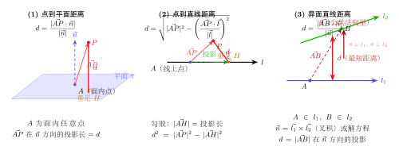

# 用向量求空间距离

> **一例速记**：  
> **点到平面距离** $d=\dfrac{|\vec{AP}\cdot\vec{n}|}{|\vec{n}|}$（$A$ 是面内任意点，$P$ 是面外的点，$\vec{n}$ 是面法向量）  
> **点到直线距离** $d=\sqrt{|\vec{AP}|^2-\left(\dfrac{\vec{AP}\cdot\vec{l}}{|\vec{l}|}\right)^2}$（$A$ 是直线上任意点，$\vec{l}$ 是方向向量；"勾股 = 模长平方 - 投影平方"）  
> **异面直线距离** $d=\dfrac{|\vec{AB}\cdot\vec{n}|}{|\vec{n}|}$（$\vec{n}$ 是公共法向量 $\perp\vec{a}, \vec{b}$；$A\in l_1, B\in l_2$）

---

## 一、引入：长方体中点到平面的距离

> **题目**：长方体 $ABCD$-$A_1B_1C_1D_1$，$AB = 3, AD = 2, AA_1 = 4$。求顶点 $B_1$ 到平面 $ACD_1$ 的距离。

停下来思考：平面 $ACD_1$ 是长方体的一个斜截面，不平行于任何坐标面。求点 $B_1$ 到这个斜面的距离，传统方法需要构造辅助平面或找投影，繁琐易错；向量法只需法向量和点积，步骤规范。

**策略**：建系 → 写各点坐标 → 求平面 $ACD_1$ 的法向量 $\vec{n}$ → 用公式 $d = \dfrac{|\vec{AB_1}\cdot\vec{n}|}{|\vec{n}|}$（以 $A$ 为面内点，$B_1$ 为面外点）。

---

## 二、思维路径还原（解题者的内心独白）

> "长方体三边正交，以 $A$ 为原点建系，$AB$ 方向 $x$ 轴，$AD$ 方向 $y$ 轴，$AA_1$ 方向 $z$ 轴。
>
> **第一步：写坐标。**  
> $A(0,0,0)$，$B(3,0,0)$，$C(3,2,0)$，$D(0,2,0)$，$A_1(0,0,4)$，$B_1(3,0,4)$，$C_1(3,2,4)$，$D_1(0,2,4)$。
>
> **第二步：求平面 $ACD_1$ 的法向量。**  
> 平面内两不共线向量：$\vec{AC} = C - A = (3,2,0)$，$\vec{AD_1} = D_1 - A = (0,2,4)$。  
> 设法向量 $\vec{n} = (x, y, z)$：  
> $$\begin{cases} \vec{n}\cdot\vec{AC} = 3x + 2y = 0 \\ \vec{n}\cdot\vec{AD_1} = 2y + 4z = 0 \end{cases}$$  
> 由第一方程：$y = -\dfrac{3x}{2}$；代入第二方程：$2 \times (-\dfrac{3x}{2}) + 4z = 0 \Rightarrow -3x + 4z = 0 \Rightarrow z = \dfrac{3x}{4}$。  
> 取 $x = 4$，得 $\vec{n} = (4, -6, 3)$。
>
> **第三步：代入距离公式。**  
> 取面内点 $A(0,0,0)$，面外点 $B_1(3,0,4)$，$\vec{AB_1} = (3,0,4)$：  
> $$\vec{AB_1} \cdot \vec{n} = (3)(4) + (0)(-6) + (4)(3) = 12 + 0 + 12 = 24$$  
> $$|\vec{n}| = \sqrt{16 + 36 + 9} = \sqrt{61}$$  
> $$d = \frac{|24|}{\sqrt{61}} = \frac{24}{\sqrt{61}} = \frac{24\sqrt{61}}{61}$$
>
> **第四步：核验。**  
> 分子 $= 24$，分母 $= \sqrt{61}$。$24$ 不能化简（$\gcd(24, 61) = 1$，$61$ 是质数）。最终 $d = \dfrac{24\sqrt{61}}{61}$。"

把这段内心独白读两遍，感受"建系 → 写坐标 → 法向量方程组 → 代入公式"四步的规范流程。

---

## 三、3 类空间距离的完整方法框架

（见配图 `geo-p9-06-1`：3 类距离对比图）

### 3.1 总览表

| 距离类型 | 公式 | 适用条件 |
|---|---|---|
| **点 $P$ 到平面 $\pi$** | $d = \dfrac{|\vec{AP}\cdot\vec{n}|}{|\vec{n}|}$ | $A$ 是 $\pi$ 内任意点；$\vec{n}$ 是 $\pi$ 的法向量 |
| **点 $P$ 到直线 $l$** | $d = \sqrt{|\vec{AP}|^2 - \left(\dfrac{\vec{AP}\cdot\vec{l}}{|\vec{l}|}\right)^2}$ | $A$ 是 $l$ 上任意点；$\vec{l}$ 是 $l$ 的方向向量 |
| **异面直线 $l_1, l_2$ 的距离** | $d = \dfrac{|\vec{AB}\cdot\vec{n}|}{|\vec{n}|}$ | $A\in l_1, B\in l_2$；$\vec{n}$ 是公共法向量（$\vec{n}\perp\vec{l_1}$ 且 $\vec{n}\perp\vec{l_2}$） |

### 3.2 公式来源的直觉

**点到平面**：距离 $=$ $\vec{AP}$ 在法向量 $\hat{n}$ 方向上的投影的长度（的绝对值）：

$$d = |\vec{AP} \cdot \hat{n}| = \frac{|\vec{AP} \cdot \vec{n}|}{|\vec{n}|}$$

几何含义：法向量方向就是"垂直于平面"的方向，$\vec{AP}$ 在这个方向的分量就是 $P$ 到平面的高度。

**点到直线**：用勾股定理分解向量 $\vec{AP}$：

$$\vec{AP} = \underbrace{\text{(沿 }\vec{l}\text{ 方向的分量)}}_{\text{投影}} + \underbrace{\text{(垂直于 }\vec{l}\text{ 方向的分量)}}_{\text{= 距离向量}}$$

$$|\vec{AP}|^2 = \left(\frac{\vec{AP}\cdot\vec{l}}{|\vec{l}|}\right)^2 + d^2 \Rightarrow d = \sqrt{|\vec{AP}|^2 - \left(\frac{\vec{AP}\cdot\vec{l}}{|\vec{l}|}\right)^2}$$

**异面直线距离**：公共法向量 $\vec{n}$ 同时垂直于两条直线，因此 $\vec{AB}$ 在 $\vec{n}$ 方向上的投影就是两线间的"最短距离"（公垂线长度）。

### 3.3 公共法向量的求法

设两异面直线方向向量为 $\vec{l_1}, \vec{l_2}$，公共法向量 $\vec{n}$ 满足：

$$\vec{n} \cdot \vec{l_1} = 0 \quad \text{且} \quad \vec{n} \cdot \vec{l_2} = 0$$

操作：与法向量求法完全相同——设 $\vec{n} = (x,y,z)$，列两方程，令某分量为 $1$，解出另两个。

> **注意**：公共法向量不唯一，但距离 $d$ 与具体选哪个 $\vec{n}$ 无关（只要满足 $\vec{n}\perp\vec{l_1}$ 且 $\vec{n}\perp\vec{l_2}$）。

---

## 四、方法变形

### 变形 1：点到平面 = 体积法

求空间点 $P$ 到平面 $\pi$（$\pi$ 含三点 $A, B, C$）的距离时，也可以用四面体体积：

$$V_{P-ABC} = \frac{1}{6}|\vec{AB}\cdot(\vec{AC}\times\vec{BC})| \quad (\text{叉积方法，高中通常不用})$$

或用"底面面积 $\times$ 高 $\div 3$"反推高。**这是另一种解题策略**，在已知四面体各棱长时有时更方便；向量法则更规范。

### 变形 2：点到直线的替代公式（利用叉积）

点 $P$ 到直线 $l$（$A$ 在 $l$ 上，方向 $\vec{l}$）的距离也可以写成：

$$d = \frac{|\vec{AP} \times \vec{l}|}{|\vec{l}|}$$

（叉积的模 = 平行四边形面积，除以底 $|\vec{l}|$ = 高 = 距离）

高中阶段若不涉及叉积，用"勾股公式"即可：$d = \sqrt{|\vec{AP}|^2 - \left(\dfrac{\vec{AP}\cdot\vec{l}}{|\vec{l}|}\right)^2}$。

### 变形 3：点到直线距离的几何验证

算出 $d$ 后可以构造验证：

1. 算出 $\vec{AP}$ 在 $\vec{l}$ 方向的投影向量 $\vec{AH} = \dfrac{\vec{AP}\cdot\vec{l}}{|\vec{l}|^2}\vec{l}$（投影向量）。
2. 求垂足坐标 $H = A + \vec{AH}$。
3. 验证 $|HP|$ 是否等于 $d$。

若一致，则计算无误；不一致则说明投影方向搞错了。

### 变形 4：异面直线距离 vs 公垂线法

传统综合法求异面直线距离需要"找公垂线"——这要求构造特殊辅助线，几何要求高。向量法的"公共法向量"思路更机械化，但需要：
- 确保 $l_1, l_2$ 确实异面（不是平行！平行线距离用点到直线公式即可）。
- 若 $\vec{l_1} \parallel \vec{l_2}$（平行），则公共法向量不唯一（退化），改用点到直线公式。

---

## 五、思考路标（条件反射训练）

以下 10 条应内化为自动反应：

1. **看到"点到平面距离"** → 立即找面内任意点 $A$ 和面法向量 $\vec{n}$，套公式 $\dfrac{|\vec{AP}\cdot\vec{n}|}{|\vec{n}|}$。不要尝试"找垂足再算距离"——那需要解方程组，麻烦得多。

2. **法向量的选取** → 面内任意一点都可以作为 $A$。通常选面上某个坐标已知的顶点，使 $\vec{AP}$ 易于计算。

3. **看到"点到直线距离"** → 用勾股公式，先算 $|\vec{AP}|$，再算投影长 $\dfrac{|\vec{AP}\cdot\vec{l}|}{|\vec{l}|}$，最后开方。步骤固定，不易出错。

4. **看到"异面直线距离"** → 先判断确实异面（若平行则转用点到直线距离）；再求公共法向量 $\vec{n}$；再取两线上各一点 $A, B$，套公式 $\dfrac{|\vec{AB}\cdot\vec{n}|}{|\vec{n}|}$。

5. **法向量方程组的解** → 两方程三未知数，令 $x = 1$（或其他分量为整数值），避免出现分数法向量（虽然分数也对，但整数更便于后续计算）。

6. **分子计算** → 点积 $\vec{AP}\cdot\vec{n}$ 是三个分量两两相乘后相加，一定要算完三项，不要漏掉 $z$ 分量。

7. **分母化简** → $|\vec{n}| = \sqrt{x^2+y^2+z^2}$，若结果是 $\sqrt{N}$ 形式，最终距离写成 $\dfrac{k\sqrt{N}}{N}$ 的有理化形式。

8. **点到平面 $= 0$** → 说明点在平面上，检查坐标是否写错。

9. **四面体体积换算** → 若题目同时涉及"体积"和"点到平面距离"，可以用 $V = \frac{1}{3} S \cdot d$，由已知体积和底面积反推 $d$，有时比法向量法更快。

10. **建系位置选择** → 对长方体/正方体，选角点为原点；对正三棱柱/正三棱锥，选底面中心作原点（或底面某顶点），高方向为 $z$ 轴。原点位置影响后续坐标写法，但不影响最终距离结果。

---

## 六、典型应用例题

### 例 1：正方体中点到斜面的距离

> **题目**：正方体 $ABCD$-$A_1B_1C_1D_1$ 棱长为 $2$，求顶点 $A_1$ 到平面 $BDC_1$ 的距离。

**【思路】** 以 $A$ 为原点建系，求平面 $BDC_1$ 的法向量，代入点到平面距离公式。

**解**：

以 $A(0,0,0)$ 为原点，$AB$ 为 $x$ 轴，$AD$ 为 $y$ 轴，$AA_1$ 为 $z$ 轴，棱长为 $2$。

坐标：$B(2,0,0)$，$C(2,2,0)$，$D(0,2,0)$，$A_1(0,0,2)$，$C_1(2,2,2)$，$B_1(2,0,2)$，$D_1(0,2,2)$。

平面 $BDC_1$ 内两不共线向量：

$$\vec{BD} = D - B = (-2,2,0), \quad \vec{BC_1} = C_1 - B = (0,2,2)$$

设 $\vec{n} = (x,y,z)$，解：

$$\begin{cases} -2x + 2y = 0 \\ 2y + 2z = 0 \end{cases} \Rightarrow x = y, \; z = -y$$

取 $y = 1$，得 $\vec{n} = (1, 1, -1)$。

取面内点 $B(2,0,0)$，面外点 $A_1(0,0,2)$：

$$\vec{BA_1} = A_1 - B = (-2, 0, 2)$$

$$\vec{BA_1}\cdot\vec{n} = (-2)(1) + (0)(1) + (2)(-1) = -2 + 0 - 2 = -4$$

$$|\vec{n}| = \sqrt{1+1+1} = \sqrt{3}$$

$$d = \frac{|-4|}{\sqrt{3}} = \frac{4}{\sqrt{3}} = \frac{4\sqrt{3}}{3}$$

> 解题要点：法向量方程组很快解出 $(1,1,-1)$；点积取绝对值；有理化分母。

---

### 例 2：三棱锥中点到直线的距离

> **题目**：三棱锥 $P$-$ABC$ 中，$PA \perp$ 底面 $ABC$，$AB \perp BC$，$PA = AB = BC = 2$。求点 $A$ 到直线 $PB$ 的距离。

**【思路】** 取直线 $PB$ 上一点（如 $P$ 或 $B$），用点到直线距离公式。

**解**：

以 $B$ 为原点，$BA$ 为 $x$ 轴，$BC$ 为 $y$ 轴，$z$ 轴垂直底面（即 $PA$ 方向）。

坐标：$B(0,0,0)$，$A(2,0,0)$，$C(0,2,0)$，$P(2,0,2)$。

直线 $PB$ 的方向向量：$\vec{l} = B - P = (-2, 0, -2)$（或取 $\vec{l} = (1,0,1)$，化简）。

取直线上点 $B(0,0,0)$，则 $\vec{BA} = A - B = (2,0,0)$。

投影长：

$$\frac{\vec{BA}\cdot\vec{l}}{|\vec{l}|} = \frac{(2)(1)+(0)(0)+(0)(1)}{\sqrt{1+0+1}} = \frac{2}{\sqrt{2}} = \sqrt{2}$$

（这里 $\vec{l} = (1,0,1)$，$|\vec{l}| = \sqrt{2}$）

$$|\vec{BA}|^2 = 4 + 0 + 0 = 4$$

$$d = \sqrt{|\vec{BA}|^2 - \left(\frac{\vec{BA}\cdot\vec{l}}{|\vec{l}|}\right)^2} = \sqrt{4 - 2} = \sqrt{2}$$

> 解题要点：方向向量可以提前化简（$(-2,0,-2)$ 化为 $(1,0,1)$）以简化模的计算。勾股公式展开为两步：先算投影长的平方，再减去，开方。答案 $\sqrt{2}$。

---

### 例 3：正方体中异面直线的距离

> **题目**：正方体 $ABCD$-$A_1B_1C_1D_1$ 棱长为 $1$，求异面直线 $A_1B$ 与 $CD_1$ 的距离。

**【思路】** 先确认两线异面，求公共法向量，再用公式。

**解**：

以 $A(0,0,0)$ 为原点，$AB$ 为 $x$ 轴，$AD$ 为 $y$ 轴，$AA_1$ 为 $z$ 轴，棱长 $1$。

坐标：$A(0,0,0)$，$B(1,0,0)$，$C(1,1,0)$，$D(0,1,0)$，$A_1(0,0,1)$，$D_1(0,1,1)$。

直线 $A_1B$ 方向向量：$\vec{l_1} = B - A_1 = (1,0,-1)$。

直线 $CD_1$ 方向向量：$\vec{l_2} = D_1 - C = (-1,0,1)$。

等等——$\vec{l_2} = -\vec{l_1}$！两线方向相同（或相反），说明它们**平行**，不是异面直线！

修正：改求直线 $AB_1$ 与 $CD_1$ 的距离。

直线 $AB_1$：$A(0,0,0)$，$B_1(1,0,1)$，方向 $\vec{l_1} = (1,0,1)$。

直线 $CD_1$：$C(1,1,0)$，$D_1(0,1,1)$，方向 $\vec{l_2} = (-1,0,1)$。

**验证异面**：若两线共面，则 $\vec{AC}, \vec{l_1}, \vec{l_2}$ 共面（行列式为零）。$\vec{AC} = (1,1,0)$。

行列式 $= \begin{vmatrix}1&0&1\\-1&0&1\\1&1&0\end{vmatrix} = 1(0-1) - 0 + 1(-1-0) = -1 - 1 = -2 \neq 0$，确认异面。

**求公共法向量** $\vec{n}$：

$$\begin{cases} \vec{n}\cdot\vec{l_1} = x + z = 0 \\ \vec{n}\cdot\vec{l_2} = -x + z = 0 \end{cases} \Rightarrow x = z,\; -x + z = 0 \Rightarrow z = x = 0 \Rightarrow y \text{ 自由}$$

取 $y = 1$，得 $\vec{n} = (0, 1, 0)$。

（公共法向量是 $y$ 轴方向，说明两线间距在 $y$ 方向上度量。）

取 $A(0,0,0) \in AB_1$，$C(1,1,0) \in CD_1$，$\vec{AC} = (1,1,0)$：

$$\vec{AC}\cdot\vec{n} = (1)(0) + (1)(1) + (0)(0) = 1$$

$$|\vec{n}| = 1$$

$$d = \frac{|1|}{1} = 1$$

> 解题要点：先验证异面（行列式不为零）；公共法向量 $(0,1,0)$ 说明两线在 $y$ 方向相距 $1$，几何上也容易直接看出来（两线在 $y = 0$ 平面和 $y = 1$ 平面内，距离就是 $1$）——这是一个很好的验算直觉。

---

## 七、自测题

**自测 1**　长方体 $ABCD$-$A_1B_1C_1D_1$，$AB = 2, AD = 1, AA_1 = 3$。求顶点 $C$ 到平面 $A_1BD$ 的距离。

> 提示：以 $A$ 为原点，写出各点坐标。$A_1 = (0,0,3), B = (2,0,0), D = (0,1,0)$；平面 $A_1BD$ 法向量用 $\vec{BA_1} = (-2,0,3)$ 和 $\vec{BD} = (-2,1,0)$ 解方程组；设法向量 $(x,y,z)$，$-2x+3z=0, -2x+y=0$，取 $x=3$ 得 $\vec{n}=(3,6,2)$；$\vec{AC} = (2,1,0)$，但需换成 $\vec{BC} = (0,1,0)$（$B$ 在面内）；$\vec{BC}\cdot\vec{n} = 6$，$|\vec{n}| = 7$；$d = 6/7$。

**自测 2**　正方体棱长为 $2$，$A_1B_1C_1D_1$ 为顶面，求顶点 $A$ 到体对角线 $A_1C$（$C$ 为底面对角顶点）的距离。

> 提示：以 $A$ 为原点，$C = (2,2,0), A_1 = (0,0,2)$，直线 $A_1C$ 方向 $\vec{l} = (2,2,-2)$（化为 $(1,1,-1)$）；取 $A_1$ 为线上点，$\vec{A_1A} = (0,0,-2)$；投影长 $= \dfrac{(0)(1)+(0)(1)+(-2)(-1)}{\sqrt{3}} = \dfrac{2}{\sqrt{3}}$；$|\vec{A_1A}|^2 = 4$；$d = \sqrt{4 - 4/3} = \sqrt{8/3} = \dfrac{2\sqrt{6}}{3}$。

**自测 3**　正三棱柱 $ABC$-$A_1B_1C_1$，底面边长为 $2$，高为 $3$。求 $A$ 到直线 $B_1C$ 的距离。

> 提示：以 $B$ 为原点，$BC$ 方向 $y$ 轴，$BA$ 方向（底面另一方向）$x$ 轴，$BB_1$ 为 $z$ 轴。$A = (1, \sqrt{3}, 0)$，$B_1 = (0,0,3)$，$C = (0,2,0)$；$\vec{l} = C - B_1 = (0,2,-3)$；取 $B_1$ 为线上点，$\vec{B_1A} = (1,\sqrt{3},-3)$；投影长 $= \dfrac{(1)(0)+(\sqrt{3})(2)+(-3)(-3)}{\sqrt{4+9}} = \dfrac{2\sqrt{3}+9}{\sqrt{13}}$；$|\vec{B_1A}|^2 = 1+3+9=13$；$d^2 = 13 - \dfrac{(2\sqrt{3}+9)^2}{13}$；化简得出数值答案。

**自测 4**　正方体 $ABCD$-$A_1B_1C_1D_1$ 棱长为 $1$，求异面直线 $A_1B$ 与 $B_1C$ 的距离。

> 提示：$A_1B$ 方向 $(1,0,-1)$，$B_1C$ 方向 $(1,1,-1)$（以 $A$ 为原点）；公共法向量解方程 $x-z=0$ 和 $x+y-z=0$，得 $y=0, x=z$，取 $\vec{n}=(1,0,1)$；$A_1 \in l_1, B_1 \in l_2$，$\vec{A_1B_1} = (0,0,1)$；$\vec{A_1B_1}\cdot\vec{n} = 1$，$|\vec{n}|=\sqrt{2}$；$d = \dfrac{1}{\sqrt{2}} = \dfrac{\sqrt{2}}{2}$。

**自测 5**　三棱锥 $P$-$ABC$，$PA \perp$ 底面，$PA = 1$，底面 $\triangle ABC$ 是边长为 $2$ 的等边三角形。求 $P$ 到平面 $PBC$ 的距离（即点 $A$ 到平面 $PBC$ 的距离——因为 $P$ 在面内，$P$ 到面 $PBC$ 距离为 $0$；正确理解：求 $A$ 到平面 $PBC$ 的距离）。

> 提示：以 $B$ 为原点，$BC$ 方向 $y$ 轴，底面内垂直方向 $x$ 轴，高方向 $z$ 轴。$B=(0,0,0), C=(2,0,0), A=(1,\sqrt{3},0), P=(1,\sqrt{3},1)$（$PA \perp$ 底面，$PA=1$）；平面 $PBC$ 法向量用 $\vec{BP}=(1,\sqrt{3},1)$ 和 $\vec{BC}=(2,0,0)$ 解方程：$x+\sqrt{3}y+z=0, 2x=0$，得 $x=0, z=-\sqrt{3}y$，取 $y=1$ 得 $\vec{n}=(0,1,-\sqrt{3})$；取 $B$ 为面内点，$\vec{BA}=(1,\sqrt{3},0)$；$\vec{BA}\cdot\vec{n} = 0+\sqrt{3}+0=\sqrt{3}$；$|\vec{n}|=2$；$d=\dfrac{\sqrt{3}}{2}$。

---

**回头看"一例速记"**：

> **点到平面**：$d = \dfrac{|\vec{AP}\cdot\vec{n}|}{|\vec{n}|}$，取绝对值，$A$ 为面内点，$\vec{n}$ 是法向量。  
> **点到直线**：$d = \sqrt{|\vec{AP}|^2 - \left(\dfrac{\vec{AP}\cdot\vec{l}}{|\vec{l}|}\right)^2}$，用勾股，$A$ 为线上点，$\vec{l}$ 是方向向量。  
> **异面直线**：先验异面，再求公共法向量 $\vec{n}$，然后 $d = \dfrac{|\vec{AB}\cdot\vec{n}|}{|\vec{n}|}$（$A\in l_1, B\in l_2$）。  
> 三类公式的核心思想：**投影**——距离 = 向量在"垂直方向"上的投影长度。

如果现在不看笔记能独立完成引入题（长方体点到斜面距离）并给出完整法向量方程组的推导——本章，你拿下了。
