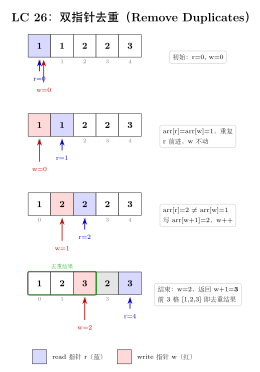
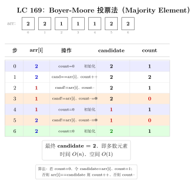
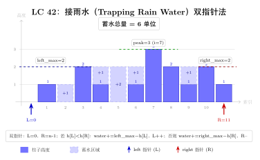

# 01 — Array / String（融合版）

> **难度**：★★☆☆☆
> **题数**：24
> **核心套路**：原地修改、单次扫描、贪心、字符串技巧
> **本文件**：覆盖 array_string 24 题的算法套路总结 + 典型题精讲 + 自测

---

## 一例速记

> **数组原地修改**：双指针（read/write）一次扫描，$O(n)$ 时间 $O(1)$ 空间（26、27、80、88）
> **多次扫描预计算**：前缀积/后缀积（238）、排序计数（274）、前缀余量（134）
> **Boyer-Moore 投票**：候选 + 计数，正负抵消（169）
> **数组旋转**：三次翻转（189）或环形替换，$O(1)$ 空间
> **贪心策略**：跳跃游戏维护最远可达（55/45）、加油站累计余量（134）、糖果双向扫描（135）
> **股票买卖**：单笔维护历史 min（121）、多笔累加上升段（122）
> **接雨水**：双指针 left/right 维护两侧最大高度（42）
> **字符串处理**：双指针对撞（151）、模拟（12/13/6/68）、KMP（28）、最长公共前缀（14）
> **随机化数据结构**：哈希表 + 动态数组（380）

---

## 思维路径还原

> "看到 **'in-place / O(1) space'** 提示 → 想双指针 write/read 模式：
> read 从左到右扫描，write 只在满足条件时前进。
> 26 题去重：read 比较 `nums[r]` 与 `nums[r-1]`，不等则写入 `nums[w++]`。
> 27 题移除元素：read 遇到非目标值才写。
> 80 题允许至多 2 次重复：把比较条件从 `nums[r] != nums[r-1]` 扩展为 `w < 2 or nums[r] != nums[w-2]`。
>
> 看到 **88 题合并两个有序数组**：从后往前写！nums1 末尾是空位，从大到小向后填，不会覆盖未读区域。
>
> 看到 **'majority / 出现 > n/2 次'** → Boyer-Moore 投票法：维护候选 cand 和计数 cnt，
> 遍历时 cnt==0 则换候选，同候选则 +1，否则 -1，最终剩下的 cand 就是多数元素（169）。
>
> 看到 **'股票买卖'** → 121 单笔：维护历史最低价 `min_price`，每次更新当前利润；
> 122 多笔：不需要状态机，所有相邻上升段（`prices[i] > prices[i-1]`）的差值累加。
>
> 看到 **'跳跃'** → 55 是否可达：贪心维护 `farthest`，遍历时若 `i > farthest` 则已无法前进；
> 45 最少跳数：BFS 思路，维护当前段终点 `end` 和下一段最远 `farthest`，到达 end 时跳数 +1。
>
> 看到 **'加油站 / 环形'** → 134：累计总余量 `total`，若为负则无解；贪心找起点：
> 一旦从某站出发累计余量为负，则起点后移到下一站，重置余量为 0。
>
> 看到 **'接雨水'** → 42：双指针 left/right，分别维护 `max_left` 和 `max_right`，
> 每次移动较低一侧（短板决定蓄水量），当前蓄水 = 两侧最大值的 min − 当前高度。
>
> 看到 **'字符串匹配 / needle in haystack'** → 28：用 KMP，预处理 needle 的 failure 数组 O(m)，
> 匹配 O(n)，总体 O(n+m) 而非暴力 O(nm)。
>
> 看到 **'前缀 / 除自身以外的乘积'** → 238：两次扫描，第一次从左算前缀积存入 res，
> 第二次从右乘后缀积，避免除法且 O(1) 额外空间（不含输出数组）。
>
> 看到 **'罗马数字'** → 12/13：贪心从大到小枚举（整数转罗马），或线性扫描逢小在大则减（罗马转整数）。
>
> 看到 **'文本对齐 / zigzag / 翻转单词'** → 模拟题，关键是细心处理边界：
> 68 最后一行左对齐；6 按行分组；151 先 split 再 reverse join。"

---

## 学习目标

- 掌握数组原地修改的双指针 read/write 模板及其变体
- 熟练运用贪心 + Boyer-Moore 投票 + 前缀积等单次扫描技巧
- 字符串题的结构化处理：KMP、双指针对撞、模拟
- 能识别"跳跃 / 加油站 / 接雨水"三类贪心题并直接套模板
- 掌握 h-index（274）和随机 O(1) 数据结构（380）的设计思路

---

## 几何示意

### 图 read/write 双指针（LC 26）



### 图 Boyer-Moore 投票（LC 169）



### 图 接雨水双指针（LC 42）



---
## 抽象成方法（标准模板代码）

### 套路 1：read/write 双指针（去重 / 移除）

适用题：26、27、80

```python
# 26: 升序数组去重，每元素保留 1 次
def remove_duplicates_once(nums: list[int]) -> int:
    w = 0
    for r in range(len(nums)):
        if r == 0 or nums[r] != nums[r - 1]:
            nums[w] = nums[r]
            w += 1
    return w


# 80: 升序数组去重，每元素至多保留 2 次
def remove_duplicates_twice(nums: list[int]) -> int:
    w = 0
    for r in range(len(nums)):
        if w < 2 or nums[r] != nums[w - 2]:
            nums[w] = nums[r]
            w += 1
    return w


# 27: 移除所有值为 val 的元素
def remove_element(nums: list[int], val: int) -> int:
    w = 0
    for r in range(len(nums)):
        if nums[r] != val:
            nums[w] = nums[r]
            w += 1
    return w
```

> 关键规律：`w < k or nums[r] != nums[w - k]` 可泛化为"保留至多 k 次"。

### 套路 2：从后向前合并（88 合并有序数组）

适用题：88

```python
def merge_sorted(nums1: list[int], m: int, nums2: list[int], n: int) -> None:
    """原地合并，从尾部向前填充避免覆盖未读区域。"""
    p1, p2, w = m - 1, n - 1, m + n - 1
    while p2 >= 0:
        if p1 >= 0 and nums1[p1] > nums2[p2]:
            nums1[w] = nums1[p1]
            p1 -= 1
        else:
            nums1[w] = nums2[p2]
            p2 -= 1
        w -= 1
```

### 套路 3：Boyer-Moore 投票法（多数元素）

适用题：169

```python
def majority_element(nums: list[int]) -> int:
    """找出出现次数 > n/2 的元素。时间 O(n)，空间 O(1)。"""
    cand, cnt = nums[0], 0
    for x in nums:
        if cnt == 0:
            cand = x
        cnt += 1 if x == cand else -1
    return cand
```

> 注意：该算法依赖多数元素必然存在的前提；若题目不保证则需第二次遍历验证。

### 套路 4：贪心维护最远可达（跳跃游戏）

适用题：55（判断可达）、45（最少跳数）

```python
# 55: 是否能到达末尾
def can_jump(nums: list[int]) -> bool:
    farthest = 0
    for i, jump in enumerate(nums):
        if i > farthest:
            return False
        farthest = max(farthest, i + jump)
    return True


# 45: 最少跳跃次数（贪心 BFS）
def jump_min(nums: list[int]) -> int:
    jumps = 0
    end = 0          # 当前"一跳"所能覆盖的最远终点
    farthest = 0     # 从当前段内任意点出发的最远覆盖
    for i in range(len(nums) - 1):
        farthest = max(farthest, i + nums[i])
        if i == end:
            jumps += 1
            end = farthest
    return jumps
```

### 套路 5：股票买卖贪心

适用题：121（单笔）、122（多笔）

```python
# 121: 只能买卖一次，求最大利润
def max_profit_once(prices: list[int]) -> int:
    min_price = float('inf')
    profit = 0
    for p in prices:
        min_price = min(min_price, p)
        profit = max(profit, p - min_price)
    return profit


# 122: 可以多次买卖，求最大利润（累加所有上升段）
def max_profit_multi(prices: list[int]) -> int:
    profit = 0
    for i in range(1, len(prices)):
        if prices[i] > prices[i - 1]:
            profit += prices[i] - prices[i - 1]
    return profit
```

### 套路 6：接雨水双指针

适用题：42

```python
def trap_rain(height: list[int]) -> int:
    """双指针，短板决定当前水位。时间 O(n)，空间 O(1)。"""
    left, right = 0, len(height) - 1
    max_left = max_right = 0
    water = 0
    while left < right:
        if height[left] <= height[right]:
            if height[left] >= max_left:
                max_left = height[left]
            else:
                water += max_left - height[left]
            left += 1
        else:
            if height[right] >= max_right:
                max_right = height[right]
            else:
                water += max_right - height[right]
            right -= 1
    return water
```

### 套路 7：前缀积 + 后缀积（除自身以外的乘积）

适用题：238

```python
def product_except_self(nums: list[int]) -> list[int]:
    """两次线性扫描，O(1) 额外空间（不含输出数组）。"""
    n = len(nums)
    res = [1] * n
    # 第一次：res[i] = nums[0] * ... * nums[i-1]
    prefix = 1
    for i in range(n):
        res[i] = prefix
        prefix *= nums[i]
    # 第二次：乘上 nums[i+1] * ... * nums[n-1]
    suffix = 1
    for i in range(n - 1, -1, -1):
        res[i] *= suffix
        suffix *= nums[i]
    return res
```

### 套路 8：KMP 字符串匹配

适用题：28

```python
def str_str_kmp(haystack: str, needle: str) -> int:
    """KMP 算法，时间 O(n+m)，空间 O(m)。"""
    if not needle:
        return 0
    # 构建 failure 数组（最长相同前后缀长度）
    m = len(needle)
    fail = [0] * m
    j = 0
    for i in range(1, m):
        while j > 0 and needle[i] != needle[j]:
            j = fail[j - 1]
        if needle[i] == needle[j]:
            j += 1
        fail[i] = j
    # 匹配
    j = 0
    for i, c in enumerate(haystack):
        while j > 0 and c != needle[j]:
            j = fail[j - 1]
        if c == needle[j]:
            j += 1
        if j == len(needle):
            return i - j + 1
    return -1
```

### 速查表

| 题型特征 | 套路 | 时间 | 空间 |
|---|---|---|---|
| 原地去重（每元素保留 1 次） | read/write 双指针 | $O(n)$ | $O(1)$ |
| 原地去重（至多 k 次）| `w < k or nums[r] != nums[w-k]` | $O(n)$ | $O(1)$ |
| 合并两有序数组（原地） | 从后向前双指针 | $O(m+n)$ | $O(1)$ |
| 多数元素（出现 > n/2） | Boyer-Moore 投票 | $O(n)$ | $O(1)$ |
| 单次股票最大利润 | 维护历史 min + 当前 profit | $O(n)$ | $O(1)$ |
| 多次股票最大利润 | 累加上升段差值 | $O(n)$ | $O(1)$ |
| 跳跃游戏（是否可达） | 贪心维护 farthest | $O(n)$ | $O(1)$ |
| 跳跃游戏（最少跳数） | 贪心 BFS，段终点更新 | $O(n)$ | $O(1)$ |
| 加油站（环形起点） | 累计余量 + 贪心起点 | $O(n)$ | $O(1)$ |
| 接雨水 | 双指针短板决定水位 | $O(n)$ | $O(1)$ |
| 除自身以外的乘积 | 前缀积 + 后缀积 | $O(n)$ | $O(1)$ |
| 字符串匹配 | KMP | $O(n+m)$ | $O(m)$ |
| 数组旋转 k 步 | 三次翻转 | $O(n)$ | $O(1)$ |

---

## 方法变形（4 类）

### 变形 1：原地修改系列

- **26**（每元素 1 次）→ **80**（至多 2 次）：条件从 `nums[r] != nums[r-1]` 改为 `w < 2 or nums[r] != nums[w-2]`；泛化为至多 k 次只需把 2 换成 k。
- **27**（移除指定值）：条件改为 `nums[r] != val`，write 指针同向推进。
- **88**（合并两数组）：逆向版 read/write，从末尾向前写，避免覆盖未处理元素。

### 变形 2：股票买卖系列

- **121**（单次）：维护历史最低价，O(n) 一次扫描。
- **122**（多次）：贪心累加所有相邻上升段，不需要显式的状态机。
- 进阶扩展（非本 category）：**309**（含冷却期）→ DP 三状态；**123**（至多 2 次）→ DP；**188**（至多 k 次）→ DP。

### 变形 3：跳跃游戏系列

- **55**（是否能到达）：只需判断当前 index 是否超过 farthest，返回 bool。
- **45**（最少跳数）：BFS 思路，当遍历指针触达当前"段终点"时，跳数 +1，段终点更新为目前已知的最远覆盖。
- 关键区分：55 关注"能否"，45 关注"多少次"；45 的 end 变量代表"必须在本次跳跃内解决"的边界。

### 变形 4：字符串重排系列

- **151**（翻转单词）：`s.split()` 自动处理多余空格，`' '.join(reversed(...))` 重组，Python 两行搞定；若要求原地则需先 reverse 整个数组再 reverse 每个单词。
- **6**（Zigzag 变换）：按行分组，维护 `row` 和方向 `direction`，遍历字符依次追加到对应行。
- **28**（字符串匹配）：暴力 O(nm) → KMP O(n+m)；Python 内置 `str.find` 即为优化后的实现。
- **68**（文本对齐）：模拟贪心分行，每行尽量多放单词；空格分配：`(maxWidth - 总字符数) // (间隙数)` 加余数分摊；最后一行左对齐。

---

## 思考路标（条件反射）

1. 看到 **"in-place / O(1) space"** + 有序数组 → 双指针 read/write
2. 看到 **"majority / 出现 > n/2"** → Boyer-Moore 投票法
3. 看到 **"product except self / 前缀积"** → 两次线性扫描，前缀积 + 后缀积
4. 看到 **"jump / 最远可达"** → 贪心维护 farthest；求最少次数时加段终点 end
5. 看到 **"gas station / 环形"** → 累计总余量判断有无解；贪心找起点
6. 看到 **"trapping water / 接雨水"** → 双指针，短板决定水位
7. 看到 **"find needle in haystack"** → KMP（O(n+m)）
8. 看到 **"h-index / 排名阈值"** → 降序排序后线性扫描，或计数数组 O(n)
9. 看到 **"O(1) insert / delete / getRandom"** → 哈希表（值 → 下标）+ 动态数组（380）
10. 看到 **"rotate array k steps"** → 三次 reverse：全 → 前 k → 后 n-k
11. 看到 **"sliding window"** 关键字 → 跳到 sliding_window category
12. 看到 **"two sum / 配对"** → 跳到 hash_table category
13. 看到 **"sorted array + binary"** → 跳到 binary_search category
14. 看到 **"Roman numerals"** → 贪心贪心：整数→罗马从大到小减；罗马→整数逢小在大则减

---

## 易错点

1. **read/write 边界**：`r == 0` 时无前驱可比，特判（或从 `r=1, w=1` 开始），否则数组长度为 0 时越界。
2. **Boyer-Moore 假设**：算法依赖"多数元素必然存在"；LeetCode 169 保证了这一点，但若题目不保证，必须第二轮遍历验证候选。
3. **股票 121 vs 122**：121 只能单次买卖，关键在维护历史最低价而非每日差值；122 多次买卖，每个上升段加总即可，不要把 122 的贪心用到 121 上。
4. **跳跃 55 vs 45**：55 一旦 `i > farthest` 立即返回 False；45 的 `end` 是当前跳跃段内必须完成的终点，循环到 `len-2` 而非 `len-1`（最后一步不需要再跳）。
5. **接雨水双指针方向**：移动较低一侧（不是较高一侧），因为较低一侧的水量由它自身决定（短板）；混淆移动方向会导致结果错误。
6. **189 旋转越界**：`k` 可能大于数组长度，务必先取 `k = k % n`，否则三次 reverse 的切分点错误。
7. **68 文本对齐最后一行**：最后一行不用均匀分散，直接单词间一个空格，末尾补齐 `maxWidth - used` 个空格，与普通行逻辑不同，需要单独处理。
8. **238 前缀积不用除法**：若数组含 0 则除法不可行；模板中使用两次乘法遍历天然规避了这一问题。
9. **KMP failure 数组**：`fail[0]` 恒为 0；构建时从 `i=1` 开始；匹配成功后 `j = fail[j-1]` 而非 `j = 0`，否则漏掉重叠匹配。
10. **380 交换删除**：删除时将目标元素与数组末尾元素交换，然后 `pop()`；记得同步更新哈希表中末尾元素的下标映射。

---

## 典型应用例题

### 例 1：26. Remove Duplicates from Sorted Array

**题目**：给定升序数组 `nums`，原地删除重复元素，使每个元素只出现一次，返回新长度 k，且 `nums[:k]` 按升序排列。

**思路**：read/write 双指针。write 指针 `w` 记录下一个可写位置，read 指针 `r` 扫描所有元素，遇到与前一个不同的元素才写入。

**解**：

```python
# 参考：solutions/array_string/p026_remove_duplicates_from_sorted_array.py
def removeDuplicates(nums: list[int]) -> int:
    if not nums:
        return 0
    w = 1
    for r in range(1, len(nums)):
        if nums[r] != nums[r - 1]:
            nums[w] = nums[r]
            w += 1
    return w
```

**分析**：$O(n)$ 时间，$O(1)$ 空间。`w` 从 1 开始（第一个元素无需判断），`r` 从 1 扫描到末尾，`nums[r] != nums[r-1]` 确保只在新值出现时写入。

**泛化到 80 题（至多保留 2 次）**：把写条件改为 `w < 2 or nums[r] != nums[w-2]`，即"write 指针还没写满 2 个，或当前值与 write 区域的倒数第二个不同"。参考 `solutions/array_string/p080_remove_duplicates_from_sorted_array_ii.py`。

---

### 例 2：169. Majority Element

**题目**：给定长度 n 的数组，找出出现次数超过 $\lfloor n/2 \rfloor$ 的元素（保证存在）。时间 $O(n)$，空间 $O(1)$。

**思路**：Boyer-Moore 投票法。多数元素与所有其他元素"对消"后仍有剩余。维护候选 `cand` 和计数 `cnt`：计数归零则换候选，同候选则 +1，否则 −1。

**解**：

```python
# 参考：solutions/array_string/p169_majority_element.py
def majorityElement(nums: list[int]) -> int:
    cand, cnt = nums[0], 0
    for x in nums:
        if cnt == 0:
            cand = x
        cnt += 1 if x == cand else -1
    return cand
```

**正确性直觉**：多数元素出现次数 $> n/2$，即使所有少数元素联合对消，多数元素依然"剩余"。若题目不保证多数存在，则需第二次遍历统计 `cand` 出现次数做验证。

---

### 例 3：134. Gas Station

**题目**：环形路上有 n 个加油站，第 i 站可以加 `gas[i]` 升油，从 i 开到 i+1 消耗 `cost[i]` 升。若能从某站出发绕一圈回到出发点，返回该站下标；若无解返回 −1。

**思路**：两个关键观察：
1. 若总油量 $\sum gas < \sum cost$，则无论从哪里出发都无法完成，返回 −1。
2. 若总量足够，贪心从"累计余量首次变负后的下一站"出发，即可保证绕行成功。

**解**：

```python
# 参考：solutions/array_string/p134_gas_station.py
def canCompleteCircuit(gas: list[int], cost: list[int]) -> int:
    total = 0    # 全局总余量
    tank = 0     # 从候选起点出发的累计余量
    start = 0    # 候选起点
    for i in range(len(gas)):
        diff = gas[i] - cost[i]
        total += diff
        tank += diff
        if tank < 0:       # 从 start 到 i 无法通过
            start = i + 1  # 起点后移
            tank = 0       # 重置余量
    return start if total >= 0 else -1
```

**为什么贪心起点正确**：若从 `start` 到 `i` 累计余量为负，说明 `start` 到 `i` 之间任意一个站点都不可能是起点（因为它们的前缀余量更差）；下一个候选只能是 `i+1`。若总余量 ≥ 0，贪心起点一定有效。

---

## 自测题

**自测 1**（27 题 Remove Element）—— 给定数组 `nums` 和值 `val`，原地移除所有等于 `val` 的元素，返回新长度。💡 提示：read/write 双指针，read 遇到目标值跳过不写，遇到其他值才写入 write 指针并后移。

**自测 2**（189 题 Rotate Array）—— 将数组向右旋转 k 步，要求 $O(1)$ 空间。💡 提示：先取 `k = k % n` 防越界，然后三次 reverse：先 reverse 全部，再 reverse 前 k 个，再 reverse 后 n-k 个。参考 `solutions/array_string/p189_rotate_array.py`。

**自测 3**（121 题 Best Time to Buy and Sell Stock）—— 数组 `prices[i]` 为第 i 天股价，只能买卖一次，求最大利润。💡 提示：维护历史最低价 `min_price`，遍历时 `profit = max(profit, price - min_price)`，不要用双重循环暴力 $O(n^2)$。参考 `solutions/array_string/p121_best_time_to_buy_and_sell_stock.py`。

**自测 4**（45 题 Jump Game II）—— 数组 `nums[i]` 为第 i 格最大跳跃步数，从下标 0 出发，求到达最后一格的最少跳跃次数（保证可达）。💡 提示：贪心 BFS，维护 `end`（当前跳跃段终点）和 `farthest`（当前段内可达最远），遍历到 `end` 时跳数 +1 并更新 `end = farthest`。参考 `solutions/array_string/p045_jump_game_ii.py`。

**自测 5**（42 题 Trapping Rain Water）—— 给定高度数组，求能接住的雨水总量，要求 $O(n)$ 时间 $O(1)$ 空间。💡 提示：双指针 `left`/`right` 从两端向中间移，分别维护 `max_left` 和 `max_right`，每次移动较低一侧，当前蓄水 = 该侧最大值 − 当前高度。参考 `solutions/array_string/p042_trapping_rain_water.py`。

**自测 6**（274 题 H-Index）—— 给定引用次数数组，求 h-index（至少有 h 篇论文各被引 ≥ h 次的最大 h）。💡 提示：降序排序后线性扫描，`citations[i] >= i+1` 则 h 至少为 `i+1`；或用计数数组 O(n) 从大到小累积。参考 `solutions/array_string/p274_h_index.py`。

**自测 7**（380 题 Insert Delete GetRandom O(1)）—— 设计数据结构支持 O(1) 的插入、删除、随机返回。💡 提示：哈希表存 `val → index`，动态数组存元素；删除时把目标元素与末尾元素交换再 `pop()`，记得更新哈希表中末尾元素的新下标。参考 `solutions/array_string/p380_insert_delete_getrandom_o1.py`。

---

## 题目全览（24 题）

| # | 题目 | 套路分类 | 难度 |
|---|---|---|---|
| 88 | Merge Sorted Array | 从后向前双指针 | Easy |
| 27 | Remove Element | read/write 双指针 | Easy |
| 26 | Remove Duplicates from Sorted Array | read/write 双指针 | Easy |
| 80 | Remove Duplicates II（至多 2 次） | read/write 双指针变体 | Medium |
| 169 | Majority Element | Boyer-Moore 投票 | Easy |
| 189 | Rotate Array | 三次 reverse | Medium |
| 121 | Best Time to Buy and Sell Stock | 贪心维护最小值 | Easy |
| 122 | Best Time to Buy and Sell Stock II | 贪心累加上升段 | Medium |
| 55 | Jump Game | 贪心维护 farthest | Medium |
| 45 | Jump Game II | 贪心 BFS + 段终点 | Medium |
| 274 | H-Index | 排序 + 线性扫描 | Medium |
| 380 | Insert Delete GetRandom O(1) | 哈希表 + 动态数组 | Medium |
| 238 | Product of Array Except Self | 前缀积 + 后缀积 | Medium |
| 134 | Gas Station | 贪心累计余量 | Medium |
| 135 | Candy | 双向贪心扫描 | Hard |
| 42 | Trapping Rain Water | 双指针短板 | Hard |
| 13 | Roman to Integer | 线性扫描逢小在大则减 | Easy |
| 12 | Integer to Roman | 贪心从大到小枚举 | Medium |
| 58 | Length of Last Word | 从末尾跳过空格 | Easy |
| 14 | Longest Common Prefix | 逐字符对比或排序取首尾 | Easy |
| 151 | Reverse Words in a String | split + reverse join | Medium |
| 6 | Zigzag Conversion | 按行分组模拟 | Medium |
| 28 | Find the Index of First Occurrence | KMP | Easy |
| 68 | Text Justification | 贪心分行 + 空格分配 | Hard |

---

## 融合版说明

| 段 | 来源 | 价值 |
|---|---|---|
| 一例速记 | 本文件 | 24 题套路一览，扫一眼知道要用什么 |
| 思维路径还原 | 本文件 | 从题目到代码的解题内心独白，模拟实战 |
| 抽象成方法 | 本文件 | 8 个标准模板代码 + 速查表，可直接运行 |
| 方法变形 | 本文件 | 4 类变体扩展，覆盖系列题横向联系 |
| 思考路标 | 本文件 | 14 条题型识别条件反射，含跨 category 跳转 |
| 易错点 | 本文件 | 10 条高频踩坑，每条对应具体题目 |
| 典型应用例题 | solutions/ | 3 道精讲（26、169、134），代码 + 正确性分析 |
| 自测题 | leetcode | 7 题带 💡 提示，链接 solutions 文件 |
| 题目全览 | 本文件 | 24 题完整列表，套路分类一览 |
