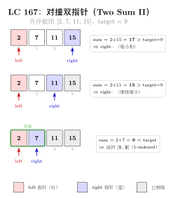
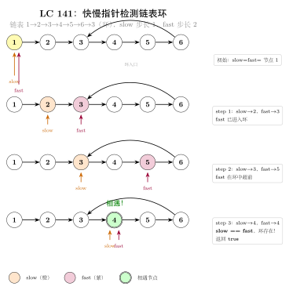

# 02 — Two Pointers（融合版）

> **难度**：★★☆☆☆
> **题数**：5
> **核心套路**：对撞双指针、三指针（固定 + 对撞）、快慢双指针
> **本文件**：覆盖 two_pointers 5 题的算法套路总结 + 典型题精讲 + 自测

---

## 一例速记

> **对撞双指针**（头尾相向）：left/right 从两端向中间收缩，利用有序 / 对称性一次扫描，$O(n)$ 时间 $O(1)$ 空间（125 / 167 / 11）
> **跳过无效字符**：内层 while 跳过不符条件的元素，外层统一做判断（125 回文校验）
> **短板决定贡献**：面积 = 宽度 × min(左高, 右高)，移动较低一侧才有机会变大（11 盛水）
> **三指针 = 排序 + 固定 i + 对撞**：先排序，枚举固定值，内层对撞找互补对；三处去重避免重复三元组（15 三数之和）
> **快慢双指针**：slow 追 fast，fast 每遇一个匹配字符就前进；slow 独立推进，两指针速度不等（392 子序列）
> **vs 暴力**：暴力嵌套循环 $O(n^2)$，双指针单次扫描 $O(n)$；三指针 $O(n^2)$ 对比暴力 $O(n^3)$

---

## 思维路径还原

> "看到 **125 Valid Palindrome**：字符串回文校验，但要忽略非字母数字字符、大小写不敏感 →
> 对撞双指针，left 从左找第一个 alnum，right 从右找第一个 alnum，
> 用内层 while 跳过非 alnum 字符，再做 `s[left].lower() != s[right].lower()` 比较；
> 不匹配立即返回 False，匹配则 left++, right--；
> 关键：空字符串 / 全符号字符串在 left >= right 时直接返回 True，无需额外判断。
>
> 看到 **167 Two Sum II（有序数组）**：数组已排序，找两数之和等于 target →
> 对撞双指针，两端收缩。sum < target 则 left++（增大），sum > target 则 right--（减小）。
> 与哈希表 O(n) 空间的 Two Sum I 不同，有序数组让我们用 O(1) 空间。
> 题目保证恰好一个解，所以 while left < right 一定能命中，不用担心无解。
>
> 看到 **11 Container With Most Water**：height 数组，找两条线使容纳水最多 →
> 面积 = (right - left) × min(height[left], height[right])。
> 移动较高一侧无法增大面积（高度已被较低一侧决定，宽度只会减小）；
> 移动较低一侧有可能找到更高的线从而增大面积。
> 因此：height[left] < height[right] 则 left++，否则 right--。
>
> 看到 **15 3Sum**：找所有不重复的三元组使之和为 0 →
> 暴力 O(n³) 不行。先排序，枚举固定值 nums[i]（i 从 0 到 n-3），
> 内层对撞双指针在 [i+1, n-1] 找两数之和 = -nums[i]；
> 去重有三处：① 固定值 nums[i] == nums[i-1] 则 continue；
> ② 找到解后 left++ / right-- 并继续跳过重复的 nums[left] / nums[right]；
> 若 nums[i] > 0 则直接 break（排序后右侧都更大，不可能为 0）。
>
> 看到 **392 Is Subsequence**：判断 s 是否是 t 的子序列 →
> 快慢双指针：s_index 追踪 s 的匹配进度（慢指针），遍历 t 的每个字符（快指针）；
> 遇到匹配字符 s_index++；遍历完 t 后若 s_index == len(s) 则 s 完全匹配。
> 两指针移动速度不同：t 每步必走，s 只在匹配时走。
> 进阶：若有大量 s 要验证同一个 t，可对 t 建字符位置索引后用二分查找。"

---

## 学习目标

- 掌握对撞双指针模板及"移动哪一侧"的判断逻辑
- 理解"三指针 = 排序 + 固定 + 对撞"的组合套路及三处去重细节
- 能用快慢双指针处理子序列匹配问题
- 理解双指针从 $O(n^2)$ 到 $O(n)$ 的复杂度降低原因
- 识别"有序数组 + 两数之和"与"无序数组 + 哈希表"的适用场景差异

---

## 几何示意

### 图 对撞双指针（LC 167 Two Sum II）



### 图 快慢指针检测环（LC 141）



---
## 抽象成方法（标准模板代码）

### 套路 1：对撞双指针（基础）

适用题：167（有序数组 Two Sum）、11（盛最多水）

```python
# 167: 有序数组中找两数之和等于 target
def two_sum_sorted(numbers: list[int], target: int) -> list[int]:
    """时间 O(n)，空间 O(1)。返回 1-indexed 下标。"""
    left, right = 0, len(numbers) - 1
    while left < right:
        s = numbers[left] + numbers[right]
        if s == target:
            return [left + 1, right + 1]
        if s < target:
            left += 1   # 和偏小，左指针右移增大和
        else:
            right -= 1  # 和偏大，右指针左移减小和
    raise ValueError("no solution")


# 11: 找两条线使容器容水最多
def max_area(height: list[int]) -> int:
    """时间 O(n)，空间 O(1)。"""
    left, right = 0, len(height) - 1
    best = 0
    while left < right:
        h = min(height[left], height[right])
        best = max(best, (right - left) * h)
        if height[left] < height[right]:
            left += 1   # 移动较低一侧才有可能提升高度
        else:
            right -= 1
    return best
```

> 关键规律：对撞双指针移动方向取决于"当前值与目标的偏差"；11 中移动较低一侧是因为宽度必然减小，只有拔高才可能补偿。

### 套路 2：对撞双指针（带过滤）

适用题：125（回文校验，跳过非 alnum）

```python
def is_palindrome(s: str) -> bool:
    """时间 O(n)，空间 O(1)。跳过非字母数字字符，大小写不敏感。"""
    left, right = 0, len(s) - 1
    while left < right:
        # 跳过左侧非 alnum
        while left < right and not s[left].isalnum():
            left += 1
        # 跳过右侧非 alnum
        while left < right and not s[right].isalnum():
            right -= 1
        # 当前对位字符不匹配则直接判假
        if s[left].lower() != s[right].lower():
            return False
        left += 1
        right -= 1
    return True
```

> 内层 while 必须带 `left < right` 守卫，防止全为符号时指针越界交叉后仍继续执行。

### 套路 3：三指针（固定 + 对撞）

适用题：15（3Sum）

```python
def three_sum(nums: list[int]) -> list[list[int]]:
    """时间 O(n²)，空间 O(1)（不含输出）。找所有和为 0 的不重复三元组。"""
    nums.sort()
    result: list[list[int]] = []
    for i in range(len(nums) - 2):
        # 去重 1：固定值与前一个相同则跳过
        if i > 0 and nums[i] == nums[i - 1]:
            continue
        # 剪枝：最小值已 > 0，后续三数之和必 > 0
        if nums[i] > 0:
            break
        left, right = i + 1, len(nums) - 1
        while left < right:
            s = nums[i] + nums[left] + nums[right]
            if s == 0:
                result.append([nums[i], nums[left], nums[right]])
                left += 1
                right -= 1
                # 去重 2 & 3：找到解后跳过重复的 left / right
                while left < right and nums[left] == nums[left - 1]:
                    left += 1
                while left < right and nums[right] == nums[right + 1]:
                    right -= 1
            elif s < 0:
                left += 1
            else:
                right -= 1
    return result
```

### 套路 4：快慢双指针（子序列匹配）

适用题：392（Is Subsequence）

```python
def is_subsequence(s: str, t: str) -> bool:
    """时间 O(n)，空间 O(1)。s 慢指针只在匹配时推进，t 快指针每步必走。"""
    s_idx = 0
    for ch in t:
        if s_idx == len(s):
            break          # s 已全部匹配，提前退出
        if s[s_idx] == ch:
            s_idx += 1
    return s_idx == len(s)
```

> 进阶（大量 s 验证同一 t）：预处理 t 的字符位置字典 `pos[c] = sorted list of indices`，对每个字符用二分查找（bisect_left）找最近可匹配位置，总体 $O(|t| + k \cdot |s| \log |t|)$。

### 速查表

| 题型特征 | 套路 | 时间 | 空间 | 对应题目 |
|---|---|---|---|---|
| 有序数组找两数之和 | 对撞双指针，偏小左移偏大右移 | $O(n)$ | $O(1)$ | 167 |
| 字符串回文校验（含噪声） | 对撞 + 内层 while 过滤 | $O(n)$ | $O(1)$ | 125 |
| 两线段围成最大面积 | 对撞，移动较低一侧 | $O(n)$ | $O(1)$ | 11 |
| 无序数组三元组之和为 0 | 排序 + 固定 i + 内层对撞 | $O(n^2)$ | $O(1)$ | 15 |
| 判断 s 是否为 t 的子序列 | 快慢双指针，慢针跟匹配走 | $O(n)$ | $O(1)$ | 392 |
| 大量子序列查询同一 t | 预处理位置索引 + 二分 | $O(\vert t \vert + k\vert s \vert \log \vert t \vert)$ | $O(\vert t \vert)$ | 392 进阶 |
| 无序数组两数之和（允许哈希） | 哈希表存余数 | $O(n)$ | $O(n)$ | 1（hash 类） |
| 有序数组，找满足条件的所有对 | 对撞，收集所有满足的配对 | $O(n)$ | $O(1)$ | 通式 |

---

## 方法变形（4 类）

### 变形 1：对撞双指针扩展系列

- **基础**（167）：有序数组两数之和，$O(1)$ 空间替代哈希表。
- **带过滤**（125）：内层 while 跳过无效字符，模式可泛化为"在对撞过程中跳过特定元素"。
- **面积最大化**（11）：不是找目标值而是维护最优解；"移动较低一侧"是单调性贪心的核心。
- **进阶**（42 接雨水，属 array_string）：同样是双端收缩 + 两侧最大值维护，但每步更新蓄水量而非面积。

### 变形 2：三指针系列（nSum 通式）

- **3Sum → 4Sum**（18，非本 category）：外层再套一个固定指针，变成 $O(n^3)$；nSum 通用递归模板：固定最外层，递归降维到 2Sum。
- **3Sum Closest**（16）：同样排序 + 固定 + 对撞，只是判断条件从 `== 0` 改为维护 `abs(diff)` 最小值，找到完美匹配可提前退出。
- **去重三关卡**：固定值去重（i > 0 判断）、解后 left 去重、解后 right 去重；缺任何一关都会产生重复三元组。

### 变形 3：快慢双指针系列

- **392 子序列**：s 是 t 的子序列（字符顺序匹配，无需连续）。
- **链表相关**（141 环检测、876 中点）：slow 每次走 1 步，fast 每次走 2 步；环检测看是否追上，求中点看 fast 何时到达末尾。
- **滑动窗口退化**：当 slow 移动条件简单到"每次匹配才移动"时，快慢指针与可变滑动窗口本质相同；392 也可理解为窗口大小不固定的滑动窗口。

### 变形 4：预处理优化

- **392 进阶**（海量 s 查询同一 t）：对 t 建字典 `pos = defaultdict(list)`，`pos[c].append(i)`；验证 s 时对每个字符用 `bisect_left` 找 `>= cur_pos` 的最小下标，推进 `cur_pos`。
- **167 进阶**（需要所有对）：题目保证唯一解，但若需要所有对则用哈希表存余数；有序 + 唯一解时双指针更优。
- **125 进阶**（判断最长回文子串）：中心扩展（奇偶两种中心），可以理解为"反向对撞"——从中心向外扩展而非从两端向内收缩。
- **AI 类比**：对撞双指针 ≈ 双向束搜索（Bidirectional BFS）——从两端同时推进，在中间汇合，把搜索空间从 $O(b^d)$ 压缩到 $O(b^{d/2})$；快慢双指针的"速度差" ≈ 在线算法中的"延迟缓冲"机制，慢指针维护已确认的状态，快指针探索新输入。

---

## 思考路标（条件反射）

1. 看到 **有序数组 + 找两数之和** → 对撞双指针，$O(n)$ $O(1)$；无序时才用哈希表
2. 看到 **回文校验 + 忽略非字母数字** → 对撞 + 内层 while 过滤，`isalnum()` + `lower()`
3. 看到 **两侧围住 / 容积 / 面积最大化** → 对撞双指针，移动"不利"（较低/较小）的一侧
4. 看到 **三数之和 / nSum = target** → 排序 + 固定外层 + 内层对撞，注意三处去重
5. 看到 **s 是否为 t 的子序列** → 快慢双指针；大量查询则预处理 t 的位置索引 + 二分
6. 看到 **对撞双指针，不知道移动哪侧** → 问自己"移动较优一侧能得到更好结果吗？"——通常不能，移动较差一侧才是正确方向
7. 看到 **in-place O(1) 空间 + 有序** → 先考虑 read/write 双指针（array_string 套路）；若涉及配对则对撞
8. 看到 **数组已排序 + 找多数组合** → 外层枚举 + 内层对撞，时间 $O(n^{k-1})$ 对比暴力 $O(n^k)$
9. 看到 **最长 / 最短子串 + 连续** → 优先考虑滑动窗口（sliding_window category），不是双指针
10. 看到 **链表中间 / 链表环** → 快慢指针，slow × 1，fast × 2
11. 看到 **palindrome + expand from center** → 中心扩展，奇偶各一次，$O(n^2)$；Manacher 算法 $O(n)$
12. 看到 **3Sum 超时** → 检查是否漏了 `nums[i] > 0` 的 break 剪枝，以及三处去重
13. 看到 **子序列而非子串** → 元素可不连续，快慢指针；子串要求连续，用滑动窗口

---

## 易错点

1. **对撞双指针内层 while 缺少边界守卫**：125 题跳过非 alnum 时，内层 `while not s[left].isalnum()` 必须带 `left < right`；若字符串全为符号，不带守卫会导致 left > right 后仍继续执行，产生错误比较。
2. **11 题移动方向**：移动较高一侧是错误的——高度由短板决定，宽度还在减小，面积只会更小；必须移动较低一侧（height[left] < height[right] 则 left++，否则 right--；等高时移动哪侧都行）。
3. **15 题三处去重缺一不可**：① 固定值 `if i > 0 and nums[i] == nums[i-1]: continue`，② 找到解后 `while nums[left] == nums[left-1]: left++`，③ `while nums[right] == nums[right+1]: right--`；只做其中一两处会漏掉或多出重复三元组。
4. **15 题去重检查方向**：找到解后 left++ / right-- 之后再做去重时，比较的是 `nums[left] == nums[left-1]`（新 left 与刚用过的 left）而非 `nums[left] == nums[left+1]`；方向写反会跳过正确答案。
5. **392 题返回条件**：循环结束后返回 `s_idx == len(s)` 而非 `s_idx >= len(s)` 或者在循环内 return True——因为 s 可能是空字符串（空串是任何字符串的子序列，此时 `s_idx == 0 == len(s)` 正确返回 True）。
6. **167 题下标偏移**：题目要求返回 1-indexed 答案，即 `[left + 1, right + 1]`；若直接返回 `[left, right]` 会错位。
7. **15 题剪枝位置**：`if nums[i] > 0: break` 需要放在内层对撞之前（当 fixed 已大于 0，后续所有三元组之和必然 > 0）；若放到内层会漏掉部分计算。
8. **对撞双指针的单调性前提**：对撞双指针有效的核心是"移动一侧能单调改变当前量"——167 中移动 left 单调增大 sum，移动 right 单调减小 sum；11 中移动任意一侧宽度单调减小。若数组无序且题目不满足单调性，对撞双指针不能直接使用，需先排序或换哈希表方案。
9. **125 题输入边界**：空字符串 `s = ""` 或全为标点 `s = "!!!"` 时，left/right 内层 while 执行后 `left >= right`，外层 while 条件为假，直接返回 True（正确——空字符串和清洗后为空的字符串均视为回文）；不要在函数开头特判 `if not s: return True`，逻辑已经自然覆盖。

---

## 典型应用例题

### 例 1：125. Valid Palindrome

**题目**：给定字符串 `s`，只保留字母和数字（忽略大小写），判断是否为回文串。

**思路**：对撞双指针。left/right 从两端向中间收缩，内层 while 跳过非 alnum 字符，然后对当前对位字符做大小写不敏感比较。

**解**：

```python
# 参考：solutions/two_pointers/p125_valid_palindrome.py
def isPalindrome(s: str) -> bool:
    left, right = 0, len(s) - 1
    while left < right:
        while left < right and not s[left].isalnum():
            left += 1
        while left < right and not s[right].isalnum():
            right -= 1
        if s[left].lower() != s[right].lower():
            return False
        left += 1
        right -= 1
    return True
```

**分析**：$O(n)$ 时间，$O(1)$ 空间。每个字符最多被访问两次（一次被内层 while 跳过，一次被外层比较）。与"先过滤再比较"的 $O(n)$ 空间方案等价，但省去了额外列表。

---

### 例 2：15. 3Sum

**题目**：给定整数数组 `nums`，找出所有和为 0 的不重复三元组，返回其列表。

**思路**：先排序，外层枚举固定值 nums[i]，内层对撞双指针在剩余区间找两数之和为 `-nums[i]`；三处去重保证无重复三元组。

**解**：

```python
# 参考：solutions/two_pointers/p015_3sum.py
def threeSum(nums: list[int]) -> list[list[int]]:
    nums.sort()
    result: list[list[int]] = []
    for i in range(len(nums) - 2):
        if i > 0 and nums[i] == nums[i - 1]:  # 去重 1
            continue
        if nums[i] > 0:
            break                              # 剪枝
        left, right = i + 1, len(nums) - 1
        while left < right:
            s = nums[i] + nums[left] + nums[right]
            if s == 0:
                result.append([nums[i], nums[left], nums[right]])
                left += 1; right -= 1
                while left < right and nums[left] == nums[left - 1]:
                    left += 1                  # 去重 2
                while left < right and nums[right] == nums[right + 1]:
                    right -= 1                 # 去重 3
            elif s < 0:
                left += 1
            else:
                right -= 1
    return result
```

**复杂度**：$O(n^2)$ 时间（排序 $O(n \log n)$ + 外层 $O(n)$ × 内层 $O(n)$），$O(1)$ 额外空间（不含输出）。比暴力三重循环 $O(n^3)$ 快一个数量级。

**去重正确性**：排序后相同值连续排列，跳过固定值的重复保证外层不重，跳过 left/right 的重复保证内层不重；三关缺一会产生重复三元组。

---

### 例 3：11. Container With Most Water

**题目**：给定高度数组 `height`，选两条线使之与 x 轴构成的容器容水最多，返回最大水量。

**思路**：面积 = 宽度 × min(两端高度)。对撞双指针，每次移动较低一侧：因为宽度在收缩，若移动较高一侧，高度上限不变甚至变低，面积只会变小；移动较低一侧才有可能找到更高的线来补偿宽度损失。

**解**：

```python
# 参考：solutions/two_pointers/p011_container_with_most_water.py
def maxArea(height: list[int]) -> int:
    left, right = 0, len(height) - 1
    best = 0
    while left < right:
        w = right - left
        h = min(height[left], height[right])
        best = max(best, w * h)
        if height[left] < height[right]:
            left += 1
        else:
            right -= 1
    return best
```

**贪心正确性**：设当前 height[left] < height[right]，则固定 right 时最优面积已经是 `(right - left) × height[left]`；right 左移只会让宽度更小且高度上限不升，故 right 这个选项已被穷尽，移动 left 是唯一有意义的选择。

---

## 自测题

**自测 1**（167 题 Two Sum II）—— 给定升序数组 `numbers` 和目标 `target`，找两数下标（1-indexed）使之和为 target。不允许使用哈希表。💡 提示：对撞双指针，sum < target 则 left++，sum > target 则 right--，命中返回 [left+1, right+1]。

**自测 2**（125 题 Valid Palindrome）—— 判断字符串（含空格和标点）是否为回文，忽略非 alnum 字符，大小写不敏感。如"A man, a plan, a canal: Panama"应返回 True。💡 提示：对撞 + 内层 while 跳过非 alnum，注意内层 while 必须带 `left < right` 守卫。参考 `solutions/two_pointers/p125_valid_palindrome.py`。

**自测 3**（11 题 Container With Most Water）—— 给定 `height = [1,8,6,2,5,4,8,3,7]`，求最大容水量。💡 提示：对撞双指针，移动较低一侧（不是较高一侧），维护 best = max(best, (right-left) × min(h[left], h[right]))。参考 `solutions/two_pointers/p011_container_with_most_water.py`。

**自测 4**（15 题 3Sum）—— 给定 `nums = [-1, 0, 1, 2, -1, -4]`，找所有和为 0 的不重复三元组。💡 提示：排序后固定 i，内层对撞；三处去重：固定值去重、left 去重、right 去重；`nums[i] > 0` 时 break 剪枝。参考 `solutions/two_pointers/p015_3sum.py`。

**自测 5**（392 题 Is Subsequence）—— 判断 `s = "ace"` 是否为 `t = "abcde"` 的子序列（字符顺序匹配，无需连续）。💡 提示：快慢双指针，遍历 t 的每个字符（快），只有在 `t[i] == s[s_idx]` 时 s_idx 才推进（慢）；循环结束后返回 `s_idx == len(s)`。参考 `solutions/two_pointers/p392_is_subsequence.py`。

---

## 题目全览（5 题）

| # | 题目 | 套路分类 | 难度 |
|---|---|---|---|
| 125 | Valid Palindrome | 对撞双指针 + 字符过滤 | Easy |
| 167 | Two Sum II — Input Array Is Sorted | 对撞双指针 | Medium |
| 11 | Container With Most Water | 对撞双指针，移动较低侧 | Medium |
| 15 | 3Sum | 排序 + 固定 + 对撞，三处去重 | Medium |
| 392 | Is Subsequence | 快慢双指针 | Easy |

---

## 融合版说明

| 段 | 来源 | 价值 |
|---|---|---|
| 一例速记 | 本文件 | 3 类套路一览，对比暴力复杂度 |
| 思维路径还原 | 本文件 | 5 题解题内心独白，含关键决策点 |
| 抽象成方法 | 本文件 | 4 个标准模板代码 + 速查表，可直接运行 |
| 方法变形 | 本文件 | 4 类变体扩展（nSum / 链表 / 预处理优化 / AI 类比） |
| 思考路标 | 本文件 | 13 条题型识别条件反射，含跨 category 跳转 |
| 易错点 | 本文件 | 9 条高频踩坑，每条对应具体题目 |
| 典型应用例题 | solutions/ | 3 道精讲（125、15、11），代码 + 正确性分析 |
| 自测题 | leetcode | 5 题带 💡 提示，链接 solutions 文件 |
| 题目全览 | 本文件 | 5 题完整列表，套路分类一览 |

---

> **跨 category 导航**：
> - 双指针用于 **连续子串 / 子数组** 问题时，通常升级为滑动窗口 → 见 `03-sliding-window.md`
> - 有序数组 + 二分查找比双指针更快（子问题可缩减到 $O(\log n)$）→ 见 `04-binary-search.md`（待写）
> - 链表的快慢指针（环、中点）→ 见 `linked_list` category（待写）
